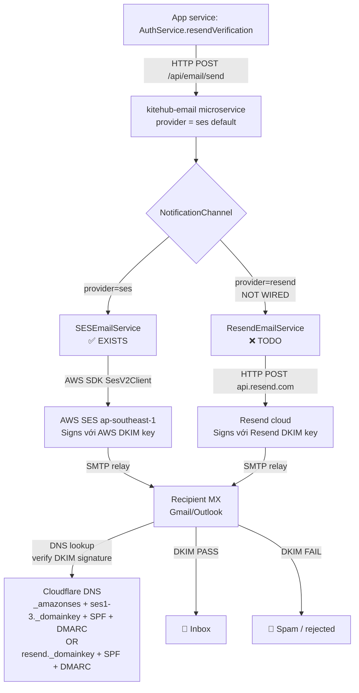
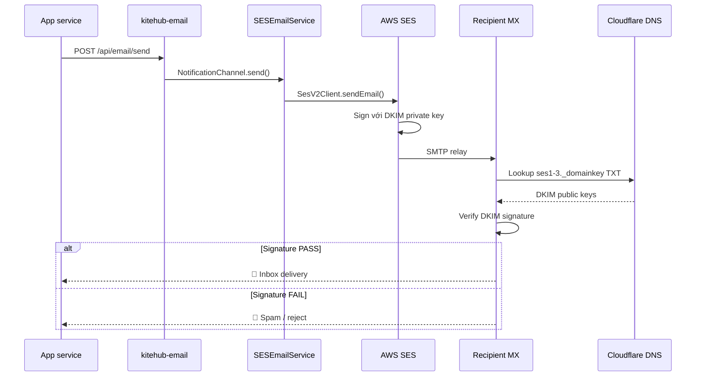

---
paths:
  - "documents/**/*.md"
  - ".claude/rules/**/*.md"
  - ".claude/skills/**/*.md"
  - "**/README.md"
---

# Diagram Format Selection — Mermaid / PlantUML / ASCII per use case

**Priority:** 🟠 MANDATORY — documentation visual-aid governance
**Version:** 1.0.1
**Created:** 2026-05-18
**Last-Reviewed:** 2026-05-19
**Reviewer-Approver:** @nguyenvankiet (solo-dev — MINOR self-approve per `rule-change-process.md` §5; new rule với built-in enforcement (selection matrix + reviewer-checklist + self-test rewriting `email-architecture.md` ASCII → Mermaid same PR) per §6.5 Enforcement Parity Mandate; no constraint loosening — codifies previously-implicit "use right tool for right diagram" guidance; existing ASCII diagrams grandfathered cho tới next refresh per `rule-change-process.md` Phase 3 strip pattern)
**Applies to:** Mọi markdown file dưới `documents/**`, `.claude/rules/**`, `.claude/skills/**`, và root README.md có chứa diagram (flowchart, sequence, ER, class, state, gantt, pie, hoặc architecture box-arrow visualization). Scope = nội dung diagram content; KHÔNG cover screenshots/PNG, photos, hoặc icon emoji.

---

## 1. The Rule

> **Khi cần diagram trong markdown, PHẢI pick ĐÚNG MỘT trong 3 format (Mermaid / PlantUML / ASCII) theo §2 selection matrix. Plain ASCII box-drawing chấp nhận CHỈ cho simple flow (≤5 node) hoặc khi target renderer không support Mermaid.**

Email architecture diagram 2026-05-18 (`documents/02-architecture/email-architecture.md`) dùng plain ASCII với ~30 node trong khi GitHub native render Mermaid → reader phải đọc text art thay vì xem rendered diagram. Recurrence #5 user-catch pattern: "không phải text thuần như báo cáo kiến trúc email vừa rồi". Rule này codify selection criteria để tránh lặp.

Force-multiplier: 1 quyết định format đúng → mọi reader tương lai xem rendered diagram thay vì decode ASCII text → comprehension time giảm ~5x.

---

## 2. Format selection matrix

### 2.1 Decision flow (3 questions)

1. **Diagram type là gì?**
2. **Renderer support Mermaid không?** (GitHub ✅ / GitLab ✅ / Notion ✅ / Obsidian ✅ / VS Code preview ✅ — đa số ✅)
3. **Số node + complexity?**

### 2.2 Per-type recommendation

| Diagram type | Recommended | Fallback | Khi nào dùng ASCII |
|---|---|---|---|
| **Flowchart / decision tree** | **Mermaid** `flowchart TD/LR` | PlantUML | ≤5 node, linear flow |
| **Sequence (interaction over time)** | **Mermaid** `sequenceDiagram` | PlantUML | ≤3 actor + ≤5 message |
| **ER (entity-relationship)** | **Mermaid** `erDiagram` | PlantUML | Hiếm — usually need crow's foot |
| **Class / object** | **Mermaid** `classDiagram` | PlantUML | Hiếm |
| **State machine** | **Mermaid** `stateDiagram-v2` | PlantUML | Hiếm |
| **Gantt timeline** | **Mermaid** `gantt` | — | KHÔNG — Gantt cần actual rendering |
| **Pie chart** | **Mermaid** `pie` | — | KHÔNG |
| **Architecture (box + arrow)** | **Mermaid** `flowchart TB/LR` | PlantUML | ≤5 box, simple data flow |
| **Network topology / cluster** | **Mermaid** `flowchart` với subgraph | PlantUML deployment | Hiếm |
| **CI/CD pipeline** | **PlantUML** | Mermaid | ≤5 step, no swimlane |
| **C4 model (Context/Container/Component)** | **PlantUML** với C4-PlantUML | Mermaid `C4Context` (limited) | KHÔNG — C4 cần PlantUML-quality |
| **Quick inline reference** | **ASCII** | — | Đây CHÍNH LÀ use case duy nhất cho ASCII trong rule này |

### 2.3 Format characteristics

| | Mermaid | PlantUML | ASCII / Unicode |
|---|---|---|---|
| GitHub native render | ✅ (since 2026 H1) | ❌ (cần external server) | ✅ (raw text) |
| GitLab native render | ✅ | ✅ (built-in) | ✅ |
| Notion / Obsidian | ✅ | ✅ (plugin) | ✅ |
| VS Code preview | ✅ (built-in) | ✅ (extension) | ✅ |
| Print PDF | ✅ | ✅ | ⚠️ (font-dependent) |
| Cú pháp đơn giản | ✅ | Trung bình | ✅ |
| Loại diagram | Nhiều (10+) | Rất nhiều (15+) | Đơn giản |
| Maintenance khi sửa | ✅ Edit text | ✅ Edit text | ❌ Re-flow toàn diagram |
| Diff readability | ✅ | ✅ | ❌ (whitespace nhạy cảm) |
| Cần tool external | Không | Cần server hoặc plugin | Không |

### 2.4 Default preference

**Default = Mermaid**, vì:
- Native render trên GitHub (project primary remote)
- Cú pháp đơn giản hơn PlantUML cho most cases
- Diff-friendly (text + indentation)
- Edit easier (single text block)
- Đa số diagram types supported

**Chỉ pick PlantUML khi:**
- C4 model (Context/Container/Component) — PlantUML có C4-PlantUML library mature
- Detailed deployment diagram với nhiều stereotype
- Complex sequence với group/loop/alt sophistic
- Existing PlantUML pipeline trong dự án (vd `documents/06-diagrams/plantuml/`)

**Chỉ pick ASCII khi:**
- Diagram ≤5 node + ≤8 arrow (inline reference)
- Target renderer KHÔNG support Mermaid (rare in 2026)
- Code comment trong source file (ASCII more grep-able)

---

## 3. Example: Email send flow

### ❌ Anti-pattern (current email-architecture.md before this rule)

```
   [App service]
                                │
                                │  HTTP POST /api/email/send
                                ▼
              ┌──────────────────────────────────────────┐
              │       kitehub-email microservice          │
              └──────────────────────────────────────────┘
                                │
                                │ NotificationChannel interface
                                ▼
                ┌──────────────────────────────────┐
                │  Spring picks implementation     │
                └──────────────────────────────────┘
                       │                    │
                       ▼                    ▼
        ┌──────────────────────┐  ┌──────────────────────┐
        │  SESEmailService     │  │ ResendEmailService   │
...
```

~30 nodes, 30+ ASCII box-drawing chars per line, ~50 lines. Reader phải decode visually. GitHub renders as monospace text.

### ✅ Required pattern (Mermaid flowchart)

````markdown

````

Reader trên GitHub thấy rendered flowchart. Edit dễ (sửa 1 line). Diff readable.

### ✅ Required pattern (Mermaid sequenceDiagram cho time-ordered flow)

````markdown

````

Use sequenceDiagram khi muốn show ORDER (signup → verify → send → render). Use flowchart khi muốn show TOPOLOGY (boxes + connections).

---

## 4. Anti-patterns

| ❌ Don't | ✅ Do |
|---|---|
| Plain ASCII 30+ node "vì dễ paste" | Mermaid flowchart — GitHub renders |
| Mermaid khi diagram chỉ 3 box + 2 arrow | ASCII inline OK cho simple reference |
| PlantUML cho simple flow | Mermaid mặc định (renderer support tốt hơn) |
| Mix 2 format trong same file (one Mermaid + one ASCII) | Pick MỘT format per file |
| Screenshot rendered Mermaid → paste PNG vào markdown | Edit Mermaid text trực tiếp — diff-friendly |
| Sửa ASCII bằng cách re-flow toàn diagram | Mermaid edit = sửa 1 line |
| ASCII diagram cho architecture với ≥10 service | Mermaid flowchart subgraph |
| Khi project đã có PlantUML pipeline → switch sang Mermaid không lý do | Match existing convention; chỉ migrate khi clear benefit |
| Đặt diagram dưới H1 mà không có context | TL;DR + context paragraph TRƯỚC diagram + caption SAU |
| `<br/>` trong `Note over X,Y: text<br/>more` (sequenceDiagram) | Replace `<br/>` với ` — ` separator OR break into 2 separate `Note over` lines. **Mermaid Note text KHÔNG accept HTML break** (vs flowchart node labels + sequence message labels both DO accept). Recurrence #6 2026-05-19 user-flagged multi-tenant-architecture.md §3. |
| `<br/>` trong `stateDiagram-v2` transition labels (`A --> B: msg<br/>more`) | Replace `<br/>` với space. **Mermaid stateDiagram syntax strict — no HTML breaks**. Recurrence #5 2026-05-19 fixed multi-tenant-architecture.md §2 (PR #1562). |
| `<br/>` trong `flowchart` node labels OR sequence message labels | ✅ OK — Mermaid supports HTML breaks in these contexts. Don't refactor unnecessarily. |

---

## 5. Enforcement (per `rule-change-process.md` §6.5 Enforcement Parity)

### 5.1 Reviewer-checklist (active now)

Pre-merge review cho PR touching `documents/**/*.md`, `.claude/rules/**/*.md`, `.claude/skills/**/*.md`:

- [ ] PR thêm/sửa diagram trong markdown?
- [ ] Nếu CÓ:
  - [ ] Format chọn = Mermaid (default) HOẶC PlantUML (C4/complex) HOẶC ASCII (≤5 node)?
  - [ ] Per §2.2 type recommendation match?
  - [ ] Code fence ```mermaid hoặc ```plantuml hoặc plain (ASCII)?
  - [ ] Diagram rendered correct trên GitHub (preview PR)?

### 5.2 Self-test (mandatory same PR)

Rule landing PR PHẢI rewrite `documents/02-architecture/email-architecture.md` ASCII diagram → Mermaid `flowchart` (the originating trigger artifact). Self-test demonstrates rule fires correctly.

### 5.3 CI grep detector (deferred ≥7 ngày per `incident-to-rule-pipeline.md` premature-rule guard)

Future enhancement — `scripts/check-diagram-format.sh`:

```bash
# Heuristic: detect markdown files với 10+ ASCII box-drawing chars cluster
# (potential ASCII diagram > 5 nodes — should be Mermaid)
find documents/ .claude/ -name "*.md" -type f -not -path "*/07-archived/*" 2>/dev/null \
  | while read f; do
    count=$(grep -cE "^[[:space:]]*[┌┐└┘├┤┬┴┼─│]" "$f" 2>/dev/null)
    if [ "$count" -gt 30 ]; then
      echo "WARN: $f has $count ASCII box-drawing lines — consider Mermaid per diagram-format-selection.md §2"
    fi
  done
```

WARN-only initially. Track follow-up gap khi stabilize.

### 5.4 Memory auto-load (optional, deferred)

Memory entry `feedback_diagram_format_selection.md` có thể remind tại session start trước khi vẽ diagram. Defer per `incident-to-rule-pipeline.md` premature-rule guard ≥7 ngày; reviewer-checklist + self-test §6 đủ cho v1.0.0.

### 5.5 Override mechanism

Genuine exception (vd ASCII for source code comment, simple inline reference):

```
git commit -m "...
DIAGRAM_FORMAT_OVERRIDE: <file path> — <reason — e.g., 'source code comment, ASCII more grep-able'>"
```

Trailer logged. Pattern frequency >10%/quarter triggers meta-review.

---

## 6. Self-test (worked example — email-architecture.md rewrite)

**Pre-state:** `documents/02-architecture/email-architecture.md` §3 chứa ASCII flow diagram ~30 nodes, ~50 lines box-drawing characters. GitHub render = monospace text (không phải rendered diagram).

**Apply §2 decision flow:**
1. Diagram type? → Architecture flow (App → Email → Channel → Vendor → MX → DNS → Inbox/Spam) = `flowchart` type
2. Renderer? → GitHub (primary remote) ✅ supports Mermaid
3. Node count? → ~12 boxes + ~8 arrows = ABOVE 5-node threshold → ASCII not appropriate
4. Verdict per §2.2 "Architecture (box + arrow)" row: **Mermaid `flowchart TD`** required

**Apply (this PR):** Rewrite §3 of `email-architecture.md` — ASCII diagram → ```` ```mermaid flowchart TD ... ``` ```` block (per §3 Example pattern). Preserve all semantic info (NotificationChannel branching, vendor independent DKIM, DNS lookup, PASS/FAIL terminal states).

**Verdict:** Rule fires correctly on originating incident. Reader trên GitHub sẽ thấy rendered diagram thay vì ASCII text art. Self-test PASS ✅.

**Counterfactual without rule:** Tương lai mỗi diagram được vẽ ad-hoc — recurrence pattern tiếp tục. With rule: 1 standard quyết định 1 lần cho mọi diagram subsequent.

---

## 7. Anti-patterns đặc thù

### 7.1 PlantUML cho non-C4 ở project mặc định Mermaid

Project KiteHub đã có `documents/06-diagrams/plantuml/` cho legacy CI/CD pipeline diagrams. KHÔNG có nghĩa là tất cả diagram phải PlantUML. Per §2.4 default = Mermaid; PlantUML chỉ khi C4 hoặc complex deployment.

### 7.2 Caption + context

Diagram đứng một mình KHÔNG đủ. Phải có:
- **TL;DR paragraph** TRƯỚC diagram giải thích "diagram này cho thấy gì"
- **Caption** SAU diagram (tùy chọn nhưng khuyến nghị) chú thích các điểm quan trọng
- **Legend** nếu dùng color/style đặc biệt

Anti-pattern: paste diagram, không context → reader không biết đang nhìn gì.

### 7.3 Diagram trong rule files

Rule files (`.claude/rules/*.md`) — diagram nên minimal vì rules auto-load vào context budget. Per `context-budget-mandate.md` §1, rule body ≤1k token preferred. Mermaid code blocks count vào token budget. Defer diagram-heavy explanation sang skill `reference/` hoặc audit doc.

---

## 8. Relationship to other rules

- **`docs-folder-structure.md`** — chỗ chứa diagram (`documents/06-diagrams/` cho dedicated diagram files); rule này covers FORMAT trong markdown body
- **`dev-readable-doc-language.md`** §2-§4 — Vietnamese narrative + English technical token; áp dụng cho diagram captions + node labels
- **`context-budget-mandate.md`** §1 + §3.2 — rule files token budget; áp dụng cho diagram trong rules per §7.3
- **`user-manual-content-standard.md`** §2 row 6 — annotated screenshots (different scope: screenshots != diagrams)
- **`professional-manual-content-standard.md`** §2 — similar pattern cho professional audience
- **`output-review-mandate.md`** §3 — adds row "Diagram format selection" tracking review standard
- **`rule-change-process.md`** §6.5 Enforcement Parity Mandate — rule + reviewer-checklist + self-test §6 (email-architecture.md rewrite) all paired same PR
- **`incident-to-rule-pipeline.md`** — rule này direct output 2026-05-18 user-flagged miss "không phải text thuần như báo cáo kiến trúc email vừa rồi" applied through 5-stage pipeline
- **`meta-gap-priority.md`** §3 — META P2 force-multiplier (fix 1 chuẩn → mọi diagram subsequent auto-comply)

---

## 9. Log

- **2026-05-19 (v1.0.1):** PATCH — Wave 99B add 3 §4 anti-pattern rows for Mermaid `<br/>` context-specificity. User-flagged recurrence #6 2026-05-19: multi-tenant-architecture.md §3 sequenceDiagram `Note over X,Y: text<br/>more` fails parser with `got 'INVALID'` error. Distinct from recurrence #5 (`stateDiagram-v2` transition labels, fixed PR #1562). Codifies which Mermaid contexts accept `<br/>`: ✅ flowchart node labels + sequence message labels / ❌ Note over text + stateDiagram transition labels. Same PR fix 5 instances (multi-tenant + kiteclass arch). Reviewer: @nguyenvankiet (solo-dev PATCH self-approve per `rule-change-process.md` §5 — additive anti-pattern documentation closing recurrence-driven coverage gap; no constraint loosening). Per `incident-to-rule-pipeline.md` 5-stage: Detect ✓ (user) → Classify ✓ (rule existed but didn't cover Note context) → Rule+Enforce ✓ (anti-pattern rows + fix paired same PR) → Self-Test ✓ (verify scan 0 remaining Note `<br/>` post-fix) → Retro Log ✓ (this entry).
- **2026-05-18 (v1.0.0):** Rule created. Triggered by user-flagged miss recurrence #5 2026-05-18: email-architecture.md (vừa ship Wave 95 PR1) dùng plain ASCII ~30 nodes thay vì Mermaid. User: "thêm rule tạo diagram thì phải dùng hợp lý trong 3 định dạng này, không phải text thuần như báo cáo kiến trúc email vừa rồi". Per `incident-to-rule-pipeline.md` 5-stage applied: Detect ✓ (user-flagged) → Classify ✓ (no existing rule codifies diagram format choice; `docs-folder-structure.md` covers folder placement, `dev-readable-doc-language.md` covers narrative language, none cover diagram format) → Rule+Enforce ✓ (this file + §2 selection matrix + reviewer-checklist + self-test §6 rewriting email-architecture.md ASCII → Mermaid same PR per `rule-change-process.md` §6.5 Enforcement Parity Mandate) → Self-Test ✓ (§6 + actual rewrite of email-architecture.md §3 ASCII block to ```mermaid flowchart TD this PR) → Retro Log ✓ (this entry). Reviewer: @nguyenvankiet (solo-dev MINOR self-approve per `rule-change-process.md` §5 — new constraint codifying previously-implicit best practice; no constraint loosening; existing ASCII diagrams grandfathered per next-refresh policy; rule applies prospectively từ this PR forward). CI detector (§5.3) + memory auto-load (§5.4) deferred per premature-rule guard ≥7 ngày; reviewer-checklist + self-test sufficient cho v1.0.0. Recurrence pattern logged in `feedback_outside_in_recurring_miss.md` memory entry (cross-link).
