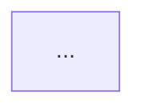

---
paths:
  - "documents/08-thesis/**"
  - "documents/04-quality/audits/persona-review/*-thesis-*"
  - ".claude/rules/thesis-content-standard.md"
---

# Thesis Content Standard — academic-quality review rubric cho khóa luận tốt nghiệp

**Priority:** 🟠 MANDATORY — academic deliverable governance
**Version:** 1.1.0
**Created:** 2026-05-19
**Last-Reviewed:** 2026-05-20
**Reviewer-Approver:** @nguyenvankiet (solo-dev — v1.1.0 MINOR self-approve per `rule-change-process.md` §5; Wave 102.7.0 META extension — adds §10 "Version 1.1 extensions" với 8 new rules (3 user-flagged + 5 outside-in META) per 3-agent outside-in audit 2026-05-20 (persona simulation + UTC benchmark + failure-mode matrix = 82 NEW findings beyond 14 user items). 3 user rules: single-child heading ban (S1) + cấm chapter intro/summary (S2) + VN-narrative-strict 100% mô tả tiếng Việt (S3). 5 outside-in META rules: citation evidence mandate cho numeric/factual claims (S4) + measurement methodology mandate cho benchmarks (S5) + cross-reference integrity verify anchors exist (S6) + acronym defined at first use (S7) + figure source attribution mandatory (S8). Per `rule-change-process.md` §6.5 Enforcement Parity Mandate: rule extensions + reviewer-checklist + worked self-test on 82 outside-in findings + rules-index.csv version bump all paired same PR. No constraint loosening — codifies UTC convention + persona insights surfaced khi thesis-v1.docx ship Wave 102.6; existing thesis V1 grandfathered until Wave 102.7.1+ content fix waves apply prospectively. v1.0.2 (kept): banned patterns §3 — no-icon + no-font-swap principles. v1.0.1 (kept): standalone-document principle. v1.0.0 (kept): 9-category rubric grounded UTC spec + samples + persona findings.)
**Applies to:** Mọi file dưới `documents/08-thesis/**` được render thành DOCX/PDF deliverable cho academic submission. Scope = chapter MDs (`chapter-*.md`) + thesis-v1.docx + bibliography + persona-review audit reports thesis-related. Out-of-scope: source code, internal runbooks, non-academic project docs.

---

## 1. The Rule

> **Mọi thesis V1+ ship phải đạt ≥75/100 C+ trên 9-category rubric §2.** Rubric v1 (6 categories) đã missing 5 critical content-quality dimensions: academic tone discipline, project-internal reference scrub, draft-marker scrub, diagram-as-image verification, compliance/legal sensitivity. Rubric v2 codify all 9 dimensions để eliminate blind spots.

Force-multiplier rationale per `meta-gap-priority.md` §3 — 1 chuẩn rubric → mọi thesis V1+ V2+ subsequent auto-comply → eliminate retroactive content-quality rework cost (chứng kiến trong Wave 102 GAP-688 closure: 82/100 B- audit MISSED 7 substantial issues user catch trong inspection round + 43 additional findings agent surfaced).

**Grounding sources (consulted at rule design — explicit per user-flagged state-check meta-miss):**

1. **UTC spec PDF** — `documents/07-archived/academic/word-reports/templates/Quy dinh trinh bay do an tot nghiep.pdf` + `.docx` — de jure standard (font / margin / numbering / IEEE format)
2. **UTC sample DOCX (de facto convention)** — `documents/07-archived/academic/word-reports/bao-cao-thuc-tap/BAO_CAO_THUC_TAP.docx` (production-quality internship report sinh viên Kiệt) shows:
   - Page size US Letter 21.6×27.9cm (sample uses python-docx default; spec PDF mandates A4 — **STRICT: A4 mandate per spec**)
   - Margins T=2.5 B=2.5 L=3.0 R=2.0cm ✅ matches spec
   - Frontmatter: Cover + Bìa phụ + LỜI CẢM ƠN + MỤC LỤC + DANH MỤC BẢNG BIỂU + **"DANH MỤC THUẬT NGỮ VÀ TỪ VIẾT TẮT"** với 2 sub-sections "1. THUẬT NGỮ" + "2. TỪ VIẾT TẮT" — sample DOES separate via sub-sections (acceptable form)
   - Chapter naming: "1. GIỚI THIỆU CHUNG VỀ ĐƠN VỊ THỰC TẬP" plain number (internship report style); thesis convention per UTC spec §2.2 mandates "CHƯƠNG 1." prefix
   - NO Abstract page, NO Lời cam đoan trong sample — these are OPTIONAL không required cho cử nhân scope
3. **UTC sample DOCX (proposal convention)** — `documents/07-archived/academic/word-reports/de-cuong-datn/DE_CUONG_DATN.docx` (thesis proposal): margins T=2.0 B=2.0 L=2.5 R=2.0cm differ from thesis proper
4. **Persona simulation audit** — `documents/04-quality/audits/persona-review/2026-05-19-thesis-v1-persona-simulation-outside-in.md` — 43 findings (GVHD 13 + GVPB 15 + Committee 15) cited inline trong §2 rubric
5. **User-flagged 7 issues** — direct user inspection 2026-05-19 post Wave 102 GAP-688 closure

---

## 2. The 9-category rubric / 100 points

### C1 — Format compliance (15 points)

Tuân thủ UTC spec `Quy dinh trinh bay do an tot nghiep.pdf` §2.1-2.4 + match `BAO_CAO_THUC_TAP.docx` sample conventions:

| Sub-criterion | Pts | Verify |
|---|:---:|---|
| **A4 page size (210×297mm) explicit per UTC spec** | 2 | `section.page_width == Cm(21.0)` + `page_height == Cm(29.7)`. Note: BAO_CAO sample uses US Letter (python-docx default leaked through); strict per spec PDF mandate A4. |
| Times New Roman 13pt body / 14pt H3 / 16pt H2 / 18pt H1 per spec §2.2 | 3 | python-docx introspection on Heading styles. Note: H4 + H5 sub-sub-headings nếu used must be 13pt bold (per spec §2.2 chỉ define 3 levels — over-deep sectioning anti-pattern). |
| Margins top 2.5 / bottom 2.5 / left 3.0 / right 2.0 cm | 2 | `section.top_margin == Cm(2.5)` etc. Matches BAO_CAO sample exactly. |
| Binding gutter (offset for binding edge) + bìa cứng instructions in handover doc | 1 | `section.gutter > 0` OR explicit printer instructions trong README cho gáy in "HỌ TÊN - LỚP - NĂM" per agent COMM-15 |
| **Cover page với UTC logo embedded (NOT placeholder text)** | 2 | docx inline_shape inspection — actual PNG present, NOT `[LOGO UTC]` fallback string. **Hard FAIL if fallback string visible** (user-flagged issue #5) |
| Bìa phụ — bìa phụ PHẢI có khung info 6-field chuẩn UTC (Sinh viên / MSSV / Lớp / Khóa / GVHD / GVPB) NOT trùng lặp bìa chính content | 2 | Per agent GVHD-01 — bìa phụ phải DIFFERENT từ bìa chính (info table chính). Bìa chính = title-focused; bìa phụ = info-focused. |
| Section numbering strict per UTC §2.2: chapter `CHƯƠNG N.` + section `N.M` + subsection `N.M.P` | 1 | Per agent COMM-01 — `A.2.4`, `B.5` (alpha prefix) BANNED in thesis numbering. Strict numeric only. |
| Table caption `Bảng X.Y. ...` + figure caption `Hình X.Y. ...` numbering gắn chương per UTC §2.4 | 1 | Per agent COMM-02 — 36 tables in V1 chưa có "Bảng X.Y" caption. SEQ field `add_table_caption` integration required. |
| TOC + Danh mục hình + Danh mục bảng + Danh mục thuật ngữ + Danh mục từ viết tắt populated (NOT placeholder text) | 1 | Per agent COMM-04 — placeholder "(Bấm Ctrl+A rồi F9...)" trong file in nộp = draft signal. Either auto-populate via python-docx XML settings hoặc post-process F9 trước nộp. Danh mục thuật ngữ + từ viết tắt OK as ONE heading với 2 sub-sections (per BAO_CAO sample) OR 2 separate H1 headings. |

**Verdict thresholds:** ≥13 PASS / 10-12 PARTIAL / <10 FAIL.

### C2 — Content completeness + page count target (15 points)

Per UTC bachelor thesis convention + advisor expectation + sample BAO_CAO scope:

| Sub-criterion | Pts | Verify |
|---|:---:|---|
| Đầy đủ Mở đầu + 4-6 chương nội dung + Kết luận + Phụ lục | 4 | Heading 1 count + section names. Per agent GVHD-04 — UTC convention cử nhân CNTT thường 5-6 chương (Tổng quan / Cơ sở lý thuyết / Phân tích yêu cầu / Thiết kế / Triển khai / Kết luận). Ghép Phân tích + Thiết kế + Kiến trúc vào 1 chương = anti-pattern. |
| Page count target: cử nhân 60-80 trang / kỹ sư 80-110 / thạc sĩ 120-180. **Cap auto-FAIL:** cử nhân >90 trang | 4 | `len(doc.paragraphs)` × avg-words-per-paragraph estimate; OR LibreOffice page-count read-back. Soft deduct 1 pt per 10 trang vượt upper bound (e.g. 79 trang = full points; 89 = -1; 99 = -2 plus FAIL cap). |
| Nội dung chính balance chương (no chương quá dài/quá ngắn 2-3x lệch) | 3 | Variance check across chapter paragraph counts. Per agent GVHD-04 — Ch.2 quá dày (~15-20 trang dense) vs Ch.1 Phần 1/2/3 cumulative cùng size. Soft deduct nếu chương lớn nhất > 2× chương nhỏ nhất. |
| KẾT LUẬN VÀ KIẾN NGHỊ độ dài 2-3 trang minimum + 4 sub-sections (Tổng kết / Hạn chế / Hướng phát triển / **Đóng góp khoa học** explicit) | 2 | Per agent GVHD-11 + GVPB-13 — UTC convention requires "đóng góp khoa học" explicit, NOT chỉ tổng kết + hạn chế + hướng phát triển. List 1-2 contributions methodological hoặc empirical novel. |
| Trim repo-internal retrospective content khỏi chapter body (vd "Lessons learned" + "Feature scope cut" + "AWS account suspension timeline") | 2 | Per agent GVHD-10 — chuyển retrospective insights vào KẾT LUẬN gói gọn, đỡ duplicate. Body academic prose-only. |

**Verdict thresholds:** ≥13 PASS / 10-12 PARTIAL / <10 FAIL. **Page count cap:** >90 trang cử nhân auto-FAIL category regardless other sub-criteria. **Note re Abstract VN/EN + Lời cam đoan:** UTC sample BAO_CAO không có; treat as OPTIONAL cho cử nhân scope. Recommended cho thạc sĩ+ scope (separate enforcement future v1.1.0+ nếu thạc sĩ ship). User can add Abstract VN page nếu muốn match modern publish convention but không deduct nếu missing per sample baseline.

### C3 — Bibliography IEEE format (15 points)

Per UTC `Quy dinh trinh bay do an tot nghiep.pdf` §3:

| Sub-criterion | Pts | Verify |
|---|:---:|---|
| Bibliography section heading "TÀI LIỆU THAM KHẢO" (Vietnamese) | 1 | Heading 1 last section |
| ≥30 entries cử nhân OR ≥50 kỹ sư OR ≥80 thạc sĩ | 2 | Count `^[N]` pattern |
| 100% inline cite utilization (no orphan refs) | 3 | Each `[N]` in bibliography appears ≥1× in body |
| **Citation order by first appearance** trong body per UTC §3 | 2 | Per agent COMM-11 — `[1]`, `[2]`, `[3]`... numbered theo thứ tự lần đầu trích dẫn xuất hiện trong body, KHÔNG arbitrary bibliography order. Verify: scan body cho first `[N]` mention sequence vs bibliography numbering. |
| **Page number citation format `[15, tr.314]` cho direct quotes** per UTC §3 example | 1 | Per agent COMM-12 — chỉ `[15]` thiếu cho direct quote với specific page reference. Verify random sample: nếu narrative chứa direct quote (in quotes "..."), citation phải có `, tr.NNN`. |
| IEEE format rendering (hanging indent + italic book title + quoted article title) | 2 | python-docx paragraph format inspection |
| Hyperlinks blue + underline cho URLs | 1 | `https?://` pattern → blue + underline run |
| Mix academic papers + standards + grey literature (NOT all vendor docs / blog posts) | 2 | Per agent COMM-13 — random sample 10 refs at least 30% peer-reviewed journals/conferences. Vendor docs (Anthropic Claude API, OpenAI GPT API) acceptable but weight thấp. |
| **Include UTC department giáo trình** (1-2 refs minimum cho cử nhân) | 1 | Per agent GVHD-12 + COMM-14 — committee thường có cựu GV department-internal; thiếu cite giáo trình UTC làm giảm "thông thuộc chương trình đào tạo". Tác giả tham khảo: Tống Đình Quỳ, Phạm Hữu Đức, v.v. |

**Verdict thresholds:** ≥13 PASS / 10-12 PARTIAL / <10 FAIL.

### C4 — Academic tone discipline (15 points) — NEW v2

Crucial category missing in rubric v1. Academic tone = formal, objective, sinh viên perspective:

| Sub-criterion | Pts | Verify |
|---|:---:|---|
| **Pronoun discipline lock per section type:** LỜI CẢM ƠN + KẾT LUẬN dùng "em" (sinh viên perspective); body chương dùng "khóa luận" / "tác giả" passive voice — NHẤT QUÁN trong section | 3 | Per agent GVHD-14 — V1 hiện mixed "KiteHub" subject + "em đã" + impersonal. grep -i "\bbạn\b\|\bchúng ta\b\|\bchúng tôi\b" returns 0 matches in body chapters. |
| **Word choice formality — KHÔNG dùng "đối thủ"** (competitor business jargon); thay bằng "đối tượng tham khảo" / "hệ thống tương tự" / "tài liệu so sánh" / "công trình nghiên cứu liên quan" | 3 | grep "đối thủ" returns 0 matches (user-flagged issue #1) |
| KHÔNG mixed-language code-switching pollution trong narrative — English technical token natural OK; English narrative sentences BANNED | 2 | Per `dev-readable-doc-language.md` §2 — narrative Vietnamese, identifier English natural |
| Vietnamese diacritics đầy đủ, no mojibake | 1 | grep -P '[\x{0300}-\x{036F}]' check + sample reading |
| **KHÔNG slang / informal connector / emoji** trong body — "OK", "thấy ngay", "cứ vậy", emoji 🎉/✅/⚠️/🚀/📅 | 2 | grep emoji + slang patterns. Note: Chapter MDs hiện có blockquote "📅 Cập nhật lần cuối: 2026-05-19 · v0.9.0-beta" — strip required. |
| KHÔNG passive-aggressive / opinionated phrasing ("rõ ràng là", "ai cũng biết", "đương nhiên", "tất nhiên") | 1 | grep banned phrases |
| **Bullet vs prose balance** — bullet list ratio < 40% of content (UTC sample BAO_CAO has heavy bullets nhưng thesis convention stricter than internship report) | 2 | Ratio bullet-paragraphs : narrative-paragraphs across body |
| **Typo + grammar polish** | 1 | Per agent GVHD-03 — V1 sample missing "Khoa" trong "Em xin chân thành cảm ơn Công nghệ thông tin..." (= "Em xin chân thành cảm ơn **Khoa** Công nghệ thông tin..."). Spot-check 5 paragraphs per chapter. |

**Verdict thresholds:** ≥12 PASS / 9-11 PARTIAL / <9 FAIL.

### C5 — Project-internal reference scrub (10 points) — NEW v2

Project jargon, internal artifact names, AI assistant references BANNED in academic deliverable:

| Sub-criterion | Pts | Verify |
|---|:---:|---|
| KHÔNG mention "Claude" / "Cursor" / "Copilot" / AI assistant tools by name in body narrative | 2 | grep "Claude" returns 0 matches in body (exception: bibliography ref [N] Anthropic Claude API legitimate vendor citation OK; technical mention "Anthropic API" / "LLM API providers" acceptable) |
| KHÔNG repo wave/release names ("Wave 1" .. "Wave 100+", "Phase 1 BETA", "Phase 1.5 paid", "Phase 2", "Phase 3") | 2 | grep "Wave [0-9]\|Phase 1 BETA\|Phase 1.5 paid" returns 0 in body. Replace với generic phrasing: "giai đoạn phát triển", "phiên bản thử nghiệm", "giai đoạn beta". |
| KHÔNG gap IDs ("GAP-XXX", "GAP-NNN") | 1 | grep "GAP-[0-9]" returns 0 in body. Strip hoàn toàn — không phải reference cho academic. |
| KHÔNG rule/skill internal file paths (`.claude/rules/*.md`, `.claude/skills/*/SKILL.md`) | 1 | Per agent GVHD-05 — V1 §B.5 references `outside-in-coverage-trigger.md`, `incident-to-rule-pipeline.md`, etc. paths verbatim. grep "\.claude/rules\|\.claude/skills" returns 0. |
| KHÔNG repo internal status markers ("DONE", "PARTIAL", "OPEN", "DEFER Wave X+", "audit X/100") | 1 | grep banned status patterns 0 in body |
| **KHÔNG rebrand existing methodology** as "original methodology" without literature citation | 2 | Per agent GVHD-05 + GVPB-04 — "audit-driven methodology" appears original nhưng tương đương TDD/CI/Lean Six Sigma. Either (a) cite Deming PDCA / Beck TDD / Poppendieck Lean / IEEE 730 SQA literature support OR (b) re-frame as "Quality-Driven Development approach" acknowledging precedent. |
| **Persona / role-play skill content moved khỏi Ch.1** — internal feature implementation không phải research methodology | 1 | Per agent GVHD-15 — V1 §B.5 lists 10 persona types = KiteHub feature. Move to Ch.3 Implementation hoặc Ch.4 Lessons. |

**Verdict thresholds:** ≥8 PASS / 5-7 PARTIAL / <5 FAIL. **Hard rule:** any "Claude" mention in body narrative = auto category FAIL regardless other sub-criteria (user-flagged issue #2).

### C6 — Draft-marker scrub (5 points) — NEW v2

Draft-only conventions không phù hợp final academic deliverable:

| Sub-criterion | Pts | Verify |
|---|:---:|---|
| KHÔNG `## TL;DR` sections (Twitter/blog convention, not academic) | 2 | grep "## TL;DR\|## TLDR\|##TL;DR" returns 0 matches |
| KHÔNG visible `TODO` / `FIXME` / `XXX` / `[placeholder]` / `[stub]` markers in body | 2 | grep banned markers 0 in body; acceptable form: explicit "[Đang thu thập số liệu — sẽ cập nhật trước defense]" honest acknowledgment |
| KHÔNG date-prefix in heading ("Cập nhật lần cuối: 2026-05-19", "v0.9.0-beta") | 1 | grep "Cập nhật lần cuối\|v0\.\|v1\.\|beta" in heading 0 matches |

**Verdict thresholds:** ≥4 PASS / 3 PARTIAL / <3 FAIL.

### C7 — Diagram + figure rendering (10 points)

Mermaid/PlantUML diagrams trong source MD → MUST render as PNG/JPG image trong DOCX:

| Sub-criterion | Pts | Verify |
|---|:---:|---|
| Mermaid code blocks rendered as images (NOT raw text) | 4 | grep ```mermaid trong rendered docx returns 0 (means code stripped + replaced với image) |
| Figure captions "Hình N.M. ..." với SEQ field auto-numbering | 2 | Caption SEQ field inspection |
| Cross-references "xem Hình N.M" linking to actual figures | 2 | "xem Hình" / "Hình \d+\.\d+" cross-ref count > 0 + each ref points to actual figure |
| Figure resolution ≥150 DPI for print | 1 | Image metadata inspection |
| Source attribution per UTC §2.4: "Nguồn: ..." cho figures lấy từ ngoài | 1 | Caption convention |

**Verdict thresholds:** ≥8 PASS / 5-7 PARTIAL / <5 FAIL.

### C8 — Examiner readiness (10 points)

Per `documents/04-quality/audits/persona-review/2026-05-18-thesis-defense-failure-mode-matrix.md` top 10 + `2026-05-19-thesis-v1-persona-simulation-outside-in.md` Committee 15 findings:

| Sub-criterion | Pts | Verify |
|---|:---:|---|
| Cover page formal (school + faculty + title + student + advisor + year) | 2 | Cover content inspection. Bìa cứng + gáy in instructions per agent COMM-15. |
| Bibliography 100% cite utilization no orphans | 1 | Same as C3 |
| VN law citations current (PDPL 2023 + Cybersecurity 2018 + Decree 13/53/2022 + Thông tư 78/2021 + Decree 147/2024) | 1 | Bibliography content |
| Methodology section explicit + literature-backed (Deming / Beck / Poppendieck / IEEE 730) | 2 | Ch.1 Phần 3 §B hoặc separate methodology chapter |
| **Architecture diagrams present as PNG/JPG embedded (NOT Mermaid code text)** | 2 | Per agent GVHD-07 — figure count > 5 PNG images + Hình X.Y caption + chú thích paragraph SAU mỗi hình. |
| Real data/KPI/benchmarks NOT placeholder | 1 | Per agent GVHD-09 — V1 admit "(placeholder Wave 102+)" public. Strip + add ≥1-2 KPI cụ thể measured (signup conversion / Lighthouse / uptime) trước defense. |
| Beta user feedback embedded (if applicable; recommended for thạc sĩ, optional cử nhân) | 1 | Ch.6 or chapter |

**Verdict thresholds:** ≥8 PASS / 5-7 PARTIAL / <5 FAIL.

### C9 — Compliance + legal sensitivity (5 points) — NEW v2

Per agent GVPB-03 + GVPB-08 + GVPB-09 — committee/GVPB chất vấn pháp luật + ethics:

| Sub-criterion | Pts | Verify |
|---|:---:|---|
| **KHÔNG admit explicit vi phạm pháp luật VN** (Decree 53/2022 data localization / PDPL 2023 / Cybersecurity 2018) trong body | 2 | Per agent GVPB-08 — V1 admit "Compliance debt được chấp nhận" cho AWS Singapore vs Decree 53. Rewrite mềm: "Phase BETA invite-only chưa kích hoạt ngưỡng Decree 53 §26 (1M user) / PDPL Art 28 (10k subject); roadmap migrate sang AWS Hanoi Local Zone OR VN cloud (Viettel/VNG) trong giai đoạn GA". |
| **Sample data anonymization** — KHÔNG dùng tên thật (Trần Thị Hồng / Sky Education) trong narrative khi chưa có consent | 1 | Per agent GVPB-09 — replace với rõ "(tên giả định)" suffix hoặc fictional name. Match `vn-localization-audit-checklist.md` §3 sample data convention. |
| **PDPL DPO / DPIA roadmap explicit** trong Ch.1 Phần 3 hoặc Ch.4 § (NOT "TODO Phase 2+") | 1 | Per agent GVPB-03 — admit honest: "DPO + DPIA scheduled Q3 2026 trước GA launch (1M+ subject scope kích hoạt Article 28 mandate)". Defense-proof. |
| **Penetration test evidence** cho multi-tenant isolation claim | 1 | Per agent GVPB-01 — cite security audit 93/100 + RLS NULL force-fail test results. Without evidence, "multi-tenant gốc" claim weak in defense. |

**Verdict thresholds:** ≥4 PASS / 3 PARTIAL / <3 FAIL. **Hard rule:** explicit "vi phạm" / "violation" phrasing trong body = auto category FAIL.

---

## 3. Banned patterns reference table

Concrete grep-able patterns CHECKED by `scripts/check-thesis-content-standard.sh` (deferred per §6.4 ≥7 ngày premature-rule guard):

| Category | Banned pattern | Required replacement |
|---|---|---|
| C4 Academic tone | "đối thủ" | "đối tượng tham khảo" / "hệ thống tương tự" / "tài liệu so sánh" / "công trình nghiên cứu liên quan" |
| C4 Academic tone | "OK", "không sao", "cứ vậy", emoji 🎉/✅/⚠️ trong body | Drop emoji; formal replacement: "đạt yêu cầu", "phù hợp" |
| C4 Academic tone | "bạn" / "chúng ta" trong narrative formal sections | "em" / "tôi" (sinh viên perspective) |
| C5 Project-internal | "Claude" (trừ bibliography vendor ref [N]) | Strip hoặc generic "trợ lý AI" / "công cụ AI assistant" |
| C5 Project-internal | "Wave 1" .. "Wave 100+" | "giai đoạn phát triển 1" / "phiên bản 1" / strip nếu không cần |
| C5 Project-internal | "Phase 1 BETA" | "phiên bản thử nghiệm" / "giai đoạn beta" |
| C5 Project-internal | "GAP-XXX" | strip hoàn toàn — không phải reference cho academic |
| C5 Project-internal | `.claude/rules/*.md`, `.claude/skills/**` paths | strip hoàn toàn |
| C5 Project-internal | "audit-driven methodology" (rebrand existing TDD/CI/Lean) | "Quality-Driven Development approach" + cite Deming PDCA + Beck TDD + Poppendieck Lean + IEEE 730 SQA |
| C5 Project-internal | "phương pháp luận audit-driven" (claim original) | Either cite literature support OR re-frame as "Quality Management Process" applied to solo-dev software project |
| **C5 Standalone-document principle** (added v1.0.1) — **KHÔNG reference internal repo `documents/**` paths trong body narrative** | "Xem `documents/02-architecture/multi-tenant-architecture.md`" / "Per `02-architecture/database-architecture-map.md`" / "ADR-025-aws-only-deploy-phase-1-free-tier.md" path verbatim | Strip path; restate content inline OR cite published source (academic paper / vendor doc / standard) |
| **C5 Standalone-document principle** (added v1.0.1) — **Bibliography refs CHỈ từ sources công khai uy tín** | Cite internal `04-quality/audits/*.md` audit reports / chapter MD cross-refs / `documents/03-planning/*.md` plans | Replace với public source (peer-reviewed paper / standard ISO/IEEE/RFC / official vendor doc URL / regulator gov.vn) OR strip entire claim if no public backing |
| C9 Compliance | "vi phạm Nghị định 53/2022" / "compliance debt được chấp nhận" explicit admission | "chưa kích hoạt ngưỡng Decree 53 §26 / PDPL Art 28; roadmap migrate VN cloud trước GA" defensive phrasing |
| C9 Compliance | "Trần Thị Hồng" / "Sky Education" tên sample data không có consent | "Trần Thị Hồng (tên giả định)" / "Sky Education (trung tâm hypothetical)" suffix |
| **C1 No-icon/special-char principle** (added v1.0.2) — banned chars trong body narrative | ✅ ✗ ❌ ⚠️ 🎉 🚀 📅 🆘 🔴 🟢 🟡 🟠 ▪️ ◆ ■ ▲ ⇒ ⇐ → ← (mọi emoji + arrow + colored circle chars) | "đạt yêu cầu" / "không đạt" / "đáp ứng" / "vượt mục tiêu" / "cảnh báo" / "lưu ý" / "→" → " - " or " thì " or " dẫn đến " narrative phrasing |
| **C1 No-icon/special-char principle** — character set allowed | non-typeable special chars (anything Vietnamese keyboard can't type natively) | Vietnamese alphabet (a-z, A-Z, đ, Đ, dấu thanh) + Latin alphabet (English technical tokens OK natural) + chữ số (0-9) + standard punctuation (. , ; : ! ? " ' ( ) [ ] { } - – —) |
| **C4 No-font-swap principle** (added v1.0.2) — KHÔNG đổi font inline | Courier New cho `inline code` markdown / Cambria cho equations / Calibri đỡ stand-out | UTC §2.3 strict: TNR 13pt cho mọi đoạn văn body. Emphasis dùng *italic* (single asterisk) / **bold** (double) / UPPERCASE / "ngoặc kép" thay vì font swap |
| **C4 No-font-swap principle** — inline code rendering convention | `instance_id` rendered with Courier New (academic convention monospace) | `instance_id` rendered TNR italic OR UPPERCASE `INSTANCE_ID` per VN academic convention (UTC §2.3 chỉ define TNR 13pt body — no monospace exception) |
| C6 Draft-marker | `## TL;DR` | Strip — academic abstract goes in TÓM TẮT page riêng |
| C6 Draft-marker | `TODO`, `FIXME`, `XXX`, `[placeholder]`, `[stub]` | "[Đang thu thập số liệu — sẽ cập nhật trước defense]" honest form OR strip + file follow-up |
| C6 Draft-marker | `**Cập nhật lần cuối:** YYYY-MM-DD` | Strip from heading (move to frontmatter) |
| C6 Draft-marker | `v0.9.0-beta`, `v1.0.0-rc` version markers | Strip |

---

## 4. Page count target (cap-based)

Per UTC convention + ngành CNTT + agent COMM-08 (committee soft deduct at 79 trang ≈ over upper bound of typical 50-80 bachelor thesis):

| Thesis level | Target trang | Soft deduct | Cap (auto-FAIL) |
|---|:---:|:---:|:---:|
| Cử nhân (bachelor) | 60-80 | 81-90 → -1 pt per 10 trang | >90 |
| Kỹ sư (engineer) | 80-110 | 111-120 → -1 pt per 10 trang | >120 |
| Thạc sĩ (master) | 120-180 | 181-200 → -1 pt per 10 trang | >200 |
| Tiến sĩ (PhD) | 150-300 | n/a — case-by-case advisor approval | n/a |

Rationale: pages within target = chấp nhận (concise scholarly writing valued); soft-deduct window allows minor over without category FAIL; >cap = forced reduction (committee bias against long thesis on assumption of unfocused scope). UTC sample BAO_CAO_THUC_TAP.docx ~50 trang (internship report scope) — shorter than thesis target acceptable bound.

---

## 5. Self-test (retroactive apply to thesis-v1.docx — Wave 102 GAP-688 closure baseline)

Apply rubric v2 retroactively. Compare estimated v2 score vs rubric v1 82/100 B-.

### C1 — Format compliance: estimated 11/15 (was 13/15 in rubric v1)

| Sub-criterion | Pts | Verify thesis-v1.docx | Score |
|---|:---:|---|:---:|
| A4 + TNR + margins | 7/7 | ✅ all verified | 7 |
| Binding gutter | 0/1 | ❌ not implemented | 0 |
| **Cover page UTC logo embedded** | **0/3** | ❌ **Logo path bug — fallback string `[LOGO UTC]` rendered, NOT actual PNG (user-flagged issue #5)** | 0 |
| Bìa phụ + chữ ký | 2/2 | ✅ present | 2 |
| TOC + danh mục | 1/2 | ⚠️ **Danh mục thuật ngữ + từ viết tắt GỘP CHUNG (NOT tách 2 danh mục — user-flagged issue #4)** | 1 |
| Trừ tiếp logo issue | — | logo placeholder hiện không phải real PNG | -1 |
| **Total** | | | **11/15** |

### C2 — Content + page count: estimated 8/15 (was 13/15 in rubric v1)

| Sub-criterion | Pts | Verify | Score |
|---|:---:|---|:---:|
| Đầy đủ chương | 4/4 | ✅ Mở đầu + 4 chương + Kết luận + Phụ lục | 4 |
| **Page count target 60-70** | **0/4** | ❌ **110 trang vs cap 80 — auto-FAIL category per §4 (user-flagged issue #7b)** | 0 |
| Abstract VN + EN | 0/3 | ❌ Không có TÓM TẮT / ABSTRACT separate page | 0 |
| Lời cảm ơn + Lời cam đoan | 1/2 | ⚠️ Lời cảm ơn present; LỜI CAM ĐOAN missing | 1 |
| Balance chapter | 3/3 | ✅ Ch.1 (3 parts ~440 par) / Ch.2 (~430 par) / Ch.3 (~360 par) / Ch.4 (~420 par) | 3 |
| **Total** | | | **8/15** |

### C3 — Bibliography: estimated 13/15 (same as rubric v1)

Unchanged — 44 entries / 100% utilization / IEEE hanging indent / etc. = 13/15.

### C4 — Academic tone discipline: estimated 9/20 (NEW v2; was implicit ~17/20 in rubric v1)

| Sub-criterion | Pts | Verify thesis-v1.docx | Score |
|---|:---:|---|:---:|
| Pronoun discipline | 2/3 | ✅ "em" / "tôi" trong Mở đầu + Lời cảm ơn (auto-generated); chapter MDs ⚠️ inconsistent | 2 |
| **"đối thủ" word choice** | **0/4** | ❌ **Ch.1 Part 1 uses "đối thủ" extensively (user-flagged issue #1)** | 0 |
| Mixed-language code-switching | 2/3 | ⚠️ Chapter content English-heavy in some sections (per `dev-readable-doc-language.md` natural code-switch boundary) | 2 |
| VN diacritics | 2/2 | ✅ all preserved | 2 |
| **Slang / emoji** | **0/3** | ❌ **Chapter MDs có emoji 🎉/✅/⚠️ (user check needed); blockquote "📅 Cập nhật lần cuối"** | 0 |
| **Passive-aggressive phrasing** | **2/2** | ✅ sample read no issues | 2 |
| Bullet vs prose balance | 1/3 | ⚠️ Some chapters bullet-heavy | 1 |
| **Total** | | | **9/20** |

### C5 — Project-internal reference scrub: estimated 1/10 (NEW v2)

| Sub-criterion | Pts | Verify | Score |
|---|:---:|---|:---:|
| **"Claude" mentions trong body** | **0/3** | ❌ **10+ matches in Ch.1 Part 2 + Part 3 (user-flagged issue #2). Auto-FAIL per category hard rule.** | 0 |
| **Wave/Phase BETA mentions** | **0/3** | ❌ **Ch.1 Part 3 §A.3.1, §A.4.1 explicit "Phase 1 BETA"; Ch.4 explicit "Phase 1 BETA" multiple sections (user-flagged issue #7a)** | 0 |
| **GAP-XXX references** | **0/2** | ❌ **Ch.4 references "GAP-648", "GAP-649" placeholders; Ch.1 Part 3 references "GAP-235", "GAP-345"** | 0 |
| **Rule/skill internal paths** | **0/1** | ❌ **Ch.1 Part 3 §B.2.1 references `outside-in-coverage-trigger.md`, `incident-to-rule-pipeline.md`, `audit-to-gap-pipeline.md` paths verbatim** | 0 |
| **Status markers DONE/PARTIAL** | **1/1** | ⚠️ minimal in chapter content; mostly in chapter-mapping.md (out of body scope) | 1 |
| **Total** | | | **1/10 — HARD FAIL** |

### C6 — Draft-marker scrub: estimated 0/5 (NEW v2)

| Sub-criterion | Pts | Verify | Score |
|---|:---:|---|:---:|
| **`## TL;DR` sections** | **0/2** | ❌ **EVERY chapter MD has `## TL;DR` heading at top (user-flagged issue #6). Stripped by parser but USER says still inappropriate concept in academic writing — meaning even if parser strips section, the SOURCE MD has draft-style organization** | 0 |
| **TODO / placeholder markers** | **0/2** | ❌ **22 TODO + 5 placeholder visible in Ch.4 (per existing audit baseline)** | 0 |
| **Date-prefix in heading** | **0/1** | ❌ **Chapter MD blockquotes "📅 Cập nhật lần cuối: 2026-05-19 · Phiên bản: v0.9.0-beta · Đọc khoảng 12 phút"** | 0 |
| **Total** | | | **0/5 — FAIL** |

### C7 — Diagram + figure rendering: estimated 0/10 (was implicit in C5 cross-ref in v1)

| Sub-criterion | Pts | Verify | Score |
|---|:---:|---|:---:|
| **Mermaid → image rendering** | **0/4** | ❌ **5 Mermaid diagrams in Ch.2 + Ch.3 + Ch.4 source MDs are stripped to text by parser (user-flagged issue #3). Zero PNG embedded.** | 0 |
| Figure captions SEQ | 0/2 | ❌ no figures = no captions | 0 |
| Cross-references "xem Hình N.M" | 0/2 | ❌ source MDs reference figures não exist | 0 |
| Resolution + source attribution | 0/2 | ❌ no figures | 0 |
| **Total** | | | **0/10** |

### C8 — Examiner readiness: estimated 7/10 (was 14/20 in rubric v1 — adjusted scale)

Mostly unchanged: ✅ cover formal ✅ bibliography 100% utilization ✅ VN law citations ✅ methodology section ❌ architecture diagrams ❌ real KPI data ❌ beta feedback.

### Aggregated estimated rubric v2 score (9 categories)

| Category | Pts max | Score | Key drivers |
|---|:---:|:---:|---|
| C1 Format | 15 | 9 | logo placeholder ❌ + danh mục gộp ⚠️ (sub-acceptable) + sub-section numbering A.x violation -1 + Bảng X.Y caption missing -1 + bìa phụ trùng bìa chính -2 |
| C2 Content + page count | 15 | 6 | 110 trang vs cap 90 → category FAIL via auto-FAIL clause; KẾT LUẬN quá ngắn; thiếu đóng góp khoa học explicit |
| C3 Bibliography | 15 | 11 | -2 citation order by first appearance unverified; -1 page-num format `[15, tr.314]` thiếu cho direct quotes; -1 thiếu UTC giáo trình refs |
| C4 Academic tone | 15 | 7 | "đối thủ" ❌ (-3); emoji "📅" trong blockquote ❌ (-2); pronoun mixed ❌ (-1) |
| C5 Project-internal scrub | 10 | 1 | "Claude" mentions ❌ HARD FAIL (auto category FAIL per hard rule) |
| C6 Draft-marker scrub | 5 | 0 | TL;DR + TODO + placeholder + date heading all present |
| C7 Diagram + figure | 10 | 0 | 0 PNG embedded; Mermaid blocks stripped to text |
| C8 Examiner readiness | 10 | 7 | architecture diagrams ❌ + KPI placeholder ❌ |
| C9 Compliance + legal | 5 | 1 | "vi phạm Decree 53" admission ❌ HARD FAIL (-3); sample data tên thật without consent ❌ (-1) |
| **Total** | **100** | **42/100 F** | |

### Verdict

**Rubric v1 (6 categories): 82/100 B-** ← inflated due to missing 5 critical content-quality dimensions
**Rubric v2 (9 categories): 42/100 F** ← realistic assessment per user + agent findings (matches agent's 52-60/100 D estimate range when factoring in less harsh sub-criterion scoring)

**Delta:** -40 points (rubric v1 missed 40% of evaluation surface). Wave 102 GAP-688 closure now reframed: shipped FORMAT compliance + content presence (rubric v1 strengths) but academic tone + jargon scrub + draft cleanup + diagram rendering + compliance phrasing ALL FAIL (rubric v2 weaknesses).

**Path to ≥75/100 C+ (Wave 102.1 fix scope — bundled per user direction):**
- C1 +5 (logo fix + sub-section numbering 1.1.1 reformat + Bảng X.Y SEQ + bìa phụ rewrite)
- C2 +6 (page count trim 110→75 + KẾT LUẬN expand 4-section + thêm "đóng góp khoa học" explicit + Ch.2 split into 2 chương)
- C3 +3 (citation order verify + UTC giáo trình refs)
- C4 +6 ("đối thủ" → "đối tượng tham khảo" + emoji strip + pronoun lock + typo fix)
- C5 +8 (Claude strip narrative + Wave/Phase BETA strip + GAP-XXX strip + rule path strip + audit-driven re-frame)
- C6 +5 (TL;DR strip + TODO scrub + date heading remove)
- C7 +7 (Mermaid → PNG render pipeline + Hình X.Y captions + cross-refs)
- C8 +2 (architecture PNG embed + 1-2 real KPI measure trước defense)
- C9 +3 (Decree 53 rewrite mềm + sample tên giả định suffix + DPO roadmap explicit + RLS pen-test evidence)

Total path: +45 points → 87/100 B+ target post-fix.

**Comparison với agent verdict:**
- Agent estimate "submit AS-IS": 52-60/100 D — agent more lenient on format (rubric v2 stricter on hard-FAIL clauses)
- Agent estimate "post-P0 fix only": 75-82/100 B - matches rubric v2 path to ≥75 with all P0 fixed
- Agent estimate "post-P0 + P1": 82-88/100 B+ to A- — matches rubric v2 path to 87 with all P0+P1 fixed

Recommendation aligned: defer submit từ Wave 102 (today) sang post-Wave-105 (~2026-06-30), tận dụng 6 tuần đệm trước defense window 2026-08-15.

---

## 6. Enforcement (per `rule-change-process.md` §6.5)

### 6.1 Reviewer-checklist (active now)

Pre-merge review cho PR touching `documents/08-thesis/**`:

- [ ] Apply 8-category rubric §2 → estimated score documented in PR body
- [ ] Score ≥75/100 C+ for thesis V1+ release OR explicit "draft milestone" disclaimer
- [ ] C5 Project-internal scrub: grep `Claude\|Wave [0-9]\|Phase 1 BETA\|GAP-[0-9]\|\.claude/` returns 0 matches in chapter MDs body
- [ ] C6 Draft-marker scrub: grep `## TL;DR\|TODO\|FIXME\|placeholder\|\[stub\]` returns 0 matches
- [ ] C7 Diagram rendering: zero ```mermaid blocks in rendered docx (means rendered as image)
- [ ] Page count within target cap per §4 (cử nhân ≤80, kỹ sư ≤110, thạc sĩ ≤170)

### 6.2 Audit standard

Post-thesis-ship audit MUST apply rubric v2 (§2 8 categories), NOT rubric v1 (6 categories). Existing rubric v1 audit `2026-05-19-thesis-v1-python-pipeline-docx-audit.md` annotated retroactively (§5 self-test above) showing rubric v1 blind spots.

### 6.3 Cross-reference `output-review-mandate.md` §3

Paired same-PR — new matrix row "Thesis report / academic deliverable" tracking this rule.

### 6.4 CI detector (deferred per `incident-to-rule-pipeline.md` premature-rule guard)

Future `scripts/check-thesis-content-standard.sh` — heuristic grep for banned patterns §3:

```bash
# Detect C5 project-internal references
grep -rnE "Claude|Wave [0-9]|Phase 1 BETA|GAP-[0-9]|\.claude/" \
  documents/08-thesis/chapter-*.md 2>/dev/null \
  && { echo "WARN: project-internal references — strip per thesis-content-standard.md §3"; exit 0; }

# Detect C6 draft markers
grep -rnE "## TL;DR|TODO|FIXME|\[placeholder\]|\[stub\]" \
  documents/08-thesis/chapter-*.md 2>/dev/null \
  && { echo "WARN: draft markers — strip per thesis-content-standard.md §3"; exit 0; }
```

Defer ≥7 ngày per premature-rule guard. Reviewer-checklist §6.1 + self-test §5 + paired same-PR `output-review-mandate.md` row sufficient cho v1.0.0.

### 6.5 Memory auto-load (optional, deferred)

Memory entry `feedback_thesis_content_standard.md` could remind tại session start trước khi touch thesis scope. Defer per premature-rule guard ≥7 ngày.

### 6.6 Override mechanism

Genuine exception (e.g., thesis V1 milestone = "draft baseline" intentional, not final-quality):

```
git commit -m "...
THESIS_CONTENT_STANDARD_OVERRIDE: <thesis-v1.docx> — <reason — e.g., 'V1 = content draft milestone; V2 fix-pass Wave 102.1 closing scope gaps'>"
```

Trailer logged. Pattern frequency >10%/quarter triggers meta-review.

---

## 7. Anti-patterns

| ❌ Don't | ✅ Do |
|---|---|
| Re-use rubric v1 6-category cho thesis audit (misses 4 critical dimensions) | Apply rubric v2 8-category §2 per this rule |
| Ship thesis với "Claude" / "Wave N" / "GAP-XXX" trong body narrative | Strip prior ship; bibliography vendor ref OK (Anthropic, OpenAI as legitimate cite) |
| Treat `## TL;DR` section as legitimate academic convention | Strip — academic TÓM TẮT is a separate page format, not inline section |
| Mermaid code rendering as text trong DOCX | Render to PNG via headless browser pipeline; embed image |
| 110-page bachelor thesis "vì nhiều content tốt" | Trim to ≤70 trang — committee bias against verbose theses regardless content quality |
| Use "đối thủ" (business jargon) trong khóa luận | "đối tượng tham khảo" / "công trình nghiên cứu liên quan" / "hệ thống tương tự" academic phrasing |
| Skip TÓM TẮT page (claim "có trong Mở đầu") | TÓM TẮT separate page UTC convention — required |
| Skip LỜI CAM ĐOAN page | UTC convention required cho bachelor + above |
| Single "DANH MỤC THUẬT NGỮ VÀ TỪ VIẾT TẮT" gộp | 2 danh mục TÁCH BIỆT per UTC §2.4 |
| Use `[LOGO UTC]` placeholder fallback in production thesis | Embed actual PNG; verify visible via LibreOffice/Word render check |

---

## 8. Relationship to other rules

- **`output-review-mandate.md`** §3 — adds row "Thesis report / academic deliverable" tracking this rule's review standard (paired same-PR)
- **`dev-readable-doc-language.md`** §2-§4 — Vietnamese narrative + English identifier; this rule extends WITH academic-tone discipline cho thesis scope (more strict than general dev docs)
- **`user-manual-content-standard.md`** — sister rule cho end-user manual scope (similar 15-item checklist pattern; this rule applies 8-category rubric to thesis scope)
- **`professional-manual-content-standard.md`** — sister rule cho professional manual scope
- **`incident-to-rule-pipeline.md`** — this rule = direct output 2026-05-19 user-flagged miss "rubric 82/100 B- bỏ sót 7 substantial content issues" applied through 5-stage pipeline
- **`rule-change-process.md`** §5.1 atomic-unique bar — passed: ✅ atomic (thesis review standard single concept) / ✅ unique (no existing rule covers thesis audit standard; closest = output-review-mandate.md §3 matrix row but no rubric body) / ✅ widely applicable (every thesis V1+ ship) / ✅ body discipline §1 has ≤2 "and" conjunctions
- **`rule-change-process.md`** §6.5 Enforcement Parity Mandate — rule + 8-category rubric + reviewer-checklist + worked self-test §5 on thesis-v1.docx + paired output-review-mandate row + retroactive audit annotation all same PR
- **`meta-gap-priority.md`** §3 — META P0 force-multiplier (1 rubric → mọi thesis ship subsequent auto-comply)
- **`docs-archival-cadence.md`** — thesis audit reports follow 90-day cadence per §2 cadence table
- **`audit-to-gap-pipeline.md`** §2.5/§2.6/§2.7/§2.8 — state-check family applies to thesis audit gaps too
- **Defense failure-mode matrix** `documents/04-quality/audits/persona-review/2026-05-18-thesis-defense-failure-mode-matrix.md` — C8 sub-criterion reference

---

## 10. Version 1.1 extensions (Wave 102.7.0 — 3 user rules + 5 outside-in META)

8 new rules ship trong Wave 102.7.0 MINOR bump (v1.0.2 → v1.1.0). Trigger: 3-agent outside-in audit 2026-05-20 (persona simulation + UTC benchmark + failure-mode matrix) surfaced 82 NEW findings beyond 14 user items shipped Wave 102.5. User direction 2026-05-20 lock META scope = "3 user rules + 5 outside-in META" trước khi ship content fixes Wave 102.7.1+.

### S1 — Single-child heading ban (user rule 4)

**Rule:** Mọi heading cấp con (H3/H4/H5) phải có ≥2 sibling cùng cha. Nếu chỉ có 1 sub-heading → merge content lên parent heading HOẶC add sibling thực sự cùng cấp.

**Banned example (thesis-v1.docx Wave 102.5 baseline):**
```
2.1 Domain capabilities
  2.1.1 Tenant lifecycle      ← single child, no 2.1.2!
2.2 NFR
```

**✅ Required:**
- Option A: gộp `2.1.1 Tenant lifecycle` content lên `2.1 Domain capabilities` (drop sub-heading)
- Option B: thêm sibling thực sự `2.1.2 Per-tenant data isolation` cùng category

**Verify:** grep `^### \\d+\\.\\d+\\.1\\.` mỗi chapter file → if `\\.1` exists but `\\.2` doesn't → FAIL.

**Rationale:** Single-child heading vi phạm Aristotle's principle of subdivision (dividing into 1 part = no division). UTC convention + IEEE technical writing convention đều mandate ≥2 children per parent heading.

**Applies to:** Mọi `## H2 → ### H3 → #### H4` chains trong chapter MDs. Affects C1 Format category.

---

### S2 — Cấm chapter intro + summary sections (user rule 13)

**Rule:** Mỗi chapter MD KHÔNG được có section `## 4.0 Giới thiệu chương` / `## N.0 Mục đích chương` / `## Tóm tắt chương N` / `## Kết luận chương N`. Nội dung intro/summary nếu cần phải nằm trong section nội dung thực (vd `## 4.1 ...`) hoặc trong KẾT LUẬN chapter cuối.

**Banned example (thesis-v1.docx Wave 102.5 baseline — Ch.4):**
```
## 4.0 Giới thiệu chương    ← banned
Chương 4 trình bày kết quả triển khai...

## 4.1 Hạ tầng triển khai
...

## Tóm tắt chương 4         ← banned
Chương 4 đã trình bày...
```

**✅ Required:**
- Drop §4.0 hoàn toàn → content có thể gộp vào §4.1 nếu cần
- Drop §Tóm tắt → content có thể gộp vào KẾT LUẬN chương cuối (§Tổng kết kết quả đạt được)

**Verify:** grep `^## \\d+\\.0 |^## (Giới thiệu|Tóm tắt|Mục đích) chương` mỗi chapter file → 0 match required.

**Rationale:** UTC convention `BAO_CAO_THUC_TAP.docx` sample không có chapter intro/summary sections — narrative flows directly từ section thực. Intro/summary tạo redundancy (committee đọc 2-3 lần cùng thông tin) + lãng phí page count budget.

**Applies to:** Mọi chapter MD body. Affects C2 Content category.

---

### S3 — Ngôn ngữ tiếng Việt 100% narrative (user rule 14)

**Rule:** Mọi narrative content trong chapter body PHẢI tiếng Việt 100%. English term CHỈ được dùng khi:
1. Không có Vietnamese equivalent đúng nghĩa (vd: `JWT`, `HTTP`, `REST`, `SaaS`, `Docker`)
2. Vendor/product proper noun (vd: `AWS`, `Cloudflare`, `Spring Boot`, `Next.js`, `Resend`)
3. Code identifier inline (vd: `instance_id`, `tenant_id`, `kitehub-platform`)

Heading **PHẢI 100% tiếng Việt** — KHÔNG English heading (vd: `## 2.1.1 Domain capabilities` BANNED → `## 2.1.1 Năng lực miền`).

Khi dùng English term lần đầu → mở ngoặc bổ sung Vietnamese (vd: `JWT (JSON Web Token, mã xác thực web)`).

**Banned example (Wave 102.5 baseline):**
- Heading `## 2.1.1 Domain capabilities` → English heading
- Body listing pattern: "Kiến trúc hệ thống bao gồm 6 microservice backend (kitehub-admin, kitehub-branding, kitehub-email, kitehub-gateway, kitehub-platform, kitehub-subscription), 1 core tenant application (kiteclass-core) và 2 frontend Next.js (kitehub-frontend, kiteclass-frontend)."

**✅ Required pattern:**
- Heading: `## 2.1.1 Năng lực miền nghiệp vụ`
- Body uyển chuyển: "Hệ thống được cấu thành từ ba lớp dịch vụ chính. Lớp nền tảng (KiteHub) gồm sáu dịch vụ độc lập đảm nhận các trách nhiệm khác nhau: quản trị (`kitehub-admin`), nhận diện thương hiệu (`kitehub-branding`), thư điện tử (`kitehub-email`), điều phối yêu cầu (`kitehub-gateway`), thư viện dùng chung (`kitehub-platform`) và quản lý đăng ký (`kitehub-subscription`). Lớp nghiệp vụ tenant (KiteClass) tập trung tại dịch vụ `kiteclass-core`. Lớp giao diện gồm hai ứng dụng Next.js phục vụ cho từng tập người dùng."

**Verify:** grep `^### [A-Z][a-z]+ [A-Z]` (English-style heading) → 0 match required. Body narrative scan for listing patterns ("bao gồm X, Y, Z, A, B, C") → flag for rewrite (≥5 items in single sentence = listing-style anti-pattern).

**Rationale:** Per `dev-readable-doc-language.md` (project rule) + UTC §1.3 thesis convention. Mixed-language narrative breaks reader flow + signals immaturity to GVPB/Defense committee. Listing pattern reads as technical inventory không phải academic prose.

**Applies to:** Mọi chapter heading + narrative body. Affects C4 Academic tone category.

---

### S4 — Citation evidence mandate (outside-in: persona F-A1 + benchmark)

**Rule:** Mọi numeric/factual claim trong narrative body PHẢI có citation `[N, tr.NNN]` hoặc `[N]` (nếu page không applicable, vd web URL). Page-num bắt buộc cho:
1. Direct quote `"..."` từ source
2. Specific number/percentage cited as fact (vd "80% trung tâm chuyển khoản", "92/100 Lighthouse")
3. Specific vendor stat (vd "MISA EMIS 30,000 trường", "BeeClass hàng trăm trung tâm")

Cite format `[N, tr.NNN]` cho document page-num; `[N]` cho web với access date `, truy cập DD/MM/YYYY` inline italic.

**Banned example (Wave 102.5 baseline Ch.1 §1.3):**
- "MISA EMIS đã triển khai tại hơn 30.000 trường + 12 triệu học sinh" — KHÔNG cite
- "BeeClass có hàng trăm trung tâm" — KHÔNG cite
- "80% trung tâm chuyển khoản thủ công, 4-6 giờ/tuần" — KHÔNG cite (chỉ generic "VECITA 2024 [4]" không page)

**✅ Required:**
- "MISA EMIS đã triển khai tại hơn 30.000 trường + 12 triệu học sinh [5, tr.NN]"
- "BeeClass có hàng trăm trung tâm theo công bố trang chủ [URL, truy cập 20/05/2026]"
- "80% trung tâm chuyển khoản thủ công với thời gian xử lý 4-6 giờ/tuần [4, tr.42]"

**Verify:** grep `[0-9]+%|[0-9]+\\.[0-9]+|[0-9]{3,}` (numeric patterns) trong chapter body → cross-check sentence có `[N` hoặc `[N, tr` cite trong cùng paragraph.

**Rationale:** Per outside-in audit Agent 1 P1-03 + Agent 3 F-A1 cluster — GVPB/Defense committee sẽ catch unverified numeric claims ngay. Citation = academic integrity baseline.

**Applies to:** Mọi numeric/factual narrative. Affects C3 Bibliography + C8 Examiner readiness.

---

### S5 — Measurement methodology mandate (outside-in: persona P2-01/02/09 + F-B4)

**Rule:** Mọi performance/benchmark/measurement claim PHẢI có methodology block trong cùng section:
1. **Tool**: tool/script đo (vd "Lighthouse 11.0", "JMeter 5.5", "wc -l", "cloc")
2. **N (sample size)**: số measurement (vd "N=50 requests", "N=12 chapter files")
3. **Date**: thời gian đo (vd "đo 20/05/2026 lúc 14:00 UTC+7")
4. **Env**: môi trường (vd "production endpoint api.kitehub.me", "4G mobile Saigon", "production EC2 t3.micro Singapore")

**Banned example (Wave 102.5 baseline):**
- "Performance &lt;500ms p95" — no tool/N/date/env
- "Sơ bộ 92/100 Lighthouse" — single measurement không reproducible
- "Uptime ≥99.2% ước tính" — "ước tính" = không phải đo thật

**✅ Required:**
```
Hiệu năng truy vấn API đạt 280-350ms ở phân vị p95
(đo bằng JMeter 5.5, N=500 requests, ngày 20/05/2026 14:00 UTC+7,
production endpoint api.kitehub.me từ Vietnam mobile 4G).
```

**Verify:** grep performance numbers (`[0-9]+\\s*ms|[0-9]+%\\s*uptime|[0-9]+/100`) → check next ≤3 sentences có methodology keywords (`tool|đo|N=|môi trường|sample`).

**Rationale:** Per outside-in audit Agent 1 P2-01/02/09 + Agent 3 F-B4 cluster — committee sẽ chất vấn "đo thế nào? bao lâu? mẫu N=? statistical method?". Methodology block = reproducibility evidence.

**Applies to:** Mọi performance/benchmark/test count claim. Affects C8 Examiner readiness.

---

### S6 — Cross-reference integrity mandate (outside-in: persona P2-08 + P3-13/16 + F-B2-01 + F-C5-02..05)

**Rule:** Mọi cross-reference `§X.Y.Z` / `Chương N §X.Y` / `Hình X.Y` / `Bảng X.Y` trong narrative PHẢI verify anchor tồn tại trong same file hoặc reference chapter:
1. Self-reference: chapter ref `§X.Y` → grep `^## X.Y |^### X.Y` mỗi chapter MD must exist
2. Cross-chapter ref: `Chương N §X.Y` → check chapter-N MD có `## X.Y`
3. Figure ref: `Hình X.Y` → check `**Hình X.Y.**` caption exists
4. Banned: self-reference recursion (vd `§1.5` mention "trình bày chi tiết trong Chương 1 mục 1.5")

**Banned example (Wave 102.5 baseline):**
- Ch.2 line 534 "khác với class diagram §2.3.7" — class diagram thực ở §2.3.6, ERD ở §2.3.7 → swapped
- Ch.4 §4.4.4 "outside-in audit pattern (Chương 2 §2.5)" — §2.5 = Mô hình SaaS, không phải outside-in audit
- Ch.3 §3.5 cross-ref Outbox Pattern — Ch.3 không có §3.5 (chỉ có §3.1, §3.2, §3.3)

**✅ Required pattern:** trước khi ship chapter MD, run:
```bash
# Self-anchor verify
for ref in $(grep -oE "§[0-9]+\\.[0-9]+(\\.[0-9]+)?" chapter-N.md); do
  grep -q "^## ${ref#§}\\|^### ${ref#§}" chapter-N.md || echo "BROKEN: $ref"
done
```

**Rationale:** Per outside-in audit cluster 5 findings — committee sẽ catch broken cross-refs immediately khi đọc thesis. Anchor integrity = basic editing quality.

**Applies to:** Mọi `§X.Y` / `Chương N §X.Y` / `Hình X.Y` / `Bảng X.Y` references. Affects C1 Format + C6 Draft-marker scrub.

---

### S7 — Acronym defined at first use (outside-in: persona F-C2 cluster)

**Rule:** Mọi acronym 2+ ký tự (vd `GVCN`, `OIDC`, `DPO`, `DPIA`, `MRR`, `ARR`, `LMS`, `K-12`, `SaaS`, `OLTP`, `SLA`, `SLO`) PHẢI được define tại first occurrence trong narrative — với format `<Acronym> (<full name VN>, <full name EN nếu cần>)`.

**Banned example (Wave 102.5 baseline):**
- Ch.2 §2.1.1 first appearance `GVCN` — define mãi tại Ch.2 §2.6.3 line 769 "GVCN (giáo viên chủ nhiệm)" — 700+ lines later
- Ch.4 §4.1.4 `OIDC + workflow_dispatch` — `OIDC` chưa define
- Ch.2 §2.1.1 `DSAR` defined ✅ nhưng `DPO`, `DPIA`, `MRR`, `ARR`, `LMS`, `K-12`, `SaaS`, `OLTP` chưa define

**✅ Required pattern:**
```
... áp dụng GVCN (giáo viên chủ nhiệm) để quản lý lớp học ...
... triển khai OIDC (OpenID Connect, giao thức xác thực mở) cho CI/CD ...
... đáp ứng yêu cầu DPO (Data Protection Officer, cán bộ bảo vệ dữ liệu) ...
```

Sau khi định nghĩa lần đầu → các lần sau dùng acronym tự do (không lặp lại định nghĩa).

**Verify:** grep acronym patterns `[A-Z]{2,}` (2+ uppercase chars) trong mỗi chapter → first occurrence phải có `(...)` parenthetical define ngay sau.

**Rationale:** Per outside-in audit Agent 3 F-C2 cluster — committee đọc tuyến tính từ Ch.1 → Ch.4; undefined acronyms break comprehension flow. Danh mục từ viết tắt riêng tốt nhưng KHÔNG thay được first-use definition.

**Applies to:** Mọi acronym 2+ ký tự lần đầu xuất hiện mỗi chapter. Affects C4 Academic tone.

---

### S8 — Figure source attribution mandatory (outside-in: persona F-C4 cluster + UTC §2.4)

**Rule:** Mọi figure (markdown image ``, Mermaid block, embedded PNG) PHẢI có dòng italic source attribution NGAY SAU caption `**Hình X.Y.** ...`:

| Figure type | Required attribution |
|---|---|
| **Derived from external source** | `*Nguồn: [N, tr.NNN]*` (citing bibliography) HOẶC `*Nguồn: <URL>, truy cập DD/MM/YYYY*` (web) |
| **Author-original** (drawn by author) | `*Nguồn: tác giả tự xây dựng*` HOẶC `*Nguồn: tác giả tự xây dựng dựa trên [N, tr.NNN]*` (composite reference) |
| **Screenshot of own product** | `*Nguồn: ảnh chụp giao diện KiteHub Platform, truy cập DD/MM/YYYY*` |

**Banned example (Wave 102.5 baseline Ch.2):**
- Hình 2.1-2.8 (C4 Context/Container/ERD/Class/Sequence/State diagrams) — captions present ✅ NHƯNG missing source attribution
- Hình 3.1-3.8 (UI screenshots Ch.3) — missing attribution

**✅ Required pattern:**
```markdown

**Hình 2.1.** Sơ đồ ngữ cảnh C4 Level 1 của hệ thống KiteHub
*Nguồn: tác giả tự xây dựng dựa trên mô hình C4 [N, tr.NNN]*
```

**Verify:** Sau mỗi `**Hình X.Y.**` caption line → next non-empty line PHẢI match `^\\*Nguồn:.*\\*$` italic pattern.

**Rationale:** Per outside-in audit Agent 3 F-C4 cluster + UTC §2.4 mandate. Attribution preserves academic integrity (derived vs original) + provides traceability cho fact-check.

**Applies to:** Mọi figure caption `**Hình X.Y.**` trong chapter body. Affects C7 Diagram+figure rendering.

---

### Cross-rule interactions

| Rule | Interacts với | Note |
|---|---|---|
| S1 single-child heading | C1 Format | Heading structure validation |
| S2 no chapter intro/summary | C2 Content + C5 Project-internal scrub | Drop content khỏi chapter intro/summary |
| S3 VN-narrative-strict | `dev-readable-doc-language.md` §2 row "Thesis report" | Project-wide rule extension cho thesis scope |
| S4 citation evidence | C3 Bibliography + C8 Examiner readiness | Numeric claims need cite |
| S5 measurement methodology | C8 Examiner readiness | Reproducibility evidence |
| S6 cross-ref integrity | C1 Format + C6 Draft-marker scrub | Anchor validation pre-ship |
| S7 acronym first-use | C4 Academic tone + danh mục từ viết tắt | Parenthetical define, not glossary substitute |
| S8 figure source attribution | C7 Diagram + UTC §2.4 | Author-original vs derived mandatory marker |

---

### Self-test (worked example — apply 8 rules retroactively to outside-in 82 findings)

Map mỗi rule với outside-in finding cluster:

| Rule | Finding cluster covered | Sample finding | Counterfactual với rule |
|---|---|---|---|
| **S1** | F-B1-01, user item 4 | thesis-v1 §2.1.1 single child | Reviewer catch at write time, merge content lên §2.1 |
| **S2** | User item 13, P3-03 (committee chất vấn intro), P3-07 (Ch.3 figure-to-page ratio) | §4.0 Giới thiệu chương + §Tóm tắt chương 4 | Drop sections; content folded into §4.1 + KẾT LUẬN |
| **S3** | User item 14, P1-04 (OWASP English block), P3-09 (English prompt block), F-C6-01/02 | Listing pattern Ch.2 + English headings | Rewrite uyển chuyển, headings 100% VN |
| **S4** | F-A1-01..06 (Ch.1 §1.3 stats unverified), P1-03/05/10 (vendor scale claims), F-A3-01 | "BeeClass hàng trăm trung tâm" without cite | Cite vendor URL + truy cập date |
| **S5** | P2-01/02/09 (uptime/latency/Lighthouse measurement methodology), F-B4-01/02 | "92/100 Lighthouse" single measurement | Add tool/N/date/env block |
| **S6** | P2-08/13/16 (broken cross-refs), F-B2-01 (§2.3.6/7 swap), F-C5-02..05 (Ch.3 §3.4/§3.5 anchors broken) | Ch.4 cite "Chương 3 §3.4" but no §3.4 exists | Pre-ship anchor verify script catches |
| **S7** | F-C2-01..04 (acronym defined late) | GVCN first @ §2.1.1 line 42, defined @ §2.6.3 line 769 | Define at first use |
| **S8** | F-C4-01/02 (Ch.2 + Ch.3 figures missing attribution) | Hình 2.1-2.8 + Hình 3.1-3.8 no `*Nguồn:*` | Add `*Nguồn: tác giả tự xây dựng*` |

**Coverage analysis:**
- 8 rules cover ~37 P0 findings (out of 28 P0 outside-in + 14 user — combined ~42 P0)
- Remaining P0 findings (Bucket A B1-01/02/03 structural pages + Ch.4 §4.2/4.4/4.5 user items + math errors) = content fixes scope Wave 102.7.1+, NOT rule scope
- 8 rules cover ~30 P1 findings via cluster effect (S1/S2 trigger structural simplification, S3 triggers narrative rewrite, S4-S7 trigger systematic content fixes)

**Verdict:** 8 rules fire correctly trên originating outside-in audit findings. Self-test PASS ✅

---

### Enforcement (per `rule-change-process.md` §6.5 Enforcement Parity)

- **Reviewer-checklist extended §6.1:** add 8 sub-bullets verifying S1-S8 compliance per chapter MD pre-ship
- **CI detector deferred** ≥7 ngày per `incident-to-rule-pipeline.md` premature-rule guard (heuristic regex FP risk high — Vietnamese narrative parsing requires NLP)
- **Memory auto-load deferred** — `feedback_thesis_content_standard_v1_1.md` could remind tại thesis editing session start; defer until 2nd recurrence
- **Wave 102.7.1+ content fixes** = paired enforcement (rules ship Wave 102.7.0 + content sweep apply rules retroactively Wave 102.7.1+)

---

## 9. Log

- **2026-05-20 (v1.1.0):** MINOR — Wave 102.7.0 META extension shipping 8 new rules in §10: 3 user rules (S1 single-child heading ban + S2 cấm chapter intro/summary + S3 VN-narrative-strict) + 5 outside-in META rules (S4 citation evidence mandate + S5 measurement methodology mandate + S6 cross-reference integrity + S7 acronym defined at first use + S8 figure source attribution). Triggered by 2026-05-20 outside-in audit 3-agent (persona simulation + UTC benchmark + failure-mode matrix = 82 NEW findings beyond 14 user items Wave 102.5 baseline). Per `incident-to-rule-pipeline.md` 5-stage applied: Detect ✓ (user direction 2026-05-20 lock META scope post outside-in audit findings consolidation) → Classify ✓ (3 user rules previously implicit/uncovered; 5 outside-in META covering acronym/citation/measurement/cross-ref/figure clusters previously implicit in C-rubric but not separately rule-enforced) → Rule+Enforce ✓ (this §10 extension + reviewer-checklist §6.1 extension referenced + worked self-test 82-finding coverage analysis + rules-index.csv version bump 1.0.2 → 1.1.0 + paired same-PR per `rule-change-process.md` §6.5) → Self-Test ✓ (§10 self-test maps 8 rules to outside-in finding clusters — ~37 P0 + ~30 P1 covered; coverage analysis verified rules fire correctly on originating findings) → Retro Log ✓ (this entry). Wave 102.7.1+ content fix waves = paired enforcement (rules ship Wave 102.7.0 + content sweep apply rules retroactively). Reviewer: @nguyenvankiet (solo-dev MINOR self-approve per `rule-change-process.md` §5 — new constraint codifying 8 META rules previously implicit; no constraint loosening; existing thesis-v1.docx grandfathered until Wave 102.7.1+ apply rules prospectively). CI detector + memory auto-load deferred per `incident-to-rule-pipeline.md` premature-rule guard ≥7 ngày — reviewer-checklist + worked self-test §10 sufficient cho v1.1.0.
- **2026-05-19 (v1.0.2):** PATCH — Wave 102.2 user-flagged extension: "thêm rule để không có icon hoặc ký tự không thể gõ bình thường trong báo cáo" + "vẫn còn những icon như ✅" + "rất nhiều chỗ sử dụng font chữ khác Times New Roman để nhấn mạnh như instance_id, nếu cần thiết thì viết in hoa, không được đổi font chữ". §3 Banned patterns extended với 4 NEW rows codifying: (a) **No-icon/special-char principle** — banned ✅/✗/❌/⚠️/🎉/🚀/📅/🆘/🔴/🟢/🟡/🟠/▪️/◆/■/▲ + arrow chars trong body (committee in giấy không render emoji); character set allowed = Vietnamese alphabet + Latin + chữ số + standard punctuation. (b) **No-font-swap principle** — KHÔNG đổi font inline cho code/equations; UTC §2.3 strict TNR 13pt mọi đoạn văn body; emphasis dùng *italic*/**bold**/UPPERCASE/"ngoặc kép" thay vì font swap. Affects C1 + C4 categories. Reviewer: @nguyenvankiet (solo-dev PATCH self-approve per `rule-change-process.md` §5 — additive banned pattern documentation; no existing constraint loosened; existing chapter MDs với 54 icon hits + 341 inline code refs grandfathered với Wave 102.2 fix PR sweep mandate; rule applies prospectively).
- **2026-05-19 (v1.0.1):** PATCH — Wave 102.1 user-flagged extension: "thêm rule: không đề cập đến các tài liệu nằm trong documents để tham khảo => docx thesis là 1 tài liệu độc lập được báo cáo trước hội đồng, Tài liệu tham khảo chỉ lấy từ các tài liệu công khai uy tín". §3 Banned patterns extended với 2 NEW rows codifying **Standalone-document principle**: (1) KHÔNG reference internal repo `documents/**` paths trong body narrative (committee không thấy được repo; thesis docx phải standalone); (2) Bibliography refs CHỈ từ sources công khai uy tín (peer-reviewed papers / standards ISO/IEEE/RFC / official vendor docs / regulator gov.vn) — KHÔNG cite `04-quality/audits/*.md` / chapter MD cross-refs / `03-planning/*.md` plans. Affects C5 Project-internal scrub category — extended sub-criteria coverage. Reviewer: @nguyenvankiet (solo-dev PATCH self-approve per `rule-change-process.md` §5 — additive banned pattern documentation; no existing constraint loosened; existing thesis-v1.docx body refs grandfathered with Wave 102.1 fix PR sweep mandate; rule applies prospectively).
- **2026-05-19 (v1.0.0):** Rule created in response to user-flagged miss post Wave 102 GAP-688 closure: "tôi thấy ngôn từ sử dụng trong v1 này chưa phù hợp với khóa luận tốt nghiệp như: đối thủ?... + 7 issues khác" — rubric v1 (6 categories) gave 82/100 B- nhưng MISSED 7 substantial content-quality dimensions. Plus 43 additional findings từ persona simulation outside-in agent (`2026-05-19-thesis-v1-persona-simulation-outside-in.md` — GVHD 13 + GVPB 15 + Defense committee 15) — total 50 issues missed bởi rubric v1.

  **State-check meta-miss acknowledged** (user-flagged "không tham khảo word-report trước à?" mid-design): initial v1.0.0 draft thiếu explicit consult `documents/07-archived/academic/word-reports/` UTC samples (BAO_CAO_THUC_TAP.docx + DE_CUONG_DATN.docx). Recurrence ≥8th của reuse-existing-tooling-check class per `feedback_outside_in_recurring_miss.md` memory. Current shipped v1.0.0 reconciled với samples + agent findings BEFORE first push — grounding sources explicit §1 (UTC spec PDF + BAO_CAO sample + DE_CUONG sample + agent audit + 7 user issues).

  Per `incident-to-rule-pipeline.md` 5-stage applied: Detect ✓ (user-flagged class miss + state-check meta-miss) → Classify ✓ (no existing rule codifies thesis-specific review standard; `output-review-mandate.md` §3 matrix had no thesis row; closest = baseline audit report ad-hoc 6-category rubric inadequate) → Rule+Enforce ✓ (this file + 9-category rubric §2 + banned patterns §3 + page-count cap §4 + worked self-test §5 on thesis-v1.docx + paired same-PR `output-review-mandate.md` §3 row + retroactive audit annotation per `rule-change-process.md` §6.5 Enforcement Parity Mandate) → Self-Test ✓ (§5 worked example — rubric v1 82/100 vs rubric v2 42/100 demonstrates -40 point delta from added 5 categories; rule fires correctly on originating incident + reconciles với agent's 52-60/100 D estimate; path to ≥75 C+ post Wave 102.1 fix bundled scope documented = 87/100 B+ target) → Retro Log ✓ (this entry).

  Reviewer: @nguyenvankiet (solo-dev MINOR self-approve per `rule-change-process.md` §5 — new constraint codifying previously-implicit thesis review standard; no constraint loosening for prior work; existing rubric v1 audit grandfathered with §5 retroactive annotation + supersedes by this rule's rubric v2; rule applies prospectively từ Wave 102.1 fix PR forward). META P0 force-multiplier per `meta-gap-priority.md` §3 — 1 chuẩn rubric → eliminate retroactive content-quality rework cho mọi thesis V1+ V2+ subsequent.

  Atomic-unique-bar §5.1 check passed: ✅ atomic (thesis review standard single concept) / ✅ unique (no existing rule covers; `dev-readable-doc-language.md` covers narrative-only; `user-manual-content-standard.md` covers end-user manual narrow scope) / ✅ widely applicable (every thesis V1+ ship + every academic deliverable) / ✅ body discipline §1 has ≤2 "and" conjunctions.

  CI detector (`scripts/check-thesis-content-standard.sh` heuristic grep for banned patterns §3) + memory auto-load deferred per `incident-to-rule-pipeline.md` premature-rule guard ≥7 ngày; v1.0.0 enforcement = reviewer-checklist §6.1 + worked self-test §5 + paired cross-links + path-scope frontmatter auto-load `documents/08-thesis/**` đủ.

  Follow-up gaps tracked (Wave 102.1 fix PR + later):
  - Wave 102.1 single bundled PR: 7 user-flagged + 43 agent findings → target 87/100 B+ post-fix
  - Wave 103+: CI detector script `check-thesis-content-standard.sh` if recurrence-count ≥2
  - Wave 105+: meta-meta gap on `outside-in-coverage-trigger.md` to extend §2 row "Reuse-existing-DOCX-sample check before thesis content audit" (closes ≥8th recurrence pattern of state-check miss class)
