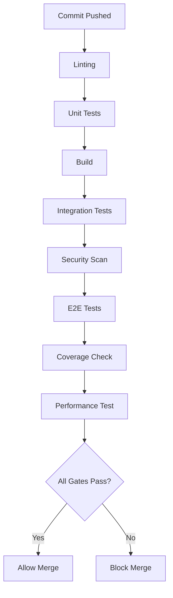

# CI/CD Quality Enforcement

**Version:** 1.0.0
**Last Updated:** 2026-01-30
**Status:** Production Standard

---

## Table of Contents

1. [Overview](#overview)
2. [Quality Gates](#quality-gates)
3. [Test Coverage Enforcement](#test-coverage-enforcement)
4. [Security Scanning Automation](#security-scanning-automation)
5. [Performance Regression Testing](#performance-regression-testing)
6. [Multi-Tenant Testing Automation](#multi-tenant-testing-automation)
7. [GitHub Actions Workflows](#github-actions-workflows)
8. [Pre-Commit Hooks](#pre-commit-hooks)
9. [Branch Protection Rules](#branch-protection-rules)
10. [Deployment Automation](#deployment-automation)

---

## Overview

### Purpose

This document defines **CI/CD quality enforcement standards** for KiteClass Platform, ensuring that:

- **No broken code reaches production**
- **Test coverage stays above 80%**
- **Security vulnerabilities are blocked automatically**
- **Performance regressions are detected early**
- **Multi-tenant security is validated on every commit**

### Core Principles

1. **Fail Fast** - Catch issues in CI before manual review
2. **Automate Everything** - No manual quality checks
3. **Block Merges** - Failing quality gates prevent PR merges
4. **Enforce Standards** - Automated enforcement of testing patterns
5. **Continuous Monitoring** - Track quality metrics over time

---

## Quality Gates

### Required Gates for PR Merge

All pull requests MUST pass these gates before merging:

| Gate | Requirement | Blocking? |
|------|-------------|-----------|
| **Unit Tests** | All tests pass | ✅ Yes |
| **Integration Tests** | All tests pass | ✅ Yes |
| **E2E Tests** | All critical paths pass | ✅ Yes |
| **Test Coverage** | ≥ 80% line coverage | ✅ Yes |
| **Security Scan** | No HIGH/CRITICAL vulnerabilities | ✅ Yes |
| **Linting** | No errors (warnings OK) | ✅ Yes |
| **Build** | Successful build (frontend + backend) | ✅ Yes |
| **Multi-Tenant Security** | Tenant isolation tests pass | ✅ Yes |
| **Performance** | No regression > 10% | ⚠️ Warning |
| **Code Review** | ≥ 1 approval from CODEOWNERS | ✅ Yes |

### Gate Execution Order



**Total Time Budget:** 15 minutes maximum (optimized with parallelization)

---

## Test Coverage Enforcement

### Coverage Requirements

```yaml
# .codecov.yml
coverage:
  status:
    project:
      default:
        target: 80%
        threshold: 1%
        if_ci_failed: error

    patch:
      default:
        target: 80%
        threshold: 5%

  ignore:
    - "**/*.test.ts"
    - "**/*.spec.ts"
    - "**/e2e/**"
    - "**/mocks/**"
    - "**/*.config.ts"
```

### Backend Coverage (Java + Spring Boot)

```xml
<!-- pom.xml - JaCoCo Configuration -->
<plugin>
    <groupId>org.jacoco</groupId>
    <artifactId>jacoco-maven-plugin</artifactId>
    <version>0.8.11</version>
    <executions>
        <execution>
            <goals>
                <goal>prepare-agent</goal>
            </goals>
        </execution>
        <execution>
            <id>report</id>
            <phase>test</phase>
            <goals>
                <goal>report</goal>
            </goals>
        </execution>
        <execution>
            <id>check</id>
            <goals>
                <goal>check</goal>
            </goals>
            <configuration>
                <rules>
                    <rule>
                        <element>BUNDLE</element>
                        <limits>
                            <limit>
                                <counter>LINE</counter>
                                <value>COVEREDRATIO</value>
                                <minimum>0.80</minimum>
                            </limit>
                            <limit>
                                <counter>BRANCH</counter>
                                <value>COVEREDRATIO</value>
                                <minimum>0.75</minimum>
                            </limit>
                        </limits>
                    </rule>
                </rules>
            </configuration>
        </execution>
    </executions>
</plugin>
```

**Command:**
```bash
mvn clean test jacoco:report jacoco:check
```

**Expected Output:**
```
[INFO] Coverage check passed:
[INFO] - Line coverage: 84.5% (target: 80%)
[INFO] - Branch coverage: 78.2% (target: 75%)
```

### Frontend Coverage (Vitest + React)

```typescript
// vitest.config.ts
import { defineConfig } from 'vitest/config';

export default defineConfig({
  test: {
    coverage: {
      provider: 'v8',
      reporter: ['text', 'json', 'html', 'lcov'],
      statements: 80,
      branches: 75,
      functions: 80,
      lines: 80,
      exclude: [
        '**/*.test.ts',
        '**/*.spec.ts',
        '**/e2e/**',
        '**/mocks/**',
        '**/*.config.ts',
        '**/node_modules/**',
      ],
    },
  },
});
```

**Command:**
```bash
npm run test:coverage
```

**Expected Output:**
```
----------------------------------|---------|----------|---------|---------|
File                              | % Stmts | % Branch | % Funcs | % Lines |
----------------------------------|---------|----------|---------|---------|
All files                         |   84.5  |   78.2   |   82.1  |   84.5  |
 components/features              |   92.1  |   85.3   |   90.0  |   92.1  |
  FeatureGate.tsx                 |   95.0  |   88.0   |   92.0  |   95.0  |
 components/payment               |   88.5  |   82.1   |   85.0  |   88.5  |
  PaymentQRCode.tsx               |   90.0  |   85.0   |   87.0  |   90.0  |
----------------------------------|---------|----------|---------|---------|
```

### Coverage Failure Handling

```yaml
# GitHub Actions - Coverage Check
- name: Check Coverage
  run: |
    npm run test:coverage
    if [ $? -ne 0 ]; then
      echo "❌ Coverage below 80% threshold"
      exit 1
    fi
```

**Blocked Merge Message:**
```
❌ Coverage check failed

Current coverage: 76.3%
Required coverage: 80%

Please add tests for:
- src/components/payment/PaymentStatusPoller.tsx (45% coverage)
- src/lib/api/payments.ts (62% coverage)
```

---

## Security Scanning Automation

### OWASP Dependency Check (Backend)

```xml
<!-- pom.xml -->
<plugin>
    <groupId>org.owasp</groupId>
    <artifactId>dependency-check-maven</artifactId>
    <version>9.0.9</version>
    <configuration>
        <failBuildOnCVSS>7</failBuildOnCVSS>
        <skipProvidedScope>true</skipProvidedScope>
        <skipRuntimeScope>false</skipRuntimeScope>
    </configuration>
    <executions>
        <execution>
            <goals>
                <goal>check</goal>
            </goals>
        </execution>
    </executions>
</plugin>
```

**Command:**
```bash
mvn dependency-check:check
```

**Fail on:** CVSS ≥ 7.0 (HIGH severity)

### Snyk Security Scan (Frontend + Backend)

```yaml
# .github/workflows/security-scan.yml
name: Security Scan

on:
  pull_request:
  push:
    branches: [main, develop]

jobs:
  snyk:
    runs-on: ubuntu-latest
    steps:
      - uses: actions/checkout@v4

      - name: Run Snyk (Backend)
        uses: snyk/actions/maven@master
        env:
          SNYK_TOKEN: ${{ secrets.SNYK_TOKEN }}
        with:
          args: --severity-threshold=high

      - name: Run Snyk (Frontend)
        uses: snyk/actions/node@master
        env:
          SNYK_TOKEN: ${{ secrets.SNYK_TOKEN }}
        with:
          args: --severity-threshold=high
```

**Blocked Merge Example:**
```
❌ Security vulnerabilities found

HIGH: Prototype Pollution in lodash@4.17.20
- CVE: CVE-2020-8203
- Recommendation: Upgrade to lodash@4.17.21

CRITICAL: SQL Injection in hibernate-core@5.6.10
- CVE: CVE-2023-XXXXX
- Recommendation: Upgrade to hibernate-core@6.4.0
```

### CodeQL Analysis (SAST)

```yaml
# .github/workflows/codeql-analysis.yml
name: CodeQL

on:
  pull_request:
  push:
    branches: [main]

jobs:
  analyze:
    runs-on: ubuntu-latest
    permissions:
      security-events: write

    strategy:
      matrix:
        language: ['java', 'typescript']

    steps:
      - uses: actions/checkout@v4

      - name: Initialize CodeQL
        uses: github/codeql-action/init@v3
        with:
          languages: ${{ matrix.language }}

      - name: Autobuild
        uses: github/codeql-action/autobuild@v3

      - name: Perform CodeQL Analysis
        uses: github/codeql-action/analyze@v3
```

**Detects:**
- SQL Injection vulnerabilities
- XSS vulnerabilities
- JWT token misuse
- Insecure cryptography
- Hardcoded secrets

### Secret Scanning

```yaml
# .github/workflows/secret-scan.yml
name: Secret Scan

on: [pull_request, push]

jobs:
  gitleaks:
    runs-on: ubuntu-latest
    steps:
      - uses: actions/checkout@v4
        with:
          fetch-depth: 0

      - name: Gitleaks Scan
        uses: gitleaks/gitleaks-action@v2
        env:
          GITHUB_TOKEN: ${{ secrets.GITHUB_TOKEN }}
```

**Detects:**
- AWS keys
- API tokens
- JWT secrets
- Database passwords
- Private keys

---

## Performance Regression Testing

### Backend Performance Benchmarks (JMH)

```java
// src/test/java/com/kiteclass/benchmarks/StudentServiceBenchmark.java
@State(Scope.Benchmark)
@BenchmarkMode(Mode.AverageTime)
@OutputTimeUnit(TimeUnit.MILLISECONDS)
public class StudentServiceBenchmark {

    private StudentService studentService;

    @Benchmark
    public void getStudents() {
        studentService.getStudents(PageRequest.of(0, 20));
    }

    @Benchmark
    public void getStudentById() {
        studentService.getStudentById(1L);
    }
}
```

**CI Integration:**
```yaml
- name: Run Performance Benchmarks
  run: |
    mvn jmh:benchmark

    # Compare with baseline
    python scripts/compare-benchmarks.py \
      --current target/jmh-result.json \
      --baseline benchmarks/baseline.json \
      --threshold 10
```

**Fail if:** Performance degrades > 10%

### Frontend Performance (Lighthouse CI)

```yaml
# .github/workflows/lighthouse-ci.yml
name: Lighthouse CI

on: [pull_request]

jobs:
  lighthouse:
    runs-on: ubuntu-latest
    steps:
      - uses: actions/checkout@v4

      - name: Build
        run: npm run build

      - name: Run Lighthouse CI
        uses: treosh/lighthouse-ci-action@v10
        with:
          urls: |
            http://localhost:3000
            http://localhost:3000/dashboard
            http://localhost:3000/students
          configPath: './.lighthouserc.json'
          uploadArtifacts: true
```

**Configuration:**
```json
// .lighthouserc.json
{
  "ci": {
    "assert": {
      "assertions": {
        "categories:performance": ["error", { "minScore": 0.8 }],
        "categories:accessibility": ["error", { "minScore": 0.9 }],
        "first-contentful-paint": ["error", { "maxNumericValue": 2000 }],
        "interactive": ["error", { "maxNumericValue": 3000 }]
      }
    }
  }
}
```

**Blocked Merge Example:**
```
❌ Lighthouse performance regression

Performance Score: 72 (baseline: 85)
- First Contentful Paint: 2.8s (baseline: 1.5s)
- Time to Interactive: 4.2s (baseline: 2.9s)

Recommendations:
- Reduce JavaScript bundle size (current: 850KB, recommended: <500KB)
- Optimize images (3 images > 200KB)
```

---

## Multi-Tenant Testing Automation

### Tenant Isolation Test Suite

```java
// src/test/java/com/kiteclass/integration/MultiTenantIsolationTest.java
@SpringBootTest
@ActiveProfiles("test")
public class MultiTenantIsolationTest {

    @Test
    void shouldPreventCrossTenantDataAccess() {
        UUID tenant1 = UUID.randomUUID();
        UUID tenant2 = UUID.randomUUID();

        setTenantContext(tenant1);
        Student student1 = studentRepository.save(/* tenant1 student */);

        setTenantContext(tenant2);
        Optional<Student> result = studentRepository.findById(student1.getId());

        assertThat(result).isEmpty(); // Tenant filter prevents access
    }

    @Test
    void shouldPreventCrossTenantJWTUsage() {
        UUID tenant1 = UUID.randomUUID();
        String token1 = jwtService.generateToken(1L, "user@t1.com", tenant1, List.of("TEACHER"));

        UUID tenant2 = UUID.randomUUID();
        setTenantContext(tenant2);

        assertThatThrownBy(() -> jwtService.validateToken(token1))
            .isInstanceOf(InvalidTokenException.class)
            .hasMessageContaining("Invalid token for this instance");
    }
}
```

**CI Enforcement:**
```yaml
- name: Run Multi-Tenant Security Tests
  run: |
    mvn test -Dtest=MultiTenantIsolationTest

    if [ $? -ne 0 ]; then
      echo "❌ Multi-tenant security tests failed"
      exit 1
    fi
```

### Feature Detection Tests

```java
@Test
void shouldBlockFeatureAccessForInvalidTier() {
    UUID instanceId = UUID.randomUUID();
    configRepo.save(InstanceConfig.builder()
        .instanceId(instanceId)
        .tier(PricingTier.BASIC)
        .features(Map.of("ENGAGEMENT", false))
        .build());

    assertThatThrownBy(() -> featureService.requireFeature(instanceId, "ENGAGEMENT"))
        .isInstanceOf(FeatureNotAvailableException.class)
        .hasMessageContaining("STANDARD");
}
```

**CI Enforcement:**
```yaml
- name: Run Feature Detection Tests
  run: |
    mvn test -Dtest=FeatureDetectionTest
```

---

## GitHub Actions Workflows

### Main CI Workflow

```yaml
# .github/workflows/ci.yml
name: CI

on:
  pull_request:
  push:
    branches: [main, develop]

jobs:
  backend-tests:
    runs-on: ubuntu-latest
    services:
      postgres:
        image: postgres:16
        env:
          POSTGRES_DB: kiteclass_test
          POSTGRES_USER: test
          POSTGRES_PASSWORD: test
        options: >-
          --health-cmd pg_isready
          --health-interval 10s
          --health-timeout 5s
          --health-retries 5
      redis:
        image: redis:7
        options: >-
          --health-cmd "redis-cli ping"
          --health-interval 10s

    steps:
      - uses: actions/checkout@v4

      - name: Set up JDK 21
        uses: actions/setup-java@v4
        with:
          java-version: '21'
          distribution: 'temurin'
          cache: 'maven'

      - name: Run Backend Tests
        run: |
          cd kiteclass/kiteclass-backend
          mvn clean test

      - name: Check Test Coverage
        run: |
          mvn jacoco:report jacoco:check

      - name: Upload Coverage to Codecov
        uses: codecov/codecov-action@v4
        with:
          file: ./target/site/jacoco/jacoco.xml
          flags: backend

  frontend-tests:
    runs-on: ubuntu-latest
    steps:
      - uses: actions/checkout@v4

      - name: Set up Node.js
        uses: actions/setup-node@v4
        with:
          node-version: '20'
          cache: 'npm'
          cache-dependency-path: 'kiteclass/kiteclass-frontend/package-lock.json'

      - name: Install Dependencies
        run: |
          cd kiteclass/kiteclass-frontend
          npm ci

      - name: Run Frontend Tests
        run: |
          npm run test:coverage

      - name: Upload Coverage to Codecov
        uses: codecov/codecov-action@v4
        with:
          file: ./coverage/lcov.info
          flags: frontend

  e2e-tests:
    runs-on: ubuntu-latest
    steps:
      - uses: actions/checkout@v4

      - name: Set up Node.js
        uses: actions/setup-node@v4
        with:
          node-version: '20'

      - name: Install Playwright
        run: |
          cd kiteclass/kiteclass-frontend
          npm ci
          npx playwright install --with-deps

      - name: Run E2E Tests
        run: |
          npm run test:e2e

      - name: Upload E2E Test Results
        if: always()
        uses: actions/upload-artifact@v4
        with:
          name: playwright-report
          path: playwright-report/

  security-scan:
    runs-on: ubuntu-latest
    steps:
      - uses: actions/checkout@v4

      - name: Run OWASP Dependency Check
        run: |
          cd kiteclass/kiteclass-backend
          mvn dependency-check:check

      - name: Run Snyk
        uses: snyk/actions/maven@master
        env:
          SNYK_TOKEN: ${{ secrets.SNYK_TOKEN }}
        with:
          args: --severity-threshold=high

  build:
    runs-on: ubuntu-latest
    needs: [backend-tests, frontend-tests]
    steps:
      - uses: actions/checkout@v4

      - name: Build Backend
        run: |
          cd kiteclass/kiteclass-backend
          mvn clean package -DskipTests

      - name: Build Frontend
        run: |
          cd kiteclass/kiteclass-frontend
          npm run build

      - name: Upload Build Artifacts
        uses: actions/upload-artifact@v4
        with:
          name: build-artifacts
          path: |
            kiteclass/kiteclass-backend/target/*.jar
            kiteclass/kiteclass-frontend/.next/
```

### PR Merge Requirements

```yaml
# .github/workflows/pr-checks.yml
name: PR Checks

on:
  pull_request:
    types: [opened, synchronize, reopened]

jobs:
  quality-gates:
    runs-on: ubuntu-latest
    steps:
      - name: Check All Required Checks Passed
        uses: actions/github-script@v7
        with:
          script: |
            const { data: checks } = await github.rest.checks.listForRef({
              owner: context.repo.owner,
              repo: context.repo.repo,
              ref: context.payload.pull_request.head.sha,
            });

            const requiredChecks = [
              'backend-tests',
              'frontend-tests',
              'e2e-tests',
              'security-scan',
              'build',
            ];

            const failedChecks = requiredChecks.filter(name => {
              const check = checks.check_runs.find(c => c.name === name);
              return !check || check.conclusion !== 'success';
            });

            if (failedChecks.length > 0) {
              core.setFailed(`❌ Required checks failed: ${failedChecks.join(', ')}`);
            }
```

---

## Pre-Commit Hooks

### Husky + Lint-Staged Setup

```json
// package.json
{
  "scripts": {
    "prepare": "husky install"
  },
  "lint-staged": {
    "*.{ts,tsx}": [
      "eslint --fix",
      "prettier --write"
    ],
    "*.{java}": [
      "mvn spotless:apply"
    ]
  }
}
```

### Pre-Commit Hook

```bash
#!/bin/sh
# .husky/pre-commit

# Run lint-staged
npx lint-staged

# Run multi-tenant security checks on changed files
changed_files=$(git diff --cached --name-only --diff-filter=ACM | grep -E '\.(java|ts|tsx)$')

if [ -n "$changed_files" ]; then
  echo "Running multi-tenant security checks..."

  # Check for hardcoded instance IDs
  if echo "$changed_files" | xargs grep -n "instanceId.*=.*UUID.fromString" > /dev/null; then
    echo "❌ Hardcoded instance UUID detected"
    echo "Use TenantContext.getCurrentInstanceId() instead"
    exit 1
  fi

  # Check for missing @TenantScoped annotation
  if echo "$changed_files" | xargs grep -l "class.*Repository" | xargs grep -L "@TenantScoped" > /dev/null; then
    echo "⚠️  Warning: Repository class missing @TenantScoped annotation"
  fi
fi

# Run affected tests
npm run test:affected
```

### Commit Message Linting

```bash
#!/bin/sh
# .husky/commit-msg

npx --no-install commitlint --edit "$1"
```

**Configuration:**
```javascript
// commitlint.config.js
module.exports = {
  extends: ['@commitlint/config-conventional'],
  rules: {
    'type-enum': [
      2,
      'always',
      [
        'feat',     // New feature
        'fix',      // Bug fix
        'docs',     // Documentation
        'test',     // Tests
        'refactor', // Refactoring
        'perf',     // Performance
        'security', // Security fix
      ],
    ],
    'subject-case': [2, 'always', 'sentence-case'],
  },
};
```

**Valid Examples:**
```
feat: Add VietQR payment integration
fix: Prevent cross-tenant data access in student API
security: Fix JWT token validation for multi-tenant
test: Add trial system E2E tests
```

---

## Branch Protection Rules

### GitHub Branch Protection

```yaml
# Required for 'main' branch
Require pull request reviews before merging: ✅
  - Required approvals: 1
  - Dismiss stale reviews: ✅
  - Require review from CODEOWNERS: ✅

Require status checks to pass before merging: ✅
  - backend-tests
  - frontend-tests
  - e2e-tests
  - security-scan
  - build
  - codecov/project

Require branches to be up to date: ✅
Require conversation resolution before merging: ✅
Require signed commits: ✅
Require linear history: ✅

Do not allow bypassing the above settings: ✅
```

### CODEOWNERS

```
# .github/CODEOWNERS

# Default owners
* @kiteclass/core-team

# Backend code
/kiteclass/kiteclass-backend/** @kiteclass/backend-team

# Frontend code
/kiteclass/kiteclass-frontend/** @kiteclass/frontend-team

# Security-critical files
/kiteclass/kiteclass-backend/src/main/java/com/kiteclass/security/** @kiteclass/security-team
/kiteclass/kiteclass-backend/src/main/java/com/kiteclass/tenant/** @kiteclass/security-team

# Payment integration
/kiteclass/kiteclass-backend/src/main/java/com/kiteclass/payment/** @kiteclass/backend-team @kiteclass/finance-team

# CI/CD configurations
/.github/workflows/** @kiteclass/devops-team
```

---

## Deployment Automation

### Staging Deployment (Auto on main)

```yaml
# .github/workflows/deploy-staging.yml
name: Deploy to Staging

on:
  push:
    branches: [main]

jobs:
  deploy:
    runs-on: ubuntu-latest
    environment: staging
    steps:
      - uses: actions/checkout@v4

      - name: Deploy Backend
        run: |
          # Deploy to staging environment
          ./scripts/deploy-backend.sh staging

      - name: Deploy Frontend
        run: |
          ./scripts/deploy-frontend.sh staging

      - name: Run Smoke Tests
        run: |
          npm run test:smoke -- --env=staging
```

### Production Deployment (Manual approval)

```yaml
# .github/workflows/deploy-production.yml
name: Deploy to Production

on:
  workflow_dispatch:
    inputs:
      version:
        description: 'Version to deploy'
        required: true

jobs:
  deploy:
    runs-on: ubuntu-latest
    environment:
      name: production
      url: https://kiteclass.com
    steps:
      - name: Require Manual Approval
        uses: trstringer/manual-approval@v1
        with:
          approvers: '@kiteclass/production-deployers'

      - uses: actions/checkout@v4
        with:
          ref: ${{ github.event.inputs.version }}

      - name: Deploy to Production
        run: |
          ./scripts/deploy-production.sh ${{ github.event.inputs.version }}

      - name: Run Production Smoke Tests
        run: |
          npm run test:smoke -- --env=production

      - name: Notify Deployment
        uses: slackapi/slack-github-action@v1
        with:
          payload: |
            {
              "text": "🚀 Production deployment successful: ${{ github.event.inputs.version }}"
            }
        env:
          SLACK_WEBHOOK_URL: ${{ secrets.SLACK_WEBHOOK }}
```

---

## Best Practices Summary

### DO ✅

1. **Enforce 80% test coverage** on all new code
2. **Block merges** on failing quality gates
3. **Automate security scans** (Snyk, OWASP, CodeQL)
4. **Run multi-tenant security tests** on every commit
5. **Use pre-commit hooks** to catch issues early
6. **Require code reviews** from CODEOWNERS
7. **Track performance regressions** with automated benchmarks
8. **Use signed commits** for audit trail
9. **Automate staging deployments** on main branch
10. **Require manual approval** for production deploys

### DON'T ❌

1. **Don't bypass quality gates** (no admin overrides)
2. **Don't skip security scans** (even for "small" changes)
3. **Don't merge without tests** (enforce coverage gates)
4. **Don't skip multi-tenant tests** (critical security risk)
5. **Don't deploy without smoke tests** (verify basic functionality)
6. **Don't hardcode secrets** in CI (use GitHub Secrets)
7. **Don't ignore performance regressions** (track over time)
8. **Don't skip E2E tests** for "backend-only" changes (full system validation)

---

## Monitoring and Metrics

### Quality Metrics Dashboard

Track these metrics over time:

- **Test Coverage Trend** (target: ≥ 80%)
- **Security Vulnerability Count** (target: 0 HIGH/CRITICAL)
- **Mean Time to Fix (MTTF)** for failing builds
- **PR Merge Time** (from open to merge)
- **Deployment Frequency** (target: daily to staging)
- **Deployment Success Rate** (target: ≥ 95%)
- **Performance Regression Count** (target: 0 per sprint)

---

**Document Version:** 1.0.0
**Last Updated:** 2026-01-30
**Next Review:** 2026-02-28
