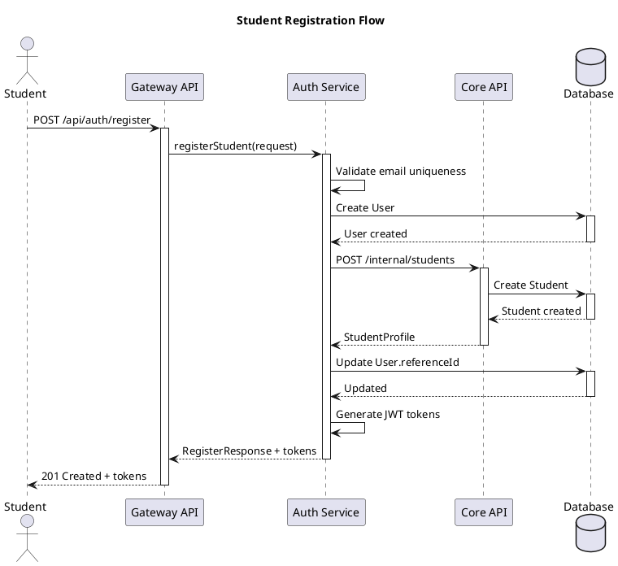
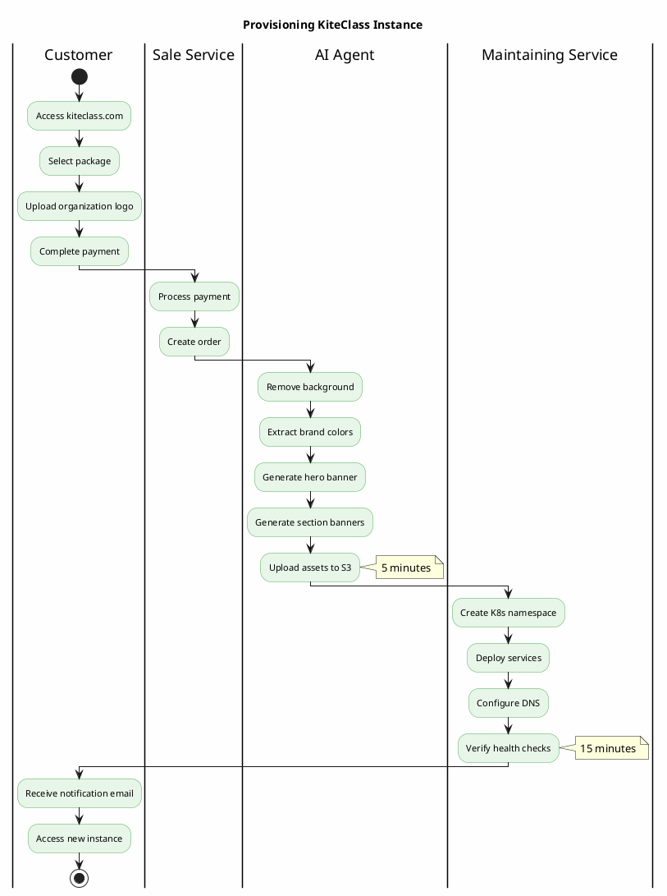
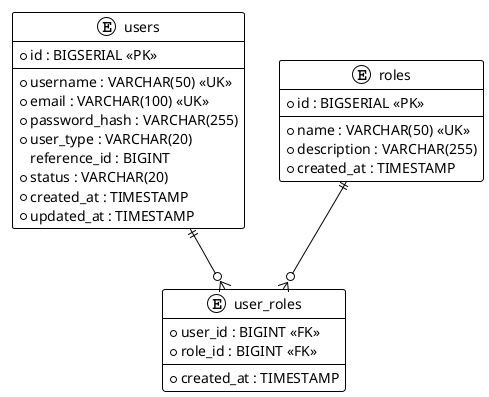

# PlantUML Diagrams Skill

## OVERVIEW

This skill provides guidelines and templates for creating technical diagrams using PlantUML for the KiteClass Platform project.

**When to use this skill:**
- Creating architecture diagrams
- Documenting system flows
- Visualizing sequences and processes
- Generating ERD or component diagrams

## PLANTUML SETUP

### Location
All PlantUML files are stored in: `/mnt/e/person/2026-Kite-Class-Platform/documents/diagrams/`

### Required Tools
- **plantuml.jar**: Located at `documents/diagrams/plantuml.jar`
- Java Runtime Environment (JRE) 8+

### File Naming Convention
- Use descriptive kebab-case names
- Include sequence number for ordered diagrams
- Format: `{number}-{description}.puml`
- Examples:
  - `01-architecture-simple.puml`
  - `02-bfd-actors.puml`
  - `03-erd.puml`
  - `05-system-overview-v3.puml`

## RENDERING DIAGRAMS

### Method 1: PlantUML CLI (Recommended)
```bash
cd /mnt/e/person/2026-Kite-Class-Platform/documents/diagrams

# Render single diagram
java -jar plantuml.jar -tpng {filename}.puml

# Render all diagrams
java -jar plantuml.jar -tpng *.puml

# Render with specific output directory
java -jar plantuml.jar -tpng {filename}.puml -o generated
```

### Method 2: PlantUML Online
1. Visit: http://www.plantuml.com/plantuml/uml/
2. Copy `.puml` file content
3. Paste into editor
4. Click "Submit"
5. Download PNG

### Method 3: VS Code Extension
1. Install "PlantUML" extension
2. Open `.puml` file
3. Press `Alt+D` to preview
4. Right-click → "Export Current Diagram" → PNG

### Output Requirements
- **Format**: PNG
- **Resolution**: Minimum 1920px width for presentations
- **Quality**: Text must be readable
- **Colors**: Ensure proper contrast

## DIAGRAM TYPES & TEMPLATES

### 1. Architecture Diagram (C4 Component Level)

**Use case**: Show system components and their relationships

**Template**:
```plantuml
@startuml
!define AWSPUML https://raw.githubusercontent.com/awslabs/aws-icons-for-plantuml/v14.0/dist
!include AWSPUML/AWSCommon.puml
!include AWSPUML/Compute/EKS.puml
!include AWSPUML/Database/Aurora.puml

title KiteClass System Architecture

' Define actors
actor "User" as user

' Define components
package "KiteClass Gateway" #LightBlue {
  component "API Gateway" as gateway
  component "Auth Service" as auth
}

package "KiteClass Core" #LightGreen {
  component "Student Service" as student
  component "Teacher Service" as teacher
  component "Class Service" as class
}

' Define databases
database "PostgreSQL" as db

' Define relationships
user --> gateway
gateway --> auth
gateway --> student
gateway --> teacher
gateway --> class

student --> db
teacher --> db
class --> db

@enduml
```

**Color palette**:
- Gateway/Infrastructure: `#LightBlue` or `#ADD8E6`
- Core Services: `#LightGreen` or `#90EE90`
- External Services: `#Orange` or `#FFD700`
- Databases: `#LightGray` or `#D3D3D3`

### 2. Sequence Diagram

**Use case**: Show interaction flow between components

**Template**:


### 3. Activity Diagram (Flow)

**Use case**: Document business processes or workflows

**Template**:


### 4. Deployment Diagram

**Use case**: Show infrastructure and deployment architecture

**Template**:
```plantuml
@startuml
!define AWSPUML https://raw.githubusercontent.com/awslabs/aws-icons-for-plantuml/v14.0/dist
!include AWSPUML/AWSCommon.puml
!include AWSPUML/NetworkingContentDelivery/Route53.puml
!include AWSPUML/NetworkingContentDelivery/CloudFront.puml
!include AWSPUML/Compute/EKS.puml
!include AWSPUML/Database/Aurora.puml
!include AWSPUML/Storage/S3.puml

title KiteClass AWS Deployment

Route53(dns, "Route 53", "DNS Management")
CloudFront(cdn, "CloudFront", "CDN")

rectangle "EKS Cluster" as eks {
  package "kiteclass-gateway namespace" {
    node "Gateway Pod" as gw1
    node "Gateway Pod" as gw2
  }

  package "kiteclass-core namespace" {
    node "Core Pod" as core1
    node "Core Pod" as core2
  }
}

Aurora(db, "Aurora PostgreSQL", "Database Cluster")
S3(s3, "S3", "Static Assets")

dns --> cdn
cdn --> eks
gw1 --> db
gw2 --> db
core1 --> db
core2 --> db
core1 --> s3
core2 --> s3

@enduml
```

### 5. Entity Relationship Diagram

**Use case**: Document database schema

**Template**:


## BEST PRACTICES

### 1. Keep Diagrams Simple
- Focus on key components and relationships
- Avoid clutter - remove unnecessary details
- Use proper spacing and alignment
- Maximum 10-15 components per diagram

### 2. Use Consistent Styling
- Define color palette at project level
- Use same colors for same component types
- Consistent font sizes
- Standard arrow types

### 3. Add Context
- Always include title
- Add notes for complex parts
- Include timing for flows (e.g., "5 minutes")
- Use legends when needed

### 4. Documentation
- Add comments in `.puml` files
- Document purpose at top of file
- Link to related documents
- Include version if diagram evolves

### 5. File Organization
```
documents/diagrams/
├── plantuml.jar                    # PlantUML renderer
├── 01-architecture-simple.puml     # Simple architecture
├── 02-bfd-actors.puml             # Business flow
├── 03-erd.puml                    # Database ERD
├── 04-architecture-full.puml      # Detailed architecture
├── 05-system-overview-v3.puml     # System overview
├── *.png                          # Generated images
└── README.md                      # Usage instructions
```

## COMMON PLANTUML COMMANDS

### Layout Control
```plantuml
' Set direction
left to right direction
top to bottom direction

' Spacing
skinparam nodesep 50
skinparam ranksep 50

' Hide elements
hide empty members
hide circle
```

### Styling
```plantuml
' Colors
skinparam backgroundColor #FFFFFF
skinparam componentBackgroundColor #ADD8E6
skinparam componentBorderColor #4682B4

' Fonts
skinparam defaultFontSize 12
skinparam defaultFontName Arial
```

### Notes and Comments
```plantuml
' This is a comment

note right of Component
  This is a note
  explaining the component
end note

note "Floating note" as N1
```

### Grouping
```plantuml
package "Package Name" {
  component A
  component B
}

rectangle "Group" {
  component C
  component D
}

frame "Frame" {
  component E
}
```

## AWS ICONS INTEGRATION

### Available Icons
Common AWS icons available from `awslabs/aws-icons-for-plantuml`:
- **Compute**: EC2, EKS, Lambda, ECS
- **Database**: Aurora, RDS, DynamoDB, ElastiCache
- **Storage**: S3, EBS, EFS
- **Networking**: Route53, CloudFront, ALB, VPC
- **Integration**: SQS, SNS, EventBridge

### Usage
```plantuml
@startuml
!define AWSPUML https://raw.githubusercontent.com/awslabs/aws-icons-for-plantuml/v14.0/dist
!include AWSPUML/AWSCommon.puml
!include AWSPUML/Compute/EKS.puml
!include AWSPUML/Database/Aurora.puml

EKS(eks, "EKS Cluster", "Kubernetes")
Aurora(db, "Aurora", "PostgreSQL")

eks -> db
@enduml
```

## WORKFLOW

### Creating New Diagram

1. **Define Purpose**
   - What are you documenting?
   - Who is the audience?
   - What level of detail needed?

2. **Choose Diagram Type**
   - Architecture → Component Diagram
   - Process Flow → Activity Diagram
   - API Interaction → Sequence Diagram
   - Database → ERD
   - Infrastructure → Deployment Diagram

3. **Create .puml File**
   ```bash
   cd /mnt/e/person/2026-Kite-Class-Platform/documents/diagrams
   # Create with appropriate naming
   touch 06-new-diagram.puml
   ```

4. **Write PlantUML Code**
   - Start with template
   - Add components
   - Define relationships
   - Apply styling

5. **Render and Review**
   ```bash
   java -jar plantuml.jar -tpng 06-new-diagram.puml
   # Review output PNG
   ```

6. **Iterate**
   - Adjust spacing
   - Fix colors
   - Add notes
   - Re-render

7. **Commit**
   ```bash
   git add documents/diagrams/06-new-diagram.puml
   git add documents/diagrams/06-new-diagram.png
   git commit -m "docs(diagrams): add new diagram for X"
   ```

## TROUBLESHOOTING

### Common Issues

**Issue**: Diagram too wide
```plantuml
' Solution: Force vertical layout
top to bottom direction
' Or: Split into multiple diagrams
```

**Issue**: Text overlapping
```plantuml
' Solution: Increase spacing
skinparam nodesep 80
skinparam ranksep 80
```

**Issue**: Colors not showing
```plantuml
' Solution: Ensure proper syntax
component "Name" as alias #ColorCode
```

**Issue**: PNG quality poor
```bash
# Solution: Use SVG instead
java -jar plantuml.jar -tsvg diagram.puml
```

**Issue**: AWS icons not loading
```plantuml
' Solution: Verify internet connection and URL
!define AWSPUML https://raw.githubusercontent.com/awslabs/aws-icons-for-plantuml/v14.0/dist
!include AWSPUML/AWSCommon.puml
```

## INTEGRATION WITH REPORTS

When creating diagrams for reports (e.g., graduation thesis):

1. **Create high-resolution PNG**
   ```bash
   java -jar plantuml.jar -tpng diagram.puml
   # Output: 1920px+ width
   ```

2. **Mark insertion points in text reports**
   ```
   [CHO NAY CHEN ANH: diagram-name.png]
   Hinh 1: Mo ta so do
   ```

3. **Reference in documentation**
   ```markdown
   See Figure 1: Architecture Diagram (documents/diagrams/architecture.png)
   ```

## EXAMPLES IN PROJECT

Current diagrams in the project:
- `01-architecture-simple.puml` - Simple system overview
- `02-bfd-actors.puml` - Business flow with actors
- `03-erd.puml` - Database entity relationships
- `04-architecture-full.puml` - Detailed architecture
- `05-system-overview-v3.puml` - System overview version 3
- `06-business-flow-v3.puml` - Business flow version 3

## RELATED SKILLS

- `documentation-structure.md` - For documentation organization
- `architecture-overview.md` - For system architecture details
- `database-design.md` - For ERD content

## CHECKLIST

Before committing diagrams:
- [ ] File follows naming convention
- [ ] Diagram has clear title
- [ ] Colors are consistent with project palette
- [ ] Text is readable at 100% zoom
- [ ] PNG rendered successfully
- [ ] Comments added to .puml file
- [ ] Diagram referenced in relevant docs
- [ ] Both .puml and .png committed to git

## RESOURCES

- PlantUML Official: https://plantuml.com/
- AWS Icons: https://github.com/awslabs/aws-icons-for-plantuml
- C4 Model: https://c4model.com/
- PlantUML Real-world examples: https://real-world-plantuml.com/
