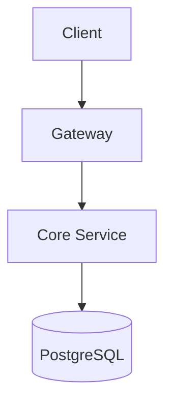
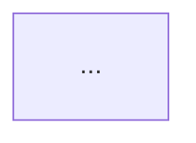

# Diagrams — Technical Documentation

## Tại sao cần diagrams?

- Architecture overview cho developer mới (onboarding)
- Business flows cho stakeholder review
- ERD cho database design
- Sequence diagram cho API integration

**Không có diagrams → mọi kiến trúc chỉ tồn tại trong đầu developer.**

## Cấu trúc folder

```
documents/06-diagrams/
├── README.md               # Index: danh sách diagrams + mục đích
├── source/                  # Source files (.puml, .mmd, .drawio)
├── rendered/                # Output files (.png, .svg) — committed
└── tools/                   # Render tools (plantuml.jar, scripts)
```

**Rule:** Commit CẢ source + rendered. Người đọc không cần install tool để xem diagram.

## Tool Options

| Tool | Format | Ưu điểm | Nhược điểm |
|------|--------|---------|------------|
| **PlantUML** | `.puml` | Text-based, git-friendly, nhiều diagram types | Cần Java runtime |
| **Mermaid** | `.mmd` | Native trong GitHub/GitLab markdown | Ít diagram types hơn PlantUML |
| **Draw.io** | `.drawio` | Visual editor, export PNG/SVG | Binary file, khó diff |

**Recommend:** PlantUML cho projects có Java. Mermaid cho projects nhẹ.

## PlantUML Setup

### Prerequisites

**MUST install CẢ HAI:**

1. **Java 8+** (runtime cho PlantUML)
2. **Graphviz** (render engine cho hầu hết diagram types)

```bash
# Ubuntu/WSL2:
sudo apt-get install -y default-jre graphviz

# Verify:
java -version
dot -V
```

**Không có Graphviz → PNG render ra lỗi đỏ "Cannot find Graphviz"** thay vì diagram thật.

### Install PlantUML

```bash
# Download jar vào tools/ (gitignored)
mkdir -p documents/06-diagrams/tools
curl -L -o documents/06-diagrams/tools/plantuml.jar \
  "https://github.com/plantuml/plantuml/releases/latest/download/plantuml.jar"

# Verify:
java -jar documents/06-diagrams/tools/plantuml.jar -testdot
```

**VS Code extension** (preview only): `jebbs.plantuml`

### Render

```bash
# Dùng script (recommend)
scripts/render-diagrams.sh

# Hoặc manual
java -jar documents/06-diagrams/tools/plantuml.jar \
  -tpng -o "$(pwd)/documents/06-diagrams/rendered" \
  documents/06-diagrams/source/*.puml
```

### Syntax Gotchas

| Vấn đề | Ví dụ | Fix |
|--------|-------|-----|
| `()` trong activity label | `:Call method();` | Bỏ `()`: `:Call method;` |
| `{}` trong label | `:Return {};` | Bỏ `{}`: `:Return object;` |
| `/` trong label | `:true/false;` | Dùng text: `:true or false;` |
| File quá dài | >200 lines | Chia thành sub-diagrams |

## Mermaid Setup (alternative)

Không cần install — render trực tiếp trong GitHub markdown:

````markdown

````

## Mermaid Best Practices (Wave thesis-2 Round 2.8 lessons)

### Init config cho diagrams complex

Mọi flowchart >8 nodes hoặc có subgraph clusters SHOULD include init config:

````markdown

````

**Why each param:**
- `nodeSpacing: 30` — tighter horizontal (default 50) — narrower aspect, more vertical
- `rankSpacing: 70` — more vertical breathing (default 50) — clearer tier separation
- `padding: 20` — inner padding cho subgraph (default 8) — text không sát border
- `subGraphTitleMargin: {top: 10, bottom: 15}` — **CRITICAL khi fontSize ≥16px** — subgraph title không đè chữ với child nodes
- `fontSize: 20-24px` — **REQUIRED khi diagram embed vào docx/PDF A4 size** — Mermaid source PNG được scale-down (vd 1711px → 16cm display = 680px target = 2.5x downscale); fontSize 16px sau scale-down còn ~6.4px effective → unreadable. Thử 22-24px cho readable. Default ~14px chỉ dùng cho HTML web view (no scale-down).

### Subgraph title rules

- **Length ≤30 chars** — long titles overlap với child nodes khi fontSize large
- **NO `<br/>` trong subgraph title** — Mermaid parser unreliable across versions
- **Mixed VN+EN OK** trong title body nhưng KHÔNG mix trong cùng word

**❌ BAD:** `subgraph FrontendCluster["Tầng giao diện ứng dụng người dùng — Next.js 15 framework cluster"]` (62 chars, overlaps)

**✅ GOOD:** `subgraph FrontendCluster["Frontend Next.js 15"]` (22 chars)

### Aspect ratio control

Mermaid auto-layout produces aspect based on node count + connectivity:
- **Landscape (>1.5):** Many nodes per rank, few ranks. Common khi many siblings.
- **Square (~1.0):** Balanced node distribution. Target cho most architecture diagrams.
- **Portrait (<0.7):** Few nodes per rank, many ranks. Common với linear chains.

**Force taller layout** (more vertical):
1. Use `direction TB` inside subgraphs (stack children vertically)
2. Aggregate edges to subgraph level (vd `ServiceCluster -.-> InfraCluster` thay vì 5×4=20 individual edges)
3. Shorten node labels to single line (no `<br/>` chains)
4. Increase `rankSpacing` to 70-100

### Anti-pattern: aspect 3+ very flat OR 0.4 very tall

- **Aspect >3:** Image squashed flat (height <5cm at 16cm width). Restructure: split nodes across more ranks (use TB) OR break long chains into 2-3 vertical clusters.
- **Aspect <0.5:** Image too tall (height >20cm = full A4 page). Restructure: use LR for sub-flows OR split single chain into 2 vertical columns.

### AWS architecture diagrams — use PlantUML với AWS Icons stdlib

Mermaid KHÔNG support service-specific icons. Cho professional AWS architecture diagrams với official AWS service logos (EC2, RDS, S3, ALB, SES, CloudWatch, etc.), **use PlantUML với AWS Icons stdlib** thay vì Mermaid flowchart.

**Setup (pipeline):**
- Local `plantuml.jar` tại `documents/06-diagrams/tools/plantuml.jar`
- Render via subprocess: `java -DPLANTUML_SECURITY_PROFILE=INTERNET -jar plantuml.jar -tpng <file>.puml`
- INTERNET security profile để allow `!includeurl` từ awslabs repo
- SMETANA layout engine (`!pragma layout smetana`) cho rendering không cần graphviz

**Source pattern:**
````markdown
```plantuml
@startuml
!define AWSPuml https://raw.githubusercontent.com/awslabs/aws-icons-for-plantuml/v18.0/dist
!includeurl AWSPuml/AWSCommon.puml
!includeurl AWSPuml/Compute/EC2.puml
!includeurl AWSPuml/Database/RDS.puml
!includeurl AWSPuml/Storage/SimpleStorageService.puml
!includeurl AWSPuml/NetworkingContentDelivery/ElasticLoadBalancing.puml

skinparam linetype ortho
skinparam defaultFontSize 26
skinparam ArrowFontSize 22
skinparam ranksep 70
skinparam nodesep 50

actor "Người dùng" as User
cloud "Cloudflare\nDNS + CDN" as CF

rectangle "AWS Region — ap-southeast-1" {
  ElasticLoadBalancing(ALB, "Application LB", "HTTPS + TLS 1.3")
  rectangle "Compute (EC2 t3.micro × 2)" {
    EC2(KH, "kh-backend", "Gateway + services")
    EC2(KC, "kc-app", "KiteClass + frontend")
  }
  RDS(DB, "RDS PostgreSQL 16", "db.t3.micro + RLS")
  SimpleStorageService(S3, "S3", "multi-tenant prefix")
}

User --> CF --> ALB
ALB --> KH
ALB --> KC
KH --> DB
KC --> DB
@enduml
```
````

**Key skinparams cho thesis A4 docx embed:**
- `defaultFontSize 26` — text readable post scale-down (PlantUML scales differently from Mermaid)
- `ArrowFontSize 22` — arrow labels readable
- `linetype ortho` — orthogonal arrows (cleaner cho architecture diagram)
- `ranksep 70` + `nodesep 50` — breathing room between ranks/nodes
- `ArrowThickness 2` — arrows visible post scale-down

**AWS Icons categories available** (https://github.com/awslabs/aws-icons-for-plantuml/tree/main/dist):
- `Compute/` — EC2, Lambda, ECS, EKS, Fargate, Batch
- `Database/` — RDS, DynamoDB, ElastiCache, Aurora, Neptune
- `Storage/` — SimpleStorageService (S3), EBS, EFS, FSx, Glacier
- `NetworkingContentDelivery/` — ElasticLoadBalancing (ALB/NLB/CLB), CloudFront, Route53, VPC
- `SecurityIdentityCompliance/` — SecretsManager, KMS, IAM, Cognito, GuardDuty
- `ManagementGovernance/` — CloudWatch, CloudTrail, Config, Systems Manager
- `BusinessApplications/` — SimpleEmailService (SES), WorkMail, Chime
- `Containers/` — ElasticContainerRegistry (ECR), ECS, EKS
- `ApplicationIntegration/` — SQS, SNS, EventBridge, Step Functions

**Worked example:** Hình 4.1 thesis-v1.docx rewrite từ Mermaid flowchart → PlantUML với official AWS icons (Wave thesis-2 Round 3.1). All 9 AWS services have proper logos: EC2, RDS, S3, ALB, SES, CloudWatch, CloudTrail, Secrets Manager, ECR.

### Sequence diagram specific rules

Sequence diagrams có participants horizontally → width grows linearly với participant count. 8 participants × 240px = 1920px source → docx 16cm scale-down 2.8× → text unreadable even at fontSize 28px.

**Rules cho sequenceDiagram trong docx scope:**

1. **Max 5-6 participants per diagram** — beyond that, split vào 2-3 sub-diagrams
2. **Split criteria:** Logical phase boundary (vd login flow + authenticated request = 2 separate diagrams) — Note over separator KHÔNG đủ; physical split required
3. **Init config required:**
   ```mermaid
   %%{init: {
     "sequence": {
       "actorMargin": 100,
       "width": 240,
       "height": 70,
       "messageMargin": 50,
       "boxTextMargin": 10
     },
     "themeVariables": {
       "fontSize": "28px",
       "messageFontSize": "26px",
       "noteFontSize": "26px"
     }
   }}%%
   ```
4. **Caption Hình X.Ya / X.Yb** khi split (NOT Hình X.Y.1 / X.Y.2 — confusing với section numbering)
5. **Merge actors khi possible:** vd "User + FE" thay vì 2 columns

**Example anti-pattern:** Hình 2.4 v1 với 8 participants (User, FE, GW, Sub, Admin, PG, RLS, Redis) → text ~7px effective unreadable.
**Example fix (v2):** Split → Hình 2.4a login (5 participants: User, FE, GW, Sub, PG) + Hình 2.4b auth request (5 participants: User, FE, GW, Admin, PG+RLS merged) → text ~11px readable.

### Reference rendering

Per project pipeline `documents/08-thesis/create_thesis_v1.py`:
- Mermaid PNG cached via kroki.io HTTP API
- Smart sizing: landscape → 16cm width, square-ish → 16cm width, portrait → 22cm height capped
- python-docx `inline_shape` introspection verify size compliance

### Render PNG (nếu cần)

```bash
# Install mermaid CLI
npm install -g @mermaid-js/mermaid-cli

# Render
mmdc -i documents/06-diagrams/source/architecture.mmd \
     -o documents/06-diagrams/rendered/architecture.png
```

## Diagrams nên có (minimum)

| Diagram | Mục đích | Khi nào tạo |
|---------|----------|------------|
| Architecture overview | Hệ thống tổng quan | Bắt đầu dự án |
| ERD (database schema) | Quan hệ giữa entities | Sau khi thiết kế DB |
| Business flow | Luồng nghiệp vụ chính | Mỗi domain có flow phức tạp |
| Deployment | Infra topology | Khi setup production |
| Sequence (API) | Tương tác giữa services | Cho cross-service flows |

## Render Tool

**MUST** dùng `scripts/render-diagrams.sh` để render — KHÔNG dùng `java -jar` trực tiếp hay tool khác.

**Lý do:**
- Script xử lý paths, output directory, error handling tự động
- Hỗ trợ cả PlantUML + Mermaid
- `--check` mode để verify tools available
- Consistent output location (`documents/06-diagrams/rendered/`)

```bash
scripts/render-diagrams.sh              # Render tất cả
scripts/render-diagrams.sh --check      # Kiểm tra tools
scripts/render-diagrams.sh file.puml    # Render 1 file
```

## Verification (BẮT BUỘC)

Sau khi render, **PHẢI mở từng PNG kiểm tra**:

1. **Mở file PNG** trong image viewer hoặc browser
2. **Kiểm tra lỗi:**
   - ❌ Hình có khung đỏ "Syntax Error" → Fix source `.puml`
   - ❌ Hình trắng trống → File source rỗng hoặc sai encoding
   - ❌ Text bị cắt / overlap → Điều chỉnh layout
   - ❌ Arrow thiếu / sai hướng → Check connections
3. **Nếu lỗi:** Fix source → Re-render → Verify lại
4. **Nếu OK:** Proceed to commit

**Anti-pattern:** Render xong commit ngay mà KHÔNG xem PNG → deploy diagram lỗi, mất credibility.

## .gitignore

**MUST** thêm vào `.gitignore`:
```
*.jar
documents/06-diagrams/tools/
```

Jar files quá lớn (28MB+), KHÔNG commit vào git. Mỗi developer tự download khi cần.

## Workflow

1. Tạo source file trong `documents/06-diagrams/source/`
2. Render: `scripts/render-diagrams.sh`
3. **Verify: Mở từng PNG kiểm tra lỗi** ← BẮT BUỘC
4. Commit CẢ source + rendered: `git add documents/06-diagrams/`
5. Update `documents/06-diagrams/README.md` index
