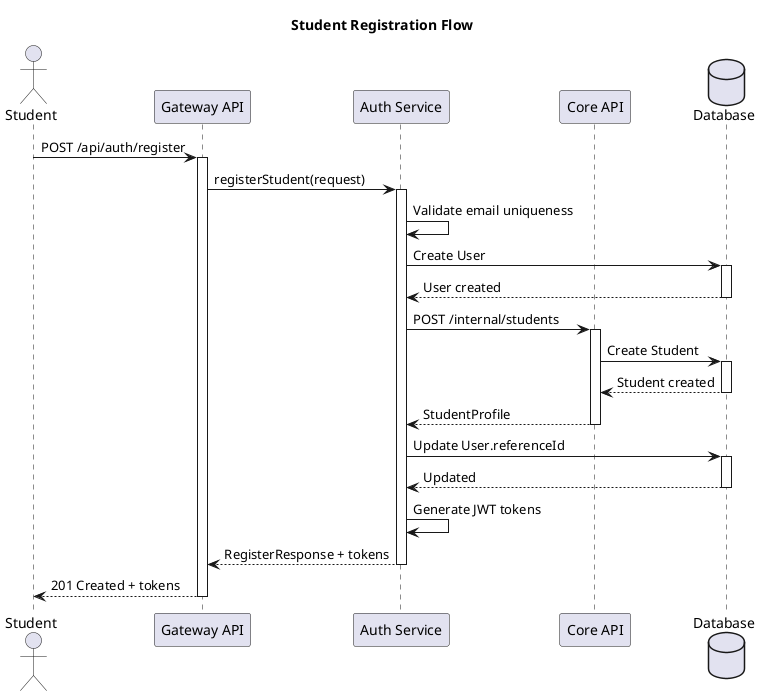
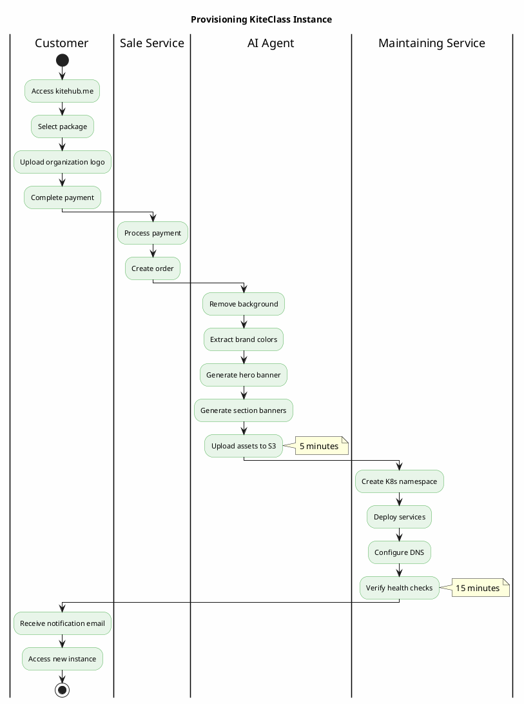
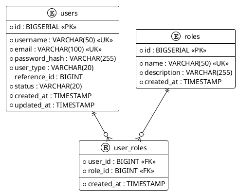

# PlantUML Diagrams Skill

## OVERVIEW

This skill provides guidelines and templates for creating technical diagrams using PlantUML for the KiteClass Platform project.

**When to use this skill:**
- Creating architecture diagrams
- Documenting system flows
- Visualizing sequences and processes
- Generating ERD or component diagrams

## PLANTUML SETUP

### Location
- **Source:** `documents/06-diagrams/plantuml/*.puml`
- **Rendered:** `documents/06-diagrams/rendered/*.png`

### Required Tools
- **PlantUML jar**: Download to `/tmp/plantuml.jar` (not committed)
- Java Runtime Environment (JRE) 8+
- Graphviz (optional, for class/deployment diagrams — PlantUML uses Smetana fallback)

### CRITICAL RULE: Always Render
**Khi tạo hoặc sửa file `.puml` → PHẢI render PNG vào `rendered/` folder và commit cả hai.**

```bash
cd documents/06-diagrams
# Download PlantUML nếu chưa có
curl -L -o /tmp/plantuml.jar "https://github.com/plantuml/plantuml/releases/download/v1.2024.8/plantuml-1.2024.8.jar"

# Render single file
java -jar /tmp/plantuml.jar -tpng -o "$(pwd)/rendered" plantuml/{filename}.puml

# Render all files
java -jar /tmp/plantuml.jar -tpng -o "$(pwd)/rendered" plantuml/*.puml

# Commit BOTH source and rendered
git add plantuml/{filename}.puml rendered/{filename}.png
```

### File Naming Convention
- Use descriptive kebab-case names
- Include sequence number for ordered diagrams
- Format: `{number}-{description}.puml`
- Examples: `01-architecture-simple.puml`, `10-saas-multi-tenant-architecture.puml`

## RENDERING DIAGRAMS

### Method 1: PlantUML CLI (Recommended)
```bash
cd documents/06-diagrams

# Render single diagram
java -jar /tmp/plantuml.jar -tpng -o "$(pwd)/rendered" plantuml/{filename}.puml

# Render all diagrams
java -jar /tmp/plantuml.jar -tpng -o "$(pwd)/rendered" plantuml/*.puml
```

### PlantUML Syntax Gotchas
- **KHÔNG dùng `()` trong `:...;`** — PlantUML hiểu nhầm thành stereotype
- **KHÔNG dùng `{}` trong `:...;`** — PlantUML hiểu nhầm thành creole
- **KHÔNG dùng `/` giữa text** — PlantUML hiểu nhầm thành separator
- Thay thế: dùng `[]`, `-`, `,` hoặc viết gọn lại
- Nếu cần Graphviz (class/deployment diagrams) mà chưa cài → PlantUML dùng Smetana fallback

### Output Requirements
- **Format**: PNG
- **Quality**: Text must be readable
- **Both .puml AND .png** must be committed

## DIAGRAM TYPES & TEMPLATES

### 1. Architecture Diagram (C4 Component Level)

**Use case**: Show system components and their relationships

**Template**:
```plantuml
@startuml
!define AWSPUML https://raw.githubusercontent.com/awslabs/aws-icons-for-plantuml/v14.0/dist
!include AWSPUML/AWSCommon.puml
!include AWSPUML/Compute/EKS.puml
!include AWSPUML/Database/Aurora.puml

title KiteClass System Architecture

' Define actors
actor "User" as user

' Define components
package "KiteClass Gateway" #LightBlue {
  component "API Gateway" as gateway
  component "Auth Service" as auth
}

package "KiteClass Core" #LightGreen {
  component "Student Service" as student
  component "Teacher Service" as teacher
  component "Class Service" as class
}

' Define databases
database "PostgreSQL" as db

' Define relationships
user --> gateway
gateway --> auth
gateway --> student
gateway --> teacher
gateway --> class

student --> db
teacher --> db
class --> db

@enduml
```

**Color palette**:
- Gateway/Infrastructure: `#LightBlue` or `#ADD8E6`
- Core Services: `#LightGreen` or `#90EE90`
- External Services: `#Orange` or `#FFD700`
- Databases: `#LightGray` or `#D3D3D3`

### 2. Sequence Diagram

**Use case**: Show interaction flow between components

**Template**:


### 3. Activity Diagram (Flow)

**Use case**: Document business processes or workflows

**Template**:


### 4. Deployment Diagram

**Use case**: Show infrastructure and deployment architecture

**Template**:
```plantuml
@startuml
!define AWSPUML https://raw.githubusercontent.com/awslabs/aws-icons-for-plantuml/v14.0/dist
!include AWSPUML/AWSCommon.puml
!include AWSPUML/NetworkingContentDelivery/Route53.puml
!include AWSPUML/NetworkingContentDelivery/CloudFront.puml
!include AWSPUML/Compute/EKS.puml
!include AWSPUML/Database/Aurora.puml
!include AWSPUML/Storage/S3.puml

title KiteClass AWS Deployment

Route53(dns, "Route 53", "DNS Management")
CloudFront(cdn, "CloudFront", "CDN")

rectangle "EKS Cluster" as eks {
  package "kiteclass-gateway namespace" {
    node "Gateway Pod" as gw1
    node "Gateway Pod" as gw2
  }

  package "kiteclass-core namespace" {
    node "Core Pod" as core1
    node "Core Pod" as core2
  }
}

Aurora(db, "Aurora PostgreSQL", "Database Cluster")
S3(s3, "S3", "Static Assets")

dns --> cdn
cdn --> eks
gw1 --> db
gw2 --> db
core1 --> db
core2 --> db
core1 --> s3
core2 --> s3

@enduml
```

### 5. Entity Relationship Diagram

**Use case**: Document database schema

**Template**:


## BEST PRACTICES

### 1. Keep Diagrams Simple
- Focus on key components and relationships
- Avoid clutter - remove unnecessary details
- Use proper spacing and alignment
- Maximum 10-15 components per diagram

### 2. Use Consistent Styling
- Define color palette at project level
- Use same colors for same component types
- Consistent font sizes
- Standard arrow types

### 3. Add Context
- Always include title
- Add notes for complex parts
- Include timing for flows (e.g., "5 minutes")
- Use legends when needed

### 4. Documentation
- Add comments in `.puml` files
- Document purpose at top of file
- Link to related documents
- Include version if diagram evolves

### 5. File Organization
```
documents/06-diagrams/
├── plantuml/                       # Source files
│   ├── 01-architecture-simple.puml
│   ├── ...
│   └── 19-use-case-diagram.puml
└── rendered/                       # Generated PNGs (committed)
    ├── architecture-diagram.png
    ├── ...
    └── wave-execution-process.png
```

## COMMON PLANTUML COMMANDS

### Layout Control
```plantuml
' Set direction
left to right direction
top to bottom direction

' Spacing
skinparam nodesep 50
skinparam ranksep 50

' Hide elements
hide empty members
hide circle
```

### Styling
```plantuml
' Colors
skinparam backgroundColor #FFFFFF
skinparam componentBackgroundColor #ADD8E6
skinparam componentBorderColor #4682B4

' Fonts
skinparam defaultFontSize 12
skinparam defaultFontName Arial
```

### Notes and Comments
```plantuml
' This is a comment

note right of Component
  This is a note
  explaining the component
end note

note "Floating note" as N1
```

### Grouping
```plantuml
package "Package Name" {
  component A
  component B
}

rectangle "Group" {
  component C
  component D
}

frame "Frame" {
  component E
}
```

## AWS ICONS INTEGRATION

### Available Icons
Common AWS icons available from `awslabs/aws-icons-for-plantuml`:
- **Compute**: EC2, EKS, Lambda, ECS
- **Database**: Aurora, RDS, DynamoDB, ElastiCache
- **Storage**: S3, EBS, EFS
- **Networking**: Route53, CloudFront, ALB, VPC
- **Integration**: SQS, SNS, EventBridge

### Usage
```plantuml
@startuml
!define AWSPUML https://raw.githubusercontent.com/awslabs/aws-icons-for-plantuml/v14.0/dist
!include AWSPUML/AWSCommon.puml
!include AWSPUML/Compute/EKS.puml
!include AWSPUML/Database/Aurora.puml

EKS(eks, "EKS Cluster", "Kubernetes")
Aurora(db, "Aurora", "PostgreSQL")

eks -> db
@enduml
```

## WORKFLOW

### Creating New Diagram

1. **Define Purpose**
   - What are you documenting?
   - Who is the audience?
   - What level of detail needed?

2. **Choose Diagram Type**
   - Architecture → Component Diagram
   - Process Flow → Activity Diagram
   - API Interaction → Sequence Diagram
   - Database → ERD
   - Infrastructure → Deployment Diagram

3. **Create .puml File** in `documents/06-diagrams/plantuml/`

4. **Write PlantUML Code** — avoid `()`, `{}`, `/` inside `:...;`

5. **Render PNG** (MANDATORY)
   ```bash
   cd documents/06-diagrams
   java -jar /tmp/plantuml.jar -tpng -o "$(pwd)/rendered" plantuml/{filename}.puml
   ```

6. **Commit BOTH** source + rendered
   ```bash
   git add documents/06-diagrams/plantuml/{name}.puml
   git add documents/06-diagrams/rendered/{name}.png
   ```

## TROUBLESHOOTING

### Common Issues

**Issue**: Diagram too wide
```plantuml
' Solution: Force vertical layout
top to bottom direction
' Or: Split into multiple diagrams
```

**Issue**: Text overlapping
```plantuml
' Solution: Increase spacing
skinparam nodesep 80
skinparam ranksep 80
```

**Issue**: Colors not showing
```plantuml
' Solution: Ensure proper syntax
component "Name" as alias #ColorCode
```

**Issue**: PNG quality poor
```bash
# Solution: Use SVG instead
java -jar plantuml.jar -tsvg diagram.puml
```

**Issue**: AWS icons not loading
```plantuml
' Solution: Verify internet connection and URL
!define AWSPUML https://raw.githubusercontent.com/awslabs/aws-icons-for-plantuml/v14.0/dist
!include AWSPUML/AWSCommon.puml
```

## INTEGRATION WITH REPORTS

When creating diagrams for reports (e.g., graduation thesis):

1. **Create high-resolution PNG**
   ```bash
   java -jar plantuml.jar -tpng diagram.puml
   # Output: 1920px+ width
   ```

2. **Mark insertion points in text reports**
   ```
   [CHO NAY CHEN ANH: diagram-name.png]
   Hinh 1: Mo ta so do
   ```

3. **Reference in documentation**
   ```markdown
   See Figure 1: Architecture Diagram (documents/diagrams/architecture.png)
   ```

## EXAMPLES IN PROJECT

Current diagrams (19 total):
- `01` - Architecture simple | `02` - BFD actors | `03` - ERD
- `04` - Architecture full | `05` - System overview v3 | `06` - Business flow v3
- `07` - KiteHub ERD | `08` - KiteHub architecture | `09` - Provisioning flow
- `10` - SaaS multi-tenant | `11` - Email lifecycle | `12` - Trial-payment-retention
- `13` - Domain resolution | `14` - AI branding pipeline | `15` - CI/CD pipeline
- `16` - Database schema full | `17` - Wave execution | `18` - Class diagram modules
- `19` - Use case diagram

## RELATED SKILLS

- `documentation-structure.md` - For documentation organization
- `architecture-overview.md` - For system architecture details
- `database-design.md` - For ERD content

## CHECKLIST

Before committing diagrams:
- [ ] File follows naming convention
- [ ] Diagram has clear title
- [ ] Colors are consistent with project palette
- [ ] Text is readable at 100% zoom
- [ ] PNG rendered successfully
- [ ] Comments added to .puml file
- [ ] Diagram referenced in relevant docs
- [ ] Both .puml and .png committed to git

## RESOURCES

- PlantUML Official: https://plantuml.com/
- AWS Icons: https://github.com/awslabs/aws-icons-for-plantuml
- C4 Model: https://c4model.com/
- PlantUML Real-world examples: https://real-world-plantuml.com/
