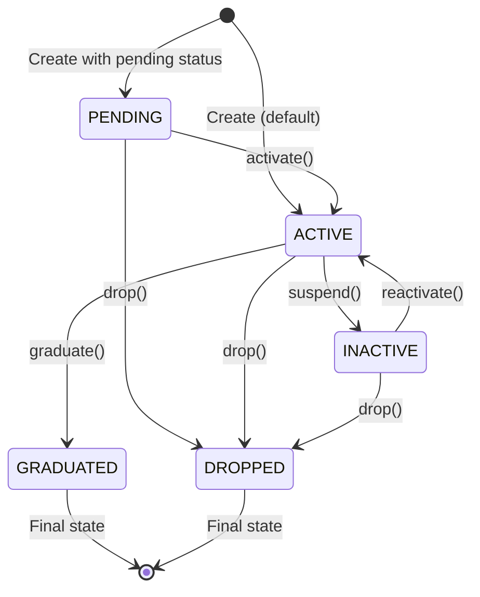

# Student Module - Business Logic Specification

**Version:** 1.0
**Last Updated:** 2026-01-27
**Implemented:** PR 2.3 (feature/core branch)

---

## Module: Student

**Purpose:** Quản lý thông tin học viên trong hệ thống KiteClass

**Priority:** P0 (Core module)

**Dependencies:** None (independent module)

**Related Modules:**
- Enrollment (Student enrolls in Classes)
- Attendance (Student attends Sessions)
- Invoice (Student receives Invoices)
- Parent (Student belongs to Parent)

### Business Context

Student là entity trung tâm của hệ thống KiteClass. Mỗi Student đại diện cho một học viên đăng ký học tại trung tâm. Student có thể:
- Đăng ký học (enroll) nhiều lớp
- Điểm danh (attendance) tại các buổi học
- Nhận hóa đơn (invoice) học phí
- Được quản lý bởi phụ huynh (parent)

---

## Business Entities

### Student

**Attributes:**

| Field | Type | Required | Validation | Description |
|-------|------|----------|------------|-------------|
| id | Long | Auto | - | Unique identifier |
| name | String | Yes | 2-100 chars | Tên học viên |
| email | String | No | Valid email, unique | Email liên lạc |
| phone | String | No | 0xxxxxxxxx, unique | Số điện thoại |
| dateOfBirth | LocalDate | No | - | Ngày sinh |
| gender | Gender | No | MALE/FEMALE/OTHER | Giới tính |
| address | String | No | Max 1000 chars | Địa chỉ |
| avatarUrl | String | No | Max 500 chars | URL ảnh đại diện |
| status | StudentStatus | Yes | Enum | Trạng thái hiện tại |
| note | String | No | - | Ghi chú |
| deleted | Boolean | Yes | Default false | Soft delete flag |

**Status Values:**

| Status | Description | Can Transition To | Color |
|--------|-------------|-------------------|-------|
| PENDING | Chờ xác nhận đăng ký | ACTIVE, DROPPED | Orange |
| ACTIVE | Đang học | INACTIVE, GRADUATED, DROPPED | Green |
| INACTIVE | Tạm nghỉ | ACTIVE, DROPPED | Yellow |
| GRADUATED | Đã tốt nghiệp | - | Blue |
| DROPPED | Đã nghỉ học | - | Gray |

**Relationships:**
- Has many: Enrollments (student enrolls in classes)
- Has many: Attendances (student attends sessions)
- Has many: Invoices (student receives invoices)
- Belongs to: Parent (optional, student may have parent account)

---

## Business Rules

### BR-STU-001: Email Uniqueness

**Description:** Email phải unique trong hệ thống (excluding soft-deleted students)

**Conditions:**
- Email không null/empty
- Email chưa được sử dụng bởi student khác (deleted = false)

**Validation:**
```java
if (email != null && studentRepository.existsByEmailAndDeletedFalse(email)) {
    throw new DuplicateResourceException("email", email);
}
```

**Exceptions:**
- `DuplicateResourceException` if email exists

**Examples:**
```java
// Valid - email chưa tồn tại
createStudent("John Doe", "john@example.com", ...)  // OK

// Invalid - email đã tồn tại
createStudent("Jane Doe", "john@example.com", ...)
// → throws DuplicateResourceException("email", "john@example.com")
```

---

### BR-STU-002: Phone Uniqueness

**Description:** Số điện thoại phải unique trong hệ thống (excluding soft-deleted students)

**Conditions:**
- Phone không null/empty
- Phone chưa được sử dụng bởi student khác (deleted = false)
- Phone phải đúng format Vietnamese (10 số bắt đầu bằng 0)

**Validation:**
```java
// Format validation (done by @Pattern annotation)
@Pattern(regexp = "^0\\d{9}$", message = "Invalid phone format")

// Uniqueness validation (done by service)
if (phone != null && studentRepository.existsByPhoneAndDeletedFalse(phone)) {
    throw new DuplicateResourceException("phone", phone);
}
```

**Exceptions:**
- `ValidationException` if phone format invalid
- `DuplicateResourceException` if phone exists

---

### BR-STU-003: Soft Delete

**Description:** Student không được xóa vĩnh viễn khỏi database, chỉ được đánh dấu deleted = true

**Conditions:**
- Student tồn tại và deleted = false

**Implementation:**
```java
public void deleteStudent(Long id) {
    Student student = findByIdAndDeletedFalse(id);
    student.markAsDeleted();  // Sets deleted = true
    studentRepository.save(student);
}
```

**Side Effects:**
- Student không xuất hiện trong queries thông thường
- Email/phone có thể được reuse cho student mới
- Historical data (enrollments, attendance) vẫn được giữ nguyên

---

### BR-STU-004: Status Transition Rules

**Description:** Student status chỉ có thể chuyển theo rules cụ thể

**Allowed Transitions:**

| From | To | Condition | Method |
|------|-----|-----------|--------|
| PENDING | ACTIVE | Email verified | activate() |
| ACTIVE | INACTIVE | Parent request | suspend() |
| INACTIVE | ACTIVE | Reactivation request | reactivate() |
| ACTIVE | GRADUATED | Complete all courses | graduate() |
| ACTIVE | DROPPED | Permanent withdrawal | drop() |
| INACTIVE | DROPPED | Permanent withdrawal | drop() |
| PENDING | DROPPED | Cancel registration | drop() |

**Invalid Transitions:**
- GRADUATED → any status (final state)
- DROPPED → any status (final state)
- INACTIVE → GRADUATED (must reactivate first)

---

## Workflows & Use Cases

### UC-STU-001: Create Student

**Actor:** Admin, Staff

**Preconditions:**
- User has permission to create students
- Email/phone not already in use

**Main Flow:**
1. Actor provides student information (name, email, phone, etc.)
2. System validates required fields
3. System checks email uniqueness (BR-STU-001)
4. System checks phone uniqueness (BR-STU-002)
5. System creates student with status = ACTIVE (default)
6. System saves to database
7. System returns student data

**Alternative Flows:**
- **AF1:** Email exists → return 409 Conflict with DuplicateResourceException
- **AF2:** Phone exists → return 409 Conflict with DuplicateResourceException
- **AF3:** Validation fails → return 400 Bad Request with field errors

**Postconditions:**
- Student created with status = ACTIVE
- Student cached in Redis
- Log: "Created student with ID: {id}"

**Business Events:**
- None (Student creation doesn't trigger external events by itself)

---

### UC-STU-002: Update Student

**Actor:** Admin, Staff

**Preconditions:**
- Student exists and not deleted
- User has permission to update students

**Main Flow:**
1. Actor provides student ID and updated information
2. System retrieves student by ID
3. System validates new data
4. System checks email uniqueness if email changed (BR-STU-001)
5. System checks phone uniqueness if phone changed (BR-STU-002)
6. System applies partial update (only non-null fields)
7. System saves to database
8. System evicts cache
9. System returns updated student data

**Alternative Flows:**
- **AF1:** Student not found → return 404 Not Found
- **AF2:** New email exists → return 409 Conflict
- **AF3:** New phone exists → return 409 Conflict
- **AF4:** Validation fails → return 400 Bad Request

**Postconditions:**
- Student updated
- Cache evicted for this student
- Log: "Updated student with ID: {id}"

---

### UC-STU-003: Search Students

**Actor:** Admin, Staff, Teacher

**Preconditions:**
- User has permission to view students

**Main Flow:**
1. Actor provides search criteria (keyword, status, pagination)
2. System builds query:
   - Filter by deleted = false
   - Filter by keyword (name or email LIKE %keyword%)
   - Filter by status (if provided)
   - Apply pagination
3. System executes query
4. System maps entities to DTOs
5. System returns paginated results

**Alternative Flows:**
- None (empty result is valid)

**Postconditions:**
- Results returned with pagination metadata
- Log: "Searching students with search='{keyword}', status='{status}', page={page}"

---

### UC-STU-004: Soft Delete Student

**Actor:** Admin

**Preconditions:**
- Student exists and not deleted
- User has admin permission

**Main Flow:**
1. Actor requests to delete student by ID
2. System retrieves student
3. System marks student as deleted (BR-STU-003)
4. System saves to database
5. System evicts cache
6. System returns success

**Alternative Flows:**
- **AF1:** Student not found → return 404 Not Found

**Postconditions:**
- Student marked as deleted (deleted = true)
- Student no longer appears in normal queries
- Email/phone can be reused
- Historical data preserved
- Cache evicted
- Log: "Deleted student with ID: {id}"

**Business Events:**
- None (no cascade delete to enrollments/attendance)

---

## State Machine

### Student Status Transitions



**Transition Rules:**

#### activate()
- **From:** PENDING
- **To:** ACTIVE
- **Conditions:** None (can activate anytime)
- **Side Effects:** None
- **Method:** `updateStudent(id, UpdateStudentRequest(status=ACTIVE))`

#### suspend()
- **From:** ACTIVE
- **To:** INACTIVE
- **Conditions:** None
- **Side Effects:** May pause active enrollments (future feature)
- **Method:** `updateStudent(id, UpdateStudentRequest(status=INACTIVE))`

#### reactivate()
- **From:** INACTIVE
- **To:** ACTIVE
- **Conditions:** None
- **Side Effects:** May resume paused enrollments (future feature)
- **Method:** `updateStudent(id, UpdateStudentRequest(status=ACTIVE))`

#### graduate()
- **From:** ACTIVE
- **To:** GRADUATED
- **Conditions:** All enrolled classes completed (future validation)
- **Side Effects:** **Final state** - cannot transition further
- **Method:** `updateStudent(id, UpdateStudentRequest(status=GRADUATED))`

#### drop()
- **From:** PENDING, ACTIVE, INACTIVE
- **To:** DROPPED
- **Conditions:** None
- **Side Effects:** **Final state** - cannot transition further
- **Method:** `updateStudent(id, UpdateStudentRequest(status=DROPPED))`

---

## Integration Points

### With Other Modules

#### Student → Enrollment
- **Direction:** Student creates Enrollments
- **Trigger:** Student enrolls in a class
- **Data Flow:** Student ID → Enrollment → Class
- **Business Rule:** Student can only enroll if status = ACTIVE (future validation)
- **Implementation:** `EnrollmentService.enrollStudent(studentId, classId)`

#### Student ← Invoice
- **Direction:** Invoice references Student
- **Trigger:** Enrollment created
- **Data Flow:** Invoice contains Student ID
- **Business Rule:** Invoice amounts may vary based on student (discount, etc.)
- **Implementation:** `InvoiceService.createInvoice(enrollmentId)` → retrieves Student

#### Student → Attendance
- **Direction:** Student has Attendance records
- **Trigger:** Teacher marks attendance for a session
- **Data Flow:** Student ID → Attendance → ClassSession
- **Business Rule:** Can only mark attendance if student enrolled in class
- **Implementation:** `AttendanceService.markAttendance(sessionId, studentId, status)`

#### Student ← Parent
- **Direction:** Parent manages Student
- **Trigger:** Parent account created and linked
- **Data Flow:** Parent ID → Student
- **Business Rule:** One parent can manage multiple students
- **Implementation:** Future feature (Parent entity with List<Student>)

---

## Validation Rules

### Field Validation

#### name
- **Required:** Yes
- **Format:** 2-100 characters
- **Annotation:** `@NotBlank @Size(min=2, max=100)`
- **Exception:** `ValidationException` (handled by Spring)

#### email
- **Required:** No (optional)
- **Format:** Valid email format
- **Uniqueness:** Must be unique across non-deleted students
- **Annotation:** `@Email @Size(max=255)`
- **Check:** `studentRepository.existsByEmailAndDeletedFalse(email)`
- **Exception:** `DuplicateResourceException("email", email)`

#### phone
- **Required:** No (optional)
- **Format:** Vietnamese phone (10 digits, starts with 0)
- **Pattern:** `^0\\d{9}$`
- **Uniqueness:** Must be unique across non-deleted students
- **Annotation:** `@Pattern(regexp="^0\\\\d{9}$")`
- **Check:** `studentRepository.existsByPhoneAndDeletedFalse(phone)`
- **Exception:** `DuplicateResourceException("phone", phone)`

#### address
- **Required:** No
- **Format:** Max 1000 characters
- **Annotation:** `@Size(max=1000)`

### Business Validation

Currently, Student module has minimal business validation beyond field validation and uniqueness checks. Future validations may include:

#### BR-STU-005: Enrollment Limit (Future)
- **Rule:** Student can have max 5 active enrollments
- **Check:** Count enrollments where status = ACTIVE
- **Exception:** `BusinessException("Maximum enrollment limit reached")`

#### BR-STU-006: Age Validation (Future)
- **Rule:** Student must be at least 5 years old
- **Check:** Calculate age from dateOfBirth
- **Exception:** `ValidationException("Student must be at least 5 years old")`

---

## Error Scenarios

### ES-STU-001: Duplicate Email

**Scenario:** Create student with existing email

**Input:**
```json
POST /api/v1/students
{
  "name": "John Doe",
  "email": "existing@example.com",
  "phone": "0123456789"
}
```

**Expected Behavior:**
- Check: `existsByEmailAndDeletedFalse("existing@example.com")`
- Result: true
- Response: HTTP 409 Conflict
```json
{
  "code": "DUPLICATE_RESOURCE",
  "message": "email 'existing@example.com' already exists",
  "path": "/api/v1/students",
  "timestamp": "2026-01-27T10:00:00Z"
}
```

**Log Output:**
```
WARN: Duplicate email: existing@example.com
```

---

### ES-STU-002: Invalid Phone Format

**Scenario:** Create student with invalid phone number

**Input:**
```json
POST /api/v1/students
{
  "name": "John Doe",
  "phone": "123456"  // Invalid: not 10 digits
}
```

**Expected Behavior:**
- Validation: @Pattern check fails
- Response: HTTP 400 Bad Request
```json
{
  "code": "VALIDATION_ERROR",
  "message": "Validation failed for one or more fields",
  "path": "/api/v1/students",
  "fieldErrors": {
    "phone": ["Số điện thoại không hợp lệ (phải là 10 số bắt đầu bằng 0)"]
  }
}
```

---

### ES-STU-003: Student Not Found

**Scenario:** Get student with non-existent ID

**Input:**
```
GET /api/v1/students/999
```

**Expected Behavior:**
- Check: `findByIdAndDeletedFalse(999)`
- Result: Optional.empty()
- Response: HTTP 404 Not Found
```json
{
  "code": "ENTITY_NOT_FOUND",
  "message": "Student with ID 999 not found",
  "path": "/api/v1/students/999"
}
```

**Log Output:**
```
WARN: Student not found with ID: 999
```

---

### ES-STU-004: Update Deleted Student

**Scenario:** Update a soft-deleted student

**Input:**
```
PUT /api/v1/students/123
```
(where student 123 has deleted = true)

**Expected Behavior:**
- Check: `findByIdAndDeletedFalse(123)`
- Result: Optional.empty() (deleted students excluded)
- Response: HTTP 404 Not Found
- Same as ES-STU-003

---

## Caching Strategy

### Cache Configuration

#### students (Single Entity)
- **Cache Name:** `students`
- **Key:** Student ID (`#id`)
- **TTL:** 1 hour (configured in CacheConfig)
- **Eviction:** On update, delete
- **Methods:**
  - **Cacheable:** `getStudentById(Long id)`
  ```java
  @Cacheable(value = "students", key = "#id")
  public StudentResponse getStudentById(Long id)
  ```
  - **Cache Evict:**
    - `updateStudent(Long id, ...)` → `@CacheEvict(value = "students", key = "#id")`
    - `deleteStudent(Long id)` → `@CacheEvict(value = "students", key = "#id")`

#### students-list (All Entries)
- **Cache Name:** `students`
- **Eviction:** On any create, update, delete (allEntries=true)
- **Reason:** Search results depend on all students, safer to evict all
- **Methods:**
  - `createStudent(...)` → `@CacheEvict(value = "students", allEntries = true)`
  - `updateStudent(...)` → Already evicts specific key
  - `deleteStudent(...)` → Already evicts specific key

**Cache Key Examples:**
```
students::1         → Student with ID 1
students::2         → Student with ID 2
```

**Eviction Flow:**
```
createStudent("John")
→ Evicts all "students::*" entries
→ New student can be queried

updateStudent(1, ...)
→ Evicts "students::1"
→ Next getStudentById(1) will fetch from DB and cache

deleteStudent(1)
→ Evicts "students::1"
→ Next getStudentById(1) will throw EntityNotFoundException
```

---

## Performance Considerations

### Database Indexes

Created in `V2__create_student_tables.sql`:

```sql
-- Unique lookups
CREATE INDEX idx_students_email ON students(email) WHERE deleted = FALSE;
CREATE INDEX idx_students_phone ON students(phone) WHERE deleted = FALSE;

-- Filter queries
CREATE INDEX idx_students_status ON students(status) WHERE deleted = FALSE;
CREATE INDEX idx_students_deleted ON students(deleted);

-- Search queries
CREATE INDEX idx_students_name ON students(name) WHERE deleted = FALSE;
```

**Index Usage:**
- `idx_students_email`: Used by `existsByEmailAndDeletedFalse(email)`
- `idx_students_phone`: Used by `existsByPhoneAndDeletedFalse(phone)`
- `idx_students_status`: Used by `findBySearchCriteria(..., status, ...)`
- `idx_students_name`: Used by `findBySearchCriteria(search, ...)` when searching by name
- `idx_students_deleted`: Used by all `...AndDeletedFalse()` queries

### Query Optimization

#### Soft Delete Pattern
All queries include `deleted = false` filter:
```java
Optional<Student> findByIdAndDeletedFalse(Long id);
boolean existsByEmailAndDeletedFalse(String email);
Page<Student> findBySearchCriteria(...) // WHERE deleted = false
```

**Benefits:**
- Automatically excludes deleted records
- Indexes with `WHERE deleted = FALSE` are smaller and faster
- No need for manual filtering in code

#### Pagination
- Max page size: 20 (default), can be adjusted
- Use `Pageable` with `PageRequest.of(page, size, Sort.by(...))`
- Returns `PageResponse<StudentResponse>` with metadata

#### Search Performance
- LIKE queries with `LOWER()` for case-insensitive search
- Indexed on `name` field for better performance
- Search on `email` also uses indexed column

### Scalability

#### Caching
- Redis caching reduces database load
- 1-hour TTL balances freshness and performance
- Individual entity eviction (not allEntries) for updates

#### Pagination
- Enforced on all list queries
- Prevents loading thousands of records
- Frontend can implement infinite scroll or page navigation

#### Async Processing (Future)
- Bulk import students: Use async processing with RabbitMQ
- Export students: Generate CSV asynchronously

---

## API Endpoints Summary

| Method | Endpoint | Description | Status Code |
|--------|----------|-------------|-------------|
| POST | /api/v1/students | Create student | 201 Created |
| GET | /api/v1/students/{id} | Get student by ID | 200 OK |
| GET | /api/v1/students | Search students (paginated) | 200 OK |
| PUT | /api/v1/students/{id} | Update student | 200 OK |
| DELETE | /api/v1/students/{id} | Soft delete student | 200 OK |

**Query Parameters for Search:**
- `search` (optional): Keyword to search in name or email
- `status` (optional): Filter by StudentStatus (ACTIVE, INACTIVE, etc.)
- `page` (default: 0): Page number (0-indexed)
- `size` (default: 20): Page size
- `sort` (default: name): Sort field

**Example:**
```
GET /api/v1/students?search=john&status=ACTIVE&page=0&size=10&sort=name
```

---

## Testing Checklist

When testing Student module, verify:

### Unit Tests
- [ ] Service tests with Mockito (10 tests)
- [ ] Mapper tests with MapStruct (3 tests)
- [ ] Business rule validation (uniqueness, format)
- [ ] Exception handling (EntityNotFoundException, DuplicateResourceException)

### Integration Tests
- [ ] Repository tests with Testcontainers
- [ ] Custom query tests (findBySearchCriteria)
- [ ] Index usage verification

### Controller Tests
- [ ] All endpoints return correct status codes
- [ ] Validation errors returned properly
- [ ] Success responses match ApiResponse format

### Business Logic Tests
- [ ] BR-STU-001: Email uniqueness enforced
- [ ] BR-STU-002: Phone uniqueness enforced
- [ ] BR-STU-003: Soft delete works correctly
- [ ] BR-STU-004: Status transitions (future feature)

---

## Future Enhancements

### Phase 1 (Next PR)
- [ ] Add Parent relationship
- [ ] Implement enrollment limit validation (BR-STU-005)
- [ ] Add age validation (BR-STU-006)

### Phase 2 (Later)
- [ ] Student dashboard (view enrollments, attendance, invoices)
- [ ] Bulk import students from CSV
- [ ] Student profile picture upload
- [ ] Student achievement/badges

### Phase 3 (Advanced)
- [ ] Student analytics (attendance rate, performance)
- [ ] Automated status transitions (e.g., auto-graduate when all courses done)
- [ ] Student notifications (email/SMS)

---

**Last Updated:** 2026-01-27
**Implementation:** PR 2.3 (feature/core branch)
**Status:** ✅ Complete (with minor test fixes needed)
**Author:** KiteClass Team
