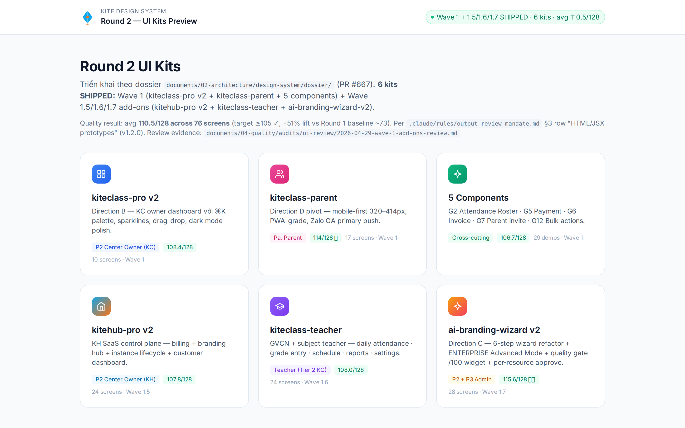
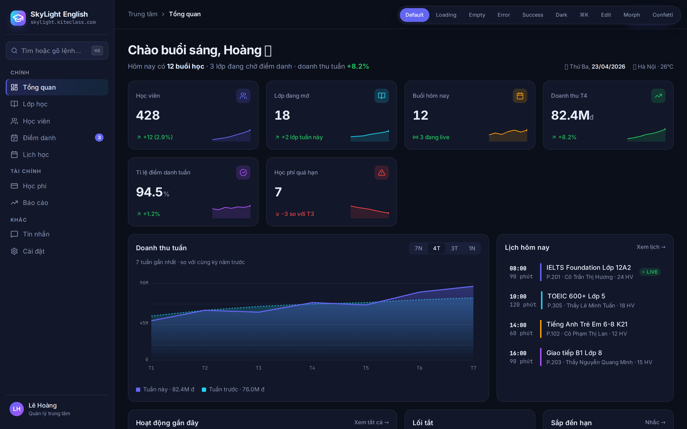
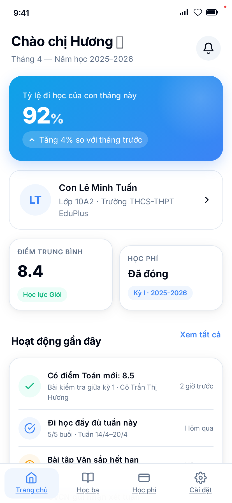
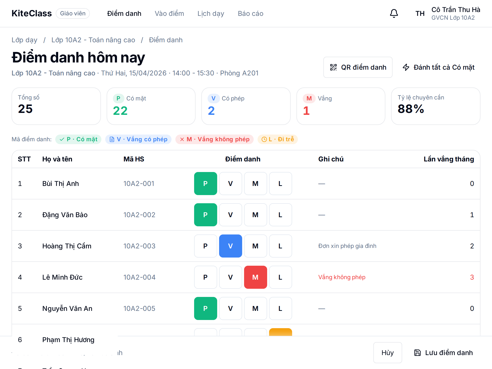
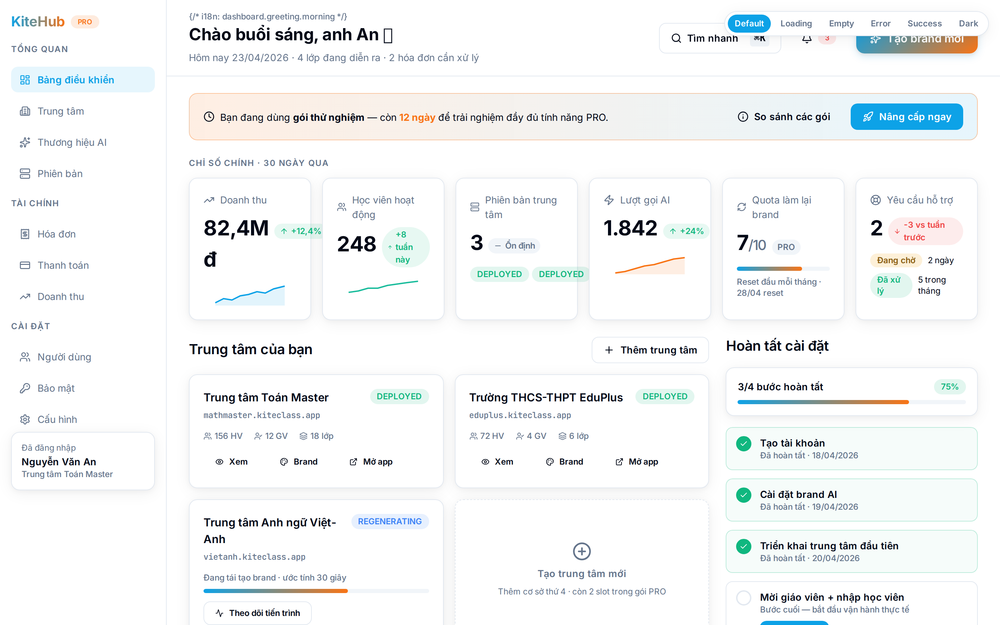
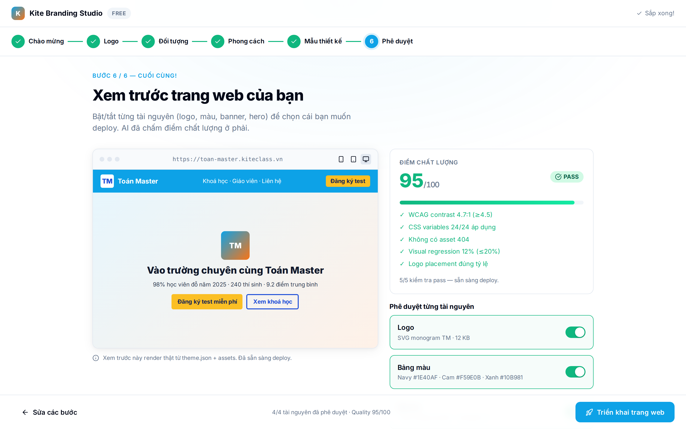
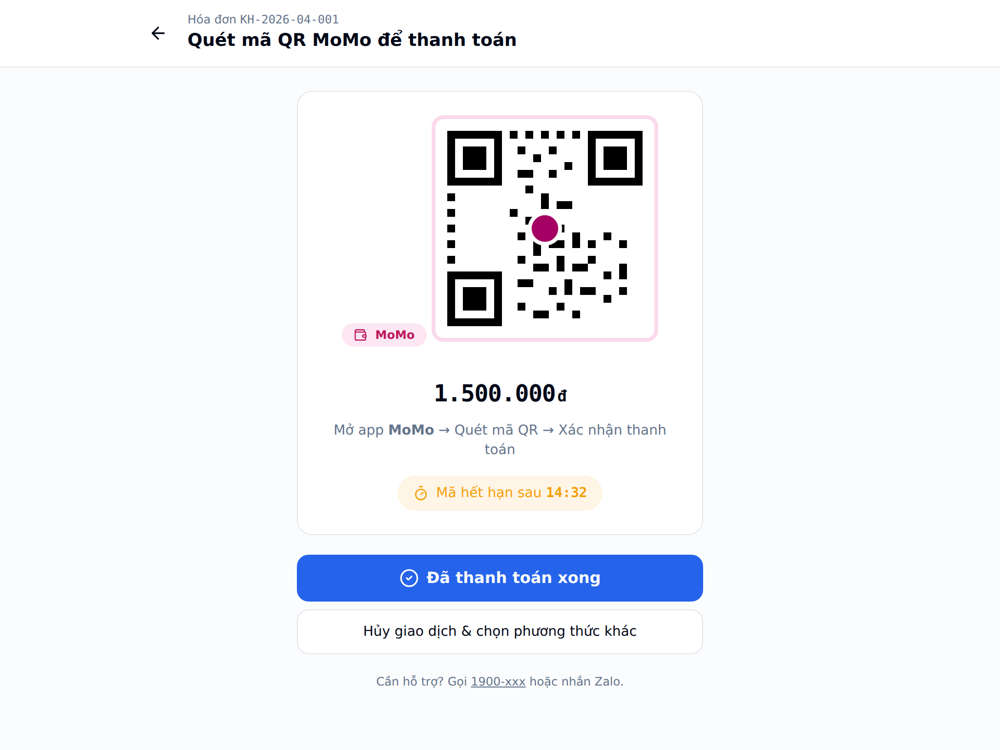

# Kite Platform

```
╔════════════════════════════════════════════════════════════╗
║                                                            ║
║      ▄█▄    ██  ██  ██████  ██████  ██████                 ║
║     █████   ██ ██     ██      ██    ██                     ║
║    ███████  ████      ██      ██    ████                   ║
║     █████   ██ ██     ██      ██    ██                     ║
║      ▀█▀    ██  ██  ██████    ██    ██████                 ║
║       ▌                                                    ║
║      ╳╳     P  L  A  T  F  O  R  M                         ║
║                                                            ║
║       Multi-platform Educational Technology Suite          ║
║       SaaS Management ⨯ Multi-tenant Education             ║
║                                                            ║
╚════════════════════════════════════════════════════════════╝
```

> Two products, one stack. **KiteHub** runs the SaaS platform — subscription, billing, AI branding, multi-tenant lifecycle. **KiteClass** runs the education business — students, courses, classes, attendance, payments. One tenant per school.

[](.) [](.) [](.) [](.) [](.) [](.) [](.)

📖 **New here? Start here.** Quick links: [KiteHub Quick Start](kitehub/QUICK_START.md) · [KiteClass Quick Start](kiteclass/QUICK_START.md) · [Architecture](documents/02-architecture/) · [Quality Reports](documents/04-quality/) · [CLAUDE.md](CLAUDE.md)

---

## ▸ Quick Start

```bash
# KiteHub full stack (14 containers — gateway, 6 services, infra, frontend)
cd kitehub/ && ./scripts/up.sh

# KiteClass dev stack (core + gateway + frontend + infra)
cd kiteclass/ && ./scripts/dev-docker.sh up

# E2E smoke
cd kitehub/ && ./scripts/test-api-e2e.sh
cd kiteclass/ && ./scripts/test-api-e2e.sh
```

KiteHub gateway → `http://localhost:9000`. KiteClass gateway → `http://localhost:8090`. Run `./scripts/help.sh` inside either folder for the full command list.

## ▸ The Two Products

|  | **KiteHub** | **KiteClass** |
|---|---|---|
| **Role** | SaaS management platform | Multi-tenant education platform |
| **Audience** | Operates Kite, runs trials, manages subscriptions | Each tenant = one school / education center |
| **Backend** | 6 services (subscription, payment, branding, email, admin, platform) + gateway | core + gateway |
| **Lifecycle** | Trial → Subscription → Provision → Deploy | Students, courses, attendance, grades, payments |
| **Container prefix** | `kitehub-*` | `kiteclass-*` |

Shared infrastructure (PostgreSQL, Redis, RabbitMQ, MinIO, Ollama) is prefixed `kite-*` — a single source of truth, both products consume.

## ▸ How It Works

KiteHub provisions a new KiteClass instance whenever a school subscribes. Each instance gets isolated data + custom branding (AI-generated logo, colors, hero images via local Ollama with **template-first routing** — see [`ai-branding-guidelines`](.claude/rules/ai-branding-guidelines.md)). Multi-tenancy is at the **database level** (instance-per-tenant), not row-level filtering — strongest isolation.

The platform follows an **audit → gap → fix** pipeline. Every audit issue becomes a gap file; every fix is its own PR; every wave merges only after audit refresh. The result: scores are calibrated, not self-estimated. See [Quality](#-quality) below.

## ▸ Design System Preview

**6 production-quality UI kits** for KiteHub + KiteClass — 76 screens · avg score **110.5 / 128** · **+51 % lift** vs Round 1 baseline (~73 / 128).

[](https://victoraurelius.github.io/2026-Kite-Class-Platform/)

**[🚀 Live demo →](https://victoraurelius.github.io/2026-Kite-Class-Platform/)** _(after Pages enabled — see workflow `.github/workflows/deploy-design-system.yml`)_

| Kit | Persona | Score / 128 | Preview |
|---|---|:-:|---|
| **kiteclass-pro v2** | P2 Center Owner (KC) | 108.4 | [](https://victoraurelius.github.io/2026-Kite-Class-Platform/kiteclass-pro-v2/) |
| **kiteclass-parent** | Parent (mobile-first PWA) | **114** ⭐ | [](https://victoraurelius.github.io/2026-Kite-Class-Platform/kiteclass-parent/) |
| **kiteclass-teacher** | Teacher (GVCN + subject) | 108.0 | [](https://victoraurelius.github.io/2026-Kite-Class-Platform/kiteclass-teacher/) |
| **kitehub-pro v2** | P2 Center Owner (KH SaaS) | 107.8 | [](https://victoraurelius.github.io/2026-Kite-Class-Platform/kitehub-pro-v2/) |
| **ai-branding-wizard v2** | P2 + P3 Admin (rebrand) | **115.6** ⭐⭐ | [](https://victoraurelius.github.io/2026-Kite-Class-Platform/ai-branding-wizard-v2/) |
| **5 Components** | Cross-cutting (G2/G5/G6/G7/G12) | 106.7 | [](https://victoraurelius.github.io/2026-Kite-Class-Platform/components/) |

**Stack:** HTML / CSS / JS prototypes per [`dossier/09-tech-constraints.md`](documents/02-architecture/design-system/dossier/09-tech-constraints.md) (Next.js 15 / React 19 / Tailwind 3.4 / shadcn/ui / Radix UI / lucide-react). Production port to actual Next.js apps tracked under GAP-264..267.

**Dossier:** [12-file context dossier](documents/02-architecture/design-system/dossier/) for handing context to design AI tools (Claude Design / Figma / etc.) — personas, VN UX musts, screen inventory, business flows, quality bar, acceptance criteria, prompt library.

## ▸ Repository Structure

```
2026-Kite-Class-Platform/
├── .claude/                   Skills + rules + scripts + hooks (project DNA)
├── .github/                   CI/CD workflows
├── documents/                 Documentation (categorized 00–08)
│   ├── 00-brd/                Business requirements
│   ├── 01-business/           Business logic — SOURCE OF TRUTH (3-layer/domain)
│   ├── 02-architecture/       Technical architecture + 15 ADRs
│   ├── 03-planning/           Wave plans, roadmaps, PR tracking
│   ├── 04-quality/            Audits + gaps + ROADMAP
│   ├── 05-guides/             Deploy guides, ops runbooks
│   ├── 06-diagrams/           PlantUML + rendered PNG (25 diagrams)
│   ├── 07-archived/           Old docs, research
│   └── 08-thesis/             Graduation project refs
├── infrastructure/            Helm + K8s + Terraform (AWS + Oracle)
├── kiteclass/                 Core + gateway + frontend + shared
├── kitehub/                   6 services + gateway + frontend
└── scripts/                   Root CI/QA scripts
```

## ▸ Tech Stack

| Layer | Stack |
|---|---|
| **Backend** | Spring Boot 3.5.14 · Spring Cloud 2025.0.0 · Java 17 · Maven · Flyway · Micrometer + Prometheus |
| **Frontend** | Next.js 15 · React 19 · TypeScript · Tailwind · Shadcn UI · Playwright |
| **Data** | PostgreSQL 16 · Redis 7 · RabbitMQ 3 · MinIO (S3-compatible) |
| **AI** | Ollama (local LLM) · template-first routing · per-tier rate limits |
| **Infra** | Docker Compose (dev) · Kubernetes + Helm (prod) · Terraform AWS / Oracle Cloud · GitHub Actions |

## ▸ Quality

This project ships with **calibrated audit scores** — specialist audits replace self-estimation:

| Audit | Score | Trend |
|---|:-:|---|
| Quality (10 categories) | **77 / 100** C+ | First honest baseline 2026-04-19 |
| Business Logic | 72 / 100 C | +7 since 2026-04-12 |
| Security | **85 / 100** B | +9 since 2026-04-17 |
| API Contract | **95 / 100** A | +10 since baseline |
| Performance | 63 / 100 D | +5 since baseline |
| Ops Readiness | 52 / 100 F | +3 since baseline |
| UI Review (KiteClass / KiteHub) | 81 / 59 (out of 128) | +1 each |

**Gap governance** — every audit issue → gap file → fix PR → audit refresh. **90 open gaps** tracked across 12 waves. The `audit-gate.py` hook blocks non-docs PRs without fresh audits; `post-wave-audit-mandate` enforces a 3-day post-wave audit window.

> Honest scores beat inflated ones. See [Quality Reports](documents/04-quality/) for full audit history + gap roadmap.

## ▸ Documentation

| Where | What |
|---|---|
| [Business Logic](documents/01-business/) | Source of truth. Each domain has `rules.md` + `use-cases.md` + `api-contract.md` |
| [Architecture](documents/02-architecture/) | System design + 15 ADRs (Michael Nygard format) |
| [Planning](documents/03-planning/) | Wave plans + master roadmap + PR tracking |
| [Quality](documents/04-quality/) | Audit reports + gap files + ROADMAP |
| [Guides](documents/05-guides/) | Deploy, ops, runbooks (Vietnamese-first) |
| [Diagrams](documents/06-diagrams/) | 25 PlantUML diagrams with rendered PNG |
| [Skills](.claude/skills/_README-skills-index.md) | 27 reusable AI workflows (audit, review, scaffolding) |
| [Rules](.claude/rules/) | 14 governance rules (rule-change-process, design-patterns, gap-done-discipline, ...) |

## ▸ Development Rules

This is not a vibe-coded project. Read [`CLAUDE.md`](CLAUDE.md) before contributing — it's the single source of truth for:

- **Communication language** — Vietnamese (responses + docs)
- **Wave branch strategy** — every change through PR, even docs
- **Superpowers methodology** — brainstorm → task break → TDD → review per PR
- **3-layer business docs** — every domain has `rules.md` + `use-cases.md` + `api-contract.md`
- **Docker via scripts** — never raw `docker-compose`, always `./scripts/up.sh`
- **Audit-to-gap pipeline** — audit issue → gap file → fix PR (no direct fixes from audit)
- **Solo-dev mode** — CI history capped at 50 runs, post-merge `push:main` removed for non-deploy workflows

Plus 14 [governance rules](.claude/rules/) — `rule-change-process`, `output-review-mandate`, `gap-done-discipline`, `incident-to-rule-pipeline` — automated by hooks + CI.

## ▸ Status

**Most recent merge:** Wave GAP-236 FE code-split — 4 parallel `isolation: worktree` agents, ~18 min wall-clock, 33 pages converted (#600–#603, 2026-04-28).

**Current wave:** Meta-Governance 1 — close 6 force-multiplier gaps in rule + skill enforcement (GAP-249 → GAP-256).

**Roadmap:** 12-wave master plan tracked through Q3 2026 — see [`ROADMAP.md`](documents/04-quality/gaps/ROADMAP.md).

---

**Last Updated:** 2026-04-28 · **Style guide:** [`output-review-mandate.md`](.claude/rules/output-review-mandate.md) · **Logo:** Pixel-art KITE letters + kite-shape diamond — render in monospace for alignment.
