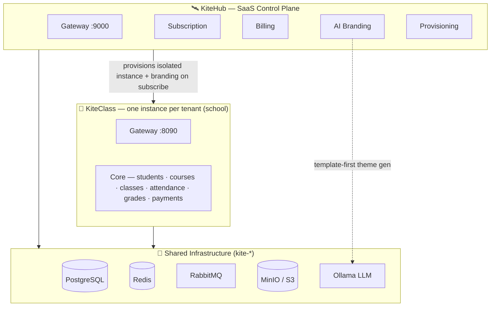

<div align="center">
  

  # Kite Platform

  **Multi-platform Educational Technology Suite**
  SaaS Management × Multi-tenant Education

  [](LICENSE)
  [](#tech-stack)
  [](#tech-stack)
  [](#tech-stack)
  [](#tech-stack)
  [](#tech-stack)
  [](CONTRIBUTING.md)
  [](#)

  [Quick Start](#quick-start) · [Architecture](#architecture) · [Documentation](#documentation) · [Governance](#governance) · [Live Demo](https://victoraurelius.github.io/2026-Kite-Class-Platform/)
</div>

---

> Two products, one stack. **KiteHub** runs the SaaS platform — subscription, billing, AI branding, multi-tenant lifecycle. **KiteClass** runs the education business — students, courses, classes, attendance, payments. One tenant per school.

📖 **Live design preview:** https://victoraurelius.github.io/2026-Kite-Class-Platform/ — interactive HTML prototypes for every persona-tuned UI kit.

🇻🇳 **Vietnamese-first.** All user-facing copy in Vietnamese; code comments + commit messages in English.

---

## ✨ Why Kite is interesting

- **One platform provisions another.** KiteHub is a SaaS control plane that spins up a fully isolated KiteClass instance whenever a school subscribes — trial → subscription → provision → deploy, automated end to end.
- **Database-level multi-tenancy.** Each tenant gets its own database (instance-per-tenant), not row-level filtering — the strongest isolation boundary, no `WHERE tenant_id` leaks.
- **AI branding from a local LLM.** Per-tenant logo, color theme, and hero imagery generated via local **Ollama** with template-first routing and per-tier rate limits — no external AI bill.
- **Governance as code.** The whole project runs on an **audit → gap → fix** pipeline: every audit finding becomes a tracked gap file, every fix is its own PR, every wave merges only after an audit refresh. Scores come from specialist audits, not self-estimates.
- **Persona-tuned UX.** Distinct dashboards for Owner, Teacher, Parent, and Student — mobile-first where it matters (parents & students), command-palette power tools where it helps (owners).
- **Built Vietnamese-first.** VND tax-format invoices, Zalo OA notifications, local payment rails (VNPay / MoMo / ZaloPay / Bank / Cash).

---

## Quick Start

```bash
# KiteHub full stack (gateway + 6 services + infra + frontend)
cd kitehub/ && ./scripts/up.sh

# KiteClass dev stack (core + gateway + frontend + infra)
cd kiteclass/ && ./scripts/dev-docker.sh up

# E2E smoke test
cd kitehub/ && ./scripts/test-api-e2e.sh
cd kiteclass/ && ./scripts/test-api-e2e.sh
```

KiteHub gateway → `http://localhost:9000` · KiteClass gateway → `http://localhost:8090`

Run `./scripts/help.sh` inside either folder for the full command list.

---

## Architecture



### Two products, one stack

|  |  **KiteHub** |  **KiteClass** |
|---|---|---|
| **Role** | SaaS management platform | Multi-tenant education platform |
| **Audience** | Operates Kite, runs trials, manages subscriptions | Each tenant = one school / education center |
| **Backend** | 6 services + gateway | Core + gateway |
| **Lifecycle** | Trial → Subscription → Provision → Deploy | Students, courses, attendance, grades, payments |
| **Container prefix** | `kitehub-*` | `kiteclass-*` |

Shared infrastructure (PostgreSQL, Redis, RabbitMQ, MinIO, Ollama) is prefixed `kite-*` — single source of truth, both products consume.

### How it works

KiteHub provisions a new KiteClass instance whenever a school subscribes. Each instance gets isolated data + custom branding (AI-generated logo, colors, hero images via local Ollama with **template-first routing** — see [`ai-branding-guidelines`](.claude/rules/ai-branding-guidelines.md)). Multi-tenancy is at **database level** (instance-per-tenant), not row-level filtering — strongest isolation.

The platform follows an **audit → gap → fix** pipeline. Every audit issue becomes a gap file; every fix is its own PR; every wave merges only after audit refresh. Scores are calibrated by specialist audits, not self-estimated.

### Main screens per product

**KiteHub** (SaaS control plane — center owner)
- Dashboard hub — KPI overview, instances grid, onboarding checklist
- Billing — invoices, payment methods, tier upgrade, payment detail
- Branding — AI Branding wizard (6-step provisioning) + theme preview + asset library
- Instance lifecycle — provision states (NOT_STARTED → INITIALIZING → GENERATING → DEPLOYED → REGENERATING)
- Admin — internal ops (instances, payments, revenue)

**KiteClass** (multi-tenant education app)
- Owner dashboard — tenant home with ⌘K command palette + sparklines + drag-drop widgets
- Teacher dashboard — daily attendance · grade entry · class schedule · reports · payroll settings
- Parent dashboard — child grades · attendance calendar · billing · Zalo OA notifications (mobile-first, PWA)
- Student dashboard — assignments · grades · today's schedule (mobile-primary)
- Admin (per tenant) — students, teachers, courses, classes, bulk import, attendance

### Cross-cutting components

Attendance roster · payment method selector (VNPay/MoMo/ZaloPay/Bank/Cash) · invoice detail (VN tax format) · parent invite · bulk actions bar.

---

## Tech Stack

| Layer | Stack |
|---|---|
| **Backend** | Spring Boot · Spring Cloud Gateway · Java 17 · Maven · Flyway · Micrometer + Prometheus |
| **Frontend** | Next.js · React · TypeScript · Tailwind · shadcn/ui · Radix UI · lucide-react · Playwright |
| **Data** | PostgreSQL · Redis · RabbitMQ · MinIO (S3-compatible) |
| **AI** | Ollama (local LLM) · template-first routing · per-tier rate limits |
| **Infra** | Docker Compose (dev) · Kubernetes + Helm (prod) · Terraform (AWS + Oracle Cloud) · GitHub Actions |

---

## Repository Structure

```
2026-Kite-Class-Platform/
├── .claude/                Skills + rules + scripts + hooks (project DNA)
├── .github/                CI/CD workflows
├── assets/                 Brand SVG logos
├── documents/              Documentation (categorized 00–08)
│   ├── 00-brd/             Business requirements
│   ├── 01-business/        Business logic — SOURCE OF TRUTH (3-layer/domain)
│   ├── 02-architecture/    Technical architecture + ADRs + design system
│   ├── 03-planning/        Wave plans, roadmaps, PR tracking
│   ├── 04-quality/         Audits + gaps + ROADMAP
│   ├── 05-guides/          Deploy guides, ops runbooks
│   ├── 06-diagrams/        PlantUML + rendered PNG
│   ├── 07-archived/        Old docs, research
│   └── 08-thesis/          Graduation project refs
├── infrastructure/         Helm + K8s + Terraform (AWS + Oracle)
├── kiteclass/              Core + gateway + frontend + shared
├── kitehub/                6 services + gateway + frontend
└── scripts/                Root CI/QA scripts
```

---

## Documentation

| Where | What |
|---|---|
| [Business Logic](documents/01-business/) | Source of truth. Each domain has `rules.md` + `use-cases.md` + `api-contract.md` |
| [Architecture](documents/02-architecture/) | System design + ADRs (Michael Nygard format) + design system dossier |
| [Design System](documents/02-architecture/design-system/) | UI kits + dossier (personas, VN UX musts, screen inventory, business flows, quality bar, prompt library) |
| [Planning](documents/03-planning/) | Wave plans + master roadmap + PR tracking |
| [Quality](documents/04-quality/) | Audit reports + gap files + ROADMAP |
| [Guides](documents/05-guides/) | Deploy, ops, runbooks (Vietnamese-first) |
| [Diagrams](documents/06-diagrams/) | PlantUML diagrams with rendered PNG |
| [Skills](.claude/skills/_README-skills-index.md) | Reusable AI workflows (audit, review, scaffolding) |
| [Rules](.claude/rules/) | Governance rules (rule-change-process, design-patterns, gap-done-discipline, ...) |

For dynamic state (open PRs, current wave, audit scores, gap counts) → see [`ROADMAP.md`](documents/04-quality/gaps/ROADMAP.md).

---

## Governance

**Solo-dev project.** Every change ships through PR (even docs). Every wave brainstormed → task-broken → TDD'd → reviewed before merge. Read [`CLAUDE.md`](CLAUDE.md) before contributing — single source of truth for:

- **Vietnamese-first** — communication + user-facing copy
- **Wave branch strategy** — every change through PR, no direct push to main
- **Superpowers methodology** — brainstorm → task break → TDD → review per PR
- **3-layer business docs** — every domain has `rules.md` + `use-cases.md` + `api-contract.md`
- **Docker via scripts** — never raw `docker-compose`, always `./scripts/up.sh`
- **Audit-to-gap pipeline** — audit issue → gap file → fix PR (no direct fixes from audit)

Governance rules under [`.claude/rules/`](.claude/rules/) — `rule-change-process`, `output-review-mandate`, `gap-done-discipline`, `incident-to-rule-pipeline`, `readme-content-discipline` — automated by pre-commit hooks + CI.

---

## Contributing

Issues, ideas, and pull requests are welcome — see [`CONTRIBUTING.md`](CONTRIBUTING.md) for the
branch / PR / commit conventions, and [`CODE_OF_CONDUCT.md`](CODE_OF_CONDUCT.md). For security
reports, please follow [`SECURITY.md`](SECURITY.md) (no public issues).

If you find the project interesting, a ⭐ helps others discover it.

## License

Released under the [MIT License](LICENSE). © 2026 Nguyen Van Kiet (VictorAurelius).

---

<div align="center">
  <sub>
    <a href="CLAUDE.md">CLAUDE.md</a> · <a href=".claude/rules/">Rules</a> · <a href="documents/04-quality/gaps/ROADMAP.md">Roadmap</a> · <a href="https://victoraurelius.github.io/2026-Kite-Class-Platform/">Design System Live</a>
  </sub>
</div>
