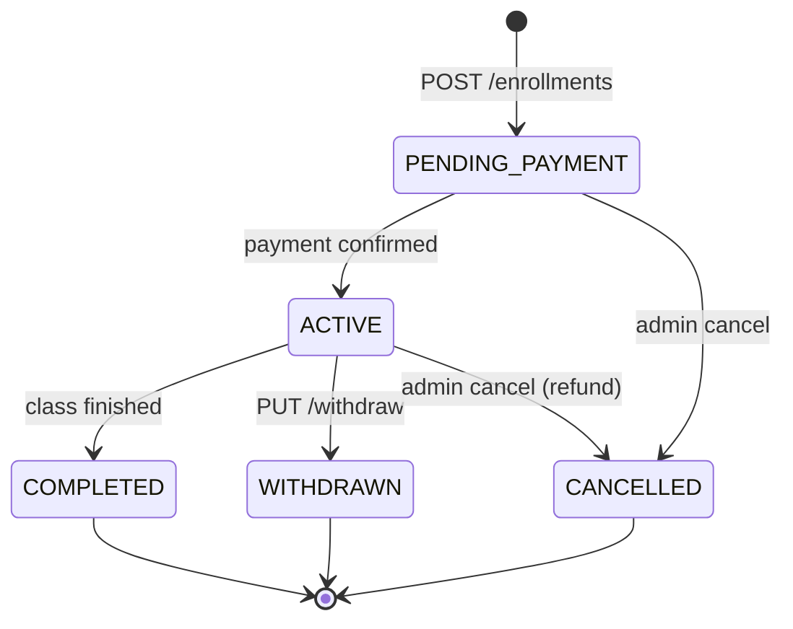

# Student & Enrollment — API Contract

**Domain:** KiteClass Core (`kiteclass-core` service)
**Version:** 2.0 — Wave beta-readiness-6 Bucket C drift sync (GAP-233)
**Updated:** 2026-05-26
**Audience:** mixed (BE devs + FE consumers + admissions staff workflow review)

---

## Endpoint summary

Bảng tổng hợp endpoint để drift detector dễ verify (`scripts/check-cross-layer-contract-drift.sh`):

| Endpoint | Method | Controller |
|---|---|---|
| /api/v1/students | POST | StudentController |
| /api/v1/students/{id} | GET | StudentController |
| /api/v1/students | GET | StudentController (list) |
| /api/v1/students/{id} | PUT | StudentController |
| /api/v1/students/{id} | DELETE | StudentController |
| /internal/students/{id} | GET | InternalStudentController |
| /internal/students | POST | InternalStudentController |
| /internal/students/{id} | DELETE | InternalStudentController |
| /api/v1/students/me/today | GET | StudentPortalController |
| /api/v1/students/me/grades | GET | StudentPortalController |
| /api/v1/students/me/grades/{subjectId} | GET | StudentPortalController |
| /api/v1/students/me/payments | GET | StudentPortalController |
| /api/v1/students/me/notifications | GET | StudentPortalController |
| /api/v1/students/bulk-import/preview | POST | BulkImportController |
| /api/v1/students/bulk-import/commit | POST | BulkImportController |
| /api/v1/students/bulk-import/jobs/{id}/errors | POST | BulkImportController |
| /api/v1/enrollments | POST | EnrollmentController |
| /api/v1/enrollments/me | GET | EnrollmentController |
| /api/v1/enrollments/{id} | GET | EnrollmentController |
| /api/v1/enrollments/student/{studentId} | GET | EnrollmentController |
| /api/v1/enrollments/class/{classId} | GET | EnrollmentController |
| /api/v1/enrollments/{id}/status | PUT | EnrollmentController |
| /api/v1/enrollments/{id}/withdraw | PUT | EnrollmentController |
| /api/v1/enrollments/bulk-import/template | GET | EnrollmentBulkImportController |
| /api/v1/enrollments/bulk-import/preview | POST | EnrollmentBulkImportController |
| /api/v1/enrollments/bulk-import/commit | POST | EnrollmentBulkImportController |

Total: 26 public + 3 internal = 29 endpoints across 6 controllers.

---

## Quy ước chung

### Authentication / Headers

| Header | Bắt buộc | Mô tả |
|---|---|---|
| `Authorization: Bearer <jwt>` | Bắt buộc (mọi public endpoint) | JWT từ Gateway, chứa role + tenant claim |
| `X-Tenant-Id: <uuid>` | Bắt buộc khi POST student / bulk-import / multi-tenant create | UUID của KiteHub instance (BR-STU-006 multi-tenant isolation) |
| `X-Internal-Request: true` | Bắt buộc cho mọi `/internal/**` endpoint | Validated bởi `InternalRequestFilter`; gateway-only — block từ public internet |
| `X-User-Reference-Id: <long>` | Bắt buộc cho `/api/v1/students/me/**` + `/api/v1/enrollments/me` | Gateway populate từ `users.reference_id` khi `userType=STUDENT` |
| `Idempotency-Key: <uuid/ulid/ksuid>` | Optional (POST enrollment only) | Dedupe accidental double-submit per GAP-730; replay cùng key trả `X-Idempotent-Replay: true` |

### Response envelope chung

Mọi endpoint dùng `ApiResponse<T>`:

```json
{ "success": true, "data": { ... }, "message": "string", "timestamp": "ISO-8601" }
```

Lỗi dùng cùng envelope với `success=false` + RFC 7807 problem fields qua exception handler.

### Pagination — `PageResponse<T>` vs `Page<T>`

- Student list (`GET /api/v1/students`) dùng `PageResponse<T>` (KiteClass custom wrapper)
- Enrollment list (`GET /api/v1/enrollments/student/{id}` + `/class/{id}`) dùng Spring `Page<T>` (chứa `content`, `totalElements`, `totalPages`, `number`, `size`)

### Roles được tham chiếu

`ADMIN` (chủ trung tâm), `TEACHER` (giáo viên), `STUDENT` (học sinh portal), `PLATFORM_ADMIN` (KiteHub admin nội bộ).

---

## StudentController — `/api/v1/students`

Endpoint tenant-facing để admissions staff + admin quản lý hồ sơ học sinh.

### POST /api/v1/students

**Use Case:** UC-STU-01 — Tạo học sinh mới
**Auth:** `Bearer JWT` + `X-Tenant-Id`
**Role:** `ADMIN` / `TEACHER`
**Response status:** `HTTP 201 CREATED`

```json
// Request body (CreateStudentRequest)
{
  "name": "Trần Thị Hồng",
  "email": "hong.tran@skyedu.vn",
  "phone": "0901234567",
  "dateOfBirth": "2010-05-14",
  "gender": "FEMALE",
  "address": "123 Lê Lợi, Q.1, TP.HCM",
  "note": "Lớp Anh ngữ 5A1",
  "initialPassword": "optional — Wave flow-kc3 GAP-1277; khi present → auto-provision KC-native login"
}
// Response 201 (StudentResponse)
{
  "success": true,
  "message": "Student created successfully",
  "data": {
    "id": 42,
    "name": "Trần Thị Hồng",
    "email": "hong.tran@skyedu.vn",
    "phone": "0901234567",
    "dateOfBirth": "2010-05-14",
    "gender": "FEMALE",
    "address": "123 Lê Lợi, Q.1, TP.HCM",
    "avatarUrl": null,
    "status": "ACTIVE",
    "note": "Lớp Anh ngữ 5A1"
  }
}
```

**Validation (per `CreateStudentRequest` record):**

| Field | Rule | Error message (i18n vi) |
|---|---|---|
| `name` | `@NotBlank` + 2-100 ký tự | "Tên là bắt buộc" / "Tên phải từ 2-100 ký tự" |
| `email` | `@Email` + ≤255 ký tự | "Email không hợp lệ" |
| `phone` | `@Pattern ^0\d{9}$` (10 chữ số bắt đầu bằng 0) | "Số điện thoại không hợp lệ (phải là 10 số bắt đầu bằng 0)" |
| `dateOfBirth` | `@PastOrPresent` | "Ngày sinh không thể là ngày trong tương lai" |
| `address` | ≤1000 ký tự | (auto Bean Validation message) |

**Errors:**

| Status | Code | Condition | Rule |
|---|---|---|---|
| 400 | `VALIDATION_ERROR` | Field validation fail | BR-STU-001 |
| 409 | `DUPLICATE_EMAIL` | Email đã có trong tenant | BR-STU-002 |
| 409 | `DUPLICATE_PHONE` | Phone đã có globally | BR-STU-003 |

**Lifecycle / Side-effects:**
- Default status `ACTIVE` (BR-STU-004)
- Set `instance_id = X-Tenant-Id` (BR-STU-006)
- Redis cache invalidate

---

### GET /api/v1/students/{id}

**Use Case:** UC-STU-02 (subset — single-fetch)
**Auth:** `Bearer JWT`
**Role:** `ADMIN` / `TEACHER`
**Response status:** `HTTP 200 OK`

**Path:** `id` (long) — student ID

**Response 200:** `ApiResponse<StudentResponse>` (shape giống POST response)

**Errors:**

| Status | Code | Condition |
|---|---|---|
| 404 | `STUDENT_NOT_FOUND` | Student không tồn tại HOẶC `deleted=true` (BR-STU-005) |

---

### GET /api/v1/students

**Use Case:** UC-STU-02 — List & search students
**Auth:** `Bearer JWT`
**Role:** `ADMIN` / `TEACHER`
**Response status:** `HTTP 200 OK`

**Query parameters:**

| Param | Type | Default | Mô tả |
|---|---|---|---|
| `search` | string | — | Keyword tìm theo name hoặc email |
| `status` | string | — | Filter theo `StudentStatus` (PENDING / ACTIVE / INACTIVE / GRADUATED / DROPPED) |
| `page` | int | `0` | 0-indexed page number |
| `size` | int | `20` | Page size |
| `sort` | string | `name` | Format `field,direction` (e.g. `name,asc`, `createdAt,desc`); camelCase tự convert sang snake_case |

**Response 200:** `ApiResponse<PageResponse<StudentResponse>>`

```json
{
  "success": true,
  "data": {
    "content": [ { /* StudentResponse */ } ],
    "page": 0,
    "size": 20,
    "totalElements": 142,
    "totalPages": 8
  }
}
```

**Side-effects:** query filter `instance_id` (BR-STU-006) + `deleted=false` (BR-STU-005) tự động áp dụng.

---

### PUT /api/v1/students/{id}

**Use Case:** UC-STU-03 — Update student
**Auth:** `Bearer JWT`
**Role:** `ADMIN`
**Response status:** `HTTP 200 OK`

```json
// Request body (UpdateStudentRequest)
{
  "name": "Trần Thị Hồng",
  "email": "hong.tran@skyedu.vn",
  "phone": "0901234567",
  "dateOfBirth": "2010-05-14",
  "gender": "FEMALE",
  "address": "45 Hai Bà Trưng, Hà Nội",
  "status": "ACTIVE",
  "note": "Chuyển địa chỉ"
}
```

**Validation:** Tất cả field optional; nếu present phải pass cùng rules như Create (email format, phone Vietnamese pattern, address ≤1000 ký tự).

**Errors:**

| Status | Code | Condition |
|---|---|---|
| 404 | `STUDENT_NOT_FOUND` | Student không tồn tại hoặc deleted |
| 409 | `DUPLICATE_EMAIL` | Email mới trùng student khác trong tenant |
| 409 | `DUPLICATE_PHONE` | Phone mới trùng globally |

**Lifecycle:** Redis cache invalidate.

---

### DELETE /api/v1/students/{id}

**Use Case:** UC-STU-04 — Soft delete student
**Auth:** `Bearer JWT`
**Role:** `ADMIN`
**Response status:** `HTTP 204 NO_CONTENT`

Soft delete only (BR-STU-005 — set `deleted=true`, không bao giờ hard delete).

**Errors:**

| Status | Code | Condition |
|---|---|---|
| 404 | `STUDENT_NOT_FOUND` | Student không tồn tại |

**Lifecycle:** Redis cache invalidate; student bị loại khỏi mọi query sau (BR-STU-005). Enrollment hiện hữu KHÔNG tự cascade — admin phải withdraw từng enrollment riêng.

---

## InternalStudentController — `/internal/students` (Gateway-only)

Endpoint nội bộ cho KiteHub Gateway sync student profile trong flow login + provisioning.

**Security:** Mọi endpoint require header `X-Internal-Request: true` (validated bởi `InternalRequestFilter`). KHÔNG accessible từ public internet.
**Hidden:** `@Hidden` annotation — không xuất hiện trong public Swagger UI.

### GET /internal/students/{id}

**Use Case:** UC-STU-08 — Internal fetch student profile
**Auth:** `X-Internal-Request: true` (service-to-service)

**Response 200:** `ApiResponse<StudentResponse>`

**Errors:** `404 STUDENT_NOT_FOUND`

---

### POST /internal/students

**Use Case:** UC-STU-08 — Internal create student trong Gateway registration flow
**Auth:** `X-Internal-Request: true` + `X-Tenant-Id: <uuid string>`
**Response status:** `HTTP 201 CREATED`

**Request body:** `CreateStudentRequest` (giống public POST).

**Response 201:** `ApiResponse<StudentResponse>`

**Flow context (gateway perspective):**
1. Gateway tạo `User` record (without referenceId)
2. Gateway POST `/internal/students` → Core tạo Student
3. Gateway update `User.referenceId = Student.id`

---

### DELETE /internal/students/{id}

**Use Case:** UC-STU-08 — Internal soft delete khi user account bị xoá
**Auth:** `X-Internal-Request: true`
**Response status:** `HTTP 200 OK` (Note: KHÁC public DELETE 204)

**Response 200:** `ApiResponse<Void>` (`data: null`)

**Errors:** `404 STUDENT_NOT_FOUND`

---

## StudentPortalController — `/api/v1/students/me` (Student-facing portal)

Endpoint read-only cho học sinh login `kc-student` portal (GAP-269b, Wave 51 Bucket B).

**Identity:** Gateway populate `X-User-Reference-Id` header từ `users.reference_id` khi `userType=STUDENT`. Mọi endpoint require header này; vắng mặt → `401 AUTH_REQUIRED`.
**Surface:** Mirror các màn FE student dashboard (`(dashboard)/student/{today,grades,payments,notifications}`) Wave 49 Bucket C.

### GET /api/v1/students/me/today

**Use Case:** Today's schedule + assignments due
**Headers:** `X-User-Reference-Id: <long>` (required)

**Response 200:** `ApiResponse<StudentTodayResponse>` (schedulePeriods + assignmentsDueToday for calling student)

**Errors:** `401 AUTH_REQUIRED` (header missing)

---

### GET /api/v1/students/me/grades

**Use Case:** Per-subject grade overview cho calling student
**Headers:** `X-User-Reference-Id: <long>`

**Response 200:** `ApiResponse<List<StudentGradeOverview>>`

**Errors:** `401 AUTH_REQUIRED`

---

### GET /api/v1/students/me/grades/{subjectId}

**Use Case:** Grade detail cho một subject cụ thể
**Headers:** `X-User-Reference-Id: <long>`
**Path:** `subjectId` (long)

**Response 200:** `ApiResponse<StudentGradeDetailResponse>`

**Errors:**

| Status | Code | Condition |
|---|---|---|
| 401 | `AUTH_REQUIRED` | Header `X-User-Reference-Id` missing |
| 404 | `STUDENT_PORTAL_SUBJECT_NOT_FOUND` | Calling student không enroll trong subjectId |

---

### GET /api/v1/students/me/payments

**Use Case:** Invoice list cho calling student (read-only — settlement qua owner-side payment flow)
**Headers:** `X-User-Reference-Id: <long>`

**Response 200:** `ApiResponse<List<StudentPaymentSummary>>`

**Errors:** `401 AUTH_REQUIRED`

---

### GET /api/v1/students/me/notifications

**Use Case:** Cursor-paginated notification feed
**Headers:** `X-User-Reference-Id: <long>`

**Query parameters:**

| Param | Type | Default | Mô tả |
|---|---|---|---|
| `cursor` | string | — | Opaque cursor; omit cho first page |
| `limit` | int | `20` | Clamp `[1..100]` |

**Response 200:** `ApiResponse<StudentNotificationFeedResponse>` — chứa `nextCursor` (null khi hết page).

**Errors:** `401 AUTH_REQUIRED`

---

## BulkImportController — `/api/v1/students/bulk-import` (GAP-051)

Endpoint bulk-import học sinh qua xlsx upload. SLO tier-d. Stateless MVP (lỗi report tự re-validate).

### POST /api/v1/students/bulk-import/preview

**Use Case:** Dry-run preview — parse + validate KHÔNG ghi DB
**Auth:** `Bearer JWT` + `X-Tenant-Id: <uuid>`
**Role:** `ADMIN`
**Content-Type:** `multipart/form-data`
**Response status:** `HTTP 200 OK`

**Form field:** `file` (multipart xlsx)

**Response 200:** `ApiResponse<BulkImportResult>` với `jobId=null`

```json
{
  "success": true,
  "message": "Preview xong",
  "data": {
    "jobId": null,
    "totalRows": 50,
    "successCount": 47,
    "errorCount": 3,
    "errors": [
      { "rowNumber": 12, "field": "email", "message": "Email không hợp lệ" },
      { "rowNumber": 18, "field": "phone", "message": "Số điện thoại không hợp lệ" },
      { "rowNumber": 33, "field": "row", "message": "Hàng trống" }
    ]
  }
}
```

**Errors inline:** truncated to first 10 (`BulkImportResult.MAX_RETURNED_ERRORS = 10`); phần còn lại lấy qua endpoint `/jobs/{id}/errors`.

**Errors:**

| Status | Code | Condition |
|---|---|---|
| 400 | `INVALID_FILE` | File không phải xlsx / corrupt |
| 400 | `EMPTY_FILE` | File 0 rows |

---

### POST /api/v1/students/bulk-import/commit

**Use Case:** Commit — parse + validate + create. Valid rows persist, invalid rows skipped + reported.
**Auth:** `Bearer JWT` + `X-Tenant-Id: <uuid>`
**Role:** `ADMIN`
**Content-Type:** `multipart/form-data`
**Response status:** `HTTP 201 CREATED`
**Location header:** `/api/v1/students/bulk-import/jobs/<jobId>`

**Form fields:**
- `file` (multipart xlsx) — bắt buộc
- `initialPassword` (optional, batch-level — Wave flow-kc3 GAP-1277) — khi present + hợp lệ (`AuthPasswordPolicy`), mỗi học sinh tạo thành công CÓ email được auto-provision KC-native login cùng batch. KHÔNG phải cột trong xlsx.

**Response 201:** `ApiResponse<BulkImportResult>` với `jobId != null`

**Partial-success behavior:**
- Valid rows được tạo Student record (mỗi row độc lập — không all-or-nothing)
- Invalid rows skip + ghi vào error report
- Response include `successCount` + `errorCount` + `credentialsProvisioned` + first 10 errors inline
- `BulkImportJob` row persist trong DB cho audit trail

**`credentialsProvisioned` (Wave flow-kc3 GAP-1277):** số login credential auto-provision (≤ `successCount`; 0 nếu không kèm `initialPassword`). Provision-fail 1 dòng (vd email cross-tenant) → ghi row error field `credential`, KHÔNG hủy create + KHÔNG abort chunk. Invalid batch password → HTTP 400 `BULK_IMPORT_INVALID_PASSWORD` (trước mọi DB write). Chi tiết: `tenant-auth/api-contract.md` §2c.

**Validation per row:** Cùng bộ rules như `CreateStudentRequest` (BR-STU-001..003).

---

### POST /api/v1/students/bulk-import/jobs/{id}/errors

**Use Case:** Download xlsx error report cho job đã commit
**Auth:** `Bearer JWT` + `X-Tenant-Id: <uuid>`
**Content-Type:** `multipart/form-data`
**Produces:** `application/vnd.openxmlformats-officedocument.spreadsheetml.sheet`
**Response status:** `HTTP 200 OK`

**Path:** `id` (long) — jobId từ commit response

**Form field:** `file` (multipart xlsx — re-upload original file; MVP stateless, re-validate fresh)

**Response 200:** xlsx bytes as attachment với header `Content-Disposition: attachment; filename="bulk-import-errors-<jobId>.xlsx"`

**Note:** Phương thức POST (không GET) vì MVP stateless — không lưu file gốc; caller re-upload để regenerate report. GET variant `/jobs/{id}/errors` luôn trả `405 METHOD_NOT_ALLOWED` (đăng ký route trong OpenAPI để FE biết tồn tại).

---

## EnrollmentController — `/api/v1/enrollments`

Lifecycle-critical — enroll/withdraw triggers invoice generation (event-driven) + class capacity update.

### POST /api/v1/enrollments

**Use Case:** UC-STU-05 — Enroll student in class
**Auth:** `Bearer JWT`
**Role:** `ADMIN` / `TEACHER`
**Response status:** `HTTP 201 CREATED`
**Optional header:** `Idempotency-Key: <uuid/ulid/ksuid>` — dedupe accidental double-submit per GAP-730

```json
// Request body (CreateEnrollmentRequest)
{
  "studentId": 42,
  "classId": 17,
  "tuitionAmount": 1500000.00,
  "discountPercent": 10.00,
  "notes": "Lớp Anh ngữ 5A1 - HK1 2025-2026"
}
// Response 201 (EnrollmentResponse)
{
  "success": true,
  "message": "Student enrolled successfully",
  "data": {
    "id": 1,
    "studentId": 42,
    "classId": 17,
    "enrollmentDate": "2026-05-26T14:30:00",
    "status": "PENDING_PAYMENT",
    "tuitionAmount": 1500000.00,
    "discountPercent": 10.00,
    "finalAmount": 1350000.00,
    "notes": "Lớp Anh ngữ 5A1 - HK1 2025-2026",
    "createdAt": "2026-05-26T14:30:00Z",
    "updatedAt": "2026-05-26T14:30:00Z"
  }
}
```

**Validation (per `CreateEnrollmentRequest`):**

| Field | Rule |
|---|---|
| `studentId` | `@NotNull @Positive` |
| `classId` | `@NotNull @Positive` |
| `tuitionAmount` | `@NotNull @DecimalMin 0.0` + `@Digits(integer=8, fraction=2)` |
| `discountPercent` | Optional (default 0) — `@DecimalMin 0.0 @DecimalMax 100.0` + `@Digits(integer=3, fraction=2)` (BR-ENROLL-004) |
| `notes` | ≤2000 ký tự |

**Errors:**

| Status | Code | Condition | Rule |
|---|---|---|---|
| 400 | `VALIDATION_ERROR` | Field validation fail | — |
| 400 | `INVALID_DISCOUNT` | Discount ngoài 0-100 | BR-ENROLL-004 |
| 404 | `STUDENT_NOT_FOUND` | Student không tồn tại / deleted | — |
| 404 | `CLASS_NOT_FOUND` | Class không tồn tại / deleted | — |
| 409 | `ALREADY_ENROLLED` | Student đã enroll class này (active enrollment) | BR-ENROLL-002 |
| 409 | `CLASS_FULL` | `currentEnrolled >= maxStudents` | BR-ENROLL-001 |
| 409 | `COURSE_ARCHIVED` | Class's course status = ARCHIVED | BR-ENROLL-005 |

**Idempotency contract:**
- Replay (cùng `Idempotency-Key` + cùng tenant + cùng request body hash) → trả cached response + header `X-Idempotent-Replay: true`
- First request (cache miss) → trả response thường + header `X-Idempotent-Replay: false`
- Race condition (2 concurrent requests cùng key) → loser nhận cached response của winner

**Lifecycle / Side-effects:**

1. **Tenant isolation:** Set `enrollment.instance_id = student.instance_id` (BR-STU-006)
2. **Capacity check:** `PESSIMISTIC_WRITE` lock trên Class row → check `currentEnrolled < maxStudents` → throw `CLASS_FULL` nếu vượt
3. **Auto-calc finalAmount:** `@PrePersist` Entity callback tính `finalAmount = tuitionAmount * (1 - discountPercent/100)` (BR-ENROLL-003)
4. **Default status:** `PENDING_PAYMENT` (BR-ENROLL-006) — student CHƯA được attend class cho đến khi payment confirm
5. **Class capacity update:** `class.currentEnrolled += 1` (cùng txn với enrollment save, dưới lock)
6. **Domain event:** Publish `EnrollmentCreatedEvent` qua Spring `ApplicationEvent` (in-process; consumer = `payment-invoice` listener trong cùng service → tạo Invoice tương ứng — PR 2.8 wiring). Cross-domain side-effect chain:
   - **Invoice domain** (`payment-invoice/api-contract.md`) → tạo `Invoice` row matching enrollment (event-driven; KHÔNG synchronous)
   - **Attendance domain** (`attendance/api-contract.md`) → KHÔNG tự cascade Wave beta-readiness-6; attendance enrollment record sẽ build qua follow-up (tracked Wave 67+)
   - **Parent portal** → KHÔNG tự cascade tại đây; parent visibility qua `parent/api-contract.md` query path dựa enrollment relation

---

### GET /api/v1/enrollments/me

**Use Case:** Student-self — liệt kê các lớp/khóa mình đã ghi danh (kc-student portal "Học tập" + "Bài tập") — GAP-1285
**Auth:** `Bearer JWT`
**Role:** `STUDENT` (chỉ STUDENT) — `@PreAuthorize("hasRole('STUDENT')")`
**Headers:** `X-User-Reference-Id: <long>` (bắt buộc) — Gateway populate từ `users.reference_id` khi `userType=STUDENT` (= `students.id`)
**Response status:** `HTTP 200 OK`

**Self-scoped — KHÔNG có path variable `studentId`.** Actor chỉ đọc được enrollment của CHÍNH MÌNH (resolve từ `X-User-Reference-Id` = `students.id`), không có IDOR surface. Khác `GET /api/v1/enrollments/student/{studentId}` (teacher/admin-guarded qua `@authz.hasAccessToStudent`, vốn chặn student tự đọc) — đây là path STUDENT-accessible.

**Query parameters:**

| Param | Type | Default | Mô tả |
|---|---|---|---|
| `page` | int | `0` | 0-indexed |
| `size` | int | `100` | Page size (FE student shell dùng size lớn để lấy hết) |
| `sort` | string | `enrollmentDate,DESC` | Default — mới nhất trước |

**Response 200:** `ApiResponse<Page<MyEnrollmentResponse>>` (Spring `Page<T>`)

```json
{
  "success": true,
  "data": {
    "content": [
      {
        "id": 1,
        "studentId": 42,
        "classId": 17,
        "className": "Lớp Anh ngữ 5A1 - Tối",
        "courseId": 8,
        "courseName": "Anh ngữ B1",
        "enrollmentDate": "2026-06-14T14:30:00",
        "status": "ACTIVE",
        "tuitionAmount": 1500000.00,
        "discountPercent": 10.00,
        "finalAmount": 1350000.00,
        "notes": null,
        "createdAt": "2026-06-14T14:30:00Z",
        "updatedAt": "2026-06-14T14:30:00Z"
      }
    ],
    "totalElements": 1,
    "totalPages": 1,
    "number": 0,
    "size": 100
  }
}
```

**Enrichment:** mỗi enrollment được bổ sung `classId` + `className` + `courseId` + `courseName` (resolve qua class → course, batch — không N+1). `className` / `courseId` / `courseName` = null nếu class/course đã soft-delete (display-only, không bao giờ leak cross-tenant).

**Errors:**

| Status | Code | Condition |
|---|---|---|
| 401 | `AUTH_REQUIRED` | Header `X-User-Reference-Id` vắng mặt (Gateway không forward) |
| 403 | (Spring Security) | Actor không phải role STUDENT (method-security production) |

**Tenant isolation:** Hibernate `tenantFilter` áp dụng cho cả enrollment query + class/course enrichment lookups; `studentId` predicate scope về 1 student → không cross-student leak (verified `StudentSelfEnrollmentIntegrationTest` Testcontainers).

---

### GET /api/v1/enrollments/{id}

**Use Case:** Fetch enrollment by ID
**Auth:** `Bearer JWT`
**Role:** `ADMIN` / `TEACHER`
**Response status:** `HTTP 200 OK`
**Path:** `id` (long)

**Response 200:** `ApiResponse<EnrollmentResponse>`

**Errors:**

| Status | Code | Condition |
|---|---|---|
| 404 | `ENROLLMENT_NOT_FOUND` | Không tồn tại / deleted |

**Tenant isolation (post GAP-746 fix):** Repository uses explicit tenant param — `findByIdAndInstanceIdAndDeletedFalse(id, TenantContext.getCurrentTenant())` khi `TenantContext.isSet()`, falls back `findByIdAndDeletedFalse(id)` cho system jobs (no tenant context).

---

### GET /api/v1/enrollments/student/{studentId}

**Use Case:** List enrollments của 1 student (history view)
**Auth:** `Bearer JWT`
**Role:** `ADMIN` / `TEACHER` / `STUDENT` (own enrollments only)
**Response status:** `HTTP 200 OK`
**Path:** `studentId` (long)

**Query parameters:**

| Param | Type | Default | Mô tả |
|---|---|---|---|
| `page` | int | `0` | 0-indexed |
| `size` | int | `20` | Page size |
| `sort` | string | `enrollmentDate,DESC` | Default — most recent first |

**Response 200:** `ApiResponse<Page<EnrollmentResponse>>` (Spring `Page<T>`)

**Errors:**

| Status | Code | Condition |
|---|---|---|
| 404 | `STUDENT_NOT_FOUND` | Student không tồn tại |

---

### GET /api/v1/enrollments/class/{classId}

**Use Case:** Class roster — list enrollments trong class
**Auth:** `Bearer JWT`
**Role:** `ADMIN` / `TEACHER`
**Response status:** `HTTP 200 OK`
**Path:** `classId` (long)

**Query parameters:**

| Param | Type | Default | Mô tả |
|---|---|---|---|
| `status` | string | — | Filter `EnrollmentStatus` (optional) |
| `page` | int | `0` | — |
| `size` | int | `20` | — |
| `sort` | string | `enrollmentDate,ASC` | Default — earliest first (roster order) |

**Response 200:** `ApiResponse<Page<EnrollmentResponse>>`

---

### PUT /api/v1/enrollments/{id}/status

**Use Case:** UC-STU-06 — Update enrollment status (manual state transition)
**Auth:** `Bearer JWT`
**Role:** `ADMIN`
**Response status:** `HTTP 200 OK`
**Path:** `id` (long)

```json
// Request body (UpdateEnrollmentStatusRequest)
{
  "status": "ACTIVE",
  "notes": "Đã xác nhận payment qua VietQR"
}
```

**Validation:** `status` `@NotNull`; `notes` optional.

**State-transition table (EnrollmentStatus enum, BR-ENROLL state machine):**

| From → To | Allowed? | Trigger / Use case |
|---|:---:|---|
| `PENDING_PAYMENT` → `ACTIVE` | ✅ | Payment confirmed (admin manual hoặc invoice paid webhook) |
| `PENDING_PAYMENT` → `CANCELLED` | ✅ | Admin huỷ enrollment trước khi payment confirm |
| `ACTIVE` → `COMPLETED` | ✅ | Lớp kết thúc (class status flip) |
| `ACTIVE` → `WITHDRAWN` | ✅ qua endpoint `/withdraw` (semantic riêng) | Student rút khỏi class — dùng PUT `/{id}/withdraw` thay vì status endpoint |
| `ACTIVE` → `CANCELLED` | ⚠️ | Admin huỷ vì lý do hành chính (refund full, dispute) |
| `COMPLETED` → bất kỳ | ❌ | Terminal — file new enrollment nếu cần re-enroll |
| `WITHDRAWN` → bất kỳ | ❌ | Terminal |
| `CANCELLED` → bất kỳ | ❌ | Terminal |
| `*` → `PENDING_PAYMENT` | ❌ | Cannot revert payment state |

**Errors:**

| Status | Code | Condition |
|---|---|---|
| 404 | `ENROLLMENT_NOT_FOUND` | Không tồn tại |
| 400 | `INVALID_STATUS_TRANSITION` | From → To không hợp lệ per state machine table trên |

**Withdraw vs status-update — khi dùng cái nào?**

- **PUT `/{id}/withdraw`** — semantic chuyên dụng cho student withdraw (UC-STU-07); set status WITHDRAWN + tự handle class capacity refund + có thể trigger refund-request workflow (Phase 1.5+)
- **PUT `/{id}/status`** — general-purpose state transition cho admin (confirm payment ACTIVE, mark COMPLETED khi class kết thúc, CANCELLED hành chính). KHÔNG khuyến nghị dùng để set WITHDRAWN — dùng `/withdraw` thay thế cho audit trail rõ ràng hơn.

---

### PUT /api/v1/enrollments/{id}/withdraw

**Use Case:** UC-STU-07 — Withdraw student from class
**Auth:** `Bearer JWT`
**Role:** `ADMIN` / `STUDENT` (own enrollment only)
**Response status:** `HTTP 200 OK`
**Path:** `id` (long)

**No request body.**

**Response 200:** `ApiResponse<EnrollmentResponse>` với `status = WITHDRAWN`

**Errors:**

| Status | Code | Condition |
|---|---|---|
| 400 | `ALREADY_WITHDRAWN` | Enrollment đã ở status WITHDRAWN |
| 404 | `ENROLLMENT_NOT_FOUND` | Không tồn tại |

**Irreversibility:** Một khi WITHDRAWN, KHÔNG thể revert. Để re-enroll student vào cùng class, phải tạo NEW enrollment record (POST `/api/v1/enrollments`). Class `uk_enrollments_student_class_instance` unique constraint cho phép re-enroll vì check `deleted=false` (WITHDRAWN ≠ deleted).

**Lifecycle / Side-effects:**

1. Set `status = WITHDRAWN`
2. Class capacity refund: `class.currentEnrolled -= 1` (free slot cho student khác)
3. **Refund flow (Phase 1.5+):** Sẽ publish `EnrollmentWithdrawnEvent` → refund-request workflow (per `payment-invoice/api-contract.md` GAP-231). Wave beta-readiness-6 KHÔNG ship refund cascade — manual refund qua admin SOP.

---

## EnrollmentBulkImportController — `/api/v1/enrollments/bulk-import` (GAP-1104)

Ghi danh nhiều học sinh vào lớp qua xlsx. Mỗi dòng resolve học sinh + lớp theo human key rồi delegate sang single-enroll flow (`EnrollmentService.enrollStudent`) — skip-and-report từng dòng. SLO tier-d.

**xlsx schema (header dòng 1, lowercase):** `student_email | student_phone | class_code | tuition_amount | discount_percent | note`. Bắt buộc: `class_code` + (`student_email` HOẶC `student_phone`). Header resolve case-insensitive; cột thừa bị bỏ qua.

### GET /api/v1/enrollments/bulk-import/template

**Use Case:** UC-STU-10 — Tải template mẫu
**Auth:** `Bearer JWT` (KHÔNG cần `X-Tenant-Id` — template giống nhau mọi tenant)
**Role:** `ADMIN` / `TEACHER`
**Produces:** `application/vnd.openxmlformats-officedocument.spreadsheetml.sheet`
**Response status:** `HTTP 200 OK`

Trả file xlsx attachment `mau-import-ghi-danh.xlsx` gồm sheet `GhiDanh` (header + 2 dòng ví dụ: 1 resolve theo email, 1 resolve theo phone) + sheet `HuongDan` (hướng dẫn tiếng Việt).

### POST /api/v1/enrollments/bulk-import/preview

**Use Case:** UC-STU-11 — Xem trước ghi danh hàng loạt (dry-run)
**Auth:** `Bearer JWT` + `X-Tenant-Id: <uuid>`
**Role:** `ADMIN` / `TEACHER`
**Content-Type:** `multipart/form-data` (field `file`)
**Response status:** `HTTP 200 OK`

Parse + resolve học sinh/lớp + validate field (tuition/discount) + phát hiện trùng trong file. KHÔNG ghi DB. Lỗi nghiệp vụ (lớp đầy, đã ghi danh) chỉ kiểm tra ở commit.

**Response 200:** `ApiResponse<EnrollmentBulkResult>`

```json
{
  "success": true,
  "message": "Xem trước xong",
  "data": {
    "totalRows": 50,
    "successCount": 47,
    "errorCount": 3,
    "errors": [
      { "rowNumber": 12, "field": "class_code", "message": "Không tìm thấy lớp với mã 'TOAN9X'" },
      { "rowNumber": 18, "field": "student_email", "message": "Không tìm thấy học sinh với email 'x@y.vn'" },
      { "rowNumber": 33, "field": "tuition_amount", "message": "Học phí (tuition_amount) là bắt buộc" }
    ]
  }
}
```

**Errors inline:** truncate 10 đầu (`EnrollmentBulkResult.MAX_RETURNED_ERRORS = 10`).

**Errors:**

| Status | Code | Condition |
|---|---|---|
| 400 | `ENROLLMENT_BULK_IMPORT_PARSE_ERROR` | File thiếu header bắt buộc / corrupt |
| 400 | `ENROLLMENT_BULK_IMPORT_EMPTY_FILE` | File rỗng |
| 413 | `ENROLLMENT_BULK_IMPORT_ROW_LIMIT_EXCEEDED` | > 1000 dòng (BR-ENROLL-008) |
| 415 | `ENROLLMENT_BULK_IMPORT_INVALID_FILE_TYPE` | Không phải `.xlsx` |

### POST /api/v1/enrollments/bulk-import/commit

**Use Case:** UC-STU-11 — Ghi danh hàng loạt
**Auth:** `Bearer JWT` + `X-Tenant-Id: <uuid>`
**Role:** `ADMIN` / `TEACHER`
**Content-Type:** `multipart/form-data` (field `file`)
**Response status:** `HTTP 201 CREATED`

Mỗi dòng hợp lệ gọi `enrollStudent` (transaction riêng — BR-ENROLL-001..006 áp dụng). Dòng lỗi (resolution / field / business rule / trùng trong file) bị bỏ qua + báo cáo; dòng hợp lệ vẫn ghi danh.

**Response 201:** `ApiResponse<EnrollmentBulkResult>` (cùng shape preview). Lỗi nghiệp vụ map sang message dòng:

| BE code (enrollStudent) | Message dòng |
|---|---|
| `ENROLLMENT_DUPLICATE` | Học sinh đã được ghi danh trong lớp này |
| `CLASS_FULL` | Lớp đã đầy (đạt sĩ số tối đa) |
| `CLASS_NOT_ENROLLABLE` | Lớp không thể ghi danh (đã hoàn thành hoặc đã hủy) |

**Note:** Không có `jobId` (khác student bulk-import) — không persist job row; mỗi dòng là 1 single-enroll transaction.

---

## State-transition diagram



---

## Cross-domain integration map

| Endpoint | Triggers event | Consumer domain | Effect |
|---|---|---|---|
| POST `/api/v1/enrollments` | `EnrollmentCreatedEvent` (Spring ApplicationEvent in-process) | `payment-invoice` | Tạo `Invoice` row cho enrollment (per GAP-231 api-contract) |
| POST `/api/v1/enrollments` | (denormalized counter, không event) | `class-course` | `class.currentEnrolled += 1` cùng txn |
| PUT `/api/v1/enrollments/{id}/withdraw` | (Phase 1.5+) `EnrollmentWithdrawnEvent` | `payment-invoice` refund flow | Refund request (manual SOP Wave beta-readiness-6) |
| PUT `/api/v1/enrollments/{id}/withdraw` | (denormalized counter) | `class-course` | `class.currentEnrolled -= 1` |
| POST `/internal/students` | — (synchronous) | `kitehub-gateway` | `User.referenceId = Student.id` |
| DELETE `/api/v1/students/{id}` | — (Wave beta-readiness-6 scope KHÔNG cascade enrollment) | — | Enrollment hiện hữu giữ nguyên — admin phải withdraw từng enrollment manually |

---

## File-split decision

**Recommendation: KEEP COMBINED file `student-enrollment/api-contract.md`** (cross-cutting domain).

Rationale:
- Student CRUD + Enrollment lifecycle có high coupling (BR-ENROLL-002 unique constraint student×class; UC-STU-05 enrollment depends on student exists)
- Folder name `student-enrollment/` (snake_case kebab) signals combined scope; rename sẽ cascade broken cross-links từ rules.md + use-cases.md + cross-domain api-contract refs
- BulkImportController + StudentPortalController hợp lý nằm cùng (student namespace)

KHÔNG file-split. Wave beta-readiness-6 Bucket C giữ combined contract; sẽ revisit nếu Wave 67+ portal expansion làm file > 800 lines.

---

## Integration testing — verify schema match

Tests verify ít nhất 3 endpoints schema match per AC GAP-233:

| Test | Endpoint | Verifies |
|---|---|---|
| `EnrollmentIntegrationTest#enrollStudent_returns201_withEnrollmentResponse` | POST `/api/v1/enrollments` | HTTP 201 + `EnrollmentResponse` shape + `finalAmount` auto-calc (BR-ENROLL-003) |
| `EnrollmentIntegrationTest#withdrawStudent_setsStatusWithdrawn` | PUT `/api/v1/enrollments/{id}/withdraw` | status=WITHDRAWN + class.currentEnrolled refund |
| `StudentControllerTest#createStudent_returns201_withStudentResponse` | POST `/api/v1/students` | HTTP 201 + `StudentResponse` shape + default status=ACTIVE (BR-STU-004) |

Note: Wave gap-746 (PR #1834) đã ship explicit tenant param fix cho `EnrollmentRepository.findByIdAndDeletedFalse`. Integration test giữ nguyên — chỉ kiểm tra contract schema, không regression repository tenant filter.

---

## References

- **Domain rules:** `documents/01-business/kiteclass/student-enrollment/rules.md` (BR-STU-001..006, BR-ENROLL-001..006)
- **Use cases:** `documents/01-business/kiteclass/student-enrollment/use-cases.md` (UC-STU-01..08)
- **Cross-domain contracts:**
  - `documents/01-business/kiteclass/payment-invoice/api-contract.md` (invoice generation event chain — GAP-231)
  - `documents/01-business/kiteclass/attendance/api-contract.md` (attendance enrollment row — deferred Wave 67+ — GAP-232)
- **Gap:** GAP-233 (this drift sync); GAP-1285 (student-self `/me` enrollment endpoint — Wave rbac-lms-gap-1285)
- **Sibling waves:** Wave gap-746 (PR #1834 EnrollmentRepository tenant param fix); Wave beta-readiness-2 Bucket A (GAP-730 Idempotency-Key); Wave rbac-lms-gap-1285 (GET /api/v1/enrollments/me — student-self enrolled course/class list)
- **State-check date:** 2026-06-14 (Wave rbac-lms-gap-1285 — added `/me` endpoint)
