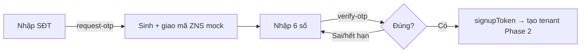

# Signup OTP — Use Cases

**Domain:** KiteHub auth / mobile signup
**Related:** `rules.md` · `api-contract.md` · GAP-286
**Status:** 🟡 Phase 1 — backend OTP request/verify (mock delivery); FE mobile form + live delivery = Phase 2

---

## UC-OTP-01 — Yêu cầu mã OTP (request-otp)

**Actor:** Khách đăng ký (gia sư solo / chủ trung tâm) trên mobile (iPhone Safari / Android Chrome).
**Tiền điều kiện:** chưa đăng nhập; có số điện thoại VN.

**Luồng chính:**
1. User nhập số điện thoại (vd `0901234567`) → nhấn "Gửi mã".
2. FE gọi `POST /api/v1/auth/signup/request-otp`.
3. BE validate định dạng số (BR-OTP-005) → sinh mã 6 chữ số (BR-OTP-001), lưu hash + TTL 5 phút (BR-OTP-002).
4. BE giao mã qua Zalo ZNS (Phase 1 = mock → log INFO; Phase 2 = ZNS thật) per BR-OTP-006.
5. BE trả `200 { requestId, channel, expiresInSeconds: 300, mock: true }`.
6. FE chuyển sang màn nhập OTP + đếm ngược 5 phút.

**Luồng lỗi:**
| Tình huống | Mã | FE behavior |
|---|---|---|
| Số sai định dạng | `400 INVALID_PHONE` | Hiện lỗi inline "Số điện thoại không hợp lệ" |
| Vượt rate-limit (>3/15 phút) per BR-OTP-003 | `429 RATE_LIMITED { retryAfterSeconds }` | Disable nút + đếm ngược "Thử lại sau N giây" |

---

## UC-OTP-02 — Xác thực mã OTP (verify-otp)

**Actor:** Khách đăng ký vừa nhận mã.
**Tiền điều kiện:** đã request OTP, mã còn hạn.

**Luồng chính:**
1. User nhập 6 chữ số (autofill từ SMS Web-OTP API nếu hỗ trợ).
2. FE gọi `POST /api/v1/auth/signup/verify-otp` với `{ phone, code }`.
3. BE so khớp hash + kiểm hạn + đếm số lần thử (BR-OTP-004).
4. Đúng → trả `200 { verified: true, signupToken }` (token chứng minh sở hữu số, TTL 10 phút — BR-OTP-007).
5. FE chuyển sang bước tạo tenant (nhập tên trung tâm...) mang theo `signupToken`.

**Luồng lỗi:**
| Tình huống | reason | FE behavior |
|---|---|---|
| Mã sai | `400 INVALID_CODE` | "Mã không đúng" + cho nhập lại (còn N lần) |
| Mã hết hạn | `400 EXPIRED` | "Mã đã hết hạn" + nút "Gửi lại mã" |
| Quá 5 lần sai (BR-OTP-004) | `400 TOO_MANY_ATTEMPTS` | Vô hiệu mã + bắt request mã mới |

---

## UC-OTP-03 — Tiêu thụ signupToken (Phase 2 — out of scope sprint này)

> TBD (Phase 2): bước tạo tenant nhận `signupToken`, verify ownership, provision TRIAL instance sub-30s (GAP-286 fast-provisioning sub-task), redirect dashboard. Tổng flow ≤10 phút wall-clock per AC-ONBOARD-001.

---

## Quan hệ flow

