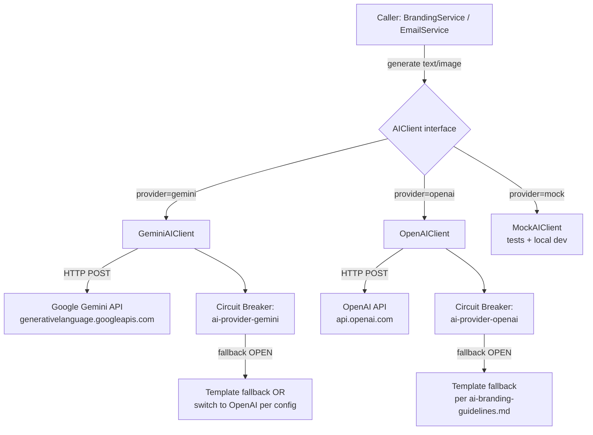
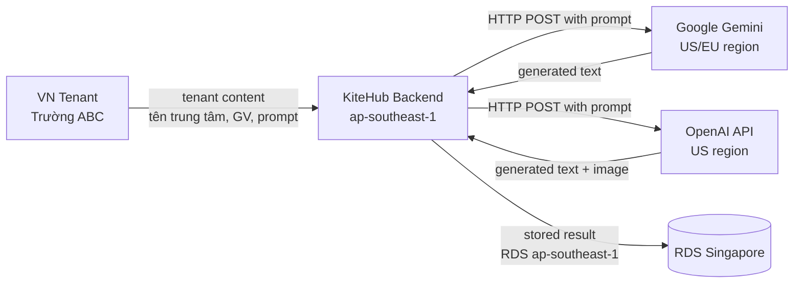

# ADR-038: AI External Provider Strategy — Gemini Free Tier Primary + OpenAI Fallback

**Status:** PROPOSED
**Date:** 2026-06-02
**Deciders:** @nguyenvankiet (solo-dev, acting CTO + Product Owner)
**Reviewers:** N/A (solo-dev mode per CLAUDE.md decision context locked 2026-05-06)
**Related Gap(s):** GAP-005 (AI queue fair scheduling — re-scoped 2026-06-02 với architecture pivot Ollama → external API only); GAP-867 (External AI provider integration + observability + load verify — design phase = this ADR + observability plan)
**Related Rule(s):** `.claude/rules/ai-branding-guidelines.md` (STATIC/TEMPLATE/FULL_AI taxonomy); `.claude/rules/thesis-as-future-state-mandate.md` (thesis claims AI = Phase 1.5 goal)
**Related ADR(s):** ADR-026 (Defer Ollama/FULL_AI self-host to Phase 2 — this ADR closes alternative provider path); ADR-037 (AI Branding Generation Stack — free-tier LLM cho text/HTML + GPT 5.5 cho banner — this ADR formalize provider selection + fallback strategy); ADR-010 (Content moderation)
**Supersedes:** Implicit Ollama-as-AI-inference assumption trong GAP-005 Phase 2 original scope (Ollama horizontal scaling + GPU node pool + K8s HPA — all WONTFIX per Wave 6 rescope commit 2826cd2f)

---

## 1. Context

### 1.1 Architecture pivot 2026-06-02 (Wave 6 rescope)

GAP-005 Phase 2 originally scoped AI inference via self-host Ollama trên Kubernetes với GPU node pool + horizontal pod autoscaling. Cost-priority + ops-complexity analysis post Wave 6 dẫn đến pivot:

| Dimension | Ollama self-host (original Phase 2) | External API only (chốt 2026-06-02) |
|---|---|---|
| **Compute cost** | GPU node pool ~$200-500/mo (AWS g4dn.xlarge) | Free tier Gemini $0 + OpenAI pay-per-use ~$5-20/mo (1 banner/tenant ít lượt) |
| **Ops complexity** | K8s HPA + GPU scheduling + model fine-tune lifecycle | HTTP client + circuit breaker (existing Resilience4j Phase 1 GAP-005a scaffold) |
| **Throughput scaling** | Manual HPA tuning per concurrent user | Vendor handles scaling automatically |
| **Compliance (PDPL data flow)** | Self-host VN data residency ✅ | Tenant data flows ra cloud (Gemini US-region / OpenAI US-region) — requires privacy policy disclosure + opt-in (per ADR-026 §Negative) |
| **Time-to-market Phase 1 BETA** | 3-4 wave shipped infrastructure | 1 wave AIClient adapter + provider config |

Quyết định: **AI inference = external API only Phase 1 BETA + Phase 1.5 paid.** Ollama-self-host re-evaluate Phase 2+ khi volume/cost justify GPU investment.

### 1.2 Fair-scheduling core remains intact

Wave 6 rescope explicitly preserves GAP-005a Phase 1 scaffolding (Wave 3 shipped):
- RabbitMQ tier queues (premium/pro/free) — fair-scheduling orthogonal đến provider choice
- Redis rate limit (per-tenant + per-tier)
- Spring AMQP listeners + Resilience4j Circuit Breaker scaffold

Provider swap = `AIClient` adapter layer thay đổi (Ollama HTTP client → external API HTTP client); fair-scheduling logic untouched.

### 1.3 ADR-037 partial overlap clarification

ADR-037 (AI Branding Generation Stack, 2026-06-01) chốt:
- Text/HTML copy: free-tier LLM cloud
- Banner image: GPT 5.5 image gen
- Other image-gen stacks (MiniMax/SD/DALL-E/Midjourney/Flux): DEFERRED

ADR-038 (this ADR) **extends** ADR-037 với:
- **Specific provider selection** (Gemini Free Tier primary cho text + AIClient interface design)
- **Fallback strategy** (provider failover + Circuit Breaker integration)
- **Configuration model** (config-driven provider switch)
- **Provider-agnostic abstraction** (`AIClient` interface — NotificationChannel-style)

ADR-037 = WHAT generation routes; ADR-038 = HOW provider integration + observability.

---

## 2. Decision

### 2.1 Provider selection (Phase 1 BETA + Phase 1.5)

**Primary:** Google **Gemini Free Tier** (`gemini-1.5-flash` for fast text generation; `gemini-1.5-pro` for higher-quality preview generation)

**Fallback:** **OpenAI API** (`gpt-4o-mini` for text; `gpt-image-1` per ADR-037 cho banner image)

**Selection rationale:**

| Criterion | Gemini Free Tier | OpenAI API | AWS Bedrock |
|---|---|---|---|
| **Cost** | $0 (15 RPM, 1M tokens/day free tier) | $0.15/1M input + $0.60/1M output (gpt-4o-mini) | Pay-per-use + AWS Marketplace overhead |
| **Vietnamese tone quality** | ✅ Good (Gemini multilingual) | ✅ Excellent | ⚠️ Variable per model |
| **Rate limits Phase 1 BETA** | Adequate (5 beta tenants × ~3 regen/day = 15 calls = within 15 RPM) | N/A (pay-per-use no hard cap) | N/A |
| **API stability** | ✅ Stable GA | ✅ Stable GA | ✅ Stable but complex SDK |
| **Vendor consistency** | New vendor | New vendor | AWS stack consistency (already use SES, EC2, RDS) |
| **PDPL data residency** | ❌ US/Europe regions | ❌ US region | ⚠️ ap-southeast-1 available (better) but cost higher |

**Verdict:** Gemini Free Tier primary cho cost-priority Phase 1 BETA ($0 recurring); OpenAI fallback cho quality-critical operations (banner image generation per ADR-037) + Circuit Breaker fallback path khi Gemini rate-limit hit.

**Bedrock deferred** — re-evaluate Phase 2 khi tenant volume justify AWS-native consistency + ap-southeast-1 data residency premium.

### 2.2 Provider-agnostic interface design (`AIClient`)

NotificationChannel-style abstraction per `.claude/rules/design-patterns.md` §3.10 (Leaky Abstraction prevention):



**Interface contract:**

```java
public interface AIClient {
    AIGenerationResponse generateText(AIGenerationRequest request);
    AIGenerationResponse generateImage(AIGenerationRequest request);  // banner per ADR-037
    String getProviderName();  // observability + audit log
}
```

**Domain types neutral per `design-patterns.md` §3.10:**
- `AIGenerationRequest` — prompt, max tokens, temperature, tenant context
- `AIGenerationResponse` — text/imageUrl, token usage, latency, provider metadata
- NO `GeminiResponse` / `OpenAIResponse` types in domain layer

### 2.3 Configuration model (config-driven switch)

`application.yml` properties:

```yaml
ai:
  provider:
    primary: gemini-free      # gemini-free | openai | mock
    fallback: openai          # used when primary CircuitBreaker OPEN OR rate-limit hit
    fail-on-all-providers: template  # fallback to template-only per ai-branding-guidelines.md

  gemini:
    api-key: ${GEMINI_API_KEY}
    model-text: gemini-1.5-flash
    model-quality: gemini-1.5-pro    # used for preview/Enterprise tier
    timeout-ms: 30000
    max-retries: 2

  openai:
    api-key: ${OPENAI_API_KEY}
    model-text: gpt-4o-mini
    model-image: gpt-image-1          # per ADR-037 banner
    timeout-ms: 60000
    max-retries: 1

  circuit-breaker:
    failure-rate-threshold: 50        # % failures trong sliding window
    sliding-window-size: 20
    wait-duration-in-open-state-ms: 60000  # 1 phút trước khi half-open
    permitted-calls-in-half-open: 3
```

**Provider switch flow:**
1. Spring picks `primary` implementation at startup (per `@ConditionalOnProperty`)
2. Resilience4j Circuit Breaker wraps call (`@CircuitBreaker(name="ai-provider-gemini", fallbackMethod="callFallback")`)
3. `callFallback` switches to `fallback` provider (config-driven) OR template fallback nếu cả 2 OPEN

### 2.4 Compliance posture (PDPL 2023 + cross-border)

**Data flow:**



**PDPL 2023 implications:**

1. **Cross-border data transfer** — tenant content (text prompts, organization names) flows ra cloud vendors US/EU region. PDPL Article 23 yêu cầu:
   - Disclosure trong privacy policy + Terms of Service (DPA section)
   - User consent at registration (opt-in checkbox cho "AI features may process data via international providers")
   - Data minimization: prompts không bao gồm PII (student/parent personal data — only organization-level metadata)

2. **Data Processing Agreement (DPA) with vendors:**
   - Google Cloud Platform DPA (auto-acceptable for Free Tier per ToS — verify Phase 1.5 paid tier upgrade)
   - OpenAI Data Processing Addendum (must sign for Business tier khi production usage scale)

3. **Audit trail (PDPL Article 11 tamper-proof):**
   - Per-call log: tenantId + providerName + prompt-hash (NOT plaintext) + response-hash + token-usage + cost
   - Retention 7 năm per `documents/01-business/audit-log-retention.md`
   - Stored trong `audit_log` immutable table

4. **Right to deletion (PDPL Article 16):**
   - Tenant content NOT cached on vendor side per Google/OpenAI ToS for non-training tier
   - Verify opt-out of training data usage in vendor settings (Phase 1.5 paid tier upgrade required cho stronger guarantee)

**Follow-up:** PDPL review AI data-flow gap (filed as separate gap khi paid tier upgrade triggered).

### 2.5 Out of scope this ADR

- **Actual integration code** (GeminiAIClient + OpenAIClient implementations) → file separate gap follow-up after design review
- **Load test execution** (k6 100 concurrent users) → file follow-up gap (GAP-867 §Scope item 2)
- **Grafana dashboard JSON authoring** → observability plan §3 lists panels; actual JSON authoring deferred
- **Production scale-up beyond 5 beta tenants** → Phase 1.5 paid tier scope per `roadmap/release-1-plan-2026.md`

---

## 3. Consequences

### 3.1 Positive

- **$0 recurring Phase 1 BETA** (Gemini Free Tier covers projected volume 5 beta tenants × 3 regen/day = 15 calls/day << 15 RPM × 60 min × 24h = 21,600/day cap)
- **Cost-controlled fallback** (OpenAI pay-per-use only fires khi Gemini quota exhausted OR Circuit Breaker OPEN — projected ~$5-20/mo Phase 1)
- **No GPU infrastructure** — eliminates EC2 g4dn cost ($200-500/mo) + K8s HPA complexity
- **Faster time-to-market** — 1 wave AIClient adapter + provider config vs 3-4 waves Ollama self-host
- **Provider portability** — AIClient abstraction → swap providers Phase 2 (Bedrock, self-host) without domain refactor
- **Vendor reliability** — Google + OpenAI 99.9% SLA vs self-host responsibility
- **Quality benchmark established** — external API output là baseline cho Phase 2 self-host quality comparison

### 3.2 Negative / track

- **PDPL data-flow:** tenant content (text + banner prompt) gửi ra cloud (Gemini US/EU + OpenAI US region) → data rời VN. ADR-026 đã flag. Requires privacy policy disclosure + opt-in. **Follow-up: file PDPL gap.**
- **Free-tier quota limit:** 15 RPM Gemini cap → spike load (vd 10 tenants regen simultaneously) trigger rate-limit → Circuit Breaker → fallback to OpenAI pay-per-use → cost spike if uncontrolled. **Mitigation:** Redis rate-limit per-tenant per-tier (existing GAP-005a scaffold) caps regen budget upstream.
- **Vendor lock-in lite:** AIClient abstraction reduces but not eliminates lock-in (prompt engineering still vendor-specific behavior). Phase 2 swap requires prompt re-tune + quality regression test.
- **Cost ceiling unbounded khi production scale:** Phase 1.5 paid tier projected 50-200 tenants × 10 regen/month = 500-2000 calls/month. Gemini Free Tier still adequate (within 1M tokens/day) BUT need budget alert + cost cap config (`ai.cost.cap.daily-usd`).
- **Latency variance:** External API p99 latency 3-10s vs self-host predictable ~2-3s. May impact UX cho Premium tier P95 < 60s SLA (need verify in load test per GAP-867 §Scope item 2).
- **DPA compliance overhead:** Each vendor requires legal review + DPA signing for paid tier — increases solo-dev legal cost (deferred to Phase 1.5 trigger).

### 3.3 Risk mitigation

| Risk | Mitigation |
|---|---|
| Gemini Free Tier rate-limit exceeded | Redis rate-limit per-tenant + per-tier (existing GAP-005a) caps upstream; OpenAI fallback ready |
| OpenAI cost spike | Daily cost cap config (`ai.cost.cap.daily-usd`) + per-tenant monthly cap + Grafana alert |
| Provider outage (both down) | Template fallback per `ai-branding-guidelines.md` STATIC/TEMPLATE — Phase 1 BETA still functional, just non-AI |
| PDPL non-compliance | Privacy policy disclosure + opt-in checkbox at signup + DPA signing pre-Phase 1.5 paid tier |
| Tenant prompt contains PII | Prompt sanitization (regex strip email/phone) + tenant pre-screen per `ai-branding-guidelines.md` content moderation |
| Vendor model deprecation | AIClient abstraction allows model swap via config (vd `gemini-1.5-flash` → `gemini-2.0-flash`) |

---

## 4. Doc-sync (§2.7 per audit-to-gap-pipeline.md — decision lands → sweep stale refs)

Decision này introduces new config values:
- Env vars: `GEMINI_API_KEY`, `OPENAI_API_KEY`
- Config keys: `ai.provider.primary`, `ai.provider.fallback`, `ai.gemini.*`, `ai.openai.*`, `ai.circuit-breaker.*`

**Stale refs sweep (grep mandatory per `audit-to-gap-pipeline.md` §2.7 + `cross-flow-bug-class-sweep.md`):**

Sweep scope: code (`kitehub/`, `kiteclass/`), infra (`infrastructure/`), scripts (`scripts/`), docs (`documents/`). Grep cho:
- `ollama` / `Ollama` references — should be re-scoped or deleted per Wave 6 pivot
- `OLLAMA_*` env vars
- `ai.provider=ollama` config

**Decision per §2.7:** Sweep this PR = grep + document findings inline (this ADR §4 is the sweep evidence section). Actual code refactor scope deferred to follow-up implementation gap (separate wave) per ADR design-phase-only scope.

Stale refs cần reconcile prospectively (KHÔNG mass-edit ad-hoc — update khi chạm):
- `.claude/rules/ai-branding-guidelines.md` — taxonomy + route reference → cite ADR-038
- `GAP-005-ai-queue-fair-scheduling.md` — already re-scoped Wave 6 commit 2826cd2f
- `GAP-867-ai-external-provider-integration-observability-load.md` — link ADR-038 + observability plan
- Thesis chapters mention AI inference — per `thesis-as-future-state-mandate.md`: thesis claims = Phase 1.5 goal; KHÔNG downgrade wording
- Wave plans cũ liệt kê Ollama → grandfathered (historical); rule applies prospectively

---

## 5. Implementation roadmap (out-of-scope this ADR — informational)

| Phase | Wave | Scope |
|---|---|---|
| **Design (this ADR + GAP-867 design phase)** | Wave local-doable-8 Bucket D | ✅ ADR-038 PROPOSED + observability plan + business doc update |
| **Implementation Phase 1** | Wave TBD post-ADR-accept | `AIClient` interface + `GeminiAIClient` impl + Resilience4j wiring + config |
| **Implementation Phase 2** | Wave TBD | `OpenAIClient` impl + fallback flow + cost cap enforcement |
| **Observability wiring** | Wave TBD | Micrometer metrics export + Grafana dashboard JSON + alert rules |
| **Load test verify** | Wave TBD post-impl | k6 100 concurrent users + P95 SLA verification per GAP-867 §Scope item 2 |
| **Phase 2 re-evaluate** | Wave Phase 2+ | Bedrock evaluation + self-host Ollama feasibility re-check |

---

## 6. References

- **GAP-867** — External AI provider integration + observability + load verify (this ADR closes design phase)
- **GAP-005** — AI queue fair scheduling Phase 2 re-scope (Wave 6 commit 2826cd2f architecture pivot)
- **ADR-026** — Defer Ollama/FULL_AI self-host to Phase 2 (this ADR adopts cloud-only Phase 1 + 1.5)
- **ADR-037** — AI Branding Generation Stack (free-tier LLM cho text + GPT 5.5 cho banner — this ADR extends with provider selection + fallback)
- **ADR-010** — Content moderation (sanitize-on-write applies to AI-gen output)
- **`.claude/rules/ai-branding-guidelines.md`** — STATIC/TEMPLATE/FULL_AI taxonomy + quality gate
- **`.claude/rules/thesis-as-future-state-mandate.md`** — thesis AI claims = Phase 1.5 delivery commitment
- **`documents/02-architecture/ai-external-observability-plan.md`** — paired same PR — metrics/logs/cost tracking + load test plan
- **`.claude/rules/design-patterns.md`** §3.6 Resilience (Circuit Breaker) + §3.10 Leaky Abstraction prevention

---

## 7. Log

- **2026-06-02** (PROPOSED): ADR created — Wave local-doable-8 Bucket D design phase (GAP-867 follow-up Wave 6 rescope). Proposed status pending solo-dev acceptance trên implementation roadmap §5. ADR-037 already ACCEPTED 2026-06-01 covers route-level decision (text via free-tier LLM, banner via GPT 5.5); ADR-038 extends with specific provider selection (Gemini primary + OpenAI fallback), provider-agnostic AIClient interface, config model, PDPL compliance posture. No code change this PR — design-only artifact paired with observability plan. Reviewer: @nguyenvankiet (solo-dev acceptance decision pending — recommended status flip ACCEPTED khi GAP-867 implementation wave plan filed). Per `incident-to-rule-pipeline.md` not applicable (no user-flagged miss — proactive design artifact closing rescope follow-up).
