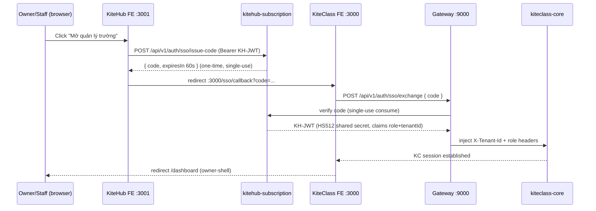

# ADR-040: Cross-Product SSO KiteHub → KiteClass

**Status:** ACCEPTED — Wave RBAC-Shell 1 Bucket C (design-first); Option A đã triển khai Wave RBAC-SSO 1 (GAP-1138, 2026-06-14). `kitehub-subscription` ship `SsoCodeService` (Redis one-time code, TTL ≤60s, single-use GETDEL) + `SsoController` (`POST /api/v1/auth/sso/issue-code` + `/exchange`); `kitehub-frontend` nút "Mở quản lý trường" (dashboard); `kiteclass-frontend` route `/sso/callback`. Runtime G2 walk (human, production-parity) còn pending per `feature-ship-runtime-walk-mandate.md` §3.

## Context

Theo quyết định GAP-1119 (Wave RBAC-Shell 1):

- **OWNER / STAFF** đăng nhập ở **KiteHub** (`kitehub-subscription` `/api/v1/auth/**`, FE `:3001`) — họ KHÔNG nằm trong `auth_credentials` của KiteClass.
- **TEACHER / PARENT / STUDENT** đăng nhập thẳng **KiteClass** (`/api/v1/tenant-auth/login`, FE `:3000`, Option B — đã working PR #2186).

Nhưng quản lý nghiệp vụ trường (course/class, payroll, billing, role-assign) nằm ở **KiteClass owner-shell** (`:3000`). Vậy owner/staff sau khi login KH `:3001` cần vào được KC `:3000` **không phải đăng nhập lại** — đây là cross-product SSO (Risk #1 HIGH của wave).

### State-check (đã verify code 2026-06-10)

- Gateway `kitehub-gateway` `TenantHeaderGuardFilter` validate **HS512 JWT** bằng `JWT_SECRET`, comment ghi rõ *"Must match the JWT_SECRET configured in kitehub-subscription so issued [tokens]"*. → Token owner/staff do kitehub-subscription mint **đã gateway-compatible**: gateway verify chữ ký + inject tenant headers (`X-Tenant-Id`, role) cho downstream.
- Precedent **ADR-039** (ACCEPTED) — *Cross-Service Subscription Tier Propagation: JWT tier claim + gateway trusted-header inject (anti-spoof)*: cùng pattern, đã chấp nhận.
- KiteClass FE **chưa có** route `/sso/callback`.

→ **Phần khó KHÔNG phải validation** (đã thống nhất qua gateway shared secret) — phần khó là **chuyển token cross-origin** từ KH `:3001` sang KC `:3000` (khác origin → không share `localStorage`).

## Decision

**Token validation:** giữ nguyên — JWT KH-minted ký HS512 bằng `JWT_SECRET` dùng chung; gateway verify + inject headers (như ADR-039). KHÔNG mint key riêng cho KC.

**Token transport (phần mới):** dùng **redirect-with-one-time-code** (Option A dưới đây). KH redirect owner/staff sang KC `/sso/callback?code=<one-time-code>`; KC đổi code lấy session. KHÔNG đặt JWT thô trên URL (tránh leak qua history/referer/log) — chỉ truyền **one-time exchange code** ngắn hạn (TTL ≤60s, single-use).

## Options considered

### Option A — Redirect + one-time exchange code (KHUYẾN NGHỊ)

- **Pros:** chạy cả dev (localhost khác port) lẫn prod (subdomain khác); không phụ thuộc shared cookie domain; JWT thô không lộ trên URL; single-use code chống replay.
- **Cons:** cần 1 store ngắn hạn cho one-time code (Redis TTL); thêm 2 endpoint (issue-code + exchange) + 1 route FE.

> **Reconcile endpoint path (2026-06-14, GAP-1138 shipped):** sơ đồ trên dùng `POST /api/v1/auth/sso/exchange` — đúng với `SsoController` đã ship trong `kitehub-subscription` (`@RequestMapping("/api/v1/auth/sso")`). Bản nháp design ban đầu ghi `tenant-auth/sso/exchange` (giả định KiteClass owns endpoint); thực tế cả `issue-code` lẫn `exchange` đều thuộc namespace `kitehub-subscription` (auth surface đã whitelist `/api/v1/auth/**`), KHÔNG phải `kiteclass-core` tenant-auth. Đã sửa sơ đồ cho khớp impl.

### Option B — Shared parent-domain HttpOnly cookie

- Cả `:3001` và `:3000` đặt cookie trên parent domain `.kitehub.me` (prod) → browser tự gửi kèm.
- **Pros:** không cần redirect/exchange; đơn giản ở prod.
- **Cons:** **KHÔNG chạy ở dev** (localhost `:3001` vs `:3000` khác origin, không share cookie tin cậy); coupling chặt vào cấu trúc subdomain prod; CSRF surface rộng hơn; khó test local-parity (vi phạm production-accurate local sim).

→ Chọn **A** vì test được local (dev+prod parity) + an toàn hơn (one-time code thay vì cookie ambient).

## Quyết định scope — SPLIT sang wave riêng

Per wave plan `wave-rbac-shell-1.md` §7 Risk: *"Nếu SSO complexity > 1 bucket → split sang dedicated wave; Bucket B owner/staff shell tạm dùng KC-native fallback login cho beta."*

Bucket C **không** implement trong wave này vì chạm **4 surface + security-sensitive**:
1. `kitehub-frontend` :3001 — nút "Mở quản lý trường" + redirect.
2. `kitehub-subscription` — endpoint `issue-code` + one-time-code store (Redis TTL) + `exchange` (consume).
3. `kiteclass-frontend` :3000 — route `/sso/callback` + exchange call.
4. `kiteclass-core` / gateway — nhận KH-JWT qua gateway header inject → establish KC session.

Cộng security review (one-time-code TTL/single-use/replay, token-in-URL avoidance, CSRF). → **> 1 bucket** → tách wave riêng `wave-rbac-sso-1` (theo dõi qua **GAP-1138**).

**Beta unblock (wording reconciled 2026-06-12):** Bucket B (4-role shell) cho owner/staff dùng **dual-path login fallback tại KC FE `:3000`** — KHÔNG phải `/api/v1/tenant-auth` (BR-AUTH-002 cấm OWNER/STAFF trong `auth_credentials`). Implementation thật (`kiteclass-frontend/src/lib/api/auth.ts` `authApi.login`, shipped Bucket A #2290):

1. Thử KC-native `POST /api/v1/tenant-auth/login` (TEACHER/PARENT/STUDENT — credential `auth_credentials` KC).
2. 401 → fall through sang **KH `POST /api/auth/login`** (OWNER/STAFF — credential bảng `users` KiteHub, cùng mật khẩu họ dùng ở `:3001`).

Token KH-minted ký HS512 cùng `JWT_SECRET` → gateway validate + inject headers → KC core chấp nhận như mọi request. Owner/staff vì vậy **login được tại `:3000` bằng credential KH** (re-enter password) — chấp nhận được cho beta. SSO redirect one-time-code (GAP-1138) vẫn là target: bỏ bước re-enter password khi điều hướng từ `:3001` sang `:3000`. KHÔNG chặn LMS-FE (LMS dùng teacher/student login KC-native).

**Credential matrix (canonical — reconcile với `documents/01-business/kiteclass/tenant-auth/rules.md` BR-AUTH-002):**

| Role | Credential store | Login surface | Mật khẩu set bởi |
|---|---|---|---|
| OWNER | KH `users` (kitehub DB) | KH `:3001` `/api/auth/login` HOẶC KC `:3000` dual-path fallback (cùng credential) | Beta signup / invite accept |
| STAFF | KH `users` | như OWNER | StaffInvitation email → tự set |
| TEACHER | KC `auth_credentials` (V89) | KC `:3000` `/api/v1/tenant-auth/login` | Owner admin-set-password (email-invite self-serve = GAP-1124) |
| PARENT | KC `auth_credentials` | KC `:3000` tenant-auth | Invite redeem (KC-8) |
| STUDENT | KC `auth_credentials` | KC `:3000` tenant-auth (gated KC-9) | Phase 2 (GAP-725 Hướng C) |

## Consequences

- ✅ Validation tái dùng hạ tầng có sẵn (gateway HS512 shared secret + ADR-039 pattern) — không phát sinh key management mới.
- ✅ LMS-FE (Phase 3) không bị chặn bởi SSO — không phụ thuộc owner/staff cross-product login.
- ⚠️ Owner/staff beta tạm login KC-native (fallback) cho tới khi `wave-rbac-sso-1` ship.
- ⚠️ Cần Redis (đã có trong stack `kite-redis`) cho one-time-code store.

## References

- Wave plan: `documents/03-planning/waves/wave-rbac-shell-1.md` §1 Risk #1 + §2 Bucket C + §7
- ADR-039 — Cross-Service Subscription Tier Propagation (precedent: JWT claim + gateway inject)
- GAP-604 — gateway JWT to headers propagation (DONE)
- `kitehub/kitehub-gateway/.../filter/TenantHeaderGuardFilter.java` (HS512 shared-secret validation)
- GAP-1138 — SSO KH→KC implementation (dedicated wave, OPEN)
