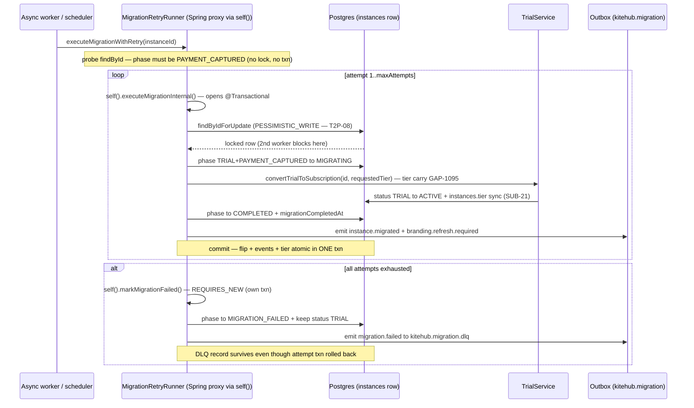

# ADR-042: Trial→Paid Migration Atomicity

**Status:** ACCEPTED
**Date:** 2026-06-13
**Deciders:** @nguyenvankiet (solo-dev — acting architect)
**Reviewers:** @nguyenvankiet (solo-dev — concurrency + transaction angle)
**Related Gap(s):** GAP-1253 (T2P-08 pessimistic lock thiếu), GAP-1254 (`@Transactional` inert do self-invocation → double-convert), GAP-1095 (tier carry qua migration), GAP-1271 (idempotency persist race), GAP-1256 (rollback tier desync), GAP-1272, GAP-192 (state machine gốc)

## Context

Migration TRIAL→ACTIVE (`TrialToPaidService` + `MigrationRetryRunner`, GAP-192 state machine) là multi-step: `INITIATED → PAYMENT_PENDING → PAYMENT_CAPTURED → MIGRATING → COMPLETED`, có retry (T2P-09: 3 lần, backoff 1/3/9s) + dead-letter (T2P-10). Audit BE-2 phát hiện 4 lỗi atomicity nghiêm trọng trong implementation gốc:

1. **GAP-1253 — không khóa instance khi migrating (T2P-08).** `loadInstance` dùng `findById` (no lock). Hai worker (scheduler + webhook) cùng pick một instance ở `PAYMENT_CAPTURED` → cả hai flip TRIAL→ACTIVE → double-convert (tạo 2 subscription row).

2. **GAP-1254 — `@Transactional` INERT do self-invocation.** `MigrationRetryRunner` được `new`-instantiate bởi `TrialToPaidService` (không phải Spring bean) và per-attempt methods gọi qua `this.executeMigrationInternal(...)`. Không có Spring proxy trong call path → annotation `@Transactional` **không tạo transaction boundary** → mỗi per-attempt write auto-commit riêng lẻ → một attempt fail nửa chừng để lại state nửa-vời (phase MIGRATING + DB write partial), không rollback.

3. **GAP-1095 — tier không carry qua migration.** Flip TRIAL→ACTIVE để `instances.tier` ở FREE (trial tier) thay vì tier paid requested.

4. **GAP-1271 — idempotency persist race.** Idempotency key persist ngoài txn của migration → có thể commit key mà migration rollback (hoặc ngược lại).

**Ràng buộc:** MVP Phase 4a sync worker (single instance, low concurrency) nhưng phải đúng atomicity vì payment thật + zero double-convert SLA.

## Decision

**Bốn cơ chế atomicity ship đồng thời trong BE-2:**

### 1. Pessimistic write lock (GAP-1253, T2P-08)
Mọi mutating load dùng `InstanceRepository.findByIdForUpdate` (`@Lock(PESSIMISTIC_WRITE)`) thay `findById`. Worker thứ hai block đến khi worker thứ nhất commit → đọc phase đã là `MIGRATING`/`COMPLETED` → guard `if (phase != PAYMENT_CAPTURED) throw INVALID_PHASE_TRANSITION` chặn double-convert. Read-only probe (precondition check đầu loop) vẫn dùng `findById` (no lock, không cần txn).

### 2. `MigrationRetryRunner` là Spring `@Component` + self-reference qua `ObjectProvider` (GAP-1254)
Chuyển từ `new`-instantiate sang `@Component`. Retry loop gọi per-attempt methods qua `self().executeMigrationInternal(...)` — `self()` trả `selfProvider.getObject()` (Spring-proxied bean) thay vì `this`. Proxy áp `@Transactional` boundary thật → mỗi attempt chạy trong một transaction; fail → rollback atomic; per-attempt methods phải `public` để proxy intercept.

### 3. `markMigrationFailed` chạy `REQUIRES_NEW` (T2P-10 DLQ survives rollback)
Terminal-failure marking (phase `MIGRATION_FAILED` + DLQ event `kitehub.migration.dlq`) chạy trong txn riêng (`Propagation.REQUIRES_NEW`) — theo nguyên tắc audit-service-isolation: bản ghi best-effort failure KHÔNG được mất khi txn của attempt fail rollback. Loop sở hữu quyết định "đã exhausted", gọi `self().markMigrationFailed(...)` để proxy áp new-txn boundary.

### 4. FM-5 double-convert guard + idempotency persist same-txn (GAP-1271/1272)
- **FM-5:** `resetToPaymentCapturedForRetry` kiểm tra `if (status == ACTIVE) return` — nếu attempt trước đã convert thành công (conversion OK nhưng step sau throw), KHÔNG reset/re-convert (flip TRIAL→ACTIVE không idempotent).
- **Idempotency:** `MigrationIdempotencyKeyService.persist` chạy trong cùng txn `initiateUpgrade` → key + migration row commit-hoặc-rollback cùng nhau; `persist` catch `DataIntegrityViolation` (concurrent-create race) → cached replay; `findExisting` short-circuit duplicate request ≤10 phút (`kitehub.trial-to-paid.idempotency.ttl-minutes:10`) trả lại 202 envelope gốc.
- **Tier carry (GAP-1095):** `trialService.convertTrialToSubscription(instanceId, instance.getTier())` mang tier requested (persist trên instance lúc `initiateUpgrade`) vào flip → `instances.tier` sync qua điểm SUB-21 ([ADR-041](ADR-041-instance-tier-sync-centralization.md)).

### Atomic-flip sequence

## Consequences

### Positive
- **Zero double-convert** — pessimistic lock serialize concurrent worker; FM-5 guard chặn re-convert sau partial-success.
- **Atomic per-attempt** — proxy-applied `@Transactional` đảm bảo flip+events+tier commit-hoặc-rollback cùng nhau; không còn state nửa-vời.
- **DLQ không mất** — `REQUIRES_NEW` cho `markMigrationFailed` → ops luôn được alert dù attempt rollback.
- **Idempotent upgrade** — duplicate request ≤10min trả 202 gốc; concurrent-create race resolve qua DataIntegrityViolation catch.
- **Tier đúng sau migration** — GAP-1095 carry qua điểm SUB-21.

### Negative
- **Pessimistic lock = contention** — worker thứ hai block (chấp nhận: migration hiếm + ngắn; MVP single-worker). Nếu scale nhiều worker → cân nhắc advisory lock / queue partition.
- **Self-injection phức tạp hơn `new`** — `ObjectProvider<MigrationRetryRunner>` self-reference khó hiểu với người mới; javadoc giải thích kỹ tại sao (GAP-1254).
- **`public` per-attempt methods** — bắt buộc cho proxy intercept; phá encapsulation nhẹ (không `protected/private` được).

### Neutral
- Backoff dùng `Thread.sleep` in-thread — acceptable cho MVP single-worker; Resilience4j/Spring Retry có thể drop-in sau mà không đổi surface.
- HTTP contract (`POST /instances/{id}/upgrade` 202 async, `idempotencyKey` 10-min TTL) KHÔNG đổi — chỉ internal atomicity thay đổi.

## Alternatives Considered

### Alternative A: Optimistic lock (`@Version`) thay pessimistic
- Pros: không block; retry-on-conflict.
- Cons: conflict → exception → cần retry-loop bọc thêm; với flip không-idempotent (tạo subscription row) optimistic conflict-retry rủi ro double-side-effect. Pessimistic đơn giản + đúng cho thao tác hiếm.
- **Rejected:** thao tác migration hiếm + ngắn → block cost thấp; pessimistic loại double-convert sạch hơn.

### Alternative B: Giữ `new`-instantiate, gọi qua một `TransactionTemplate` thủ công
- Pros: không cần self-injection.
- Cons: `TransactionTemplate` boilerplate mỗi method + dễ quên; self-injection idiom chuẩn Spring cho self-invocation transactional.
- **Rejected:** self-injection qua `ObjectProvider` là pattern Spring chính thống, ít boilerplate hơn.

## Implementation Notes

- **Code:** `MigrationRetryRunner` (`@Component`, `self()` via `ObjectProvider`, `findByIdForUpdate`, `markMigrationFailed` REQUIRES_NEW, FM-5 guard); `TrialToPaidService` (facade — `initiateUpgrade`/`handlePaymentCaptured`/`rollback`/`forceConvert`); `MigrationIdempotencyKeyService` (`persist` same-txn + `findExisting`); `InstanceRepository.findByIdForUpdate`.
- **Config:** `kitehub.trial-to-paid.{retry.attempts:3, retry.backoff:[1,3,9], idempotency.ttl-minutes:10}`.
- **Rollback (decision):** revert pessimistic→findById + `@Component`→`new` chỉ khi xác nhận single-worker tuyệt đối — không khuyến nghị.
- **Test:** `MigrationRetryRunnerTest`, `TrialToPaidServiceTest`, `TrialToPaidServiceRetryTest` (BE-2 swept + green).

## References

- State machine + outbox: [`trial-to-paid-migration/rules.md`](../../01-business/kitehub/trial-to-paid-migration/rules.md) §3 (MigrationPhase) + §5 (Outbox) + T2P-08/09/10
- Use cases: [`trial-to-paid-migration/use-cases.md`](../../01-business/kitehub/trial-to-paid-migration/use-cases.md) UC-T2P-01/02/03
- Tier carry sync point: [ADR-041](ADR-041-instance-tier-sync-centralization.md)
- Async-jobs pattern: [ADR-014](ADR-014-async-jobs-queue-over-batch.md) + [ADR-007](ADR-007-outbox-pattern-for-events.md)
- Design pattern: `.claude/rules/design-patterns.md` §3.5 Outbox + §3.11 audit-service-isolation (REQUIRES_NEW precedent)
- Related gaps: GAP-1253/1254/1095/1271/1272/1256/192

## Log

- 2026-06-13 — Initial proposal + ACCEPTED same day (solo-dev). Documents migration atomicity hardening shipped wave kitehub-biz-100 BE-2 (commit `5911dce55`). Reviewer: @nguyenvankiet (solo-dev acting architect + concurrency scout).
