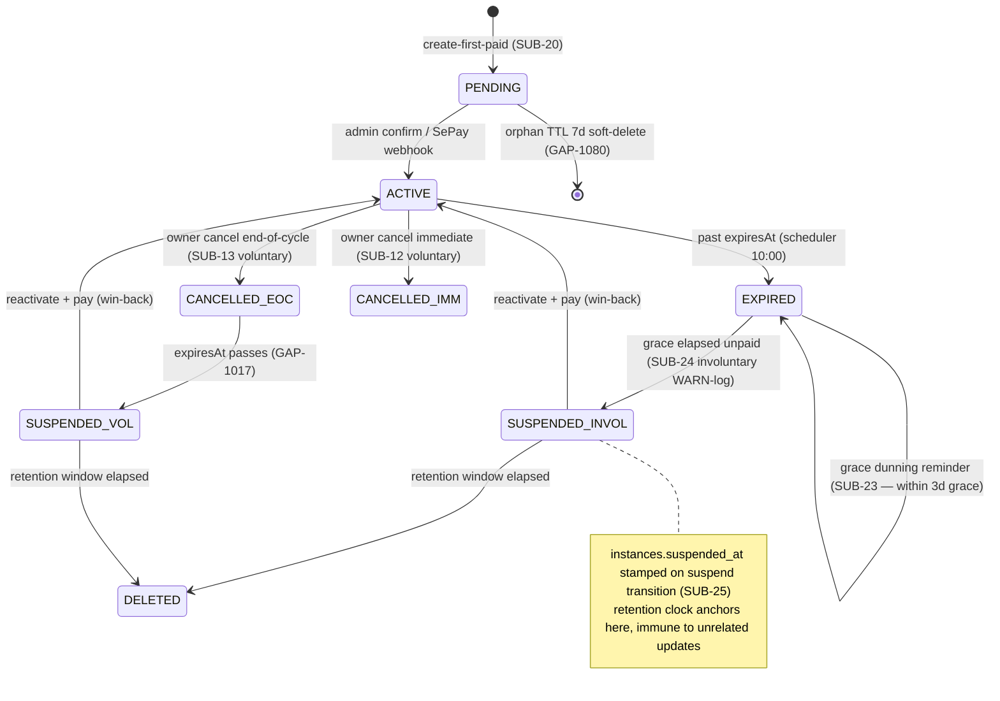
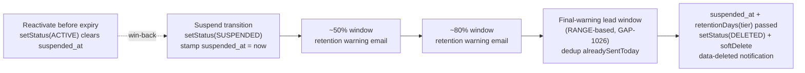

# ADR-043: Manual-VietQR Dunning + Involuntary-Churn Lifecycle (SUB-23/24/25)

**Status:** ACCEPTED
**Date:** 2026-06-13
**Deciders:** @nguyenvankiet (solo-dev — acting Product Owner + architect)
**Reviewers:** @nguyenvankiet (solo-dev — PDPL/compliance angle); pricing/lifecycle business sign-off queued GAP-156
**Related Gap(s):** GAP-1259 (pending-payment TTL + grace dunning), GAP-1260 (involuntary-churn auto-suspend), GAP-1264 (suspended_at retention determinism), GAP-1080 (orphan PENDING subscription sweep), GAP-1017 (cancel end-of-cycle suspend)

## Context

Phase 1 BETA billing dùng **chuyển khoản thủ công/VietQR + SePay webhook** (per [`subscription-billing/rules.md`](../../01-business/kitehub/subscription-billing/rules.md) SUB-11/19) — KHÔNG có PSP auto-renew card capture. Mô hình này sinh các trạng thái lifecycle không có ở SaaS card-on-file thông thường, và audit BE-1/BE-3 surface 4 lỗ hổng:

1. **Pending payment treo vô hạn (SUB-23).** Owner tạo upgrade/create → `Payment PENDING` + `subscription.pendingPaymentId`. Nếu owner không bao giờ chuyển khoản, `pendingPaymentId` pin mãi mãi → `SubscriptionService` không tạo payment mới khi đang có pending → block mọi renewal/upgrade attempt mới.

2. **Không có dunning trong grace window (SUB-23).** Subscription ACTIVE hết hạn → EXPIRED, qua 3 ngày grace (SUB-04) thì suspend. Trong grace window pre-rule: không gửi nhắc nhở nào → owner mất trung tâm im lặng.

3. **Involuntary churn không phân biệt voluntary cancel (SUB-24).** Suspend do hết-grace-chưa-trả (involuntary churn) vs owner chủ động cancel (SUB-12/13 voluntary) bị gộp chung → không phân tích được retention metric, không win-back đúng đối tượng.

4. **Retention clock non-deterministic (SUB-25).** `DataRetentionService` tính window từ `updated_at` → một row-update không liên quan reset clock → vi phạm xác định PDPL.

**Ràng buộc:** `PaymentStatus` CHECK chỉ cho `PENDING/COMPLETED/FAILED/REFUNDED/CANCELLED` — KHÔNG có `EXPIRED`. Solo-dev — ưu tiên scheduler đơn giản, không thêm bảng mới khi tránh được.

## Decision

**Bốn cơ chế lifecycle, scheduler-driven, ship trong BE-1/BE-3:**

### 1. Pending-payment TTL → FAILED + release (SUB-23, GAP-1259)
`SubscriptionExpirationChecker.processStalePendingPayments` (daily 10:30) — `Payment PENDING` quá `kitehub.subscription.pending-payment-ttl-days: 7` → `payment.fail()` (PaymentStatus không có EXPIRED → **FAILED = timeout documented**) + clear `subscription.pendingPaymentId` để attempt mới sạch. Song song `processOrphanPendingSubscriptions` (10:45) sweep PENDING subscription chưa-activate quá `orphan-pending-subscription-ttl-days: 7` → soft-delete (instance chưa activate → không chạm tenant data, GAP-1080).

### 2. Grace-window dunning reminder (SUB-23, GAP-1259)
`processExpiredSubscriptions` (daily 10:00) — subscription EXPIRED còn trong grace window (SUB-04): emit dunning reminder "còn X ngày trước suspend" (reuse `renewal-reminder` email — BE-4 sở hữu template, không tạo template mới). `EmailServiceClient.alreadySentToday()` dedup mỗi ngày.

### 3. Involuntary-churn auto-suspend, phân biệt voluntary (SUB-24, GAP-1260)
Hết grace mà chưa trả → `SubscriptionRenewalService.suspendExpiredSubscription` auto-suspend + **WARN-log classification** (involuntary). Cancel end-of-cycle (`immediate=false`) hết hạn → `suspendCancelledExpired` (GAP-1017, voluntary). **Phase 1: chỉ WARN-log phân loại** — cột queryable `subscriptions.churn_type` (VOLUNTARY/INVOLUNTARY) **DEFERRED Phase 1.5** (set-points nằm cross-owner ở `SubscriptionRenewalService` + `SubscriptionService` → cần wave riêng wire atomic; reserved migration V74).

### 4. `suspended_at` = mốc deterministic retention clock (SUB-25, GAP-1264)
Suspend (mọi đường: trial / involuntary / cancel) stamp `instances.suspended_at` qua `Instance.setStatus()` (xem [ADR-041](ADR-041-instance-tier-sync-centralization.md)). `DataRetentionService.retentionClockStart()` đọc `suspended_at` (fallback `updated_at` chỉ legacy pre-V73). Retention window per tier; final-warning RANGE-based (GAP-1026 — không exact `==1 day`, robust với cron downtime/DST), dedup `alreadySentToday`.

### Subscription lifecycle + dunning + involuntary-churn state machine

### suspended_at retention-clock timeline

## Consequences

### Positive
- **Pending không treo** — TTL → FAILED + release; owner luôn tạo được attempt mới.
- **Dunning trong grace** — owner được nhắc trước suspend (reduce involuntary churn).
- **Churn phân loại** — WARN-log tách voluntary/involuntary cho retention analysis + win-back đúng đối tượng (seam cho [ADR-044](ADR-044-owner-notification-channel-abstraction.md) sendWinBack).
- **Retention deterministic (PDPL)** — clock từ `suspended_at`, immune row-update; final-warning robust với cron downtime.

### Negative
- **`churn_type` chưa queryable (Phase 1)** — chỉ WARN-log; phân tích churn cần grep log đến khi V74 wire cột (Phase 1.5). Mitigate: SUB-24 ghi rõ deferral + reserved migration.
- **FAILED = timeout overload semantic** — payment timed-out ghi FAILED (vì không có EXPIRED enum) → cần đọc context (created-time + TTL) để phân biệt "fail thật" vs "timeout". Mitigate: documented trong SUB-23 + log message rõ.
- **Scheduler-driven, không real-time** — TTL/dunning/suspend chạy theo cron daily → trễ tối đa ~1 ngày. Chấp nhận cho beta volume nhỏ.

### Neutral
- Reuse `renewal-reminder` email cho dunning (không template mới) — BE-4 owns templates.
- 4 scheduler jobs daily (9:00 reminder / 10:00 expire+dunning+suspend / 10:30 pending-TTL / 10:45 orphan-sweep) — staggered tránh chồng.

## Alternatives Considered

### Alternative A: Thêm `PaymentStatus.EXPIRED` enum + migration CHECK
- Pros: semantic rõ (timeout ≠ fail).
- Cons: đổi CHECK constraint + mọi consumer của PaymentStatus + FE union; scope lớn cho lợi ích ngữ nghĩa. FAILED + log đủ phân biệt Phase 1.
- **Rejected:** scope/risk vượt lợi ích; revisit khi PSP auto-capture (Phase 2).

### Alternative B: Ship `churn_type` queryable column ngay BE-1
- Pros: phân tích churn ngay.
- Cons: set-points cross-owner (`SubscriptionRenewalService` + `SubscriptionService`) → wire atomic cần wave riêng để tránh half-set drift; vội ship = risk cùng class GAP-1256.
- **Rejected → DEFERRED Phase 1.5:** WARN-log đủ cho beta; column wire đúng cần dedicated wave (reserved V74).

### Alternative C: Real-time event-driven suspend (broker) thay scheduler
- Pros: suspend tức thì khi grace hết.
- Cons: cần scheduled-event infrastructure (delayed message / TTL queue); scheduler daily đủ cho beta SLA.
- **Rejected:** over-engineering cho volume Phase 1.

## Implementation Notes

- **Code:** `SubscriptionExpirationChecker` (4 cron jobs); `SubscriptionRenewalService.{suspendExpiredSubscription, suspendCancelledExpired}`; `DataRetentionService.{processRetentionWarnings, processExpiredRetention, retentionClockStart}`; `Instance.setStatus()` stamp suspended_at.
- **Config:** `kitehub.subscription.{grace-period-days:3, pending-payment-ttl-days:7, orphan-pending-subscription-ttl-days:7}`; `kitehub.data-retention.{free, finalWarningLeadDays}`.
- **Migration:** V73 `suspended_at`; V74 reserved cho `churn_type` (Phase 1.5).
- **Rollback:** disable cron jobs (no data loss — sweep idempotent).
- **Monitoring:** log counters (markedExpired / suspended / graceReminders / pending-expired / orphan-cleaned).

## References

- Rules canonical: [`subscription-billing/rules.md`](../../01-business/kitehub/subscription-billing/rules.md) SUB-23/24/25 + SUB-04 grace
- Use cases: [`subscription-billing/use-cases.md`](../../01-business/kitehub/subscription-billing/use-cases.md) UC-SUB-06 (scheduler) + dunning/churn/win-back flows
- suspended_at stamping: [ADR-041](ADR-041-instance-tier-sync-centralization.md) §2
- Win-back notification + reactivate: [ADR-044](ADR-044-owner-notification-channel-abstraction.md)
- Data retention classification: [ADR-013](ADR-013-data-retention-classification.md)
- Design pattern: `.claude/rules/design-patterns.md` §3.11 (best-effort email isolation)
- Related gaps: GAP-1259/1260/1264/1080/1017/1026

## Log

- 2026-06-13 — Initial proposal + ACCEPTED same day (solo-dev). Documents manual-VietQR dunning + involuntary-churn + retention-clock lifecycle shipped wave kitehub-biz-100 BE-1/BE-3 (commits `85dae29f0`, `74673b23e`). `churn_type` queryable column DEFERRED Phase 1.5. Business-value sign-off (pricing/grace/retention windows) queued GAP-156 per `business-logic-review.md` §2.3. Reviewer: @nguyenvankiet (solo-dev acting PO + PDPL scout).
