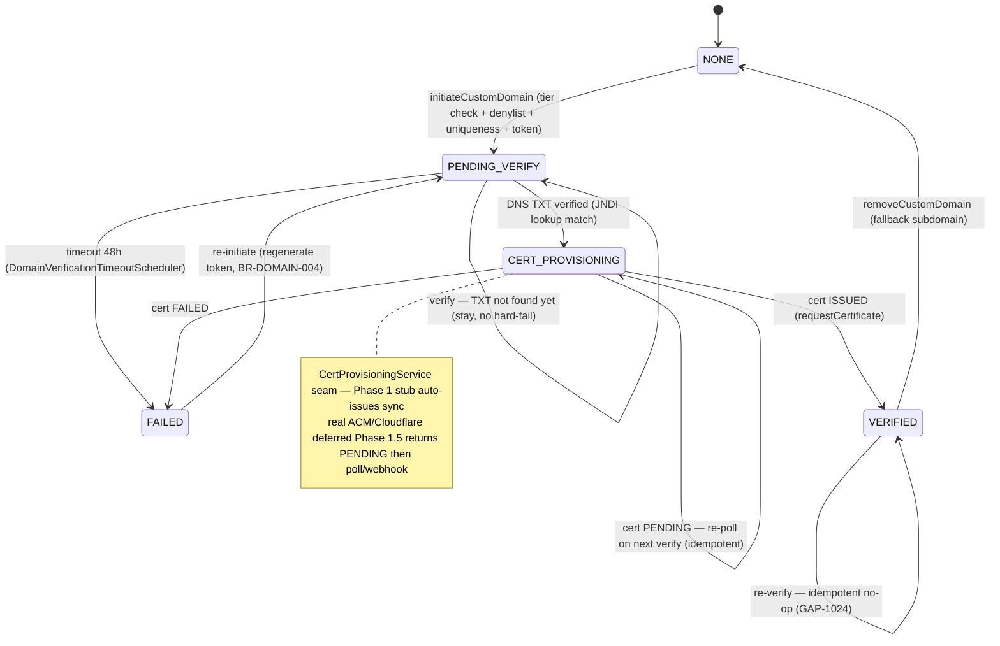

# ADR-045: Custom-Domain Verification State Machine + Cert-Provisioning Seam

**Status:** ACCEPTED
**Date:** 2026-06-13
**Deciders:** @nguyenvankiet (solo-dev — acting architect)
**Reviewers:** @nguyenvankiet (solo-dev — security/multi-tenant angle)
**Related Gap(s):** GAP-1024 (state machine completion — CERT_PROVISIONING + idempotent re-verify), GAP-812 (custom-domain DNS/SSL completion), KH-7 FM-5 (platform-domain claim guard)
**Related:** [ADR-018](ADR-018-domain-registrar-dns.md) (DNS provider / SSL strategy)

## Context

Custom Domain feature (PREMIUM/ENTERPRISE) cho phép tenant gắn domain riêng (vd `lop.skyedu.vn`) thay vì chỉ subdomain `{slug}.kitehub.me` (backup URL luôn song song). Implementation gốc (Wave tenant-domain-1) có state machine `NONE → PENDING_VERIFY → VERIFIED` nhưng audit BE-5 phát hiện 3 thiếu sót:

1. **State machine thiếu CERT_PROVISIONING (GAP-1024).** DNS TXT verified ≠ "domain thực sự serving" — cần cert TLS issued. State machine cũ flip thẳng VERIFIED sau DNS match, bỏ qua giai đoạn cấp cert.

2. **Re-verify không idempotent.** Re-verify một domain đã VERIFIED → throw 400; re-verify CERT_PROVISIONING → không re-poll. UI polling badge → lỗi giả.

3. **Tenant claim được platform domain.** Không có denylist → tenant có thể `initiateCustomDomain("kitehub.me")` → hijack platform apex (KH-7 FM-5).

**Ràng buộc:** Real cert authority (AWS ACM / Cloudflare-for-SaaS) là vendor dependency Phase 1.5+ (BR-DOMAIN-008, ADR-018) — không thể call thật ở local/Phase 1 BETA. Nhưng state machine cần reach VERIFIED local để dev/test flow.

## Decision

**State machine 5-trạng-thái với cert-provisioning là async seam (Strategy/Adapter), idempotent re-verify, platform-domain denylist:**

### 1. State machine `NONE → PENDING_VERIFY → CERT_PROVISIONING → VERIFIED` (+ FAILED) (BR-DOMAIN-002)

`Instance.DomainStatus` enum: `NONE, PENDING_VERIFY, CERT_PROVISIONING, VERIFIED, FAILED`. FAILED reachable từ mọi non-terminal state; re-initiate (regenerate token) reset FAILED → PENDING_VERIFY (BR-DOMAIN-004). Timeout scheduler `DomainVerificationTimeoutScheduler` flip PENDING_VERIFY → FAILED sau `timeout-hours: 48` (BR-DOMAIN-003).

### 2. `CertProvisioningService` interface = async cert seam (Strategy/Adapter)
Interface `CertProvisioningResult requestCertificate(String domain)` → `ISSUED` (→ VERIFIED + `domainVerifiedAt`), `PENDING` (→ stay CERT_PROVISIONING, re-poll), `FAILED` (→ FAILED). Implementations MUST idempotent (verify flow re-invoke khi re-poll). Per `design-patterns.md` §2 (multiple impl, swap via config).

- **Phase 1 BETA:** `StubCertProvisioningService` — auto-issue đồng bộ → state machine reach VERIFIED local không cần cert authority thật.
- **Phase 1.5+:** real `AwsAcmCertProvisioningService` / `CloudflareCertProvisioningService` — `requestCertificate` trả PENDING, poll/webhook flip CERT_PROVISIONING → VERIFIED out-of-band (BR-DOMAIN-008, ADR-018).

### 3. Idempotent re-verify (GAP-1024)
`verifyCustomDomain`: VERIFIED → no-op return current (HTTP 200); CERT_PROVISIONING → re-poll `provisionCertAndAdvance` (no DNS re-check); PENDING_VERIFY → DNS TXT lookup (JNDI, `DnsTxtLookupService`), match → CERT_PROVISIONING + request cert; mock-mode unresolved → stay PENDING (timeout job FAIL). NONE/FAILED → IllegalArgumentException (use initiate để re-start).

### 4. Platform-domain claim denylist (KH-7 FM-5)
`RESERVED_DOMAINS` denylist (`kitehub.me`, `kiteclass.me`, ... + subdomain) → `initiateCustomDomain` reject nếu tenant claim platform apex/subdomain. Per-resource authz `@PreAuthorize` ownership check (tenant chỉ set domain của instance mình).

## Consequences

### Positive
- **Cert-aware state machine** — domain chỉ VERIFIED khi cert thực sự issued; phản ánh đúng "đang serving HTTPS".
- **Vendor-swap không đổi state machine** — stub Phase 1 → real ACM/Cloudflare Phase 1.5 chỉ thay adapter, state machine + UI giữ nguyên (đúng Adapter pattern).
- **Idempotent re-verify** — UI poll badge an toàn (no 400 giả), CERT_PROVISIONING re-poll đúng.
- **Platform domain bảo vệ** — tenant không hijack được apex (KH-7 FM-5).
- **Backup URL luôn sống** — `{slug}.kitehub.me` serve song song trong lúc cert provision (BR-DOMAIN-007).

### Negative
- **Stub auto-issue ≠ real cert** — local "VERIFIED" không có cert thật; phải nhớ Phase 1.5 swap adapter trước khi onboard tenant custom-domain thật. Mitigate: javadoc + ADR-018 cross-ref + BR-DOMAIN-008.
- **Timeout scheduler poll-based** — PENDING_VERIFY → FAILED sau 48h theo scheduler (không real-time). Chấp nhận (DNS propagate vốn chậm).

### Neutral
- DNS TXT lookup qua JNDI (`DnsTxtLookupService`) — preferred `_kitehub-verify.{domain}`, fallback apex (BR-DOMAIN-005); mock-mode (dev default) DNS không resolvable → giữ PENDING.
- 4 HTTP endpoint (`POST /domain` initiate, `POST /domain/verify`, `DELETE /domain`, `GET /domain`) — không đổi shape, chỉ thêm CERT_PROVISIONING vào status enum.

## Alternatives Considered

### Alternative A: Flip thẳng VERIFIED sau DNS match (bỏ CERT_PROVISIONING)
- Pros: đơn giản, ít state.
- Cons: VERIFIED nhưng chưa có cert → domain không serve HTTPS thật → trạng thái nói dối. Real cert async (ACM ~vài phút, Cloudflare ~15min) cần state riêng để UI hiển thị "đang cấp cert".
- **Rejected:** CERT_PROVISIONING cần để biểu diễn async cert issuance đúng.

### Alternative B: Call ACM/Cloudflare thật ngay Phase 1 (no stub)
- Pros: cert thật ngay.
- Cons: vendor dependency (ACM account / Cloudflare-for-SaaS plan) + không test được local. Block dev flow.
- **Rejected → Phase 1.5:** stub cho phép state machine hoàn chỉnh local; real adapter swap-in khi vendor ready (BR-DOMAIN-008).

### Alternative C: Đặt cert provisioning trong DomainService (no interface)
- Pros: ít class.
- Cons: hard-code vendor → vi phạm Adapter; không swap stub↔real qua config; test phải mock cả DomainService.
- **Rejected:** interface seam là choke-point sạch cho swap + test.

## Implementation Notes

- **Code:** `DomainService` (state machine + idempotent verify + denylist); `CertProvisioningService` interface + `StubCertProvisioningService` + `CertProvisioningResult`; `DnsTxtLookupService` (JNDI); `DomainVerificationTimeoutScheduler` (48h timeout).
- **Config:** `kitehub.domain.verification.{timeout-hours:48, mock-mode}` (mock-mode=true dev/test, false production).
- **Phase 1.5 swap:** implement `CertProvisioningService` real adapter (ACM/Cloudflare) returns PENDING + poll/webhook; config-select bean.
- **Rollback:** stub adapter graceful; revert = remove CERT_PROVISIONING transition (not recommended — loses async cert state).
- **Tests:** `DomainServiceTest`, `DnsTxtLookupServiceTest`, `StubCertProvisioningServiceTest`.

## References

- Rules: [`custom-domain/rules.md`](../../01-business/kitehub/custom-domain/rules.md) BR-DOMAIN-001..012 + [`domain-management/rules.md`](../../01-business/kitehub/domain-management/rules.md) DOM-01..13
- Use cases: [`custom-domain/use-cases.md`](../../01-business/kitehub/custom-domain/use-cases.md) UC-DOMAIN-001..004
- API: [`custom-domain/api-contract.md`](../../01-business/kitehub/custom-domain/api-contract.md) (4 endpoints + DomainStatus enum)
- DNS/SSL strategy: [ADR-018](ADR-018-domain-registrar-dns.md) (Cloudflare for SaaS preferred + ACM fallback)
- Custom-domain eligibility (tier): [ADR-041](ADR-041-instance-tier-sync-centralization.md) (`instances.tier` mirror feeds `canUseCustomDomain()`)
- Design pattern: `.claude/rules/design-patterns.md` §2 (Strategy/Adapter) + §2 (State Machine)
- Related gaps: GAP-1024, GAP-812, KH-7 FM-5

## Log

- 2026-06-13 — Initial proposal + ACCEPTED same day (solo-dev). Documents custom-domain state machine completion (CERT_PROVISIONING + idempotent re-verify + cert seam + platform-domain denylist) shipped wave kitehub-biz-100 (commit `0dc40fee0`). Real ACM/Cloudflare adapter DEFERRED Phase 1.5 per BR-DOMAIN-008 + ADR-018. Reviewer: @nguyenvankiet (solo-dev acting architect + multi-tenant security scout).
