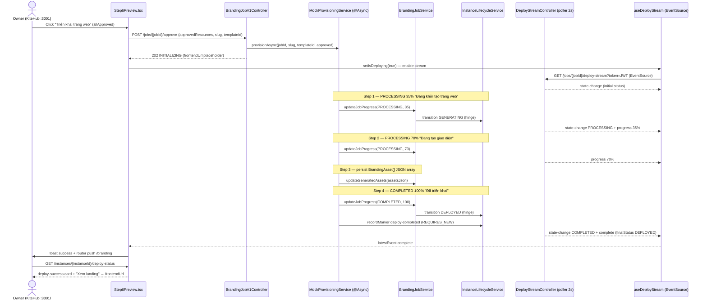
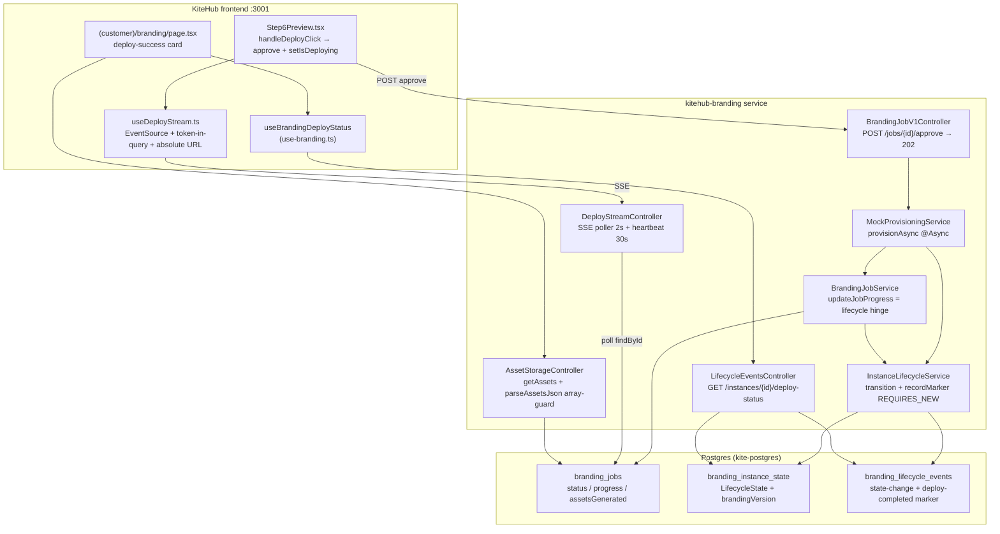
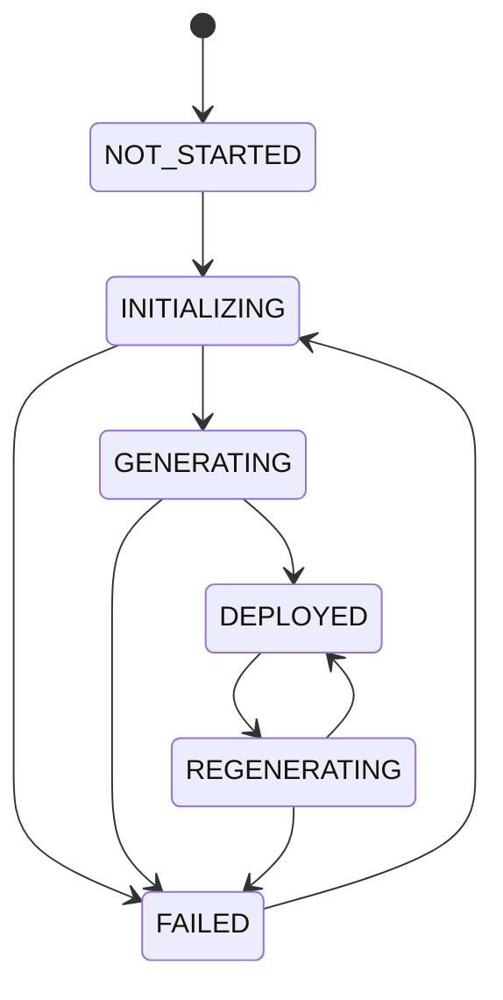

# AI Branding — Deploy SSE + Branding-Job Lifecycle

> **Phạm vi:** Tài liệu này mô tả luồng "deploy" của AI Branding wizard (KiteHub side) — từ lúc owner approve ở Step 6 cho tới khi instance đạt `DEPLOYED` và trang `/branding` hiển thị card thành công. Grounded 100% trên code hiện tại của branch `feature/tier-ui-fix-g2-browser-2026-06-09` (post GAP-1021 / GAP-1105 / GAP-1107 / GAP-1108). Mọi citation dạng `file:line` ở §8.

---

## 1. TL;DR + scope

Khi owner bấm "Triển khai trang web" ở **Step 6** của AI Branding wizard (KiteHub customer portal, `kitehub-frontend` `:3001`):

1. FE gọi `POST /api/v1/branding/jobs/{jobId}/approve` → BE trả `202` **ngay lập tức** rồi chạy provisioning ở thread riêng (`MockProvisioningService.provisionAsync`, `@Async`).
2. FE đồng thời mở **EventSource** tới `GET /api/v1/branding/jobs/{jobId}/deploy-stream` (SSE) để xem tiến trình live.
3. BE driver advance `BrandingJob.status` QUEUED → PROCESSING(35%) → PROCESSING(70%) → COMPLETED(100%), mỗi step delay ~2.2s. Một **scheduled poller 2s** trong `DeployStreamController` quan sát thay đổi status/progress và emit SSE event (`state-change` / `progress` / `complete`). **Heartbeat 30s** giữ stream sống.
4. Song song, mỗi lần job status đổi, `BrandingJobService.updateJobProgress` là **lifecycle hinge** đẩy instance state machine (ADR-004) GENERATING → DEPLOYED.
5. Khi xong, BE ghi mock asset (`assetsGenerated` = `BrandingAsset[]`) + một **lifecycle marker** `deploy-completed` chứa `frontendUrl` placeholder.
6. SSE event `complete` → FE toast success + `router push` về `/branding`.
7. Trang `/branding` gọi `GET /api/v1/branding/instances/{instanceId}/deploy-status` → render **deploy-success card** với link "Xem landing".

**Đây là Phase 1 MOCK** (GAP-1021): KHÔNG dựng per-tenant infra thật (DB / MinIO bucket / DNS subdomain — defer GAP-1055), `frontendUrl` chỉ là placeholder `https://{slug}.kiteclass.vn` (defer GAP-811 / GAP-1077 cho Host-based subdomain render). Phần "thật + persisted" là: job status progression, lifecycle state machine, mock asset JSON, deploy marker.

**Phân biệt KiteHub vs KiteClass** (per `kitehub-kiteclass-boundary.md`): wizard + deploy stream + deploy-status card đều thuộc **KiteHub** (`kitehub-branding` service + `kitehub-frontend` `:3001`). `frontendUrl` placeholder (`{slug}.kiteclass.vn`) trỏ tới landing **KiteClass** tenant (`:3000` / subdomain) — đó là sản phẩm output của deploy, KHÔNG phải nơi wizard chạy.

> ⚠️ **Discrepancy với outline gốc:** outline đề cập SSE endpoint là `GET /api/v1/branding/instances/{id}/deploy-stream`. Code **thực tế** keyed theo **jobId**: `GET /api/v1/branding/jobs/{jobId}/deploy-stream` (`DeployStreamController.java:47,81`). Chỉ endpoint **deploy-status** mới keyed theo instanceId (`/api/v1/branding/instances/{instanceId}/deploy-status`). Tài liệu này dùng đường dẫn thật.

---

## 2. End-to-end flow (sequence)

*Caption: Approve trả `202` ngay (fire-and-forget); provisioning chạy async và SSE poller 2s quan sát từng status/progress change. `updateJobProgress` là điểm hinge đẩy cả `BrandingJob.status` lẫn instance lifecycle. Marker `deploy-completed` (REQUIRES_NEW) carry `frontendUrl` cho card cuối. `progress 100%` được poller emit mỗi cycle khi `job.getProgress()` non-null — không vẽ riêng để giữ diagram gọn.*

---

## 3. Component map

*Caption: SSE poller đọc `branding_jobs` (status/progress) — KHÔNG đọc trực tiếp lifecycle table. Deploy-status endpoint mới đọc `branding_instance_state` (state + brandingVersion) + tìm marker `deploy-completed` trong `branding_lifecycle_events`. Asset hiển thị qua `AssetStorageController` đọc `assetsGenerated` của job.*

---

## 4. SSE mechanics

### 4.1 Endpoint + scheduling

| Khía cạnh | Giá trị | Citation |
|---|---|---|
| Endpoint | `GET /api/v1/branding/jobs/{jobId}/deploy-stream` (`text/event-stream`) | `DeployStreamController.java:47,81` |
| Poller | `@Scheduled fixedDelay` `kitehub.branding.deploy-stream.poll-ms:2000` (≈ **2s**) | `DeployStreamController.java:155` |
| Heartbeat | `@Scheduled fixedDelay` `kitehub.branding.deploy-stream.heartbeat-ms:30000` (≈ **30s**) | `DeployStreamController.java:201` |
| SSE timeout | `SSE_TIMEOUT_MS = 10 * 60 * 1000` (10 phút) | `DeployStreamController.java:53` |
| Backpressure cap | `max-emitters-per-job:20` per job (GAP-393-B) | `DeployStreamController.java:60,109` |

Poller là **v0 implementation** — javadoc ghi rõ khi `branding.deploy.*` RabbitMQ exchange được wire thì swap poller bằng queue listener, surface SSE emit giữ nguyên (`DeployStreamController.java:30-44,151-154`).

### 4.2 Event types emit từ BE

| Event name | Khi nào | Payload |
|---|---|---|
| `state-change` | Lúc subscribe (initial) + mỗi lần `job.getStatus()` đổi (poller) | `{from, to, ts}` (`:130-136,166-171`) |
| `progress` | Mỗi poller cycle khi `job.getProgress()` non-null | `{step, percent}` (`:174-178`) |
| `complete` | Job đạt `COMPLETED` (terminal) | `{jobId, finalStatus:"DEPLOYED", ts}` (`:230-235`) |
| `error` | Job `FAILED` → `{errorCode:"JOB_FAILED", message, retryable:true}`; job không tồn tại → `JOB_NOT_FOUND`; quá cap → `TOO_MANY_SUBSCRIBERS` | `:90-101,113-117,236-242` |
| `heartbeat` | Mỗi 30s, payload rỗng `{}` | `:202-208` |

> **Lưu ý:** javadoc liệt kê 6 event `log | progress | state-change | complete | error | heartbeat` (`:42-43`) nhưng controller **KHÔNG emit `log`** ở code hiện tại — chỉ 5 event còn lại. FE `EVENT_NAMES` vẫn đăng ký listener `log` (`useDeployStream.ts:26-33`) nhưng nó không bao giờ fire từ BE hiện nay (`Step6Preview.tsx:432-435` map `log` → message nếu có).

Cleanup hardening (GAP-393-B): khi `emitter.send` ném `IOException`/`IllegalStateException` (client gone / buffer full / đã complete), poller + heartbeat gọi `safeComplete` + `removeEmitter` để dead emitter không tích tụ và không trip cùng exception mỗi cycle (`:186-218,220-227`).

### 4.3 EventSource: token-in-query + absolute URL fix (GAP-1105)

`useDeployStream.ts` mở `EventSource` với 2 fix quan trọng:

1. **Token-in-query (GAP-1021 pt2):** browser `EventSource` KHÔNG set được header `Authorization`, nên JWT được truyền qua `?token=<encoded>` (`useDeployStream.ts:70-83`). Gateway `JwtAuthenticationGatewayFilter` accept token-in-query khi không có Bearer header và inject `X-User-*` headers downstream.

2. **Absolute-URL fix (GAP-1105 root cause):** `EventSource` resolve **relative** URL theo `window.location.origin` (frontend `:3001`), KHÔNG theo axios `baseURL`. URL tương đối → Next.js trả 404 → FE hiểu nhầm thành `STREAM_DISCONNECTED`. Fix: prepend gateway base `NEXT_PUBLIC_API_URL || 'http://localhost:9000'` vào path để SSE thực sự tới gateway `:9000` (`useDeployStream.ts:74-83`).

### 4.4 Hardening phía FE: completedRef + named-error suppression

`useDeployStream.ts` xử lý 2 false-positive "lỗi" của EventSource sau khi stream đã đóng đúng cách:

- **`completedRef` guard:** terminal event (`complete`/`error` từ server) đóng stream chủ động → ngay sau đó browser bắn native `error` trên socket close. `completedRef.current` set `true` khi nhận terminal → `onError` swallow im lặng thay vì surface `STREAM_DISCONNECTED` (`useDeployStream.ts:55-60,109-134`). Mock provision xong trong ~4s nên completion-race này là đường thường gặp.

- **Named-error suppression:** browser deliver native connection error vào cả listener đăng ký cho server event `error` — nhưng **không có `e.data`**. Event null-data đó từng render thành "Lỗi triển khai (UNKNOWN)" dù deploy thành công. Fix: `if (name === 'error' && !e.data) return` — server `error` thật luôn carry JSON payload (`useDeployStream.ts:89-97`).

- **heartbeat dropped:** keepalive bị filter trước khi tới consumer (`useDeployStream.ts:104-106`).

---

## 5. Branding-job lifecycle states (ADR-004) + deploy markers

### 5.1 State machine

*Caption: Đây là INSTANCE-level lifecycle (ADR-004 / `ai-branding-guidelines.md` §6) — khác `BrandingJob.status` (per-job queue progression). `LifecycleState.isReachableFrom` enforce mọi transition; `from == null` chỉ cho phép tới `NOT_STARTED` hoặc `INITIALIZING` (`LifecycleState.java:47-62`).*

| Tầng | Enum | Citation |
|---|---|---|
| Instance lifecycle (state machine ở trên) | `LifecycleState` {NOT_STARTED, INITIALIZING, GENERATING, DEPLOYED, REGENERATING, FAILED} | `LifecycleState.java:24-42` |
| Job queue progression | `JobStatus` {QUEUED, PROCESSING, COMPLETED, FAILED, CANCELLED} | dùng trong `BrandingJobService` |

### 5.2 Lifecycle hinge — ánh xạ JobStatus → LifecycleState

`BrandingJobService.updateJobProgress` là điểm DUY NHẤT đẩy lifecycle (per `ai-branding-guidelines.md` §6 "không bypass `InstanceLifecycleService`"):

- `QUEUED → PROCESSING` ⇒ instance `INITIALIZING`/`REGENERATING` → `GENERATING` (`BrandingJobService.java:208-211`)
- `PROCESSING → COMPLETED` ⇒ instance `GENERATING`/`REGENERATING` → `DEPLOYED` (`:212-214`)
- `markJobFailed` ⇒ instance → `FAILED` (`:227-242`)

`transitionInstance` (tolerant wrapper) **pre-validate reachability TRƯỚC** khi gọi nested `@Transactional transition` — vì gọi `transition` với target bất hợp lệ ném `IllegalStateException` đánh dấu **shared parent txn** rollback-only, và `catch` không clear được flag → parent commit ném `UnexpectedRollbackException` (lớp `audit-service-isolation.md` §3.11). Skip call vô lệ giữ rebrand path đi `REGENERATING` xuyên suốt PROCESSING (skip `REGENERATING→GENERATING`) rồi `REGENERATING→DEPLOYED` ở COMPLETED (`BrandingJobService.java:264-293`). Đây là GAP-1021 runtime fix.

`brandingVersion` counter: `DEPLOYED` từ `REGENERATING` → `+1`; `DEPLOYED` từ `GENERATING` với version `0` → set `1`; `REGENERATING` → `regenerateCount++` (`InstanceLifecycleService.java:102-111`).

### 5.3 Deploy markers + REGENERATE rollback-only (GAP-1107 #1)

`InstanceLifecycleService` có 2 đường ghi event:

- **`transition()` `@Transactional`** — state change thật: validate → persist state → append `BrandingLifecycleEvent` (`eventType="state-change"`) → outbox emit `branding.lifecycle.transition` (outbox-first per `design-patterns.md` §3.5.1 Exception A) (`InstanceLifecycleService.java:72-156`).

- **`recordMarker()` `@Transactional(propagation = REQUIRES_NEW)`** — marker audit-only không đổi state (`deploy-completed`, `regenerate-requested`, `quality-score-computed`). Chạy **physical txn riêng** per `audit-service-isolation.md` §3.11 — một marker INSERT lỗi KHÔNG được mark txn caller rollback-only và poison commit. Caller (`MockProvisioningService.recordDeployMarker`) còn bọc thêm `try/catch` (GAP-1107 #1 hardening — best-effort isolation, REGENERATE/marker rollback chỉ best-effort, không chặn deploy) (`InstanceLifecycleService.java:158-188`, `MockProvisioningService.java:234-250`).

Marker `deploy-completed` carry metadata `{jobId, frontendUrl, templateId, slug, mock:true}` — đây là nguồn dữ liệu cho deploy-status card (`MockProvisioningService.java:234-250`).

---

## 6. Asset shape — `assetsGenerated` = `BrandingAsset[]` + parseAssetsJson array-guard (GAP-1107 #2)

### 6.1 Mock asset persistence

`MockProvisioningService.persistAssets` ghi `assetsGenerated` dưới dạng **JSON array** `BrandingAsset[]` (KHÔNG phải object metadata):

- `buildDeployedAssets` tạo 1 `BrandingAsset` cho mỗi approved resource; fallback `DEFAULT_RESOURCES = {logo, colors, banner, hero}` khi không có resource nào (`MockProvisioningService.java:143-206`).
- Resource key normalize qua `canonicalAssetType` → uppercase type (`LOGO`/`COLORS`/`BANNER`/`HERO`/`PROFILE`/`OG_IMAGE`) (`:208-220`).
- URL mock CDN giữ segment `/instances/` để delete-path extraction còn hoạt động: `https://mock-cdn.kiteclass.com/instances/{slug}/branding/{resource}.{svg|json}` (`:222-227`).
- `COLORS` type → `contentType=application/json`, `variant=colours.primary`; còn lại → `image/svg+xml`, `variant=templateId` (`:194-204`).

`BrandingAsset` DTO fields: `type, variant, url, sizeBytes, contentType, uploadedAt` (`BrandingAsset.java:18-49`).

### 6.2 parseAssetsJson array-guard

`AssetStorageController.parseAssetsJson` có **array-guard** chống legacy shape (GAP-1107 #2): mock cũ ghi `assetsGenerated` là **theme-metadata OBJECT** `{slug, templateId, frontendUrl, ...}` → `objectMapper.readValue(..., List<BrandingAsset>)` ném `MismatchedInputException` (error-level stack trace **mỗi** lần gọi `getAssets`, biểu hiện "0 assets" post-deploy).

Fix: nếu chuỗi không bắt đầu bằng `[` → degrade về `emptyList()` ở mức `debug` log thay vì error stack trace (`AssetStorageController.java:256-264`). Trang `/branding` đếm asset (`assets?.filter(a => a.type === 'PROFILE')...`) nên cần shape array đúng để hiển thị (`(customer)/branding/page.tsx:317-331`).

---

## 7. Deploy-status endpoint + deploy-success card

### 7.1 Endpoint

`GET /api/v1/branding/instances/{instanceId}/deploy-status` (`LifecycleEventsController.java:58-97`) trả `DeployStatusResponse`:

| Field | Nguồn |
|---|---|
| `instanceId` | path param |
| `state` | `BrandingInstanceState.getState().name()` (null nếu chưa có state row) |
| `deployed` | `state == DEPLOYED` |
| `frontendUrl` / `templateId` / `slug` | metadata của marker `deploy-completed` mới nhất (newest-first, lọc `eventType=="deploy-completed"`) |
| `brandingVersion` | `BrandingInstanceState.getBrandingVersion()` |
| `deployedAt` | `occurredAt` của marker |

Record shape: `DeployStatusResponse(instanceId, state, deployed, frontendUrl, templateId, slug, brandingVersion, deployedAt)` (`DeployStatusResponse.java:25-34`).

### 7.2 FE rendering

- **Hook:** `useBrandingDeployStatus(instanceId)` — `queryKey ['branding','deploy-status',instanceId]`, `enabled !!instanceId`, đọc bare body `BrandingDeployStatus` (`use-branding.ts:137-148`; type `branding.ts:31-44`).
- **Card:** `(customer)/branding/page.tsx` render deploy-success card CHỈ khi `deployStatus?.deployed` (`showDeployCard`). Card có heading "Trang web của bạn đã sẵn sàng 🎉", dòng template + ngày deploy (`toLocaleDateString('vi-VN')`), và nút **"Xem landing"** link tới `frontendUrl` (`target="_blank"`) khi `frontendUrl` non-null (`page.tsx:156-208`).
- **Toast `?success=true`:** query param `success=true` → `toast.success('Branding đã được xuất bản thành công!')` (`page.tsx:123-127`).
- **Wizard → card handoff:** `Step6Preview` on SSE `complete` → `toast.success(...)` + `onDeploy()` (router push về `/branding`), guarded bởi `deployCompletedRef` để fire 1 lần (`Step6Preview.tsx:683-695`). `instanceId` được capture từ `job.tenantId` lúc create job (GAP-1105) để panel lifecycle/events poll đúng key (`Step6Preview.tsx:553-563`).

> Cross-reference: chuỗi FE-render landing **thật** của tenant (Host → tenantId → fetch landing → inject theme → TemplateRenderer) nằm ở `tenant-domain-landing-architecture.md` §7 — đó là phía KiteClass (`:3000`/subdomain) và độc lập với deploy flow này (deploy hiện chỉ ghi marker + placeholder URL, chưa wire subdomain serving — GAP-811/1077).

---

## 8. Known gaps / follow-ups

| Gap | Nội dung | Trạng thái trong code hiện tại |
|---|---|---|
| **GAP-1021** | Phase 1 deploy pipeline mock (provisionAsync + lifecycle drive + instance binding theo JWT tenant claim) | ✅ Shipped — `MockProvisioningService`, `createWizardJob` bind real instance |
| **GAP-1055** | Real per-tenant infra (DB / MinIO bucket / DNS subdomain), real theme-table persist | ⏳ Deferred (mock placeholder) |
| **GAP-811 / GAP-1077** | Host-based subdomain render của tenant site | ⏳ Deferred (deploy "complete" nhưng subdomain chưa serve) |
| **GAP-1105** | EventSource absolute-URL fix (relative → 404 STREAM_DISCONNECTED) + token-in-query + named-error suppression | ✅ Fixed — `useDeployStream.ts:74-97,119-134` |
| **GAP-1107 #1** | `deploy-completed` marker best-effort isolation (REQUIRES_NEW + try/catch) | ✅ Fixed — `InstanceLifecycleService.recordMarker` + `MockProvisioningService.recordDeployMarker` |
| **GAP-1107 #2** | `assetsGenerated` shape `BrandingAsset[]` + `parseAssetsJson` array-guard (legacy object → "0 assets") | ✅ Fixed — `MockProvisioningService.persistAssets` + `AssetStorageController.parseAssetsJson:256-264` |
| **GAP-1108** | Post-deploy `/branding` card: deploy-status endpoint + landing link + success summary | ✅ Shipped — `LifecycleEventsController.getDeployStatus` + `(customer)/branding/page.tsx` card; **browser re-walk pending** |
| **GAP-272e / GAP-272j / GAP-272o** | SSE deploy-stream + Step 6 preview + orchestrator wiring | ✅ Shipped (Wave 34/41) |

> Các gap file này do coordinator quản lý trong `gap-status.csv` — tài liệu này KHÔNG chỉnh sửa chúng, chỉ tham chiếu ID.

---

## 9. References (file:line)

**Backend (`kitehub/kitehub-branding/src/main/java/com/kitehub/branding/`):**
- `wizard/controller/DeployStreamController.java` — SSE: endpoint `:47,81`; poller 2s `:155`; heartbeat 30s `:201`; timeout `:53`; cap `:60,109`; event emit `:130-178,229-243`; cleanup `:186-227`.
- `wizard/service/MockProvisioningService.java` — `provisionAsync` `:105-136`; `buildFrontendUrl` `:138-141`; `persistAssets` `:143-170`; `buildDeployedAssets` `:179-206`; `mockAssetUrl` `:222-227`; `recordDeployMarker` `:234-250`.
- `wizard/BrandingJobV1Controller.java` — `approve` (202 + provisionAsync) `:125-153`.
- `service/BrandingJobService.java` — `updateJobProgress` hinge `:187-219`; `markJobFailed` `:227-242`; `transitionInstance` `:264-293`; `createWizardJob` `:127-156`; `updateGeneratedAssets` `:324-331`.
- `lifecycle/InstanceLifecycleService.java` — `transition` `:72-156`; `recordMarker` REQUIRES_NEW `:170-188`; `Actor` `:200-212`.
- `lifecycle/LifecycleState.java` — enum + `ALLOWED` + `isReachableFrom` `:24-62`.
- `lifecycle/LifecycleEventsController.java` — `getDeployStatus` `:58-97`.
- `lifecycle/dto/DeployStatusResponse.java` — record `:25-34`.
- `controller/AssetStorageController.java` — `parseAssetsJson` array-guard `:251-272`; `getAssets` `:106-130`.
- `dto/BrandingAsset.java` — DTO fields `:18-49`.

**Frontend (`kitehub/kitehub-frontend/src/`):**
- `components/branding/wizard/hooks/useDeployStream.ts` — EventSource + token-in-query + absolute URL + guards `:48-150`.
- `components/branding/wizard/Step6Preview.tsx` — `handleDeployClick` `:697-709`; deploy stream enable `:666-668`; complete → toast + onDeploy `:683-695`; instanceId capture `:553-563`.
- `hooks/use-branding.ts` — `useBrandingDeployStatus` `:137-148`.
- `app/(customer)/branding/page.tsx` — deploy-success card `:156-208`; success toast `:123-127`; asset stat cards `:317-331`.
- `lib/api/endpoints.ts` — `jobDeployStream` `:64`; `instanceDeployStatus` `:71`.
- `types/branding.ts` — `BrandingDeployStatus` `:31-44`.

**Docs:**
- `documents/02-architecture/adr/ADR-004-instance-lifecycle.md` — state machine + entity design.
- `documents/02-architecture/tenant-domain-landing-architecture.md` §7 — chuỗi FE-render landing tenant (KiteClass side, cross-reference).
- `.claude/rules/ai-branding-guidelines.md` §6 — lifecycle state machine mandate.
- `.claude/rules/audit-service-isolation.md` §3.11 — REQUIRES_NEW cho audit/marker write.
