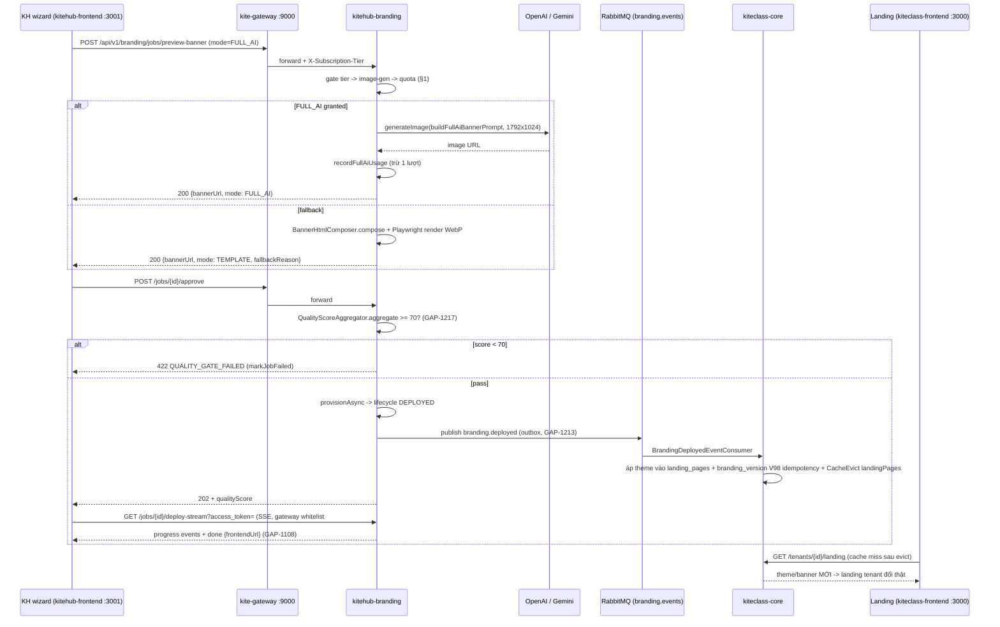

# AI Branding — Generation Flow 2-mode (TEMPLATE / FULL_AI) + Prompt Catalog

> **TL;DR:** Wizard branding sinh banner theo 2 mode (ADR-037): **TEMPLATE** (mặc định, free — Gemini điền nội dung vào HTML → Playwright chụp WebP, chữ Việt nét) và **FULL_AI** (PREMIUM/ENTERPRISE — GPT image-gen vẽ banner thật qua `OpenAIClient.generateImage`). Mode resolve **server-side** theo chuỗi gate: tier → image-gen khả dụng (flag + không mock-key) → quota tháng. **Quota chỉ trừ khi có output AI thật** (GAP-1218). User **không bao giờ viết free-form prompt** — backend compose prompt cố định từ lựa chọn wizard (`ai-branding-guidelines.md` §2.3). Sau approve (quality gate ≥70, GAP-1217), outbox `branding.deployed` propagate theme sang KC-core → landing tenant đổi THẬT (GAP-1213).

Tài liệu này hợp nhất flow kỹ thuật trước đây rải ở ADR-037 + `ai-branding-deploy-flow.md` (chỉ deploy SSE) + `01-business/kitehub/ai-branding/api-contract.md` + code. Đóng GAP-1237.

## 1. Mode resolve — chuỗi gate server-side

Entry: `POST /api/v1/branding/jobs/preview-banner` với `body.mode` (`BrandingJobV1Controller.previewBanner`). Client gửi mode mong muốn; server quyết mode thực + lý do fallback:

| # | Gate | Điều kiện FAIL | `fallbackReason` | Trừ quota? |
|---|---|---|---|---|
| 1 | Tier eligibility | `GenerationMode.forTier(tier) != FULL_AI` (FREE/BASIC) | `TIER_NOT_ELIGIBLE` | ❌ |
| 2 | Image-gen khả dụng | `!fullAiImageGenEnabled` (flag `branding.full-ai.image-gen-enabled`, default true từ #2362) **HOẶC** `isAiMockMode()` (key `sk-mock*`/`sk-placeholder*` → `ResilientAIClient.getProviderName()` chứa "mock") | `NOT_AVAILABLE` | ❌ |
| 3 | Quota tháng | `!fullAiQuotaService.canUseFullAi(instanceId, tier)` — PREMIUM cap 5/tháng (GAP-1137), ENTERPRISE unlimited | `QUOTA_EXHAUSTED` | ❌ |
| 4 | Generation thật | `generateImage` ném exception / trả null-blank | `GENERATION_FAILED` | ❌ |
| ✅ | Pass hết | — | (none, `mode=FULL_AI`) | ✅ `recordFullAiUsage` |

Mọi đường fallback → render TEMPLATE (user vẫn nhận banner) + FE toast trung thực ("KHÔNG trừ lượt của bạn" cho NOT_AVAILABLE — `Step6Preview.tsx`). Đây là consumer-trust guard GAP-1218 (Luật Quảng cáo VN: không thu phí/quota cho thứ không giao).

## 2. Sequence — preview → approve → deploy → landing đổi thật



SSE auth: EventSource không set được `Authorization` header → mint HMAC token qua `POST /jobs/{jobId}/sse-token` (authenticated) rồi mở stream `?access_token=` — gateway pass-through path `*/deploy-stream`, auth enforced service-side bởi `SseQueryTokenAuthFilter` (token bound jobId, TTL 120s).

## 3. Prompt catalog (backend-composed — user không viết)

Per `ai-branding-guidelines.md` §2.3: prompt cố định, compose từ lựa chọn wizard constrained (audience/tone/template/portrait/màu). Exception duy nhất: ENTERPRISE Advanced Mode ≤200 ký tự qua disclaimer modal.

### 3.1 FULL_AI banner — preview path

Nguồn: `BrandingJobV1Controller.buildFullAiBannerPrompt` · model: image-gen qua `ResilientAIClient` (circuit breaker, fallback placeholder) · size `1792x1024` · timeout 60s.

```text
Professional marketing banner for the Vietnamese education centre "{organizationName}".
[Headline message: "{copy}".]
[Theme/subject: {themeIcon}.]
[Feature a friendly, professional teacher portrait.]        ← khi có portraitUrls
[Brand colour palette primary {primary}, accent {accent}.]
Clean modern layout, high contrast, Vietnamese-friendly typography, trustworthy and welcoming tone.
No lorem ipsum, no watermark.
```

### 3.2 FULL_AI banner — job pipeline

Nguồn: `AIBrandingProcessor.buildImagePrompt` · qua input cap per-tier (`InputCapService` §2.5 guidelines) trước khi gọi.

```text
Professional education-centre hero banner for "{orgName}". Brand colours {primary} / {accent}.
Warm, inviting, modern learning environment. No garbled text overlay.
Tagline context: {copy ≤120 ký tự}
```

### 3.3 Marketing copy — Gemini text (TEMPLATE + draft)

Nguồn: `AIBrandingProcessor.buildCopyPrompt` · client `GeminiClient` (mock mode khi `GEMINI_API_KEY` rỗng) · fallback `staticCopy(orgName)` khi cap/exception.

```text
Viết nội dung marketing ngắn gọn ({language}) cho trung tâm giáo dục "{orgName}".
Yêu cầu: 1 câu slogan hấp dẫn (≤ 60 ký tự) + 1 câu mô tả giá trị (≤ 150 ký tự).
```

### 3.4 Landing features/content JSON — Gemini structured

Nguồn: `ContentGenerationService` — sinh JSON sections (features/programs) cho landing; parse-fail → log "Failed to parse features JSON" + fallback static. Ràng buộc ADR-037: length cap per field (heroTitle ≤45 ký tự), plain-text, **cấm bịa số liệu/testimonial** (đi qua sanitize-on-write GAP-827).

## 4. Config keys + secrets

| Key | Default | Ý nghĩa |
|---|---|---|
| `branding.full-ai.image-gen-enabled` | `true` (từ #2362; `false` trước đó) | Bật đường FULL_AI; kết hợp `!isAiMockMode()` mới granted |
| `openai.key` / env `OPENAI_API_KEY` | `sk-mock-key-for-local-testing` | Key thật lấy từ AWS SM `kitehub/production/openai-api-key` (manual 2026-06-09; bản IaC `ai-openai-api-key` là bootstrap placeholder); `sk-mock*` → mock-mode |
| `gemini.api-key` / env `GEMINI_API_KEY` | rỗng (mock) | Text/HTML copy free-tier |
| `quality-gate.pass-threshold` | `70` | Gate trước DEPLOYED (GAP-1217, reuse aggregator GAP-272c) |
| FULL_AI quota | PREMIUM 5/tháng, ENTERPRISE unlimited | `FullAiQuotaService` (GAP-1137) |

## 5. Tham chiếu

- **ADR-037** — generation stack decision (Gemini text + GPT image, 2-mode Amendment 2026-06-10)
- `ai-branding-deploy-flow.md` — chi tiết SSE deploy + job lifecycle (doc này không lặp)
- `documents/01-business/kitehub/ai-branding/api-contract.md` — endpoint shapes + fallbackReason matrix (#2362)
- `.claude/rules/ai-branding-guidelines.md` — §2.1 cấm free-form prompt, §2.3 fixed prompts, §2.5 input cap, §4.3 regenerate quota
- Kit design: `ui_kits/ai-branding-wizard-v2/v3/` (GAP-1212 v2 output-first)
- Gaps: GAP-1213 (deploy thật) · GAP-1217 (quality gate) · GAP-1218 (quota trust) · GAP-1135/1147 (FULL_AI wire) · GAP-1021 (SSE auth) · GAP-1108 (done+link) · GAP-1237 (doc này)
