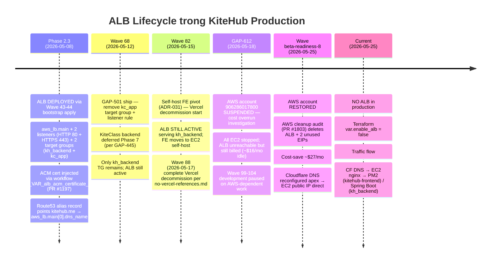
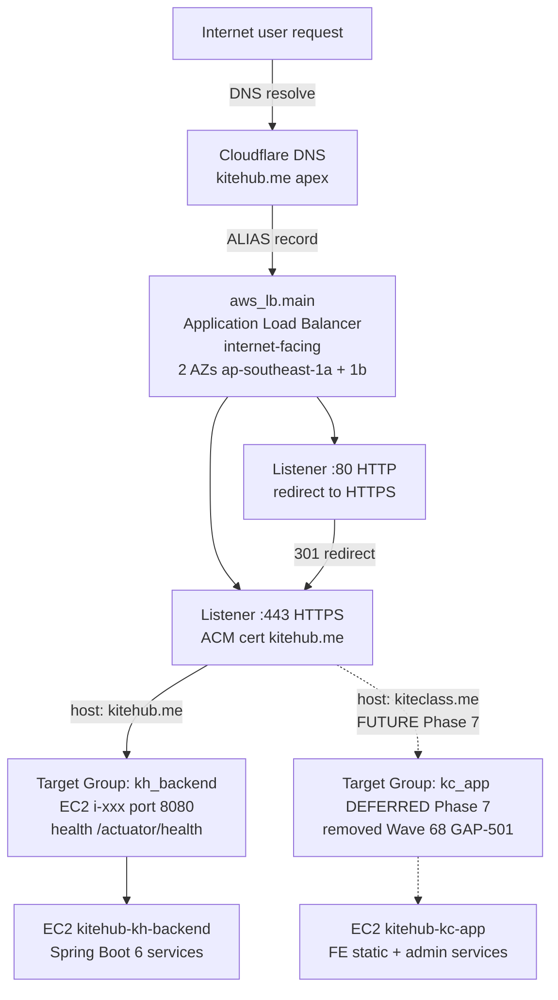
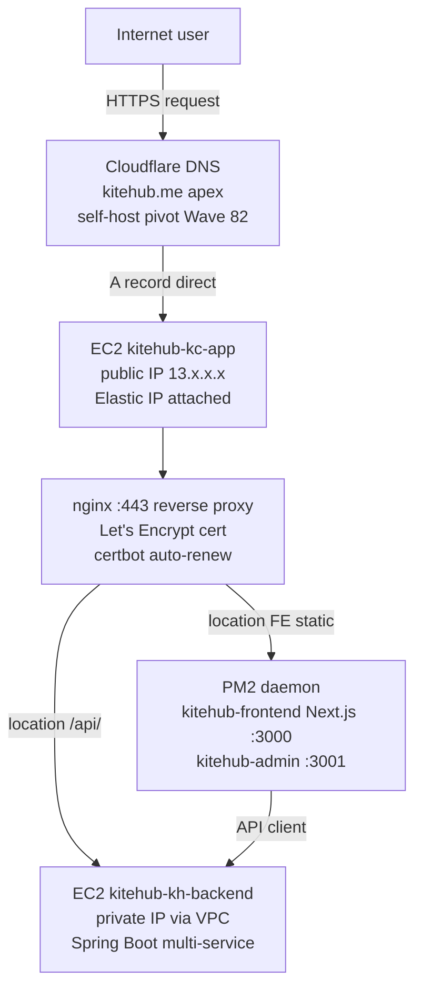

# AWS Application Load Balancer (ALB) — Architecture Reference

> **TL;DR — current state Phase 1 BETA (2026-05-25):**
> ALB **HIỆN KHÔNG được provision** trong production AWS (account `906286017800` region `ap-southeast-1`). Terraform code conditional `count = var.enable_alb ? 1 : 0` — `var.enable_alb` mặc định `false`. ALB từng được deploy (Phase 2.3 — Wave 43-44 2026-05-08) rồi DELETE post-AWS-account-restore (Wave beta-readiness-8 AWS cleanup audit 2026-05-25 PR #1803 — save ~$27/mo). Phase 1 BETA traffic flow hiện qua **Cloudflare DNS apex → EC2 public IP direct → nginx + PM2** per self-host pivot Wave 82 (ADR-031 FE self-host AWS EC2).
>
> Doc này tóm tắt: lịch sử ALB lifecycle / design intent ban đầu / lý do remove / current routing fallback / khi nào re-enable ALB / so sánh với phương án alternative.

---

## 1. Mục đích document này

Dev mới tiếp cận dự án thắc mắc: "Tại sao terraform có `aws_lb` resource mà AWS console không thấy ALB? Có cần ALB không?". Doc này answer:

- **ALB là gì** trong context KiteHub
- **Tại sao có code nhưng không provision** (conditional + cost optimization)
- **Phase 1 BETA traffic flow** thực tế (KHÔNG qua ALB)
- **Khi nào re-enable ALB** (Phase 2+ scale trigger)

Doc này KHÔNG cover: ALB AWS general concepts (xem AWS docs); ELB Classic / NLB / GLB comparison (out of scope).

---

## 2. Lịch sử ALB lifecycle



---

## 3. Architecture intent — what ALB was designed to do



**Design intent (Phase 2.3 ship time):**
- **Multi-AZ HA** — ALB span 2 subnets `ap-southeast-1a` + `ap-southeast-1b` (per `vpc.tf`)
- **TLS termination tại ALB** — ACM cert tự động rotation, EC2 chỉ cần HTTP backend
- **Path-based routing** — `/api/v1/auth/*` → kh_backend; `/admin/*` → admin service (future)
- **Health check** — `/actuator/health` automatic + cuts traffic from unhealthy targets
- **CloudWatch metrics** — RequestCount, TargetResponseTime, HTTPCode_Target_5XX_Count

---

## 4. Phase 1 BETA routing (current — KHÔNG có ALB)



**Current routing facts:**
- **Cloudflare DNS apex `kitehub.me`** A record → EC2 public IP `kitehub-kc-app` direct (no ALB alias)
- **TLS termination tại nginx EC2** — Let's Encrypt cert (auto-renew via certbot 90d)
- **No multi-AZ failover** — single EC2 per service (kh_backend + kc_app)
- **Backend reached via VPC private** — kc_app nginx → kh_backend private IP for `/api/` paths
- **No native health check at L7** — Cloudflare DNS-level monitoring (5min interval) + CloudWatch alarms

**Tradeoff vs ALB:**
| Aspect | Current (no ALB) | With ALB |
|---|---|---|
| Monthly cost | $0 (EC2 đã có) | +~$16/mo ALB + LCU charges |
| Multi-AZ HA | ❌ single EC2 SPOF | ✅ 2 AZs |
| TLS rotation | Manual certbot (auto-renew nhưng có thể fail silently) | ACM managed |
| Health check | Cloudflare 5min DNS-level | ALB 30s L7 with auto-eject |
| Path-based routing | nginx config | ALB listener rules (more verbose) |
| Scaling pattern | EC2 vertical only | ALB → ASG horizontal |

---

## 5. Terraform structure — conditional ALB

ALB resources định nghĩa trong `infrastructure/terraform-aws/ec2.tf` với conditional count:

```hcl
resource "aws_lb" "main" {
  count              = var.enable_alb ? 1 : 0
  name               = "${var.project_name}-alb"
  internal           = false
  load_balancer_type = "application"
  security_groups    = [aws_security_group.alb.id]
  subnets            = aws_subnet.public[*].id
  # ... tags, access_logs, etc.
}

resource "aws_lb_listener" "https" {
  count             = var.enable_alb ? 1 : 0
  load_balancer_arn = aws_lb.main[0].arn
  port              = 443
  protocol          = "HTTPS"
  certificate_arn   = var.alb_acm_certificate_arn
  # ...
}
```

**Variables (`variables.tf`):**
- `var.enable_alb` (bool, default `false`) — master switch
- `var.alb_acm_certificate_arn` (string, optional) — ACM cert ARN, required khi `enable_alb=true`

**Outputs (`outputs.tf`):**
- `output.alb_dns_name` — DNS name của ALB (empty string khi disabled)

**Files chứa ALB resources:**
- `ec2.tf` — `aws_lb.main` + 2 listeners + target groups
- `route53.tf` — alias record pointing apex → ALB DNS (conditional)
- `outputs.tf` — exposed dns_name + setup instructions
- `cloudwatch-dashboard.tf` — metrics widget reference `aws_lb.main[0].arn_suffix`

Khi `var.enable_alb = false` (current state):
- 0 ALB resources provisioned
- Route53 alias falls back to direct EC2 public IP
- Cloudwatch dashboard widgets referring ALB sẽ error nếu rendered (acceptable — dashboard rebuilds when ALB re-enabled)

---

## 6. Khi nào re-enable ALB (trigger conditions)

ALB **NÊN re-enable** khi đạt MỘT trong các trigger:

| Trigger | Threshold | Action |
|---|---|---|
| **Beta tenant count** | ≥10 active tenants (Phase 2 entry per `release-1-plan-2026.md` Phase 2 gate) | Re-enable ALB + ASG cho horizontal scaling capacity |
| **Production incident** SPOF EC2 down ≥5min | 1 incident | Re-enable ALB cho multi-AZ failover, không chờ scale-trigger |
| **TLS automation failure** | certbot auto-renew fail ≥2 lần | Re-enable ALB → ACM managed cert (eliminate certbot maintenance) |
| **Path-based routing complexity** | Phase 7 KiteClass backend ship (per ADR-028 ECS Fargate consideration) | ALB host-based routing `kitehub.me` vs `kiteclass.me` cleaner than nginx config |
| **Compliance audit** | PDPL 2023 audit yêu cầu HA + tamper-proof TLS rotation | Re-enable ALB + ACM cho audit-trail evidence |

**Re-enable procedure:**

```bash
# 1. Set variable
echo 'enable_alb = true' >> infrastructure/terraform-aws/terraform.tfvars
echo 'alb_acm_certificate_arn = "arn:aws:acm:ap-southeast-1:906286017800:certificate/..."' >> terraform.tfvars

# 2. Plan + review per pre-mutation-state-check.md §3
gh workflow run terraform-apply.yml -f dry_run=true

# 3. Verify plan diff = +ALB +2 listeners +TG + Route53 alias swap; no destroy
# 4. Live apply per release-deploy-standard.md §9 (human-triggered + confirm input)
gh workflow run terraform-apply.yml -f dry_run=false -f confirm=APPLY
```

**Cost estimate** khi re-enable:
- ALB base: ~$16.43/mo (730h × $0.0225/h ap-southeast-1)
- LCU charges: ~$5-15/mo at Phase 1 BETA traffic (~10-50 LCU)
- Total: ~$22-30/mo

---

## 7. Alternative — ALB không phải lựa chọn duy nhất

Khi Phase 2 scale-trigger fire, các option cần consider:

| Option | Pros | Cons | Phù hợp khi |
|---|---|---|---|
| **ALB (current code path)** | AWS-native, multi-AZ HA, ACM managed | Cost ~$22-30/mo Phase 1 BETA traffic | Phase 2 enterprise scale; AWS-only stack |
| **Cloudflare Tunnel + Load Balancer** | $0 base (free tier), DDoS protection included | Vendor lock-in CF; less metrics granularity | Solo-dev cost-priority; CF already in stack per ADR-018 |
| **nginx + Keepalived multi-EC2** | Open-source, no vendor markup | Manual config + maintenance burden | High traffic + ops capacity available |
| **EKS Ingress Controller (per `deployment-strategy.md` §7.1)** | Native K8s pattern | EKS cost ~$73/mo control plane + cluster nodes | Phase 2+ K8s migration committed |

**Recommendation Phase 1 → Phase 2:**
1. Phase 1 BETA — KEEP current (no ALB, CF apex direct)
2. Phase 1.5 PAID — evaluate Cloudflare Tunnel free tier (eliminate certbot maintenance)
3. Phase 2 — ALB re-enable khi multi-tenant scale demands (per §6 trigger)
4. Phase 3 K-12 — EKS Ingress (per `deployment-strategy.md` §7.1 migration plan)

---

## 8. Operational concerns (current state — no ALB)

Vì hiện không có ALB, các vấn đề sau cần dev aware:

### 8.1 TLS cert renewal — certbot self-managed
- Certbot 90-day auto-renew via cron trên EC2 `kitehub-kc-app`
- Failure mode: cert expires → HTTPS down → no automatic recovery
- Mitigation: CloudWatch alarm `kitehub-kc-app-fe-cert-expiry` monitors expiry < 14 days
- **Currently ALARM firing** (2026-05-25) — cần triage trước cert expires

### 8.2 No L7 health check auto-eject
- Cloudflare DNS-level monitoring 5min interval (not real L7)
- Server hang (process alive but không response) → traffic vẫn route tới EC2 → 5xx returned
- Mitigation: CloudWatch RDS connection alarms + app-level circuit breakers (per `design-patterns.md` §3.6)

### 8.3 Single EC2 SPOF
- `kitehub-kc-app` instance restart = 1-2min downtime
- No automated failover
- Mitigation: EC2 auto-recovery enabled; manual ASG scaling khi Phase 2 entry

### 8.4 Cloudflare DNS as single dependency
- CF outage = traffic disrupted (rare but happens)
- No DNS failover provider
- Mitigation: Phase 2+ consider Route53 secondary DNS

---

## 9. Related documents

- `documents/02-architecture/deployment-strategy.md` §7.1 — Phase 2 EKS migration plan (ALB re-enable point)
- `documents/02-architecture/kitehub-architecture.md` — service catalog + dependency graph
- `documents/02-architecture/adr/ADR-025-aws-only-deploy-phase-1-free-tier.md` — Phase 1 BETA AWS Free Tier strategy
- `documents/02-architecture/adr/ADR-028-ecs-fargate-vs-eks-phase-1-beta.md` — container orchestration decision
- `documents/02-architecture/adr/ADR-031-fe-self-host-aws-ec2.md` — Vercel→EC2 pivot (Wave 82)
- `documents/04-quality/audits/aws-verification/2026-05-25-wave-br-8-aws-cleanup-audit.md` (paired Wave beta-readiness-8 PR #1803) — ALB deletion rationale
- `.claude/rules/aws-observability-first.md` — CloudTrail mandate trước infra apply (re-apply khi re-enable ALB)
- `.claude/rules/no-vercel-references.md` — Wave 88 Vercel decommission (background context)
- `.claude/rules/release-deploy-standard.md` §9 — terraform apply workflow_dispatch pattern (re-enable procedure §6)
- `.claude/rules/pre-mutation-state-check.md` §3 — pre-apply audit mandate (mandatory khi re-enable)
- `infrastructure/terraform-aws/ec2.tf` — `aws_lb.main` conditional resource definition
- `infrastructure/terraform-aws/variables.tf` — `var.enable_alb` + `var.alb_acm_certificate_arn`
- PR #1197 — ALB HTTPS:443 ACM cert injection workflow (initial deploy)
- PR #1250 — GAP-501 kc_app target group removal
- PR #1803 — Wave beta-readiness-8 AWS cleanup (ALB deletion)

---

## 10. Decision history (per ADR convention)

| Date | Decision | Context | PR |
|---|---|---|---|
| 2026-05-08 | ALB DEPLOY Phase 2.3 bootstrap | First production apply per ADR-025 AWS Free Tier strategy | Wave 43-44 |
| 2026-05-09 | HTTPS:443 ACM cert injection via workflow | TF_VAR_alb_acm_certificate_arn dynamic injection | PR #1197 |
| 2026-05-12 | Remove kc_app target group | KiteClass backend deferred Phase 7 per GAP-445 | PR #1250 (GAP-501) |
| 2026-05-15 | FE self-host pivot Wave 82 | Vercel free-tier limits + cost vs build cap | ADR-031 |
| 2026-05-18 | AWS account suspended | GAP-612 cost overrun investigation | — |
| 2026-05-25 | ALB DELETE post-restore | Wave beta-readiness-8 cost-save ~$27/mo | PR #1803 |
| 2026-05-25 | Doc này created | Dev onboarding clarity request | this PR |
| Future | ALB RE-ENABLE | Per §6 trigger conditions | TBD Phase 2 |

---

## 11. Log

- **2026-05-25 (v1.0.0):** Doc created in response to dev onboarding question "có báo cáo về ALB AWS chưa". State-check confirmed no dedicated ALB architecture doc trong `documents/02-architecture/`; ALB mentions scattered across 10+ existing docs (compliance-control-map / kitehub-architecture / kiteclass-architecture / deployment-strategy / ADRs / threat-models). Created comprehensive reference covering lifecycle history + current Phase 1 BETA state (no ALB, CF apex direct) + design intent + re-enable trigger + alternatives + operational concerns. Author: @nguyenvankiet (solo-dev). Vietnamese narrative + English identifiers per `dev-readable-doc-language.md` §2. Mermaid diagrams per `diagram-format-selection.md` §2 (architecture flowchart + timeline types). Audience `mixed` — both dev + Claude consume via path-scoped auto-load.
