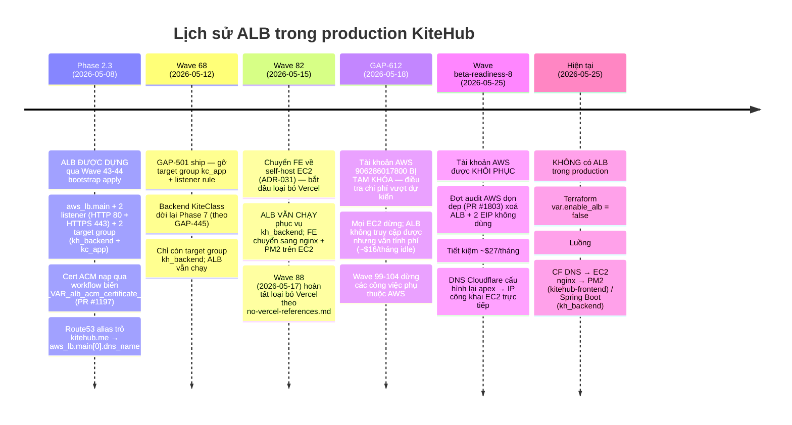
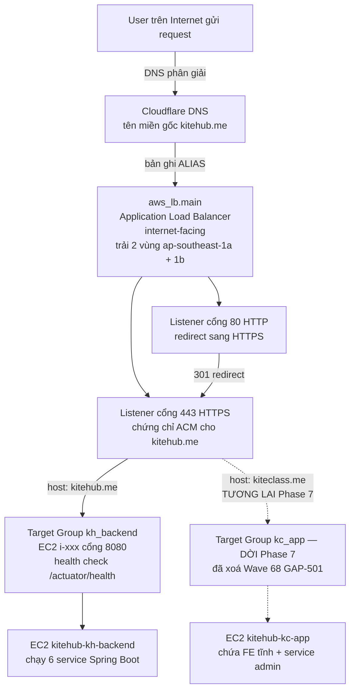
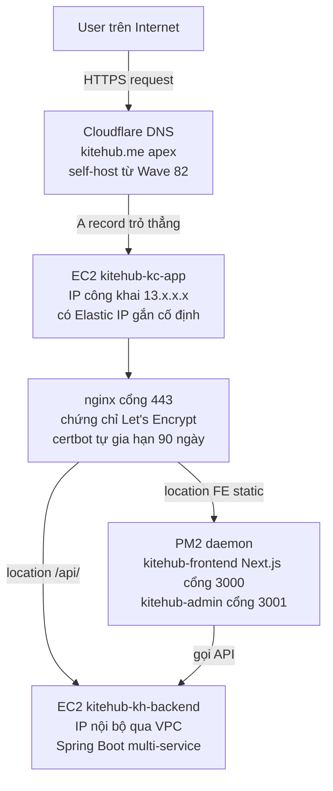

# AWS Application Load Balancer (ALB) — Báo cáo kiến trúc

> **Tóm tắt nhanh — trạng thái hiện tại Pha 1 BETA (2026-05-25):**
> ALB **hiện KHÔNG được dựng** trong production AWS (tài khoản `906286017800` vùng `ap-southeast-1`). Code terraform có sẵn nhưng để chế độ tắt qua biến `var.enable_alb` mặc định `false`. Trước đây ALB từng được dựng vào Phase 2.3 (đợt Wave 43-44 ngày 2026-05-08) rồi bị xoá lại sau khi khôi phục tài khoản AWS (Wave beta-readiness-8 dọn dẹp ngày 2026-05-25 qua PR #1803 — tiết kiệm ~$27/tháng). Luồng traffic Pha 1 BETA hiện đi thẳng **Cloudflare DNS → IP công khai của EC2 → nginx + PM2** theo hướng tự host từ Wave 82 (ADR-031 — chuyển frontend từ Vercel về AWS EC2).
>
> Tài liệu này tóm tắt: lịch sử ALB trong dự án / thiết kế ban đầu / lý do gỡ bỏ / luồng traffic hiện tại không qua ALB / khi nào nên bật ALB lại / so sánh với phương án thay thế.

---

## 1. Mục đích tài liệu

Dev mới tiếp cận dự án có thể thắc mắc: "Sao trong terraform có resource `aws_lb` mà AWS console không thấy ALB? Dự án có cần ALB không?". Tài liệu này trả lời:

- **ALB là gì** trong bối cảnh KiteHub
- **Tại sao có code mà không dựng** (do biến `var.enable_alb` đang tắt + tối ưu chi phí)
- **Luồng traffic Pha 1 BETA** thực tế (KHÔNG qua ALB)
- **Khi nào bật ALB trở lại** (kích hoạt khi vào Pha 2 + scale-trigger)

Tài liệu này KHÔNG bao gồm: kiến thức tổng quát về AWS ALB (xem AWS docs); so sánh với ELB Classic / NLB / GLB (ngoài phạm vi).

---

## 2. Lịch sử ALB trong dự án



---

## 3. Thiết kế ban đầu — ALB được kỳ vọng làm gì



**Mục tiêu thiết kế khi ship Phase 2.3:**
- **Sẵn sàng cao đa vùng (Multi-AZ HA)** — ALB trải qua 2 subnet `ap-southeast-1a` + `ap-southeast-1b` (theo `vpc.tf`)
- **Đầu cuối TLS tại ALB** — chứng chỉ ACM tự động xoay vòng, EC2 chỉ cần backend HTTP
- **Định tuyến theo đường dẫn** — `/api/v1/auth/*` đi tới kh_backend; `/admin/*` đi service admin (tương lai)
- **Health check tự động** — endpoint `/actuator/health` chạy định kỳ + tự ngắt traffic khỏi target không khỏe
- **Số liệu CloudWatch** — RequestCount, TargetResponseTime, HTTPCode_Target_5XX_Count

---

## 4. Luồng traffic Pha 1 BETA hiện tại — KHÔNG đi qua ALB



**Sự thật về luồng traffic hiện tại:**
- **Cloudflare DNS tên miền gốc `kitehub.me`** dùng A record trỏ thẳng vào IP công khai EC2 `kitehub-kc-app` (không qua ALB alias)
- **Đầu cuối TLS ngay tại nginx trên EC2** — chứng chỉ Let's Encrypt tự gia hạn bằng certbot (chu kỳ 90 ngày)
- **Không có dự phòng đa vùng** — mỗi service chỉ có 1 EC2 (kh_backend + kc_app)
- **Truy cập backend qua mạng nội bộ VPC** — nginx trên kc_app gọi sang IP nội bộ kh_backend cho các path `/api/`
- **Không có health check L7 tự động** — chỉ có Cloudflare giám sát ở mức DNS (chu kỳ 5 phút) + CloudWatch alarm

**So sánh đánh đổi giữa "không ALB" vs "có ALB":**

| Khía cạnh | Hiện tại (không ALB) | Có ALB |
|---|---|---|
| Chi phí hàng tháng | $0 (đã có sẵn EC2) | thêm ~$16/tháng cho ALB + phí LCU |
| Sẵn sàng đa vùng (HA) | ❌ chỉ 1 EC2 — single point of failure | ✅ trải 2 vùng AZ |
| Xoay vòng TLS | Tự gia hạn bằng certbot (có thể lỗi mà không hiện rõ) | Quản lý bởi ACM của AWS |
| Health check | Cloudflare DNS 5 phút/lần | ALB ở mức HTTP, 30 giây/lần, tự loại target hỏng |
| Định tuyến theo đường dẫn | Cấu hình trong nginx | Listener rule của ALB (chi tiết hơn) |
| Pattern mở rộng | Chỉ scale dọc trên 1 EC2 | ALB → Auto Scaling Group scale ngang |

---

## 5. Cấu trúc terraform — ALB dạng có điều kiện

Resource ALB nằm trong `infrastructure/terraform-aws/ec2.tf` với điều kiện count:

```hcl
resource "aws_lb" "main" {
  count              = var.enable_alb ? 1 : 0
  name               = "${var.project_name}-alb"
  internal           = false
  load_balancer_type = "application"
  security_groups    = [aws_security_group.alb.id]
  subnets            = aws_subnet.public[*].id
  # ... tags, access_logs, ...
}

resource "aws_lb_listener" "https" {
  count             = var.enable_alb ? 1 : 0
  load_balancer_arn = aws_lb.main[0].arn
  port              = 443
  protocol          = "HTTPS"
  certificate_arn   = var.alb_acm_certificate_arn
  # ...
}
```

**Các biến trong `variables.tf`:**
- `var.enable_alb` (kiểu bool, mặc định `false`) — công tắc chính
- `var.alb_acm_certificate_arn` (kiểu string, không bắt buộc) — ARN của cert ACM, bắt buộc khi `enable_alb=true`

**Output trong `outputs.tf`:**
- `output.alb_dns_name` — tên DNS của ALB (trả về chuỗi rỗng khi đang tắt)

**Các file chứa resource ALB:**
- `ec2.tf` — định nghĩa `aws_lb.main` + 2 listener + target group
- `route53.tf` — bản ghi alias trỏ tên miền gốc → DNS của ALB (có điều kiện)
- `outputs.tf` — expose dns_name + hướng dẫn setup
- `cloudwatch-dashboard.tf` — widget metric tham chiếu `aws_lb.main[0].arn_suffix`

Khi `var.enable_alb = false` (trạng thái hiện tại):
- Không có resource ALB nào được dựng
- Route53 alias quay về dùng IP công khai EC2 trực tiếp
- Widget dashboard CloudWatch tham chiếu ALB sẽ lỗi nếu render (chấp nhận — dashboard tự build lại khi ALB bật lại)

---

## 6. Khi nào nên bật ALB lại — các điều kiện kích hoạt

Nên bật ALB trở lại khi đạt MỘT trong các điều kiện sau:

| Điều kiện kích hoạt | Ngưỡng cụ thể | Hành động |
|---|---|---|
| **Số lượng tenant beta** | ≥10 tenant active (cửa vào Phase 2 theo `release-1-plan-2026.md` Phase 2 gate) | Bật ALB + Auto Scaling Group để mở rộng theo chiều ngang |
| **Sự cố production SPOF** | 1 lần EC2 chết ≥5 phút | Bật ALB ngay để failover đa vùng — không chờ đủ scale-trigger |
| **Tự động hoá TLS hỏng** | certbot tự gia hạn thất bại ≥2 lần | Bật ALB → chuyển sang ACM quản lý (giảm gánh nặng vận hành certbot) |
| **Định tuyến đường dẫn phức tạp** | Phase 7 backend KiteClass ship (theo ADR-028 cân nhắc ECS Fargate) | Định tuyến theo host của ALB (`kitehub.me` vs `kiteclass.me`) rõ hơn cấu hình nginx |
| **Audit tuân thủ** | PDPL 2023 audit yêu cầu HA + xoay vòng TLS tamper-proof | Bật ALB + ACM để có bằng chứng audit trail |

**Quy trình bật lại:**

```bash
# 1. Bật biến
echo 'enable_alb = true' >> infrastructure/terraform-aws/terraform.tfvars
echo 'alb_acm_certificate_arn = "arn:aws:acm:ap-southeast-1:906286017800:certificate/..."' >> terraform.tfvars

# 2. Chạy plan + review theo pre-mutation-state-check.md §3
gh workflow run terraform-apply.yml -f dry_run=true

# 3. Verify diff plan = thêm ALB + 2 listener + TG + swap Route53 alias; không có destroy
# 4. Apply thật theo release-deploy-standard.md §9 (con người trigger + nhập confirm input)
gh workflow run terraform-apply.yml -f dry_run=false -f confirm=APPLY
```

**Ước tính chi phí** khi bật lại:
- ALB cố định: ~$16.43/tháng (730h × $0.0225/h vùng ap-southeast-1)
- Phí LCU: ~$5-15/tháng ở mức traffic Pha 1 BETA (~10-50 LCU)
- Tổng: ~$22-30/tháng

---

## 7. Phương án thay thế — không nhất thiết phải dùng ALB

Khi đến lúc Phase 2 cần kích hoạt scale, các phương án cần cân nhắc:

| Phương án | Điểm cộng | Điểm trừ | Phù hợp khi |
|---|---|---|---|
| **ALB (đường code hiện tại)** | Native AWS, HA đa vùng, ACM quản lý | Chi phí ~$22-30/tháng cho traffic Pha 1 BETA | Phase 2 quy mô doanh nghiệp; stack chỉ AWS |
| **Cloudflare Tunnel + Load Balancer** | $0 ở free tier, kèm DDoS protection | Khoá vendor CF; metric granularity kém hơn | Solo-dev ưu tiên chi phí; CF đã trong stack theo ADR-018 |
| **nginx + Keepalived multi-EC2** | Mã nguồn mở, không phí vendor | Phải tự config + maintain | Traffic cao + có capacity ops |
| **EKS Ingress Controller (theo `deployment-strategy.md` §7.1)** | Pattern K8s chuẩn | EKS control plane ~$73/tháng + chi phí node cluster | Phase 2+ đã chốt migrate sang K8s |

**Khuyến nghị lộ trình Phase 1 → Phase 2:**
1. Pha 1 BETA — GIỮ nguyên hiện tại (không ALB, CF trỏ thẳng EC2)
2. Phase 1.5 PAID — đánh giá Cloudflare Tunnel free tier (loại bỏ gánh nặng certbot)
3. Phase 2 — bật ALB lại khi scale đa-tenant đòi hỏi (theo điều kiện §6)
4. Phase 3 K-12 — EKS Ingress (theo kế hoạch migrate trong `deployment-strategy.md` §7.1)

---

## 8. Các mối lo vận hành trong trạng thái hiện tại (không ALB)

Vì hiện không có ALB, các vấn đề sau dev cần biết:

### 8.1 Tự gia hạn TLS — certbot tự quản lý
- Certbot tự gia hạn 90 ngày qua cron trên EC2 `kitehub-kc-app`
- Chế độ lỗi: cert hết hạn → HTTPS sập → không có cơ chế tự phục hồi
- Giảm thiểu: CloudWatch alarm `kitehub-kc-app-fe-cert-expiry` giám sát ngày hết hạn < 14 ngày
- **Alarm hiện đang fire** (2026-05-25) — cần xử lý trước khi cert hết hạn

### 8.2 Không có health check L7 tự loại
- Cloudflare giám sát ở mức DNS, 5 phút/lần (không phải L7 thật sự)
- Server treo (process còn sống nhưng không trả response) → traffic vẫn vào EC2 → trả 5xx
- Giảm thiểu: CloudWatch alarm trên kết nối RDS + circuit breaker ở mức app (theo `design-patterns.md` §3.6)

### 8.3 Single Point of Failure trên 1 EC2
- Restart instance `kitehub-kc-app` = downtime 1-2 phút
- Không có failover tự động
- Giảm thiểu: bật EC2 auto-recovery; mở rộng ASG thủ công khi vào Phase 2

### 8.4 Cloudflare DNS là phụ thuộc đơn lẻ
- CF outage = traffic gián đoạn (hiếm nhưng có xảy ra)
- Không có DNS provider dự phòng
- Giảm thiểu: Phase 2+ cân nhắc thêm Route53 DNS thứ cấp

---

## 9. Tài liệu liên quan

- `documents/02-architecture/deployment-strategy.md` §7.1 — kế hoạch Phase 2 migrate sang EKS (lúc bật ALB trở lại)
- `documents/02-architecture/kitehub-architecture.md` — danh sách service + đồ thị phụ thuộc
- `documents/02-architecture/adr/ADR-025-aws-only-deploy-phase-1-free-tier.md` — chiến lược Pha 1 BETA dùng AWS Free Tier
- `documents/02-architecture/adr/ADR-028-ecs-fargate-vs-eks-phase-1-beta.md` — quyết định container orchestration
- `documents/02-architecture/adr/ADR-031-fe-self-host-aws-ec2.md` — chuyển FE từ Vercel → EC2 (Wave 82)
- `documents/04-quality/audits/aws-verification/2026-05-25-wave-br-8-aws-cleanup-audit.md` (đi kèm Wave beta-readiness-8 PR #1803) — lý do xoá ALB
- `.claude/rules/aws-observability-first.md` — bắt buộc bật CloudTrail trước khi apply infra (cần áp dụng lại khi bật ALB)
- `.claude/rules/no-vercel-references.md` — loại bỏ Vercel ở Wave 88 (bối cảnh nền)
- `.claude/rules/release-deploy-standard.md` §9 — pattern workflow_dispatch khi apply terraform (quy trình bật lại ở §6)
- `.claude/rules/pre-mutation-state-check.md` §3 — bắt buộc audit pre-apply (mandatory khi bật ALB)
- `infrastructure/terraform-aws/ec2.tf` — định nghĩa resource `aws_lb.main` có điều kiện
- `infrastructure/terraform-aws/variables.tf` — biến `var.enable_alb` + `var.alb_acm_certificate_arn`
- PR #1197 — workflow nạp cert ACM cho HTTPS:443 (lần dựng ALB đầu tiên)
- PR #1250 — GAP-501 gỡ target group kc_app
- PR #1803 — Wave beta-readiness-8 dọn dẹp AWS (xoá ALB)

---

## 10. Lịch sử quyết định (theo quy ước ADR)

| Ngày | Quyết định | Bối cảnh | PR |
|---|---|---|---|
| 2026-05-08 | DỰNG ALB cho Phase 2.3 bootstrap | Lần apply production đầu theo chiến lược AWS Free Tier ADR-025 | Wave 43-44 |
| 2026-05-09 | Nạp cert ACM cho HTTPS:443 qua workflow | TF_VAR_alb_acm_certificate_arn nạp động | PR #1197 |
| 2026-05-12 | Gỡ target group kc_app | Backend KiteClass dời Phase 7 theo GAP-445 | PR #1250 (GAP-501) |
| 2026-05-15 | Chuyển FE về self-host Wave 82 | Vercel free-tier hết hạn mức + cost vs build cap | ADR-031 |
| 2026-05-18 | Tài khoản AWS tạm khoá | GAP-612 điều tra chi phí vượt dự kiến | — |
| 2026-05-25 | XOÁ ALB sau khôi phục tài khoản | Wave beta-readiness-8 tiết kiệm ~$27/tháng | PR #1803 |
| 2026-05-25 | Tạo tài liệu này | Yêu cầu giúp dev mới onboarding | PR hiện tại |
| Tương lai | BẬT ALB TRỞ LẠI | Theo điều kiện kích hoạt §6 | TBD Phase 2 |

---

## 11. Log thay đổi

- **2026-05-25 (v1.0.1):** Cập nhật văn phong sang tiếng Việt theo `dev-readable-doc-language.md` §2 (user phản hồi "quá nhiều tiếng Anh trong báo cáo, dev đọc chưa hiểu"). Các identifier kỹ thuật (HTTP, HTTPS, TLS, ALB, ACM, EC2, ARN, AZ, CIDR, DNS, ASG, K8s, RDS, VPC, JWT, PDPL, ELB, GLB, NLB, OIDC, certbot, nginx, PM2) giữ English vì cross-locale stable + reference từ code/AWS docs. Câu chữ chuyển sang tiếng Việt tự nhiên hơn — pattern code-switching theo `dev-readable-doc-language.md` §4. Reviewer: @nguyenvankiet (solo-dev — PATCH refresh content, không đổi scope).
- **2026-05-25 (v1.0.0):** Tài liệu được tạo theo yêu cầu onboarding dev "có báo cáo về ALB AWS chưa". State-check xác nhận chưa có tài liệu ALB dedicated trong `documents/02-architecture/`; thông tin ALB rải rác trên 10+ tài liệu khác (compliance-control-map / kitehub-architecture / kiteclass-architecture / deployment-strategy / nhiều ADR / threat-model). Tạo báo cáo tham chiếu tổng hợp phủ: lịch sử + trạng thái Pha 1 BETA hiện tại (không ALB, CF trỏ thẳng EC2) + thiết kế kỳ vọng + điều kiện bật trở lại + phương án thay thế + mối lo vận hành. Author: @nguyenvankiet (solo-dev). Diagram Mermaid theo `diagram-format-selection.md` §2 (loại timeline + flowchart kiến trúc). Audience `mixed` — cả dev + Claude đều consume qua path-scoped auto-load.
