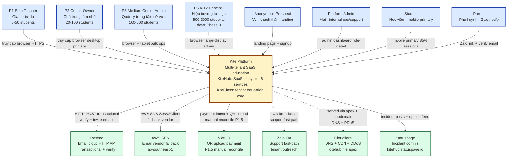
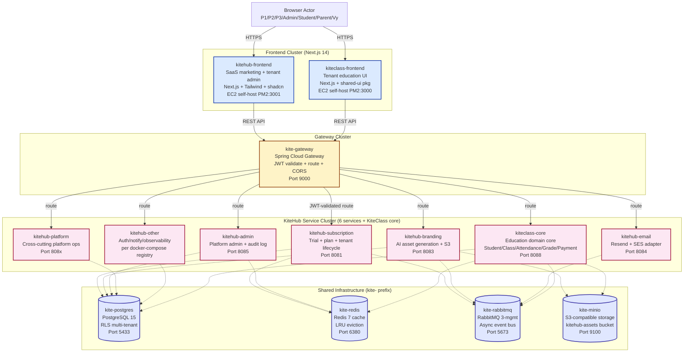

# C4 Model — Level 1 (System Context) + Level 2 (Container)

**Stake:** Industry-standard architectural mental model cho new dev onboarding + incident MTTR + cross-team alignment.

**Scope:** Chỉ ship L1 (System Context) + L2 (Container) per Wave 99B outside-in Benchmark agent Top 1 finding ("KiteHub MISSING C4 industry pillar"). L3 (Component) + L4 (Code) **explicitly deferred** — xem §3.

**Sister docs:**
- L1+L2 này = "boxes-and-arrows" overview. Dependency graph chi tiết (queue topology / HTTP call matrix / Redis access pattern) → B1 Service Catalog (`service-catalog-and-auth-flow.md`)
- Persona detail + JTBD → `documents/02-architecture/design-system/dossier/01-personas.md`
- Per-service deep-dive → `kitehub-architecture.md` / `kiteclass-architecture.md`
- Multi-tenant boundaries → `multi-tenant-architecture.md`
- Phase 1 BETA infrastructure (AWS Singapore Free Tier) → ADR-025 + `deployment-strategy.md`

---

## TL;DR

- **L1 System Context** answer: "Ai dùng Kite Platform + Kite Platform nói chuyện với hệ thống nào bên ngoài?"
- **L2 Container** answer: "Bên trong Kite Platform có những deployable unit nào + chúng share infra gì?"
- **L3+L4 defer**: dùng Java/TypeScript docstrings + per-feature design docs thay vì duplicate diagrams (per Benchmark agent recommendation Wave 99B).

---

## 1. Level 1 — System Context

Diagram cho thấy **Kite Platform** (system being designed, box duy nhất ở giữa) interact với 7 nhóm actor và 6 external systems.

### Narrative

**Actors (8 total):**
- **P1/P2/P3/P5** = tenant operator personas (per `dossier/01-personas.md`). P2 = primary KiteHub customer cho Phase 1 BETA; P5 K-12 defer Phase 3 (per CLAUDE.md decision context lock 2026-05-06).
- **Anonymous Prospect (Vy)** = chưa đăng ký, visit landing để evaluate; flow signup → verify email → beta-approved.
- **Platform Admin (Mai)** = internal ops persona; role-gated `/admin/*` routes (per GAP-518 role-guard hardening Wave 71c).
- **Student + Parent** = end-user personas under KiteClass tenant app; Student mobile-primary, Parent receive Zalo + email notify.

**External systems (6 total):**
- **Resend** = primary email vendor (HTTP API, simpler integration); used cho verification + invite + tenant onboarding emails.
- **AWS SES** = fallback email vendor (AWS SDK `SesV2Client`); same DKIM keys per `email-architecture.md`.
- **VietQR** = QR upload payment flow Phase 1.5 (manual reconcile pattern per Wave 93 retro — KiteHub non-PSP, partnership not self-build).
- **Zalo OA** = support fast-path channel (per Wave 98 GAP-660); broadcast tenant outreach + per-tenant support thread.
- **Cloudflare** = DNS + CDN proxy + DDoS protection cho `kitehub.me` apex + subdomains; self-host EC2 backend (per Wave 82 self-host pivot, Wave 88 Vercel decommission per `no-vercel-references.md`).
- **Statuspage** = incident communication + uptime feed cho beta tenants.

**Key boundary properties:**
- All actor-to-Kite communication via HTTPS (TLS 1.2+ per `pre-launch-infra-hardening-checklist.md` §2.1)
- External systems isolated via vendor adapter pattern (`NotificationChannel` interface for email, abstracted payment processor for VietQR/future)
- KHÔNG actor có direct DB access — gateway-mediated

---

## 2. Level 2 — Container

Diagram zoom-in vào Kite Platform showing deployable units + shared infra. **Không duplicate dependency arrows** chi tiết — B1 Service Catalog (`service-catalog-and-auth-flow.md`) owns full dependency graph với HTTP call matrix + RabbitMQ exchange topology.

### Narrative per cluster

#### Frontend Cluster (2 containers)

- **kitehub-frontend** (Next.js, port 3001) — marketing landing + tenant operator dashboard (signup, billing, branding, admin). Self-hosted trên EC2 via PM2 process manager per Wave 82 self-host pivot (Vercel decommissioned Wave 88). Consumer của `packages/shared-ui` shared component library.
- **kiteclass-frontend** (Next.js, port 3000) — tenant education UI cho Student/Teacher/Parent. Mobile-primary (85% sessions per persona dossier). Cũng self-hosted EC2 + shared-ui consumer.

#### Gateway Cluster (1 container)

- **kite-gateway** (Spring Cloud Gateway, port 9000) — single entry point cho mọi backend API call. Responsibilities: JWT validate + tenant context propagation (per GAP-604) + route to backend services + CORS enforcement (per `production-env-config-registry.md` §2.2 explicit origin list) + rate limiting per tenant.

#### Service Cluster (6 KiteHub services + 1 KiteClass core)

Per `kitehub/docker-compose.kitehub.yml` registry (verified at-spawn 2026-05-19):

- **kitehub-subscription** (port 8081) — trial + subscription lifecycle + billing + tenant provisioning + beta-access requests. Owner database lifecycle (per `DATABASE_LIFECYCLE_ENABLED: "true"` env).
- **kitehub-branding** (port 8083) — AI-generated asset (logo, banner, hero) + template management + S3 upload via MinIO. Consumer Ollama/OpenAI per `AI_PROVIDER` env switch.
- **kitehub-email** (port 8084) — email send orchestration (verification, invite, password reset, billing notify). Adapter pattern: `NotificationChannel` → `SESEmailService` or `ResendEmailService` per `EMAIL_PROVIDER` env (per `email-architecture.md`).
- **kitehub-admin** (port 8085) — Platform Admin role-gated operations: beta-request approve, tenant management, audit log read (per Wave 92 V54 admin_audit_log enrichment). Shares JWT_SECRET với subscription cho cross-service auth.
- **kitehub-platform** + **kitehub-other** — cross-cutting platform ops + auth/notify/observability services per `kitehub-architecture.md`.
- **kiteclass-core** (port 8088) — tenant education domain core: Student / Class / Attendance / Grade / Payment / Notification. Multi-tenant isolation qua PostgreSQL RLS (per `multi-tenant-architecture.md`).

#### Shared Infrastructure (4 containers, `kite-` prefix per CLAUDE.md naming)

- **kite-postgres** (PostgreSQL 15, port 5433) — primary OLTP database. Multi-tenant data isolation qua Row-Level Security policies. Hosts: `kitehub` schema (subscription/branding/admin) + `kiteclass_shared` schema (kiteclass-core).
- **kite-redis** (Redis 7, port 6380) — cache layer + session store + rate-limit counter. LRU eviction policy (256mb baseline, configurable per `REDIS_MAXMEMORY`).
- **kite-rabbitmq** (RabbitMQ 3-management, port 5673) — async event bus for cross-service notify (email queue, audit event, branding asset-ready event).
- **kite-minio** (S3-compatible, port 9100) — object storage cho AI-generated assets + template SVG + user uploads. Production maps to AWS S3 với cùng S3 SDK pattern.

**Why "kite-" not "kitehub-" prefix:** infrastructure shared cross-product (KiteHub + KiteClass cùng dùng) per CLAUDE.md Docker Naming Convention.

---

## 3. Defer L3 + L4 (per Benchmark recommendation Wave 99B)

**L3 Component diagrams + L4 Code-level diagrams explicitly NOT shipped trong wave này.**

### Rationale

Per Wave 99B outside-in External Benchmark agent recommendation Top 1: "Mermaid default + GitHub native render + C4 L1+L2 only — L3+L4 defer to docstrings + per-feature design docs". Anti-pattern from over-doc waste: maintaining L3+L4 diagrams duplicates information that lives more naturally in code + targeted design docs.

### Where L3 (Component) lives instead

- **Per-service architecture docs** — `kitehub-architecture.md` + `kiteclass-architecture.md` (Wave 96 PR2) document service-internal component breakdown.
- **3-layer business docs** — `documents/01-business/{domain}/rules.md` + `use-cases.md` + `api-contract.md` per CLAUDE.md mandate; ship same-PR với code changes.
- **ADRs** — `documents/02-architecture/adr/ADR-NNN-*.md` capture significant component decisions với context + consequences (per MADR template).
- **Threat models** — `documents/02-architecture/threat-models/*.md` (4 files Wave 99B B6 baseline) document component-level security boundaries.

### Where L4 (Code-level) lives instead

- **Java class structure** — package layout (`com.kite.subscription.controller` / `service` / `repository` / `dto` / `entity`) self-documenting per `backend/backend-standards.md`.
- **Javadoc** — class + method level docstrings (BR-ID javadoc per `business-logic-audit/SKILL.md` Cat 1).
- **TypeScript declarations** — strict mode + Zod schemas trong `kitehub-frontend/src/lib/api-client.ts` + `kiteclass-frontend/src/types/`.
- **OpenAPI specs** — generated từ controllers + cross-referenced trong `documents/01-business/{domain}/api-contract.md`.

### When L3+L4 diagrams justified (rare)

File follow-up gap nếu encounter:
- Cross-service flow complex (e.g., distributed saga > 4 hops) — diagram aids comprehension beyond what docstrings provide
- Onboarding feedback: "new dev cannot follow class hierarchy" — empirical signal that javadoc insufficient
- Audit finding: "incident RCA delayed do thiếu visual component map" — pattern justifies investment

Default: trust docstrings + ADRs + per-feature design docs. L1+L2 (this file) = system mental model.

---

## 4. Maintenance

### When to update this doc

- **L1 update trigger:** new persona added (e.g., P4 if scope reactivated) OR new external vendor integrated (e.g., Stripe added Phase 2) OR vendor deprecated (e.g., Vercel removed Wave 88 — verify next refresh).
- **L2 update trigger:** new microservice added to `docker-compose.kitehub.yml` (Tier 1 source of truth per CLAUDE.md) OR shared infra changed (e.g., Kafka replacing RabbitMQ would warrant update).
- **Cadence:** quarterly review minimum per `rule-change-process.md` §3.5 staleness pattern adapted for arch docs (60d WARN / 180d FAIL future CI script per GAP-669 follow-up).

### Update protocol

1. Verify-at-spawn: re-inspect `kitehub/docker-compose.kitehub.yml` + `dossier/01-personas.md` cho current state
2. Update L1 actors + external systems table per Tier 1 sources
3. Update L2 container list per compose registry
4. Bump `last-reviewed:` frontmatter to session date per `session-currentdate-check.md`
5. Cross-link with sister docs (B1/B3/B5 wave 99B)

---

## 5. Related

- **Wave 99B plan** — `documents/03-planning/waves/wave-2026-05-19-99b-architecture-docs-sweep-expansion.md` §3 Bucket B4
- **Sister bucket docs (Wave 99B):**
  - B1: `documents/02-architecture/service-catalog-and-auth-flow.md` (NEW) — dependency graph + auth flow + service catalog table
  - B2: `documents/02-architecture/compliance-control-map.md` (NEW) — compliance × code × test matrix + SLO registry
  - B3: `documents/02-architecture/database-architecture-map.md` (NEW) — entity catalog + FK graph + RLS map
  - B5: `documents/02-architecture/README.md` (REWRITE) — golden-path 7-step reading order
- **Existing arch docs** (Wave 96 PR2 baseline):
  - `kitehub-architecture.md` — per-product KiteHub deep-dive
  - `kiteclass-architecture.md` — per-product KiteClass deep-dive
  - `multi-tenant-architecture.md` — RLS + tenant isolation patterns
  - `email-architecture.md` — email send flow (Mermaid per Wave 96 PR2 + diagram-format-selection.md v1.0.0)
- **ADRs:** `documents/02-architecture/adr/` (32 ADRs, indexed `adrs-index.csv`)
- **Personas dossier:** `documents/02-architecture/design-system/dossier/01-personas.md`
- **Rules cited:**
  - `diagram-format-selection.md` v1.0.0 — Mermaid `flowchart TB` per §2.2 Architecture row
  - `dev-readable-doc-language.md` — Vietnamese narrative + English identifiers
  - `docs-filename-prefix-convention.md` — Tier 5 plain slug (`c4-context-container.md`)
  - `outside-in-coverage-trigger.md` — Wave 99B 3-agent audit consensus driving scope decision
  - `audit-to-gap-pipeline.md` Step 2.5 — state-check at spawn (compose registry + personas dossier verified)
