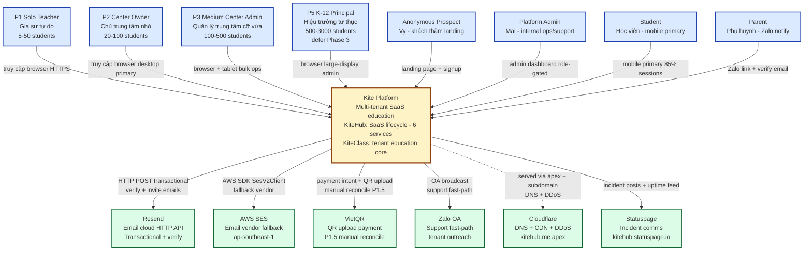
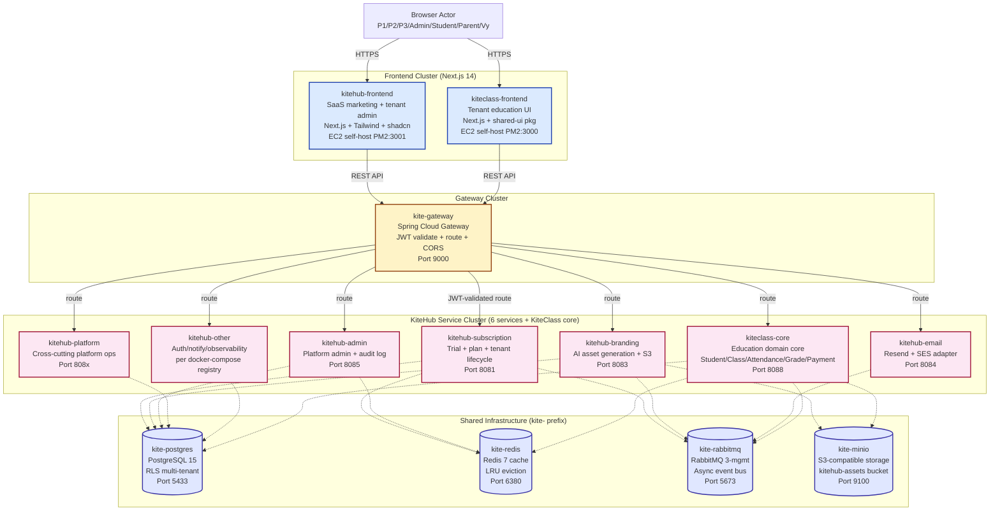

# C4 Model — Level 1 (System Context) + Level 2 (Container)

**Stake:** Mô hình kiến trúc chuẩn ngành cho onboarding dev mới + giảm MTTR khi incident + đồng thuận đa nhóm.

**Scope:** Chỉ ship L1 (System Context) + L2 (Container) per Wave 99B outside-in Benchmark agent Top 1 finding ("KiteHub MISSING C4 industry pillar"). L3 (Component) + L4 (Code) **hoãn rõ ràng** — xem §3.

**Sister docs:**
- L1+L2 này = "boxes-and-arrows" overview. Dependency graph chi tiết (queue topology / HTTP call matrix / Redis access pattern) → B1 Service Catalog (`service-catalog-and-auth-flow.md`)
- Persona detail + JTBD → `documents/02-architecture/design-system/dossier/01-personas.md`
- Per-service deep-dive → `kitehub-architecture.md` / `kiteclass-architecture.md`
- Multi-tenant boundaries → `multi-tenant-architecture.md`
- Phase 1 BETA infrastructure (AWS Singapore Free Tier) → ADR-025 + `deployment-strategy.md`

---

## TL;DR

- **L1 System Context** answer: "Ai dùng Kite Platform + Kite Platform nói chuyện với hệ thống nào bên ngoài?"
- **L2 Container** answer: "Bên trong Kite Platform có những deployable unit nào + chúng share infra gì?"
- **L3+L4 defer**: dùng Java/TypeScript docstrings + per-feature design docs thay vì duplicate diagrams (per Benchmark agent recommendation Wave 99B).

---

## 1. Level 1 — System Context

Diagram cho thấy **Kite Platform** (hệ thống đang được thiết kế, box duy nhất ở giữa) tương tác với 7 nhóm actor và 6 hệ thống ngoài.

### Narrative

**Actors (8 total):**
- **P1/P2/P3/P5** = persona vận hành tenant (per `dossier/01-personas.md`). P2 = khách hàng chính của KiteHub cho Phase 1 BETA; P5 K-12 hoãn Phase 3 (per CLAUDE.md decision context lock 2026-05-06).
- **Anonymous Prospect (Vy)** = chưa đăng ký, vào landing để đánh giá; flow signup → verify email → beta-approved.
- **Platform Admin (Mai)** = persona vận hành nội bộ; route `/admin/*` qua role-guard (per GAP-518 role-guard hardening Wave 71c).
- **Student + Parent** = persona end-user trong app KiteClass tenant; Student dùng mobile chính, Parent nhận thông báo Zalo + email.

**Hệ thống ngoài (6 total):**
- **Resend** = vendor email chính (HTTP API, tích hợp đơn giản); dùng cho email verify + invite + tenant onboarding.
- **AWS SES** = vendor email dự phòng (AWS SDK `SesV2Client`); cùng DKIM key per `email-architecture.md`.
- **VietQR** = flow QR upload payment Phase 1.5 (pattern manual reconcile per Wave 93 retro — KiteHub non-PSP, dùng partnership thay vì self-build).
- **Zalo OA** = kênh support nhanh (per Wave 98 GAP-660); broadcast tenant outreach + thread support per-tenant.
- **Cloudflare** = DNS + CDN proxy + DDoS protection cho apex `kitehub.me` + subdomain; self-host backend trên EC2 (per Wave 82 self-host pivot, Wave 88 decommission Vercel per `no-vercel-references.md`).
- **Statuspage** = kênh incident communication + uptime feed cho beta tenant.

**Tính chất boundary chính:**
- Mọi giao tiếp actor-to-Kite qua HTTPS (TLS 1.2+ per `pre-launch-infra-hardening-checklist.md` §2.1)
- Hệ thống ngoài được cô lập qua vendor adapter pattern (interface `NotificationChannel` cho email, payment processor được trừu tượng hoá cho VietQR/future)
- Không actor nào có direct DB access — đều qua gateway

---

## 2. Level 2 — Container

Diagram zoom-in vào Kite Platform để cho thấy các deployable unit + shared infra. **Không duplicate dependency arrow** chi tiết — B1 Service Catalog (`service-catalog-and-auth-flow.md`) sở hữu full dependency graph với HTTP call matrix + RabbitMQ exchange topology.

### Narrative per cluster

#### Frontend Cluster (2 container)

- **kitehub-frontend** (Next.js, port 3001) — landing marketing + dashboard cho tenant operator (signup, billing, branding, admin). Self-host trên EC2 qua PM2 process manager per Wave 82 self-host pivot (Vercel decommission Wave 88). Consumer của shared component library `packages/shared-ui`.
- **kiteclass-frontend** (Next.js, port 3000) — UI education cho tenant Student/Teacher/Parent. Mobile-primary (85% session per persona dossier). Cũng self-host EC2 + consumer shared-ui.

#### Gateway Cluster (1 container)

- **kite-gateway** (Spring Cloud Gateway, port 9000) — entry point duy nhất cho mọi backend API call. Responsibility: validate JWT + propagate tenant context (per GAP-604) + route tới backend service + enforce CORS (per `production-env-config-registry.md` §2.2 explicit origin list) + rate limit per tenant.

#### Service Cluster (6 service KiteHub + 1 KiteClass core)

Per registry `kitehub/docker-compose.kitehub.yml` (đã verify-at-spawn 2026-05-19):

- **kitehub-subscription** (port 8081) — trial + subscription lifecycle + billing + tenant provisioning + beta-access request. Owner lifecycle database (per env `DATABASE_LIFECYCLE_ENABLED: "true"`).
- **kitehub-branding** (port 8083) — asset AI-generated (logo, banner, hero) + template management + upload S3 qua MinIO. Consumer Ollama/OpenAI per env switch `AI_PROVIDER`.
- **kitehub-email** (port 8084) — orchestration email send (verification, invite, password reset, billing notify). Adapter pattern: `NotificationChannel` → `SESEmailService` hoặc `ResendEmailService` per env `EMAIL_PROVIDER` (per `email-architecture.md`).
- **kitehub-admin** (port 8085) — operation Platform Admin qua role-guard: beta-request approve, tenant management, audit log read (per Wave 92 V54 admin_audit_log enrichment). Chia sẻ JWT_SECRET với subscription cho cross-service auth.
- **kitehub-platform** + **kitehub-other** — operation platform cross-cutting + service auth/notify/observability per `kitehub-architecture.md`.
- **kiteclass-core** (port 8088) — domain education core của tenant: Student / Class / Attendance / Grade / Payment / Notification. Cô lập multi-tenant qua PostgreSQL RLS (per `multi-tenant-architecture.md`).

#### Shared Infrastructure (4 container, prefix `kite-` per CLAUDE.md naming)

- **kite-postgres** (PostgreSQL 15, port 5433) — database OLTP chính. Cô lập dữ liệu multi-tenant qua Row-Level Security policy. Hosts: schema `kitehub` (subscription/branding/admin) + schema `kiteclass_shared` (kiteclass-core).
- **kite-redis** (Redis 7, port 6380) — cache layer + session store + rate-limit counter. Policy LRU eviction (256mb baseline, configurable per `REDIS_MAXMEMORY`).
- **kite-rabbitmq** (RabbitMQ 3-management, port 5673) — event bus async cho notify cross-service (email queue, audit event, branding asset-ready event).
- **kite-minio** (S3-compatible, port 9100) — object storage cho asset AI-generated + template SVG + user upload. Production map sang AWS S3 với cùng pattern S3 SDK.

**Vì sao prefix "kite-" không phải "kitehub-":** infrastructure dùng chung giữa các product (KiteHub + KiteClass cùng consume) per CLAUDE.md Docker Naming Convention.

---

## 3. Hoãn L3 + L4 (per Benchmark recommendation Wave 99B)

**L3 Component diagram + L4 Code-level diagram chủ động KHÔNG ship trong wave này.**

### Lý do

Per Wave 99B outside-in External Benchmark agent recommendation Top 1: "Mermaid default + GitHub native render + C4 L1+L2 only — L3+L4 hoãn sang docstring + per-feature design doc". Anti-pattern over-doc waste: duy trì L3+L4 diagram duplicate thông tin đã sống tự nhiên hơn trong code + targeted design doc.

### L3 (Component) sống ở đâu

- **Per-service architecture doc** — `kitehub-architecture.md` + `kiteclass-architecture.md` (Wave 96 PR2) document phân rã component nội tại service.
- **3-layer business doc** — `documents/01-business/{domain}/rules.md` + `use-cases.md` + `api-contract.md` per CLAUDE.md mandate; ship same-PR với code change.
- **ADR** — `documents/02-architecture/adr/ADR-NNN-*.md` ghi lại các quyết định component quan trọng với context + consequence (per MADR template).
- **Threat model** — `documents/02-architecture/threat-models/*.md` (4 file Wave 99B B6 baseline) document boundary bảo mật component-level.

### L4 (Code-level) sống ở đâu

- **Cấu trúc class Java** — package layout (`com.kite.subscription.controller` / `service` / `repository` / `dto` / `entity`) tự document per `backend/backend-standards.md`.
- **Javadoc** — docstring class + method-level (javadoc BR-ID per `business-logic-audit/SKILL.md` Cat 1).
- **TypeScript declaration** — strict mode + Zod schema trong `kitehub-frontend/src/lib/api-client.ts` + `kiteclass-frontend/src/types/`.
- **OpenAPI spec** — sinh ra từ controller + cross-reference trong `documents/01-business/{domain}/api-contract.md`.

### Khi nào L3+L4 diagram justified (hiếm)

File follow-up gap nếu gặp:
- Flow cross-service complex (vd distributed saga > 4 hop) — diagram giúp hiểu beyond what docstring cover
- Feedback onboarding: "dev mới không follow được class hierarchy" — empirical signal là javadoc chưa đủ
- Audit finding: "RCA incident chậm do thiếu visual component map" — pattern justify đầu tư

Default: tin tưởng docstring + ADR + per-feature design doc. L1+L2 (file này) = mô hình tư duy hệ thống.

---

## 4. Maintenance

### Khi nào update doc này

- **L1 update trigger:** thêm persona mới (vd P4 nếu scope reactivate) HOẶC tích hợp external vendor mới (vd Stripe thêm Phase 2) HOẶC vendor deprecated (vd Vercel removed Wave 88 — verify ở refresh kế tiếp).
- **L2 update trigger:** thêm microservice mới vào `docker-compose.kitehub.yml` (Tier 1 nguồn dữ liệu chính thức per CLAUDE.md) HOẶC shared infra thay đổi (vd Kafka thay RabbitMQ là trigger phải update).
- **Cadence:** review tối thiểu hàng quý per `rule-change-process.md` §3.5 pattern staleness adapt cho arch docs (60d WARN / 180d FAIL future CI script per GAP-669 follow-up).

### Update protocol

1. Verify-at-spawn: re-inspect `kitehub/docker-compose.kitehub.yml` + `dossier/01-personas.md` cho current state
2. Update bảng actor L1 + external systems per Tier 1 source
3. Update danh sách container L2 per compose registry
4. Bump frontmatter `last-reviewed:` sang ngày session per `session-currentdate-check.md`
5. Cross-link với sister doc (B1/B3/B5 wave 99B)

---

## 5. Related

- **Wave 99B plan** — `documents/03-planning/waves/wave-2026-05-19-99b-architecture-docs-sweep-expansion.md` §3 Bucket B4
- **Doc sister bucket (Wave 99B):**
  - B1: `documents/02-architecture/service-catalog-and-auth-flow.md` (NEW) — dependency graph + auth flow + bảng service catalog
  - B2: `documents/02-architecture/compliance-control-map.md` (NEW) — matrix compliance × code × test + SLO registry
  - B3: `documents/02-architecture/database-architecture-map.md` (NEW) — entity catalog + FK graph + RLS map
  - B5: `documents/02-architecture/README.md` (REWRITE) — thứ tự đọc golden-path 7 bước
- **Arch doc hiện có** (Wave 96 PR2 baseline):
  - `kitehub-architecture.md` — KiteHub deep-dive per-product
  - `kiteclass-architecture.md` — KiteClass deep-dive per-product
  - `multi-tenant-architecture.md` — pattern RLS + tenant isolation
  - `email-architecture.md` — flow email send (Mermaid per Wave 96 PR2 + diagram-format-selection.md v1.0.0)
- **ADR:** `documents/02-architecture/adr/` (32 ADR, indexed `adrs-index.csv`)
- **Dossier persona:** `documents/02-architecture/design-system/dossier/01-personas.md`
- **Rule cited:**
  - `diagram-format-selection.md` v1.0.0 — Mermaid `flowchart TB` per §2.2 row Architecture
  - `dev-readable-doc-language.md` — narrative tiếng Việt + identifier tiếng Anh
  - `docs-filename-prefix-convention.md` — Tier 5 plain slug (`c4-context-container.md`)
  - `outside-in-coverage-trigger.md` — Wave 99B 3-agent audit consensus driving scope decision
  - `audit-to-gap-pipeline.md` Step 2.5 — state-check at spawn (compose registry + dossier persona verified)
