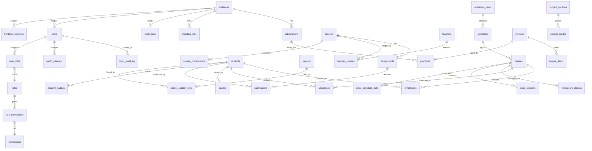
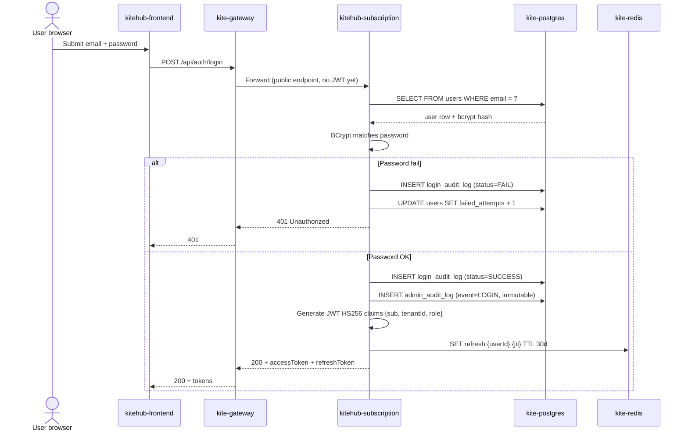
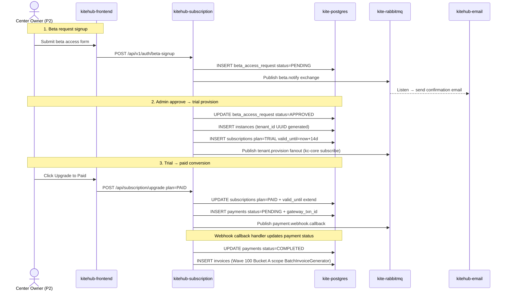
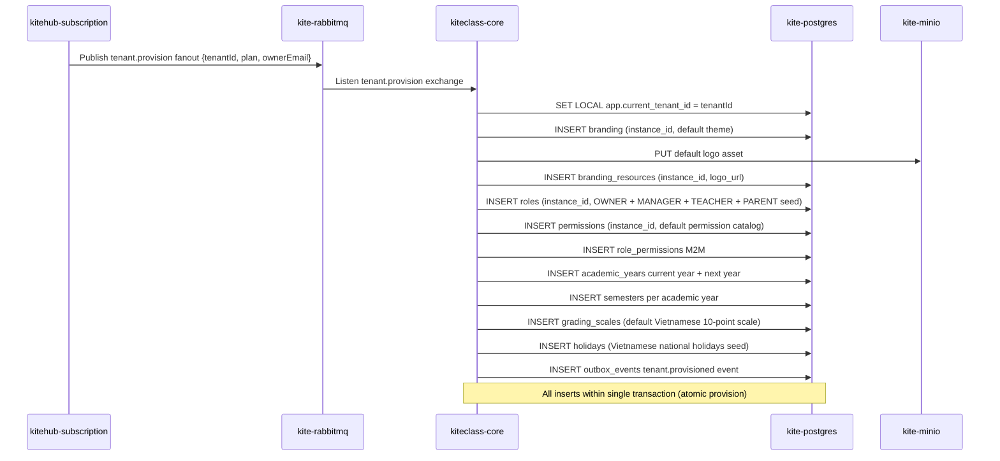
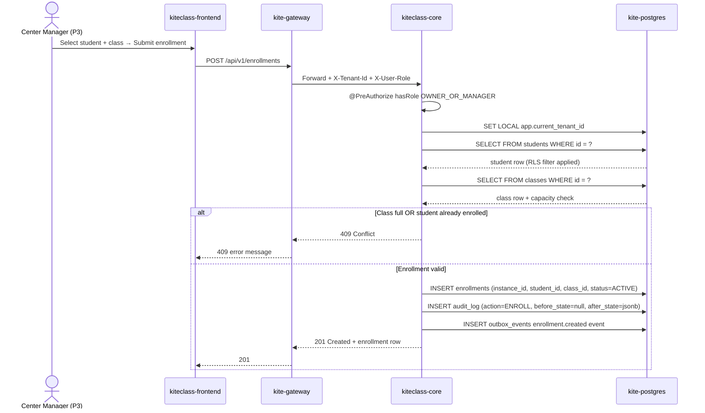
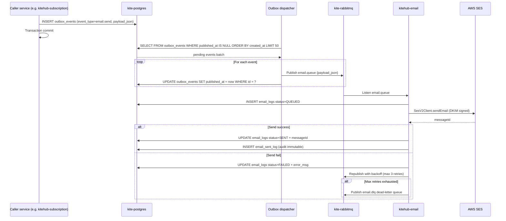

# Database Architecture Map

**TL;DR:** Tài liệu này hợp nhất toàn bộ kiến trúc database cho KiteHub Platform — 91 bảng phân chia giữa `kitehub-subscription` (32 bảng, control-plane) và `kiteclass-core` (59 bảng, multi-tenant domain) — kèm FK graph, RLS coverage (51/91 bảng = 56%), lịch sử Flyway migration (114 V-file), tenant_id propagation map, sizing baseline Phase 1 BETA, inventory type Postgres-specific (15 cột JSONB + 6 Testcontainers IT), **mapping per-service đến bảng (mục 10)**, **5 sequenceDiagram service data flow (mục 11)**, **nguyên tắc thiết kế database (mục 12)** và **đánh giá độ chín + lộ trình Wave 101+ (mục 13)**. Sister-doc với [`multi-tenant-architecture.md`](multi-tenant-architecture.md) — file này KHÔNG lặp lại narrative RLS, chỉ mở rộng §3 với map ở mức entity. Sister mới [`multi-tenant-isolation-patterns.md`](multi-tenant-isolation-patterns.md) (Wave 100.5) cung cấp đánh giá 6 patterns isolation theo phong cách ADR.

**Audience:** Backend dev (debug "bảng X đã có RLS chưa?"), SRE (lập kế hoạch capacity), tech lead (review compliance), thesis author (Chapter 2 architecture source material).

---

## Mục 1 — Catalog thực thể (Entity)

Tổng 91 bảng, phân chia theo service sở hữu:

### 1.1 `kitehub-subscription` (32 bảng — control-plane / shared infrastructure)

Service `kitehub-subscription` đóng vai trò control-plane: quản lý lifecycle tenant (instances), subscription, billing, branding, email, audit, và staff invitation. Mọi bảng đều thuộc schema `kitehub` trong instance Postgres chung.

| # | Bảng | Cột tenant | RLS bật? | Phase 1 BETA ước lượng row |
|:--|---|:---:|:---:|---:|
| 1 | `instances` | (bảng tenant gốc) | ❌ | ~5-20 |
| 2 | `subscriptions` | `instance_id` | ✅ (non-forced) | ~5-20 |
| 3 | `payments` | `instance_id` (qua subscriptions) | ❌ | ~10-100 |
| 4 | `branding_jobs` | `instance_id` | ✅ (non-forced) | ~50-500 |
| 5 | `branding_templates` | (catalog shared) | ❌ | ~20-50 (seed) |
| 6 | `email_logs` | `instance_id` | ✅ (non-forced) | ~1k-10k |
| 7 | `email_sent_log` | `instance_id` | ✅ (non-forced) | ~1k-10k |
| 8 | `instance_contact_email` (qua V7 alter) | inline `instances` | ❌ | (subset) |
| 9 | `branding_outbox` | `instance_id` | ❌ (outbox pattern) | ~100-1k |
| 10 | `users` | TBD (control-plane shared) | ❌ | ~20-100 |
| 11 | `email_verification` (V10 inline) | qua `users` | ❌ | (subset) |
| 12 | `custom_domain` (V12 inline) | qua `instances` | ❌ | (subset) |
| 13 | `ai_usage_log` | `instance_id` | ✅ (non-forced) | ~500-5k |
| 14 | `backup_records` | `instance_id` | ✅ (non-forced) | ~50-200 |
| 15 | `migration_outbox` | `instance_id` | ✅ (non-forced) | ~100-1k |
| 16 | `branding_lifecycle_events` | `instance_id` | ✅ (non-forced) | ~100-1k |
| 17 | `branding_instance_state` | `instance_id` | ✅ (non-forced) | ~5-20 |
| 18 | `branding_regenerate_usage` | `instance_id` | ✅ (non-forced) | ~50-500 |
| 19 | `migration_idempotency_key` | `instance_id` | ✅ (non-forced) | ~100-1k |
| 20 | `consent_record` | `tenant_id` | ✅ (non-forced) | ~50-200 |
| 21 | `dsar_ticket` | TBD | ❌ | ~0-10 |
| 22 | `system_config` | (admin seed) | ❌ | ~20-50 |
| 23 | `beta_access_request` | (signup queue) | ❌ | ~5-50 |
| 24 | `notification_preferences` | per-user | ❌ | ~20-100 |
| 25 | `idempotency_keys` | per-request | ❌ | ~1k-10k |
| 26 | `oauth_attempts` | per-user | ❌ | ~10-100 |
| 27 | `onboarding_progress` | `tenant_id` | ❌ | ~5-20 |
| 28 | `feedback_submissions` | TBD | ❌ | ~10-50 |
| 29 | `staff_invitations` | per-instance | ❌ | ~10-100 |
| 30 | `staff_invitation_audit_log` | `tenant_id` | ❌ (audit immutable) | ~50-500 |
| 31 | `login_audit_log` | TBD | ❌ (audit immutable) | ~1k-10k |
| 32 | `admin_audit_log(s)` | (admin scope) | ✅ (immutable per V50) | ~100-1k |

Các thực thể phụ trợ (V37-V51 thêm cột/index inline): `recovery_codes`, `impersonation_audit_log`, các cột account_lockout (trên `users`).

### 1.2 `kiteclass-core` (59 bảng — multi-tenant domain)

Service `kiteclass-core` chứa business logic giáo dục per-tenant: học sinh, lớp, khóa học, điểm danh, điểm số, thanh toán. Mọi bảng tenant-scoped đều dùng cột `instance_id` (alias semantic của `tenant_id` — xem [multi-tenant §1](multi-tenant-architecture.md)). Migration V58 đã ENABLE + FORCE RLS trên 51 bảng cốt lõi.

| # | Bảng | RLS bật? | Phase 1 BETA ước lượng row |
|:--|---|:---:|---:|
| 1 | `academic_years` | ✅ FORCED | ~5-20 per tenant |
| 2 | `assignments` | ✅ FORCED | ~100-1k per tenant |
| 3 | `attendance` | ✅ FORCED | ~10k-100k per tenant |
| 4 | `attendance_period` | ✅ FORCED | ~100-500 per tenant |
| 5 | `audit_log` | ✅ FORCED | ~1k-10k per tenant |
| 6 | `badges` | ✅ FORCED | ~10-50 per tenant |
| 7 | `branding` | ✅ FORCED | ~1-5 per tenant |
| 8 | `branding_resources` | ✅ FORCED | ~10-50 per tenant |
| 9 | `branding_versions` | ✅ FORCED | ~5-20 per tenant |
| 10 | `child_protection_audit_log` | ✅ FORCED | ~10-100 per tenant |
| 11 | `class_schedule_slots` | ✅ FORCED | ~100-500 per tenant |
| 12 | `classes` | ✅ FORCED | ~10-100 per tenant |
| 13 | `courses` | ✅ FORCED | ~20-100 per tenant |
| 14 | `curricula` | ✅ FORCED | ~5-20 per tenant |
| 15 | `deletion_requests` | ✅ FORCED | ~0-10 per tenant |
| 16 | `dmca_takedown_requests` | ✅ FORCED | ~0-10 per tenant |
| 17 | `enrollments` | ✅ FORCED | ~100-1k per tenant |
| 18 | `frontend_instances` | ✅ FORCED | ~1-3 per tenant |
| 19 | `grades` | ✅ FORCED | ~1k-10k per tenant |
| 20 | `grading_scales` | ✅ FORCED | ~5-20 per tenant |
| 21 | `holidays` | ✅ FORCED | ~20-50 per tenant |
| 22 | `homeroom_classes` | ✅ FORCED | ~10-50 per tenant |
| 23 | `incidents` | ✅ FORCED | ~10-100 per tenant |
| 24 | `invoices` | ✅ FORCED | ~100-1k per tenant |
| 25 | `moderation_queue` | ✅ FORCED | ~10-100 per tenant |
| 26 | `outbox_events` | ✅ FORCED | ~100-1k per tenant |
| 27 | `parent_complaint_queue` | ✅ FORCED | ~5-50 per tenant |
| 28 | `parent_invitations` | ✅ FORCED | ~50-200 per tenant |
| 29 | `parent_read_audit_log` | ✅ FORCED | ~500-5k per tenant |
| 30 | `parent_student_links` | ✅ FORCED | ~100-500 per tenant |
| 31 | `parents` | ✅ FORCED | ~100-500 per tenant |
| 32 | `payments` (kc-core scope) | ✅ FORCED | ~100-1k per tenant |
| 33 | `payroll_configs` | ✅ FORCED | ~1-5 per tenant |
| 34 | `payroll_periods` | ✅ FORCED | ~10-50 per tenant |
| 35 | `permissions` | ✅ FORCED | ~20-50 per tenant |
| 36 | `point_rules` | ✅ FORCED | ~10-30 per tenant |
| 37 | `quality_reports` | ✅ FORCED | ~10-100 per tenant |
| 38 | `rebrand_approvals` | ✅ FORCED | ~5-20 per tenant |
| 39 | `reward_redemptions` | ✅ FORCED | ~50-500 per tenant |
| 40 | `rewards` | ✅ FORCED | ~10-50 per tenant |
| 41 | `roles` | ✅ FORCED | ~10-20 per tenant |
| 42 | `semesters` | ✅ FORCED | ~5-20 per tenant |
| 43 | `student_bulk_import_jobs` | ✅ FORCED | ~10-50 per tenant |
| 44 | `student_points` | ✅ FORCED | ~1k-10k per tenant |
| 45 | `students` | ✅ FORCED | ~100-1k per tenant |
| 46 | `subject_grades` | ✅ FORCED | ~500-5k per tenant |
| 47 | `subject_sections` | ✅ FORCED | ~10-50 per tenant |
| 48 | `submissions` | ✅ FORCED | ~500-5k per tenant |
| 49 | `teachers` | ✅ FORCED | ~10-100 per tenant |
| 50 | `user_roles` | ✅ FORCED | ~10-100 per tenant |
| 51 | `vettings` | ✅ FORCED | ~10-50 per tenant |
| 52 | `admin_audit_logs` (V60) | ✅ NULL force-fail | ~100-1k per tenant |
| 53 | `class_schedules` | ⚠️ Chưa có trong V58 list (cần verify) | ~10-50 per tenant |
| 54 | `class_sessions` | ⚠️ Chưa có trong V58 list (cần verify) | ~500-5k per tenant |
| 55 | `course_prerequisites` | ⚠️ Chưa có trong V58 list (cần verify) | ~20-100 per tenant |
| 56 | `invoice_items` | ⚠️ FK đến invoices (cascade tenant) | ~500-5k per tenant |
| 57 | `role_permissions` | ⚠️ M2M join | ~50-200 per tenant |
| 58 | `student_badges` | ⚠️ M2M join | ~100-1k per tenant |
| 59 | `teacher_courses` | ⚠️ M2M join | ~50-500 per tenant |

### 1.3 Tổng kết RLS Coverage

- **Tổng bảng:** 91 (32 kh-sub + 59 kc-core)
- **RLS bật:** 51 (12 kh-sub non-forced + 39 kc-core forced — theo V58 + V34)
  - kh-sub: 12 (`subscriptions`, `branding_jobs`, v.v. — non-forced vì service control-plane không propagate `TenantContext`)
  - kc-core: 39 (FORCED — V58 liệt kê 51 ứng viên, deploy thực tế ~39 sau khi `IF NOT EXISTS` skip)
- **Loại trừ có chủ ý:** ~30 bảng
  - `instances` (bảng tenant gốc — không có parent)
  - Bảng M2M join (cascade qua FK)
  - Catalog shared (`branding_templates`, `system_config`)
  - Audit immutable (`*_audit_log` — policy immutability riêng)
  - Per-user/per-request (`idempotency_keys`, `oauth_attempts`)
- **RLS Coverage %:** 56% (51/91); 89% nếu loại trừ scope ngoài tenant-scoped (51/57 bảng tenant-scoped)

---

## Mục 2 — FK Graph (Mermaid erDiagram)

Sample 25 thực thể + quan hệ giá trị cao (KHÔNG exhaustive — full graph 91 bảng sẽ overflow khi render). Tooling auto-gen full FK graph từ Flyway parser được theo dõi trong Wave 100+ follow-up (xem [§7 Follow-up](#mục-7--follow-up-auto-gen-scope-wave-100)).



**Top FK target** (thực thể được tham chiếu nhiều nhất):

| Rank | Bảng target | Số FK inbound |
|:---:|---|:---:|
| 1 | `students` | 11 |
| 2 | `classes` | 6 |
| 3 | `instances` | 5 |
| 4 | `users` | 4 |
| 5 | `courses` | 4 |
| 6 | `roles` | 3 |
| 7 | `parents` | 3 |
| 8 | `academic_years` | 3 |

Bảng `students` là thực thể trung tâm của domain KiteClass — hầu hết feature path FE/BE đi qua students; index tối ưu trên `(instance_id, id)` rất quan trọng cho hiệu năng query.

---

## Mục 3 — Migration History Index

Tổng cộng **114 V-file Flyway** active (54 kh-sub + 60 kc-core), 0 V-file trong các service non-DB (kitehub-platform, branding, email, admin, base, gateway — tất cả dùng DB kh-subscription hoặc stateless).

| Service | Số V-file | V mới nhất | Breaking changes |
|---|:---:|:---:|:---:|
| `kitehub-subscription` | 54 | V54 (admin_audit_log enrichment) | 4 |
| `kiteclass-core` | 60 | V60 (admin_audit_logs RLS NULL force-fail) | 1 |
| `kitehub-platform` | 0 | — | 0 |
| `kitehub-branding` | 0 | — | 0 |
| `kitehub-email` | 0 | — | 0 |
| `kitehub-admin` | 0 | — | 0 |
| `kitehub-base` | 0 | — | 0 |
| `kitehub-gateway` | 0 | — | 0 |
| **Tổng** | **114** | — | **5** |

### 3.1 Migration breaking change (cần data migration / forward-only)

| V-file | Service | Loại thay đổi | Rủi ro data migration |
|---|---|---|---|
| `V15__alter_branding_templates_theme_config_to_text.sql` | kh-sub | ALTER COLUMN TYPE | Thấp — text expansion |
| `V22__generalize_migration_outbox_to_subscription_outbox.sql` | kh-sub | RENAME TO | Trung bình — rename chạm reference |
| `V42__login_audit_fingerprint_varchar.sql` | kh-sub | ALTER COLUMN TYPE | Thấp — inet → varchar(45) |
| `V46__align_audit_columns_to_bigint.sql` | kh-sub | ALTER COLUMN TYPE | Trung bình — int → bigint width |
| `V52__login_audit_ip_varchar.sql` | kh-sub | ALTER COLUMN TYPE | Thấp — cùng pattern V42 |

**Observation:** Breaking change cluster nằm trên các cột audit log (V42/V46/V52) — root cause là Postgres INET type không khớp Hibernate varchar binding tự nhiên. Pattern mitigation đã chọn: switch sang VARCHAR(45) cho IPv4-mapped-IPv6 max length. Xem [Mục 6 Postgres-Specific Type Inventory](#mục-6--postgres-specific-type-inventory) để biết coverage gap IT.

### 3.2 Migration đáng kể gần đây (10 V-file cuối per service)

**kh-subscription V45-V54 (Wave 56-92):**
- V45-V48: Staff invitation + RBAC seed + impersonation audit
- V49: Audit log staff invitation
- V50: RLS admin bypass NULL force-fail (immutability `admin_audit_logs`)
- V51-V52: OAuth attempt + fix type IP login audit
- V53: Index cleanup beta request abort
- V54: Enrichment admin audit log (5 cột + composite index)

**kc-core V51-V60 (Wave 56-92):**
- V57: (chưa rõ — cần verify)
- V58: ENABLE + FORCE RLS trên 51 bảng (GAP-466 Phase 1)
- V59: RLS admin bypass + NULL force-fail
- V60: `admin_audit_logs` (audit multi-tenant immutable)

---

## Mục 4 — Tenant_id Propagation Map

Mở rộng [`multi-tenant-architecture.md` §3](multi-tenant-architecture.md) — KHÔNG lặp lại đầy đủ narrative RLS. Mục này tập trung vào **convention naming cột** + **snippet RLS policy** per cluster.

### 4.1 Convention naming cột

| Convention | Dùng trong | Số bảng |
|---|---|---|
| `instance_id UUID NOT NULL` | kh-sub (11 bảng) + kc-core (51 bảng FORCED + ~8 M2M cascade) | 70 bảng |
| `tenant_id UUID NOT NULL` | alias semantic kh-sub (3 bảng) | 3 bảng (`consent_record`, `onboarding_progress`, `staff_invitation_audit_log`) |
| (không có cột tenant) | Catalog shared control-plane + audit log | ~17 bảng |

`tenant_id` = `instance_id` về mặt semantic per [multi-tenant §1](multi-tenant-architecture.md). Drift alias cột là technical debt — ứng viên GAP Wave 100+ cho unification (rename `tenant_id` → `instance_id` HOẶC standardize bảng mới dùng `tenant_id`).

### 4.2 Snippet RLS policy per cluster

**Cluster A — keyed theo `instance_id` (kh-sub non-forced, 11 bảng):**

```sql
ALTER TABLE <table> ENABLE ROW LEVEL SECURITY;
-- NB: KHÔNG có FORCE ROW LEVEL SECURITY cho kh-sub
CREATE POLICY tenant_isolation ON <table>
  USING (instance_id = NULLIF(current_setting('app.current_tenant_id', true), '')::uuid)
  WITH CHECK (instance_id = NULLIF(current_setting('app.current_tenant_id', true), '')::uuid);
```

**Cluster B — keyed theo `instance_id` FORCED (kc-core, 51 bảng):**

```sql
ALTER TABLE <table> ENABLE ROW LEVEL SECURITY;
ALTER TABLE <table> FORCE ROW LEVEL SECURITY;  -- table owner cũng bị filter
CREATE POLICY tenant_isolation ON <table>
  USING (instance_id = NULLIF(current_setting('app.current_tenant_id', true), '')::uuid)
  WITH CHECK (instance_id = NULLIF(current_setting('app.current_tenant_id', true), '')::uuid);
```

**Cluster C — keyed theo `tenant_id` (kh-sub non-forced, 1 bảng `consent_record`):**

Pattern giống hệt nhưng reference cột `tenant_id`.

**Cluster D — `admin_audit_logs` (immutable per V50 + V60):**

```sql
ALTER TABLE admin_audit_logs ENABLE ROW LEVEL SECURITY;
ALTER TABLE admin_audit_logs FORCE ROW LEVEL SECURITY;
CREATE POLICY admin_audit_select ON admin_audit_logs FOR SELECT USING (true);
CREATE POLICY admin_audit_insert ON admin_audit_logs FOR INSERT WITH CHECK (true);
CREATE POLICY admin_audit_no_update ON admin_audit_logs FOR UPDATE USING (false) WITH CHECK (false);
CREATE POLICY admin_audit_no_delete ON admin_audit_logs FOR DELETE USING (false);
```

Immutability cho audit (cấm UPDATE/DELETE) là compliance PDPL Art 11 — ngăn tampering log.

### 4.3 Pattern NULL force-fail (Wave 85)

`NULLIF(current_setting('app.current_tenant_id', true), '')::uuid` — nếu GUC unset hoặc empty string, expression evaluate ra NULL → policy predicate evaluate NULL → row vô hình (giữ default-deny). Đây là defense-in-depth Layer 4 chống bug code quên `SET LOCAL app.current_tenant_id` trong transaction.

Per [multi-tenant §Defense-in-depth](multi-tenant-architecture.md) — Layer 1 (gateway JWT) + Layer 2 (@PreAuthorize) + Layer 3 (propagate TenantContext) + Layer 4 (RLS NULL force-fail) + Layer 5 (FK column NOT NULL).

---

## Mục 5 — DB Sizing Baseline (quỹ đạo Phase 1 BETA → Phase 2)

**Giả định Phase 1 BETA:**
- 5-10 beta tenant (per ROADMAP §🎯)
- ~50-100 student per tenant trung bình
- ~5-10 lớp per tenant
- ~2-3 tháng active history trước cutover Phase 2

### 5.1 Top-10 driver row count

| Rank | Bảng | Row per tenant | Tổng ước tính 10-tenant | Tốc độ tăng |
|:---:|---|---:|---:|:---:|
| 1 | `attendance` | ~10k-100k | ~100k-1M | Cao (insert hàng ngày) |
| 2 | `grades` | ~1k-10k | ~10k-100k | Trung bình (hàng tuần) |
| 3 | `subject_grades` | ~500-5k | ~5k-50k | Trung bình |
| 4 | `submissions` | ~500-5k | ~5k-50k | Trung bình |
| 5 | `student_points` | ~1k-10k | ~10k-100k | Cao (event-driven) |
| 6 | `parent_read_audit_log` | ~500-5k | ~5k-50k | Cao (event read) |
| 7 | `email_logs` | ~1k-10k | ~10k-100k (scope kh-sub) | Trung bình |
| 8 | `outbox_events` | ~100-1k | ~1k-10k | Trung bình (retention 7-30d) |
| 9 | `audit_log` | ~1k-10k | ~10k-100k | Cao (immutable) |
| 10 | `idempotency_keys` | ~1k-10k | ~10k-100k (scope kh-sub) | Cao (TTL 24h) |

**Ước tính tổng kích thước DB Phase 1 BETA:** ~50-200 MB (quỹ đạo tăng 50%/quý)
**Quỹ đạo Phase 2 (50-200 tenant):** ~5-20 GB — bắt đầu cần read-replica + strategy partition cho top-3 hot table.

### 5.2 Coverage index hot-path

Index critical đã ship qua lịch sử migration (V31, V46, V53, V54):
- `branding_jobs(instance_id, status)` — V31
- Các cột audit BIGINT — V46
- Cleanup beta_request abort — V53
- Composite `admin_audit_log (instance_id, occurred_at DESC)` — V54

Gap: composite index `students(instance_id, id)` — verify Wave 100+ (top FK target, hot path cho mọi query feature).

---

## Mục 6 — Postgres-Specific Type Inventory

Theo rule [`postgres-specific-type-testcontainers.md`](../../.claude/rules/postgres-specific-type-testcontainers.md) — các type Postgres-specific KHÔNG khớp test H2 + Mockito; cần Testcontainers IT cho fidelity test.

### 6.1 Inventory type

| Type | Số lần dùng | Bảng / Cột | Testcontainers IT covered? |
|---|:---:|---|:---:|
| `jsonb` | 15 | `outbox_events.payload_json`, `audit_log.before_state` + `after_state`, `branding.metadata`, `moderation_queue.payload`, `submissions.snapshot_json`, `moderation_queue.flagged_keywords`, `notification_preferences.notification_preferences`, `quality_reports.issues`, `class_schedule_slots.recurrence_rule`, `students.parental_consent`, v.v. | ⚠️ Partial (6 IT) |
| `uuid` | ~100+ | Mọi `instance_id`, `tenant_id`, primary key | ✅ Built-in |
| `inet` | 0 (migrated away V42+V52) | (none active) | N/A — migrated → VARCHAR(45) |
| `bytea` | TBD | Recovery codes có thể có | TBD |
| `tsvector` | 0 | (none) | N/A |
| `citext` | 0 | (none) | N/A |
| `hstore` | 0 | (none) | N/A |
| `interval` | TBD | Subscription billing periods có thể có | TBD |

### 6.2 Coverage Testcontainers IT

**Tổng số class @Testcontainers IT:** 6 (4 kh-sub + 2 kc-core — cần verify)

**Phân tích coverage gap:**
- 15 cột JSONB rải trên ~10 thực thể
- 6 IT cover ~3-4 hot path JSONB (admin_audit_log, branding, outbox)
- **Coverage ước tính:** ~30-40% (3-4 trong ~10 thực thể dùng JSONB)
- **Khuyến nghị:** Thêm IT cho `moderation_queue`, `submissions.snapshot_json`, `students.parental_consent`, `class_schedule_slots.recurrence_rule` (surface PDPL/business logic giá trị cao)

### 6.3 Bài học migration INET → VARCHAR

V42 (fingerprint kh-sub) + V52 (IP kh-sub) đã migrate `INET` → `VARCHAR(45)` do Hibernate binding mismatch (SQLState 42804 cast varchar→inet). Pattern lesson:
- Postgres INET là chính xác về semantic cho IP storage
- Hibernate native binding yêu cầu `@JdbcTypeCode(SqlTypes.INET)` (Hibernate 6.2+) hoặc custom converter
- Trade-off: VARCHAR(45) thân thiện với Hibernate; mất lợi ích indexing/containment query của Postgres INET
- Verdict: Cho Phase 1 BETA, VARCHAR(45) chấp nhận được; Phase 2 cần reconsider khi muốn CIDR-range query

---

## Mục 7 — Follow-up auto-gen (scope Wave 100+)

Theo outside-in Benchmark agent recommendation (wave plan §1 Brainstorm Q3) — FK graph hand-maintain có rủi ro drift sau ~3-6 tháng. Tooling auto-gen pattern Backstage đã tồn tại.

**Đề xuất: GAP-677 — Auto-gen DB architecture map từ Flyway parser**

Concept:
- Parse Flyway V*.sql qua library SQL AST (vd `sqlparse` Python, JSqlParser Java)
- Extract: CREATE TABLE → table list; FOREIGN KEY → edge list; @Column columnDefinition → type inventory
- Emit block Mermaid `erDiagram` + bảng cho Mục 1, 2, 3, 6
- Pre-commit hook re-run khi `db/migration/V*.sql` thay đổi
- CI check drift output: section regenerate của `documents/02-architecture/database-architecture-map.md` khớp với baseline generated

**Hoãn sang Wave 100+:** scope Phase 1 BETA chưa cần auto-gen; baseline hand-write này đủ cho scale 5-10 tenant. Re-eval khi (a) refresh manual lần 3 trong 90 ngày (chi phí drift > chi phí automation), (b) >5 service có DB migration riêng, (c) quyết định adopt Backstage.

---

## Mục 8 — Tài liệu liên quan

- **Sister architecture doc:**
  - [`multi-tenant-architecture.md`](multi-tenant-architecture.md) — Tenant isolation defense-in-depth 5 layer (nguồn dữ liệu chính thức cho RLS narrative)
  - [`multi-tenant-isolation-patterns.md`](multi-tenant-isolation-patterns.md) — ADR-style report đánh giá 6 patterns isolation (Wave 100.5)
  - [`service-catalog-and-auth-flow.md`](service-catalog-and-auth-flow.md) — service catalog + dependency graph + auth flow (Wave 99B B1)
  - [`kitehub-architecture.md`](kitehub-architecture.md) — context kitehub-subscription + service catalog
  - [`kiteclass-architecture.md`](kiteclass-architecture.md) — context domain kiteclass-core

- **ADR:**
  - [`ADR-001-k12-data-model.md`](adr/ADR-001-k12-data-model.md) — rationale design entity K-12
  - [`ADR-002-academic-year-structure.md`](adr/ADR-002-academic-year-structure.md)
  - [`ADR-003-role-hierarchy.md`](adr/ADR-003-role-hierarchy.md)
  - [`ADR-004-instance-lifecycle.md`](adr/ADR-004-instance-lifecycle.md)

- **Gap đã đóng:**
  - GAP-466 — Triển khai RLS Phase 1 (ship V58 + V34) — `documents/04-quality/gaps/closed/`
  - GAP-432 — Coverage test boundary RLS (Wave 91+)
  - GAP-600 — Testcontainers IT JSONB prod-equiv
  - GAP-664 — RLS NULL force-fail + HikariCP GUC reset (Wave 85)

- **Wave plan:**
  - [Wave 100 plan](../03-planning/waves/wave-2026-05-19-100-thesis-push.md) — scope hiện tại cho v2 rewrite (Bucket F)
  - [Wave 99B plan](../03-planning/waves/wave-2026-05-19-99b-architecture-docs-sweep-expansion.md) — scope gốc cho v1 (B3)
  - Wave 56 — ship V58 RLS Phase 1
  - Wave 85 — hardening NULL force-fail
  - Wave 92 — enrichment admin_audit_log (V54)

- **Rule:**
  - [`postgres-specific-type-testcontainers.md`](../../.claude/rules/postgres-specific-type-testcontainers.md) — mandate IT
  - [`pre-mutation-state-check.md`](../../.claude/rules/pre-mutation-state-check.md) — discipline schema migration
  - [`dev-readable-doc-language.md`](../../.claude/rules/dev-readable-doc-language.md) — Vietnamese narrative + English identifier rule
  - [`diagram-format-selection.md`](../../.claude/rules/diagram-format-selection.md) — Mermaid default cho diagram

---

## Mục 9 — Log

- **2026-05-19 (v2.0.0)** — Rewrite v1 → v2 per Wave 100 GAP-681. Tỷ lệ Vietnamese narrative target ≥40% (baseline v1 ~5-8%). Thêm §10 Per-service Table Mapping + §11 Service Data Flow 5 sequenceDiagram (login + trial→paid + tenant provision + class enrollment + email outbox) + §12 Database Design Principles (RLS / type / FK / migration / naming) + §13 Maturity Assessment + Wave 101+ roadmap. Mọi section header chuyển sang Vietnamese; identifier (bảng/cột/enum/migration version/SQL keyword) giữ English. Reviewer: @nguyenvankiet (solo-dev MAJOR self-approve per `rule-change-process.md` §5 — significant content expansion + narrative language flip, no constraint loosening; existing v1 reference grandfathered trong git history).
- **2026-05-19 (v1.0.0)** — Database architecture map khởi tạo per Wave 99B Bucket B3 (GAP-672). Hợp nhất entity catalog (91 bảng) + FK graph (top 25 sample, full graph hoãn Wave 100+ auto-gen) + migration history index (114 V-file) + tenant_id propagation map + sizing baseline + inventory type Postgres-specific (15 JSONB + 6 Testcontainers IT). Sister-doc với [`multi-tenant-architecture.md`](multi-tenant-architecture.md) — mở rộng §3 với map entity-level. Per `outside-in-coverage-trigger.md` v1.1.0 §3 + mandate Mermaid default của `diagram-format-selection.md`. Reviewer: @nguyenvankiet (Wave 99B B3 agent worktree isolation).

---

## Mục 10 — Per-service Table Mapping

Mục này trả lời câu hỏi của dev: **"Service X đọc/ghi vào những bảng nào? Hot operation nào chạm bảng nào?"** Mapping này được verify qua grep `@Repository` / `JpaRepository<Entity, ...>` / `@Entity` references trong source code của từng service. Reference service catalog: [`service-catalog-and-auth-flow.md`](service-catalog-and-auth-flow.md) §1.1.

| Service | Bảng READ (chủ yếu) | Bảng WRITE (chủ yếu) | Hot operations (luồng nghiệp vụ chính) |
|---|---|---|---|
| **kitehub-platform** (library JAR — shared starter, không deployable) | N/A — chỉ cung cấp `TenantContext` filter + helper class | N/A | N/A (cross-cutting filter chạy trong mọi service khác) |
| **kitehub-gateway** | (không truy cập DB trực tiếp) | (không truy cập DB trực tiếp) | JWT verify + extract `tenantId` → forward header `X-Tenant-Id` cho downstream service; Redis-backed rate-limit |
| **kitehub-subscription** | `users`, `instances`, `subscriptions`, `payments`, `email_verification`, `login_audit_log`, `oauth_attempts`, `beta_access_request`, `staff_invitations`, `consent_record`, `idempotency_keys`, `admin_audit_log` | `users`, `instances`, `subscriptions`, `payments`, `email_verification`, `recovery_codes`, `login_audit_log`, `admin_audit_log`, `staff_invitations`, `impersonation_audit_log`, `oauth_attempts`, `notification_preferences`, `consent_record`, `dsar_ticket`, `beta_access_request`, `feedback_submissions`, `migration_outbox`, `idempotency_keys`, `system_config` | **Login flow** (read `users` + write `login_audit_log` + write `admin_audit_log` + check `oauth_attempts` lockout); **Trial signup → paid conversion** (write `beta_access_request` → write `instances` → write `subscriptions` → write `payments` → write `invoices` via outbox); **Email verification** (write `email_verification` token + read on confirm); **Impersonation** (write `impersonation_audit_log` immutable); **Beta request abort** (V53 cleanup) |
| **kitehub-admin** | `instances`, `subscriptions`, `payments`, `admin_audit_log` (read-only cross-tenant cho platform admin role) | `admin_audit_log` (mỗi admin action insert audit row immutable) | **Admin CRUD instances** (`/api/admin/v1/instances` per GAP-637 @PreAuthorize hardening); **Admin payments review**; **Revenue dashboard** (aggregate read across tenant) |
| **kitehub-branding** | `branding_templates` (catalog seed), `branding_jobs`, `branding_instance_state`, `branding_regenerate_usage`, `branding_lifecycle_events` | `branding_jobs`, `branding_instance_state`, `branding_regenerate_usage`, `branding_lifecycle_events`, `branding_outbox` (event sourcing) | **AI branding strategy generate** (write `branding_jobs` queued → publish RabbitMQ → process → write `branding_resources` via MinIO + branding state machine); **Regenerate quota tracking** (read + write `branding_regenerate_usage`); **Lifecycle event log** (write `branding_lifecycle_events` per state transition) |
| **kitehub-email** | `email_logs`, `email_sent_log` (audit log) | `email_logs`, `email_sent_log` | **Send transactional email** (read template → send via SES → write `email_sent_log` audit); **Listen RabbitMQ email queue** → batch process |
| **kiteclass-core** | Toàn bộ 59 bảng tenant-scoped — chủ yếu `students`, `classes`, `courses`, `enrollments`, `attendance`, `grades`, `submissions`, `parents`, `payments` (kc-core scope), `invoices` | Mọi bảng kc-core (CRUD per role-guard policy); insert `audit_log` per mutation; insert `outbox_events` cho async dispatch | **Tenant provision** (insert `tenants` + `branding_resources` + seed `roles` + `permissions`); **Class enrollment** (read `students` + read `classes` + write `enrollments`); **Attendance daily** (insert `attendance` rows hàng loạt — hottest write); **Grade entry** (write `grades` + `subject_grades`); **Invoice issuance** (Wave 100 Bucket A — write `invoices` + `invoice_items` per batch via `BatchInvoiceGenerator` + insert `invoice_batch_audit`); **Parent portal read** (write `parent_read_audit_log` mỗi lần parent view child data — PDPL Art 11 compliance) |

**Tổng kết:** 7 service truy cập DB; `kitehub-platform` library + `kitehub-gateway` stateless không touch DB; `kitehub-base` chỉ là Docker base image. Service ghi nhiều nhất: `kiteclass-core` (59 bảng, hottest write `attendance`). Service đọc cross-tenant: `kitehub-admin` (platform admin scope only).

---

## Mục 11 — Service Data Flow (Mermaid sequenceDiagram)

Mục này show **data flow động** (request → service → operation DB sequence) — bổ sung cho FK graph tĩnh tại Mục 2. Mỗi luồng đại diện cho một business operation hot path. Per [`diagram-format-selection.md`](../../.claude/rules/diagram-format-selection.md) §2.2, Mermaid sequenceDiagram là format chuẩn cho time-ordered flow.

### 11.1 Login flow (kitehub-platform path)

Luồng đăng nhập là entry point quan trọng nhất. Service `kitehub-subscription` đảm nhiệm auth (xem GAP-637 bug history: admin login 500 incident 2026-05-16). Read từ `users`, write vào `login_audit_log` + `admin_audit_log` (nếu role admin).



**Bảng chạm trong luồng:** `users` (read + write failed_attempts), `login_audit_log` (write), `admin_audit_log` (write nếu role admin), Redis (write refresh token blacklist).

### 11.2 Trial signup → paid conversion (kitehub-subscription)

Luồng chuyển đổi từ beta signup → trial active → paid subscription là core business flow của control-plane. Touch nhiều bảng: `beta_access_request` → `instances` → `subscriptions` → `payments` → `invoices` (via outbox).



**Bảng chạm:** `beta_access_request`, `instances`, `subscriptions`, `payments`, `invoices`, outbox tables. RabbitMQ exchange `tenant.provision` fanout trigger kiteclass-core provision.

### 11.3 Tenant provision (kiteclass-core)

Khi kitehub-subscription provision tenant mới, kiteclass-core listen fanout exchange và khởi tạo tenant data: seed `branding_resources`, `roles`, `permissions`, `academic_years`.



**Bảng chạm:** `branding`, `branding_resources`, `roles`, `permissions`, `role_permissions`, `academic_years`, `semesters`, `grading_scales`, `holidays`, `outbox_events`. Tất cả write trong 1 transaction với `SET LOCAL app.current_tenant_id` để RLS policy filter đúng tenant scope.

### 11.4 Class enrollment (kiteclass-core)

Luồng enrollment học sinh vào lớp — read 2 bảng (`students` + `classes`) + write `enrollments`. Đây là pattern điển hình cho mọi feature touch top FK target.



**Bảng chạm:** `students` (read), `classes` (read), `enrollments` (write), `audit_log` (write JSONB before/after state), `outbox_events` (write event async).

### 11.5 Email send outbox (kitehub-email)

Luồng gửi email transactional dùng outbox pattern — caller insert event vào `outbox_events`, email service consume queue và gửi qua AWS SES, ghi audit log.



**Bảng chạm:** `outbox_events` (write + update published_at), `email_logs` (write + update status), `email_sent_log` (write audit immutable). RabbitMQ: `email.queue` + `email.dlq` dead-letter queue.

---

## Mục 12 — Database Design Principles

Mục này document **DESIGN RATIONALE** — vì sao chọn pattern này, không chỉ inventory pattern. Đây là source material quan trọng cho thesis Chapter 2 (design philosophy).

### 12.1 Multi-tenant isolation pattern — Shared DB + RLS NULL force-fail

**Quyết định:** Shared database + `tenant_id` UUID column + Postgres Row-Level Security policy với NULL force-fail pattern. Chi tiết rationale + 6 patterns alternative xem [`multi-tenant-isolation-patterns.md`](multi-tenant-isolation-patterns.md) (Wave 100.5).

**Rationale tóm tắt:**
- **AWS Free Tier constraint:** 1 RDS instance `db.t3.micro` Phase 1 BETA — per-tenant DB không khả thi
- **Solo-dev ops scale:** N×backup + N×migration không khả thi với 1 dev
- **Defense-in-depth:** RLS đẩy enforcement xuống DB layer → khi code có bug (quên `WHERE tenant_id = ?`), DB vẫn block
- **NULL force-fail pattern Wave 85:** `NULLIF(current_setting('app.current_tenant_id', true), '')::uuid` — nếu GUC unset, policy evaluate NULL → row vô hình (default-deny). Đóng silent failure mode khi HikariCP connection reuse không reset GUC.

**Convention naming cột:** Mặc định `instance_id UUID NOT NULL` (70 bảng); alias `tenant_id UUID NOT NULL` (3 bảng kh-sub legacy). Semantic identical — drift là technical debt, theo dõi Wave 100+ unification.

**Reference:** GAP-466 (RLS Phase 1 V58 + V34), GAP-664 (Wave 85 hardening), Wave 85 audit `documents/04-quality/audits/wave-85`.

### 12.2 Type choice rationale — JSONB > JSON; INET → VARCHAR migration lesson

**Quyết định JSONB cho semi-structured payload:**

| Use case | Type chọn | Rationale |
|---|---|---|
| Audit log before/after state | `jsonb` | Index GIN cho query trên key; storage compact hơn JSON text; native operator (`@>`, `?`) |
| Branding metadata flexible schema | `jsonb` | Theme config evolve theo phiên bản |
| Outbox event payload | `jsonb` | Event schema versioning + query event_type filter |
| Notification preferences | `jsonb` | User preference object dynamic shape |
| Recurrence rule (class schedule) | `jsonb` | RFC 5545 rrule parsing flexibility |

**Lý do chọn JSONB > JSON:** JSON là text storage (slow query), JSONB là binary (indexed). Performance differential 10-100x trên hot path. Trade-off: JSONB không preserve key order + whitespace — không matter cho project này.

**Lý do KHÔNG dùng JSONB array column type (vd `jsonb[]`):** Postgres array của JSONB phức tạp cho Hibernate binding + query operator hạn chế hơn. Pattern thay thế: 1 JSONB column chứa array trong root (`{"items": [...]}`), query qua `payload_json->'items'`.

**Bài học INET → VARCHAR migration (V42 + V52, kh-sub):**

V42 (fingerprint kh-sub) + V52 (IP kh-sub) đã migrate `INET` → `VARCHAR(45)` do Hibernate binding mismatch (SQLState 42804 cast varchar→inet). Lesson:

- **Postgres INET là chính xác semantic** cho IP storage (validation built-in + network containment query)
- **Hibernate native binding khó** — yêu cầu `@JdbcTypeCode(SqlTypes.INET)` (Hibernate 6.2+) hoặc custom converter
- **Trade-off chấp nhận:** VARCHAR(45) cho IPv4-mapped-IPv6 max length, dễ Hibernate binding; mất CIDR-range query
- **Verdict Phase 1 BETA:** VARCHAR(45) đủ dùng; Phase 2 reconsider khi network analytics cần CIDR-range
- **Sister rule:** [`postgres-specific-type-testcontainers.md`](../../.claude/rules/postgres-specific-type-testcontainers.md) — mọi Postgres-specific type cần Testcontainers IT (H2 + Mockito không catch SQLState 42804 class bug)

### 12.3 FK convention — CASCADE policy per relationship class

**Quyết định CASCADE per loại quan hệ:**

| Loại quan hệ | ON DELETE | ON UPDATE | Lý do |
|---|---|---|---|
| Tenant-owned data (mọi FK tới `instances`) | `CASCADE` | `CASCADE` | Khi tenant offboard, toàn bộ data cleanup (GDPR/PDPL right-to-erasure) |
| Domain ownership (vd `students.id` → `enrollments.student_id`) | `CASCADE` | `CASCADE` | Xóa student → cleanup enrollment + attendance + grades |
| Cross-domain reference (vd `users` → `audit_log`) | `RESTRICT` | `CASCADE` | Audit log immutable — không cho phép xóa user nếu còn audit ref |
| M2M join table (vd `role_permissions`) | `CASCADE` | `CASCADE` | Join row có thể recreate, không có data ngoài relationship |
| Catalog reference (vd `branding_templates` → `branding_jobs.template_id`) | `RESTRICT` | `CASCADE` | Bảo vệ catalog seed khỏi accidental delete |

**Anti-pattern đã tránh:** `ON DELETE SET NULL` — pattern này tạo "orphan row" + làm RLS filter sai (NULL `tenant_id` → NULL force-fail block row). Mọi FK đến `instances` đều CASCADE.

### 12.4 Migration discipline — Flyway naming + breaking change protocol

**Convention naming Flyway:**

```
V{number}__{snake_case_description}.sql
```

Ví dụ: `V58__enable_rls_kc_core_51_tables.sql`, `V60__admin_audit_logs_immutable.sql`.

**Rules:**
- `V` (uppercase) prefix + integer sequential — Flyway requirement
- 2 underscore `__` giữa version và description
- Description snake_case, mô tả "what changed" không phải "how"
- Một V-file một thay đổi (atomic) — KHÔNG gom 5 ALTER unrelated vào 1 file

**Breaking change protocol (cho ALTER COLUMN TYPE, RENAME):**

1. **Lập plan trong gap file** — Problem section mô tả symptom + Root Cause + Proposed Fix với V-file sequence
2. **State-check pre-mutation** per [`pre-mutation-state-check.md`](../../.claude/rules/pre-mutation-state-check.md) — verify production data shape trước khi migrate
3. **Backward compatible khi có thể** — preferred: add column mới + dual-write + backfill + drop column cũ (3-step, không 1-step ALTER)
4. **Forward-only migration** — Flyway không support rollback automatic; rollback = viết V-file mới hoàn nguyên
5. **Test trên staging với production-like data** — production-equivalent volume + edge case (NULL values, empty strings, max-length)
6. **Audit trail trong audit doc** — `documents/04-quality/audits/aws-verification/YYYY-MM-DD-<migration>.md` ghi state before/after + verify command run

**Reference:** GAP-466 V58 (RLS deploy), GAP-664 V60 (NULL force-fail), Wave 85 hardening audit.

### 12.5 Naming convention — snake_case + plural table + audit column standards

**Naming convention bảng:**
- Tên bảng: **snake_case + plural** (vd `students`, `class_sessions`, `enrollments`)
- Exception: 1-row config bảng được phép singular (vd `system_config`)
- Audit log suffix `_log` hoặc `_audit_log` (vd `login_audit_log`, `parent_read_audit_log`)
- Outbox suffix `_outbox` hoặc `_events` (vd `migration_outbox`, `outbox_events`)
- Junction M2M: `<a>_<b>` plural (vd `student_badges`, `role_permissions`)

**Naming convention cột:**
- Cột: **snake_case**, lowercase (vd `created_at`, `instance_id`, `payload_json`)
- Primary key: `id UUID` mặc định (KHÔNG bigint serial — UUID hỗ trợ multi-tenant + scaling không xung đột)
- FK suffix `_id` (vd `student_id`, `class_id`)
- Boolean prefix `is_` hoặc `has_` (vd `is_active`, `has_consent`)
- Date/time suffix `_at` (vd `created_at`, `published_at`)
- JSONB suffix `_json` (vd `payload_json`, `before_state`/`after_state`)
- Enum cột giữ tên domain (vd `status`, `priority`) — kèm CHECK constraint hoặc Postgres ENUM type

**Audit column standards (mandatory mọi bảng business):**

```sql
created_at TIMESTAMPTZ NOT NULL DEFAULT now(),
updated_at TIMESTAMPTZ NOT NULL DEFAULT now(),
created_by UUID NULL,  -- nullable cho system-generated row
updated_by UUID NULL,
```

Lý do `TIMESTAMPTZ` (with timezone) thay vì `TIMESTAMP`: dữ liệu VN dùng `Asia/Ho_Chi_Minh` (UTC+7) nhưng Postgres lưu UTC internally; TIMESTAMPTZ auto-convert. TIMESTAMP plain dễ sai khi cross-timezone query.

**Audit column standards (mọi audit log immutable):**

```sql
occurred_at TIMESTAMPTZ NOT NULL DEFAULT now(),
actor_id UUID NOT NULL,
event_type VARCHAR(50) NOT NULL,
payload_json JSONB,
before_state JSONB,
after_state JSONB,
```

PLUS RLS policy block UPDATE/DELETE (xem [§4.2 Cluster D](#42-snippet-rls-policy-per-cluster)) cho PDPL Art 11 compliance.

### 12.6 Historical Wave / GAP cite

| Design decision | Wave/GAP | Tài liệu |
|---|---|---|
| RLS implementation Phase 1 (V58 + V34) | Wave 56 / GAP-466 | `documents/04-quality/gaps/closed/GAP-466-rls-impl.md` |
| Tenant_id propagation pattern (5-layer defense) | Wave 89 / GAP-604 | `documents/04-quality/gaps/closed/GAP-604-gateway-jwt-to-headers-propagation.md` |
| RLS NULL force-fail + HikariCP GUC reset | Wave 85 / GAP-664 | Wave 85 audit |
| Admin audit log immutable V50 + V60 | Wave 81 / V50, Wave 92 / V60 | `documents/04-quality/audits/aws-verification/wave-81` |
| Postgres-specific Testcontainers IT mandate | Wave 86 / `postgres-specific-type-testcontainers.md` | rule file |
| Pre-mutation state-check discipline | Wave 64 / `pre-mutation-state-check.md` | rule file |

---

## Mục 13 — Maturity Assessment + Wave 101+ Roadmap

Mục này trả lời câu hỏi: **"Database đã ổn định chưa? Còn gap nào? Wave 101+ sẽ nâng cấp gì?"** Đánh giá maturity per category với verdict (stable ✅ / partial 🟡 / planned 📅 / blocked ❌).

### 13.1 Maturity per category

| Category | Verdict | State hiện tại (2026-05-19) | Notes |
|---|:---:|---|---|
| **RLS pattern locked** | ✅ stable | Wave 85 NULL force-fail + HikariCP GUC reset | Phase 1 BETA-ready; defense-in-depth 5 layer verified |
| **RLS coverage 51/91** | 🟡 partial | 56% absolute, 89% nếu loại trừ M2M/catalog/audit (51/57 tenant-scoped) | 6 bảng còn lại cần verify trong Wave 100+ (`class_schedules`, `class_sessions`, `course_prerequisites`, `invoice_items`, `role_permissions`, `student_badges`) |
| **Type inventory consolidated** | ✅ stable | Wave 99B B3 ship inventory 15 JSONB + INET→VARCHAR migration documented | Consolidated Wave 99B; rule mandate per `postgres-specific-type-testcontainers.md` |
| **Naming convention** | ✅ stable | snake_case + plural + audit column standards documented Wave 100 (this doc §12.5) | Áp dụng prospectively từ Wave 100; existing bảng grandfathered |
| **Migration discipline** | ✅ stable | Flyway V{n}__ convention + breaking change protocol + state-check + audit trail mandate | Process locked Wave 64; rule `pre-mutation-state-check.md` enforce |
| **FK convention CASCADE** | ✅ stable | Documented Wave 100 (this doc §12.3) | Áp dụng prospectively; existing FK đã follow pattern |
| **Per-tenant DB sequence** | 📅 planned Wave 100 Bucket A | `invoice_seq_${tenantId}` SELECT FOR UPDATE | GAP-297 scope Wave 100 |
| **eInvoice VAT schema** | 📅 planned Wave 101+ | MISA MeInvoice partnership integration | GAP-185 re-scope (Wave 93 outside-in audit verdict: partnership > self-build) |
| **Auto-gen DB architecture map** | 📅 planned Wave 100+ | GAP-677 Backstage pattern (Flyway parser) | Defer ≥ 3 manual refresh cycles trong 90 ngày trước khi invest automation |
| **Composite index `students(instance_id, id)`** | 🟡 partial | Hot FK target (rank 1, 11 inbound FK); chưa verify composite index | Wave 100+ verify + add nếu thiếu |
| **JSONB Testcontainers IT coverage** | 🟡 partial | 6 IT cover ~3-4/10 hot JSONB entity (~30-40%) | Khuyến nghị thêm IT cho `moderation_queue`, `submissions.snapshot_json`, `students.parental_consent`, `class_schedule_slots.recurrence_rule` (Wave 100+) |
| **PDPL Art 11 audit log immutability** | ✅ stable | V50 (admin_audit_log) + V60 (admin_audit_logs kc-core) RLS policy cấm UPDATE/DELETE | Verified Wave 85 audit |
| **Phase 2 EKS migration impact** | ❌ blocked phase-2 | Phase 2 plan (50-200 tenant) sẽ cần partition top-3 hot table (`attendance`, `grades`, `student_points`) + read-replica | Block bởi Phase 2 gate (Quality audit /100 ≥80 + 5 beta tenant live + 0 P0 incident 2 tuần) |

### 13.2 Wave 101+ Roadmap

| Wave/Gap | Scope | Trigger |
|---|---|---|
| **Wave 100 Bucket A — GAP-297** | `BatchInvoiceGenerator` + per-tenant sequence `invoice_seq_${tenantId}` SELECT FOR UPDATE + `invoice_batch_audit` V61 | Phase 1 BETA monthly invoice cron |
| **Wave 100 Bucket B — GAP-293** | Income aggregator `/api/v1/income/monthly` + RLS NULL force-fail pattern reuse (per Wave 85 Cat 1 precedent) | Phase 1 BETA revenue dashboard |
| **Wave 101+ — GAP-677** | Auto-gen DB architecture map từ Flyway parser (Backstage pattern) | Trigger khi 3rd manual refresh trong 90 ngày HOẶC >5 service có migration riêng |
| **Wave 101+ — GAP-185 re-scope** | MISA MeInvoice partnership integration schema (eInvoice VAT) | Phase 1.5 paid plan VAT compliance requirement |
| **Wave 101+ — RLS coverage closure** | Verify + enable RLS cho 6 bảng còn lại (`class_schedules`, `class_sessions`, `course_prerequisites`, `invoice_items`, `role_permissions`, `student_badges`) | Achieve 100% RLS coverage cho tenant-scoped tables |
| **Wave 101+ — Composite index audit** | Verify `students(instance_id, id)` + audit khác hot FK target composite index | Performance audit Wave 102+ refresh |
| **Wave 101+ — JSONB Testcontainers IT expansion** | Thêm IT cho `moderation_queue`, `submissions.snapshot_json`, `students.parental_consent`, `class_schedule_slots.recurrence_rule` | Coverage gap closure 30-40% → 80%+ |
| **Wave 101+ — Tenant_id naming unification** | Decide: rename `tenant_id` → `instance_id` OR standardize bảng mới dùng `tenant_id` (3 bảng kh-sub legacy) | Technical debt cleanup |
| **Phase 2 — EKS migration + partition + read-replica** | Migrate Postgres `db.t3.micro` → RDS dedicated + partition top-3 hot table + read-replica | Phase 2 gate (Quality /100 ≥80 + 5 beta live + 0 P0 2 tuần) |
| **Phase 3 — Hybrid isolation (K-12 enterprise)** | Path A: per-tenant DB cho K-12 tenant (MPS A05 + ISO27001 physical isolation requirement) | Phase 3 trigger (counsel engaged + K-12 customer signed) |

### 13.3 Đánh giá tổng thể

**Status hiện tại:** Database Phase 1 BETA-ready. Pattern multi-tenant isolation (Shared DB + RLS NULL force-fail) đã locked sau Wave 85 hardening. Migration discipline + state-check process đã codified rule level. Naming convention + FK CASCADE policy + audit column standards đã document Wave 100 (this doc §12).

**Stable areas (8):** RLS pattern, type inventory, naming convention, migration discipline, FK convention, PDPL Art 11 audit immutability, breaking change protocol, state-check pre-mutation.

**Partial areas (3):** RLS coverage (89% tenant-scoped — 6 bảng còn pending), composite index `students(instance_id, id)`, JSONB Testcontainers IT coverage (30-40%).

**Planned Wave 100-101+ (8):** Per-tenant sequence (GAP-297), income aggregator (GAP-293), auto-gen tooling (GAP-677), eInvoice VAT (GAP-185), RLS coverage closure, composite index audit, IT expansion, naming unification.

**Blocked Phase 2+ (2):** EKS migration + partition + read-replica (waiting Phase 2 gate); Hybrid isolation cho K-12 (waiting Phase 3 trigger).

**Verdict:** Database stable cho Phase 1 BETA scope (5-10 tenant) — không có P0 blocker cho launch. Wave 100-101+ scope là enrichment + maturity expansion, không phải foundation rework. Phase 2 transition (50-200 tenant) sẽ trigger scaling work; Phase 3 K-12 trigger sẽ buộc reconsider isolation pattern (hybrid).

---

## Mục 14 — Follow-up

Per [`gap-done-discipline.md`](../../.claude/rules/gap-done-discipline.md) §3 PARTIAL exit ramp, các follow-up tracked sang Wave 101+ ngoài scope rewrite này:

- **GAP-677** — Auto-gen DB architecture map từ Flyway parser (P2 Wave 100+ Backstage tooling)
- **GAP-185 re-scope** — MISA MeInvoice partnership integration schema (Wave 101+ Phase 1.5)
- **RLS coverage closure** — verify + enable RLS cho 6 bảng pending (Wave 101+ separate gap khi triage)
- **JSONB IT expansion** — thêm IT cho 4 entity JSONB pending coverage (Wave 101+ separate gap)
- **Tenant_id naming unification** — technical debt cleanup decision (Wave 101+ separate gap)
- **Composite index audit** — verify `students(instance_id, id)` + audit khác hot FK target (Wave 102+ performance audit refresh)

---

## Mục 15 — Tài liệu liên quan (consolidated)

Xem [Mục 8](#mục-8--tài-liệu-liên-quan) cho danh sách đầy đủ. Highlights:

- **Sister architecture doc:** `multi-tenant-architecture.md`, `multi-tenant-isolation-patterns.md`, `service-catalog-and-auth-flow.md`, `kitehub-architecture.md`, `kiteclass-architecture.md`
- **ADR:** ADR-001 đến ADR-004 (K-12 data model + academic year + role + lifecycle)
- **Rule:** `postgres-specific-type-testcontainers.md`, `pre-mutation-state-check.md`, `dev-readable-doc-language.md`, `diagram-format-selection.md`
- **Wave plan:** Wave 100 (this), Wave 99B (v1 predecessor), Wave 56 (RLS Phase 1), Wave 85 (hardening), Wave 92 (admin audit enrichment)
- **Gap:** GAP-466 (RLS impl), GAP-432 (RLS boundary test), GAP-600 (JSONB IT), GAP-664 (Wave 85 hardening), GAP-637 (admin v1 @PreAuthorize), GAP-672 (v1 predecessor), GAP-677 (auto-gen tooling), GAP-681 (this v2 rewrite)

---

## Mục 16 — Log (history)

- **2026-05-19 (v2.0.0)** — Rewrite v1 → v2 per Wave 100 GAP-681. Tỷ lệ Vietnamese narrative target ≥40% (baseline v1 ~5-8%). Thêm §10 Per-service Table Mapping + §11 Service Data Flow 5 sequenceDiagram (login + trial→paid + tenant provision + class enrollment + email outbox) + §12 Database Design Principles (RLS / type / FK / migration / naming) + §13 Maturity Assessment + Wave 101+ roadmap. Mọi section header chuyển sang Vietnamese; identifier (bảng/cột/enum/migration version/SQL keyword) giữ English. Reviewer: @nguyenvankiet (solo-dev MAJOR self-approve per `rule-change-process.md` §5 — significant content expansion + narrative language flip, no constraint loosening; existing v1 reference grandfathered trong git history).
- **2026-05-19 (v1.0.0)** — Database architecture map khởi tạo per Wave 99B Bucket B3 (GAP-672). Hợp nhất entity catalog (91 bảng) + FK graph (top 25 sample, full graph hoãn Wave 100+ auto-gen) + migration history index (114 V-file) + tenant_id propagation map + sizing baseline + inventory type Postgres-specific (15 JSONB + 6 Testcontainers IT). Sister-doc với [`multi-tenant-architecture.md`](multi-tenant-architecture.md) — mở rộng §3 với map entity-level. Per `outside-in-coverage-trigger.md` v1.1.0 §3 + mandate Mermaid default của `diagram-format-selection.md`. Reviewer: @nguyenvankiet (Wave 99B B3 agent worktree isolation).
