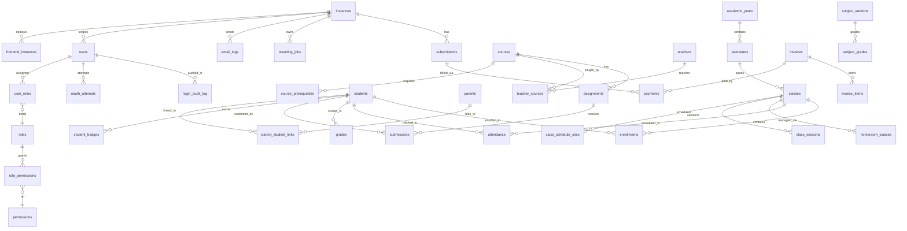

# Database Architecture Map

**TL;DR:** Tài liệu này hợp nhất toàn bộ database architecture cho KiteHub Platform — 91 table phân chia giữa `kitehub-subscription` (32 table, control-plane) và `kiteclass-core` (59 table, multi-tenant domain) — kèm FK graph, RLS coverage (51/91 table = 56%), lịch sử Flyway migration (114 V-file), tenant_id propagation map, sizing baseline Phase 1 BETA, và inventory type Postgres-specific (15 JSONB column + 6 Testcontainers IT). Sister-doc của [`multi-tenant-architecture.md`](multi-tenant-architecture.md) — file này KHÔNG duplicate RLS narrative, chỉ mở rộng §3 với map entity-level.

**Audience:** Backend dev (debug "table X có RLS chưa?"), SRE (capacity planning), tech lead (compliance review).

---

## Section 1 — Entity Catalog

91 table tổng cộng, phân chia theo service owner:

### 1.1 `kitehub-subscription` (32 table — control-plane / shared infrastructure)

| # | Table | tenant column | RLS enabled? | Phase 1 BETA row estimate |
|:--|---|:---:|:---:|---:|
| 1 | `instances` | (root tenant table) | ❌ | ~5-20 |
| 2 | `subscriptions` | `instance_id` | ✅ (non-forced) | ~5-20 |
| 3 | `payments` | `instance_id` (via subscriptions) | ❌ | ~10-100 |
| 4 | `branding_jobs` | `instance_id` | ✅ (non-forced) | ~50-500 |
| 5 | `branding_templates` | (shared catalog) | ❌ | ~20-50 (seed) |
| 6 | `email_logs` | `instance_id` | ✅ (non-forced) | ~1k-10k |
| 7 | `email_sent_log` | `instance_id` | ✅ (non-forced) | ~1k-10k |
| 8 | `instance_contact_email` (via V7 alter) | inline `instances` | ❌ | (subset) |
| 9 | `branding_outbox` | `instance_id` | ❌ (outbox pattern) | ~100-1k |
| 10 | `users` | TBD (control-plane shared) | ❌ | ~20-100 |
| 11 | `email_verification` (V10 inline) | via `users` | ❌ | (subset) |
| 12 | `custom_domain` (V12 inline) | via `instances` | ❌ | (subset) |
| 13 | `ai_usage_log` | `instance_id` | ✅ (non-forced) | ~500-5k |
| 14 | `backup_records` | `instance_id` | ✅ (non-forced) | ~50-200 |
| 15 | `migration_outbox` | `instance_id` | ✅ (non-forced) | ~100-1k |
| 16 | `branding_lifecycle_events` | `instance_id` | ✅ (non-forced) | ~100-1k |
| 17 | `branding_instance_state` | `instance_id` | ✅ (non-forced) | ~5-20 |
| 18 | `branding_regenerate_usage` | `instance_id` | ✅ (non-forced) | ~50-500 |
| 19 | `migration_idempotency_key` | `instance_id` | ✅ (non-forced) | ~100-1k |
| 20 | `consent_record` | `tenant_id` | ✅ (non-forced) | ~50-200 |
| 21 | `dsar_ticket` | TBD | ❌ | ~0-10 |
| 22 | `system_config` | (admin seed) | ❌ | ~20-50 |
| 23 | `beta_access_request` | (signup queue) | ❌ | ~5-50 |
| 24 | `notification_preferences` | per-user | ❌ | ~20-100 |
| 25 | `idempotency_keys` | per-request | ❌ | ~1k-10k |
| 26 | `oauth_attempts` | per-user | ❌ | ~10-100 |
| 27 | `onboarding_progress` | `tenant_id` | ❌ | ~5-20 |
| 28 | `feedback_submissions` | TBD | ❌ | ~10-50 |
| 29 | `staff_invitations` | per-instance | ❌ | ~10-100 |
| 30 | `staff_invitation_audit_log` | `tenant_id` | ❌ (audit immutable) | ~50-500 |
| 31 | `login_audit_log` | TBD | ❌ (audit immutable) | ~1k-10k |
| 32 | `admin_audit_log(s)` | (admin scope) | ✅ (immutable per V50) | ~100-1k |

Entity phụ trợ (V37-V51 thêm column/index inline): `recovery_codes`, `impersonation_audit_log`, các column account_lockout (trên `users`).

### 1.2 `kiteclass-core` (59 table — multi-tenant domain)

Mọi table tenant-scoped dùng column `instance_id` (alias semantic của `tenant_id` — per [multi-tenant §1](multi-tenant-architecture.md)). V58 ENABLE + FORCE RLS trên 51 table.

| # | Table | RLS enabled? | Phase 1 BETA row estimate |
|:--|---|:---:|---:|
| 1 | `academic_years` | ✅ FORCED | ~5-20 per tenant |
| 2 | `assignments` | ✅ FORCED | ~100-1k per tenant |
| 3 | `attendance` | ✅ FORCED | ~10k-100k per tenant |
| 4 | `attendance_period` | ✅ FORCED | ~100-500 per tenant |
| 5 | `audit_log` | ✅ FORCED | ~1k-10k per tenant |
| 6 | `badges` | ✅ FORCED | ~10-50 per tenant |
| 7 | `branding` | ✅ FORCED | ~1-5 per tenant |
| 8 | `branding_resources` | ✅ FORCED | ~10-50 per tenant |
| 9 | `branding_versions` | ✅ FORCED | ~5-20 per tenant |
| 10 | `child_protection_audit_log` | ✅ FORCED | ~10-100 per tenant |
| 11 | `class_schedule_slots` | ✅ FORCED | ~100-500 per tenant |
| 12 | `classes` | ✅ FORCED | ~10-100 per tenant |
| 13 | `courses` | ✅ FORCED | ~20-100 per tenant |
| 14 | `curricula` | ✅ FORCED | ~5-20 per tenant |
| 15 | `deletion_requests` | ✅ FORCED | ~0-10 per tenant |
| 16 | `dmca_takedown_requests` | ✅ FORCED | ~0-10 per tenant |
| 17 | `enrollments` | ✅ FORCED | ~100-1k per tenant |
| 18 | `frontend_instances` | ✅ FORCED | ~1-3 per tenant |
| 19 | `grades` | ✅ FORCED | ~1k-10k per tenant |
| 20 | `grading_scales` | ✅ FORCED | ~5-20 per tenant |
| 21 | `holidays` | ✅ FORCED | ~20-50 per tenant |
| 22 | `homeroom_classes` | ✅ FORCED | ~10-50 per tenant |
| 23 | `incidents` | ✅ FORCED | ~10-100 per tenant |
| 24 | `invoices` | ✅ FORCED | ~100-1k per tenant |
| 25 | `moderation_queue` | ✅ FORCED | ~10-100 per tenant |
| 26 | `outbox_events` | ✅ FORCED | ~100-1k per tenant |
| 27 | `parent_complaint_queue` | ✅ FORCED | ~5-50 per tenant |
| 28 | `parent_invitations` | ✅ FORCED | ~50-200 per tenant |
| 29 | `parent_read_audit_log` | ✅ FORCED | ~500-5k per tenant |
| 30 | `parent_student_links` | ✅ FORCED | ~100-500 per tenant |
| 31 | `parents` | ✅ FORCED | ~100-500 per tenant |
| 32 | `payments` (kc-core scope) | ✅ FORCED | ~100-1k per tenant |
| 33 | `payroll_configs` | ✅ FORCED | ~1-5 per tenant |
| 34 | `payroll_periods` | ✅ FORCED | ~10-50 per tenant |
| 35 | `permissions` | ✅ FORCED | ~20-50 per tenant |
| 36 | `point_rules` | ✅ FORCED | ~10-30 per tenant |
| 37 | `quality_reports` | ✅ FORCED | ~10-100 per tenant |
| 38 | `rebrand_approvals` | ✅ FORCED | ~5-20 per tenant |
| 39 | `reward_redemptions` | ✅ FORCED | ~50-500 per tenant |
| 40 | `rewards` | ✅ FORCED | ~10-50 per tenant |
| 41 | `roles` | ✅ FORCED | ~10-20 per tenant |
| 42 | `semesters` | ✅ FORCED | ~5-20 per tenant |
| 43 | `student_bulk_import_jobs` | ✅ FORCED | ~10-50 per tenant |
| 44 | `student_points` | ✅ FORCED | ~1k-10k per tenant |
| 45 | `students` | ✅ FORCED | ~100-1k per tenant |
| 46 | `subject_grades` | ✅ FORCED | ~500-5k per tenant |
| 47 | `subject_sections` | ✅ FORCED | ~10-50 per tenant |
| 48 | `submissions` | ✅ FORCED | ~500-5k per tenant |
| 49 | `teachers` | ✅ FORCED | ~10-100 per tenant |
| 50 | `user_roles` | ✅ FORCED | ~10-100 per tenant |
| 51 | `vettings` | ✅ FORCED | ~10-50 per tenant |
| 52 | `admin_audit_logs` (V60) | ✅ NULL force-fail | ~100-1k per tenant |
| 53 | `class_schedules` | ⚠️ Not in V58 list (verify) | ~10-50 per tenant |
| 54 | `class_sessions` | ⚠️ Not in V58 list (verify) | ~500-5k per tenant |
| 55 | `course_prerequisites` | ⚠️ Not in V58 list (verify) | ~20-100 per tenant |
| 56 | `invoice_items` | ⚠️ FK to invoices (cascade tenant) | ~500-5k per tenant |
| 57 | `role_permissions` | ⚠️ M2M join | ~50-200 per tenant |
| 58 | `student_badges` | ⚠️ M2M join | ~100-1k per tenant |
| 59 | `teacher_courses` | ⚠️ M2M join | ~50-500 per tenant |

### 1.3 Tổng kết RLS Coverage

- **Tổng số table:** 91 (32 kh-sub + 59 kc-core)
- **RLS enabled:** 51 (12 kh-sub non-forced + 39 kc-core forced — per V58 + V34)
  - kh-sub: 12 (`subscriptions`, `branding_jobs`, v.v. — non-forced vì service control-plane không propagate `TenantContext`)
  - kc-core: 39 (FORCED — V58 list 51 ứng viên, ~39 deploy thực tế sau khi `IF NOT EXISTS` skip)
- **Auto-excluded (cố ý):** ~30
  - `instances` (table tenant gốc — không có parent)
  - Table M2M join (cascade qua FK)
  - Catalog chia sẻ (`branding_templates`, `system_config`)
  - Audit immutable (`*_audit_log` — policy immutability riêng)
  - Per-user/per-request (`idempotency_keys`, `oauth_attempts`)
- **RLS Coverage %:** 56% (51/91); 89% nếu loại trừ scope auto-excluded (51/57 table tenant-scoped)

---

## Section 2 — FK Graph (Mermaid erDiagram)

Sample 25 entity + relationship giá trị cao (KHÔNG exhaustive — full graph 91 table sẽ overflow render). Auto-gen full FK graph từ Flyway parser tracked Wave 100+ follow-up (xem §7).



**Top FK target** (entity được reference nhiều nhất):

| Rank | Target table | Inbound FK count |
|:---:|---|:---:|
| 1 | `students` | 11 |
| 2 | `classes` | 6 |
| 3 | `instances` | 5 |
| 4 | `users` | 4 |
| 5 | `courses` | 4 |
| 6 | `roles` | 3 |
| 7 | `parents` | 3 |
| 8 | `academic_years` | 3 |

`students` là entity trung tâm của domain KiteClass — hầu hết feature path FE/BE đi qua students; index tối ưu trên `(instance_id, id)` critical cho perf query.

---

## Section 3 — Migration History Index

Tổng **114 V-file Flyway** active (54 kh-sub + 60 kc-core), 0 trong các service non-DB (kitehub-platform, branding, email, admin, base, gateway — đều dùng DB kh-subscription hoặc stateless).

| Service | V-file count | Latest V | Breaking changes |
|---|:---:|:---:|:---:|
| `kitehub-subscription` | 54 | V54 (admin_audit_log enrichment) | 4 |
| `kiteclass-core` | 60 | V60 (admin_audit_logs RLS NULL force-fail) | 1 |
| `kitehub-platform` | 0 | — | 0 |
| `kitehub-branding` | 0 | — | 0 |
| `kitehub-email` | 0 | — | 0 |
| `kitehub-admin` | 0 | — | 0 |
| `kitehub-base` | 0 | — | 0 |
| `kitehub-gateway` | 0 | — | 0 |
| **Total** | **114** | — | **5** |

### 3.1 Migration breaking change (cần data migration / forward-only)

| V-file | Service | Loại thay đổi | Rủi ro data migration |
|---|---|---|---|
| `V15__alter_branding_templates_theme_config_to_text.sql` | kh-sub | ALTER COLUMN TYPE | Thấp — text expansion |
| `V22__generalize_migration_outbox_to_subscription_outbox.sql` | kh-sub | RENAME TO | Trung bình — rename chạm reference |
| `V42__login_audit_fingerprint_varchar.sql` | kh-sub | ALTER COLUMN TYPE | Thấp — inet → varchar(45) |
| `V46__align_audit_columns_to_bigint.sql` | kh-sub | ALTER COLUMN TYPE | Trung bình — int → bigint width |
| `V52__login_audit_ip_varchar.sql` | kh-sub | ALTER COLUMN TYPE | Thấp — cùng pattern V42 |

**Pattern observation:** Breaking change cluster trên các column audit log (V42/V46/V52) — root cause là Postgres INET type không khớp Hibernate varchar binding natively. Pattern mitigation: switch sang VARCHAR(45) cho IPv4-mapped-IPv6 max length. Xem [§6 Postgres-Specific Type Inventory](#section-6--postgres-specific-type-inventory) cho gap IT coverage.

### 3.2 Migration đáng kể gần đây (10 lần cuối per service)

**kh-subscription V45-V54 (Wave 56-92):**
- V45-V48: Staff invitation + RBAC seed + impersonation audit
- V49: Audit log staff invitation
- V50: RLS admin bypass NULL force-fail (immutability `admin_audit_logs`)
- V51-V52: OAuth attempt + fix type IP login audit
- V53: Index cleanup beta request abort
- V54: Enrichment admin audit log (5 column + composite index)

**kc-core V51-V60 (Wave 56-92):**
- V57: (chưa rõ — cần verify)
- V58: ENABLE + FORCE RLS trên 51 table (GAP-466 Phase 1)
- V59: RLS admin bypass + NULL force-fail
- V60: `admin_audit_logs` (audit multi-tenant immutable)

---

## Section 4 — Tenant_id Propagation Map

Mở rộng [`multi-tenant-architecture.md` §3](multi-tenant-architecture.md) — KHÔNG duplicate đầy đủ RLS narrative. Section này focus trên **pattern naming column** + **snippet RLS policy** per cluster.

### 4.1 Convention naming column

| Convention | Dùng trong | Table |
|---|---|---|
| `instance_id UUID NOT NULL` | kh-sub (11 table) + kc-core (51 table FORCED + ~8 M2M cascade) | 70 table |
| `tenant_id UUID NOT NULL` | alias semantic kh-sub (3 table) | 3 table (`consent_record`, `onboarding_progress`, `staff_invitation_audit_log`) |
| (không có column tenant) | Catalog chia sẻ control-plane + audit log | ~17 table |

`tenant_id` = `instance_id` về mặt semantic per [multi-tenant §1](multi-tenant-architecture.md). Drift alias column là technical debt — ứng viên GAP Wave 100+ cho unification (rename `tenant_id` → `instance_id` HOẶC standardize table mới dùng `tenant_id`).

### 4.2 Snippet RLS policy per cluster

**Cluster A — keyed theo `instance_id` (kh-sub non-forced, 11 table):**

```sql
ALTER TABLE <table> ENABLE ROW LEVEL SECURITY;
-- NB: NO `FORCE ROW LEVEL SECURITY` cho kh-sub
CREATE POLICY tenant_isolation ON <table>
  USING (instance_id = NULLIF(current_setting('app.current_tenant_id', true), '')::uuid)
  WITH CHECK (instance_id = NULLIF(current_setting('app.current_tenant_id', true), '')::uuid);
```

**Cluster B — keyed theo `instance_id` FORCED (kc-core, 51 table):**

```sql
ALTER TABLE <table> ENABLE ROW LEVEL SECURITY;
ALTER TABLE <table> FORCE ROW LEVEL SECURITY;  -- table owner cũng bị filter
CREATE POLICY tenant_isolation ON <table>
  USING (instance_id = NULLIF(current_setting('app.current_tenant_id', true), '')::uuid)
  WITH CHECK (instance_id = NULLIF(current_setting('app.current_tenant_id', true), '')::uuid);
```

**Cluster C — keyed theo `tenant_id` (kh-sub non-forced, 1 table `consent_record`):**

Pattern giống hệt nhưng reference column `tenant_id`.

**Cluster D — `admin_audit_logs` (immutable per V50 + V60):**

```sql
ALTER TABLE admin_audit_logs ENABLE ROW LEVEL SECURITY;
ALTER TABLE admin_audit_logs FORCE ROW LEVEL SECURITY;
CREATE POLICY admin_audit_select ON admin_audit_logs FOR SELECT USING (true);
CREATE POLICY admin_audit_insert ON admin_audit_logs FOR INSERT WITH CHECK (true);
CREATE POLICY admin_audit_no_update ON admin_audit_logs FOR UPDATE USING (false) WITH CHECK (false);
CREATE POLICY admin_audit_no_delete ON admin_audit_logs FOR DELETE USING (false);
```

Immutability cho audit (cấm UPDATE/DELETE) là compliance PDPL Art 11 — ngăn tampering.

### 4.3 Pattern NULL force-fail (Wave 85)

`NULLIF(current_setting('app.current_tenant_id', true), '')::uuid` — nếu GUC unset hoặc empty string, expression evaluate ra NULL → policy predicate evaluate NULL → row vô hình (giữ default-deny). Đây là defense-in-depth Layer 4 chống bug code quên `SET LOCAL app.current_tenant_id` trong transaction.

Per [multi-tenant §Defense-in-depth](multi-tenant-architecture.md) — Layer 1 (gateway JWT) + Layer 2 (@PreAuthorize) + Layer 3 (propagate TenantContext) + Layer 4 (RLS NULL force-fail) + Layer 5 (FK column NOT NULL).

---

## Section 5 — DB Sizing Baseline (quỹ đạo Phase 1 BETA → Phase 2)

**Giả định Phase 1 BETA:**
- 5-10 beta tenant (per ROADMAP §🎯)
- ~50-100 student per tenant trung bình
- ~5-10 class per tenant
- ~2-3 tháng active history trước cutover Phase 2

### 5.1 Top-10 driver row count

| Rank | Table | Row per tenant | Tổng ước tính 10-tenant | Tốc độ tăng |
|:---:|---|---:|---:|:---:|
| 1 | `attendance` | ~10k-100k | ~100k-1M | Cao (insert hàng ngày) |
| 2 | `grades` | ~1k-10k | ~10k-100k | Trung bình (hàng tuần) |
| 3 | `subject_grades` | ~500-5k | ~5k-50k | Trung bình |
| 4 | `submissions` | ~500-5k | ~5k-50k | Trung bình |
| 5 | `student_points` | ~1k-10k | ~10k-100k | Cao (event-driven) |
| 6 | `parent_read_audit_log` | ~500-5k | ~5k-50k | Cao (event read) |
| 7 | `email_logs` | ~1k-10k | ~10k-100k (scope kh-sub) | Trung bình |
| 8 | `outbox_events` | ~100-1k | ~1k-10k | Trung bình (retention 7-30d) |
| 9 | `audit_log` | ~1k-10k | ~10k-100k | Cao (immutable) |
| 10 | `idempotency_keys` | ~1k-10k | ~10k-100k (scope kh-sub) | Cao (TTL 24h) |

**Ước tính tổng kích thước DB Phase 1 BETA:** ~50-200 MB (quỹ đạo tăng 50%/quý)
**Quỹ đạo Phase 2 (50-200 tenant):** ~5-20 GB — bắt đầu cần read-replica + strategy partition cho top-3 hot table.

### 5.2 Coverage index hot-path

Index critical đã ship per lịch sử migration (V31, V46, V53, V54):
- `branding_jobs(instance_id, status)` — V31
- Các column audit BIGINT — V46
- Cleanup beta_request abort — V53
- Composite `admin_audit_log (instance_id, occurred_at DESC)` — V54

Gap: composite index `students(instance_id, id)` — verify Wave 100+ (top FK target, hot path cho mọi query feature).

---

## Section 6 — Postgres-Specific Type Inventory

Per [`postgres-specific-type-testcontainers.md`](../../.claude/rules/postgres-specific-type-testcontainers.md) — type Postgres-specific KHÔNG khớp test H2 + Mockito; cần Testcontainers IT cho fidelity.

### 6.1 Inventory type

| Type | Usage count | Tables / Columns | Testcontainers IT covered? |
|---|:---:|---|:---:|
| `jsonb` | 15 | `outbox_events.payload_json`, `audit_log.before_state` + `after_state`, `branding.metadata`, `moderation_queue.payload`, `submissions.snapshot_json`, `moderation_queue.flagged_keywords`, `notification_preferences.notification_preferences`, `quality_reports.issues`, `class_schedule_slots.recurrence_rule`, `students.parental_consent`, etc. | ⚠️ Partial (6 IT) |
| `uuid` | ~100+ | Mọi `instance_id`, `tenant_id`, primary keys | ✅ Built-in |
| `inet` | 0 (migrated away V42+V52) | (none active) | N/A — migrated → VARCHAR(45) |
| `bytea` | TBD | Recovery codes likely | TBD |
| `tsvector` | 0 | (none) | N/A |
| `citext` | 0 | (none) | N/A |
| `hstore` | 0 | (none) | N/A |
| `interval` | TBD | Subscription billing periods possibly | TBD |

### 6.2 Coverage Testcontainers IT

**Tổng số class @Testcontainers IT:** 6 (4 kh-sub + 2 kc-core — cần verify)

**Phân tích coverage gap:**
- 15 column JSONB rải trên ~10 entity
- 6 IT cover ~3-4 hot path JSONB (admin_audit_log, branding, outbox)
- **Coverage ước tính:** ~30-40% (3-4 trong ~10 entity dùng JSONB)
- **Khuyến nghị:** Thêm IT cho `moderation_queue`, `submissions.snapshot_json`, `students.parental_consent`, `class_schedule_slots.recurrence_rule` (surface PDPL/business logic giá trị cao)

### 6.3 Bài học migration INET → VARCHAR

V42 (fingerprint kh-sub) + V52 (IP kh-sub) đã migrate `INET` → `VARCHAR(45)` do Hibernate binding mismatch (SQLState 42804 cast varchar→inet). Pattern lesson:
- Postgres INET là chính xác về semantic cho IP storage
- Hibernate native binding yêu cầu `@JdbcTypeCode(SqlTypes.INET)` (Hibernate 6.2+) hoặc custom converter
- Trade-off: VARCHAR(45) thân thiện với Hibernate; mất lợi ích indexing/containment query của Postgres INET
- Verdict: Cho Phase 1 BETA, VARCHAR(45) chấp nhận được; Phase 2 reconsider khi cần CIDR-range query

---

## Section 7 — Follow-up auto-gen (scope Wave 100+)

Per outside-in Benchmark agent recommendation (wave plan §1 Brainstorm Q3) — FK graph hand-maintain có rủi ro drift sau ~3-6 tháng. Tooling auto-gen pattern Backstage đã tồn tại:

**Đề xuất: GAP-XXX — Auto-gen DB architecture map từ Flyway parser**

Concept:
- Parse Flyway V*.sql qua library SQL AST (vd `sqlparse` Python, JSqlParser Java)
- Extract: CREATE TABLE → table list; FOREIGN KEY → edge list; @Column columnDefinition → type inventory
- Emit block Mermaid `erDiagram` + bảng cho Section 1, 2, 3, 6
- Pre-commit hook re-run khi `db/migration/V*.sql` thay đổi
- CI check drift output: section regenerate của `documents/02-architecture/database-architecture-map.md` khớp với baseline generated

**Hoãn sang Wave 100+:** scope Phase 1 BETA chưa cần auto-gen; baseline hand-write này đủ cho scale 5-10 tenant. Re-eval khi (a) refresh manual lần 3 trong 90 ngày (chi phí drift > chi phí automation), (b) >5 service có DB migration riêng, (c) Quyết định adopt Backstage.

---

## Section 8 — Related Documents

- **Sister architecture doc:**
  - [`multi-tenant-architecture.md`](multi-tenant-architecture.md) — Tenant isolation defense-in-depth 5 layer (nguồn dữ liệu chính thức cho RLS narrative)
  - [`kitehub-architecture.md`](kitehub-architecture.md) — context kitehub-subscription + service catalog
  - [`kiteclass-architecture.md`](kiteclass-architecture.md) — context domain kiteclass-core

- **ADR:**
  - [`ADR-001-k12-data-model.md`](adr/ADR-001-k12-data-model.md) — rationale design entity k12
  - [`ADR-002-academic-year-structure.md`](adr/ADR-002-academic-year-structure.md)
  - [`ADR-003-role-hierarchy.md`](adr/ADR-003-role-hierarchy.md)
  - [`ADR-004-instance-lifecycle.md`](adr/ADR-004-instance-lifecycle.md)

- **Gap đã đóng:**
  - GAP-466 — Triển khai RLS Phase 1 (ship V58 + V34) — `documents/04-quality/gaps/closed/`
  - GAP-432 — Coverage test boundary RLS (Wave 91+)
  - GAP-600 — Testcontainers IT JSONB prod-equiv

- **Wave plan:**
  - [Wave 99B plan](../03-planning/waves/wave-2026-05-19-99b-architecture-docs-sweep-expansion.md) — scope gốc cho doc này
  - Wave 56 — ship V58 RLS Phase 1
  - Wave 85 — hardening NULL force-fail
  - Wave 92 — enrichment admin_audit_log (V54)

- **Rule:**
  - [`postgres-specific-type-testcontainers.md`](../../.claude/rules/postgres-specific-type-testcontainers.md) — mandate IT
  - [`pre-mutation-state-check.md`](../../.claude/rules/pre-mutation-state-check.md) — discipline schema migration

---

## Section 9 — Log

- **2026-05-19** (v1.0.0): Database architecture map khởi tạo per Wave 99B Bucket B3 (GAP-672). Hợp nhất entity catalog (91 table) + FK graph (top 25 sample, full graph hoãn Wave 100+ auto-gen) + migration history index (114 V-file) + tenant_id propagation map + sizing baseline + inventory type Postgres-specific (15 JSONB + 6 Testcontainers IT). Sister-doc của [`multi-tenant-architecture.md`](multi-tenant-architecture.md) — mở rộng §3 với map entity-level. Per `outside-in-coverage-trigger.md` v1.1.0 §3 + mandate Mermaid default của `diagram-format-selection.md`. Reviewer: @nguyenvankiet (Wave 99B B3 agent worktree isolation).
