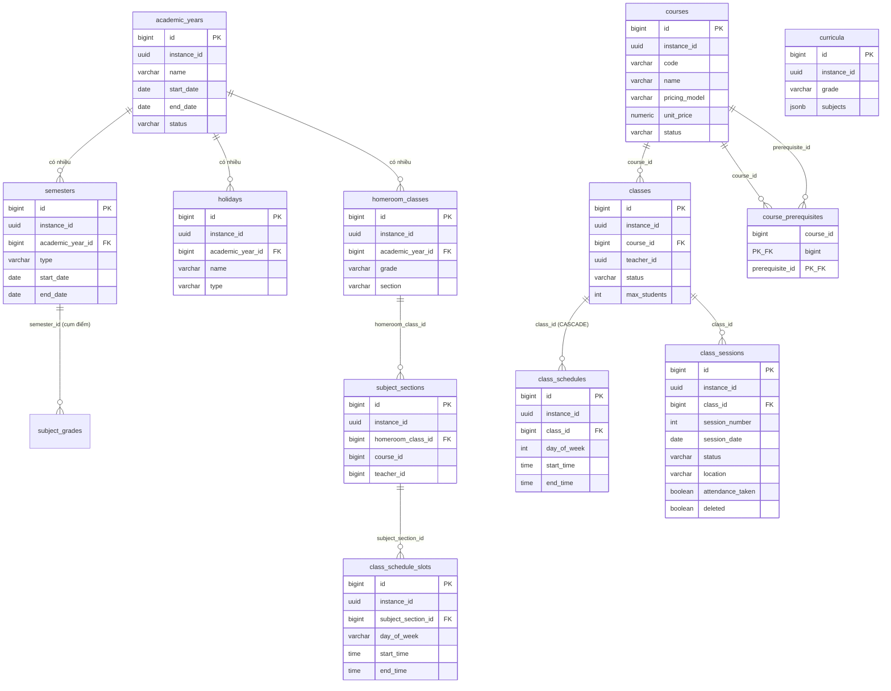

# KiteClass DB Schema — Cụm "Cấu trúc học vụ"

> **Nguồn chân lý:** Flyway migrations `kiteclass/kiteclass-core/src/main/resources/db/migration/V*.sql` + JPA entities `kiteclass/kiteclass-core/src/main/java/com/kiteclass/core/module/**/entity/*.java`. Tài liệu này tổng hợp schema THỰC TẾ sau khi áp dụng toàn bộ chuỗi migration V1 → V77 (tính tới 2026-06-02). Nếu phát hiện lệch so với code, code là nguồn chân lý — cập nhật tài liệu này trong cùng PR.

## TL;DR

Cụm này gồm **12 bảng** mô tả khung tổ chức học vụ của một trường/trung tâm (1 tenant = 1 instance):

- **Khung thời gian:** `academic_years` (niên khóa) → `semesters` (học kỳ HK1/HK2/SUMMER) → `holidays` (ngày nghỉ).
- **Định nghĩa môn học/khóa học:** `courses` (khóa học/môn học, là template) + `course_prerequisites` (môn tiên quyết, self-reference) + `curricula` (chương trình học K-12, JSONB danh sách môn theo khối).
- **Mô hình trung tâm (center model):** `classes` (lớp = 1 thể hiện của course) → `class_schedules` (lịch tuần lặp legacy) + `class_sessions` (buổi học cụ thể).
- **Mô hình trường K-12 (Strangler Fig, song song với center model):** `homeroom_classes` (lớp chính, vd 10A1) → `subject_sections` (lớp bộ môn = 1 môn của 1 lớp chính) → `class_schedule_slots` (slot lịch tuần có cấu trúc).

**Đa tenant:** 11/12 bảng có cột `instance_id UUID` và bật **RLS FORCED** (Row-Level Security) từ migration V58/V59 — DB tự lọc theo `app.current_tenant_id`. Hai bảng con `class_schedules` và `class_sessions` cùng bảng nối `course_prerequisites` KHÔNG có `instance_id` (scope gián tiếp qua FK tới `classes`/`courses`).

**Soft-delete:** hầu hết bảng dùng cờ `deleted BOOLEAN` (filter `deleted = FALSE`). Wave 14 (V79) đã thêm `deleted` cho `class_sessions`. Ngoại lệ còn lại: `class_schedules`, `course_prerequisites` không có cờ này (bảng nối/legacy thuần).

> ✅ **Cập nhật Wave 14 (post-fix):** `class_sessions` đã được V79 thêm `instance_id`/`location`/`attendance_taken`/`deleted` + RLS FORCED (GAP-908 — hết drift NẶNG entity↔DB). `class_schedules` được V84 thêm `instance_id` + RLS FORCED (GAP-908). `courses` được V85 drop 3 cột legacy zero-usage (`thumbnail_url`/`suggested_tuition`/`default_sessions` — GAP-909). Money columns (`courses.price`, `classes.tuition_amount`, `enrollments.tuition_amount`/`final_amount`) chuẩn hóa NUMERIC(19,2) + timestamp naive → TIMESTAMPTZ (V86 — GAP-883/878). Xem §"Ghi chú schema (anomalies)" để biết phần nào còn lệch (actor BIGINT `courses.teacher_id`/`subject_sections.teacher_id`/`homeroom_classes.homeroom_teacher_id` ⏸️ Deferred → GAP-877/886).

**Audit columns:** cột `created_by` / `updated_by` của TẤT CẢ bảng đã được migration V73 (GAP-795) đổi sang kiểu **UUID** (lưu `X-User-Id` = JWT `sub` claim), KHÔNG còn là BIGINT/VARCHAR như khai báo ban đầu.

---

## ERD — quan hệ nội cụm

> **FK liên cụm (cross-cluster) — chỉ ghi chú text, không vẽ trong ERD trên:**
> - `classes.teacher_id` (UUID) → KHÔNG còn là FK; lưu `X-User-Id` UUID của giáo viên (V73 drop FK cũ tới `teachers`).
> - `courses.teacher_id` (BIGINT) → `teachers.id` (cụm Người dùng/giáo viên) — giáo viên tạo course.
> - `homeroom_classes.homeroom_teacher_id` (BIGINT) → `teachers.id` (soft reference, không FK DB).
> - `subject_sections.teacher_id` (BIGINT) → `teachers.id` (soft reference); `subject_sections.course_id` → `courses` (cùng cụm).
> - `enrollments.class_id` → `classes` ; `attendance.session_id` → `class_sessions` ; `grades.class_id` → `classes` ; `invoices.class_id` → `classes` — tất cả thuộc các cụm khác (Tuyển sinh, Điểm danh, Điểm số, Tài chính) tham chiếu vào cụm này.
> - `subject_grades.subject_section_id` → `subject_sections` ; `subject_grades.semester_id` → `semesters` (cụm Điểm số K-12 tham chiếu vào cụm này).

---

## `academic_years`

**Mục đích:** Niên khóa (năm học) — cấu trúc tổ chức cấp cao nhất cho trường K-12 và đại học. Mỗi tenant có nhiều niên khóa (vd "2026-2027"), nhưng tại một thời điểm chỉ có 1 niên khóa `CURRENT`. Là Aggregate Root chứa các `semesters` và `holidays` (ADR-002).

| Cột | Kiểu | Null | Default | Khóa/Index | Ý nghĩa |
|-----|------|:----:|---------|-----------|---------|
| `id` | BIGSERIAL | NO | (sequence) | PK | Khóa chính tự tăng |
| `instance_id` | UUID | NO | — | Index, RLS | Tenant ID (trường nào) |
| `name` | VARCHAR(50) | NO | — | UNIQUE (instance_id, name) khi `deleted=false` | Tên niên khóa, vd "2026-2027" |
| `start_date` | DATE | NO | — | — | Ngày bắt đầu (thường đầu tháng 9 — khai giảng) |
| `end_date` | DATE | NO | — | CHECK `end_date > start_date` | Ngày kết thúc (thường giữa tháng 6) |
| `status` | VARCHAR(20) | NO | `'UPCOMING'` | Index; CHECK ∈ (UPCOMING, CURRENT, COMPLETED) | Trạng thái: `UPCOMING` (chưa tới), `CURRENT` (đang diễn ra), `COMPLETED` (đã xong, điểm đã chốt) |
| `created_at` | TIMESTAMP | NO | `CURRENT_TIMESTAMP` | — | Thời điểm tạo |
| `updated_at` | TIMESTAMP | NO | `CURRENT_TIMESTAMP` | — | Thời điểm cập nhật cuối |
| `created_by` | UUID | YES | — | — | User UUID tạo (V73; gốc VARCHAR(100)) |
| `updated_by` | UUID | YES | — | — | User UUID cập nhật cuối (V73) |
| `version` | BIGINT | NO | `0` | — | Optimistic locking |
| `deleted` | BOOLEAN | NO | `FALSE` | Index | Cờ xóa mềm |

**Quan hệ:**
- Outbound: không có (gốc cụm).
- Inbound: `semesters.academic_year_id`, `holidays.academic_year_id`, `homeroom_classes.academic_year_id` → `academic_years.id` (1 niên khóa → N học kỳ / N ngày nghỉ / N lớp chính).

**RLS + ghi chú:** Tenant-scoped (`instance_id` + RLS FORCED V58/V59). Soft-delete qua `deleted`. Không có cột JSONB. Unique quan trọng: `(instance_id, name)` khi chưa xóa.

---

## `semesters`

**Mục đích:** Học kỳ trong một niên khóa. Theo bối cảnh giáo dục VN: `HK1` (Sep–Jan), `HK2` (Feb–Jun), `SUMMER` (Jul–Aug, tùy chọn). Mỗi học kỳ có thể có giai đoạn thi (`exam_start_date`/`exam_end_date`).

| Cột | Kiểu | Null | Default | Khóa/Index | Ý nghĩa |
|-----|------|:----:|---------|-----------|---------|
| `id` | BIGSERIAL | NO | (sequence) | PK | Khóa chính |
| `instance_id` | UUID | NO | — | Index, RLS | Tenant ID |
| `academic_year_id` | BIGINT | NO | — | FK → `academic_years(id)`; UNIQUE (academic_year_id, type) khi `deleted=false` | Niên khóa cha |
| `type` | VARCHAR(20) | NO | — | CHECK ∈ (HK1, HK2, SUMMER) | Loại học kỳ: `HK1`, `HK2`, `SUMMER` |
| `name` | VARCHAR(100) | YES | — | — | Tên hiển thị, vd "HK1 năm học 2026-2027" |
| `start_date` | DATE | NO | — | CHECK `end_date > start_date` | Ngày bắt đầu học kỳ |
| `end_date` | DATE | NO | — | (cùng CHECK trên) | Ngày kết thúc học kỳ |
| `exam_start_date` | DATE | YES | — | CHECK (cùng có/cùng null + `exam_end_date >= exam_start_date`) | Ngày bắt đầu thi (tùy chọn) |
| `exam_end_date` | DATE | YES | — | (cùng CHECK) | Ngày kết thúc thi (tùy chọn) |
| `created_at` | TIMESTAMP | NO | `CURRENT_TIMESTAMP` | — | Thời điểm tạo |
| `updated_at` | TIMESTAMP | NO | `CURRENT_TIMESTAMP` | — | Thời điểm cập nhật cuối |
| `created_by` | UUID | YES | — | — | User UUID tạo (V73; gốc VARCHAR(100)) |
| `updated_by` | UUID | YES | — | — | User UUID cập nhật cuối (V73) |
| `version` | BIGINT | NO | `0` | — | Optimistic locking |
| `deleted` | BOOLEAN | NO | `FALSE` | Index | Cờ xóa mềm |

**Quan hệ:**
- Outbound: `academic_year_id` → `academic_years(id)` (N học kỳ thuộc 1 niên khóa).
- Inbound: `subject_grades.semester_id` → `semesters.id` (cụm Điểm số K-12) — điểm môn học gắn với học kỳ.

**RLS + ghi chú:** Tenant-scoped (RLS FORCED). Soft-delete. Unique `(academic_year_id, type)` đảm bảo mỗi niên khóa chỉ có 1 HK1/HK2/SUMMER.

---

## `holidays`

**Mục đích:** Ngày nghỉ trong một niên khóa (quốc gia, trường, tôn giáo). Khi tenant tạo niên khóa, hệ thống tự seed các ngày nghỉ lễ quốc gia VN (Tết Dương lịch, Tết Nguyên đán, Giỗ tổ Hùng Vương, 30/4–1/5, Quốc khánh 2/9) ở tầng ứng dụng (`HolidayService.seedVnNationalHolidays()`).

| Cột | Kiểu | Null | Default | Khóa/Index | Ý nghĩa |
|-----|------|:----:|---------|-----------|---------|
| `id` | BIGSERIAL | NO | (sequence) | PK | Khóa chính |
| `instance_id` | UUID | NO | — | Index, RLS | Tenant ID |
| `academic_year_id` | BIGINT | NO | — | FK → `academic_years(id)`; Index (year, dates) | Niên khóa cha |
| `name` | VARCHAR(100) | NO | — | — | Tên ngày nghỉ, vd "Tết Nguyên đán" |
| `start_date` | DATE | NO | — | CHECK `end_date >= start_date`; Index (start, end) | Ngày bắt đầu nghỉ |
| `end_date` | DATE | NO | — | (cùng CHECK) | Ngày kết thúc nghỉ (có thể trùng start = nghỉ 1 ngày) |
| `type` | VARCHAR(20) | NO | `'NATIONAL'` | CHECK ∈ (NATIONAL, SCHOOL, RELIGIOUS) | Loại: `NATIONAL` (lễ quốc gia), `SCHOOL` (riêng trường, vd ngày thành lập), `RELIGIOUS` (tôn giáo) |
| `description` | VARCHAR(500) | YES | — | — | Mô tả thêm |
| `created_at` | TIMESTAMP | NO | `CURRENT_TIMESTAMP` | — | Thời điểm tạo |
| `updated_at` | TIMESTAMP | NO | `CURRENT_TIMESTAMP` | — | Thời điểm cập nhật cuối |
| `created_by` | UUID | YES | — | — | User UUID tạo (V73; gốc VARCHAR(100)) |
| `updated_by` | UUID | YES | — | — | User UUID cập nhật cuối (V73) |
| `version` | BIGINT | NO | `0` | — | Optimistic locking |
| `deleted` | BOOLEAN | NO | `FALSE` | Index | Cờ xóa mềm |

**Quan hệ:**
- Outbound: `academic_year_id` → `academic_years(id)` (N ngày nghỉ thuộc 1 niên khóa).
- Inbound: không có.

**RLS + ghi chú:** Tenant-scoped (RLS FORCED). Soft-delete. Không JSONB. Ngày nghỉ dùng để loại trừ khi sinh buổi học từ lịch tuần.

---

## `courses`

**Mục đích:** Định nghĩa khóa học / môn học — đóng vai trò "template". Trong mô hình trung tâm, mỗi course sinh ra nhiều `classes`. Trong mô hình K-12, một course đại diện cho 1 môn học (vd "Toán") được gắn vào nhiều `subject_sections`. Bảng này tích lũy nhiều cột qua các migration (V1 → V27 → V67/V70).

| Cột | Kiểu | Null | Default | Khóa/Index | Ý nghĩa |
|-----|------|:----:|---------|-----------|---------|
| `id` | BIGSERIAL | NO | (sequence) | PK | Khóa chính |
| `instance_id` | UUID | NO | — | Index, RLS | Tenant ID |
| `code` | VARCHAR(50) | NO | — | UNIQUE (instance_id, code) | Mã khóa học, vd "ENG-B1-001", "TOEIC-600" |
| `name` | VARCHAR(255) | NO | — | Index | Tên khóa học (entity giới hạn 200) |
| `description` | TEXT | YES | — | — | Mô tả chi tiết |
| `category` | VARCHAR(100) | YES | — | Index | Phân loại/lĩnh vực, vd "math", "english" |
| ~~`thumbnail_url`~~ | — | — | — | — | **✅ DROPPED V85 (GAP-909)** — cột legacy V1 zero-usage; entity dùng `cover_image_url` |
| ~~`suggested_tuition`~~ | — | — | — | — | **✅ DROPPED V85 (GAP-909)** — cột legacy V1 zero-usage |
| ~~`default_sessions`~~ | — | — | — | — | **✅ DROPPED V85 (GAP-909)** — cột legacy V1 zero-usage |
| `status` | VARCHAR(50) | YES | `'active'` (V1) | Index | Trạng thái. Entity ánh xạ `CourseStatus`: `DRAFT` (Bản nháp), `PUBLISHED` (Đã xuất bản), `ARCHIVED` (Đã lưu trữ) |
| `created_at` | TIMESTAMP WITH TIME ZONE | NO | `CURRENT_TIMESTAMP` | — | Thời điểm tạo |
| `updated_at` | TIMESTAMP WITH TIME ZONE | NO | `CURRENT_TIMESTAMP` | — | Thời điểm cập nhật cuối |
| `created_by` | UUID | YES | — | — | User UUID tạo (V73; gốc BIGINT) |
| `updated_by` | UUID | YES | — | — | User UUID cập nhật cuối (V26 thêm BIGINT → V73 UUID) |
| `version` | BIGINT | YES | `0` (V63) | — | Optimistic locking (V26 thêm, V63 set default) |
| `deleted` | BOOLEAN | YES | `FALSE` | Index | Cờ xóa mềm |
| `teacher_id` | BIGINT | YES | — | Index | ID giáo viên tạo course → `teachers.id` (V27). LƯU Ý: cột này VẪN là BIGINT (V73 chỉ đổi `classes.teacher_id`; Wave 14 KHÔNG sweep — ⏸️ Deferred → GAP-877/886) |
| `syllabus` | TEXT | YES | — | — | Giáo trình theo tuần (V27) |
| `objectives` | TEXT | YES | — | — | Mục tiêu học tập (V27) |
| `prerequisites` | TEXT | YES | — | — | Điều kiện tiên quyết dạng text tự do (V27) — KHÁC với bảng nối `course_prerequisites` |
| `target_audience` | TEXT | YES | — | — | Đối tượng mục tiêu (V27) |
| `duration_weeks` | INTEGER | YES | — | — | Thời lượng (tuần) (V27) |
| `total_sessions` | INTEGER | YES | — | — | Tổng số buổi (V27) |
| `price` | NUMERIC(19,2) | YES | — | — | Giá khóa học (V27; V86 chuẩn hóa DECIMAL(15,2)→NUMERIC(19,2) — GAP-883). **@Deprecated** Wave br-4 nhưng GIỮ LẠI (V85 — còn ref bởi CourseMapper/IT fixtures); code mới KHÔNG ghi, dùng `pricing_model`+`unit_price` |
| `cover_image_url` | VARCHAR(500) | YES | — | — | URL ảnh bìa (V27; entity dùng cột này thay `thumbnail_url`) |
| `level` | VARCHAR(50) | YES | — | — | Cấp độ: "Beginner", "Intermediate", "Advanced" (V27) |
| `pricing_model` | VARCHAR(30) | NO | `'PER_HOUR'` (V70) | CHECK ∈ (PER_HOUR, MONTHLY, COURSE_PACKAGE, FREE) | Mô hình giá (V67, ADR-035): `PER_HOUR` (theo giờ — chuẩn TT tiếng Anh VN), `MONTHLY` (theo tháng), `COURSE_PACKAGE` (theo khóa), `FREE` (miễn phí/demo). V67 backfill dòng cũ = `COURSE_PACKAGE` |
| `unit_price` | NUMERIC(19,2) | NO | `0` | CHECK `>= 0`; CHECK (`FREE` ⇒ 0) | Đơn giá (VND), nghĩa phụ thuộc `pricing_model`: đ/giờ, đ/tháng, đ/khóa, hoặc 0 (V67) |

**Quan hệ:**
- Outbound: `teacher_id` (BIGINT) → `teachers.id` (cross-cluster, giáo viên tạo course).
- Inbound: `classes.course_id` → `courses(id)`; `course_prerequisites.course_id` + `.prerequisite_id` → `courses(id)` (self M:N); `subject_sections.course_id` → `courses(id)` (soft ref); `teacher_courses.course_id` → `courses(id)`.

**RLS + ghi chú:** Tenant-scoped (RLS FORCED). Soft-delete. Có 3 CHECK quanh pricing. Có lịch sử migration dài (cột tích lũy V1/V27/V67/V70). **Cập nhật Wave 14:** V85 (GAP-909) đã DROP 3 cột legacy zero-usage `thumbnail_url`/`suggested_tuition`/`default_sessions` — entity giờ dùng `cover_image_url` (V27, còn lại); `price` GIỮ (@Deprecated, V86 chuẩn hóa NUMERIC(19,2)). `R67__undo_pricing_model.sql` là script rollback THỦ CÔNG (KHÔNG tự áp dụng bởi Flyway — xem A7).

---

## `course_prerequisites`

**Mục đích:** Bảng nối M:N tự tham chiếu giữa `courses` — định nghĩa môn/khóa tiên quyết. Vd "Đại số 2" có tiên quyết là "Đại số 1". Ánh xạ qua `@ManyToMany` trong `Course` entity (`prerequisiteCourses`/`dependentCourses`); chống vòng lặp ở tầng ứng dụng (thuật toán DFS).

| Cột | Kiểu | Null | Default | Khóa/Index | Ý nghĩa |
|-----|------|:----:|---------|-----------|---------|
| `course_id` | BIGINT | NO | — | PK (course_id, prerequisite_id); FK → `courses(id)` | Khóa học cần có tiên quyết |
| `prerequisite_id` | BIGINT | NO | — | PK (cùng); FK → `courses(id)` | Khóa học là tiên quyết |

**Quan hệ:**
- Outbound: cả `course_id` và `prerequisite_id` → `courses(id)`.
- Inbound: không.
- Cardinality: M:N tự tham chiếu trên `courses`.

**RLS + ghi chú:** **KHÔNG tenant-scoped** (không có `instance_id` → không nằm trong danh sách RLS V58). Cô lập tenant gián tiếp vì cả hai FK trỏ tới `courses` (đã RLS). **Không có cột audit / soft-delete / version** — đây là bảng nối thuần (chỉ 2 cột PK composite). Tạo idempotent ở V27 (`CREATE TABLE IF NOT EXISTS`); V21/V22 là no-op.

---

## `curricula`

**Mục đích:** Chương trình học (mô hình K-12) — định nghĩa danh sách môn học cho mỗi khối (grade). Lưu dưới dạng JSONB: mỗi entry là `courseId → { weeklyHours, weight }`. Trọng số (`weight`) dùng để tính điểm trung bình có trọng số.

| Cột | Kiểu | Null | Default | Khóa/Index | Ý nghĩa |
|-----|------|:----:|---------|-----------|---------|
| `id` | BIGSERIAL | NO | (sequence) | PK | Khóa chính |
| `instance_id` | UUID | NO | — | RLS; UNIQUE (instance_id, grade) khi `deleted=false` | Tenant ID |
| `grade` | VARCHAR(10) | NO | — | (cùng unique) | Khối lớp, vd "10", "11", "12" |
| `name` | VARCHAR(100) | YES | — | — | Tên chương trình |
| `subjects` | JSONB | NO | `'{}'::jsonb` | — | Bản đồ môn học: `{ "<courseId>": { "weeklyHours": 4, "weight": 1.5 } }` |
| `created_at` | TIMESTAMP | NO | `CURRENT_TIMESTAMP` | — | Thời điểm tạo |
| `updated_at` | TIMESTAMP | NO | `CURRENT_TIMESTAMP` | — | Thời điểm cập nhật cuối |
| `created_by` | UUID | YES | — | — | User UUID tạo (V73; gốc VARCHAR(100)) |
| `updated_by` | UUID | YES | — | — | User UUID cập nhật cuối (V73) |
| `version` | BIGINT | NO | `0` | — | Optimistic locking |
| `deleted` | BOOLEAN | NO | `FALSE` | Index | Cờ xóa mềm |

**Quan hệ:**
- Outbound: không có FK cứng. `subjects` JSONB chứa các `courseId` (soft reference tới `courses`).
- Inbound: không.

**RLS + ghi chú:** Tenant-scoped (RLS FORCED). Soft-delete. **Có cột JSONB** `subjects` (Hibernate `@JdbcTypeCode(SqlTypes.JSON)`). Unique `(instance_id, grade)` — mỗi tenant 1 chương trình/khối.

---

## `classes`

**Mục đích:** Lớp học — một thể hiện cụ thể của `courses` trong mô hình trung tâm. Mang thông tin lịch, địa điểm, sĩ số, mã tự ghi danh và vòng đời (SCHEDULED → IN_PROGRESS → COMPLETED / CANCELLED). Là bảng tích lũy nhiều cột qua V1 → V27 → V47 → V68 → V73.

| Cột | Kiểu | Null | Default | Khóa/Index | Ý nghĩa |
|-----|------|:----:|---------|-----------|---------|
| `id` | BIGSERIAL | NO | (sequence) | PK | Khóa chính |
| `instance_id` | UUID | NO | — | Index, RLS | Tenant ID |
| `course_id` | BIGINT | NO | — | FK → `courses(id)`; Index | Khóa học cha |
| `code` | VARCHAR(50) | YES (V27 drop NOT NULL) | — | UNIQUE (instance_id, code) | Mã lớp legacy (entity không map; xem `class_code`) |
| `name` | VARCHAR(255) | NO | — | — | Tên lớp, vd "English B1 - Evening Mon-Wed-Fri" |
| `teacher_id` | UUID | YES | — | Index (cũ) | **UUID** `X-User-Id` của giáo viên sở hữu (V73 đổi từ BIGINT, drop FK tới `teachers`). Dùng cho guard `AuthorizationBean.hasAccessToClass()`. Null cho lớp legacy / lớp do ADMIN tạo |
| `start_date` | DATE | YES (V1 NOT NULL → entity optional) | — | Index | Ngày bắt đầu |
| `end_date` | DATE | YES | — | — | Ngày kết thúc (phải sau start_date nếu có) |
| `max_students` | INTEGER | NO | `30` (V65) | CHECK `>= 1` (V65) | Sĩ số tối đa |
| `tuition_amount` | NUMERIC(19,2) | YES (V27 drop NOT NULL) | — | — | Học phí (cột V1 legacy, entity không map; thay bằng pricing ở `courses`). V86 chuẩn hóa DECIMAL(12,2)→NUMERIC(19,2) — GAP-883 |
| `tuition_type` | VARCHAR(20) | YES | `'fixed'` | — | Loại học phí (cột V1 legacy, entity không map) |
| `status` | VARCHAR(50→20) | YES | `'upcoming'` (V1) → entity `SCHEDULED` | Index; CHECK ∈ (DRAFT, SCHEDULED, IN_PROGRESS, COMPLETED, CANCELLED) (V27) | Vòng đời lớp. Entity `ClassStatus`: `DRAFT` (Nháp), `SCHEDULED` (Đã lên lịch), `IN_PROGRESS` (Đang diễn ra), `COMPLETED` (Đã hoàn thành), `CANCELLED` (Đã hủy) |
| `created_at` | TIMESTAMP WITH TIME ZONE | NO | `CURRENT_TIMESTAMP` | — | Thời điểm tạo |
| `updated_at` | TIMESTAMP WITH TIME ZONE | NO | `CURRENT_TIMESTAMP` | — | Thời điểm cập nhật cuối |
| `created_by` | UUID | YES | — | — | User UUID tạo (V73; gốc BIGINT) |
| `updated_by` | UUID | YES | — | — | User UUID cập nhật cuối (V26 thêm → V73 UUID) |
| `version` | BIGINT | YES | `0` (V63) | — | Optimistic locking |
| `deleted` | BOOLEAN | YES | `FALSE` | Index | Cờ xóa mềm |
| `description` | TEXT | YES | — | — | Mô tả lớp (V27) |
| `schedule` | VARCHAR(200) | YES | — | — | Lịch dạng text tự do, vd "Mon-Wed-Fri 18:00-20:00" (V27; giữ tương thích ngược với `recurrence_rule`) |
| `location_type` | VARCHAR(20) | YES (entity NOT NULL) | — | — | Hình thức: entity `LocationType` `IN_PERSON` (Trực tiếp) / `ONLINE` (Trực tuyến) (V27) |
| `location_detail` | VARCHAR(200) | YES | — | — | Chi tiết địa điểm, vd "Room 101" hoặc link Zoom (V27) |
| `current_enrolled` | INTEGER | NO | `0` (V65) | CHECK `current_enrolled <= max_students` (V65) | Số học sinh đang ghi danh |
| `class_code` | VARCHAR(20) | YES | — | — | Mã tự ghi danh (6-20 ký tự, entity dùng cột này) (V27) |
| `code_expires_at` | TIMESTAMPTZ | YES | — | — | Hạn dùng `class_code` (V27) |
| `started_at` | TIMESTAMPTZ | YES | — | — | Thời điểm chuyển IN_PROGRESS (V27) |
| `completed_at` | TIMESTAMPTZ | YES | — | — | Thời điểm chuyển COMPLETED (V27) |
| `cancelled_at` | TIMESTAMPTZ | YES | — | — | Thời điểm chuyển CANCELLED (V27) |
| `recurrence_rule` | JSONB | YES | — | GIN index khi `IS NOT NULL` | Quy tắc lặp RFC 5545 (WEEKLY, Phase 1) (V47, GAP-290). Null = không lặp |
| `rescheduled_by_user_id` | UUID | YES | — | — | User UUID dời lịch gần nhất (V68 thêm BIGINT → V73 UUID) |
| `rescheduled_at` | TIMESTAMPTZ | YES | — | Index khi `IS NOT NULL` | Thời điểm dời lịch gần nhất (V68) |
| `previous_start_date` | DATE | YES | — | — | start_date TRƯỚC khi dời (audit) (V68) |
| `previous_end_date` | DATE | YES | — | — | end_date TRƯỚC khi dời (audit) (V68) |
| `reschedule_reason_category` | VARCHAR(64) | YES | — | — | Lý do dời (enum `RescheduleReasonCategory`: GV_OM_BAN_DOT_XUAT, PHONG_HOC_KHONG_KHA_DUNG, MAT_DIEN_INTERNET, LE_TET_NGHI_CHINH_THUC, HOC_SINH_XIN_NGHI_TAP_THE, LY_DO_KHAC) (V68) |
| `reschedule_reason_notes` | TEXT | YES | — | — | Ghi chú lý do dời (tùy chọn) (V68) |

**Quan hệ:**
- Outbound: `course_id` → `courses(id)`. `teacher_id` (UUID) KHÔNG còn FK (lưu actor UUID).
- Inbound: `class_schedules.class_id` (ON DELETE CASCADE), `class_sessions.class_id` → `classes(id)`. Cross-cluster: `enrollments.class_id`, `grades.class_id`, `invoices.class_id` → `classes(id)`.

**RLS + ghi chú:** Tenant-scoped (RLS FORCED). Soft-delete. **Có cột JSONB** (`recurrence_rule`). 3 CHECK constraint (status, capacity, max_students positive). **Drift entity↔DB:** entity KHÔNG map các cột V1 legacy `code`, `tuition_amount`, `tuition_type` (vẫn tồn tại trong DB).

---

## `class_schedules`

**Mục đích:** Lịch lặp hàng tuần của một lớp (`classes`) trong mô hình trung tâm — bảng **legacy V1**. Mỗi dòng là một khung lặp theo thứ trong tuần (vd Thứ 2 18:00–20:00). KHÔNG có entity JPA tương ứng (mô hình K-12 mới dùng `class_schedule_slots`).

| Cột | Kiểu | Null | Default | Khóa/Index | Ý nghĩa |
|-----|------|:----:|---------|-----------|---------|
| `id` | BIGSERIAL | NO | (sequence) | PK | Khóa chính |
| `instance_id` | UUID | NO | — | `idx_class_schedules_instance_id`, RLS | Tenant ID (V84 — GAP-908; backfill từ `classes.instance_id` rồi NOT NULL) |
| `class_id` | BIGINT | NO | — | FK → `classes(id)` ON DELETE CASCADE; Index | Lớp cha |
| `day_of_week` | INTEGER | NO | — | CHECK 0..6; Index | Thứ trong tuần (0=Chủ nhật, 1=Thứ 2, …) |
| `start_time` | TIME | NO | — | — | Giờ bắt đầu |
| `end_time` | TIME | NO | — | CHECK `end_time > start_time` | Giờ kết thúc |
| `created_at` | TIMESTAMP WITH TIME ZONE | NO | `CURRENT_TIMESTAMP` | — | Thời điểm tạo |
| `created_by` | UUID | YES | — | — | User UUID tạo (V26 thêm BIGINT → V73 UUID) |
| `updated_by` | UUID | YES | — | — | User UUID cập nhật cuối (V26 → V73) |
| `version` | BIGINT | YES | `0` (V63) | — | Optimistic locking (V26 thêm, V63 set default) |

**Quan hệ:**
- Outbound: `class_id` → `classes(id)` (ON DELETE CASCADE).
- Inbound: không.

**RLS + ghi chú:** ✅ **Tenant-scoped từ Wave 14** — V84 (GAP-908) thêm `instance_id` (denormalize backfill từ `classes`) + ENABLE/FORCE RLS với policy `tenant_isolation` (NULL force-fail + admin-bypass). Trước Wave 14 chỉ cô lập gián tiếp qua FK `class_id`. **KHÔNG có `deleted`/`updated_at`** (chỉ `created_at`) — không phải BaseEntity. Bảng legacy; cân nhắc migrate sang `class_schedule_slots` ở Phase 2 (GAP-099).

---

## `class_sessions`

**Mục đích:** Buổi học cụ thể (instance) trong một lớp `classes`. Sinh ra từ lịch lớp; mỗi buổi mang ngày/giờ, chủ đề, trạng thái và cờ đã điểm danh. Là điểm neo cho `attendance` (cụm Điểm danh).

| Cột | Kiểu | Null | Default | Khóa/Index | Ý nghĩa |
|-----|------|:----:|---------|-----------|---------|
| `id` | BIGSERIAL | NO | (sequence) | PK | Khóa chính |
| `instance_id` | UUID | NO | — | `idx_class_sessions_instance_id`, RLS | Tenant ID (V79 — GAP-908; backfill từ `classes.instance_id` rồi NOT NULL) |
| `class_id` | BIGINT | NO | — | FK → `classes(id)`; Index; UNIQUE (class_id, session_date) | Lớp cha |
| `session_number` | INTEGER | NO | — | — | Số thứ tự buổi trong lớp (bắt đầu từ 1) |
| `session_date` | DATE | NO | — | Index | Ngày diễn ra buổi học |
| `start_time` | TIME | NO | — | — | Giờ bắt đầu |
| `end_time` | TIME | NO | — | — | Giờ kết thúc (entity yêu cầu sau start_time) |
| `topic` | VARCHAR(255) | YES | — | — | Chủ đề/nội dung buổi, vd "Unit 3: Business Writing" (entity giới hạn 200) |
| `notes` | TEXT | YES | — | — | Ghi chú (cột V1; entity KHÔNG map) |
| `status` | VARCHAR(50→20) | YES | `'scheduled'` (V1) | (entity NOT NULL) | Trạng thái buổi. Entity `SessionStatus`: `SCHEDULED` (Đã lên lịch), `COMPLETED` (Đã hoàn thành), `CANCELLED` (Đã hủy), `MAKEUP` (Học bù) |
| `created_at` | TIMESTAMP WITH TIME ZONE | NO | `CURRENT_TIMESTAMP` | — | Thời điểm tạo |
| `updated_at` | TIMESTAMP WITH TIME ZONE | NO | `CURRENT_TIMESTAMP` | — | Thời điểm cập nhật cuối |
| `created_by` | UUID | YES | — | — | User UUID tạo (V26 thêm BIGINT → V73 UUID) |
| `updated_by` | UUID | YES | — | — | User UUID cập nhật cuối (V26 → V73) |
| `version` | BIGINT | YES | `0` (V63) | — | Optimistic locking |
| `location` | VARCHAR(200) | YES | — | — | Địa điểm buổi học (cột entity, V79 — GAP-908) |
| `attendance_taken` | BOOLEAN | NO | `FALSE` | — | Cờ đã điểm danh buổi (cột entity, V79 — GAP-908) |
| `deleted` | BOOLEAN | NO | `FALSE` | — | Cờ soft-delete (cột entity, V79 — GAP-908; trước Wave 14 KHÔNG có) |

**Quan hệ:**
- Outbound: `class_id` → `classes(id)`.
- Inbound: cross-cluster `attendance.session_id` → `class_sessions(id)` (cụm Điểm danh).

**RLS + ghi chú:** ✅ **Tenant-scoped từ Wave 14** — V79 (GAP-908) thêm `instance_id` (denormalize backfill từ `classes`, NOT NULL sau backfill) + `location`/`attendance_taken`/`deleted` + ENABLE/FORCE RLS với policy `tenant_isolation` (NULL force-fail + admin-bypass). **Drift entity↔DB đã Resolved:** entity `ClassSession extends BaseEntity` khai báo `instance_id`/`deleted`/`location`/`attendance_taken` — Wave 14 V79 đã backfill đầy đủ vào DB → hết lỗi `column ... does not exist` runtime. Unique `(class_id, session_date)` — 1 buổi/ngày/lớp.

---

## `homeroom_classes`

**Mục đích:** Lớp chính (mô hình trường K-12) — một nhóm học sinh cùng học nhiều môn (vd "10A1" = khối 10, lớp A1, ~30 HS, 1 GVCN). Mỗi lớp chính ánh xạ tới nhiều `subject_sections` (1 section/môn theo chương trình). Song song với mô hình `Class` của trung tâm (Strangler Fig, ADR-001), bật theo feature flag.

| Cột | Kiểu | Null | Default | Khóa/Index | Ý nghĩa |
|-----|------|:----:|---------|-----------|---------|
| `id` | BIGSERIAL | NO | (sequence) | PK | Khóa chính |
| `instance_id` | UUID | NO | — | Index, RLS | Tenant ID |
| `academic_year_id` | BIGINT | NO | — | FK → `academic_years(id)`; Index | Niên khóa cha |
| `grade` | VARCHAR(10) | NO | — | UNIQUE (academic_year_id, grade, section) khi `deleted=false`; Index | Khối lớp ("1".."12", "ĐH") |
| `section` | VARCHAR(20) | NO | — | (cùng unique) | Mã lớp trong khối ("A1", "B2", …) |
| `homeroom_teacher_id` | BIGINT | YES | — | Index | ID GVCN → `teachers.id` (soft reference, không FK DB). Vẫn BIGINT (⏸️ deferred actor sweep → GAP-877/886) |
| `capacity` | INT | NO | `40` | CHECK `capacity > 0` | Sĩ số tối đa |
| `current_enrolled` | INT | NO | `0` | CHECK `0 <= current_enrolled <= capacity` | Số HS đang học |
| `description` | VARCHAR(500) | YES | — | — | Mô tả |
| `created_at` | TIMESTAMP | NO | `CURRENT_TIMESTAMP` | — | Thời điểm tạo |
| `updated_at` | TIMESTAMP | NO | `CURRENT_TIMESTAMP` | — | Thời điểm cập nhật cuối |
| `created_by` | UUID | YES | — | — | User UUID tạo (V73; gốc VARCHAR(100)) |
| `updated_by` | UUID | YES | — | — | User UUID cập nhật cuối (V73) |
| `version` | BIGINT | NO | `0` | — | Optimistic locking |
| `deleted` | BOOLEAN | NO | `FALSE` | Index | Cờ xóa mềm |

**Quan hệ:**
- Outbound: `academic_year_id` → `academic_years(id)`; `homeroom_teacher_id` (BIGINT) → `teachers.id` (soft ref).
- Inbound: `subject_sections.homeroom_class_id` → `homeroom_classes(id)` (1 lớp chính → N lớp bộ môn).

**RLS + ghi chú:** Tenant-scoped (RLS FORCED). Soft-delete. Unique `(academic_year_id, grade, section)` — không trùng lớp trong cùng niên khóa.

---

## `subject_sections`

**Mục đích:** Lớp bộ môn (mô hình K-12) — 1 môn học của 1 `homeroom_classes`. Vd "10A1 - Toán": học sinh lớp 10A1 học môn Toán với 1 giáo viên. Mỗi lớp chính có nhiều lớp bộ môn (vd 12 section cho 12 môn).

| Cột | Kiểu | Null | Default | Khóa/Index | Ý nghĩa |
|-----|------|:----:|---------|-----------|---------|
| `id` | BIGSERIAL | NO | (sequence) | PK | Khóa chính |
| `instance_id` | UUID | NO | — | Index, RLS | Tenant ID |
| `homeroom_class_id` | BIGINT | NO | — | FK → `homeroom_classes(id)`; UNIQUE (homeroom_class_id, course_id) khi `deleted=false` | Lớp chính cha |
| `course_id` | BIGINT | NO | — | (cùng unique) | Môn học → `courses(id)` (soft reference) |
| `teacher_id` | BIGINT | YES | — | Index | Giáo viên bộ môn → `teachers.id` (soft ref). LƯU Ý: BIGINT (V73 + Wave 14 KHÔNG đổi — ⏸️ deferred actor sweep → GAP-877/886) |
| `schedule` | VARCHAR(200) | YES | — | — | Lịch dạng text tự do, vd "T2,T4,T6 07:00-07:45" (thay dần bằng `class_schedule_slots`) |
| `weekly_hours` | INT | YES | — | CHECK (`NULL` hoặc `> 0`) | Số tiết/tuần (dùng tính tổng chương trình) |
| `created_at` | TIMESTAMP | NO | `CURRENT_TIMESTAMP` | — | Thời điểm tạo |
| `updated_at` | TIMESTAMP | NO | `CURRENT_TIMESTAMP` | — | Thời điểm cập nhật cuối |
| `created_by` | UUID | YES | — | — | User UUID tạo (V73; gốc VARCHAR(100)) |
| `updated_by` | UUID | YES | — | — | User UUID cập nhật cuối (V73) |
| `version` | BIGINT | NO | `0` | — | Optimistic locking |
| `deleted` | BOOLEAN | NO | `FALSE` | Index | Cờ xóa mềm |

**Quan hệ:**
- Outbound: `homeroom_class_id` → `homeroom_classes(id)` (FK cứng); `course_id` → `courses(id)` (soft ref); `teacher_id` → `teachers.id` (soft ref).
- Inbound: `class_schedule_slots.subject_section_id` → `subject_sections(id)`; cross-cluster `subject_grades.subject_section_id` → `subject_sections(id)` (cụm Điểm số K-12).

**RLS + ghi chú:** Tenant-scoped (RLS FORCED). Soft-delete. Unique `(homeroom_class_id, course_id)` — 1 section/môn/lớp chính.

---

## `class_schedule_slots`

**Mục đích:** Slot lịch tuần CÓ CẤU TRÚC cho một `subject_sections` (mô hình K-12, GAP-099 Phase 1). Thay thế dần cột `schedule` text tự do, hỗ trợ truy vấn, phát hiện trùng lịch và xuất iCal (các phase sau). Mỗi slot là một khung lặp theo thứ trong tuần, có khoảng hiệu lực (`effective_from`/`effective_until`).

| Cột | Kiểu | Null | Default | Khóa/Index | Ý nghĩa |
|-----|------|:----:|---------|-----------|---------|
| `id` | BIGSERIAL | NO | (sequence) | PK | Khóa chính |
| `instance_id` | UUID | NO | — | Index, RLS | Tenant ID |
| `subject_section_id` | BIGINT | NO | — | FK → `subject_sections(id)`; Index (section, day, deleted) | Lớp bộ môn cha |
| `day_of_week` | VARCHAR(10) | NO | — | CHECK ∈ (MONDAY..SUNDAY) | Thứ trong tuần (tên `java.time.DayOfWeek`: MONDAY..SUNDAY) |
| `start_time` | TIME | NO | — | — | Giờ bắt đầu |
| `end_time` | TIME | NO | — | CHECK `end_time > start_time` | Giờ kết thúc |
| `effective_from` | DATE | NO | — | Index (from, until) | Ngày slot bắt đầu hiệu lực |
| `effective_until` | DATE | YES | — | CHECK (`NULL` hoặc `>= effective_from`) | Ngày hết hiệu lực; NULL = vô thời hạn (đổi lịch giữa năm tạo slot mới) |
| `recurrence_note` | VARCHAR(500) | YES | — | — | Ghi chú ngoại lệ tự do, vd "Skip week 5". Ngoại lệ có cấu trúc để Phase 2 |
| `created_at` | TIMESTAMP | NO | `CURRENT_TIMESTAMP` | — | Thời điểm tạo |
| `updated_at` | TIMESTAMP | YES | — | — | Thời điểm cập nhật cuối (V44: nullable, không default) |
| `created_by` | UUID | YES | — | — | User UUID tạo (V44 gốc VARCHAR(255) → V73 UUID) |
| `updated_by` | UUID | YES | — | — | User UUID cập nhật cuối (V44 → V73) |
| `deleted` | BOOLEAN | NO | `FALSE` | — | Cờ xóa mềm |
| `deleted_at` | TIMESTAMP | YES | — | — | Thời điểm xóa mềm (cột riêng của V44, không có trong BaseEntity) |
| `version` | BIGINT | NO | `0` | — | Optimistic locking |

**Quan hệ:**
- Outbound: `subject_section_id` → `subject_sections(id)`.
- Inbound: không.

**RLS + ghi chú:** Tenant-scoped (RLS FORCED). Soft-delete (`deleted` + cột riêng `deleted_at`). Không JSONB. Bảng này tạo ở V44 với `created_by`/`updated_by` kiểu VARCHAR(255) — V73 sau đó đổi sang UUID. **Drift nhỏ:** bảng có `deleted_at` nhưng `BaseEntity` không khai báo `deletedAt` (cột tồn tại trong DB, entity không map).

---

## Ghi chú schema (anomalies)

> Đây là danh sách lệch chuẩn giữa migration (chân lý DB), entity Java (`*.java`), và policy RLS (V58/V59) cho cụm Cấu trúc học vụ. Dev PHẢI nắm để tránh viết query sai, tạo migration mâu thuẫn, hoặc giả định RLS che mọi bảng. Hầu hết anomaly phát sinh từ (a) bảng tạo SAU V58/V59 không được sweep RLS, (b) entity refactor mà migration không follow, (c) V73 actor-sweep BỎ SÓT các cột tên không chuẩn `created_by`/`updated_by`.

### A1 — ✅ Resolved phần lớn (GAP-908, V79/V84); còn `course_prerequisites`

**Trước Wave 14:** 3 bảng thiếu `instance_id` → ngoài scope RLS V58/V59, chỉ cô lập gián tiếp qua FK.

| Bảng | Trạng thái sau Wave 14 | RLS DB-level |
|---|---|:---:|
| `class_sessions` | **✅ Resolved (V79 — GAP-908):** thêm `instance_id` (backfill từ `classes`) + ENABLE/FORCE RLS policy `tenant_isolation` | ✅ |
| `class_schedules` | **✅ Resolved (V84 — GAP-908):** thêm `instance_id` (backfill từ `classes`) + ENABLE/FORCE RLS policy `tenant_isolation` | ✅ |
| `course_prerequisites` | ⚠️ Vẫn KHÔNG có `instance_id` (bảng nối M:N thuần 2 cột PK — không thuộc Wave 14 scope) | ❌ FK→`courses.instance_id` |

→ Sau Wave 14, chỉ còn `course_prerequisites` cô lập gián tiếp qua FK (rủi ro thấp — bảng nối thuần, repository luôn JOIN `courses`). 2 bảng còn lại đã RLS DB-level FORCED (NULL force-fail + admin-bypass). Verify repository method dùng `course_prerequisites` JOIN parent + filter `instance_id`.

### A2 — ✅ Resolved (GAP-908, V79) — Entity `ClassSession` ↔ bảng `class_sessions`

**Trước Wave 14:** `ClassSession.java extends BaseEntity` khai báo `instance_id`/`deleted`/`location`/`attendance_taken` nhưng migration KHÔNG có các cột này → runtime throw `column instance_id does not exist` khi Hibernate apply `@Filter("tenantFilter")`.

**✅ Resolved (V79 — GAP-908):** V79 `ALTER TABLE class_sessions ADD COLUMN` cho `instance_id UUID` (backfill từ `classes` rồi NOT NULL — có guard RAISE EXCEPTION nếu không backfill được), `location VARCHAR(200)`, `attendance_taken BOOLEAN NOT NULL DEFAULT FALSE`, `deleted BOOLEAN NOT NULL DEFAULT FALSE` + ENABLE/FORCE RLS. Entity hết lỗi runtime — schema khớp BaseEntity.

### A3 — ✅ Resolved phần lớn (GAP-909, V85); `teacher_id` ⏸️ Deferred

| Khía cạnh | Trạng thái sau Wave 14 |
|---|---|
| Cột ảnh thumbnail | **✅ Resolved (V85):** `thumbnail_url` (V1 zero-usage) DROPPED; entity dùng `cover_image_url` (V27, còn lại) |
| `suggested_tuition` | **✅ DROPPED V85 (GAP-909)** — V1 zero-usage |
| `default_sessions` | **✅ DROPPED V85 (GAP-909)** — V1 zero-usage |
| `price` | GIỮ LẠI (@Deprecated; còn ref CourseMapper/IT fixtures). V86 chuẩn hóa NUMERIC(19,2) |
| `teacher_id` kiểu | ⏸️ **Deferred → GAP-877/886** — vẫn BIGINT (Wave 14 KHÔNG sweep actor) |

→ V85 (GAP-909) verify zero-usage qua grep kiteclass-core src trước khi drop. Drift cột legacy đã giải quyết phần lớn; chỉ còn `teacher_id` BIGINT (actor sweep deferred).

### A4 — Entity `Classes` ↔ bảng `classes` drift (cột legacy V1) — phần lớn đã align

`Classes.java` không map các cột legacy `code`, `tuition_amount`, `tuition_type` (V1 cũ). Migration V73 đã chuyển `teacher_id` BIGINT → UUID + DROP FK `classes.teacher_id → teachers(id)` (xem A5). **Cập nhật Wave 14:** V86 chuẩn hóa `tuition_amount` DECIMAL(12,2)→NUMERIC(19,2) (GAP-883) nhưng KHÔNG drop (boundary call — cột legacy có thể còn service Beta dùng). 3 cột legacy `code`/`tuition_amount`/`tuition_type` GIỮ LẠI — drift schema-existence của cluster đã giải quyết qua V79 (class_sessions) + V85 (courses); riêng `classes` legacy cols để lại cleanup sau (verify zero-usage trước drop).

→ Lưu ý: khác với `class_sessions`/`courses` (đã align V79/V85), `classes` legacy cols chưa drop — đọc kỹ trước khi viết query đụng `tuition_amount`/`code`/`tuition_type`.

### A5 — ⏸️ Deferred → GAP-877/886 — Actor BIGINT bị V73 sweep BỎ SÓT

V73 (GAP-795) chỉ chuyển `created_by`/`updated_by` + 3 cột actor "section riêng" (`classes.teacher_id`, `classes.rescheduled_by_user_id`, `parent_invitations.invited_by_user_id`) sang UUID. Wave 14 (V79-V86) **KHÔNG** sweep các cột actor nghiệp vụ còn lại — vẫn BIGINT:

| Bảng | Cột actor BIGINT bỏ sót | Migration gốc | Risk |
|---|---|---|---|
| `courses` | `teacher_id` | V27 | Service ghi từ `X-User-Id` JWT (UUID) → parse fail |
| `subject_sections` | `teacher_id` | V29 | Same — entity expect UUID nhưng DB BIGINT |
| `homeroom_classes` | `homeroom_teacher_id` | V29 (soft ref) | Same |

→ Class identical với baseline 04-finance.md A6 + cluster 03 anomaly E. Risk: NPE / NumberFormatException khi cast UUID → BIGINT. **⏸️ Deferred → GAP-877/886** (actor UUID sweep phase 2 — chưa land trong Wave 14).

### A6 — `class_schedule_slots.deleted_at` không khai báo trong BaseEntity

`BaseEntity` định nghĩa `deleted BOOLEAN` (flag) nhưng KHÔNG có field `deletedAt TIMESTAMP`. Bảng `class_schedule_slots` (V44) lại CÓ cột `deleted_at` trong DB — entity không map → cột "câm" không bao giờ được ghi. Pattern giống A3 — cột tồn tại nhưng không có code path.

→ Cluster summary fix gom chung với A2/A3/A4 trong "academic-entity-drift align migration".

### A7 — `R67__undo_pricing_model.sql` là rollback script THỦ CÔNG

R67 (Repeatable migration prefix `R__`) trong Flyway convention là rollback / reversible. **Flyway KHÔNG tự apply R-migration trong production startup** — chỉ chạy nếu có flag `flyway.outOfOrder=true` HOẶC manual trigger. Đây là operational anomaly cần flag rõ cho ops/dev đọc — nếu cần undo `pricing_model` cluster 02 (P2 center decision Course-level), MUST manual apply R67 + verify DB state.

→ Document trong `documents/05-guides/operations/runbook-flyway-r-migration.md` (chưa tồn tại — file gap mới P2).

### A8 — `version` thiếu DEFAULT 0 trên bảng V1 cũ (batched V62/V63 backfill)

V26 thêm cột `version BIGINT` cho 14 bảng V1 (không default). V62/V63 set DEFAULT 0 cho 19 bảng (gom batch). Các bảng `classes`, `courses`, `enrollments`, `class_sessions`, ... trong cluster nằm trong V62/V63 batch — verify từng bảng có nằm trong list hay không.

→ Risk: raw INSERT vào snapshot test giữa V26 → V62/V63 sẽ NPE tại flush vì `version IS NULL` + entity `@Version` annotation expect NOT NULL. Production safe (V62/V63 đã chạy) nhưng dev local restart từ V26-state có thể vướng. Cùng class baseline 04-finance.md A7.

### A9 — ✅ Resolved (GAP-878, V86) — TIMESTAMP đồng nhất TIMESTAMPTZ

**Trước Wave 14:** 12 bảng cluster chia 2 nửa — `courses`/`classes`/`class_sessions`/`class_schedules` dùng TIMESTAMPTZ; `academic_years`/`semesters`/`holidays`/`curricula`/`homeroom_classes`/`subject_sections`/`class_schedule_slots` dùng TIMESTAMP naive.

**✅ Resolved (V86 — GAP-878):** V86 quét mọi cột `timestamp without time zone` tên kết thúc `_at`/`_time` trong schema `public`, convert sang `TIMESTAMPTZ USING <col> AT TIME ZONE 'UTC'`. Sau V86, các cột `created_at`/`updated_at`/`*_at`/`*_time` của 7 bảng naive trên đều thành TIMESTAMPTZ — đồng nhất toàn cluster. **Lưu ý:** cột business calendar date `LocalDate` (vd `start_date`/`end_date`/`session_date`/`effective_from`) GIỮ kiểu DATE (cố ý — V86 boundary call, không convert `_date`).

### A10 — Strangler Fig — 2 mô hình lớp song song

Cluster có **2 mô hình lớp học song song** tồn tại cùng lúc (Strangler Fig pattern per ADR-001):

| Mô hình | Bảng chính | Use case |
|---|---|---|
| **Center / Trung tâm** (V1) | `classes` | P2 trung tâm — 1 lớp = 1 môn = 1 giáo viên |
| **K-12 trường công** (V29 GAP-099) | `homeroom_classes` + `subject_sections` | P5 trường công — lớp chủ nhiệm + lớp môn phụ |

→ FK domain phân nhánh: `enrollments.class_id` trỏ `classes(id)`; nếu mở rộng cho K-12 cần thêm `enrollments.subject_section_id` (chưa có). Service code có thể nhầm 2 mô hình khi route role check. Match pattern baseline 04-finance.md A1 (`payments` V1 vs `payment_records` V69 song song).

→ ADR-001 (`documents/02-architecture/adr/ADR-001-k12-data-model.md`) đã ghi quyết định Strangler Fig. Dev đọc trước khi viết feature mới đụng `classes` / `subject_sections`.

---

## Liên kết

- [README cụm Database](../README.md)
- [Bản đồ kiến trúc Database (database-architecture-map.md)](../../database-architecture-map.md)
