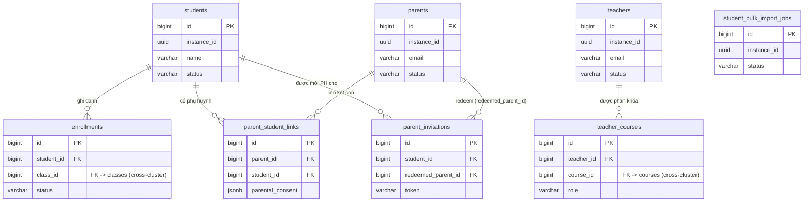

# KiteClass DB Schema — Cluster "Con người / Ghi danh"

## TL;DR

Cluster này gồm **8 bảng** quản lý các thực thể con người và quan hệ ghi danh của KiteClass (DB `kiteclass-core`, schema `public`):

| Bảng | Vai trò | RLS (V58/V59) | Soft-delete |
|---|---|:---:|:---:|
| `students` | Hồ sơ học sinh — **entity trung tâm** của domain (top FK target) | ✅ | ✅ |
| `teachers` | Hồ sơ giáo viên | ✅ | ✅ |
| `parents` | Hồ sơ phụ huynh/người giám hộ | ✅ | ✅ |
| `parent_student_links` | M2M phụ huynh ↔ học sinh (kèm consent PDPL) | ✅ | ✅ |
| `parent_invitations` | Lời mời onboarding phụ huynh (token, TTL 24h) | ✅ | ✅ |
| `enrollments` | Ghi danh học sinh vào lớp (kèm học phí + giảm giá) | ✅ | ✅ |
| `teacher_courses` | M2M giáo viên ↔ khóa học (phân quyền cấp khóa) | ❌ (không có `instance_id`) | ❌ |
| `student_bulk_import_jobs` | Job import học sinh hàng loạt (xlsx) | ✅ | ✅ |

Điểm cần nhớ:
- **`students`** là tâm điểm: được tham chiếu bởi `enrollments`, `attendance`, `grades`, `submissions`, `invoices`, `student_points`, `reward_redemptions`, `student_badges`, `parent_student_links`, `parent_invitations`, `parent_complaint_queue` — tổng **11 inbound FK** trong DB.
- Hầu hết bảng kế thừa `BaseEntity` (cột `id`, `instance_id`, `created_at`, `updated_at`, `created_by`, `updated_by`, `deleted`, `version`). Ngoại lệ: `teacher_courses` (POJO độc lập, không multi-tenant).
- Cột `created_by` / `updated_by` đã đổi từ `BIGINT` sang `UUID` ở **V73** (GAP-795) — lưu `X-User-Id` (JWT `sub` claim), không phải số.
- Mọi bảng có `instance_id` đều bật **RLS FORCED** từ V58, siết NULL force-fail + admin-bypass ở V59.

## ERD cluster

> Ghi chú cross-cluster (không vẽ trong ERD trên để giữ `students` ở trung tâm):
> - `enrollments.class_id → classes(id)` (cluster Lớp học/Khóa học).
> - `teacher_courses.course_id → courses(id)` (cluster Lớp học/Khóa học).
> - `classes.teacher_id` (V73) lưu UUID actor (X-User-Id), **không** còn FK tới `teachers(id)` — xem chú thích bảng `teachers`.

---

## `students`

**Mục đích:** Hồ sơ học sinh của trung tâm/trường. Là entity trung tâm của domain — định danh đăng nhập nằm ở Gateway `users` (liên kết qua `users.reference_id = students.id`).

| Cột | Kiểu | Null | Default | Khóa/Index | Ý nghĩa |
|---|---|:---:|---|---|---|
| `id` | `BIGSERIAL` | NOT NULL | seq | PK | Khóa chính |
| `instance_id` | `UUID` | NOT NULL | — | `idx_students_instance` (partial `deleted=false`) | Tenant ID (multi-tenant isolation) |
| `name` | `VARCHAR(100)` | NOT NULL | — | — | Họ tên đầy đủ học sinh |
| `email` | `VARCHAR(255)` | NULL | — | `idx_students_email` (partial `deleted=false`) | Email liên hệ (tùy chọn) |
| `phone` | `VARCHAR(20)` | NULL | — | `idx_students_phone` | SĐT Việt Nam (10 số, bắt đầu `0`) |
| `date_of_birth` | `DATE` | NULL | — | — | Ngày sinh (tính tuổi, nhắc sinh nhật) |
| `gender` | `VARCHAR(10)` | NULL | — | — | Giới tính — enum `Gender`: `MALE` (Nam), `FEMALE` (Nữ) |
| `address` | `TEXT` | NULL | — | — | Địa chỉ chi tiết |
| `avatar_url` | `VARCHAR(500)` | NULL | — | — | URL ảnh đại diện |
| `status` | `VARCHAR(20)` | NOT NULL | `'ACTIVE'` | `idx_students_status` (partial `deleted=false`); CHECK `chk_students_status` | Trạng thái — enum `StudentStatus`: `PENDING` (chờ xác nhận), `ACTIVE` (đang học), `INACTIVE` (tạm nghỉ), `GRADUATED` (đã tốt nghiệp), `DROPPED` (đã nghỉ học) |
| `note` | `TEXT` | NULL | — | — | Ghi chú thêm về học sinh |
| `created_at` | `TIMESTAMPTZ` | NOT NULL | `CURRENT_TIMESTAMP` | — | Thời điểm tạo |
| `updated_at` | `TIMESTAMPTZ` | NOT NULL | `CURRENT_TIMESTAMP` | — | Thời điểm cập nhật (trigger `trg_students_updated_at`) |
| `created_by` | `UUID` | NULL | — | — | Người tạo — `X-User-Id` (UUID, V73; trước là BIGINT) |
| `updated_by` | `UUID` | NULL | — | — | Người cập nhật cuối (UUID, V73) |
| `version` | `BIGINT` | NULL | `0` (V62) | — | Optimistic lock (`@Version`) |
| `deleted` | `BOOLEAN` | NULL | `FALSE` | — | Cờ soft-delete |
| `deleted_at` | `TIMESTAMPTZ` | NULL | — | — | Thời điểm soft-delete |

> Nguồn cột: V1 (tạo bảng) + V26 (`created_by`/`updated_by`/`version`) + V62 (`version` default 0) + V73 (`created_by`/`updated_by` → UUID). Lưu ý `students` có riêng cột `deleted_at` (không phải bảng nào cũng có).

**Quan hệ:**
- Outbound: không có FK ra bảng khác (entity gốc).
- Inbound (11 FK trong DB tham chiếu `students(id)`):
  - `enrollments.student_id`, `attendance.student_id`, `grades.student_id`, `submissions.student_id`, `invoices.student_id`, `student_points.student_id`, `reward_redemptions.student_id`, `student_badges.student_id` (cross-cluster);
  - `parent_student_links.student_id`, `parent_invitations.student_id`, `parent_complaint_queue.student_id` (cùng cluster con người).
- Cardinality: 1 student → N enrollment / attendance / grade / … (one-to-many).

**RLS + ghi chú:** Tenant-scoped (`instance_id`) — RLS ENABLE + FORCE từ V58, policy `tenant_isolation`. Soft-delete qua `deleted`/`deleted_at`. Có trigger `update_core_updated_at()`. Entity `Student` map quan hệ `OneToMany parentLinks` (LAZY).

---

## `teachers`

**Mục đích:** Hồ sơ giáo viên. Định danh đăng nhập ở Gateway `users` (liên kết `users.reference_id = teachers.id`).

| Cột | Kiểu | Null | Default | Khóa/Index | Ý nghĩa |
|---|---|:---:|---|---|---|
| `id` | `BIGSERIAL` | NOT NULL | seq | PK | Khóa chính |
| `instance_id` | `UUID` | NOT NULL | — | `idx_teachers_instance` (partial `deleted=false`) | Tenant ID |
| `name` | `VARCHAR(100)` | NOT NULL | — | — | Họ tên giáo viên |
| `email` | `VARCHAR(255)` | NULL (V1) | — | `idx_teachers_email` (partial `deleted=false`) | Email — entity yêu cầu UNIQUE + NOT NULL (BR-TEACHER-001) |
| `phone` | `VARCHAR(20)` | NULL | — | — | SĐT (cột legacy V1; entity hiện dùng `phone_number`) |
| `avatar_url` | `VARCHAR(500)` | NULL | — | — | URL ảnh đại diện |
| `department` | `VARCHAR(100)` | NULL | — | `idx_teachers_department` | Bộ môn/phòng ban (cột legacy V1) |
| `specialization` | `VARCHAR(100)` | NULL | — | — | Chuyên môn/môn dạy (vd English, Math) |
| `qualifications` | `TEXT` | NULL | — | — | Bằng cấp (cột legacy V1; entity dùng `qualification`) |
| `bio` | `TEXT` | NULL | — | — | Giới thiệu/tiểu sử |
| `status` | `VARCHAR(20)` | NOT NULL | `'ACTIVE'` | — | Trạng thái — enum `TeacherStatus`: `ACTIVE` (đang hoạt động), `INACTIVE` (tạm ngưng), `ON_LEAVE` (nghỉ phép) |
| `phone_number` | `VARCHAR(20)` | NULL | — | — | SĐT (cột entity hiện hành, thêm ở V27) |
| `qualification` | `VARCHAR(200)` | NULL | — | — | Bằng cấp (entity hiện hành, V27) |
| `experience_years` | `INTEGER` | NULL | — | — | Số năm kinh nghiệm (≥ 0) |
| `created_at` | `TIMESTAMPTZ` | NOT NULL | `CURRENT_TIMESTAMP` | — | Thời điểm tạo |
| `updated_at` | `TIMESTAMPTZ` | NOT NULL | `CURRENT_TIMESTAMP` | — | Cập nhật (trigger `trg_teachers_updated_at`) |
| `created_by` | `UUID` | NULL | — | — | Người tạo (UUID, V73) |
| `updated_by` | `UUID` | NULL | — | — | Người cập nhật cuối (UUID, V73) |
| `version` | `BIGINT` | NULL | `0` (V62) | — | Optimistic lock |
| `deleted` | `BOOLEAN` | NULL | `FALSE` | — | Cờ soft-delete |

> Nguồn cột: V1 (`name`/`email`/`phone`/`department`/`specialization`/`qualifications`/`bio`/`status`/audit) + V26 (audit) + V27 (`phone_number`/`qualification`/`experience_years`) + V62 (version default) + V73 (audit → UUID). Lưu ý DB giữ cả cột legacy V1 (`phone`, `department`, `qualifications`) lẫn cột entity hiện hành (`phone_number`, `qualification`) — entity `Teacher` chỉ map tập cột hiện hành.

**Quan hệ:**
- Outbound: không có FK trực tiếp (entity gốc).
- Inbound: `teacher_courses.teacher_id → teachers(id)` (cùng cluster). Trong V1, `classes.teacher_id` từng FK tới `teachers(id)` nhưng V73 đã **drop FK** và đổi cột sang UUID actor — nên không còn coi là inbound FK domain.
- Cardinality: 1 teacher → N teacher_courses (one-to-many).

**RLS + ghi chú:** Tenant-scoped — RLS FORCE V58. Soft-delete qua `deleted` (không có `deleted_at`). Trigger `update_core_updated_at()`.

---

## `parents`

**Mục đích:** Hồ sơ phụ huynh/người giám hộ (Wave 2 — GAP-052a). Credentials nằm ở Gateway `users` (`users.reference_id = parents.id`, `user_type = PARENT`).

| Cột | Kiểu | Null | Default | Khóa/Index | Ý nghĩa |
|---|---|:---:|---|---|---|
| `id` | `BIGSERIAL` | NOT NULL | seq | PK | Khóa chính |
| `instance_id` | `UUID` | NOT NULL | — | `idx_parents_instance` | Tenant ID |
| `email` | `VARCHAR(255)` | NOT NULL | — | `idx_parents_email`; UNIQUE `uk_parents_email_tenant (instance_id, email)` | Email — cũng là login phía Gateway (BR-PARENT-001) |
| `phone_number` | `VARCHAR(20)` | NULL | — | — | SĐT Việt Nam (regex `^0\d{9}$`, tùy chọn) |
| `full_name` | `VARCHAR(100)` | NOT NULL | — | — | Họ tên đầy đủ |
| `relationship` | `VARCHAR(20)` | NOT NULL | `'GUARDIAN'` | CHECK `chk_parents_relationship` | Quan hệ — enum `ParentRelationship`: `FATHER` (cha), `MOTHER` (mẹ), `GUARDIAN` (người giám hộ) |
| `status` | `VARCHAR(20)` | NOT NULL | `'PENDING'` | `idx_parents_status`; CHECK `chk_parents_status` | Trạng thái — enum `ParentStatus`: `PENDING` (chờ redeem invite), `ACTIVE` (đã có user Gateway), `INACTIVE` |
| `created_at` | `TIMESTAMP` | NOT NULL | `NOW()` | — | Thời điểm tạo |
| `updated_at` | `TIMESTAMP` | NULL | — | — | Thời điểm cập nhật |
| `created_by` | `UUID` | NULL | — | — | Người tạo (UUID, V73) |
| `updated_by` | `UUID` | NULL | — | — | Người cập nhật cuối (UUID, V73) |
| `deleted` | `BOOLEAN` | NOT NULL | `FALSE` | — | Cờ soft-delete |
| `version` | `BIGINT` | NOT NULL | `0` | — | Optimistic lock |

> Nguồn cột: V42 (tạo bảng) + V73 (audit → UUID). `created_at`/`updated_at` ở đây là `TIMESTAMP` (không timezone) — khác `students`/`teachers` (`TIMESTAMPTZ`).

**Quan hệ:**
- Outbound: không có FK ra (entity gốc).
- Inbound: `parent_student_links.parent_id`, `parent_invitations.redeemed_parent_id`, `parent_complaint_queue.parent_id` đều `→ parents(id)`.
- Cardinality: 1 parent → N parent_student_links (one-to-many); qua đó M2M với students.

**RLS + ghi chú:** Tenant-scoped — RLS FORCE V58. Soft-delete qua `deleted`. UNIQUE email theo tenant cho phép cùng 1 người làm phụ huynh ở nhiều tenant. Entity `Parent` map `OneToMany studentLinks` (LAZY).

---

## `parent_student_links`

**Mục đích:** Bảng nối M2M giữa `parents` và `students`, mang metadata per-edge (PRIMARY/SECONDARY) và consent PDPL granular (V56).

| Cột | Kiểu | Null | Default | Khóa/Index | Ý nghĩa |
|---|---|:---:|---|---|---|
| `id` | `BIGSERIAL` | NOT NULL | seq | PK | Khóa chính |
| `instance_id` | `UUID` | NOT NULL | — | `idx_psl_instance` | Tenant ID |
| `parent_id` | `BIGINT` | NOT NULL | — | FK `→ parents(id)`; `idx_psl_parent`; UNIQUE `uk_parent_student (parent_id, student_id)` | Phụ huynh |
| `student_id` | `BIGINT` | NOT NULL | — | FK `→ students(id)`; `idx_psl_student`; UNIQUE (cùng `uk_parent_student`) | Học sinh |
| `link_type` | `VARCHAR(20)` | NOT NULL | `'PRIMARY'` | CHECK `chk_psl_link_type` | Loại liên kết — enum `ParentLinkType`: `PRIMARY` (liên hệ chính), `SECONDARY` (liên hệ phụ) |
| `parental_consent` | `JSONB` | NOT NULL | `'{"fields":{},"version":1,"updatedAt":null}'` | — | Consent PDPL Decree 13/2023 Art 16 (V56) — bag cờ hiển thị per-field + version + updatedAt; `ConsentService` gate facet API theo cờ |
| `created_at` | `TIMESTAMP` | NOT NULL | `NOW()` | — | Thời điểm tạo |
| `updated_at` | `TIMESTAMP` | NULL | — | — | Thời điểm cập nhật |
| `created_by` | `UUID` | NULL | — | — | Người tạo (UUID, V73) |
| `updated_by` | `UUID` | NULL | — | — | Người cập nhật cuối (UUID, V73) |
| `deleted` | `BOOLEAN` | NOT NULL | `FALSE` | — | Cờ soft-delete |
| `version` | `BIGINT` | NOT NULL | `0` | — | Optimistic lock |

> Nguồn cột: V42 (tạo bảng) + V56 (thêm `parental_consent` JSONB) + V73 (audit → UUID).

**Quan hệ (M2M — giải thích 2 phía):**
- Phía `parents`: `parent_id → parents(id)`. 1 phụ huynh có thể liên kết nhiều học sinh (nhiều con).
- Phía `students`: `student_id → students(id)`. 1 học sinh có thể có nhiều phụ huynh (cha + mẹ + giám hộ).
- UNIQUE `(parent_id, student_id)` chặn cạnh trùng. Entity `ParentStudentLink` dùng `@ManyToOne` 2 chiều (LAZY) thay vì `@ManyToMany` để giữ metadata.

**RLS + ghi chú:** Tenant-scoped — RLS FORCE V58. Soft-delete qua `deleted`. Cột JSONB `parental_consent` (binding qua `@JdbcTypeCode(SqlTypes.JSON)`).

---

## `parent_invitations`

**Mục đích:** Lời mời onboarding phụ huynh dạng token (Wave 2 — GAP-052a). Phụ huynh theo link `/parent-invite/{token}` để đặt mật khẩu; redeem sẽ tạo `parents` + `parent_student_links` + Gateway User.

| Cột | Kiểu | Null | Default | Khóa/Index | Ý nghĩa |
|---|---|:---:|---|---|---|
| `id` | `BIGSERIAL` | NOT NULL | seq | PK | Khóa chính |
| `instance_id` | `UUID` | NOT NULL | — | `idx_inv_instance` | Tenant ID |
| `email` | `VARCHAR(255)` | NOT NULL | — | `idx_inv_email` | Email nhận lời mời (sẽ thành login phụ huynh) |
| `student_id` | `BIGINT` | NOT NULL | — | FK `→ students(id)` | Học sinh được liên kết khi redeem |
| `token` | `VARCHAR(64)` | NOT NULL | — | UNIQUE; `idx_inv_token` (unique) | Token 128-bit (UUID) — khóa redeem công khai |
| `status` | `VARCHAR(20)` | NOT NULL | `'PENDING'` | `idx_inv_status`; CHECK `chk_parent_invitation_status` | Trạng thái — enum `ParentInvitationStatus`: `PENDING`, `REDEEMED`, `EXPIRED`, `REVOKED` |
| `expires_at` | `TIMESTAMP` | NOT NULL | — | partial idx `idx_inv_expires_pending` (`WHERE status='PENDING'`) | Hết hạn (TTL mặc định 24h) |
| `invited_by_user_id` | `UUID` | NULL | — | — | Gateway user (UUID, X-User-Id) của người gửi lời mời (V73) |
| `redeemed_at` | `TIMESTAMP` | NULL | — | — | Thời điểm hoàn tất redeem |
| `redeemed_parent_id` | `BIGINT` | NULL | — | FK `→ parents(id)` | Parent được tạo khi redeem |
| `created_at` | `TIMESTAMP` | NOT NULL | `NOW()` | — | Thời điểm tạo |
| `updated_at` | `TIMESTAMP` | NULL | — | — | Thời điểm cập nhật |
| `created_by` | `UUID` | NULL | — | — | Người tạo (UUID, V73) |
| `updated_by` | `UUID` | NULL | — | — | Người cập nhật cuối (UUID, V73) |
| `deleted` | `BOOLEAN` | NOT NULL | `FALSE` | — | Cờ soft-delete |
| `version` | `BIGINT` | NOT NULL | `0` | — | Optimistic lock |

> Nguồn cột: V42 (tạo bảng) + V73 (`invited_by_user_id` + audit → UUID). Partial index `idx_inv_expires_pending` tăng tốc job sweeper quét invite hết hạn.

**Quan hệ:**
- Outbound: `student_id → students(id)`; `redeemed_parent_id → parents(id)`.
- Inbound: không.
- Cardinality: 1 student → N invitation; 1 parent → N invitation đã redeem.

**RLS + ghi chú:** Tenant-scoped — RLS FORCE V58. Soft-delete qua `deleted`. Token UNIQUE toàn cục. Job định kỳ chuyển `PENDING` quá hạn → `EXPIRED`.

---

## `enrollments`

**Mục đích:** Ghi danh học sinh vào lớp học, kèm tính toán học phí + giảm giá. Là cầu nối học sinh ↔ lớp (cross-cluster).

| Cột | Kiểu | Null | Default | Khóa/Index | Ý nghĩa |
|---|---|:---:|---|---|---|
| `id` | `BIGSERIAL` | NOT NULL | seq | PK | Khóa chính |
| `instance_id` | `UUID` | NOT NULL | — | `idx_enrollments_instance` / `idx_enrollments_instance_id` | Tenant ID |
| `class_id` | `BIGINT` | NOT NULL | — | FK `→ classes(id)`; `idx_enrollments_class*`; UNIQUE `uk_enrollments (class_id, student_id)` | Lớp được ghi danh (cross-cluster) |
| `student_id` | `BIGINT` | NOT NULL | — | FK `→ students(id)`; `idx_enrollments_student*`; UNIQUE (cùng `uk_enrollments`) | Học sinh ghi danh |
| `enrolled_at` | `TIMESTAMPTZ` | NOT NULL | `CURRENT_TIMESTAMP` | — | Thời điểm ghi danh (cột gốc V1) |
| `status` | `VARCHAR(50)` | NULL | `'active'` (DB) / entity default `PENDING_PAYMENT` | `idx_enrollments_status` | Trạng thái — enum `EnrollmentStatus` (entity): `ACTIVE`, `PENDING_PAYMENT`, `COMPLETED`, `WITHDRAWN`, `CANCELLED`. (Comment V1 cũ ghi `active/completed/dropped/transferred` — không có CHECK, entity enum là giá trị hiệu lực) |
| `notes` | `TEXT` | NULL | — | — | Ghi chú ghi danh |
| `created_at` | `TIMESTAMPTZ` | NOT NULL | `CURRENT_TIMESTAMP` | — | Thời điểm tạo |
| `updated_at` | `TIMESTAMPTZ` | NOT NULL | `CURRENT_TIMESTAMP` | — | Cập nhật (trigger `trg_enrollments_updated_at`) |
| `created_by` | `UUID` | NULL | — | — | Người tạo (UUID, V73; gốc V1 BIGINT) |
| `updated_by` | `UUID` | NULL | — | — | Người cập nhật cuối (UUID, V73; thêm V26) |
| `version` | `BIGINT` | NULL | `0` (V63) | — | Optimistic lock (thêm V26) |
| `deleted` | `BOOLEAN` | NOT NULL | `FALSE` | — | Cờ soft-delete (thêm V27) |
| `enrollment_date` | `TIMESTAMPTZ` | NOT NULL | `NOW()` | `idx_enrollments_enrollment_date` (entity) | Ngày ghi danh (cột entity hiện hành, V27) |
| `tuition_amount` | `DECIMAL(10,2)` | NOT NULL | `0` | — | Học phí gốc tại thời điểm ghi danh (V27) |
| `discount_percent` | `DECIMAL(5,2)` | NOT NULL | `0` | — | % giảm giá (0–100) (V27) |
| `final_amount` | `DECIMAL(10,2)` | NOT NULL | `0` | — | Số tiền cuối = `tuition_amount * (1 - discount_percent/100)`, tính ở `@PrePersist/@PreUpdate` (V27) |

> Nguồn cột: V1 (`class_id`/`student_id`/`enrolled_at`/`status`/`notes`/audit + UNIQUE `uk_enrollments`) + V26 (`updated_by`/`version`) + V27 (`deleted`/`enrollment_date`/`tuition_amount`/`discount_percent`/`final_amount`) + V63 (`version` default 0) + V73 (audit → UUID).
>
> **Lưu ý unique constraint:** DB constraint thực tế là `uk_enrollments (class_id, student_id)` (V1). Entity `Enrollment` khai báo annotation `uk_enrollments_student_class_instance (student_id, class_id, instance_id, deleted)` — đây là mapping JPA, **không** thay constraint DB hiện hành (không có migration nào tạo constraint 4 cột này). Constraint DB chặn 1 học sinh ghi danh trùng 1 lớp.
>
> Business rules (entity): BR-ENROLL-001 (không vượt sức chứa lớp), BR-ENROLL-002 (không ghi danh trùng), BR-ENROLL-003 (công thức final_amount), BR-ENROLL-004 (discount 0–100), BR-ENROLL-005 (không ghi danh lớp khóa ARCHIVED). Capacity-race guard ở `classes` (V65 CHECK `current_enrolled <= max_students`).

**Quan hệ:**
- Outbound: `student_id → students(id)`; `class_id → classes(id)` (cross-cluster).
- Inbound: không.
- Cardinality: 1 student → N enrollment; 1 class → N enrollment (M:N giữa student và class qua bảng này).

**RLS + ghi chú:** Tenant-scoped — RLS FORCE V58. Soft-delete qua `deleted`. Trigger `update_core_updated_at()`. Có 2 cột thời gian song song: `enrolled_at` (gốc V1) và `enrollment_date` (entity V27).

---

## `teacher_courses`

**Mục đích:** Bảng nối M2M giữa `teachers` và `courses`, mang vai trò phân quyền cấp khóa học (CREATOR/INSTRUCTOR/ASSISTANT). Thêm ở V27.

| Cột | Kiểu | Null | Default | Khóa/Index | Ý nghĩa |
|---|---|:---:|---|---|---|
| `id` | `BIGSERIAL` | NOT NULL | seq | PK | Khóa chính |
| `teacher_id` | `BIGINT` | NOT NULL | — | FK `→ teachers(id)`; `idx_teacher_courses_teacher_id`; UNIQUE `uk_teacher_courses_teacher_course (teacher_id, course_id)` | Giáo viên |
| `course_id` | `BIGINT` | NOT NULL | — | FK `→ courses(id)`; `idx_teacher_courses_course_id`; UNIQUE (cùng) | Khóa học (cross-cluster) |
| `role` | `VARCHAR(20)` | NOT NULL | — | `idx_teacher_courses_role` | Vai trò — enum `TeacherCourseRole`: `CREATOR` (người tạo, toàn quyền), `INSTRUCTOR` (giảng viên, quản lý lớp được giao), `ASSISTANT` (trợ giảng, view-only) |
| `assigned_at` | `TIMESTAMPTZ` | NOT NULL | `NOW()` | — | Thời điểm phân công |
| `assigned_by` | `BIGINT` | NULL | — | — | User phân công (NULL nếu CREATOR tự tạo) |

> Nguồn cột: V27 (tạo bảng). **Bảng này KHÔNG kế thừa `BaseEntity`** — không có `instance_id`, không `deleted`, không `version`, không `created_at/updated_at` chuẩn. Entity `TeacherCourse` là POJO `@Id` riêng.

**Quan hệ (M2M — giải thích 2 phía):**
- Phía `teachers`: `teacher_id → teachers(id)`. 1 giáo viên có thể được phân nhiều khóa.
- Phía `courses`: `course_id → courses(id)` (cross-cluster). 1 khóa có thể có nhiều giáo viên với vai trò khác nhau.
- UNIQUE `(teacher_id, course_id)` đảm bảo 1 giáo viên chỉ 1 vai trò trong 1 khóa (BR-TEACHER-007).

**RLS + ghi chú:** **KHÔNG tenant-scoped** (không có `instance_id` → không nằm trong danh sách RLS V58). Không soft-delete (xóa cứng). `assigned_by` vẫn là `BIGINT` (không nằm trong sweep V73 vì không tên `created_by`/`updated_by`).

---

## `student_bulk_import_jobs`

**Mục đích:** Theo dõi từng lần import học sinh hàng loạt qua xlsx (GAP-051 Wave 1) — phục vụ audit, tải báo cáo lỗi.

| Cột | Kiểu | Null | Default | Khóa/Index | Ý nghĩa |
|---|---|:---:|---|---|---|
| `id` | `BIGSERIAL` | NOT NULL | seq | PK | Khóa chính |
| `instance_id` | `UUID` | NOT NULL | — | `idx_bulk_import_jobs_tenant` | Tenant ID |
| `filename` | `VARCHAR(255)` | NOT NULL | — | — | Tên file gốc đã upload (audit) |
| `status` | `VARCHAR(20)` | NOT NULL | `'PENDING'` | `idx_bulk_import_jobs_status` | Trạng thái — enum `BulkImportStatus`: `PENDING` (chờ), `IN_PROGRESS` (đang xử lý), `COMPLETED` (xong), `FAILED` (lỗi terminal) |
| `total_rows` | `INT` | NOT NULL | `0` | — | Tổng số dòng (sau header) |
| `success_count` | `INT` | NOT NULL | `0` | — | Số dòng tạo học sinh thành công |
| `error_count` | `INT` | NOT NULL | `0` | — | Số dòng lỗi (validation/trùng) |
| `error_report_url` | `VARCHAR(500)` | NULL | — | — | URL/path báo cáo lỗi xlsx (có thể NULL — MVP gen on-demand) |
| `completed_at` | `TIMESTAMP` | NULL | — | — | Thời điểm hoàn tất job |
| `created_at` | `TIMESTAMP` | NOT NULL | `NOW()` | — | Thời điểm tạo |
| `updated_at` | `TIMESTAMP` | NULL | — | — | Thời điểm cập nhật |
| `created_by` | `UUID` | NULL | — | — | Người tạo (UUID, V73; gốc V41 BIGINT) |
| `updated_by` | `UUID` | NULL | — | — | Người cập nhật cuối (UUID, V73) |
| `deleted` | `BOOLEAN` | NOT NULL | `FALSE` | — | Cờ soft-delete |
| `version` | `BIGINT` | NOT NULL | `0` | — | Optimistic lock |

> Nguồn cột: V41 (tạo bảng) + V73 (audit → UUID). Transition: `PENDING → IN_PROGRESS → COMPLETED` (hoặc `→ FAILED`).

**Quan hệ:**
- Outbound: không có FK (chỉ liên quan logic tới `students` được tạo, không ràng buộc FK).
- Inbound: không.
- Cardinality: độc lập (1 tenant → N job).

**RLS + ghi chú:** Tenant-scoped — RLS FORCE V58. Soft-delete qua `deleted`. Bảng metadata audit, không có FK tới `students`.

---

## Ghi chú schema (anomalies)

> Đây là danh sách lệch chuẩn giữa migration (chân lý DB), entity Java (`*.java`), và policy RLS (V58/V59) cho cụm Con người + Tuyển sinh. Dev PHẢI nắm trước khi viết query hoặc tạo migration mới. Hầu hết anomaly phát sinh từ (a) bảng nối M2M không kế thừa `BaseEntity` nên không có audit / soft-delete / RLS, (b) cột legacy V1 song song với cột entity V27, (c) entity declare UNIQUE 4-cột mà DB chỉ có 2-cột.

### A1 — `teacher_courses` thiếu `instance_id` + KHÔNG kế thừa BaseEntity → ngoài scope RLS V58

`teacher_courses` là bảng nối M2M thuần (teacher ↔ course). V46 chủ động loại trừ không thêm `instance_id` / audit / soft-delete. Cô lập tenant qua FK gián tiếp (`teacher_id → teachers.instance_id` HOẶC `course_id → courses.instance_id`).

→ Pattern giống `role_permissions` cluster 05 A3. Tương tự `student_badges` cluster 06 anomaly A (RLS skip). Risk class identical với baseline 04-finance.md A9 (RLS coverage gap). Nếu service code không JOIN parent table có `instance_id`, query có thể leak cross-tenant. Verify mọi repository method dùng `teacher_courses` có JOIN parent + filter `instance_id` trong WHERE.

### A2 — Entity `Teacher` ↔ bảng `teachers` drift legacy V1 vs V27

Migration V1 tạo bảng `teachers` với cột `phone`, `department`, `qualifications` (text). V27 ADD cột mới `phone_number`, `qualification` (nullable, single-value). Entity `Teacher.java` chỉ map SUBSET — tuỳ commit, đôi khi cả 2 bộ cùng tồn tại trong DB nhưng entity chỉ ghi vào 1 bộ.

| Cột V1 (legacy) | Cột V27 (mới) | Entity hiện map |
|---|---|---|
| `phone` (text) | `phone_number` (VARCHAR(20)) | `phone_number` (V27) |
| `qualifications` (text) | `qualification` (VARCHAR(255)) | `qualification` (V27) |
| `department` (text) | — | (không map) |

→ Risk: dữ liệu legacy V1 trong `phone`/`qualifications` không bao giờ được entity đọc / ghi → mất context. Cần migration cleanup DROP cột legacy sau verify migrate sang V27 100%. Pattern giống baseline 04-finance.md A3 (`Invoice` entity drift).

### A3 — `enrollments` UNIQUE constraint mismatch (DB 2-cột vs entity 4-cột)

| Source | UNIQUE constraint |
|---|---|
| DB thực tế (V1) | `uk_enrollments (class_id, student_id)` — 2 cột |
| Entity `Enrollment.java` `@Table(uniqueConstraints=...)` | `(student_id, class_id, instance_id, deleted)` — 4 cột |

→ Entity annotation chỉ là **hint cho Hibernate khi `ddl-auto=create`** — production dùng Flyway migration nên DB là chân lý. Risk: dev đọc entity giả định 4-cột (soft-delete-aware unique) nhưng DB chỉ 2-cột → khi 1 enrollment soft-delete + tạo lại → UNIQUE violation cũ trên `(class_id, student_id)`. Cần migration ADD UNIQUE 4-cột (sau khi cleanup duplicate rows soft-delete).

Pattern unique drift này là sub-class A4 baseline 04-finance.md (Enum ↔ CHECK), expanded thành "Index/UNIQUE drift entity ↔ DB".

### A4 — `enrollments` có 2 cột thời gian song song (`enrolled_at` V1 vs `enrollment_date` V27)

Migration V1 tạo cột `enrolled_at TIMESTAMPTZ` (thời điểm tự động khi tạo row). V27 ADD `enrollment_date DATE` (ngày học sinh chính thức nhập học — có thể khác ngày tạo row).

→ Hai ngữ nghĩa khác nhau (created vs official enrollment) nhưng tên cột confusing — dev có thể nhầm 2 cột. Entity `Enrollment.java` map cả 2 (`enrolledAt` + `enrollmentDate`). Cùng class baseline 04-finance.md A2 (legacy + new column tồn tại đồng thời).

→ Document rõ trong Javadoc entity field + business rule trong `documents/01-business/kiteclass/enrollment/rules.md` về sự khác biệt 2 cột.

### A5 — `classes.teacher_id` V73 chuyển UUID + DROP FK tới `teachers(id)`

V73 (GAP-795) chuyển `classes.teacher_id` BIGINT → UUID đồng thời DROP FK `classes.teacher_id → teachers(id)`. Lý do: `teacher_id` giờ trỏ tới `users.id` (UUID — gateway forward `X-User-Id`) chứ không phải `teachers(id)` BIGINT (legacy auto-increment).

→ Risk: code legacy giả định FK domain `classes → teachers` còn tồn tại. Soft ref (chỉ UUID, không FK constraint) buộc service phải validate `teacher_id` trỏ valid user trước INSERT. Cross-cluster với cluster 01 A5 + cluster 06 baseline B (actor UUID/BIGINT inconsistency).

### A6 — Actor BIGINT bị V73 sweep BỎ SÓT (`teacher_courses.assigned_by`)

V73 sweep chỉ chuyển `created_by`/`updated_by` của mọi bảng. **`teacher_courses.assigned_by`** (V30) là cột actor nghiệp vụ riêng (tên không match `created_by`) → V73 không động.

| Bảng | Cột actor BIGINT bỏ sót | Migration gốc | Risk |
|---|---|---|---|
| `teacher_courses` | `assigned_by` | V30 | Service ghi UUID `X-User-Id` → parse fail / NumberFormatException |

→ Identical pattern với baseline 04-finance.md A6 + cluster 01 A5 + cluster 05 A1 (cross-cluster recurrent pattern V73 sweep narrow scope). Cần migration follow-up sweep V73 phase 2 cho mọi cột actor không-tên-chuẩn.

### A7 — TIMESTAMP vs TIMESTAMPTZ không nhất quán

| Nhóm | Bảng | Kiểu timestamp |
|---|---|---|
| TIMESTAMPTZ (timezone-aware) | `students`, `teachers`, `enrollments` | TIMESTAMP WITH TIME ZONE |
| TIMESTAMP (naive) | `parents`, `parent_student_links`, `parent_invitations`, `student_bulk_import_jobs` | TIMESTAMP (V41/V42) |

→ 3 bảng "core" (V1) dùng TZ; 4 bảng "extension" (V41/V42 P2/P3 expand) dùng naive. Risk khi compare `enrollments.enrollment_date` (DATE) với `parent_invitations.created_at` (TIMESTAMP naive) trên server không UTC. Identical pattern baseline 04-finance.md A8 + cluster 01 A9.

→ Document policy timezone trong `documents/02-architecture/database/README.md` (cluster overview).

---

## Liên kết

- [README cluster database KiteClass](../README.md)
- [Bản đồ kiến trúc database](../../database-architecture-map.md)
