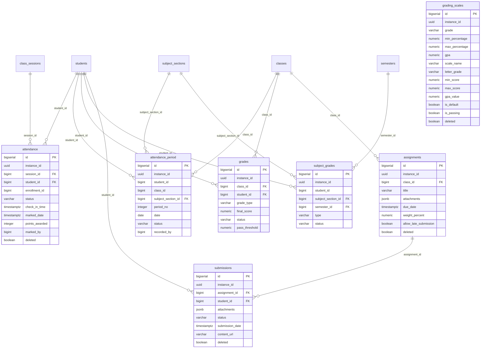

# KiteClass DB Schema — Cụm Điểm danh / Điểm số

> **TL;DR** — Cụm 7 bảng nghiệp vụ điểm danh và điểm số của `kiteclass-core` (mỗi tenant = 1 trường/trung tâm). `attendance` là bảng ghi nóng nhất (per-day, mô hình trung tâm); `attendance_period` là biến thể per-tiết cho trường K-12 (TT 22/2021/TT-BGDĐT). `grades` + `grading_scales` quản lý điểm tổng kết theo lớp; `subject_grades` quản lý điểm môn học K-12; `assignments` + `submissions` quản lý bài tập và bài nộp (có cột JSONB). **Tất cả 7 bảng đều tenant-scoped (`instance_id` UUID) và bật RLS FORCED từ V58/V59** (NULL force-fail = mặc định chặn).
>
> ✅ **Cập nhật Wave 14 (post-fix):** Phần lớn drift entity↔migration NẶNG nhất của cụm này đã được **Wave 14 (KC V79/V85/V86) giải quyết**: `attendance` (V79 thêm `enrollment_id`/`marked_date`/`points_awarded`/`deleted` — GAP-874), `grading_scales` (V79 thêm bộ cột entity `scale_name`/`letter_grade`/`min_score`/`max_score`/`gpa_value`/`deleted` — GAP-875), `assignments`+`submissions` (V79 thêm `deleted` + cột entity — GAP-876), `grades` (V85 drop 7 cột legacy + chuẩn hóa CHECK `final_score`), và type harmonize money→NUMERIC(19,2) + timestamp→TIMESTAMPTZ (V86 — GAP-878/883). Các anomaly tương ứng đã đánh dấu ✅ Resolved trong §"Ghi chú schema (anomalies)". **Còn deferred:** actor column nghiệp vụ (`marked_by`/`graded_by`/`reviewed_by`/`recorded_by`/`finalized_by`) vẫn BIGINT (anomaly E ⏸️ Deferred → GAP-877/886). Đọc §anomalies để biết phần nào còn lệch trước khi viết query/migration mới.

---

## ERD cụm Điểm danh / Điểm số

> **Lưu ý đọc ERD:** ERD trên vẽ theo **cột vật lý hiện có trong migration** (chân lý DB), đã cập nhật theo Wave 14 (V79/V85/V86). Sau Wave 14, `attendance`/`grading_scales`/`assignments`/`submissions` đã có các cột entity (`deleted` + cột nghiệp vụ mới) — phần lớn drift NẶNG đã hết. Lệch còn lại: actor nghiệp vụ BIGINT (`marked_by`/`graded_by`/`reviewed_by`/`recorded_by`) chưa sweep UUID (anomaly E ⏸️ Deferred → GAP-877/886).

---

## `attendance`

### Mục đích
Ghi nhận điểm danh từng học sinh theo **buổi học** (`class_sessions`) — mô hình per-day dành cho trung tâm (CENTER tenant). Đây là bảng ghi nóng nhất cụm (~10k–100k dòng/tenant). Trường K-12 KHÔNG ghi vào bảng này mà dùng `attendance_period`.

### Bảng cột đầy đủ

| Cột | Kiểu | Null | Default | Khóa/Index | Ý nghĩa |
|---|---|---|---|---|---|
| `id` | BIGSERIAL | NO | auto | PK | Khóa chính tự tăng |
| `instance_id` | UUID | NO | — | `idx_attendance_instance`, RLS | Tenant ID (multi-tenant isolation) |
| `session_id` | BIGINT | NO | — | FK→`class_sessions(id)`, `idx_attendance_session` | Buổi học được điểm danh |
| `student_id` | BIGINT | NO | — | FK→`students(id)`, `idx_attendance_student` | Học sinh được điểm danh |
| `enrollment_id` | BIGINT | YES | — | `idx_attendance_enrollment` | Ghi danh tương ứng (cột entity, V79 — GAP-874). KHÔNG có FK constraint |
| `status` | VARCHAR(20) | NO | — | `idx_attendance_status`, CHECK | Trạng thái: `present`, `absent`, `late`, `excused` (chữ thường) |
| `check_in_time` | TIMESTAMPTZ | YES | — | — | Thời điểm check-in (dùng phát hiện đi muộn) |
| `notes` | TEXT | YES | — | — | Ghi chú điểm danh |
| `marked_by` | BIGINT | YES | — | — | User ID (gateway) của người điểm danh — KHÔNG có FK. **Vẫn BIGINT** (⏸️ deferred actor sweep → GAP-877/886) |
| `marked_at` | TIMESTAMPTZ | YES | `CURRENT_TIMESTAMP` | — | Thời điểm đánh dấu điểm danh (cột legacy V1) |
| `marked_date` | TIMESTAMPTZ | NO | `CURRENT_TIMESTAMP` | — | Thời điểm đánh dấu (cột entity hiện hành, V79 — GAP-874; thay tên cũ `marked_at`) |
| `points_awarded` | INTEGER | YES | `0` | — | Điểm gamification thưởng khi điểm danh (cột entity, V79 — GAP-874) |
| `deleted` | BOOLEAN | NO | `FALSE` | `idx_attendance_deleted` | Cờ soft-delete (V79 — GAP-874; V1 không có) |
| `created_at` | TIMESTAMPTZ | NO | `CURRENT_TIMESTAMP` | — | Thời điểm tạo (audit) |
| `updated_at` | TIMESTAMPTZ | NO | `CURRENT_TIMESTAMP` | — | Thời điểm cập nhật (trigger `trg_attendance_updated_at`) |
| `created_by` | UUID | YES | — | — | Actor UUID tạo dòng — thêm V26 (BIGINT) → đổi UUID V73 |
| `updated_by` | UUID | YES | — | — | Actor UUID cập nhật — thêm V26 (BIGINT) → đổi UUID V73 |
| `version` | BIGINT | YES | `0` | — | Optimistic lock — thêm V26, set default 0 ở V63 |

### Quan hệ
- **FK out:** `session_id → class_sessions(id)`, `student_id → students(id)` (cross-cluster: students thuộc cụm Học sinh, class_sessions thuộc cụm Lớp/Buổi học).
- **FK in:** không có.
- **Cardinality:** 1 session → N attendance; 1 student → N attendance.
- **Không FK:** `marked_by` (user ID từ gateway, không ràng buộc).

### RLS + ghi chú
- **Tenant-scoped:** ✅ `instance_id` UUID; RLS ENABLE + FORCE từ V58, NULL force-fail + admin-bypass (`app.is_platform_admin`) từ V59.
- **Soft-delete:** ✅ `deleted` (V79 — GAP-874; trước Wave 14 migration KHÔNG có cột này).
- **JSONB:** không.
- **Unique:** `uk_attendance UNIQUE (session_id, student_id)` — 1 học sinh chỉ 1 dòng/buổi.
- **CHECK:** `chk_attendance_status` enforce 4 giá trị chữ thường.
- **Index hot-path:** `idx_attendance_session`, `idx_attendance_student`, `idx_attendance_status` — bảng ghi nóng nên cần index cho query theo buổi/học sinh.

---

## `attendance_period`

### Mục đích
Điểm danh từng **tiết** (per-period) cho trường K-12 — mỗi ngày 5–10 tiết, mỗi tiết một giáo viên bộ môn khác nhau (TT 22/2021/TT-BGDĐT). Chỉ K-12 tenant (`vertical_type = 'K12_SCHOOL'`) ghi vào bảng này; ràng buộc K-12 nằm ở tầng service (không thể CHECK cross-database).

### Bảng cột đầy đủ

| Cột | Kiểu | Null | Default | Khóa/Index | Ý nghĩa |
|---|---|---|---|---|---|
| `id` | BIGSERIAL | NO | auto | PK | Khóa chính tự tăng |
| `instance_id` | UUID | NO | — | `idx_att_period_instance_id`, RLS | Tenant ID |
| `student_id` | BIGINT | NO | — | `idx_att_period_student_date`, UK | Học sinh — KHÔNG có FK (chỉ index) |
| `class_id` | BIGINT | NO | — | `idx_att_period_class_date` | Lớp chủ nhiệm — KHÔNG có FK |
| `subject_section_id` | BIGINT | NO | — | FK→`subject_sections(id)`, UK | Lớp bộ môn (môn + lớp) của tiết này |
| `period_no` | INTEGER | NO | — | UK, CHECK | Số tiết (1..10) — CHECK `chk_att_period_no_range` (V51 siết từ `>0` về `1..10`) |
| `date` | DATE | NO | — | UK, `idx_att_period_student_date` | Ngày học (tách khỏi `recorded_at` để cho phép ghi lùi ngày) |
| `status` | VARCHAR(20) | NO | — | CHECK | Trạng thái: `PRESENT`, `ABSENT`, `LATE`, `EXCUSED`, `MAKEUP` (chữ HOA — khác `attendance`) |
| `recorded_by` | BIGINT | NO | — | `idx_att_period_recorded_by` | User ID người ghi nhận (≤2 phút SLA) — KHÔNG FK (⏸️ deferred actor sweep → GAP-877/886) |
| `recorded_at` | TIMESTAMPTZ | NO | — | — | Timestamp server-side khi ghi (V86 convert TIMESTAMP→TIMESTAMPTZ — GAP-878) |
| `notes` | VARCHAR(500) | YES | — | — | Ghi chú tiết |
| `created_at` | TIMESTAMPTZ | NO | `CURRENT_TIMESTAMP` | — | Audit tạo (V86 convert TIMESTAMP→TIMESTAMPTZ — GAP-878) |
| `updated_at` | TIMESTAMPTZ | YES | — | — | Audit cập nhật (V86 convert TIMESTAMP→TIMESTAMPTZ — GAP-878; nullable) |
| `created_by` | UUID | YES | — | — | Actor tạo — BIGINT trong V50, đổi UUID V73 |
| `updated_by` | UUID | YES | — | — | Actor cập nhật — BIGINT trong V50, đổi UUID V73 |
| `deleted` | BOOLEAN | NO | `FALSE` | `idx_att_period_deleted`, UK | Cờ soft-delete (V50 có sẵn — khác `attendance`) |
| `version` | BIGINT | NO | `0` | — | Optimistic lock (V50 có sẵn default 0) |

### Quan hệ
- **FK out:** `subject_section_id → subject_sections(id)` (cụm K-12). `student_id` + `class_id` KHÔNG có FK (chỉ index — chủ ý để tránh coupling migration order ở Phase 1A).
- **FK in:** không có.
- **Cardinality:** 1 subject_section → N period attendance; 1 student → N period attendance/ngày.

### RLS + ghi chú
- **Tenant-scoped:** ✅ RLS ENABLE/FORCE V58 + V59 hardening.
- **Soft-delete:** ✅ `deleted` (default FALSE).
- **JSONB:** không.
- **Unique:** `uk_att_period_student_section_date_period` UNIQUE `(student_id, subject_section_id, date, period_no, instance_id) WHERE deleted = FALSE` (BR-PERIOD-ATT-003 — partial unique loại trừ dòng đã xóa mềm).
- **CHECK:** `chk_att_period_status` (5 giá trị), `chk_att_period_no_range` (1..10).
- **Index hot-path:** `idx_att_period_student_date`, `idx_att_period_class_date`, `idx_att_period_subject_section`.

---

## `grades`

### Mục đích
Điểm tổng kết của học sinh theo **lớp** (`classes`). Bảng này có lịch sử migration phức tạp nhất cụm: V1 tạo theo mô hình "1 dòng = 1 bài đánh giá" (grade_type/title/score), nhưng entity `Grade.java` đã refactor sang mô hình "1 dòng = điểm tổng kết tính toán" (final_score/letter_grade/gpa/status). V64 thêm cột mới mà giữ cột legacy nullable → **có 2 bộ cột song song**.

### Bảng cột đầy đủ

| Cột | Kiểu | Null | Default | Khóa/Index | Ý nghĩa |
|---|---|---|---|---|---|
| `id` | BIGSERIAL | NO | auto | PK | Khóa chính |
| `instance_id` | UUID | NO | — | `idx_grades_instance`, RLS | Tenant ID |
| `class_id` | BIGINT | NO | — | FK→`classes(id)`, `idx_grades_class`, UK | Lớp |
| `student_id` | BIGINT | NO | — | FK→`students(id)`, `idx_grades_student`, UK | Học sinh |
| `grade_type` | VARCHAR(50) | YES* | — | `idx_grades_type`, UK | Loại điểm: `quiz`/`midterm`/`final`/`assignment`/`participation`. *V1 NOT NULL → V64 DROP NOT NULL. **GIỮ LẠI** (entity map + UK V74) |
| ~~`title`~~ | — | — | — | — | **✅ DROPPED V85 (GAP-904)** — cột legacy V1 zero-usage, đã xóa |
| ~~`score`~~ | — | — | — | — | **✅ DROPPED V85 (GAP-904)** — cột legacy V1 zero-usage, đã xóa (CHECK cũ `chk_grades_score` cũng drop) |
| ~~`max_score`~~ | — | — | — | — | **✅ DROPPED V85 (GAP-904)** — cột legacy V1, đã xóa |
| ~~`weight`~~ | — | — | — | — | **✅ DROPPED V85 (GAP-904)** — cột legacy V1, đã xóa |
| ~~`feedback`~~ | — | — | — | — | **✅ DROPPED V85 (GAP-904)** — cột legacy V1 (trùng nghĩa `comments`), đã xóa |
| ~~`graded_date`~~ | — | — | — | — | **✅ DROPPED V85 (GAP-904)** — cột legacy V1, đã xóa (index `idx_grades_date` cũng gỡ) |
| ~~`graded_by`~~ | — | — | — | — | **✅ DROPPED V85 (GAP-904)** — cột legacy V1, đã xóa |
| `final_score` | NUMERIC(5,2) | YES | — | — | Điểm tổng kết 0–100 (entity, V64). NULL = chưa tính. CHECK `chk_grades_final_score` (0–100) thêm V85 thay cho legacy `chk_grades_score` |
| `letter_grade` | VARCHAR(5) | YES | — | — | Điểm chữ A+/A/.../F map từ final_score (V64) |
| `gpa` | NUMERIC(3,2) | YES | — | — | GPA 0.0–4.0 map từ letter_grade (V64) |
| `status` | VARCHAR(20) | NO | `'IN_PROGRESS'` | — | `GradeStatus`: `IN_PROGRESS`/`FINALIZED`/`PASSED`/`FAILED` (V64) |
| `pass_threshold` | NUMERIC(5,2) | NO | `50.0` | — | Ngưỡng đậu (V64) |
| `comments` | TEXT | YES | — | — | Nhận xét giáo viên ≤2000 ký tự (V64 — trùng nghĩa `feedback`) |
| `calculated_at` | TIMESTAMPTZ | YES | — | — | Thời điểm tính final_score (V62) |
| `finalized_at` | TIMESTAMPTZ | YES | — | — | Thời điểm khóa điểm (V64) |
| `finalized_by` | BIGINT | YES | — | — | Teacher ID khóa điểm (V64) — KHÔNG FK, BIGINT |
| `deleted` | BOOLEAN | NO | `FALSE` | UK | Cờ soft-delete (V64 thêm — V1 không có) |
| `created_at` | TIMESTAMPTZ | NO | `CURRENT_TIMESTAMP` | — | Audit tạo |
| `updated_at` | TIMESTAMPTZ | NO | `CURRENT_TIMESTAMP` | — | Audit cập nhật (trigger) |
| `created_by` | UUID | YES | — | — | Actor tạo — V26 BIGINT → V73 UUID |
| `updated_by` | UUID | YES | — | — | Actor cập nhật — V26 BIGINT → V73 UUID |
| `version` | BIGINT | YES | `0` | — | Optimistic lock — V26 thêm, V62 set default 0 |

### Quan hệ
- **FK out:** `class_id → classes(id)`, `student_id → students(id)`.
- **FK in:** không có.
- **Cardinality:** 1 student × 1 class × 1 grade_type → 1 dòng (sau V74).
- **Không FK:** `graded_by`, `finalized_by` (user ID gateway).

### RLS + ghi chú
- **Tenant-scoped:** ✅ RLS V58/V59.
- **Soft-delete:** ✅ `deleted` (V64).
- **JSONB:** không.
- **Unique:** Lịch sử thay đổi: V64 tạo `uk_grades_student_class (student_id, class_id) WHERE deleted=false` → **V74 DROP và tạo lại** `uk_grades_student_class_type (student_id, class_id, grade_type) WHERE deleted=false`. Lý do (GAP-805): 1 học sinh trong 1 lớp có NHIỀU loại điểm (giữa kỳ + bài tập + cuối kỳ), UK 2 cột chặn sai.
- **CHECK:** `chk_grades_final_score CHECK (final_score IS NULL OR (final_score >= 0 AND final_score <= 100))` — V85 (GAP-904) thay cho legacy `chk_grades_score` (đã drop cùng cột `score`). Giờ ràng đúng cột entity dùng thực.
- **Index hot-path:** `idx_grades_class`, `idx_grades_student`, `idx_grades_type` (`idx_grades_date` đã gỡ cùng cột `graded_date` V85).

---

## `grading_scales`

### Mục đích
Thang điểm (grading scale) để map % điểm → điểm chữ → GPA, dùng cho tính toán GPA. Đây là bảng config nhỏ (ít dòng/tenant).

### Bảng cột đầy đủ

| Cột | Kiểu | Null | Default | Khóa/Index | Ý nghĩa |
|---|---|---|---|---|---|
| `id` | BIGSERIAL | NO | auto | PK | Khóa chính |
| `instance_id` | UUID | NO | — | `idx_grading_scales_instance`, RLS, UK | Tenant ID |
| `grade` | VARCHAR(5) | NO | — | UK | Điểm chữ legacy V1: A+, A, B+, B, C+, C, D+, D, F (trùng nghĩa `letter_grade` entity) |
| `min_percentage` | DECIMAL(5,2) | NO | — | — | % tối thiểu legacy V1 (vd 95.00; trùng nghĩa `min_score`) |
| `max_percentage` | DECIMAL(5,2) | NO | — | — | % tối đa legacy V1 (vd 100.00; trùng nghĩa `max_score`) |
| `gpa` | DECIMAL(3,2) | NO | — | — | GPA legacy V1 (vd 4.0; trùng nghĩa `gpa_value`) |
| `description` | VARCHAR(255) | YES | — | — | Mô tả thang điểm |
| `scale_name` | VARCHAR(100) | NO | `'Default'` | — | Tên thang điểm (cột entity, V79 — GAP-875) |
| `letter_grade` | VARCHAR(5) | NO | `'F'` | — | Điểm chữ (cột entity hiện hành, V79 — GAP-875; thay `grade`) |
| `min_score` | NUMERIC(5,2) | NO | `0` | — | Điểm tối thiểu (cột entity, V79 — GAP-875; thay `min_percentage`) |
| `max_score` | NUMERIC(5,2) | NO | `100` | — | Điểm tối đa (cột entity, V79 — GAP-875; thay `max_percentage`) |
| `gpa_value` | NUMERIC(3,2) | NO | `0` | — | Giá trị GPA (cột entity, V79 — GAP-875; thay `gpa`) |
| `is_default` | BOOLEAN | NO | `FALSE` | — | Cờ thang điểm mặc định (cột entity, V79 — GAP-875) |
| `is_passing` | BOOLEAN | NO | `TRUE` | — | Cờ ngưỡng đậu (cột entity, V79 — GAP-875) |
| `created_at` | TIMESTAMPTZ | NO | `CURRENT_TIMESTAMP` | — | Audit tạo |
| `updated_at` | TIMESTAMPTZ | YES | — | — | Audit cập nhật (cột entity, V79 — GAP-875; trước Wave 14 KHÔNG có) |
| `created_by` | UUID | YES | — | — | Actor tạo — V26 BIGINT → V73 UUID |
| `updated_by` | UUID | YES | — | — | Actor cập nhật — V26 BIGINT → V73 UUID |
| `version` | BIGINT | YES | `0` | — | Optimistic lock — V26 thêm, V62 set default 0 |
| `deleted` | BOOLEAN | NO | `FALSE` | `idx_grading_scales_deleted` | Cờ soft-delete (V79 — GAP-875; trước Wave 14 KHÔNG có) |

### Quan hệ
- **FK out:** không có (bảng config độc lập, chỉ scope theo `instance_id`).
- **FK in:** logic — `grades.letter_grade`/`gpa` map qua thang này (không ràng FK).
- **Cardinality:** 1 tenant → N thang điểm (mỗi grade 1 dòng).

### RLS + ghi chú
- **Tenant-scoped:** ✅ RLS V58/V59.
- **Soft-delete:** ✅ `deleted` (V79 — GAP-875; trước Wave 14 KHÔNG có). `updated_at` cũng đã thêm V79.
- **JSONB:** không.
- **Unique:** `uk_grading_scales_instance_grade UNIQUE (instance_id, grade)` — mỗi tenant 1 dòng/điểm-chữ.
- **CHECK:** không.

---

## `subject_grades`

### Mục đích
Điểm **môn học** theo học kỳ cho K-12 (TT 22/2021/TT-BGDĐT — workflow Tổ trưởng duyệt điểm). Mỗi dòng = điểm của 1 học sinh trong 1 lớp bộ môn ở 1 học kỳ, có 3 loại đánh giá (TX/GK/CK).

### Bảng cột đầy đủ

| Cột | Kiểu | Null | Default | Khóa/Index | Ý nghĩa |
|---|---|---|---|---|---|
| `id` | BIGSERIAL | NO | auto | PK | Khóa chính |
| `instance_id` | UUID | NO | — | `idx_sg_instance_id`, RLS | Tenant ID |
| `student_id` | BIGINT | NO | — | UK | Học sinh — KHÔNG FK (chỉ index) |
| `subject_section_id` | BIGINT | NO | — | FK→`subject_sections(id)`, UK | Lớp bộ môn |
| `semester_id` | BIGINT | NO | — | FK→`semesters(id)`, UK | Học kỳ |
| `regular_score` | DECIMAL(4,2) | YES | — | CHECK | Điểm thường xuyên (0–10) |
| `midterm_score` | DECIMAL(4,2) | YES | — | CHECK | Điểm giữa kỳ (0–10) |
| `final_score` | DECIMAL(4,2) | YES | — | CHECK | Điểm cuối kỳ (0–10) |
| `average` | DECIMAL(4,2) | YES | — | CHECK | Điểm trung bình (0–10) |
| `letter_grade` | VARCHAR(20) | YES | — | — | Xếp loại chữ |
| `notes` | VARCHAR(500) | YES | — | — | Ghi chú |
| `type` | VARCHAR(8) | NO | `'TX'` | `idx_sg_..._type`, CHECK | Loại điểm: `TX`/`GK`/`CK` (V55) |
| `weight` | DECIMAL(4,2) | NO | `1.0` | CHECK | Trọng số (TX=1.0, GK=2.0, CK=3.0 per BR-GRADEBOOK-004) (V55) |
| `status` | VARCHAR(16) | NO | `'DRAFT'` | `idx_sg_status`, CHECK | `DRAFT`/`REVIEWED`/`PUBLISHED` (workflow Tổ trưởng, V55) |
| `reviewed_by` | BIGINT | YES | — | — | User ID người duyệt (V55) — KHÔNG FK, BIGINT (⏸️ deferred actor sweep → GAP-877/886) |
| `published_at` | TIMESTAMPTZ | YES | — | — | Thời điểm công bố (V55; V86 convert TIMESTAMP→TIMESTAMPTZ — GAP-878) |
| `created_at` | TIMESTAMPTZ | NO | `CURRENT_TIMESTAMP` | — | Audit tạo (V86 convert TIMESTAMP→TIMESTAMPTZ — GAP-878) |
| `updated_at` | TIMESTAMPTZ | NO | `CURRENT_TIMESTAMP` | — | Audit cập nhật (V86 convert TIMESTAMP→TIMESTAMPTZ — GAP-878) |
| `created_by` | UUID | YES | — | — | Actor tạo — V29 VARCHAR(100) → V46 BIGINT → V73 UUID (3 lần đổi kiểu!) |
| `updated_by` | UUID | YES | — | — | Actor cập nhật — V29 VARCHAR(100) → V46 BIGINT → V73 UUID |
| `version` | BIGINT | NO | `0` | — | Optimistic lock (V29 có sẵn default 0) |
| `deleted` | BOOLEAN | NO | `FALSE` | `idx_sg_deleted`, UK | Cờ soft-delete (V29 có sẵn) |

### Quan hệ
- **FK out:** `subject_section_id → subject_sections(id)`, `semester_id → semesters(id)` (cụm K-12). `student_id` KHÔNG FK.
- **FK in:** không có.
- **Cardinality:** 1 student × 1 subject_section × 1 semester → 1 dòng (UK).

### RLS + ghi chú
- **Tenant-scoped:** ✅ RLS V58/V59.
- **Soft-delete:** ✅ `deleted` (V29).
- **JSONB:** không.
- **Unique:** `idx_sg_student_section_semester UNIQUE (student_id, subject_section_id, semester_id) WHERE deleted=FALSE`.
- **CHECK:** `chk_sg_scores` (4 điểm trong 0–10), `chk_sg_type` (TX/GK/CK), `chk_sg_status` (DRAFT/REVIEWED/PUBLISHED), `chk_sg_weight` (0–10).
- **Index hot-path:** `idx_sg_status WHERE deleted=FALSE`, `idx_sg_subject_section_status`, `idx_sg_student_section_semester_type` (cho review queue Tổ trưởng/Hiệu trưởng).

---

## `assignments`

### Mục đích
Định nghĩa bài tập và hạn nộp theo **lớp** (`classes`). Có cột JSONB `attachments` để lưu danh sách file đính kèm.

### Bảng cột đầy đủ

| Cột | Kiểu | Null | Default | Khóa/Index | Ý nghĩa |
|---|---|---|---|---|---|
| `id` | BIGSERIAL | NO | auto | PK | Khóa chính |
| `instance_id` | UUID | NO | — | `idx_assignments_instance`, RLS | Tenant ID |
| `class_id` | BIGINT | NO | — | FK→`classes(id)`, `idx_assignments_class` | Lớp |
| `title` | VARCHAR(255) | NO | — | — | Tiêu đề bài tập |
| `description` | TEXT | YES | — | — | Mô tả |
| `instructions` | TEXT | YES | — | — | Hướng dẫn làm bài |
| `attachments` | JSONB | YES | `'[]'` | — | **JSONB** — danh sách file `[{"name","url","size"}]` |
| `assigned_date` | TIMESTAMPTZ | YES | `CURRENT_TIMESTAMP` | — | Ngày giao bài |
| `due_date` | TIMESTAMPTZ | NO | — | `idx_assignments_due` | Hạn nộp |
| `max_score` | DECIMAL(5,2) | YES | `10` | — | Điểm tối đa |
| `status` | VARCHAR(50) | YES | `'active'` | `idx_assignments_status` | `draft`/`active`/`closed` (chữ thường) |
| `weight_percent` | NUMERIC(5,2) | NO | `0` | — | Trọng số % của bài tập trong tổng điểm (cột entity, V79 — GAP-876) |
| `allow_late_submission` | BOOLEAN | NO | `FALSE` | — | Cho phép nộp trễ (cột entity, V79 — GAP-876) |
| `late_penalty_percent` | NUMERIC(5,2) | YES | — | — | % trừ điểm nếu nộp trễ (cột entity, V79 — GAP-876) |
| `created_at` | TIMESTAMPTZ | NO | `CURRENT_TIMESTAMP` | — | Audit tạo |
| `updated_at` | TIMESTAMPTZ | NO | `CURRENT_TIMESTAMP` | — | Audit cập nhật (trigger) |
| `created_by` | UUID | YES | — | — | Actor tạo (V1 có sẵn BIGINT) → V73 UUID |
| `updated_by` | UUID | YES | — | — | Actor cập nhật — V26 BIGINT → V73 UUID |
| `version` | BIGINT | YES | `0` | — | Optimistic lock — V26 thêm, V63 set default 0 |
| `deleted` | BOOLEAN | NO | `FALSE` | `idx_assignments_deleted` | Cờ soft-delete (V79 — GAP-876; trước Wave 14 KHÔNG có) |

### Quan hệ
- **FK out:** `class_id → classes(id)`.
- **FK in:** `submissions.assignment_id → assignments(id)`.
- **Cardinality:** 1 class → N assignments; 1 assignment → N submissions.

### RLS + ghi chú
- **Tenant-scoped:** ✅ RLS V58/V59.
- **Soft-delete:** ✅ `deleted` (V79 — GAP-876; trước Wave 14 KHÔNG có).
- **JSONB:** ✅ `attachments` (default `'[]'`).
- **Unique:** không.
- **CHECK:** không.
- **Index hot-path:** `idx_assignments_class`, `idx_assignments_due`, `idx_assignments_status`.

---

## `submissions`

### Mục đích
Bài nộp của học sinh cho từng bài tập. Có cột JSONB `attachments`. 1 học sinh chỉ nộp 1 lần/bài tập (UK).

### Bảng cột đầy đủ

| Cột | Kiểu | Null | Default | Khóa/Index | Ý nghĩa |
|---|---|---|---|---|---|
| `id` | BIGSERIAL | NO | auto | PK | Khóa chính |
| `instance_id` | UUID | NO | — | `idx_submissions_instance`, RLS | Tenant ID |
| `assignment_id` | BIGINT | NO | — | FK→`assignments(id)`, `idx_submissions_assignment`, UK | Bài tập |
| `student_id` | BIGINT | NO | — | FK→`students(id)`, `idx_submissions_student`, UK | Học sinh nộp |
| `content` | TEXT | YES | — | — | Nội dung bài nộp (text) |
| `attachments` | JSONB | YES | `'[]'` | — | **JSONB** — file đính kèm |
| `status` | VARCHAR(50) | YES | `'submitted'` | `idx_submissions_status` | `draft`/`submitted`/`late`/`graded` (chữ thường) |
| `score` | DECIMAL(5,2) | YES | — | — | Điểm chấm |
| `feedback` | TEXT | YES | — | — | Nhận xét |
| `graded_at` | TIMESTAMPTZ | YES | — | — | Thời điểm chấm |
| `graded_by` | BIGINT | YES | — | — | User ID người chấm — KHÔNG FK, BIGINT (⏸️ deferred actor sweep → GAP-877/886) |
| `submitted_at` | TIMESTAMPTZ | YES | `CURRENT_TIMESTAMP` | — | Thời điểm nộp (cột legacy V1) |
| `submission_date` | TIMESTAMPTZ | NO | `CURRENT_TIMESTAMP` | — | Ngày nộp (cột entity hiện hành, V79 — GAP-876) |
| `content_url` | VARCHAR(500) | YES | — | — | URL file bài nộp (cột entity, V79 — GAP-876) |
| `notes` | TEXT | YES | — | — | Ghi chú bài nộp (cột entity, V79 — GAP-876) |
| `adjusted_score` | NUMERIC(5,2) | YES | — | — | Điểm điều chỉnh sau phúc khảo (cột entity, V79 — GAP-876) |
| `created_at` | TIMESTAMPTZ | NO | `CURRENT_TIMESTAMP` | — | Audit tạo |
| `updated_at` | TIMESTAMPTZ | NO | `CURRENT_TIMESTAMP` | — | Audit cập nhật (trigger) |
| `created_by` | UUID | YES | — | — | Actor tạo — V26 BIGINT → V73 UUID |
| `updated_by` | UUID | YES | — | — | Actor cập nhật — V26 BIGINT → V73 UUID |
| `version` | BIGINT | YES | `0` | — | Optimistic lock — V26 thêm, V62 set default 0 |
| `deleted` | BOOLEAN | NO | `FALSE` | `idx_submissions_deleted` | Cờ soft-delete (V79 — GAP-876; trước Wave 14 KHÔNG có) |

### Quan hệ
- **FK out:** `assignment_id → assignments(id)`, `student_id → students(id)`.
- **FK in:** không có.
- **Cardinality:** 1 assignment → N submissions; 1 student × 1 assignment → 1 submission (UK).

### RLS + ghi chú
- **Tenant-scoped:** ✅ RLS V58/V59.
- **Soft-delete:** ✅ `deleted` (V79 — GAP-876; trước Wave 14 KHÔNG có).
- **JSONB:** ✅ `attachments`.
- **Unique:** `uk_submissions UNIQUE (assignment_id, student_id)`.
- **CHECK:** không.
- **Index hot-path:** `idx_submissions_assignment`, `idx_submissions_student`, `idx_submissions_status`.

---

## Ghi chú schema (anomalies)

> Đây là **danh sách lệch chuẩn** giữa migration (chân lý DB) và entity Java (`*.java`). Dev PHẢI nắm để tránh viết query sai hoặc tạo migration mâu thuẫn. Hầu hết phát sinh từ việc refactor entity nhưng chỉ ADD cột mới + giữ cột legacy nullable.

### A. `attendance` — ✅ Resolved (GAP-874, V79)

**Trước Wave 14:** `Attendance.java` map bộ cột khác hẳn migration (`enrollment_id`, `marked_date`, `points_awarded`, `deleted` đều thiếu trong DB) → chạy entity trên DB thật throw `column ... does not exist`.

**✅ Resolved (V79 — GAP-874):** Migration V79 đã `ALTER TABLE attendance ADD COLUMN` cho 4 cột entity:
- `enrollment_id BIGINT` (nullable, index `idx_attendance_enrollment`)
- `marked_date TIMESTAMPTZ NOT NULL DEFAULT CURRENT_TIMESTAMP` (cột entity hiện hành, thay tên cũ `marked_at`)
- `points_awarded INTEGER DEFAULT 0`
- `deleted BOOLEAN NOT NULL DEFAULT FALSE` (index `idx_attendance_deleted`)

Cột legacy `student_id`/`check_in_time`/`marked_at` GIỮ LẠI (không drop trong Wave 14). UK DB hiện vẫn `(session_id, student_id)` — entity annotation UK 4-cột là JPA hint, DB không đổi (cùng class với cluster 02 A3 enrollments UK mismatch — chưa align UK, nhưng schema-existence drift đã hết). **Còn lệch nhỏ:** `marked_by` vẫn BIGINT (anomaly E ⏸️ Deferred).

### B. `grades` — ✅ Resolved phần lớn (GAP-904, V85); UK history giữ note

- **✅ Resolved (V85 — GAP-904):** 7 cột legacy V1 zero-usage đã **DROP**: `title`, `score`, `max_score`, `weight`, `feedback`, `graded_date`, `graded_by`. `grade_type` GIỮ LẠI (entity map + UK V74). Không còn "2 bộ cột song song" — chỉ còn bộ cột entity (`final_score`/`letter_grade`/`gpa`/`status`/`pass_threshold`/`comments`) + `grade_type`.
- **✅ Resolved CHECK lệch (V85):** legacy `chk_grades_score` (trên cột `score` đã drop) thay bằng `chk_grades_final_score CHECK (final_score IS NULL OR final_score BETWEEN 0 AND 100)` — giờ ràng đúng cột entity dùng thực.
- **UK history (giữ note, không phải lệch):** V64 tạo UK 2 cột `(student_id, class_id)` → V74 đảo sang UK 3 cột `(student_id, class_id, grade_type)` để cho phép nhiều loại điểm/lớp. DB hiện = UK 3 cột (đúng). Đọc kỹ thứ tự V64→V74 khi trace history.
- Index `idx_grades_date` đã gỡ cùng cột `graded_date` (V85). `comments` (entity) vẫn là cột nhận xét chính (legacy `feedback` đã drop nên không còn trùng nghĩa).

### C. `grading_scales` — ✅ Resolved (GAP-875, V79)

**Trước Wave 14:** `GradingScale.java` map bộ cột hoàn toàn khác migration (`scale_name`/`letter_grade`/`min_score`/`max_score`/`gpa_value`/`is_default`/`is_passing`/`deleted`/`updated_at` đều thiếu) → drift "câm" rủi ro cao như `attendance`.

**✅ Resolved (V79 — GAP-875):** Migration V79 đã `ALTER TABLE grading_scales ADD COLUMN` cho toàn bộ cột entity: `scale_name VARCHAR(100) NOT NULL DEFAULT 'Default'`, `letter_grade VARCHAR(5) NOT NULL DEFAULT 'F'`, `min_score NUMERIC(5,2)`, `max_score NUMERIC(5,2)`, `gpa_value NUMERIC(3,2)`, `is_default BOOLEAN`, `is_passing BOOLEAN`, `updated_at TIMESTAMPTZ`, `deleted BOOLEAN` (index `idx_grading_scales_deleted`). Cột legacy V1 (`grade`/`min_percentage`/`max_percentage`/`gpa`) GIỮ LẠI (không drop trong Wave 14) — giờ tồn tại song song với cột entity (legacy + entity, không phải drift schema-existence nữa). Entity hết lỗi `column ... does not exist`.

### D. `assignments` & `submissions` — ✅ Resolved (GAP-876, V79)

**Trước Wave 14:** cả 2 bảng thiếu `deleted` + cột entity-specific → entity kế thừa `BaseEntity.deleted` (NOT NULL) fail trên DB thật.

**✅ Resolved (V79 — GAP-876):**
- **`assignments`**: V79 ADD `weight_percent NUMERIC(5,2) NOT NULL DEFAULT 0`, `allow_late_submission BOOLEAN NOT NULL DEFAULT FALSE`, `late_penalty_percent NUMERIC(5,2)`, `deleted BOOLEAN NOT NULL DEFAULT FALSE` (index `idx_assignments_deleted`). Cột migration `attachments`/`assigned_date`/`instructions` GIỮ LẠI.
- **`submissions`**: V79 ADD `submission_date TIMESTAMPTZ NOT NULL DEFAULT CURRENT_TIMESTAMP`, `content_url VARCHAR(500)`, `notes TEXT`, `adjusted_score NUMERIC(5,2)`, `deleted BOOLEAN NOT NULL DEFAULT FALSE` (index `idx_submissions_deleted`). Cột legacy `content`/`submitted_at` GIỮ LẠI (song song với `content_url`/`submission_date`).
- Cả 2 giờ có `deleted` → soft-delete + RLS pattern khớp entity. Drift schema-existence đã hết.

### E. ⏸️ Deferred → GAP-877/886 — Kiểu actor column nghiệp vụ KHÔNG nhất quán (BIGINT vs UUID)

V73 đổi **chỉ** `created_by`/`updated_by` (mọi bảng) từ BIGINT→UUID. Wave 14 (V79-V86) **KHÔNG** sweep các cột actor nghiệp vụ tên không chuẩn — vẫn là BIGINT:
- `attendance.marked_by` → BIGINT
- `grades.finalized_by` → BIGINT (lưu ý: `grades.graded_by` đã DROP ở V85 cùng các cột legacy)
- `submissions.graded_by` → BIGINT
- `subject_grades.reviewed_by` → BIGINT
- `attendance_period.recorded_by` → BIGINT

→ Trong khi gateway forward `X-User-Id` = UUID (theo lý do V73). **Inconsistency:** cùng ngữ nghĩa "ai thực hiện" nhưng `created_by` là UUID còn `finalized_by`/`marked_by`/`graded_by`/`reviewed_by`/`recorded_by` là BIGINT. **⏸️ Deferred → GAP-877/886** (actor UUID sweep phase 2 — chưa land trong Wave 14, cùng class với cluster 01 A5 + cluster 02 A6).

### F. ✅ Resolved (GAP-878, V86) — Kiểu timestamp đồng nhất TIMESTAMPTZ

**Trước Wave 14:** bảng V1 dùng TIMESTAMPTZ, bảng V29/V50 (`subject_grades`, `attendance_period`) dùng TIMESTAMP naive → lệch timezone cross-table.

**✅ Resolved (V86 — GAP-878):** Migration V86 quét mọi cột `timestamp without time zone` có tên kết thúc `_at` hoặc `_time` trong schema `public`, convert sang `TIMESTAMPTZ USING <col> AT TIME ZONE 'UTC'`. Sau V86, `subject_grades` (`created_at`/`updated_at`/`published_at`) + `attendance_period` (`created_at`/`updated_at`/`recorded_at`) đều là TIMESTAMPTZ — đồng nhất với các bảng V1. **Lưu ý:** cột business calendar date `LocalDate` (vd `attendance_period.date`, `installments.due_date`) GIỮ kiểu DATE (cố ý — V86 boundary call).

### G. `subject_grades.created_by` đổi kiểu 3 lần
V29 tạo VARCHAR(100) → V46 align BIGINT → V73 đổi UUID. Lịch sử kiểu phức tạp nhất cụm — minh chứng cho drift audit-column kéo dài.

### H. ✅ Resolved (GAP-874/875/876, V79) — soft-delete đồng nhất toàn cụm
**Trước Wave 14:** 4/7 bảng (`attendance`, `grading_scales`, `assignments`, `submissions`) KHÔNG có cột `deleted`.

**✅ Resolved (V79):** cả 4 bảng đã ADD `deleted BOOLEAN NOT NULL DEFAULT FALSE` (GAP-874 attendance / GAP-875 grading_scales / GAP-876 assignments+submissions) + index `idx_*_deleted`. Giờ toàn bộ 7 bảng cụm có `deleted` → soft-delete đồng nhất.

### I. Enum status chữ HOA vs chữ thường
- `attendance.status`: chữ thường (`present`/`absent`/`late`/`excused`).
- `attendance_period.status` + `subject_grades.status` + `grades.status`: chữ HOA (`PRESENT`/`ABSENT`/...`DRAFT`/`IN_PROGRESS`).
- `assignments.status` + `submissions.status`: chữ thường (`active`/`submitted`).

→ Không thống nhất casing enum giữa các bảng cùng cụm.

### J. RLS coverage gap — bảng tạo sau V58/V59 chưa enable RLS DB-level

V58 (enable RLS) + V59 (hardening) dùng danh sách bảng tĩnh chạy 1 lần. Bảng tạo SAU V58/V59 hoặc trong cụm nhưng không nằm trong list:

| Bảng | Migration tạo | `instance_id`? | RLS V58/V59 enabled? | Cô lập tenant |
|---|---|:---:|:---:|---|
| `attendance_period` | V50 | ✅ Có | ⚠️ Cần verify (V50 sau V58?) | Code-level `tenantFilter` |
| `subject_grades` | V29 | ✅ Có | ✅ Trong list V58 | RLS DB-level + code |
| `assignments` | V1 | ✅ Có | ✅ V58 | RLS DB-level + code |
| `submissions` | V1 | ✅ Có | ✅ V58 | RLS DB-level + code |

→ `attendance_period` cần verify — nếu V50 chạy sau V58 thì RLS chưa enable DB-level. Risk: dependent on Hibernate `@Filter("tenantFilter")` only — nếu service code dùng raw SQL bypass filter → leak cross-tenant. **Lưu ý:** Wave 14 V79 đã RLS-force các bảng V79 mới (`grade_components`, `transcripts`, v.v.) + V84 cover `class_schedules`/`teacher_courses` (cluster 01/02) — nhưng `attendance_period` vẫn KHÔNG nằm trong V79/V84 re-assert list → vẫn cần verify riêng (anomaly mới, xem báo cáo coordinator).

→ Fix: migration re-run RLS enable cho `attendance_period` (idempotent — `ALTER TABLE ... ENABLE ROW LEVEL SECURITY` skip nếu đã enabled).

### K. `version` thiếu DEFAULT 0 trên bảng V1 cũ (batched V62/V63 backfill)

V26 thêm cột `version BIGINT` cho 14 bảng V1 (không default). V62/V63 set DEFAULT 0 cho 19 bảng (gom batch). Bảng cụm điểm danh/điểm số:

- **Trong V62/V63 batch:** `attendance` (V63), `grades` (V62), `grading_scales` (V62), `assignments` (V62), `submissions` (V62).
- **Tạo sau với DEFAULT 0 ngay:** `subject_grades` (V29 với DEFAULT 0), `attendance_period` (V50 với DEFAULT 0).

→ Production safe (V62/V63 đã chạy). Risk chỉ ở dev local restart từ V26-state (giữa V26 → V62) — raw INSERT vào snapshot test sẽ NPE tại flush vì `version IS NULL` + entity `@Version` annotation expect NOT NULL. Cùng class baseline 04-finance.md A7.

---

## Liên kết

- [README cụm database KiteClass](../README.md)
- [Bản đồ kiến trúc database toàn dự án](../../database-architecture-map.md)
