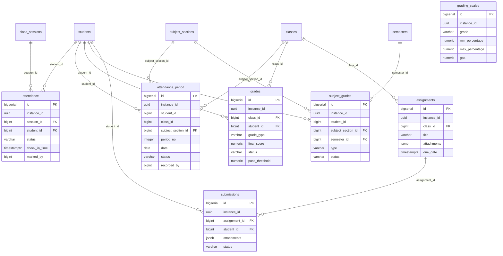

# KiteClass DB Schema — Cụm Điểm danh / Điểm số

> **TL;DR** — Cụm 7 bảng nghiệp vụ điểm danh và điểm số của `kiteclass-core` (mỗi tenant = 1 trường/trung tâm). `attendance` là bảng ghi nóng nhất (per-day, mô hình trung tâm); `attendance_period` là biến thể per-tiết cho trường K-12 (TT 22/2021/TT-BGDĐT). `grades` + `grading_scales` quản lý điểm tổng kết theo lớp; `subject_grades` quản lý điểm môn học K-12; `assignments` + `submissions` quản lý bài tập và bài nộp (có cột JSONB). **Tất cả 7 bảng đều tenant-scoped (`instance_id` UUID) và bật RLS FORCED từ V58/V59** (NULL force-fail = mặc định chặn).
>
> ⚠️ **Cảnh báo quan trọng:** Cụm này có mức độ **lệch entity↔migration cao nhất toàn DB**. Nhiều entity Java đã được refactor sang bộ cột hoàn toàn mới nhưng migration chỉ ADD cột mới mà GIỮ LẠI cột legacy V1 (làm nullable). Đọc kỹ §"Ghi chú schema (anomalies)" trước khi viết query hay migration mới — đây là dữ liệu vàng để dev kiểm soát DB.

---

## ERD cụm Điểm danh / Điểm số

> **Lưu ý đọc ERD:** ERD trên vẽ theo **cột vật lý hiện có trong migration** (chân lý DB). Nhiều entity Java map sang bộ cột khác (đã thêm qua ALTER) — xem từng bảng + §anomalies.

---

## `attendance`

### Mục đích
Ghi nhận điểm danh từng học sinh theo **buổi học** (`class_sessions`) — mô hình per-day dành cho trung tâm (CENTER tenant). Đây là bảng ghi nóng nhất cụm (~10k–100k dòng/tenant). Trường K-12 KHÔNG ghi vào bảng này mà dùng `attendance_period`.

### Bảng cột đầy đủ

| Cột | Kiểu | Null | Default | Khóa/Index | Ý nghĩa |
|---|---|---|---|---|---|
| `id` | BIGSERIAL | NO | auto | PK | Khóa chính tự tăng |
| `instance_id` | UUID | NO | — | `idx_attendance_instance`, RLS | Tenant ID (multi-tenant isolation) |
| `session_id` | BIGINT | NO | — | FK→`class_sessions(id)`, `idx_attendance_session` | Buổi học được điểm danh |
| `student_id` | BIGINT | NO | — | FK→`students(id)`, `idx_attendance_student` | Học sinh được điểm danh |
| `status` | VARCHAR(20) | NO | — | `idx_attendance_status`, CHECK | Trạng thái: `present`, `absent`, `late`, `excused` (chữ thường) |
| `check_in_time` | TIMESTAMPTZ | YES | — | — | Thời điểm check-in (dùng phát hiện đi muộn) |
| `notes` | TEXT | YES | — | — | Ghi chú điểm danh |
| `marked_by` | BIGINT | YES | — | — | User ID (gateway) của người điểm danh — KHÔNG có FK |
| `marked_at` | TIMESTAMPTZ | YES | `CURRENT_TIMESTAMP` | — | Thời điểm đánh dấu điểm danh |
| `created_at` | TIMESTAMPTZ | NO | `CURRENT_TIMESTAMP` | — | Thời điểm tạo (audit) |
| `updated_at` | TIMESTAMPTZ | NO | `CURRENT_TIMESTAMP` | — | Thời điểm cập nhật (trigger `trg_attendance_updated_at`) |
| `created_by` | UUID | YES | — | — | Actor UUID tạo dòng — thêm V26 (BIGINT) → đổi UUID V73 |
| `updated_by` | UUID | YES | — | — | Actor UUID cập nhật — thêm V26 (BIGINT) → đổi UUID V73 |
| `version` | BIGINT | YES | `0` | — | Optimistic lock — thêm V26, set default 0 ở V63 |

### Quan hệ
- **FK out:** `session_id → class_sessions(id)`, `student_id → students(id)` (cross-cluster: students thuộc cụm Học sinh, class_sessions thuộc cụm Lớp/Buổi học).
- **FK in:** không có.
- **Cardinality:** 1 session → N attendance; 1 student → N attendance.
- **Không FK:** `marked_by` (user ID từ gateway, không ràng buộc).

### RLS + ghi chú
- **Tenant-scoped:** ✅ `instance_id` UUID; RLS ENABLE + FORCE từ V58, NULL force-fail + admin-bypass (`app.is_platform_admin`) từ V59.
- **Soft-delete:** ❌ Migration KHÔNG có cột `deleted`. (Anomaly — entity yêu cầu `deleted`, xem §anomalies.)
- **JSONB:** không.
- **Unique:** `uk_attendance UNIQUE (session_id, student_id)` — 1 học sinh chỉ 1 dòng/buổi.
- **CHECK:** `chk_attendance_status` enforce 4 giá trị chữ thường.
- **Index hot-path:** `idx_attendance_session`, `idx_attendance_student`, `idx_attendance_status` — bảng ghi nóng nên cần index cho query theo buổi/học sinh.

---

## `attendance_period`

### Mục đích
Điểm danh từng **tiết** (per-period) cho trường K-12 — mỗi ngày 5–10 tiết, mỗi tiết một giáo viên bộ môn khác nhau (TT 22/2021/TT-BGDĐT). Chỉ K-12 tenant (`vertical_type = 'K12_SCHOOL'`) ghi vào bảng này; ràng buộc K-12 nằm ở tầng service (không thể CHECK cross-database).

### Bảng cột đầy đủ

| Cột | Kiểu | Null | Default | Khóa/Index | Ý nghĩa |
|---|---|---|---|---|---|
| `id` | BIGSERIAL | NO | auto | PK | Khóa chính tự tăng |
| `instance_id` | UUID | NO | — | `idx_att_period_instance_id`, RLS | Tenant ID |
| `student_id` | BIGINT | NO | — | `idx_att_period_student_date`, UK | Học sinh — KHÔNG có FK (chỉ index) |
| `class_id` | BIGINT | NO | — | `idx_att_period_class_date` | Lớp chủ nhiệm — KHÔNG có FK |
| `subject_section_id` | BIGINT | NO | — | FK→`subject_sections(id)`, UK | Lớp bộ môn (môn + lớp) của tiết này |
| `period_no` | INTEGER | NO | — | UK, CHECK | Số tiết (1..10) — CHECK `chk_att_period_no_range` (V51 siết từ `>0` về `1..10`) |
| `date` | DATE | NO | — | UK, `idx_att_period_student_date` | Ngày học (tách khỏi `recorded_at` để cho phép ghi lùi ngày) |
| `status` | VARCHAR(20) | NO | — | CHECK | Trạng thái: `PRESENT`, `ABSENT`, `LATE`, `EXCUSED`, `MAKEUP` (chữ HOA — khác `attendance`) |
| `recorded_by` | BIGINT | NO | — | `idx_att_period_recorded_by` | User ID người ghi nhận (≤2 phút SLA) — KHÔNG FK |
| `recorded_at` | TIMESTAMP | NO | — | — | Timestamp server-side khi ghi (không có timezone — khác `attendance`) |
| `notes` | VARCHAR(500) | YES | — | — | Ghi chú tiết |
| `created_at` | TIMESTAMP | NO | `CURRENT_TIMESTAMP` | — | Audit tạo (không timezone) |
| `updated_at` | TIMESTAMP | YES | — | — | Audit cập nhật (nullable — khác các bảng V1) |
| `created_by` | UUID | YES | — | — | Actor tạo — BIGINT trong V50, đổi UUID V73 |
| `updated_by` | UUID | YES | — | — | Actor cập nhật — BIGINT trong V50, đổi UUID V73 |
| `deleted` | BOOLEAN | NO | `FALSE` | `idx_att_period_deleted`, UK | Cờ soft-delete (V50 có sẵn — khác `attendance`) |
| `version` | BIGINT | NO | `0` | — | Optimistic lock (V50 có sẵn default 0) |

### Quan hệ
- **FK out:** `subject_section_id → subject_sections(id)` (cụm K-12). `student_id` + `class_id` KHÔNG có FK (chỉ index — chủ ý để tránh coupling migration order ở Phase 1A).
- **FK in:** không có.
- **Cardinality:** 1 subject_section → N period attendance; 1 student → N period attendance/ngày.

### RLS + ghi chú
- **Tenant-scoped:** ✅ RLS ENABLE/FORCE V58 + V59 hardening.
- **Soft-delete:** ✅ `deleted` (default FALSE).
- **JSONB:** không.
- **Unique:** `uk_att_period_student_section_date_period` UNIQUE `(student_id, subject_section_id, date, period_no, instance_id) WHERE deleted = FALSE` (BR-PERIOD-ATT-003 — partial unique loại trừ dòng đã xóa mềm).
- **CHECK:** `chk_att_period_status` (5 giá trị), `chk_att_period_no_range` (1..10).
- **Index hot-path:** `idx_att_period_student_date`, `idx_att_period_class_date`, `idx_att_period_subject_section`.

---

## `grades`

### Mục đích
Điểm tổng kết của học sinh theo **lớp** (`classes`). Bảng này có lịch sử migration phức tạp nhất cụm: V1 tạo theo mô hình "1 dòng = 1 bài đánh giá" (grade_type/title/score), nhưng entity `Grade.java` đã refactor sang mô hình "1 dòng = điểm tổng kết tính toán" (final_score/letter_grade/gpa/status). V64 thêm cột mới mà giữ cột legacy nullable → **có 2 bộ cột song song**.

### Bảng cột đầy đủ

| Cột | Kiểu | Null | Default | Khóa/Index | Ý nghĩa |
|---|---|---|---|---|---|
| `id` | BIGSERIAL | NO | auto | PK | Khóa chính |
| `instance_id` | UUID | NO | — | `idx_grades_instance`, RLS | Tenant ID |
| `class_id` | BIGINT | NO | — | FK→`classes(id)`, `idx_grades_class`, UK | Lớp |
| `student_id` | BIGINT | NO | — | FK→`students(id)`, `idx_grades_student`, UK | Học sinh |
| `grade_type` | VARCHAR(50) | YES* | — | `idx_grades_type`, UK | Loại điểm: `quiz`/`midterm`/`final`/`assignment`/`participation`. *V1 NOT NULL → V64 DROP NOT NULL |
| `title` | VARCHAR(255) | YES* | — | — | Tên bài đánh giá (legacy V1). *V64 DROP NOT NULL |
| `score` | DECIMAL(5,2) | YES* | — | — | Điểm thô (legacy V1). *V64 DROP NOT NULL |
| `max_score` | DECIMAL(5,2) | YES | `10` | — | Điểm tối đa (legacy V1) |
| `weight` | DECIMAL(3,2) | YES | `1.0` | — | Trọng số tính trung bình (legacy V1) |
| `feedback` | TEXT | YES | — | — | Nhận xét (legacy V1 — trùng nghĩa với `comments`) |
| `graded_date` | DATE | YES* | — | `idx_grades_date` | Ngày chấm (legacy V1). *V64 DROP NOT NULL |
| `graded_by` | BIGINT | YES | — | — | User ID người chấm (V1) — KHÔNG FK, **vẫn là BIGINT** (không đổi UUID như created_by) |
| `final_score` | NUMERIC(5,2) | YES | — | — | Điểm tổng kết 0–100 (entity, V64). NULL = chưa tính |
| `letter_grade` | VARCHAR(5) | YES | — | — | Điểm chữ A+/A/.../F map từ final_score (V64) |
| `gpa` | NUMERIC(3,2) | YES | — | — | GPA 0.0–4.0 map từ letter_grade (V64) |
| `status` | VARCHAR(20) | NO | `'IN_PROGRESS'` | — | `GradeStatus`: `IN_PROGRESS`/`FINALIZED`/`PASSED`/`FAILED` (V64) |
| `pass_threshold` | NUMERIC(5,2) | NO | `50.0` | — | Ngưỡng đậu (V64) |
| `comments` | TEXT | YES | — | — | Nhận xét giáo viên ≤2000 ký tự (V64 — trùng nghĩa `feedback`) |
| `calculated_at` | TIMESTAMPTZ | YES | — | — | Thời điểm tính final_score (V62) |
| `finalized_at` | TIMESTAMPTZ | YES | — | — | Thời điểm khóa điểm (V64) |
| `finalized_by` | BIGINT | YES | — | — | Teacher ID khóa điểm (V64) — KHÔNG FK, BIGINT |
| `deleted` | BOOLEAN | NO | `FALSE` | UK | Cờ soft-delete (V64 thêm — V1 không có) |
| `created_at` | TIMESTAMPTZ | NO | `CURRENT_TIMESTAMP` | — | Audit tạo |
| `updated_at` | TIMESTAMPTZ | NO | `CURRENT_TIMESTAMP` | — | Audit cập nhật (trigger) |
| `created_by` | UUID | YES | — | — | Actor tạo — V26 BIGINT → V73 UUID |
| `updated_by` | UUID | YES | — | — | Actor cập nhật — V26 BIGINT → V73 UUID |
| `version` | BIGINT | YES | `0` | — | Optimistic lock — V26 thêm, V62 set default 0 |

### Quan hệ
- **FK out:** `class_id → classes(id)`, `student_id → students(id)`.
- **FK in:** không có.
- **Cardinality:** 1 student × 1 class × 1 grade_type → 1 dòng (sau V74).
- **Không FK:** `graded_by`, `finalized_by` (user ID gateway).

### RLS + ghi chú
- **Tenant-scoped:** ✅ RLS V58/V59.
- **Soft-delete:** ✅ `deleted` (V64).
- **JSONB:** không.
- **Unique:** Lịch sử thay đổi: V64 tạo `uk_grades_student_class (student_id, class_id) WHERE deleted=false` → **V74 DROP và tạo lại** `uk_grades_student_class_type (student_id, class_id, grade_type) WHERE deleted=false`. Lý do (GAP-805): 1 học sinh trong 1 lớp có NHIỀU loại điểm (giữa kỳ + bài tập + cuối kỳ), UK 2 cột chặn sai.
- **CHECK:** `chk_grades_score CHECK (score >= 0 AND score <= max_score)` — chỉ ràng cột legacy `score`, KHÔNG ràng `final_score`.
- **Index hot-path:** `idx_grades_class`, `idx_grades_student`, `idx_grades_type`, `idx_grades_date`.

---

## `grading_scales`

### Mục đích
Thang điểm (grading scale) để map % điểm → điểm chữ → GPA, dùng cho tính toán GPA. Đây là bảng config nhỏ (ít dòng/tenant).

### Bảng cột đầy đủ

| Cột | Kiểu | Null | Default | Khóa/Index | Ý nghĩa |
|---|---|---|---|---|---|
| `id` | BIGSERIAL | NO | auto | PK | Khóa chính |
| `instance_id` | UUID | NO | — | `idx_grading_scales_instance`, RLS, UK | Tenant ID |
| `grade` | VARCHAR(5) | NO | — | UK | Điểm chữ: A+, A, B+, B, C+, C, D+, D, F |
| `min_percentage` | DECIMAL(5,2) | NO | — | — | % tối thiểu (vd 95.00) |
| `max_percentage` | DECIMAL(5,2) | NO | — | — | % tối đa (vd 100.00) |
| `gpa` | DECIMAL(3,2) | NO | — | — | Giá trị GPA (vd 4.0) |
| `description` | VARCHAR(255) | YES | — | — | Mô tả thang điểm |
| `created_at` | TIMESTAMPTZ | NO | `CURRENT_TIMESTAMP` | — | Audit tạo |
| `created_by` | UUID | YES | — | — | Actor tạo — V26 BIGINT → V73 UUID |
| `updated_by` | UUID | YES | — | — | Actor cập nhật — V26 BIGINT → V73 UUID |
| `version` | BIGINT | YES | `0` | — | Optimistic lock — V26 thêm, V62 set default 0 |

### Quan hệ
- **FK out:** không có (bảng config độc lập, chỉ scope theo `instance_id`).
- **FK in:** logic — `grades.letter_grade`/`gpa` map qua thang này (không ràng FK).
- **Cardinality:** 1 tenant → N thang điểm (mỗi grade 1 dòng).

### RLS + ghi chú
- **Tenant-scoped:** ✅ RLS V58/V59.
- **Soft-delete:** ❌ Migration KHÔNG có `deleted` và KHÔNG có `updated_at` (chỉ `created_at`).
- **JSONB:** không.
- **Unique:** `uk_grading_scales_instance_grade UNIQUE (instance_id, grade)` — mỗi tenant 1 dòng/điểm-chữ.
- **CHECK:** không.

---

## `subject_grades`

### Mục đích
Điểm **môn học** theo học kỳ cho K-12 (TT 22/2021/TT-BGDĐT — workflow Tổ trưởng duyệt điểm). Mỗi dòng = điểm của 1 học sinh trong 1 lớp bộ môn ở 1 học kỳ, có 3 loại đánh giá (TX/GK/CK).

### Bảng cột đầy đủ

| Cột | Kiểu | Null | Default | Khóa/Index | Ý nghĩa |
|---|---|---|---|---|---|
| `id` | BIGSERIAL | NO | auto | PK | Khóa chính |
| `instance_id` | UUID | NO | — | `idx_sg_instance_id`, RLS | Tenant ID |
| `student_id` | BIGINT | NO | — | UK | Học sinh — KHÔNG FK (chỉ index) |
| `subject_section_id` | BIGINT | NO | — | FK→`subject_sections(id)`, UK | Lớp bộ môn |
| `semester_id` | BIGINT | NO | — | FK→`semesters(id)`, UK | Học kỳ |
| `regular_score` | DECIMAL(4,2) | YES | — | CHECK | Điểm thường xuyên (0–10) |
| `midterm_score` | DECIMAL(4,2) | YES | — | CHECK | Điểm giữa kỳ (0–10) |
| `final_score` | DECIMAL(4,2) | YES | — | CHECK | Điểm cuối kỳ (0–10) |
| `average` | DECIMAL(4,2) | YES | — | CHECK | Điểm trung bình (0–10) |
| `letter_grade` | VARCHAR(20) | YES | — | — | Xếp loại chữ |
| `notes` | VARCHAR(500) | YES | — | — | Ghi chú |
| `type` | VARCHAR(8) | NO | `'TX'` | `idx_sg_..._type`, CHECK | Loại điểm: `TX`/`GK`/`CK` (V55) |
| `weight` | DECIMAL(4,2) | NO | `1.0` | CHECK | Trọng số (TX=1.0, GK=2.0, CK=3.0 per BR-GRADEBOOK-004) (V55) |
| `status` | VARCHAR(16) | NO | `'DRAFT'` | `idx_sg_status`, CHECK | `DRAFT`/`REVIEWED`/`PUBLISHED` (workflow Tổ trưởng, V55) |
| `reviewed_by` | BIGINT | YES | — | — | User ID người duyệt (V55) — KHÔNG FK, BIGINT |
| `published_at` | TIMESTAMP | YES | — | — | Thời điểm công bố (V55) |
| `created_at` | TIMESTAMP | NO | `CURRENT_TIMESTAMP` | — | Audit tạo (không timezone) |
| `updated_at` | TIMESTAMP | NO | `CURRENT_TIMESTAMP` | — | Audit cập nhật |
| `created_by` | UUID | YES | — | — | Actor tạo — V29 VARCHAR(100) → V46 BIGINT → V73 UUID (3 lần đổi kiểu!) |
| `updated_by` | UUID | YES | — | — | Actor cập nhật — V29 VARCHAR(100) → V46 BIGINT → V73 UUID |
| `version` | BIGINT | NO | `0` | — | Optimistic lock (V29 có sẵn default 0) |
| `deleted` | BOOLEAN | NO | `FALSE` | `idx_sg_deleted`, UK | Cờ soft-delete (V29 có sẵn) |

### Quan hệ
- **FK out:** `subject_section_id → subject_sections(id)`, `semester_id → semesters(id)` (cụm K-12). `student_id` KHÔNG FK.
- **FK in:** không có.
- **Cardinality:** 1 student × 1 subject_section × 1 semester → 1 dòng (UK).

### RLS + ghi chú
- **Tenant-scoped:** ✅ RLS V58/V59.
- **Soft-delete:** ✅ `deleted` (V29).
- **JSONB:** không.
- **Unique:** `idx_sg_student_section_semester UNIQUE (student_id, subject_section_id, semester_id) WHERE deleted=FALSE`.
- **CHECK:** `chk_sg_scores` (4 điểm trong 0–10), `chk_sg_type` (TX/GK/CK), `chk_sg_status` (DRAFT/REVIEWED/PUBLISHED), `chk_sg_weight` (0–10).
- **Index hot-path:** `idx_sg_status WHERE deleted=FALSE`, `idx_sg_subject_section_status`, `idx_sg_student_section_semester_type` (cho review queue Tổ trưởng/Hiệu trưởng).

---

## `assignments`

### Mục đích
Định nghĩa bài tập và hạn nộp theo **lớp** (`classes`). Có cột JSONB `attachments` để lưu danh sách file đính kèm.

### Bảng cột đầy đủ

| Cột | Kiểu | Null | Default | Khóa/Index | Ý nghĩa |
|---|---|---|---|---|---|
| `id` | BIGSERIAL | NO | auto | PK | Khóa chính |
| `instance_id` | UUID | NO | — | `idx_assignments_instance`, RLS | Tenant ID |
| `class_id` | BIGINT | NO | — | FK→`classes(id)`, `idx_assignments_class` | Lớp |
| `title` | VARCHAR(255) | NO | — | — | Tiêu đề bài tập |
| `description` | TEXT | YES | — | — | Mô tả |
| `instructions` | TEXT | YES | — | — | Hướng dẫn làm bài |
| `attachments` | JSONB | YES | `'[]'` | — | **JSONB** — danh sách file `[{"name","url","size"}]` |
| `assigned_date` | TIMESTAMPTZ | YES | `CURRENT_TIMESTAMP` | — | Ngày giao bài |
| `due_date` | TIMESTAMPTZ | NO | — | `idx_assignments_due` | Hạn nộp |
| `max_score` | DECIMAL(5,2) | YES | `10` | — | Điểm tối đa |
| `status` | VARCHAR(50) | YES | `'active'` | `idx_assignments_status` | `draft`/`active`/`closed` (chữ thường) |
| `created_at` | TIMESTAMPTZ | NO | `CURRENT_TIMESTAMP` | — | Audit tạo |
| `updated_at` | TIMESTAMPTZ | NO | `CURRENT_TIMESTAMP` | — | Audit cập nhật (trigger) |
| `created_by` | UUID | YES | — | — | Actor tạo (V1 có sẵn BIGINT) → V73 UUID |
| `updated_by` | UUID | YES | — | — | Actor cập nhật — V26 BIGINT → V73 UUID |
| `version` | BIGINT | YES | `0` | — | Optimistic lock — V26 thêm, V63 set default 0 |

### Quan hệ
- **FK out:** `class_id → classes(id)`.
- **FK in:** `submissions.assignment_id → assignments(id)`.
- **Cardinality:** 1 class → N assignments; 1 assignment → N submissions.

### RLS + ghi chú
- **Tenant-scoped:** ✅ RLS V58/V59.
- **Soft-delete:** ❌ Migration KHÔNG có `deleted`.
- **JSONB:** ✅ `attachments` (default `'[]'`).
- **Unique:** không.
- **CHECK:** không.
- **Index hot-path:** `idx_assignments_class`, `idx_assignments_due`, `idx_assignments_status`.

---

## `submissions`

### Mục đích
Bài nộp của học sinh cho từng bài tập. Có cột JSONB `attachments`. 1 học sinh chỉ nộp 1 lần/bài tập (UK).

### Bảng cột đầy đủ

| Cột | Kiểu | Null | Default | Khóa/Index | Ý nghĩa |
|---|---|---|---|---|---|
| `id` | BIGSERIAL | NO | auto | PK | Khóa chính |
| `instance_id` | UUID | NO | — | `idx_submissions_instance`, RLS | Tenant ID |
| `assignment_id` | BIGINT | NO | — | FK→`assignments(id)`, `idx_submissions_assignment`, UK | Bài tập |
| `student_id` | BIGINT | NO | — | FK→`students(id)`, `idx_submissions_student`, UK | Học sinh nộp |
| `content` | TEXT | YES | — | — | Nội dung bài nộp (text) |
| `attachments` | JSONB | YES | `'[]'` | — | **JSONB** — file đính kèm |
| `status` | VARCHAR(50) | YES | `'submitted'` | `idx_submissions_status` | `draft`/`submitted`/`late`/`graded` (chữ thường) |
| `score` | DECIMAL(5,2) | YES | — | — | Điểm chấm |
| `feedback` | TEXT | YES | — | — | Nhận xét |
| `graded_at` | TIMESTAMPTZ | YES | — | — | Thời điểm chấm |
| `graded_by` | BIGINT | YES | — | — | User ID người chấm — KHÔNG FK, BIGINT |
| `submitted_at` | TIMESTAMPTZ | YES | `CURRENT_TIMESTAMP` | — | Thời điểm nộp |
| `created_at` | TIMESTAMPTZ | NO | `CURRENT_TIMESTAMP` | — | Audit tạo |
| `updated_at` | TIMESTAMPTZ | NO | `CURRENT_TIMESTAMP` | — | Audit cập nhật (trigger) |
| `created_by` | UUID | YES | — | — | Actor tạo — V26 BIGINT → V73 UUID |
| `updated_by` | UUID | YES | — | — | Actor cập nhật — V26 BIGINT → V73 UUID |
| `version` | BIGINT | YES | `0` | — | Optimistic lock — V26 thêm, V62 set default 0 |

### Quan hệ
- **FK out:** `assignment_id → assignments(id)`, `student_id → students(id)`.
- **FK in:** không có.
- **Cardinality:** 1 assignment → N submissions; 1 student × 1 assignment → 1 submission (UK).

### RLS + ghi chú
- **Tenant-scoped:** ✅ RLS V58/V59.
- **Soft-delete:** ❌ Migration KHÔNG có `deleted`.
- **JSONB:** ✅ `attachments`.
- **Unique:** `uk_submissions UNIQUE (assignment_id, student_id)`.
- **CHECK:** không.
- **Index hot-path:** `idx_submissions_assignment`, `idx_submissions_student`, `idx_submissions_status`.

---

## Ghi chú schema (anomalies)

> Đây là **danh sách lệch chuẩn** giữa migration (chân lý DB) và entity Java (`*.java`). Dev PHẢI nắm để tránh viết query sai hoặc tạo migration mâu thuẫn. Hầu hết phát sinh từ việc refactor entity nhưng chỉ ADD cột mới + giữ cột legacy nullable.

### A. `attendance` — lệch entity↔migration NGHIÊM TRỌNG nhất cụm

`Attendance.java` map sang **bộ cột hoàn toàn khác** với migration:

| Entity (`Attendance.java`) | Migration (`attendance` V1+V26+V63) | Vấn đề |
|---|---|---|
| `enrollment_id` (NOT NULL) | KHÔNG có cột | Entity FK theo enrollment, DB FK theo `student_id` |
| `marked_date` (NOT NULL) | `marked_at` (nullable) | Tên cột khác → entity sẽ fail `column marked_date does not exist` |
| `points_awarded` (Integer) | KHÔNG có cột | Cột gamification chỉ có trong entity |
| `deleted` (BaseEntity) | KHÔNG có cột | RLS V58 + soft-delete pattern kỳ vọng `deleted` nhưng `attendance` thiếu |
| UK `(enrollment_id, session_id, instance_id, deleted)` | UK `(session_id, student_id)` | Khác hẳn — entity declare UK theo enrollment + deleted |
| `created_by`/`updated_by` UUID (BaseEntity) | UUID (sau V73) ✅ | Khớp |
| (không có) | `student_id` (NOT NULL, FK) | DB còn cột legacy `student_id` mà entity không map |
| (không có) | `check_in_time` | DB còn cột mà entity không map |

→ **Chưa có migration align `attendance` với `Attendance.java`** (khác với `grades` đã có V64). Đây là rủi ro cao: nếu chạy entity trên DB thật sẽ lỗi `column enrollment_id/marked_date/points_awarded/deleted does not exist`. Cần migration mới (giống V64 cho grades) HOẶC entity đang được dùng ở luồng khác chưa hit. **Cần verify bằng RST walk luồng điểm danh trung tâm.**

### B. `grades` — 2 bộ cột song song (legacy V1 + entity V64)

- **Cột legacy V1 GIỮ LẠI nhưng DROP NOT NULL (V64):** `grade_type`, `title`, `score`, `max_score`, `weight`, `feedback`, `graded_date`, `graded_by`. Entity `Grade.java` chỉ map `grade_type` (để sở hữu cột trong UK V74) + bỏ qua phần còn lại.
- **Cột trùng nghĩa:** `feedback` (legacy) vs `comments` (entity) — cùng là nhận xét giáo viên. `score`/`max_score` (legacy điểm thô) vs `final_score`/`pass_threshold` (entity điểm tính toán).
- **CHECK lệch:** `chk_grades_score` chỉ ràng `score <= max_score` (cột legacy), KHÔNG ràng `final_score` (cột entity dùng thực).
- **UK đảo 2 lần:** V64 tạo UK 2 cột → V74 đảo sang UK 3 cột (thêm `grade_type`). Migration trước cố ý loại `grade_type`, migration sau thêm lại — đọc kỹ thứ tự.
- **Khuyến nghị:** cleanup migration tương lai DROP 8 cột legacy sau khi xác nhận zero usage (V64 comment đã ghi nhận).

### C. `grading_scales` — entity dùng bộ cột HOÀN TOÀN KHÁC

`GradingScale.java` map: `scale_name`, `letter_grade`, `min_score`, `max_score`, `gpa_value`, `is_default`, `is_passing` + (BaseEntity: `deleted`, `updated_at`, `updated_by`).
Migration `grading_scales` chỉ có: `grade`, `min_percentage`, `max_percentage`, `gpa`, `description` + `created_at`/`created_by`/`updated_by`/`version`.

→ **KHÔNG có một cột nghiệp vụ nào trùng tên** (`grade` vs `letter_grade`, `min_percentage` vs `min_score`, `gpa` vs `gpa_value`). Entity còn thiếu `deleted`/`updated_at`/`is_default`/`is_passing` trong DB. Đây là drift "câm" — chưa có migration align. Rủi ro cao như `attendance`.

### D. `assignments` & `submissions` — entity dùng cột khác migration

- **`Assignment.java`** map: `weight_percent`, `allow_late_submission`, `late_penalty_percent`, `deleted` (BaseEntity) — migration KHÔNG có. Migration có `attachments` (JSONB), `assigned_date`, `instructions` mà entity không map (entity dùng `due_date`/`max_score`/`status` trùng tên migration).
- **`Submission.java`** map: `submission_date`, `content_url`, `notes`, `adjusted_score`, `deleted` — migration KHÔNG có. Migration có `content`, `attachments` (JSONB), `submitted_at` mà entity không map. Cột trùng tên: `score`, `feedback`, `graded_at`, `graded_by`, `status`, `assignment_id`, `student_id`.
- → Cả 2 bảng thiếu `deleted` trong DB nhưng entity kế thừa `BaseEntity.deleted` (NOT NULL). Drift "câm" — chưa align.

### E. Kiểu actor column KHÔNG nhất quán (BIGINT vs UUID)

V73 đổi **chỉ** `created_by`/`updated_by` (mọi bảng) từ BIGINT→UUID. Nhưng các cột actor nghiệp vụ khác **vẫn là BIGINT**:
- `attendance.marked_by` → BIGINT
- `grades.graded_by`, `grades.finalized_by` → BIGINT
- `submissions.graded_by` → BIGINT
- `subject_grades.reviewed_by` → BIGINT
- `attendance_period.recorded_by` → BIGINT

→ Trong khi gateway forward `X-User-Id` = UUID (theo lý do V73). Vậy 5 cột actor trên hoặc chưa được ghi đúng, hoặc lưu user ID dạng khác. **Inconsistency:** cùng ngữ nghĩa "ai thực hiện" nhưng `created_by` là UUID còn `graded_by`/`marked_by`/`reviewed_by`/`recorded_by` là BIGINT. Cần thống nhất ở migration tương lai.

### F. Kiểu timestamp KHÔNG nhất quán (TIMESTAMPTZ vs TIMESTAMP)

- Bảng V1 (`attendance`, `grades`, `grading_scales`, `assignments`, `submissions`): dùng `TIMESTAMP WITH TIME ZONE` (timestamptz).
- Bảng V29/V50 (`subject_grades`, `attendance_period`): dùng `TIMESTAMP` (không timezone) cho `created_at`/`updated_at`/`recorded_at`/`published_at`.

→ Lệch chuẩn timezone giữa bảng cũ và mới. Query cross-table so sánh thời gian cần lưu ý (TIMESTAMP không có tz vs TIMESTAMPTZ).

### G. `subject_grades.created_by` đổi kiểu 3 lần
V29 tạo VARCHAR(100) → V46 align BIGINT → V73 đổi UUID. Lịch sử kiểu phức tạp nhất cụm — minh chứng cho drift audit-column kéo dài.

### H. `attendance` & `grading_scales` & `assignments` & `submissions` thiếu `deleted`
4/7 bảng KHÔNG có cột `deleted` trong migration, dù entity (qua BaseEntity) hoặc pattern RLS kỳ vọng có. Chỉ `attendance_period`, `grades` (V64), `subject_grades` có. Soft-delete không đồng nhất toàn cụm.

### I. Enum status chữ HOA vs chữ thường
- `attendance.status`: chữ thường (`present`/`absent`/`late`/`excused`).
- `attendance_period.status` + `subject_grades.status` + `grades.status`: chữ HOA (`PRESENT`/`ABSENT`/...`DRAFT`/`IN_PROGRESS`).
- `assignments.status` + `submissions.status`: chữ thường (`active`/`submitted`).

→ Không thống nhất casing enum giữa các bảng cùng cụm.

### J. RLS coverage gap — bảng tạo sau V58/V59 chưa enable RLS DB-level

V58 (enable RLS) + V59 (hardening) dùng danh sách bảng tĩnh chạy 1 lần. Bảng tạo SAU V58/V59 hoặc trong cụm nhưng không nằm trong list:

| Bảng | Migration tạo | `instance_id`? | RLS V58/V59 enabled? | Cô lập tenant |
|---|---|:---:|:---:|---|
| `attendance_period` | V50 | ✅ Có | ⚠️ Cần verify (V50 sau V58?) | Code-level `tenantFilter` |
| `subject_grades` | V29 | ✅ Có | ✅ Trong list V58 | RLS DB-level + code |
| `assignments` | V1 | ✅ Có | ✅ V58 | RLS DB-level + code |
| `submissions` | V1 | ✅ Có | ✅ V58 | RLS DB-level + code |

→ `attendance_period` cần verify — nếu V50 chạy sau V58 thì RLS chưa enable DB-level. Pattern giống baseline 04-finance.md A9 (`payment_records` V69 + `payment_idempotency_keys` V61 RLS coverage gap). Risk: dependent on Hibernate `@Filter("tenantFilter")` only — nếu service code dùng raw SQL bypass filter → leak cross-tenant.

→ Fix: V60+ migration re-run RLS enable cho bảng tạo sau V58 (idempotent — `ALTER TABLE ... ENABLE ROW LEVEL SECURITY` skip nếu đã enabled).

### K. `version` thiếu DEFAULT 0 trên bảng V1 cũ (batched V62/V63 backfill)

V26 thêm cột `version BIGINT` cho 14 bảng V1 (không default). V62/V63 set DEFAULT 0 cho 19 bảng (gom batch). Bảng cụm điểm danh/điểm số:

- **Trong V62/V63 batch:** `attendance` (V63), `grades` (V62), `grading_scales` (V62), `assignments` (V62), `submissions` (V62).
- **Tạo sau với DEFAULT 0 ngay:** `subject_grades` (V29 với DEFAULT 0), `attendance_period` (V50 với DEFAULT 0).

→ Production safe (V62/V63 đã chạy). Risk chỉ ở dev local restart từ V26-state (giữa V26 → V62) — raw INSERT vào snapshot test sẽ NPE tại flush vì `version IS NULL` + entity `@Version` annotation expect NOT NULL. Cùng class baseline 04-finance.md A7.

---

## Liên kết

- [README cụm database KiteClass](../README.md)
- [Bản đồ kiến trúc database toàn dự án](../../database-architecture-map.md)
