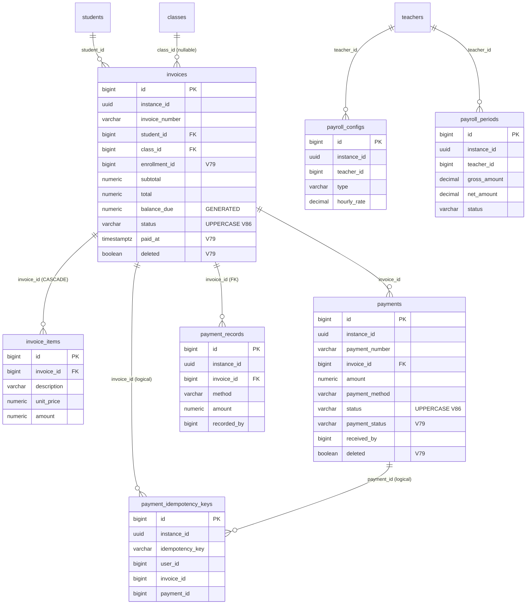

# Cluster Tài chính / Lương (KiteClass)

> **Cập nhật Wave 14 (KC V79-V86)** — cluster này đã được đồng bộ schema sau đợt fix drift: `invoices`/`payments` thêm cột `deleted` + soft-delete; `invoices.enrollment_id`/`paid_at`; enum status UPPERCASE + CHECK (V86); tiền chuyển `NUMERIC(19,2)` (V86); timestamp `_at`/`_time` chuyển `TIMESTAMPTZ` (V86); `payment_records` bật RLS DB-level (V85); `version` set DEFAULT 0 (V80). Các anomaly còn lại (actor BIGINT, dual-system canonical) là DEFERRED — xem [§ anomalies](#-ghi-chú-schema-anomalies).

> **TL;DR** — Cluster này gồm **7 bảng**: `invoices`, `invoice_items`, `payments`, `payment_records`,
> `payment_idempotency_keys`, `payroll_configs`, `payroll_periods`.
>
> - **Hóa đơn**: `invoices` (1 hóa đơn / học sinh) → `invoice_items` (dòng chi tiết, CASCADE).
> - **Thanh toán có 2 hệ song song** (xem [§ anomalies](#-ghi-chú-schema-anomalies)):
>   - `payments` — bản ghi V1, định hướng **cổng thanh toán online** (VNPay/MoMo redirect).
>   - `payment_records` — bản ghi V69 (GAP-292b), định hướng **thu thủ công tại trung tâm** (tiền mặt / chuyển khoản / VietQR / MoMo). Đây là hệ **canonical** cho luồng Phase 1 BETA.
> - **Lương giáo viên**: `payroll_configs` (cấu hình lương / GV) + `payroll_periods` (kỳ lương). Phase 1 chỉ HOURLY.
> - **Idempotency**: `payment_idempotency_keys` (V61, riêng cho parent payment) — chú ý còn 1 bảng `idempotency_keys` (V66) shared cross-domain KHÔNG thuộc cluster này.
> - **Đơn vị tiền**: `invoices`/`invoice_items`/`payments` chuyển `NUMERIC(19,2)` ở **V86** (trước đó `DECIMAL(12,2)`) — đồng nhất với `payment_records`. `payroll_*` vẫn `DECIMAL(15,2)`/`(7,2)`/`(5,2)`. `payment_idempotency_keys` comment nói VND minor-unit BIGINT nhưng KHÔNG có cột amount.
> - **RLS** (V58 → V59 hardened): bật trên `invoices`, `payments`, `payroll_configs`, `payroll_periods`; `payment_records` bật RLS DB-level ở **V85**. KHÔNG bật trên `invoice_items` (không có `instance_id`), `payment_idempotency_keys` (V61, tạo sau V58/V59 — RLS chưa apply).

---

## ERD

> Ghi chú quan hệ: các FK gắn `FK` ở ERD là **FK thật trong DB**. Các quan hệ `payment_records → invoices` là FK thật (`fk_payment_records_invoice`). `payments → invoices`, `invoices → students/classes` là FK thật trong V1. `payment_idempotency_keys.invoice_id` / `.payment_id` là **liên kết logic** (KHÔNG có FK constraint — xem anomalies).

---

## `invoices`

**Mục đích.** Hóa đơn học phí + phí của học sinh. Mỗi hóa đơn thuộc 1 tenant (`instance_id`), tham chiếu 1 học sinh, theo dõi vòng đời thanh toán (DRAFT → PARTIAL → PAID). Tạo ở `V1`, bổ sung audit cột ở `V26`, bật RLS ở `V58/V59`.

| Cột | Kiểu | Null | Default | Khóa/Index | Ý nghĩa |
|---|---|---|---|---|---|
| `id` | BIGSERIAL | NO | seq | PK | Khóa chính |
| `instance_id` | UUID | NO | — | `idx_invoices_instance`; UNIQUE thành phần | Tenant ID (multi-tenant isolation) |
| `invoice_number` | VARCHAR(50) | NO | — | UNIQUE `(instance_id, invoice_number)` | Số hóa đơn, vd `INV-2025-0001` |
| `student_id` | BIGINT | NO | — | FK → `students(id)`; `idx_invoices_student` | Học sinh được lập hóa đơn (cross-cluster → cluster Học sinh) |
| `class_id` | BIGINT | YES | — | FK → `classes(id)`; `idx_invoices_class` | Lớp liên quan (nullable) |
| `period_start` | DATE | NO | — | `idx_invoices_period` | Đầu kỳ tính phí |
| `period_end` | DATE | NO | — | `idx_invoices_period` | Cuối kỳ tính phí |
| `enrollment_id` | BIGINT | YES | — | UNIQUE partial `uk_invoices_enrollment WHERE enrollment_id IS NOT NULL`; `idx_invoices_enrollment` | ✅ **V79** — liên kết ghi danh (Invoice extends BaseEntity); 1 hóa đơn / ghi danh |
| `subtotal` | NUMERIC(19,2) | NO | — | — | Tạm tính (VND) trước giảm trừ. ✅ **V86** chuyển từ DECIMAL(12,2) → NUMERIC(19,2) |
| `discount` | NUMERIC(19,2) | YES | `0` | — | Giảm trừ (VND); cột legacy — ưu tiên dùng `InvoiceAdjustment`. ✅ **V86** NUMERIC(19,2) |
| `total` | NUMERIC(19,2) | NO | — | — | Tổng tiền (VND) sau giảm trừ. ✅ **V86** NUMERIC(19,2) |
| `amount_paid` | NUMERIC(19,2) | YES | `0` | — | Đã thanh toán (VND). ✅ **V86** NUMERIC(19,2) |
| `balance_due` | NUMERIC(19,2) | — | `GENERATED ALWAYS AS (total - amount_paid) STORED` | — | Còn nợ (VND) — cột tính, lưu sẵn. ✅ **V86** drop+recreate kiểu NUMERIC(19,2) |
| `issue_date` | DATE | NO | `CURRENT_DATE` | — | Ngày phát hành |
| `due_date` | DATE | NO | — | `idx_invoices_due_date` (partial WHERE status IN `SENT`/`PARTIAL` — V86) | Hạn thanh toán |
| `status` | VARCHAR(50) | YES | `'DRAFT'` (V86) | `idx_invoices_status`; CHECK | ✅ **V86** — enum UPPERCASE đồng bộ entity `InvoiceStatus`. CHECK DB: `DRAFT, SENT, PARTIAL, PAID, OVERDUE, CANCELLED, REFUNDED`. Dữ liệu cũ lowercase được UPDATE map sang UPPERCASE |
| `paid_at` | TIMESTAMPTZ | YES | — | — | ✅ **V79** — thời điểm hóa đơn thanh toán đủ |
| `deleted` | BOOLEAN | NO | `FALSE` | `idx_invoices_deleted` | ✅ **V79** — Soft-delete (Invoice extends BaseEntity) |
| `notes` | TEXT | YES | — | — | Ghi chú |
| `created_at` | TIMESTAMPTZ | NO | `CURRENT_TIMESTAMP` | — | Audit — tạo |
| `updated_at` | TIMESTAMPTZ | NO | `CURRENT_TIMESTAMP` | — | Audit — cập nhật |
| `created_by` | BIGINT → **UUID** | YES | — | — | Actor tạo. V1 = BIGINT; **V73 convert → UUID** (X-User-Id JWT `sub`) |
| `updated_by` | BIGINT → **UUID** | YES | — | — | Actor cập nhật. Thêm bởi `V26`; **V73 convert → UUID** |
| `version` | BIGINT | YES | `0` (V80) | — | Optimistic lock. Thêm bởi `V26`. ✅ **V80** set DEFAULT 0 + backfill NULL→0 |

**Constraints**: `uk_invoices_instance_number UNIQUE(instance_id, invoice_number)`; `chk_invoices_amounts CHECK(subtotal>=0 AND discount>=0 AND total>=0 AND amount_paid>=0)`; `chk_invoices_status CHECK(status IN ('DRAFT','SENT','PARTIAL','PAID','OVERDUE','CANCELLED','REFUNDED'))` (V86); `uk_invoices_enrollment UNIQUE(enrollment_id) WHERE enrollment_id IS NOT NULL` (V79).

**Quan hệ FK**
- Out: `student_id → students(id)`, `class_id → classes(id)` (cross-cluster: Học sinh / Lớp).
- In: `invoice_items.invoice_id → invoices(id)` (CASCADE), `payments.invoice_id → invoices(id)`, `payment_records.invoice_id → invoices(id)`. `payment_idempotency_keys.invoice_id` là tham chiếu logic (no FK).

**RLS + ghi chú**
- Tenant-scoped ✅. RLS bật ở `V58` (`ENABLE` + `FORCE ROW LEVEL SECURITY` + policy `tenant_isolation`), hardened ở `V59` (admin-bypass `app.is_platform_admin` + NULL force-fail — bỏ escape hatch `NULLIF` default-allow).
- Soft-delete: ✅ **(V79)** — entity `Invoice extends BaseEntity` đã có cột `deleted` + `enrollment_id` + `paid_at` + index `idx_invoices_deleted`/`idx_invoices_enrollment` (GAP-880/881 resolved). Trước Wave 14 migration KHÔNG tạo các cột này (drift) — nay đã đồng bộ.

---

## `invoice_items`

**Mục đích.** Dòng chi tiết của hóa đơn (học phí, tài liệu, phí khác). Phụ thuộc vòng đời hóa đơn cha (xóa hóa đơn → CASCADE xóa item). Tạo ở `V1`.

| Cột | Kiểu | Null | Default | Khóa/Index | Ý nghĩa |
|---|---|---|---|---|---|
| `id` | BIGSERIAL | NO | seq | PK | Khóa chính |
| `invoice_id` | BIGINT | NO | — | FK → `invoices(id)` **ON DELETE CASCADE**; `idx_invoice_items_invoice` | Hóa đơn cha |
| `description` | VARCHAR(255) | NO | — | — | Mô tả dòng |
| `quantity` | INTEGER | YES | `1` | — | Số lượng |
| `unit_price` | NUMERIC(19,2) | NO | — | — | Đơn giá (VND). ✅ **V86** chuyển DECIMAL(12,2) → NUMERIC(19,2) |
| `amount` | NUMERIC(19,2) | NO | — | — | Thành tiền dòng (VND). ✅ **V86** NUMERIC(19,2) |
| `item_type` | VARCHAR(50) | YES | — | — | Loại: `tuition, material, other` (comment DB). Entity enum `InvoiceItemType` = TUITION/MATERIALS/REGISTRATION_FEE/EXAM_FEE/OTHER — drift (xem anomalies) |
| `reference_id` | BIGINT | YES | — | — | Tham chiếu (class_id, session_id…) — không FK |
| `created_at` | TIMESTAMPTZ | NO | `CURRENT_TIMESTAMP` | — | Audit — tạo |
| `created_by` | BIGINT | YES | — | — | Thêm bởi `V26`; **V73 convert → UUID** (created_by/updated_by sweep) |
| `updated_by` | BIGINT | YES | — | — | Thêm bởi `V26`; **V73 convert → UUID** |
| `version` | BIGINT | YES | `0` | — | Thêm bởi `V26`; **V62 SET DEFAULT 0** + backfill NULL→0 |

**Constraints**: chỉ FK CASCADE tới `invoices`. Không có UNIQUE riêng.

**Quan hệ FK**
- Out: `invoice_id → invoices(id)` (cardinality N-1; nhiều item / 1 hóa đơn).
- In: không.

**RLS + ghi chú**
- **KHÔNG** tenant-scoped trực tiếp: bảng **không có cột `instance_id`** ⇒ V58/V59 **bỏ qua** (`Skipping table (no instance_id column)`). Cô lập tenant qua hóa đơn cha (item luôn truy cập qua `invoice_id`).
- Entity `InvoiceItem` KHÔNG extends `BaseEntity` (không `deleted`/`instance_id`/`version` qua superclass; `version` chỉ tồn tại do V26 thêm ở DB).

---

## `payments`

**Mục đích.** Bản ghi thanh toán cho hóa đơn — **hệ V1**, định hướng cổng thanh toán online (cash/bank_transfer/momo/zalopay/qr). Tạo ở `V1`, bổ sung audit ở `V26`, RLS ở `V58/V59`. ⚠️ **DEPRECATED** (V85 COMMENT, GAP-879): bảng legacy online-gateway; hệ canonical Phase 1 BETA = `payment_records` (V69). **V79 đã backfill** nhiều cột entity `Payment` (`payment_status`, `installment_id`, `gateway_*`, `*_at`, `deleted`...) — entity ↔ bảng đã reconcile phần lớn (xem A2).

| Cột | Kiểu | Null | Default | Khóa/Index | Ý nghĩa |
|---|---|---|---|---|---|
| `id` | BIGSERIAL | NO | seq | PK | Khóa chính |
| `instance_id` | UUID | NO | — | `idx_payments_instance`; UNIQUE thành phần | Tenant ID |
| `payment_number` | VARCHAR(50) | NO | — | UNIQUE `(instance_id, payment_number)` | Số phiếu thu, vd `PAY-2025-0001` |
| `invoice_id` | BIGINT | NO | — | FK → `invoices(id)`; `idx_payments_invoice` | Hóa đơn được thanh toán |
| `amount` | NUMERIC(19,2) | NO | — | CHECK `> 0` | Số tiền (VND). ✅ **V86** chuyển DECIMAL(12,2) → NUMERIC(19,2) |
| `payment_method` | VARCHAR(50) | NO | — | — | Phương thức: `cash, bank_transfer, momo, zalopay, qr` (comment) |
| `transaction_id` | VARCHAR(100) | NO | — | UNIQUE `uk_payments_transaction_id` (V79) | Mã giao dịch cổng. ✅ **V79** set NOT NULL + UNIQUE (backfill `legacy-<id>` cho row cũ NULL) |
| `payment_status` | VARCHAR(50) | NO | `'PENDING'` (V79) | `idx_payments_payment_status` | ✅ **V79** — enum UPPERCASE đồng bộ entity `PaymentStatus` (backfill từ `UPPER(status)`); song song cột `status` legacy |
| `qr_code_url` | TEXT | YES | — | — | URL mã QR |
| `payer_id` | BIGINT | YES | — | `idx_payments_payer` | User ID người trả (parent) — từ Gateway, **NO FK** |
| `payer_name` | VARCHAR(255) | YES | — | — | Tên người trả |
| `status` | VARCHAR(50) | YES | `'PENDING'` (V86) | `idx_payments_status`; CHECK | ✅ **V86** — enum UPPERCASE + CHECK. CHECK DB: `PENDING, PROCESSING, COMPLETED, FAILED, REFUNDED`. Dữ liệu cũ lowercase map UPPERCASE (cancelled → FAILED) |
| `gateway_transaction_id` | VARCHAR(255) | YES | — | — | ✅ **V79** — mã giao dịch cổng thanh toán (entity drift backfill) |
| `payment_url` | TEXT | YES | — | — | ✅ **V79** — URL redirect cổng |
| `gateway_response` | TEXT | YES | — | — | ✅ **V79** — raw response cổng |
| `receipt_number` | VARCHAR(50) | YES | — | — | ✅ **V79** — số biên lai |
| `installment_id` | BIGINT | YES | — | `idx_payments_installment` | ✅ **V79** — liên kết installment (logic, no FK) |
| `notes` | TEXT | YES | — | — | Ghi chú |
| `receipt_url` | TEXT | YES | — | — | URL biên lai |
| `paid_at` | TIMESTAMPTZ | YES | — | `idx_payments_date` | Thời điểm thanh toán |
| `initiated_at` | TIMESTAMPTZ | NO | `CURRENT_TIMESTAMP` (V79) | — | ✅ **V79** — thời điểm khởi tạo (backfill từ `created_at`) |
| `expires_at` | TIMESTAMPTZ | YES | — | — | ✅ **V79** — hết hạn phiên thanh toán cổng |
| `completed_at` | TIMESTAMPTZ | YES | — | — | ✅ **V79** |
| `failed_at` | TIMESTAMPTZ | YES | — | — | ✅ **V79** |
| `refunded_at` | TIMESTAMPTZ | YES | — | — | ✅ **V79** |
| `failure_reason` | TEXT | YES | — | — | ✅ **V79** — lý do thất bại |
| `created_at` | TIMESTAMPTZ | NO | `CURRENT_TIMESTAMP` | — | Audit — tạo |
| `updated_at` | TIMESTAMPTZ | NO | `CURRENT_TIMESTAMP` | — | Audit — cập nhật |
| `received_by` | BIGINT | YES | — | — | Actor nhận tiền — từ Gateway, **NO FK**. ⏸️ V73 **KHÔNG** convert → vẫn BIGINT (DEFERRED → GAP-877/886) |
| `created_by` | BIGINT → **UUID** | YES | — | — | Thêm bởi `V26`; **V73 convert → UUID** |
| `updated_by` | BIGINT → **UUID** | YES | — | — | Thêm bởi `V26`; **V73 convert → UUID** |
| `deleted` | BOOLEAN | NO | `FALSE` | `idx_payments_deleted` | ✅ **V79** — Soft-delete |
| `version` | BIGINT | YES | `0` (V80) | — | Thêm bởi `V26`. ✅ **V80** set DEFAULT 0 + backfill NULL→0 |

**Constraints**: `uk_payments_instance_number UNIQUE(instance_id, payment_number)`; `chk_payments_amount CHECK(amount > 0)`; `chk_payments_status CHECK(status IN ('PENDING','PROCESSING','COMPLETED','FAILED','REFUNDED'))` (V86); `uk_payments_transaction_id UNIQUE(transaction_id)` (V79).

**Quan hệ FK**
- Out: `invoice_id → invoices(id)` (N-1). `payer_id`/`received_by` là user ID từ Gateway (không FK trong DB — cross-service).
- In: `payment_idempotency_keys.payment_id` là tham chiếu logic (no FK).

**RLS + ghi chú**
- Tenant-scoped ✅. RLS V58 + V59 (admin-bypass + NULL force-fail), giống `invoices`.

---

## `payment_records`

**Mục đích.** Bản ghi **thu thủ công** tại trung tâm (tiền mặt / chuyển khoản / VietQR / MoMo) do giáo viên/admin nhập tay đánh dấu hóa đơn đã trả. **Phân biệt rõ** với `payments` (cổng online). Tạo ở `V69` (GAP-292b, Wave beta-readiness-4 Bucket C). Đây là **hệ canonical** cho luồng thu phí Phase 1 BETA (xem anomalies). Map từ entity `PaymentRecord extends BaseEntity`.

| Cột | Kiểu | Null | Default | Khóa/Index | Ý nghĩa |
|---|---|---|---|---|---|
| `id` | BIGSERIAL | NO | seq | PK | Khóa chính |
| `instance_id` | UUID | NO | — | `idx_payment_records_instance_id`; `idx_payment_records_tenant_period (instance_id, paid_at) WHERE deleted=false` | Tenant ID (BaseEntity) |
| `created_at` | TIMESTAMPTZ | NO | `NOW()` | — | Audit — tạo (BaseEntity) |
| `updated_at` | TIMESTAMPTZ | YES | — | — | Audit — cập nhật (BaseEntity) |
| `created_by` | BIGINT → **UUID** | YES | — | — | Actor tạo (BaseEntity). **V73 convert → UUID** |
| `updated_by` | BIGINT → **UUID** | YES | — | — | Actor cập nhật (BaseEntity). **V73 convert → UUID** |
| `deleted` | BOOLEAN | NO | `FALSE` | dùng trong partial index | Soft-delete (BaseEntity) |
| `version` | BIGINT | YES | `0` (V80) | — | Optimistic lock (BaseEntity). ✅ **V80** set DEFAULT 0 + backfill NULL→0 (V69 ban đầu không default) |
| `invoice_id` | BIGINT | NO | — | FK → `invoices(id)` (`fk_payment_records_invoice`); `idx_payment_records_invoice_id` | Hóa đơn liên quan (cùng tenant — BR-PAYMENT-METHOD-003) |
| `method` | VARCHAR(30) | NO | — | `idx_payment_records_method`; CHECK | Enum `PaymentRecordMethod`: `CASH, BANK_TRANSFER, VIETQR, MOMO` |
| `amount` | NUMERIC(19,2) | NO | — | CHECK `> 0` | Số tiền nhận (VND). NUMERIC(19,2) tới ~9.99×10^16 đ |
| `paid_at` | TIMESTAMPTZ | NO | — | `idx_payment_records_paid_at` | Thời điểm nhận tiền thực tế |
| `note` | VARCHAR(500) | YES | — | — | Ghi chú tự do (vd "Phụ huynh em Hồng thanh toán 2 tháng") |
| `recorded_by` | BIGINT | NO | — | — | User (GV/admin) ghi nhận — audit trail. ⏸️ Là **actor user-id nhưng kiểu BIGINT**, V73 KHÔNG convert (DEFERRED → GAP-877/886) |

**Constraints**: `chk_payment_records_method CHECK(method IN ('CASH','BANK_TRANSFER','VIETQR','MOMO'))`; `chk_payment_records_amount_positive CHECK(amount > 0)`; `fk_payment_records_invoice FK(invoice_id) → invoices(id)`.

**Quan hệ FK**
- Out: `invoice_id → invoices(id)` (N-1). `recorded_by` là user ID (không FK).
- In: không.

**RLS + ghi chú**
- Tenant-scoped qua `instance_id` (BaseEntity). ✅ **(V85)** — RLS DB-level đã bật (ENABLE + FORCE + policy `tenant_isolation` admin-bypass + NULL force-fail, GAP-879 resolved). Trước Wave 14 bảng tạo ở V69 sau V58/V59 nên chỉ cô lập tầng code (Hibernate `tenantFilter` + `@PreAuthorize`) — nay đã có lớp DB-level. Idempotency: dùng bảng shared `idempotency_keys` (V66) scope=PAYMENT (BR-PAYMENT-METHOD-004) — KHÔNG dùng `payment_idempotency_keys`.

---

## `payment_idempotency_keys`

**Mục đích.** Lưu trạng thái idempotency cho **luồng parent payment** (Wave 105 Bucket D, GAP-705): ánh xạ `Idempotency-Key` header → `payment_id` của lần ghi đầu, để click "trả tiền" lặp lại trả về CÙNG payment thay vì tạo mới. Tạo ở `V61`. (Bảng này KHÔNG có entity JPA tương ứng tên `payment_idempotency_keys` — dùng trực tiếp qua service.)

| Cột | Kiểu | Null | Default | Khóa/Index | Ý nghĩa |
|---|---|---|---|---|---|
| `id` | BIGSERIAL | NO | seq | PK | Khóa chính |
| `instance_id` | UUID | NO | — | UNIQUE thành phần | Tenant ID |
| `idempotency_key` | VARCHAR(64) | NO | — | UNIQUE `(instance_id, idempotency_key)` | Giá trị `Idempotency-Key` client gửi (UUID/ksuid/ulid) |
| `user_id` | BIGINT | NO | — | `idx_payment_idempotency_user` | Caller identity (scope key/user). Comment: sẽ bind real principal khi Bucket E land. **Kiểu BIGINT** |
| `invoice_id` | BIGINT | NO | — | `idx_payment_idempotency_invoice` | Hóa đơn của thanh toán (tham chiếu logic, **NO FK**) |
| `payment_id` | BIGINT | NO | — | — | Payment tạo ở request đầu tiên (tham chiếu logic, **NO FK**) |
| `qr_payload` | TEXT | YES | — | — | Payload VietQR trả ở request đầu (replay trả lại cùng QR) |
| `created_at` | TIMESTAMPTZ | NO | `NOW()` | — | Thời điểm tạo key. ✅ **V86** chuyển TIMESTAMP → TIMESTAMPTZ (DO-block quét cột `_at`) |
| `expires_at` | TIMESTAMPTZ | NO | `NOW() + INTERVAL '24 hours'` | `idx_payment_idempotency_expires` | Hết hạn 24h (khớp VietQR partner-bank); sweeper nền xóa row quá hạn. ✅ **V86** TIMESTAMPTZ |

**Constraints**: `uk_payment_idempotency_scope UNIQUE(instance_id, idempotency_key)` — cùng key từ 2 parent/tenant khác nhau là 2 payment phân biệt (đa tenant).

**Quan hệ FK**
- Out: `invoice_id` / `payment_id` / `user_id` đều là tham chiếu **logic** — KHÔNG có FK constraint (comment V61: FK chờ Bucket E wire real principal id từ JWT).
- In: không.

**RLS + ghi chú**
- Có cột `instance_id` (NOT NULL) nhưng tạo ở `V61` (**sau** V58/V59) ⇒ **RLS DB-level CHƯA apply**. Cô lập tenant chỉ qua UNIQUE scope + code (xem anomalies).
- **Pattern idempotency cũ**: chỉ `created_at`/`expires_at` (TTL window) — KHÔNG có audit set đầy đủ (updated_at/created_by/deleted/version) như BaseEntity. Bảng kế nhiệm rộng hơn là `idempotency_keys` (V66, cross-domain, không thuộc cluster này).

---

## `payroll_configs`

**Mục đích.** Cấu hình lương theo từng giáo viên / tenant (GAP-057 Phase 1, Wave 18a Bucket C). Phase 1 chỉ tính engine cho `type=HOURLY`; các cột SALARY/COMMISSION/HYBRID được persist sẵn nhưng **inert** tới Phase 2 (GAP-057b). Tạo ở `V48`, RLS ở `V58/V59`. Map từ entity `PayrollConfig extends BaseEntity`.

| Cột | Kiểu | Null | Default | Khóa/Index | Ý nghĩa |
|---|---|---|---|---|---|
| `id` | BIGSERIAL | NO | seq | PK | Khóa chính |
| `instance_id` | UUID | NO | — | `idx_payroll_configs_instance_id`; UNIQUE thành phần | Tenant ID (BaseEntity) |
| `teacher_id` | BIGINT | NO | — | `idx_payroll_configs_teacher_id`; UNIQUE thành phần | GV. (Là PK teachers thật, không phải actor — đúng kiểu BIGINT) |
| `type` | VARCHAR(20) | NO | — | `idx_payroll_configs_type`; CHECK | Enum `PayrollType`: `SALARY, HOURLY, COMMISSION, HYBRID`. Phase 1 chỉ HOURLY |
| `hourly_rate` | DECIMAL(15,2) | YES | — | CHECK `NULL OR > 0` | VND/giờ. Bắt buộc khi type=HOURLY (BR-PAYROLL-002) |
| `base_salary` | DECIMAL(15,2) | YES | — | — | Lương cơ bản (VND) — inert Phase 1 |
| `commission_percent` | DECIMAL(5,2) | YES | — | CHECK `NULL OR 0..100` | % hoa hồng — inert Phase 1 |
| `gvcn_allowance` | DECIMAL(15,2) | YES | — | — | Phụ cấp GVCN (VND) — inert Phase 1 |
| `bonuses` | TEXT | YES | — | — | JSON map thưởng (Phase 2 sẽ pair `@JdbcTypeCode(SqlTypes.JSON)`). Entity map field `bonusesJson` |
| `created_at` | TIMESTAMPTZ | NO | `CURRENT_TIMESTAMP` | — | Audit — tạo (BaseEntity). ✅ **V86** chuyển TIMESTAMP → TIMESTAMPTZ |
| `updated_at` | TIMESTAMPTZ | YES | — | — | Audit — cập nhật. ✅ **V86** TIMESTAMPTZ |
| `created_by` | BIGINT → **UUID** | YES | — | — | Actor (BaseEntity). **V73 convert → UUID** |
| `updated_by` | BIGINT → **UUID** | YES | — | — | Actor (BaseEntity). **V73 convert → UUID** |
| `deleted` | BOOLEAN | NO | `FALSE` | dùng trong unique index | Soft-delete |
| `version` | BIGINT | NO | `0` | — | Optimistic lock — **V48 đã set DEFAULT 0 ngay từ đầu** (khác các bảng V1) |

**Constraints**: `chk_payroll_config_type`; `chk_payroll_config_hourly_rate_positive`; `chk_payroll_config_commission_range`. **UNIQUE index** `uk_payroll_configs_teacher_tenant ON (teacher_id, instance_id) WHERE deleted = FALSE` — 1 config / GV / tenant (BR-PAYROLL-001, loại soft-deleted).

**Quan hệ FK**
- Out: `teacher_id` tham chiếu logic tới teachers (comment "FK to teachers.id" nhưng V48 **KHÔNG** khai báo FK constraint).
- In: không.

**RLS + ghi chú**
- Tenant-scoped ✅. RLS V58 + V59. `version` đã có DEFAULT 0 (không cần V62/V63).

---

## `payroll_periods`

**Mục đích.** 1 dòng / GV / kỳ lương (thường theo tháng). Phase 1 tạo trạng thái `DRAFT` với deductions=0; APPROVED/PAID + TNCN/BHXH/BHYT để Phase 2 (GAP-057b). Tạo ở `V48`, RLS ở `V58/V59`. Map từ entity `PayrollPeriod extends BaseEntity`.

| Cột | Kiểu | Null | Default | Khóa/Index | Ý nghĩa |
|---|---|---|---|---|---|
| `id` | BIGSERIAL | NO | seq | PK | Khóa chính |
| `instance_id` | UUID | NO | — | `idx_payroll_periods_instance_id` | Tenant ID (BaseEntity) |
| `teacher_id` | BIGINT | NO | — | `idx_payroll_periods_teacher_id` | GV (PK teachers, đúng kiểu BIGINT) |
| `start_date` | DATE | NO | — | `idx_payroll_periods_dates (start_date, end_date)` | Đầu kỳ (inclusive) |
| `end_date` | DATE | NO | — | `idx_payroll_periods_dates`; CHECK `end_date >= start_date` | Cuối kỳ (inclusive) |
| `hours_worked` | DECIMAL(7,2) | YES | — | — | Giờ dạy trong kỳ (HOURLY) — Phase 1 derive từ ClassSession |
| `gross_amount` | DECIMAL(15,2) | NO | — | CHECK `>= 0` | Lương gộp (VND). HOURLY = hours×rate HALF_EVEN scale 2 |
| `deductions` | DECIMAL(15,2) | NO | `0` | CHECK `>= 0` | Khấu trừ (VND). Phase 1 luôn 0 (BR-PAYROLL-006) |
| `net_amount` | DECIMAL(15,2) | NO | — | CHECK `>= 0` | Lương thực nhận = gross − deductions |
| `status` | VARCHAR(20) | NO | `'DRAFT'` | `idx_payroll_periods_status`; CHECK | Enum `PayrollStatus`: `DRAFT, APPROVED, PAID` |
| `created_at` | TIMESTAMPTZ | NO | `CURRENT_TIMESTAMP` | — | Audit — tạo. ✅ **V86** chuyển TIMESTAMP → TIMESTAMPTZ |
| `updated_at` | TIMESTAMPTZ | YES | — | — | Audit — cập nhật. ✅ **V86** TIMESTAMPTZ |
| `created_by` | BIGINT → **UUID** | YES | — | — | Actor (BaseEntity). **V73 convert → UUID** |
| `updated_by` | BIGINT → **UUID** | YES | — | — | Actor (BaseEntity). **V73 convert → UUID** |
| `deleted` | BOOLEAN | NO | `FALSE` | — | Soft-delete |
| `version` | BIGINT | NO | `0` | — | Optimistic lock — **V48 set DEFAULT 0 ngay từ đầu** |

**Constraints**: `chk_payroll_period_dates CHECK(end_date >= start_date)`; `chk_payroll_period_status CHECK(status IN ('DRAFT','APPROVED','PAID'))`; `chk_payroll_period_amounts_nonneg CHECK(gross_amount>=0 AND deductions>=0 AND net_amount>=0)`.

**Quan hệ FK**
- Out: `teacher_id` tham chiếu logic tới teachers (không FK constraint trong V48).
- In: không.

**RLS + ghi chú**
- Tenant-scoped ✅. RLS V58 + V59. `version` đã DEFAULT 0.

---

## Ghi chú schema (anomalies)

### A1 — Hai hệ thanh toán song song: `payments` vs `payment_records` — ⏸️ Deferred → GAP-879

Đây là điểm dễ nhầm nhất của cluster. **Wave 14 (V85)** đã chốt `payment_records` là canonical qua COMMENT `DEPRECATED` trên `payments` + bật RLS `payment_records`. Tuy nhiên **việc hợp nhất 2 hệ (drop/migrate `payments` sang `payment_records`)** vẫn ⏸️ **Deferred → GAP-879** (payments dual-system canonical reconcile — gateway entity drift là GAP-880 scope).

| Khía cạnh | `payments` (V1) | `payment_records` (V69, GAP-292b) |
|---|---|---|
| Định hướng | Cổng thanh toán **online** (VNPay/MoMo/ZaloPay redirect) | Thu **thủ công** tại trung tâm (tiền mặt / chuyển khoản / VietQR / MoMo) |
| Người tạo | Hệ thống / callback cổng | Giáo viên / admin nhập tay |
| Enum method | `cash, bank_transfer, momo, zalopay, qr` (lowercase, comment) | `CASH, BANK_TRANSFER, VIETQR, MOMO` (UPPERCASE, CHECK + enum `PaymentRecordMethod`) |
| Kiểu amount | `DECIMAL(12,2)` | `NUMERIC(19,2)` |
| Idempotency | `payment_idempotency_keys` (V61) | shared `idempotency_keys` (V66) scope=PAYMENT |
| Actor column | `received_by` BIGINT, `payer_id` BIGINT | `recorded_by` BIGINT |
| RLS DB-level | ✅ (V58/V59) | ❌ chưa (tạo sau V58/V59) |
| BaseEntity | KHÔNG (entity `Payment` tự khai id + tự thêm `created_by`) | CÓ (extends BaseEntity) |

**Cái nào canonical?** Cho luồng Phase 1 BETA (trung tâm thu phí thủ công), `payment_records` là **canonical** — nó là bản ghi mới nhất, gắn idempotency shared (V66), gắn FK thật tới `invoices`, và là hệ mà luồng GAP-292b/GAP-705 thực sự dùng. `payments` là di sản V1 + entity `Payment` (định hướng cổng online) mà phần lớn cột **chưa từng được migration tạo** (xem A2). Hai hệ KHÔNG có FK liên kết nhau; `payment_idempotency_keys.payment_id` (V61) trỏ logic tới `payments`, còn `payment_records` dùng `idempotency_keys`.

### A2 — Entity `Payment` ↔ bảng `payments` drift — ✅ Resolved (GAP-880, V79 + V86)

Trước Wave 14, entity JPA `Payment` khai báo nhiều cột **không tồn tại** trong bảng. **V79 đã backfill toàn bộ**: `installment_id`, `gateway_transaction_id`, `payment_url`, `gateway_response`, `receipt_number`, `initiated_at`, `expires_at`, `completed_at`, `failed_at`, `refunded_at`, `failure_reason`, `payment_status`, `deleted` — cùng set `transaction_id NOT NULL UNIQUE` (backfill `legacy-<id>`) + `payment_status NOT NULL DEFAULT 'PENDING'`. **V86** harmonize `status` enum sang UPPERCASE + CHECK khớp `PaymentStatus`. ⇒ Entity ↔ bảng nay reconcile, query qua entity `Payment` không còn lỗi cột-không-tồn-tại. Việc hợp nhất với `payment_records` (canonical) vẫn DEFERRED → GAP-879 (xem A1).

### A3 — Entity `Invoice` ↔ bảng `invoices` drift (cột thiếu) — ✅ Resolved (GAP-881, V79)

Trước Wave 14, migration KHÔNG tạo `invoices.deleted` lẫn `invoices.enrollment_id`/`paid_at`. **V79 đã thêm** cả 3 cột + `uk_invoices_enrollment` + `idx_invoices_enrollment` + `idx_invoices_deleted`. Hibernate `tenantFilter` + soft-delete filter dựa `deleted` nay chạy được. Drift đã đóng.

### A4 — Enum ↔ CHECK constraint drift (`invoices.status`, `payments.status`) — ✅ Resolved (GAP-882, V86)

- `invoices.status`: ✅ **V86** — drop CHECK cũ, UPDATE map lowercase → UPPERCASE (`draft→DRAFT`, `pending→SENT`, `partially_paid→PARTIAL`, ...), set DEFAULT `'DRAFT'`, add CHECK `IN ('DRAFT','SENT','PARTIAL','PAID','OVERDUE','CANCELLED','REFUNDED')` đồng bộ entity `InvoiceStatus`. Mismatch hoa/thường + tập giá trị đã đóng.
- `payments.status`: ✅ **V86** — tương tự, UPDATE map UPPERCASE (cancelled → FAILED), CHECK `IN ('PENDING','PROCESSING','COMPLETED','FAILED','REFUNDED')` khớp `PaymentStatus`.
- `invoice_items.item_type`: comment DB `tuition, material, other` vs enum `InvoiceItemType` UPPERCASE — không có CHECK constraint nên không reject; giá trị lưu UPPERCASE. (Không trong scope V79-V86; vẫn là drift comment mức thấp.)

### A5 — Kiểu tiền không nhất quán — ✅ Resolved phần lớn (GAP-883, V86)

- `invoices`, `invoice_items`, `payments`: ✅ **V86** chuyển `DECIMAL(12,2)` → `NUMERIC(19,2)` — đồng nhất với `payment_records`. Cũng convert `classes.tuition_amount`, `enrollments.tuition_amount`/`final_amount`, `courses.price`, `payroll_periods.gross_amount`/`net_amount`.
- `payment_records`: `NUMERIC(19,2)` (V69, đã chuẩn từ đầu).
- `payroll_configs`: `DECIMAL(15,2)` (hourly_rate/base_salary/gvcn), `DECIMAL(5,2)` (commission_percent) — **không trong scope V86** (chỉ harmonize gross/net của payroll_periods). Còn lệch precision so với NUMERIC(19,2).
- `payment_idempotency_keys`: comment V61 "amount stored BIGINT VND minor-unit" nhưng bảng **KHÔNG có cột amount** — chỉ ghi chú định hướng, không hiện thực. (Phần KH money portion → ⏸️ Deferred → GAP-912.)

### A6 — Actor column kiểu BIGINT bị V73 sweep BỎ SÓT — ⏸️ Deferred → GAP-877/886

V73 (GAP-795) chỉ convert `created_by`/`updated_by` (+ `classes.teacher_id`, `classes.rescheduled_by_user_id`, `parent_invitations.invited_by_user_id`) sang UUID. Các **cột actor user-id còn lại trong cluster vẫn BIGINT** — ⏸️ **Deferred → GAP-877/886** (actor UUID sweep, không trong scope V79-V86):

- `payments.received_by` BIGINT, `payments.payer_id` BIGINT.
- `payment_records.recorded_by` BIGINT (NOT NULL).
- `payment_idempotency_keys.user_id` BIGINT.

> Ghi chú: task gốc nhắc `approved_by`/`paid_by` — **các cột này KHÔNG tồn tại** trong cluster. Các actor BIGINT thực sự bị bỏ sót là `received_by` / `payer_id` / `recorded_by` / `user_id`. Vì X-User-Id JWT là UUID (per V73 RCA), các cột BIGINT này sẽ KHÔNG nhận được user-id thật (parse fail) — drift cùng lớp với bug V73 đã fix nhưng chưa quét hết.

### A7 — `version` thiếu DEFAULT 0 trên `invoices`, `payments`, `payment_records` — ✅ Resolved (GAP-884, V80)

✅ **V80** đã set DEFAULT 0 + backfill NULL→0 cho cả 4 bảng straggler: `invoices`, `payments`, `payment_records`, `landing_pages` (V62/V63 chỉ chạy 19 bảng cũ, bỏ sót 4 cột này). Raw INSERT (seed/test fixture) không còn risk NPE `@Version` tại flush. Bất nhất so với 19 bảng đã chuẩn hóa nay đóng.

### A8 — TIMESTAMP vs TIMESTAMPTZ không nhất quán — ✅ Resolved (GAP-883, V86)

✅ **V86** — DO-block quét toàn DB convert mọi cột `timestamp without time zone` kết thúc `_at`/`_time` → `TIMESTAMPTZ` (USING `... AT TIME ZONE 'UTC'`). Ảnh hưởng: `payroll_configs`/`payroll_periods` (created_at/updated_at — V48) + `payment_idempotency_keys` (created_at/expires_at — V61) nay đều TIMESTAMPTZ. Cả cluster đồng nhất timezone-aware cho cột audit. (Lưu ý: cột `_date` calendar (LocalDate) giữ nguyên DATE theo boundary V86.)

### A9 — RLS coverage gap (bảng tạo sau V58/V59) — ✅ Resolved phần lớn (GAP-879, V85)

V58 (enable RLS) + V59 (hardening) dùng danh sách bảng tĩnh chạy 1 lần. Trạng thái post-Wave-14:

- `payment_records` (V69): ✅ **V85** — bật RLS DB-level (ENABLE + FORCE + policy `tenant_isolation` admin-bypass + NULL force-fail, GAP-879 resolved).
- `payment_idempotency_keys` (V61): có `instance_id` nhưng **VẪN CHƯA** RLS DB-level → chỉ dựa UNIQUE scope + code. Không trong scope V79-V86 (cô lập tenant qua UNIQUE composite + code đủ cho cache key, P thấp).

⇒ Khe phòng thủ chính (`payment_records`, hệ canonical) đã đóng ở V85. `payment_idempotency_keys` là cache TTL không nhạy cảm — RLS bổ sung có thể defer.

### A10 — Bảng idempotency phụ cận (ngoài 7 bảng cluster)

`idempotency_keys` (V66, Wave beta-readiness-2 GAP-730) là bảng **shared cross-domain** (PK `(tenant_id, idempotency_key, scope)`; scope SIGNUP/ENROLLMENT/BETA_REQUEST/PAYMENT; `user_id UUID`; `request_hash`; `response_status`/`response_body`). Nó KHÔNG thuộc 7 bảng cluster nhưng phục vụ luồng PAYMENT của `payment_records`. Lưu ý 2 bảng idempotency cùng tồn tại: `payment_idempotency_keys` (V61, hẹp, parent payment) + `idempotency_keys` (V66, rộng, generic) — `payment_records` dùng cái thứ hai.

---

## Liên kết

- [README cluster database KiteClass](../README.md)
- [Bản đồ kiến trúc database tổng thể](../../database-architecture-map.md)
