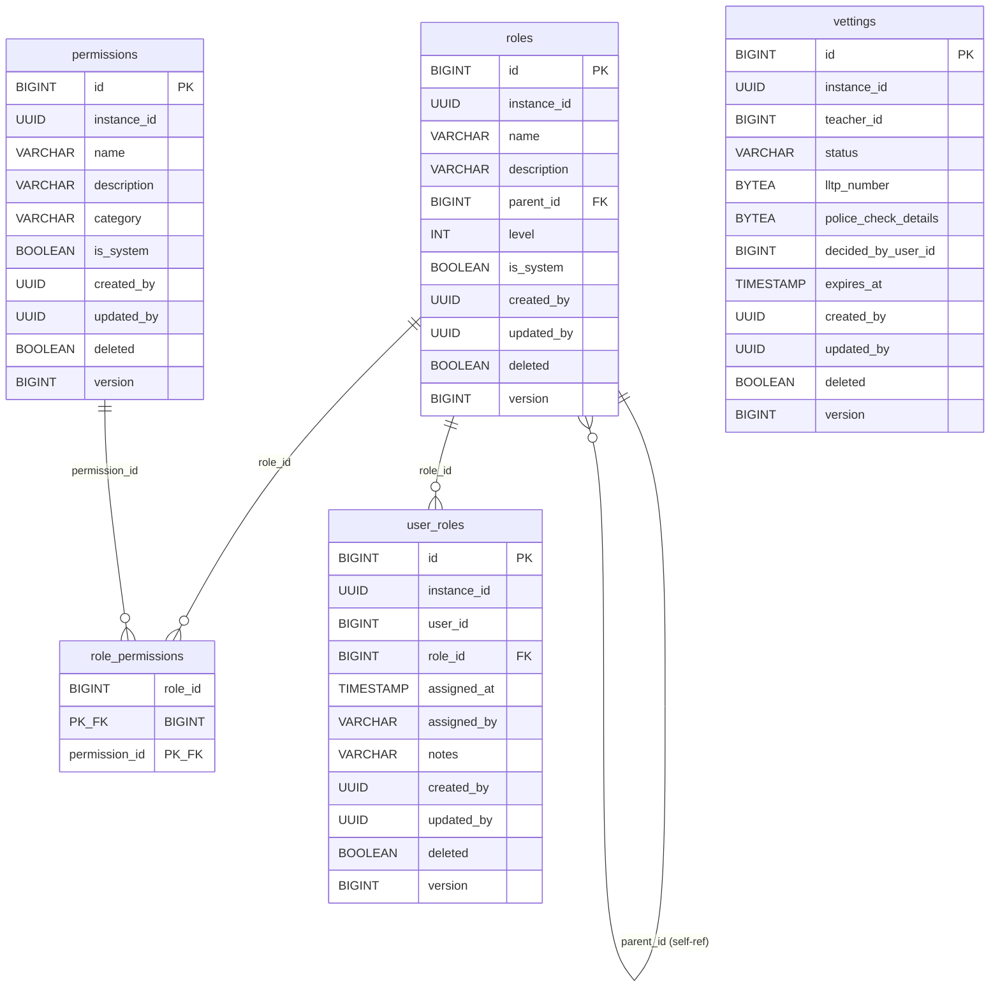

# KiteClass DB Schema — Cluster "Phân quyền (RBAC)"

## TL;DR

Cluster này gồm **5 bảng** cài đặt mô hình phân quyền phân cấp (hierarchical RBAC) của KiteClass (DB `kiteclass-core`, schema `public`). Thiết kế theo **ADR-003 / GAP-058**: thay thế role enum phẳng bằng cây role + bó quyền (permission bundle).

| Bảng | Vai trò | Migration tạo | RLS (V58/V59) | Soft-delete |
|---|---|---|:---:|:---:|
| `roles` | Định nghĩa role phân cấp (cây tự tham chiếu qua `parent_id`) | V30 | ✅ | ✅ |
| `permissions` | Token quyền hạt nhỏ, gán vào role | V30 | ✅ | ✅ |
| `role_permissions` | M2M role ↔ permission (bảng nối thuần) | V30 | ❌ (không có `instance_id`) | ❌ |
| `user_roles` | M2M user ↔ role (kèm audit gán quyền) | V30 | ✅ | ✅ |
| `vettings` | Hồ sơ thẩm tra nhân sự (vetting nhân sự) làm việc với trẻ em | V52 | ✅ | ✅ |

Điểm cần nhớ:
- **Mô hình quyền**: `user_roles` (user → role) → `role_permissions` (role → permission). 1 user có nhiều role → quyền hiệu lực = **hợp (union)** các permission của mọi role. `roles.parent_id` tạo cây phân cấp (TENANT_OWNER → PRINCIPAL → ... → SUBJECT_TEACHER).
- **`vettings`** không thuộc luồng cấp quyền chính nhưng nằm trong cluster RBAC vì nó là **cổng phân quyền (RBAC gate)**: theo BR-VETTING-003, chỉ role `SAFEGUARDING_OFFICER` mới đọc/ghi được; giáo viên chưa có hồ sơ `APPROVED` bị chặn khỏi các endpoint PII của học sinh.
- 4/5 bảng kế thừa `BaseEntity` (cột `id`, `instance_id`, `created_at`, `updated_at`, `created_by`, `updated_by`, `deleted`, `version`). Ngoại lệ: `role_permissions` (bảng nối thuần, chỉ 2 cột FK, không multi-tenant, không audit).
- Cột `created_by` / `updated_by` đã đổi từ `BIGINT` sang `UUID` ở **V73** (GAP-795) — lưu `X-User-Id` (JWT `sub` claim), không phải số.
- Mọi bảng có `instance_id` đều bật **RLS FORCED** từ V58, siết NULL force-fail + admin-bypass ở V59 (xem §Ghi chú schema).
- ⚠️ **Anomaly**: V73 chỉ quét `created_by`/`updated_by`; cột actor riêng `user_roles.assigned_by` (VARCHAR) và `vettings.decided_by_user_id` (BIGINT) **không được quét** → còn lệch với mô hình actor UUID (xem §Ghi chú schema (anomalies)).

## ERD

> Ghi chú ERD: `user_roles.user_id`, `vettings.teacher_id`, `vettings.decided_by_user_id` tham chiếu logic tới `users.id` (đối tượng người dùng) nhưng **không có FK constraint vật lý** trong schema KiteClass-core — nên không vẽ đường liên kết. `role_permissions` không có `instance_id` (chi tiết §bảng).

---

## `roles`

### 1. Mục đích

Định nghĩa các role phân cấp theo mô hình **Composite Pattern** (ADR-003): mỗi role có thể có 1 role cha (`parent_id`) tạo thành cây. Ví dụ cây: `TENANT_OWNER` (level 1) → `PRINCIPAL` (2) → `VICE_PRINCIPAL` (3) → `DEPT_HEAD` (4) → `SUBJECT_TEACHER` / `HOMEROOM_TEACHER` (5). Role gom các permission thành bó (qua `role_permissions`).

### 2. Cột

| Cột | Kiểu | Null | Default | Khóa/Index | Ý nghĩa |
|---|---|:---:|---|---|---|
| `id` | `BIGSERIAL` | NO | (auto) | PK | Định danh role |
| `instance_id` | `UUID` | NO | — | idx `idx_role_name` (unique, cùng `name`) | Tenant sở hữu role (multi-tenant) |
| `name` | `VARCHAR(50)` | NO | — | unique `(instance_id, name)` WHERE `deleted=FALSE` | Tên role (vd `SUBJECT_TEACHER`) |
| `description` | `VARCHAR(300)` | YES | — | — | Mô tả role |
| `parent_id` | `BIGINT` | YES | — | FK → `roles(id)`, idx `idx_role_parent` | Role cha (NULL = role gốc level 1) |
| `level` | `INT` | NO | `5` | idx `idx_role_level`, CHECK `1..10` | Mức phân cấp (1=cao nhất, 10=thấp nhất) |
| `is_system` | `BOOLEAN` | NO | `FALSE` | — | Role hệ thống (pre-seeded, không xóa được — BR-ROLE-002) |
| `created_at` | `TIMESTAMP` | NO | `CURRENT_TIMESTAMP` | — | Thời điểm tạo |
| `updated_at` | `TIMESTAMP` | NO | `CURRENT_TIMESTAMP` | — | Thời điểm cập nhật |
| `created_by` | `UUID` | YES | — | — | Actor tạo (UUID sau V73; ban đầu VARCHAR(100) ở V30, đổi BIGINT ở V46, đổi UUID ở V73) |
| `updated_by` | `UUID` | YES | — | — | Actor cập nhật (cùng vòng đời kiểu như `created_by`) |
| `version` | `BIGINT` | NO | `0` | — | Optimistic locking (`@Version`) |
| `deleted` | `BOOLEAN` | NO | `FALSE` | idx `idx_role_deleted` | Soft-delete flag |

CHECK constraint: `chk_role_level CHECK (level >= 1 AND level <= 10)`.

### 3. Quan hệ FK

**Out (role này tham chiếu ra):**
- `parent_id` → `roles(id)` — tự tham chiếu (self-reference), cardinality N:1 (nhiều role con → 1 role cha). NULL = role gốc.

**In (bảng khác tham chiếu vào `roles`):**
- `role_permissions.role_id` → `roles(id)` — N:1, mỗi role có nhiều dòng quyền.
- `user_roles.role_id` → `roles(id)` — N:1, mỗi role được gán cho nhiều user.

### 4. RLS + ghi chú

- **Tenant-scoped**: có `instance_id` → bật **RLS FORCED** ở V58, policy `tenant_isolation`, siết V59 (admin-bypass + NULL force-fail).
- **Soft-delete**: `deleted` flag; unique index `idx_role_name` partial `WHERE deleted=FALSE` cho phép tái dùng tên sau khi xóa mềm.
- Role hệ thống (`is_system=TRUE`) + role template seed lúc khởi động qua `RoleSeederService` (per-tenant, sau khi tạo tenant — ghi chú cuối V30).

---

## `permissions`

### 1. Mục đích

Token quyền hạt nhỏ (granular permission), gán vào role qua `role_permissions`. Ví dụ: `STUDENT_VIEW_ALL`, `GRADE_EDIT_OWN`, `PAYROLL_APPROVE`, `USER_MANAGE`, `ROLE_ASSIGN`. Permission hệ thống được seed sẵn lúc khởi động.

### 2. Cột

| Cột | Kiểu | Null | Default | Khóa/Index | Ý nghĩa |
|---|---|:---:|---|---|---|
| `id` | `BIGSERIAL` | NO | (auto) | PK | Định danh permission |
| `instance_id` | `UUID` | NO | — | idx `idx_permission_name` (unique, cùng `name`) | Tenant sở hữu (multi-tenant) |
| `name` | `VARCHAR(100)` | NO | — | unique `(instance_id, name)` WHERE `deleted=FALSE` | Tên permission (BR-PERM-001 unique mỗi instance) |
| `description` | `VARCHAR(300)` | YES | — | — | Mô tả |
| `category` | `VARCHAR(50)` | YES | — | idx `idx_permission_category` | Nhóm: STUDENT, TEACHER, GRADE, PAYROLL, BRANDING, USER, ROLE, ... |
| `is_system` | `BOOLEAN` | NO | `FALSE` | — | Permission hệ thống (không xóa được bởi tenant) |
| `created_at` | `TIMESTAMP` | NO | `CURRENT_TIMESTAMP` | — | Thời điểm tạo |
| `updated_at` | `TIMESTAMP` | NO | `CURRENT_TIMESTAMP` | — | Thời điểm cập nhật |
| `created_by` | `UUID` | YES | — | — | Actor tạo (VARCHAR(100) ở V30 → BIGINT ở V46 → UUID ở V73) |
| `updated_by` | `UUID` | YES | — | — | Actor cập nhật |
| `version` | `BIGINT` | NO | `0` | — | Optimistic locking |
| `deleted` | `BOOLEAN` | NO | `FALSE` | idx `idx_permission_deleted` | Soft-delete flag |

### 3. Quan hệ FK

**Out:** không có FK ra ngoài.

**In:**
- `role_permissions.permission_id` → `permissions(id)` — N:1, mỗi permission gán cho nhiều role.

### 4. RLS + ghi chú

- **Tenant-scoped**: có `instance_id` → RLS FORCED V58 + siết V59.
- **Soft-delete**: `deleted`; unique index partial `WHERE deleted=FALSE`.
- Seed cùng `RoleSeederService` với `roles`.

---

## `role_permissions`

### 1. Mục đích

Bảng nối **many-to-many** giữa `roles` và `permissions`: định nghĩa "role X có những permission nào". Đây là bảng nối thuần (pure junction) — không có cột audit, không multi-tenant, không soft-delete.

### 2. Cột

| Cột | Kiểu | Null | Default | Khóa/Index | Ý nghĩa |
|---|---|:---:|---|---|---|
| `role_id` | `BIGINT` | NO | — | PK (cùng `permission_id`), FK → `roles(id)`, idx `idx_role_perm_role` | Role được gán quyền |
| `permission_id` | `BIGINT` | NO | — | PK (cùng `role_id`), FK → `permissions(id)`, idx `idx_role_perm_permission` | Quyền được gán |

Khóa chính tổ hợp: `PRIMARY KEY (role_id, permission_id)` — đảm bảo 1 cặp (role, permission) không trùng.

### 3. Quan hệ FK

Đây là bảng nối M2M, giải thích **2 phía**:
- Phía `roles`: `role_id` → `roles(id)`. 1 role → nhiều dòng `role_permissions` (nhiều quyền).
- Phía `permissions`: `permission_id` → `permissions(id)`. 1 permission → nhiều dòng (gán cho nhiều role).
- Kết hợp: quan hệ `roles` ↔ `permissions` là N:M, thực thi qua bảng nối này.

Trong entity `Role`, ánh xạ qua `@ManyToMany @JoinTable(name="role_permissions", joinColumns=role_id, inverseJoinColumns=permission_id)`. **Không có cột actor** (`assigned_by`) — khác với `user_roles` (xem dưới).

### 4. RLS + ghi chú

- **KHÔNG tenant-scoped**: không có cột `instance_id` → **không nằm trong danh sách RLS** của V58/V59 (V58 bỏ qua bảng thiếu `instance_id`). Cô lập tenant được đảm bảo gián tiếp: cả `roles` và `permissions` đều tenant-scoped, nên dòng nối chỉ liên kết role + permission cùng tenant (ràng buộc ở tầng ứng dụng/seeder).
- **Không soft-delete, không audit**: V46 chủ động loại trừ bảng này khỏi đợt căn cột audit (`role_permissions intentionally excluded — pure junction table, no audit columns`).
- Xóa quyền khỏi role = DELETE dòng vật lý (không soft-delete) qua `Role.revokePermission()`.

---

## `user_roles`

### 1. Mục đích

Bảng nối **many-to-many** giữa user và role: gán role cho user (1 user có thể có nhiều role, vd Teacher + Dept Head). Khác với `role_permissions`, bảng này **có audit gán quyền** (`assigned_at`, `assigned_by`, `notes`) và kế thừa `BaseEntity`.

### 2. Cột

| Cột | Kiểu | Null | Default | Khóa/Index | Ý nghĩa |
|---|---|:---:|---|---|---|
| `id` | `BIGSERIAL` | NO | (auto) | PK | Định danh dòng gán |
| `instance_id` | `UUID` | NO | — | idx `idx_ur_instance_id` | Tenant sở hữu (multi-tenant) |
| `user_id` | `BIGINT` | NO | — | unique `idx_ur_user_role` (cùng `role_id`) | User được gán role (tham chiếu logic `users.id`) ⚠️ |
| `role_id` | `BIGINT` | NO | — | FK → `roles(id)`, idx `idx_ur_role`, unique cùng `user_id` | Role được gán |
| `assigned_at` | `TIMESTAMP` | NO | `CURRENT_TIMESTAMP` | — | Thời điểm gán (BR-UR-002 audit) |
| `assigned_by` | `VARCHAR(100)` | YES | — | — | Actor gán role (⚠️ còn VARCHAR, xem anomalies) |
| `notes` | `VARCHAR(500)` | YES | — | — | Ghi chú gán quyền |
| `created_at` | `TIMESTAMP` | NO | `CURRENT_TIMESTAMP` | — | Thời điểm tạo (BaseEntity) |
| `updated_at` | `TIMESTAMP` | NO | `CURRENT_TIMESTAMP` | — | Thời điểm cập nhật |
| `created_by` | `UUID` | YES | — | — | Actor tạo (VARCHAR(100) V30 → BIGINT V46 → UUID V73) |
| `updated_by` | `UUID` | YES | — | — | Actor cập nhật |
| `version` | `BIGINT` | NO | `0` | — | Optimistic locking |
| `deleted` | `BOOLEAN` | NO | `FALSE` | idx `idx_ur_deleted` | Soft-delete flag |

Unique index `idx_ur_user_role` trên `(user_id, role_id)` partial `WHERE deleted=FALSE` — 1 cặp user-role chỉ gán 1 lần (BR-UR-001).

### 3. Quan hệ FK

Bảng nối M2M user ↔ role, giải thích **2 phía**:
- Phía `roles`: `role_id` → `roles(id)` (FK vật lý). 1 role → nhiều dòng (gán cho nhiều user).
- Phía user: `user_id` → `users.id` — **tham chiếu logic, không có FK vật lý** trong KiteClass-core (đối tượng user nằm ở tầng định danh, không ràng buộc DB). 1 user → nhiều dòng (nhiều role).
- Cột actor `assigned_by`: lưu danh tính người thực hiện gán quyền — audit attribution, không phải FK.

### 4. RLS + ghi chú

- **Tenant-scoped**: có `instance_id` → RLS FORCED V58 + siết V59.
- **Soft-delete**: `deleted`; unique partial `WHERE deleted=FALSE`.
- Khác `role_permissions`: bảng này CÓ `id` PK riêng + cột audit + multi-tenant (M2M nhưng giàu metadata).

---

## `vettings`

### 1. Mục đích

Hồ sơ **thẩm tra nhân sự** (vetting) cho người lớn làm việc với trẻ em, theo Nghị định 56/2017/NĐ-CP §Đ.25 + Luật Trẻ em 2016 Đ.25. Mỗi dòng = 1 chu kỳ vetting của 1 giáo viên. Nằm trong cluster RBAC vì là **cổng phân quyền**: chỉ role `SAFEGUARDING_OFFICER` đọc/ghi được (BR-VETTING-003); giáo viên chưa `APPROVED` bị chặn endpoint PII học sinh.

### 2. Cột

| Cột | Kiểu | Null | Default | Khóa/Index | Ý nghĩa |
|---|---|:---:|---|---|---|
| `id` | `BIGSERIAL` | NO | (auto) | PK | Định danh hồ sơ vetting |
| `instance_id` | `UUID` | NO | — | idx `idx_vettings_instance_id` | Tenant sở hữu (multi-tenant) |
| `teacher_id` | `BIGINT` | NO | — | idx `idx_vettings_teacher_id` | Giáo viên được thẩm tra (tham chiếu logic `users.id`) |
| `status` | `VARCHAR(20)` | NO | `'PENDING'` | idx `idx_vettings_status`, CHECK enum | Trạng thái vòng đời (enum bên dưới) |
| `lltp_number` | `BYTEA` | YES | — | — | Số LLTP số 2 (lý lịch tư pháp) — **mã hóa AES-256-GCM** tại nghỉ (AesGcmAttributeConverter); layout `[IV(12) \| ciphertext \| auth_tag(16)]` |
| `police_check_details` | `BYTEA` | YES | — | — | Kết quả kiểm tra/phỏng vấn (tự do) — **mã hóa AES-256-GCM**; giải mã giới hạn cho `SAFEGUARDING_OFFICER` |
| `submitted_at` | `TIMESTAMP` | YES | — | — | Thời điểm nộp tài liệu (PENDING → SUBMITTED) |
| `interviewed_at` | `TIMESTAMP` | YES | — | — | Thời điểm hoàn thành phỏng vấn (SUBMITTED → INTERVIEW_DONE) |
| `decided_at` | `TIMESTAMP` | YES | — | — | Thời điểm ra quyết định APPROVE/REJECT |
| `expires_at` | `TIMESTAMP` | YES | — | idx `idx_vettings_expires_at` | Ngày hết hạn của hồ sơ APPROVED (LLTP ≤2 năm cadence) |
| `decided_by_user_id` | `BIGINT` | YES | — | — | Actor ra quyết định (⚠️ còn BIGINT, xem anomalies) |
| `created_at` | `TIMESTAMP` | NO | `CURRENT_TIMESTAMP` | — | Thời điểm tạo (BaseEntity) |
| `updated_at` | `TIMESTAMP` | YES | — | — | Thời điểm cập nhật |
| `created_by` | `UUID` | YES | — | — | Actor tạo (BIGINT ở V52 → UUID ở V73) |
| `updated_by` | `UUID` | YES | — | — | Actor cập nhật (BIGINT ở V52 → UUID ở V73) |
| `deleted` | `BOOLEAN` | NO | `FALSE` | idx `idx_vettings_deleted` | Soft-delete flag (BR-VETTING-005) |
| `version` | `BIGINT` | NO | `0` | — | Optimistic locking |

**Enum `status`** — CHECK constraint `chk_vettings_status`, 6 giá trị (`VettingStatus`):
- `PENDING` — khởi tạo, chưa nộp tài liệu.
- `SUBMITTED` — HR/admin đã nộp LLTP + bằng + CCCD, chờ phỏng vấn.
- `INTERVIEW_DONE` — đã phỏng vấn xong.
- `APPROVED` — duyệt đạt.
- `REJECTED` — từ chối (terminal).
- `EXPIRED` — hết hạn (từ APPROVED khi `now > expires_at`).

State machine (BR-VETTING-001, thực thi ở tầng service `VettingServiceImpl`, transition lậu trả `VETTING_INVALID_TRANSITION`): `PENDING → SUBMITTED → INTERVIEW_DONE → APPROVED|REJECTED`; `APPROVED → EXPIRED`.

### 3. Quan hệ FK

**Out:** không có FK vật lý.
- `teacher_id` → `users.id` — tham chiếu logic (giáo viên được vetting), không ràng buộc DB.
- `decided_by_user_id` → `users.id` — tham chiếu logic (actor quyết định), audit attribution.

**In:** không có bảng nào tham chiếu vào `vettings`.

### 4. RLS + ghi chú

- **Tenant-scoped**: có `instance_id` → RLS FORCED V58 + siết V59.
- **Soft-delete**: `deleted`; index `idx_vettings_deleted`. Anti-delete trên REJECTED + retention 7 năm hoãn sang GAP-322c Phase 1C.
- **Mã hóa tại nghỉ**: `lltp_number` + `police_check_details` lưu `BYTEA`, mã hóa AES-256-GCM qua `AesGcmAttributeConverter` (cùng converter với `incidents`). Truy vấn SQL thô chỉ trả ciphertext — không được query trực tiếp 2 cột này.
- **Tuân thủ**: Nghị định 56/2017/NĐ-CP, Luật Trẻ em 2016 Đ.25, PDPL Nghị định 13/2023/NĐ-CP Art 16.

---

## Ghi chú schema (anomalies)

### A1. Lệch kiểu cột actor — V73 (GAP-795) chỉ quét `created_by`/`updated_by`

V73 chuyển `created_by`/`updated_by` của **mọi bảng** sang `UUID` (vì `X-User-Id` = JWT `sub` claim là UUID, không còn id số). Nhưng đợt quét V73 **chỉ nhắm 2 cột audit chuẩn**, bỏ sót các cột actor riêng:

| Bảng | Cột actor sót | Kiểu hiện tại | Đáng lẽ | Trạng thái |
|---|---|---|---|---|
| `user_roles` | `assigned_by` | `VARCHAR(100)` (từ V30, chưa đổi) | `UUID` (actor identity) | ⚠️ Còn lệch — V46 chỉ căn `created_by`/`updated_by`, không động `assigned_by`; V73 cũng không |
| `vettings` | `decided_by_user_id` | `BIGINT` (từ V52) | `UUID` (actor identity) | ⚠️ Còn lệch — không nằm trong section 1-4 của V73 |

Đây là cùng lớp lỗi mà V73 đã sửa cho `classes.teacher_id`, `classes.rescheduled_by_user_id`, `parent_invitations.invited_by_user_id` (3 cột actor được V73 chuyển UUID riêng từng section). Hai cột trên là phần "sót" của đợt sweep — nếu được ghi từ `UserContext.getCurrentUser()` (UUID) thì sẽ throw/lệch. Cần migration follow-up để đồng bộ về `UUID`.

### A2. Entity ↔ DB drift

| Bảng | Entity field | Kiểu entity | Kiểu DB | Ghi chú |
|---|---|---|---|---|
| `user_roles` | `UserRole.userId` | `Long` | `BIGINT` | Khớp DB, nhưng **lệch mô hình** — user identity giờ là UUID (`X-User-Id`); field này còn `Long` |
| `user_roles` | `UserRole.assignedBy` | `String` | `VARCHAR(100)` | Khớp DB (cả hai chưa đổi), nhưng cùng lệch mô hình actor UUID như A1 |
| `vettings` | `Vetting.teacherId` | `Long` | `BIGINT` | Khớp DB; là FK logic tới `users.id` |
| `vettings` | `Vetting.decidedByUserId` | `Long` | `BIGINT` | Khớp DB, nhưng lệch mô hình actor UUID như A1 |
| `roles`/`permissions`/`user_roles`/`vettings` | `BaseEntity.createdBy`/`updatedBy` | `UUID` | `UUID` (sau V73) | ✅ Đã đồng bộ |

Tóm lại: các cột audit chuẩn (`created_by`/`updated_by`) đã sync UUID ở entity + DB; nhưng các cột actor riêng (`assigned_by`, `decided_by_user_id`) + cột định danh user (`user_id`, `teacher_id`) vẫn dùng `Long`/`VARCHAR` ở cả entity lẫn DB — chưa migrate sang UUID.

### A3. M2M có/không `instance_id`

- `role_permissions`: **không** có `instance_id` (bảng nối thuần) → không RLS, không audit, không soft-delete. V46 chủ động loại trừ. Đây là ngoại lệ tương tự `teacher_courses` ở cluster Con người (cũng là M2M không multi-tenant, không audit — xem `02-people-enrollment.md`).
- `user_roles`: **có** `instance_id` + đầy đủ audit + soft-delete (M2M giàu metadata, kèm PK `id` riêng). Khác hẳn `role_permissions`.

Lý do khác biệt: `user_roles` cần audit "ai gán role cho ai, khi nào, ghi chú gì" (`assigned_at`/`assigned_by`/`notes`) nên nâng lên thành entity đầy đủ; `role_permissions` chỉ là cấu hình tĩnh role↔permission nên giữ junction thuần.

### A4. Lịch sử kiểu cột audit (3 lần đổi)

Cột `created_by`/`updated_by` của `roles`/`permissions`/`user_roles` trải qua: `VARCHAR(100)` (V30) → `BIGINT` (V46 GAP-244, căn về BaseEntity Long) → `UUID` (V73 GAP-795, vì X-User-Id là UUID). Riêng `vettings` tạo ở V52 với audit là `BIGINT` ngay từ đầu (sau V46) → `UUID` (V73). `role_permissions` không bao giờ có cột audit (loại trừ ở V46).

### A5. RLS coverage gap — `role_permissions` ngoài scope V58/V59

V58 (enable RLS) + V59 (hardening) áp policy `tenant_isolation` cho mọi bảng có `instance_id`. **`role_permissions` không có `instance_id` → không nằm trong scope V58**: bảng nối thuần (role↔permission) là cấu hình tĩnh global cho mọi tenant, không cần multi-tenant scoping.

| Bảng | Migration | `instance_id`? | RLS V58? | Lý do |
|---|---|:---:|:---:|---|
| `roles` | V1+V46 | ✅ Có | ✅ Trong list | Tenant scoped |
| `permissions` | V1+V46 | ✅ Có | ✅ Trong list | Tenant scoped |
| `user_roles` | V30+V46 | ✅ Có | ✅ Trong list | Tenant scoped |
| `role_permissions` | V1+V46 | ❌ Không | ❌ Không trong list | M2M thuần global, intentional |
| `vettings` | V52 | ✅ Có | ⚠️ Cần verify (V52 sau V58?) | Tenant scoped |

→ **`vettings`** (V52) cần verify — nếu V52 chạy sau V58 thì RLS chưa enable DB-level. Pattern cùng class baseline 04-finance.md A9 (`payment_records` V69 + `payment_idempotency_keys` V61 RLS coverage gap). `role_permissions` không phải gap — là intentional exclusion vì nature M2M global config.

→ Fix: V60+ migration re-run RLS enable cho `vettings` (idempotent — `ALTER TABLE vettings ENABLE ROW LEVEL SECURITY` + tạo policy `tenant_isolation USING (instance_id = current_setting('app.tenant_id')::uuid)`).

### A6. TIMESTAMP vs TIMESTAMPTZ không nhất quán

| Nhóm | Bảng | Kiểu timestamp |
|---|---|---|
| TIMESTAMPTZ (timezone-aware) | `roles`, `permissions`, `user_roles`, `role_permissions` | TIMESTAMP WITH TIME ZONE (V1+V46 align) |
| TIMESTAMP (naive) | `vettings` | TIMESTAMP (V52) cho `created_at`/`updated_at`/`decided_at` |

→ 4 bảng RBAC core (V1) dùng TZ; `vettings` (V52) extension dùng naive. Risk khi compare `user_roles.assigned_at` (TZ) với `vettings.decided_at` (naive) trên server không UTC. Identical pattern baseline 04-finance.md A8 + cluster 01 A9 + cluster 02 A7 + cluster 03 F (cross-cluster recurrent pattern V52+ extension thiếu TZ).

→ Document policy timezone trong `documents/02-architecture/database/README.md` (cluster overview).

### A7. `version` thiếu DEFAULT 0 batched V62/V63

V26 thêm `version BIGINT` (không default) cho 14 bảng V1. V62/V63 set DEFAULT 0 cho 19 bảng (batched). Bảng cụm RBAC:

- **Trong V62/V63 batch:** `roles` (V62), `permissions` (V62) — V26 chạy trước V46 nên `version` có sẵn → V62 backfill DEFAULT 0.
- **Tạo sau với DEFAULT 0 ngay:** `user_roles` (V30 với DEFAULT 0), `role_permissions` (không có `version` — junction thuần), `vettings` (V52 với DEFAULT 0).

→ Production safe (V62/V63 đã chạy). Risk chỉ ở dev local restart từ V26-state. Pattern cùng class baseline 04-finance.md A7 + cluster 01 A8 + cluster 03 K.

---

## Liên kết

- [README cluster KiteClass DB](../README.md)
- [Bản đồ kiến trúc database](../../database-architecture-map.md)
