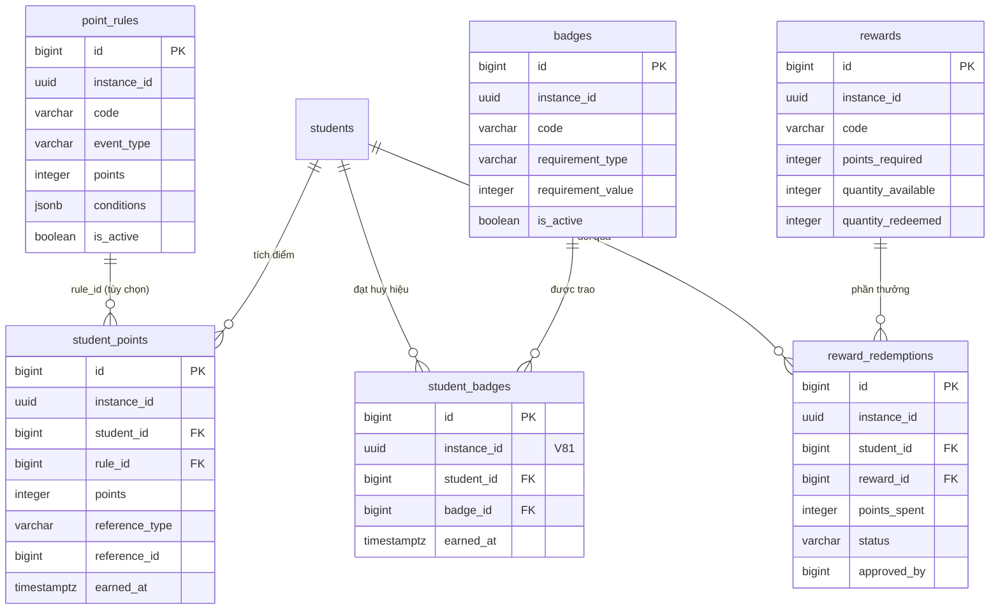

# KiteClass DB Schema — Cluster "Trò chơi hóa / Khen thưởng"

> **Cập nhật Wave 14 (KC V81)** — `student_badges` đã thêm `instance_id UUID NOT NULL` (backfill từ `students.instance_id` qua FK `student_id`) + bật RLS DB-level (ENABLE + FORCE + policy `tenant_isolation`) ở **V81** (GAP-887 resolved) — đóng anomaly A. Anomaly B (`reward_redemptions.approved_by` BIGINT) vẫn ⏸️ DEFERRED → GAP-877/886.

## TL;DR

Cluster này gồm **6 bảng** cài đặt hệ thống gamification (tích điểm + huy hiệu + đổi quà) của KiteClass (DB `kiteclass`, schema `public`). Mục tiêu: tăng động lực học sinh qua việc tự động cộng/trừ điểm theo sự kiện (điểm danh, nộp bài, điểm số), trao huy hiệu khi đạt ngưỡng, và cho phép đổi điểm lấy phần thưởng.

| Bảng | Vai trò | RLS (V58/V59) | Soft-delete |
|---|---|:---:|:---:|
| `point_rules` | Quy tắc tính điểm theo sự kiện (config cấp tenant) | ✅ | ❌ (chỉ `is_active`) |
| `student_points` | Sổ giao dịch điểm — mỗi dòng = 1 lần cộng/trừ (event-driven) | ✅ | ❌ |
| `badges` | Định nghĩa huy hiệu + ngưỡng đạt được | ✅ | ❌ (chỉ `is_active`) |
| `student_badges` | M2M học sinh ↔ huy hiệu (huy hiệu đã trao) | ✅ **(V81)** — thêm `instance_id` + RLS | ❌ |
| `rewards` | Catalog phần thưởng đổi bằng điểm + tồn kho | ✅ | ❌ (chỉ `is_active`) |
| `reward_redemptions` | Yêu cầu đổi quà + workflow duyệt/giao | ✅ | ❌ |

Điểm cần nhớ:
- **Sổ điểm là cộng dồn (cumulative ledger)**, KHÔNG snapshot: tổng điểm học sinh = `SUM(student_points.points)` qua mọi giao dịch (`PointServiceImpl.getTotalPoints` → `COALESCE(SUM(sp.points), 0)`). KHÔNG có cột `total_points` cached ở bảng `students`.
- `student_points.points` có thể **âm** (trừ điểm — vd `LATE: -5`, `ABSENT: -10` per javadoc `StudentPoint`).
- Cả **6/6 bảng** nay có `instance_id` + RLS FORCED. 5 bảng bật từ V58/V59; `student_badges` ✅ **thêm `instance_id` + RLS ở V81** (GAP-887) — trước Wave 14 bảng này thiếu `instance_id` nên RLS bỏ qua + cô lập tenant chỉ gián tiếp qua FK `student_id`/`badge_id`.
- **`reward_redemptions` là state machine**: `status` workflow `pending → approved → delivered` (hoặc `cancelled`) — hiện cài đặt dạng cột `VARCHAR` + `status` string, KHÔNG enum DB.
- Cột audit `created_by` / `updated_by` đổi từ `BIGINT` (thêm ở V26) sang `UUID` ở **V73** (GAP-795 — lưu `X-User-Id` từ JWT, không phải số). Cột `version` (optimistic lock) thêm ở V26, đặt default `0` ở V62 (`point_rules`/`student_points`/`rewards`/`reward_redemptions`/`student_badges`) và V63 (`badges`).
- Chỉ entity `StudentPoint` được map JPA trong code (`module/gamification/entity/`); 5 bảng còn lại tồn tại ở DB nhưng chưa có entity JPA tương ứng (xem §Ghi chú schema).

## ERD cluster

Ghi chú ERD: `students`, `badges` được trỏ bởi `student_badges` qua FK trong cùng cluster; `students` thuộc cluster Con người / Ghi danh — đây là FK cross-cluster. `point_rules → student_points` là quan hệ tùy chọn (`rule_id` nullable: điểm có thể cộng trực tiếp không qua rule).

---

## `point_rules`

### 1. Mục đích

Quy tắc tính điểm cấp tenant: mỗi rule gắn 1 mã sự kiện (`event_type`) với số điểm (`points`) và điều kiện bổ sung (`conditions` JSONB). Khi sự kiện xảy ra (điểm danh, nộp bài, có điểm), hệ thống tra rule active để cộng/trừ điểm vào `student_points`. Đây là bảng **cấu hình** — không hardcode điểm trong code.

### 2. Cột (V1 + V26)

| Cột | Kiểu | Null | Default | Khóa/Index | Ý nghĩa |
|---|---|:---:|---|---|---|
| `id` | BIGSERIAL | NO | tự tăng | PK | Khóa chính |
| `instance_id` | UUID | NO | — | `idx_point_rules_instance` | Tenant ID (multi-tenant) |
| `code` | VARCHAR(50) | NO | — | UNIQUE `(instance_id, code)`; `idx_point_rules_code` | Mã rule (vd `ATTENDANCE`, `GRADE_A`, `ASSIGNMENT_SUBMIT`) |
| `name` | VARCHAR(255) | NO | — | — | Tên hiển thị |
| `description` | TEXT | YES | — | — | Mô tả |
| `points` | INTEGER | NO | — | — | Số điểm cộng (dương) hoặc trừ (âm) |
| `event_type` | VARCHAR(50) | NO | — | `idx_point_rules_event_type` | Loại sự kiện trigger (vd `attendance_present`, `grade_submitted`, `assignment_submitted`) |
| `conditions` | JSONB | YES | `'{}'` | — | Điều kiện kích hoạt, vd `{"min_score": 8, "on_time": true}` |
| `is_active` | BOOLEAN | YES | `TRUE` | — | Bật/tắt rule (thay cho soft-delete) |
| `created_at` | TIMESTAMPTZ | NO | `CURRENT_TIMESTAMP` | — | Thời điểm tạo |
| `updated_at` | TIMESTAMPTZ | NO | `CURRENT_TIMESTAMP` | — | Thời điểm cập nhật |
| `created_by` | UUID | YES | — | — | Actor tạo (BIGINT ở V26 → UUID ở V73) |
| `updated_by` | UUID | YES | — | — | Actor cập nhật (BIGINT ở V26 → UUID ở V73) |
| `version` | BIGINT | YES | `0` (V62) | — | Optimistic lock (thêm V26, default V62) |

### 3. Quan hệ

- **FK out:** không (chỉ `instance_id` logic tenant, không có FK constraint).
- **FK in:** `student_points.rule_id → point_rules.id` (nullable — điểm có thể không gắn rule).
- **Cardinality:** 1 `point_rules` : N `student_points` (mỗi rule áp cho nhiều giao dịch điểm).

### 4. RLS + ghi chú

- Tenant-scoped (`instance_id`) → **RLS FORCED** ở V58, NULL force-fail + admin-bypass V59.
- KHÔNG soft-delete (`deleted`/`deleted_at`) — vô hiệu rule bằng `is_active = FALSE`.
- Unique `(instance_id, code)`: mỗi tenant 1 mã rule duy nhất.

---

## `student_points`

### 1. Mục đích

Sổ giao dịch điểm (point ledger) — mỗi dòng là 1 lần cộng/trừ điểm cho học sinh, gắn nguồn gốc (`reference_type` + `reference_id`). Tổng điểm học sinh được tính bằng `SUM(points)` qua mọi dòng (cumulative ledger, không snapshot). Đây là entity DUY NHẤT được map JPA trong code (`StudentPoint.java`).

### 2. Cột (V1 + V26)

| Cột | Kiểu | Null | Default | Khóa/Index | Ý nghĩa |
|---|---|:---:|---|---|---|
| `id` | BIGSERIAL | NO | tự tăng | PK | Khóa chính |
| `instance_id` | UUID | NO | — | `idx_student_points_instance` | Tenant ID |
| `student_id` | BIGINT | NO | — | FK → `students(id)`; `idx_student_points_student` | Học sinh nhận điểm |
| `rule_id` | BIGINT | YES | — | FK → `point_rules(id)`; `idx_student_points_rule` | Rule áp dụng (nullable — cộng trực tiếp được) |
| `points` | INTEGER | NO | — | — | Điểm cộng (dương) / trừ (âm) cho giao dịch này |
| `reference_type` | VARCHAR(50) | YES | — | — | Loại nguồn (vd `ATTENDANCE`, `GRADE`, `ASSIGNMENT`) |
| `reference_id` | BIGINT | YES | — | — | ID bản ghi nguồn |
| `description` | VARCHAR(255) | YES | — | — | Lý do cộng/trừ điểm |
| `earned_at` | TIMESTAMPTZ | NO | `CURRENT_TIMESTAMP` | `idx_student_points_earned` | Thời điểm nhận điểm |
| `created_at` | TIMESTAMPTZ | NO | `CURRENT_TIMESTAMP` | — | Thời điểm tạo bản ghi |
| `created_by` | UUID | YES | — | — | Actor tạo (BIGINT V26 → UUID V73) |
| `updated_by` | UUID | YES | — | — | Actor cập nhật (BIGINT V26 → UUID V73) |
| `version` | BIGINT | YES | `0` (V62) | — | Optimistic lock |

### 3. Quan hệ

- **FK out:** `student_id → students(id)` (bắt buộc); `rule_id → point_rules(id)` (tùy chọn).
- **FK in:** không.
- **Cardinality:** N `student_points` : 1 `students` + N : 1 `point_rules`. Đây là bảng giao dịch event-driven (append-mostly), N dòng mỗi học sinh.

### 4. RLS + ghi chú

- Tenant-scoped → **RLS FORCED** V58, NULL force-fail + admin-bypass V59.
- KHÔNG soft-delete — sổ giao dịch là append-mostly (không xóa lịch sử điểm).
- **Point ledger semantics:** cộng dồn, không snapshot. Tổng điểm = `COALESCE(SUM(sp.points), 0) WHERE student_id = :id` (`StudentPointRepository.getTotalPointsByStudentId`). Lưu ý: query này gom theo `student_id` (KHÔNG lọc `instance_id` ở JPQL) — cô lập tenant dựa hoàn toàn vào RLS session `app.current_tenant_id`.

---

## `badges`

### 1. Mục đích

Định nghĩa huy hiệu (badge) cấp tenant: thành tích học sinh đạt được khi thỏa ngưỡng (số điểm, chuỗi ngày, sự kiện đặc biệt). Bảng cấu hình — định nghĩa loại + ngưỡng + hình ảnh; việc trao huy hiệu lưu ở `student_badges`.

### 2. Cột (V1 + V26)

| Cột | Kiểu | Null | Default | Khóa/Index | Ý nghĩa |
|---|---|:---:|---|---|---|
| `id` | BIGSERIAL | NO | tự tăng | PK | Khóa chính |
| `instance_id` | UUID | NO | — | `idx_badges_instance` | Tenant ID |
| `code` | VARCHAR(50) | NO | — | UNIQUE `(instance_id, code)`; `idx_badges_code` | Mã huy hiệu |
| `name` | VARCHAR(255) | NO | — | — | Tên huy hiệu |
| `description` | TEXT | YES | — | — | Mô tả |
| `icon_url` | TEXT | YES | — | — | URL biểu tượng |
| `color` | VARCHAR(20) | YES | — | — | Màu hiển thị |
| `requirement_type` | VARCHAR(50) | NO | — | `idx_badges_requirement_type` | Loại ngưỡng: `points`, `streak`, `special` |
| `requirement_value` | INTEGER | YES | — | — | Giá trị ngưỡng (vd 1000 điểm, chuỗi 10 ngày) |
| `requirement_conditions` | JSONB | YES | `'{}'` | — | Điều kiện ngưỡng chi tiết |
| `is_active` | BOOLEAN | YES | `TRUE` | — | Bật/tắt huy hiệu |
| `created_at` | TIMESTAMPTZ | NO | `CURRENT_TIMESTAMP` | — | Thời điểm tạo |
| `created_by` | UUID | YES | — | — | Actor tạo (BIGINT V26 → UUID V73) |
| `updated_by` | UUID | YES | — | — | Actor cập nhật (BIGINT V26 → UUID V73) |
| `version` | BIGINT | YES | `0` (V63) | — | Optimistic lock (default set ở V63, không V62) |

### 3. Quan hệ

- **FK out:** không.
- **FK in:** `student_badges.badge_id → badges.id`.
- **Cardinality:** 1 `badges` : N `student_badges` (1 huy hiệu trao cho nhiều học sinh).

### 4. RLS + ghi chú

- Tenant-scoped → **RLS FORCED** V58/V59.
- KHÔNG soft-delete — vô hiệu bằng `is_active = FALSE`.
- Unique `(instance_id, code)`.
- Khác biệt nhỏ: default `version = 0` đặt ở **V63** (cùng nhóm `attendance`/`classes`/`courses`), trong khi 5 bảng gamification còn lại đặt ở V62 — không ảnh hưởng logic, chỉ là phân lô migration khác nhau.

---

## `student_badges`

### 1. Mục đích

Bảng M2M ghi nhận huy hiệu đã trao cho học sinh (achievement tracking). Mỗi dòng = 1 lần học sinh đạt 1 huy hiệu. Ràng buộc unique đảm bảo không trao trùng cùng 1 huy hiệu cho cùng 1 học sinh.

### 2. Cột (V1 + V26 + V81)

| Cột | Kiểu | Null | Default | Khóa/Index | Ý nghĩa |
|---|---|:---:|---|---|---|
| `id` | BIGSERIAL | NO | tự tăng | PK | Khóa chính |
| `instance_id` | UUID | NO | — | `idx_student_badges_instance_id` | ✅ **V81** — Tenant ID (backfill từ `students.instance_id` qua FK `student_id`, sau đó SET NOT NULL). Đóng GAP-887 |
| `student_id` | BIGINT | NO | — | FK → `students(id)`; `idx_student_badges_student`; UNIQUE `(student_id, badge_id)` | Học sinh đạt huy hiệu |
| `badge_id` | BIGINT | NO | — | FK → `badges(id)`; `idx_student_badges_badge`; UNIQUE `(student_id, badge_id)` | Huy hiệu được trao |
| `earned_at` | TIMESTAMPTZ | NO | `CURRENT_TIMESTAMP` | — | Thời điểm đạt huy hiệu |
| `created_at` | TIMESTAMPTZ | NO | `CURRENT_TIMESTAMP` | — | Thời điểm tạo bản ghi |
| `created_by` | UUID | YES | — | — | Actor tạo (BIGINT V26 → UUID V73) |
| `updated_by` | UUID | YES | — | — | Actor cập nhật (BIGINT V26 → UUID V73) |
| `version` | BIGINT | YES | `0` (V62) | — | Optimistic lock |

### 3. Quan hệ

- **FK out:** `student_id → students(id)` + `badge_id → badges(id)` — cả hai bắt buộc.
- **FK in:** không.
- **Cardinality (M2M 2 phía):** N `student_badges` : 1 `students` và N : 1 `badges`. Đây là bảng nối M2M giữa `students` (cluster Con người) và `badges` (cluster này), với unique `(student_id, badge_id)` chống trao trùng.

### 4. RLS + ghi chú

- ✅ **(V81)** — đã có `instance_id` + RLS DB-level (ENABLE + FORCE + policy `tenant_isolation` admin-bypass + NULL force-fail, mirror V59 pattern). Truy vấn trực tiếp `SELECT * FROM student_badges` nay được RLS lọc theo `app.current_tenant_id`. Trước Wave 14 bảng thiếu `instance_id` nên V58/V59 bỏ qua + cô lập chỉ gián tiếp qua FK `student_id`/`badge_id` — anomaly A đã đóng.
- KHÔNG soft-delete.

---

## `rewards`

### 1. Mục đích

Catalog phần thưởng đổi bằng điểm cấp tenant: định nghĩa phần thưởng (`code`, `name`, hình ảnh), số điểm cần (`points_required`), tồn kho (`quantity_available`/`quantity_redeemed`) và thời hạn hiệu lực. Học sinh đổi điểm lấy phần thưởng qua `reward_redemptions`.

### 2. Cột (V1 + V26)

| Cột | Kiểu | Null | Default | Khóa/Index | Ý nghĩa |
|---|---|:---:|---|---|---|
| `id` | BIGSERIAL | NO | tự tăng | PK | Khóa chính |
| `instance_id` | UUID | NO | — | `idx_rewards_instance` | Tenant ID |
| `code` | VARCHAR(50) | NO | — | UNIQUE `(instance_id, code)`; `idx_rewards_code` | Mã phần thưởng |
| `name` | VARCHAR(255) | NO | — | — | Tên phần thưởng |
| `description` | TEXT | YES | — | — | Mô tả |
| `image_url` | TEXT | YES | — | — | URL hình ảnh |
| `points_required` | INTEGER | NO | — | `idx_rewards_points_required` | Số điểm cần để đổi |
| `quantity_available` | INTEGER | YES | — | — | Tồn kho (NULL = không giới hạn) |
| `quantity_redeemed` | INTEGER | YES | `0` | — | Số lượng đã đổi |
| `valid_from` | DATE | YES | — | — | Ngày bắt đầu hiệu lực |
| `valid_until` | DATE | YES | — | — | Ngày hết hiệu lực |
| `is_active` | BOOLEAN | YES | `TRUE` | — | Bật/tắt phần thưởng |
| `created_at` | TIMESTAMPTZ | NO | `CURRENT_TIMESTAMP` | — | Thời điểm tạo |
| `updated_at` | TIMESTAMPTZ | NO | `CURRENT_TIMESTAMP` | — | Thời điểm cập nhật |
| `created_by` | UUID | YES | — | — | Actor tạo (BIGINT V26 → UUID V73) |
| `updated_by` | UUID | YES | — | — | Actor cập nhật (BIGINT V26 → UUID V73) |
| `version` | BIGINT | YES | `0` (V62) | — | Optimistic lock |

### 3. Quan hệ

- **FK out:** không.
- **FK in:** `reward_redemptions.reward_id → rewards.id`.
- **Cardinality:** 1 `rewards` : N `reward_redemptions`.

### 4. RLS + ghi chú

- Tenant-scoped → **RLS FORCED** V58/V59.
- KHÔNG soft-delete — vô hiệu bằng `is_active = FALSE`.
- Unique `(instance_id, code)`.
- Tồn kho: `quantity_available IS NULL` nghĩa là không giới hạn (per COMMENT V1). Logic giảm tồn kho (`quantity_redeemed`) là trách nhiệm tầng service — KHÔNG có constraint DB chống vượt tồn (không có CHECK `quantity_redeemed <= quantity_available`).

---

## `reward_redemptions`

### 1. Mục đích

Yêu cầu đổi quà của học sinh + workflow xử lý (duyệt → giao). Mỗi dòng = 1 lần học sinh đổi điểm lấy phần thưởng, ghi số điểm đã trừ (`points_spent`) và trạng thái workflow (`status`). Cột `approved_by` lưu actor duyệt.

### 2. Cột (V1 + V26)

| Cột | Kiểu | Null | Default | Khóa/Index | Ý nghĩa |
|---|---|:---:|---|---|---|
| `id` | BIGSERIAL | NO | tự tăng | PK | Khóa chính |
| `instance_id` | UUID | NO | — | `idx_redemptions_instance` | Tenant ID |
| `student_id` | BIGINT | NO | — | FK → `students(id)`; `idx_redemptions_student` | Học sinh đổi quà |
| `reward_id` | BIGINT | NO | — | FK → `rewards(id)`; `idx_redemptions_reward` | Phần thưởng được đổi |
| `points_spent` | INTEGER | NO | — | — | Số điểm trừ cho lần đổi này |
| `status` | VARCHAR(50) | YES | `'pending'` | `idx_redemptions_status` | Trạng thái workflow: `pending`, `approved`, `delivered`, `cancelled` |
| `approved_by` | BIGINT | YES | — | — | User ID người duyệt (từ Gateway — **KHÔNG có FK**). ⏸️ Actor BIGINT, V73 không convert (DEFERRED → GAP-877/886) |
| `approved_at` | TIMESTAMPTZ | YES | — | — | Thời điểm duyệt |
| `delivered_at` | TIMESTAMPTZ | YES | — | — | Thời điểm giao |
| `notes` | TEXT | YES | — | — | Ghi chú |
| `created_at` | TIMESTAMPTZ | NO | `CURRENT_TIMESTAMP` | — | Thời điểm tạo |
| `updated_at` | TIMESTAMPTZ | NO | `CURRENT_TIMESTAMP` | — | Thời điểm cập nhật |
| `created_by` | UUID | YES | — | — | Actor tạo (BIGINT V26 → UUID V73) |
| `updated_by` | UUID | YES | — | — | Actor cập nhật (BIGINT V26 → UUID V73) |
| `version` | BIGINT | YES | `0` (V62) | — | Optimistic lock |

### 3. Quan hệ

- **FK out:** `student_id → students(id)` + `reward_id → rewards(id)` — cả hai bắt buộc. `approved_by` KHÔNG có FK (actor từ Gateway, không phải PK domain).
- **FK in:** không.
- **Cardinality:** N `reward_redemptions` : 1 `students` + N : 1 `rewards`.

### 4. RLS + ghi chú

- Tenant-scoped → **RLS FORCED** V58/V59.
- KHÔNG soft-delete — hủy bằng `status = 'cancelled'`.
- **State machine:** `status` cài đặt dạng `VARCHAR` (không enum DB), workflow `pending → approved → delivered` (hoặc `cancelled`). Việc enforce transition là trách nhiệm tầng service — KHÔNG có constraint DB.
- `approved_by` là kiểu **BIGINT** (V1 nguyên gốc) và KHÔNG nằm trong scope V73 (V73 chỉ chuyển `created_by`/`updated_by` sang UUID) — ⏸️ điểm bất nhất kiểu actor (DEFERRED → GAP-877/886, xem §Ghi chú schema).

---

## Ghi chú schema (anomalies)

### A. `student_badges` thiếu `instance_id` → không bật RLS trực tiếp — ✅ Resolved (GAP-887, V81)

Trước Wave 14 đây là anomaly đáng chú ý nhất: 5/6 bảng có `instance_id` + RLS FORCED, riêng `student_badges` thiếu `instance_id` (V1 CREATE không khai báo, V26 cũng không thêm) → V58/V59 sanity-check skip → không policy `tenant_isolation` → `SELECT * FROM student_badges` raw không lọc tenant.

✅ **V81 đã đóng**: ADD COLUMN `instance_id UUID` (nullable) → backfill từ `students.instance_id` qua FK `student_id` (1:1 tenant scope) → SET NOT NULL → `idx_student_badges_instance_id` → ENABLE + FORCE RLS + policy `tenant_isolation` (admin-bypass + NULL force-fail, mirror V59). Truy vấn raw nay được RLS lọc. Cả 6/6 bảng cluster đã RLS DB-level.

### B. Kiểu actor bất nhất: `created_by/updated_by` (UUID) vs `approved_by` (BIGINT) — ⏸️ Deferred → GAP-877/886

- V26 thêm `created_by`/`updated_by` dạng BIGINT cho cả 6 bảng; V73 chuyển TẤT CẢ `created_by`/`updated_by` sang UUID (quét `information_schema`, không hardcode danh sách bảng → mọi bảng đều được chuyển).
- Tuy nhiên `reward_redemptions.approved_by` (cột actor riêng, có từ V1) là **BIGINT** và KHÔNG nằm trong scope V73 (V73 chỉ nhắm `created_by`/`updated_by` + vài cột `*_by_user_id` cụ thể của `classes`/`parent_invitations`). Kết quả: trong cùng bảng `reward_redemptions`, `created_by`/`updated_by` là UUID nhưng `approved_by` vẫn BIGINT — bất nhất kiểu actor. Nếu code ghi `approved_by` từ `X-User-Id` (UUID) thì sẽ gặp lỗi parse tương tự pattern V73 đã sửa cho `teacher_id`. Cần kiểm tra tầng service trước khi dùng.

### C. Entity↔DB drift — chỉ 1/6 bảng có entity JPA

Trong code `kiteclass-core/.../module/gamification/`, chỉ có:
- `entity/StudentPoint.java` (map bảng `student_points`)
- `repository/StudentPointRepository.java`
- `service/PointService.java` + `PointServiceImpl.java`

5 bảng còn lại (`point_rules`, `badges`, `student_badges`, `rewards`, `reward_redemptions`) tồn tại ở DB (migration V1 + V26 + V58/59 + V62/63 + V73) nhưng **chưa có entity/repository/service JPA**. Đây là drift schema-trước-code: schema đầy đủ nhưng tính năng badge/reward chưa được cài đặt ở tầng ứng dụng. Lưu ý khi mở rộng feature: cần tạo entity + đảm bảo `created_by`/`updated_by` map kiểu `UUID` (khớp V73), `version` map optimistic lock.

Ngoài ra, `StudentPoint` entity KHÔNG kế thừa `BaseEntity` chung (khai báo cột thủ công, thiếu `updated_at`/`deleted`/`created_by`/`updated_by`/`version` ở tầng Java dù DB có) — entity chỉ map subset cột. Đây là drift entity-vs-DB cần cân nhắc khi refactor.

### D. Point ledger là cumulative, không snapshot

Tổng điểm học sinh KHÔNG được cache ở cột nào (`students` không có `total_points`). Mọi truy vấn tổng dùng `SUM(student_points.points)` runtime (`getTotalPointsByStudentId`). Với volume giao dịch lớn (mỗi điểm danh/nộp bài = 1 dòng), cân nhắc index hỗ trợ aggregate hoặc cached snapshot khi scale — hiện chỉ có index `idx_student_points_student` (theo `student_id`).

### E. Không soft-delete toàn cluster

Khác với cluster Con người / Ghi danh (hầu hết bảng có `deleted`), cluster gamification KHÔNG dùng soft-delete cho bảng nào. Bảng config (`point_rules`/`badges`/`rewards`) vô hiệu bằng `is_active = FALSE`; bảng giao dịch (`student_points`/`student_badges`/`reward_redemptions`) là append-mostly hoặc hủy bằng `status`. Lưu ý: vì vậy V58/59 RLS không cần xử lý điều kiện `deleted` cho cluster này.

---

## Liên kết

- [README cluster KiteClass](../README.md)
- [Bản đồ kiến trúc Database toàn dự án](../../database-architecture-map.md)
