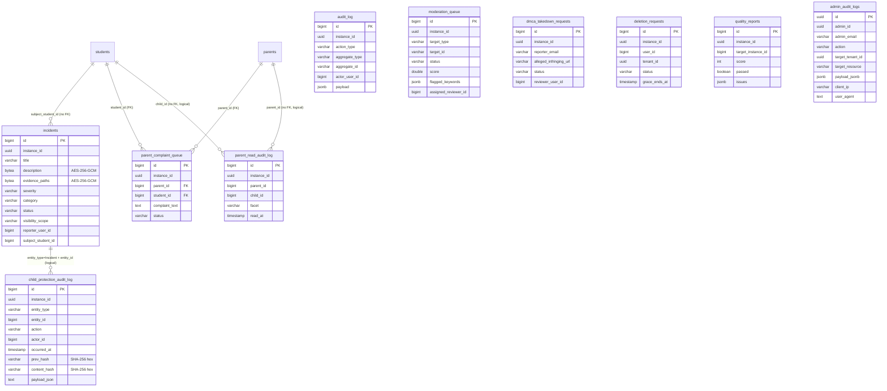

# Cluster Compliance / Audit / Moderation (KiteClass)

> **TL;DR** — Cluster này gồm **11 bảng** chia thành 4 nhóm:
>
> 1. **Audit trails** (5 bảng) — `audit_log` (V35, generic security-action trail), `parent_read_audit_log` (V53, mỗi facet read của portal phụ huynh), `child_protection_audit_log` (V54, hash-chain append-only PDPL Art 16 + Luật Trẻ em 2016 Đ.51), `admin_audit_logs` (V60, immutable platform-admin RLS-bypass audit per PDPL Art 11), và `quality_reports` (V39, AI Branding quality-gate snapshot).
> 2. **Moderation / takedown** (2 bảng) — `moderation_queue` (V36, ADR-010 content moderation Stage 1+X) và `dmca_takedown_requests` (V37, §512 safe-harbor reactive workflow).
> 3. **DSAR / retention** (1 bảng) — `deletion_requests` (V38, GDPR Art 17 + ADR-013 7-day grace window).
> 4. **Child-protection ticketing + complaint** (3 bảng) — `incidents` (V49, BR-CHILD-PROTECT, AES-256-GCM mã hóa description/evidence), `parent_complaint_queue` (V56 v1 write surface, Đ.83 K2 Luật Giáo dục 2019), bổ sung `child_protection_audit_log` (kép vai trò với nhóm 1).
>
> - **Compliance backbone**: PDPL Art 11 (admin trail) + Art 16 (children PII) + Luật Trẻ em 2016 Đ.21/Đ.51 (privacy + mandatory reporting ≤24h) + DMCA §512 (safe harbor) + GDPR Art 17 (erasure).
> - **Immutability cấp DB**: `admin_audit_logs` dùng RLS UPDATE/DELETE block (V60); `child_protection_audit_log` dùng REVOKE DELETE qua DO block (V54).
> - **Crypto**: `incidents.description` / `evidence_paths` BYTEA + AES-256-GCM (per-field random IV 12B, auth tag 16B) qua `AesGcmAttributeConverter`.
> - **Hash-chain**: `child_protection_audit_log.content_hash = SHA-256(prev_hash || canonical_payload)` — tamper-evident.
> - **RLS** (V58/V59 hardened): bật trên **9/11 bảng** trong cluster (`audit_log`, `moderation_queue`, `dmca_takedown_requests`, `deletion_requests`, `quality_reports`, `incidents`, `parent_read_audit_log`, `child_protection_audit_log`, `parent_complaint_queue`). `admin_audit_logs` (V60) tự khai RLS riêng với UPDATE/DELETE block. `parent_complaint_queue` tạo ở V56 (sau V58/V59) → policy chỉ apply nếu V58/V59 re-runnable; verify per cluster anomalies.
> - **V73 UUID sweep gap**: actor user-id columns (`audit_log.actor_user_id`, `moderation_queue.assigned_reviewer_id`, `dmca_takedown_requests.reviewer_user_id`, `incidents.reporter_user_id` / `assigned_officer_user_id`, `child_protection_audit_log.actor_id`, `deletion_requests.user_id`) đều **vẫn BIGINT** — V73 chỉ sweep `created_by`/`updated_by`. JWT `sub` UUID → BIGINT parse fail (xem A6 anomalies).

---

## ERD

> Ghi chú quan hệ: chỉ `parent_complaint_queue → parents/students` có FK thật (V56 `REFERENCES`). Các quan hệ `incidents ↔ child_protection_audit_log`, `parent_read_audit_log ↔ parents/students`, `audit_log → aggregate_*` đều là **liên kết logic** (string discriminator `entity_type`/`aggregate_type` + ID không-FK). `admin_audit_logs.admin_id` tham chiếu **cross-DB** sang `kitehub-subscription.users.id` (UUID-UUID, không cùng database).

---

## `audit_log`

**Mục đích.** Append-only audit trail dùng chung cho mọi nghiệp vụ security-sensitive ở kiteclass (moderation V36, DMCA V37, retention V38, branding lifecycle). Một dòng = một hành động. Caller bắt buộc đi qua `AuditLogWriter` (foundation rule trong javadoc entity) để xử lý propagation/truncation/serialization nhất quán. Tạo ở `V35` (Wave 4 Sub-PR 4.0), RLS V58/V59.

| Cột | Kiểu | Null | Default | Khóa/Index | Ý nghĩa |
|---|---|---|---|---|---|
| `id` | BIGSERIAL | NO | seq | PK | Khóa chính |
| `instance_id` | UUID | NO | — | `idx_audit_log_instance_id` | Tenant ID |
| `action_type` | VARCHAR(100) | NO | — | `idx_audit_log_action_type` | Loại hành động (vd `MODERATION_DECIDED`, `DMCA_VALID`, `DELETION_REQUESTED`) |
| `aggregate_type` | VARCHAR(100) | NO | — | `idx_audit_log_aggregate (aggregate_type, aggregate_id)` | Loại entity bị tác động (string discriminator, vd `ModerationQueue`, `DmcaTakedownRequest`) |
| `aggregate_id` | VARCHAR(100) | NO | — | `idx_audit_log_aggregate` | ID entity (string vì cross-type — có thể BIGINT serialized) |
| `actor_user_id` | BIGINT | YES | — | `idx_audit_log_actor` | Actor user-id. ⚠️ **V73 KHÔNG convert** — vẫn BIGINT (xem A6 anomalies). Entity `@Retention(pseudonymizeFields = {"actor_user_id"})` markup cho retention sweeper |
| `actor_role` | VARCHAR(50) | YES | — | — | Role tại thời điểm action (vd `PLATFORM_ADMIN`, `TEACHER`) |
| `payload` | JSONB | YES | — | — | Request context (input + output diff + reason). Entity dùng `@JdbcTypeCode(SqlTypes.JSON)` (GAP-220 fix) để bind String → JSONB thay vì VARCHAR |
| `reason` | VARCHAR(500) | YES | — | — | Free-text reason (vd "auto-approved score > threshold") |
| `created_at` | TIMESTAMP | NO | `CURRENT_TIMESTAMP` | — | Audit — tạo. ⚠️ `TIMESTAMP` không TZ |
| `updated_at` | TIMESTAMP | NO | `CURRENT_TIMESTAMP` | — | Audit — cập nhật. ⚠️ `TIMESTAMP` không TZ. Trong thực tế **không bao giờ flip** (append-only semantic — xem A2) |
| `created_by` | VARCHAR(100) → **UUID** | YES | — | — | Actor tạo. V35 = VARCHAR(100); **V73 convert → UUID** qua DO block dynamic sweep |
| `updated_by` | VARCHAR(100) → **UUID** | YES | — | — | Actor cập nhật. V35 = VARCHAR(100); **V73 convert → UUID** |
| `version` | BIGINT | NO | `0` | — | Optimistic lock. V35 đã set DEFAULT 0 ngay từ đầu — không cần V62/V63 |
| `deleted` | BOOLEAN | NO | `FALSE` | — | Soft-delete (BaseEntity inheritance). Trong thực tế **không bao giờ flip TRUE** (append-only) |

**Constraints**: chỉ PK + indexes (action_type, aggregate composite, actor, instance, created_at DESC). Không CHECK constraint trên `action_type`/`aggregate_type` — caller tự kỷ luật string vocabulary.

**Quan hệ FK**
- Out: không có FK thật. `actor_user_id`, `aggregate_id` đều là tham chiếu **logic** (string discriminator + ID không-FK) để cross-domain capture (1 trail cho nhiều aggregate types).
- In: không.

**RLS + ghi chú**
- Tenant-scoped ✅. RLS bật ở `V58` + hardened `V59` (admin-bypass `app.is_platform_admin` + NULL force-fail).
- Append-only semantic enforced **chỉ ở code-level** (`AuditLogWriter` không expose update/delete); cột `deleted`/`updated_at` tồn tại do BaseEntity inheritance nhưng không dùng (xem A2).
- Map từ entity `AuditLog extends BaseEntity`, repository `AuditLogRepository`. Có annotation `@Retention(value = RetentionBucket.RETAIN_WITH_PSEUDO, pseudonymizeFields = {"actor_user_id"})` — retention sweeper sẽ pseudonymize actor sau retention window (ADR-013).

---

## `moderation_queue`

**Mục đích.** Persist mọi outcome **non-approved** từ pipeline moderation 2 stage (Stage 1 auto-classifier + Stage X human review). Bao gồm `NEEDS_HUMAN_REVIEW` (admin UI adjudicate) và `REJECTED` (auto). Tạo ở `V36` (Wave 4 Sub-PR 4.1, GAP-018, ADR-010), RLS V58/V59. Map từ entity `ModerationQueue` + `ModerationQueueRepository`.

| Cột | Kiểu | Null | Default | Khóa/Index | Ý nghĩa |
|---|---|---|---|---|---|
| `id` | BIGSERIAL | NO | seq | PK | Khóa chính |
| `instance_id` | UUID | NO | — | `idx_moderation_instance_id` | Tenant ID |
| `target_type` | VARCHAR(100) | NO | — | `idx_moderation_target (target_type, target_id)` | Loại content bị moderate (vd `BrandingAsset`, `LandingPage`, `UserComment`) |
| `target_id` | VARCHAR(100) | NO | — | `idx_moderation_target` | ID content (string discriminator) |
| `status` | VARCHAR(32) | NO | `'PENDING'` | `idx_moderation_status`; CHECK | Enum: `PENDING, APPROVED, REJECTED, NEEDS_HUMAN_REVIEW` |
| `score` | DOUBLE PRECISION | NO | `0.0` | — | Stage 1 auto-classifier confidence score (0.0-1.0 thường lệ) |
| `flagged_keywords` | JSONB | YES | — | — | Keywords/categories Stage 1 phát hiện (vd `{"profanity": ["..."], "violence": [...]}`) |
| `reason` | VARCHAR(500) | YES | — | — | Reason chi tiết (auto: keyword list; human: free-form note) |
| `assigned_reviewer_id` | BIGINT | YES | — | — | User-id reviewer được assign (Stage X). ⚠️ **V73 KHÔNG convert** — BIGINT (xem A6) |
| `decided_at` | TIMESTAMP | YES | — | — | Thời điểm chốt decision (PENDING → APPROVED/REJECTED). ⚠️ TIMESTAMP không TZ |
| `created_at` | TIMESTAMP | NO | `CURRENT_TIMESTAMP` | — | Audit — tạo. ⚠️ TIMESTAMP không TZ |
| `updated_at` | TIMESTAMP | NO | `CURRENT_TIMESTAMP` | — | Audit — cập nhật |
| `created_by` | VARCHAR(100) → **UUID** | YES | — | — | V36 = VARCHAR(100); **V73 convert → UUID** |
| `updated_by` | VARCHAR(100) → **UUID** | YES | — | — | V36 = VARCHAR(100); **V73 convert → UUID** |
| `version` | BIGINT | NO | `0` | — | Optimistic lock. V36 set DEFAULT 0 ngay từ đầu |
| `deleted` | BOOLEAN | NO | `FALSE` | `idx_moderation_deleted` | Soft-delete |

**Constraints**: `chk_moderation_status CHECK(status IN ('PENDING','APPROVED','REJECTED','NEEDS_HUMAN_REVIEW'))`.

**Quan hệ FK**
- Out: không có FK thật. `target_id` tham chiếu logic (cross-type), `assigned_reviewer_id` cross-service.
- In: không.

**RLS + ghi chú**
- Tenant-scoped ✅. RLS V58 + V59.
- Cross-cuts: mọi decision PHẢI emit row tương ứng vào `audit_log` (V35) với `aggregate_type='ModerationQueue'` (kỷ luật code-level, không FK).

---

## `dmca_takedown_requests`

**Mục đích.** Persist public DMCA takedown intake + review workflow theo §512 safe-harbor (ADR-012 Track 2 reactive). Vòng đời: `PENDING → REVIEWING → VALID/INVALID → EXECUTED/CONTESTED`. Cặp đôi với `audit_log` (V35) cho safe-harbor trail. Tạo ở `V37` (Wave 4 Sub-PR 4.3, GAP-042), RLS V58/V59. Map từ entity `DmcaTakedownRequest` + enum `DmcaStatus`.

| Cột | Kiểu | Null | Default | Khóa/Index | Ý nghĩa |
|---|---|---|---|---|---|
| `id` | BIGSERIAL | NO | seq | PK | Khóa chính |
| `instance_id` | UUID | NO | — | — | Tenant ID (mỗi instance KiteClass có DMCA channel riêng) |
| `reporter_email` | VARCHAR(255) | NO | — | `idx_dmca_takedown_reporter_email` | Email người báo cáo (chấp nhận unverified — §512(c)(3) cho phép) |
| `reporter_name` | VARCHAR(255) | NO | — | — | Tên người báo cáo (statutory declaration) |
| `alleged_infringing_url` | VARCHAR(2000) | NO | — | — | URL nội dung bị tố cáo. 2000 char đủ cho URL dài + query params |
| `copyrighted_work_description` | VARCHAR(4000) | NO | — | — | Mô tả tác phẩm gốc bị xâm phạm (§512(c)(3)(A)(ii)) |
| `status` | VARCHAR(16) | NO | `'PENDING'` | `idx_dmca_takedown_status`; CHECK | Enum `DmcaStatus`: `PENDING, REVIEWING, VALID, INVALID, EXECUTED, CONTESTED` |
| `counter_notice_email` | VARCHAR(255) | YES | — | — | Email kẻ phản đối (counter-notice §512(g)) |
| `reviewer_user_id` | BIGINT | YES | — | — | User-id staff review notice. ⚠️ **V73 KHÔNG convert** — BIGINT (xem A6) |
| `reviewed_at` | TIMESTAMP | YES | — | — | Thời điểm staff close review. ⚠️ TIMESTAMP không TZ |
| `executed_at` | TIMESTAMP | YES | — | — | Thời điểm thực hiện takedown (chuyển content offline) |
| `contested_at` | TIMESTAMP | YES | — | — | Thời điểm nhận counter-notice |
| `rejection_reason` | VARCHAR(500) | YES | — | — | Lý do reject (vd "không đủ statutory elements") |
| `created_at` | TIMESTAMP | NO | `CURRENT_TIMESTAMP` | — | Audit — tạo. ⚠️ TIMESTAMP không TZ |
| `updated_at` | TIMESTAMP | NO | `CURRENT_TIMESTAMP` | — | Audit — cập nhật |
| `created_by` | VARCHAR(100) → **UUID** | YES | — | — | V37 = VARCHAR(100); **V73 convert → UUID** |
| `updated_by` | VARCHAR(100) → **UUID** | YES | — | — | V37 = VARCHAR(100); **V73 convert → UUID** |
| `version` | BIGINT | NO | `0` | — | Optimistic lock. V37 set DEFAULT 0 ngay từ đầu |
| `deleted` | BOOLEAN | NO | `FALSE` | `idx_dmca_takedown_deleted` | Soft-delete |

**Constraints**: `chk_dmca_takedown_status CHECK(status IN ('PENDING','REVIEWING','VALID','INVALID','EXECUTED','CONTESTED'))`.

**Quan hệ FK**
- Out: không có FK thật. `reviewer_user_id` cross-service.
- In: không. Liên kết với `audit_log` (V35) qua aggregate string.

**RLS + ghi chú**
- Tenant-scoped ✅. RLS V58 + V59.
- §512 safe-harbor trail: mỗi state transition emit row `audit_log` với `aggregate_type='DmcaTakedownRequest'` + `action_type='DMCA_*'` để có evidence cho khiếu nại tương lai.

---

## `deletion_requests`

**Mục đích.** Tracking tenant/user deletion request qua 7-day grace window và pipeline purge + pseudonymize theo GDPR Art 17 (right to erasure) + PDPL Art 16. Vòng đời: `PENDING → GRACE_PERIOD → PROCESSING → COMPLETED` (hoặc `CANCELLED` khi vẫn ở PENDING/GRACE_PERIOD). Tạo ở `V38` (Wave 4 Sub-PR 4.4, GAP-073, ADR-013), RLS V58/V59. Map từ entity `DeletionRequest` + `DeletionRequestRepository`.

| Cột | Kiểu | Null | Default | Khóa/Index | Ý nghĩa |
|---|---|---|---|---|---|
| `id` | BIGSERIAL | NO | seq | PK | Khóa chính |
| `instance_id` | UUID | NO | — | — | Tenant ID (tenant đang xử lý request) |
| `user_id` | BIGINT | NO | — | `idx_deletion_request_user` | User data-subject xin xóa. ⚠️ **V73 KHÔNG convert** — BIGINT (xem A6). Là **data-subject identity**, không phải actor — đặc biệt nhạy cảm |
| `tenant_id` | UUID | NO | — | `idx_deletion_request_tenant` | Tenant của data-subject (có thể khác `instance_id` của tenant đang xử lý — vd cross-tenant deletion) |
| `status` | VARCHAR(16) | NO | — *(không default)* | `idx_deletion_request_status`; CHECK | Enum: `PENDING, GRACE_PERIOD, PROCESSING, COMPLETED, CANCELLED` |
| `requested_at` | TIMESTAMP | NO | `CURRENT_TIMESTAMP` | — | Thời điểm user submit request. ⚠️ TIMESTAMP không TZ |
| `grace_starts_at` | TIMESTAMP | YES | — | — | Khi PENDING → GRACE_PERIOD |
| `grace_ends_at` | TIMESTAMP | YES | — | `idx_deletion_request_grace_ends` | Hết grace window — sweeper sẽ flip → PROCESSING. Index riêng vì cron job query theo cột này |
| `processing_started_at` | TIMESTAMP | YES | — | — | Khi purge job bắt đầu |
| `completed_at` | TIMESTAMP | YES | — | — | Khi purge job xong |
| `cancelled_at` | TIMESTAMP | YES | — | — | Khi user cancel (chỉ PENDING/GRACE_PERIOD) |
| `cancellation_reason` | VARCHAR(500) | YES | — | — | Lý do cancel (free-text) |
| `data_export_url` | VARCHAR(1024) | YES | — | — | URL data export ZIP (GDPR Art 20 portability) — issued trước khi purge |
| `created_at` | TIMESTAMP | NO | `CURRENT_TIMESTAMP` | — | Audit — tạo. ⚠️ TIMESTAMP không TZ |
| `updated_at` | TIMESTAMP | NO | `CURRENT_TIMESTAMP` | — | Audit — cập nhật |
| `created_by` | BIGINT → **UUID** | YES | — | — | V38 = BIGINT; **V73 convert → UUID** |
| `updated_by` | BIGINT → **UUID** | YES | — | — | V38 = BIGINT; **V73 convert → UUID** |
| `version` | BIGINT | NO | `0` | — | Optimistic lock. V38 set DEFAULT 0 ngay từ đầu |
| `deleted` | BOOLEAN | NO | `FALSE` | `idx_deletion_request_deleted` | Soft-delete (paradox: bảng theo dõi deletion request thì có row "deleted=TRUE" hơi kỳ — chỉ flip khi audit-purge bảng này sau retention) |

**Constraints**: `chk_deletion_request_status CHECK(status IN ('PENDING','GRACE_PERIOD','PROCESSING','COMPLETED','CANCELLED'))`.

**Quan hệ FK**
- Out: không có FK thật. `user_id`/`tenant_id` đều cross-service references.
- In: không.

**RLS + ghi chú**
- Tenant-scoped ✅. RLS V58 + V59 (chú ý: scope là `instance_id` của tenant đang xử lý, KHÔNG phải `tenant_id` của data-subject — case cross-tenant deletion phải dùng admin bypass).
- Cron job: sweeper background poll `WHERE status='GRACE_PERIOD' AND grace_ends_at < NOW()` → flip → PROCESSING → trigger purge pipeline (ADR-013).

---

## `quality_reports`

**Mục đích.** Persist Quality Gate snapshot từ pipeline AI Branding (`InstanceQualityReviewer.review(instanceId)`). Quality Gate là bắt buộc trước DEPLOY transition (`ai-branding-guidelines.md` §5): nếu `score < PASS_THRESHOLD` (default 70), `PublishPackageStep` block DEPLOY và lifecycle caller flip target instance → FAILED. Tạo ở `V39` (Wave 4 Sub-PR 4.5, GAP-012), RLS V58/V59. Map từ entity `QualityReport` + `QualityReportRepository`.

| Cột | Kiểu | Null | Default | Khóa/Index | Ý nghĩa |
|---|---|---|---|---|---|
| `id` | BIGSERIAL | NO | seq | PK | Khóa chính |
| `instance_id` | UUID | NO | — | — | Tenant ID (instance chạy quality review). Có thể khác `target_instance_id` (vd platform admin review cross-tenant) |
| `target_instance_id` | BIGINT | NO | — | `idx_quality_report_target` | Instance bị review (PK kitehub `instances.id`). Cross-service reference (không FK) |
| `branding_version` | INT | NO | — | — | Version branding tại thời điểm review (snapshot reference) |
| `score` | INT | NO | — | — | Total quality score 0-100. CHECK `0 ≤ score ≤ 100` |
| `passed` | BOOLEAN | NO | — | `idx_quality_report_passed` | Boolean kết quả gate (`score >= PASS_THRESHOLD`) — denormalized để query nhanh |
| `issues` | JSONB | YES | — | — | Danh sách issues found (vd `[{"check": "contrast", "severity": "high", "msg": "..."}]`) — admin UI render |
| `contrast_score` | INT | YES | — | — | Sub-score contrast WCAG. Materialized để query không cần parse JSON |
| `css_vars_score` | INT | YES | — | — | Sub-score CSS vars compliance |
| `asset_urls_score` | INT | YES | — | — | Sub-score asset URL reachability |
| `visual_regression_score` | INT | YES | — | — | Sub-score visual regression vs baseline |
| `logo_placement_score` | INT | YES | — | — | Sub-score logo placement (size, position) |
| `created_at` | TIMESTAMP | NO | `CURRENT_TIMESTAMP` | `idx_quality_report_created_at DESC` | Audit — tạo. ⚠️ TIMESTAMP không TZ |
| `updated_at` | TIMESTAMP | NO | `CURRENT_TIMESTAMP` | — | Audit — cập nhật |
| `created_by` | VARCHAR(100) → **UUID** | YES | — | — | V39 = VARCHAR(100); **V73 convert → UUID** |
| `updated_by` | VARCHAR(100) → **UUID** | YES | — | — | V39 = VARCHAR(100); **V73 convert → UUID** |
| `version` | BIGINT | NO | `0` | — | Optimistic lock. V39 set DEFAULT 0 ngay từ đầu |
| `deleted` | BOOLEAN | NO | `FALSE` | `idx_quality_report_deleted` | Soft-delete |

**Constraints**: `chk_quality_report_score_range CHECK(score >= 0 AND score <= 100)`.

**Quan hệ FK**
- Out: không có FK thật. `target_instance_id` là cross-service reference tới `kitehub` instances DB.
- In: không.

**RLS + ghi chú**
- Tenant-scoped ✅ qua `instance_id` (tenant chạy review). RLS V58 + V59.
- Cross-cuts: kèm row trong `audit_log` (V35) với `aggregate_type='QualityReport'` + `action_type='QUALITY_GATE_PASS/FAIL'`. Implementation `ai-branding-quality-gate` skill scaffolded GAP-223 Sub-PR 223.1; real WCAG/visual-regression/ML classifier vẫn pending GAP-226/227/228.

---

## `incidents`

**Mục đích.** Child-protection ticket — báo cáo + xử lý các vấn đề bảo vệ trẻ em (bắt nạt, lạm dụng, grooming, CSAM, etc.). Các trường sensitive (`description`, `evidence_paths`) **mã hóa at rest** bằng `AesGcmAttributeConverter` (AES-256-GCM, per-field random IV 12B, auth tag 16B; cipher layout `[IV(12) | ciphertext | auth_tag(16)]`). Title plaintext cho indexing + admin triage. Tạo ở `V49` (Wave 18b1 Bucket E, GAP-322 Phase 1A), extended ở `V54` (GAP-322c Phase 1C — visibility_scope), RLS V58/V59. Map từ entity `Incident` + RBAC role `SAFEGUARDING_OFFICER` (seeded ở V49).

| Cột | Kiểu | Null | Default | Khóa/Index | Ý nghĩa |
|---|---|---|---|---|---|
| `id` | BIGSERIAL | NO | seq | PK | Khóa chính |
| `instance_id` | UUID | NO | — | `idx_incidents_instance_id` | Tenant ID |
| `title` | VARCHAR(200) | NO | — | — | **Plaintext** non-sensitive title (≤200 ký tự, search-friendly). Sensitive narrative ở `description` (mã hóa) |
| `description` | BYTEA | YES | — | — | **AES-256-GCM encrypted** narrative. Layout `[IV(12) | ciphertext | auth_tag(16)]`. Decrypt qua `AesGcmAttributeConverter` khi đọc entity; raw BYTEA query trả ciphertext. Cần permission `INCIDENT_READ_DECRYPTED` |
| `evidence_paths` | BYTEA | YES | — | — | **AES-256-GCM encrypted** newline-separated MinIO object keys. Phase 1B (GAP-322b) mã hóa bucket MinIO chính nó (bucket-level encryption) |
| `severity` | VARCHAR(20) | NO | — | `idx_incidents_severity`; CHECK | Enum `IncidentSeverity`: `LOW, MEDIUM, HIGH, CRITICAL`. CRITICAL + category=ABUSE/CSAM trigger Đ.51 banner (Phase 1C) |
| `category` | VARCHAR(30) | NO | — | `idx_incidents_category`; CHECK | Enum `IncidentCategory`: `BULLYING, ABUSE, GROOMING, CSAM, OTHER`. CSAM = strictest (Tổng đài 111 + công an mandatory ≤24h per Đ.51 + BLHS Đ.147) |
| `status` | VARCHAR(20) | NO | `'REPORTED'` | `idx_incidents_status`; CHECK | Enum `IncidentStatus`: `REPORTED, INVESTIGATING, ESCALATED, RESOLVED, CLOSED`. Phase 1A cho phép transition tự do; Phase 1B lock state machine |
| `visibility_scope` | VARCHAR(32) | NO | `'STAFF_ONLY'` | `idx_incidents_visibility_scope`; CHECK (V54) | Phase 1C v1 (BR-CHILD-PROTECT-005): `PARENT_VISIBLE, PUBLIC, STAFF_ONLY, RESTRICTED`. Default STAFF_ONLY để legacy data **không leak** sang parent portal conduct facet |
| `reporter_user_id` | BIGINT | NO | — | `idx_incidents_reporter` | User-id reporter (PH/HS/GV). ⚠️ **V73 KHÔNG convert** — BIGINT (xem A6) |
| `subject_student_id` | BIGINT | YES | — | `idx_incidents_subject_student` | Học sinh là đối tượng (nullable cho case không identify; logical ref tới `students` không FK) |
| `assigned_officer_user_id` | BIGINT | YES | — | — | Safeguarding officer xử lý. ⚠️ **V73 KHÔNG convert** — BIGINT (xem A6) |
| `created_at` | TIMESTAMP | NO | `CURRENT_TIMESTAMP` | — | Audit — tạo. ⚠️ TIMESTAMP không TZ |
| `updated_at` | TIMESTAMP | YES | — | — | Audit — cập nhật |
| `created_by` | BIGINT → **UUID** | YES | — | — | V49 = BIGINT; **V73 convert → UUID** |
| `updated_by` | BIGINT → **UUID** | YES | — | — | V49 = BIGINT; **V73 convert → UUID** |
| `deleted` | BOOLEAN | NO | `FALSE` | `idx_incidents_deleted` | Soft-delete (chú ý: child-protection data thường KHÔNG được hard-delete trừ khi có court order; retention sweeper enforce 7y per GAP-322c) |
| `version` | BIGINT | NO | `0` | — | Optimistic lock. V49 set DEFAULT 0 ngay từ đầu |

**Constraints**:
- `chk_incidents_severity CHECK(severity IN ('LOW','MEDIUM','HIGH','CRITICAL'))`.
- `chk_incidents_category CHECK(category IN ('BULLYING','ABUSE','GROOMING','CSAM','OTHER'))`.
- `chk_incidents_status CHECK(status IN ('REPORTED','INVESTIGATING','ESCALATED','RESOLVED','CLOSED'))`.
- `chk_incidents_visibility_scope CHECK(visibility_scope IN ('PARENT_VISIBLE','PUBLIC','STAFF_ONLY','RESTRICTED'))` (V54).

**Quan hệ FK**
- Out: không có FK thật. `subject_student_id` là logical ref tới `students`, `reporter_user_id`/`assigned_officer_user_id` cross-service.
- In: `child_protection_audit_log` ghi state transitions của incidents qua logical link (`entity_type='Incident'` + `entity_id=incidents.id`) — không FK.

**RLS + ghi chú**
- Tenant-scoped ✅. RLS V58 + V59.
- Compliance: PDPL Decree 13/2023 Art 16 (children PII special protection) + Luật Trẻ em 2016 Đ.6/Đ.25/Đ.51 + BLHS Đ.147 (CSAM criminal liability).
- V49 seeds RBAC at NIL UUID (`instance_id=00000000-...`): role `SAFEGUARDING_OFFICER` + permissions `INCIDENT_READ_DECRYPTED` / `INCIDENT_WRITE` / `INCIDENT_REPORT`. RoleSeederService clone sang per-tenant instance_id khi provisioning.

---

## `parent_read_audit_log`

**Mục đích.** Per-read audit cho parent-portal facet endpoints — trả lời câu hỏi compliance "ai đã xem dữ liệu của con tôi, lúc nào, qua facet nào?" theo PDPL Decree 13/2023 Art 16 + Luật Trẻ em 2016 Đ.21 (children's privacy right). Mỗi parent đọc TRANSCRIPT/ATTENDANCE/FEES/CONDUCT/NOTIFICATIONS → 1 row. Tạo ở `V53` (Wave 18b2 Bucket C, GAP-321b Phase 1B v1), RLS V58/V59. Map từ entity `ParentReadAuditLog` (module `parent.audit`).

| Cột | Kiểu | Null | Default | Khóa/Index | Ý nghĩa |
|---|---|---|---|---|---|
| `id` | BIGSERIAL | NO | seq | PK | Khóa chính |
| `instance_id` | UUID | NO | — | — | Tenant ID |
| `parent_id` | BIGINT | NO | — | `idx_parent_read_audit_parent_child_time (parent_id, child_id, read_at)` | Phụ huynh đọc. Logical ref tới `parents` (cluster 02), không FK |
| `child_id` | BIGINT | NO | — | `idx_parent_read_audit_parent_child_time` | Học sinh được đọc. Logical ref tới `students`, không FK |
| `facet` | VARCHAR(20) | NO | — | `idx_parent_read_audit_instance_facet (instance_id, facet)`; CHECK | Enum facet: `TRANSCRIPT` (Phase 1A), `ATTENDANCE, FEES, CONDUCT, NOTIFICATIONS` (Phase 1B). DISCIPLINE deferred GAP-321c |
| `read_at` | TIMESTAMP | NO | — | — | Server-side timestamp tại moment facet endpoint return 200. Distinct từ `created_at` để chừa room cho backfill loads (vd theo subpoena yêu cầu reconstitute từ access logs) |
| `created_at` | TIMESTAMP | NO | `CURRENT_TIMESTAMP` | — | Audit — tạo. ⚠️ TIMESTAMP không TZ |
| `updated_at` | TIMESTAMP | YES | — | — | Audit — cập nhật (trong thực tế không flip — semantic append-only) |
| `created_by` | BIGINT → **UUID** | YES | — | — | V53 = BIGINT; **V73 convert → UUID** |
| `updated_by` | BIGINT → **UUID** | YES | — | — | V53 = BIGINT; **V73 convert → UUID** |
| `deleted` | BOOLEAN | NO | `FALSE` | `idx_parent_read_audit_deleted` | Soft-delete |
| `version` | BIGINT | NO | `0` | — | Optimistic lock. V53 set DEFAULT 0 ngay từ đầu |

**Constraints**: `chk_parent_read_audit_facet CHECK(facet IN ('TRANSCRIPT','ATTENDANCE','FEES','CONDUCT','NOTIFICATIONS'))`.

**Quan hệ FK**
- Out: không có FK thật. `parent_id`/`child_id` logical refs (V53 javadoc + migration ghi rõ "no FK, logical").
- In: không.

**RLS + ghi chú**
- Tenant-scoped ✅. RLS V58 + V59.
- Index strategy: `(parent_id, child_id, read_at)` lead column = parent_id (most queries scope by parent during admin investigation); `(instance_id, facet)` secondary cho aggregation queries (vd "tháng này tenant X có bao nhiêu notification reads").
- **Open follow-up** (per migration comment): 5-year retention sweeper + IP/user-agent capture tracked GAP-321b.4 (chưa land).

---

## `child_protection_audit_log`

**Mục đích.** Append-only **hash-chain** audit log cho child-protection domain (per BR-CHILD-PROTECT-007). Mỗi entry ghi 1 CRUD/state-change action trên entity (vd `incidents`). Chain integrity = `content_hash = SHA-256(prev_hash || canonical_payload_json)`. Tạo ở `V54` (Wave 19 Bucket A, GAP-322c Phase 1C v1), RLS V58/V59 + REVOKE DELETE qua DO block ở V54. Map từ entity `ChildProtectionAuditLog` (module `childprotection.entity`) — **KHÔNG extends BaseEntity** (chủ ý, vì append-only không có `deleted`/`updated_at`/`version`).

| Cột | Kiểu | Null | Default | Khóa/Index | Ý nghĩa |
|---|---|---|---|---|---|
| `id` | BIGSERIAL | NO | seq | PK | Khóa chính (convenience cho repo, không phải integrity layer) |
| `instance_id` | UUID | NO | — | `idx_cp_audit_instance_id` | Tenant ID. Populated explicitly bởi `ChildProtectionAuditService` từ `TenantContext` — **KHÔNG** subject tới Hibernate `tenantFilter` (để cross-tenant integrity cron readable) |
| `entity_type` | VARCHAR(64) | NO | — | `idx_cp_audit_entity (entity_type, entity_id)` | Loại entity (vd `"Incident"`) |
| `entity_id` | BIGINT | NO | — | `idx_cp_audit_entity` | ID entity row (vd `incidents.id`) |
| `action` | VARCHAR(128) | NO | — | — | High-level action (vd `"INCIDENT_TRANSITION_CRITICAL"`, `"MANDATORY_REPORT_ACK"`). Free-form string, kept short cho grep-ability |
| `actor_id` | BIGINT | YES | — | `idx_cp_audit_actor` | User-id actor (safeguarding officer, system listener). Nullable cho system-initiated transitions — `action` token nên make system actor explicit. ⚠️ **V73 KHÔNG convert** — BIGINT (xem A6) |
| `occurred_at` | TIMESTAMP | NO | — | `idx_cp_audit_occurred_at` | Wall-clock instant action happened. Populated bởi service tại write time (KHÔNG JPA auditing — auditing chỉ dùng cho mutable entities). ⚠️ TIMESTAMP không TZ |
| `prev_hash` | VARCHAR(64) | NO | — | CHECK `length=64` | Hex SHA-256 của entry trước trong chain. Genesis (entry đầu mỗi chain `(instance_id, entity_type)`) = `"0".repeat(64)` |
| `content_hash` | VARCHAR(64) | NO | — | CHECK `length=64` | Hex SHA-256 của `prev_hash || canonical_payload_json`. Recompute on read để detect tamper |
| `payload_json` | TEXT | NO | — | — | Canonical JSON payload (entity snapshot fragment + actor + timestamps). Serialized at append-time. Bound length generous (TEXT, không VARCHAR) |

**Constraints**: `chk_cp_audit_hash_length CHECK(length(prev_hash) = 64 AND length(content_hash) = 64)`.

**Quan hệ FK**
- Out: không có FK thật. `entity_id` là logical ref tới `incidents.id` (hoặc bất kỳ child-protection entity nào subsequent — `entity_type` discriminator).
- In: không.

**RLS + ghi chú**
- Tenant-scoped ✅. RLS V58 + V59 — NHƯNG javadoc entity ghi rõ tenant filter **KHÔNG** apply qua Hibernate filter (chỉ qua RLS DB-level), để cross-tenant integrity cron readable.
- **Append-only invariant 2 lớp**:
  1. **Entity-level**: KHÔNG extends BaseEntity → không có `deleted`/`updated_at`/`version` columns. Once written, rows immutable from JPA perspective.
  2. **DB-level**: V54 DO block `REVOKE DELETE` cho app role (`kiteclass_app`/`kiteclass`/`kite_app`). Superuser bypass khả thi nhưng daily hash-chain integrity verification (Phase 1C remainder, GAP-322c.X) sẽ detect.
- **Hash chain genesis**: per `(instance_id, entity_type)` cặp. Vd Tenant A's Incident chain bắt đầu với prev_hash = 64-char zeros; Tenant B's chain riêng. Integrity check verify mỗi chain từ genesis.
- Compliance: Luật Trẻ em 2016 Đ.51 (mandatory reporting ≤24h — audit log là evidence chain khi công an/MOLISA review) + PDPL Decree 13/2023 Art 16 + BLHS Đ.147 (CSAM non-repudiation).

---

## `parent_complaint_queue`

**Mục đích.** Minimal v1 write surface cho parent complaint workflow — thỏa Đ.83 K2 Luật Giáo dục 2019 (parent có quyền communication implicit). v1 chỉ persist parent input + scope theo parent/student để audit trail tồn tại. **Full workflow** (4-level escalation, attachments, resolution UI) lands GAP-339. Tạo ở `V56` (Wave 19, GAP-321c Phase 1C v1), RLS V58/V59. Map từ entity `ParentComplaint` (module `parent.entity`).

| Cột | Kiểu | Null | Default | Khóa/Index | Ý nghĩa |
|---|---|---|---|---|---|
| `id` | BIGSERIAL | NO | seq | PK | Khóa chính |
| `instance_id` | UUID | NO | — | `idx_parent_complaint_queue_instance` | Tenant ID |
| `parent_id` | BIGINT | NO | — | FK → `parents(id)`; `idx_parent_complaint_queue_parent` | Phụ huynh khiếu nại. **FK thật** (`REFERENCES parents (id)`) — V56 emit FK constraint |
| `student_id` | BIGINT | NO | — | FK → `students(id)`; `idx_parent_complaint_queue_student` | Học sinh liên quan. **FK thật** (`REFERENCES students (id)`) |
| `complaint_text` | TEXT | NO | — | — | Nội dung khiếu nại free-text (Phase 1C v1 chưa attach files) |
| `status` | VARCHAR(20) | NO | `'PENDING'` | `idx_parent_complaint_queue_status`; CHECK | Enum: `PENDING, IN_REVIEW, RESOLVED, REJECTED` |
| `resolved_at` | TIMESTAMP | YES | — | — | Thời điểm close complaint. ⚠️ TIMESTAMP không TZ |
| `created_at` | TIMESTAMP | NO | `NOW()` | — | Audit — tạo. ⚠️ TIMESTAMP không TZ |
| `updated_at` | TIMESTAMP | YES | — | — | Audit — cập nhật |
| `created_by` | BIGINT → **UUID** | YES | — | — | V56 = BIGINT; **V73 convert → UUID** |
| `updated_by` | BIGINT → **UUID** | YES | — | — | V56 = BIGINT; **V73 convert → UUID** |
| `deleted` | BOOLEAN | NO | `FALSE` | — | Soft-delete |
| `version` | BIGINT | NO | `0` | — | Optimistic lock. V56 set DEFAULT 0 ngay từ đầu |

**Constraints**: `chk_parent_complaint_status CHECK(status IN ('PENDING','IN_REVIEW','RESOLVED','REJECTED'))`; 2 FK constraints (`parent_id → parents`, `student_id → students`).

**Quan hệ FK**
- Out: `parent_id → parents(id)` (cluster 02), `student_id → students(id)` (cluster 02). FK thật trong DB.
- In: không (Phase 1C v1 không link tới escalation tracking).

**RLS + ghi chú**
- Tenant-scoped ✅ qua `instance_id`. ⚠️ Bảng tạo ở **V56 sau V58/V59** ⇒ V58/V59 chỉ apply nếu re-runnable (kiểm tra cấu trúc V58/V59 — nếu là dynamic DO block thì OK; nếu static list bỏ qua → RLS DB-level chưa apply). Cô lập tenant ở tầng code (Hibernate `tenantFilter` + `@PreAuthorize`) — xem A9 anomalies.
- Companion change cùng V56: `parent_student_links.parental_consent` JSONB (PDPL granular consent) — bảng `parent_student_links` thuộc cluster 02, không trong cluster 07.

---

## `admin_audit_logs`

**Mục đích.** Immutable audit log cho mọi hành động platform-admin bypass tenant isolation (qua GUC `app.is_platform_admin=true` set bởi `PlatformAdminAuditAspect`). PDPL Art 11 compliance — mọi cross-tenant access bởi platform staff phải có evidence chain tamper-proof. Tạo ở `V60` (Wave 85 Bucket B, B-AC2 + B-AC7), self-contained RLS với UPDATE/DELETE block (KHÔNG dùng V58/V59 generic). **KHÔNG có entity JPA tương ứng** — viết qua raw JdbcTemplate trong `PlatformAdminAuditAspect`.

| Cột | Kiểu | Null | Default | Khóa/Index | Ý nghĩa |
|---|---|---|---|---|---|
| `id` | UUID | NO | — | PK | Surrogate primary key (UUID, không BIGSERIAL — khác mọi bảng khác trong cluster) |
| `admin_id` | UUID | NO | — | `idx_admin_audit_logs_admin` | Platform admin user-id. Tham chiếu **cross-DB** tới `kitehub-subscription.users.id` (UUID-UUID). Đã UUID từ inception |
| `admin_email` | VARCHAR(255) | NO | — | — | Denormalized snapshot email tại thời điểm action (users.email có thể đổi sau này — forensic cần snapshot) |
| `action` | VARCHAR(64) | NO | — | `idx_admin_audit_logs_action` | Semantic action token: `READ_TENANT, IMPERSONATE_USER, EXPORT_AUDIT_LOG, MUTATE_TENANT_CONFIG, ...` |
| `target_tenant_id` | UUID | YES | — | `idx_admin_audit_logs_target_tenant` | Tenant bị access. Nullable cho system-wide ops (không scope tenant cụ thể) |
| `target_resource` | VARCHAR(512) | YES | — | — | Fully-qualified resource id (vd `students/UUID`, `audit/UUID`) |
| `payload_jsonb` | JSONB | YES | — | — | Request context (query params, body summary). **KHÔNG** chứa raw response data (PII leak risk) |
| `client_ip` | VARCHAR(64) | YES | — | — | Admin source IP (forensic). VARCHAR not INET — tránh Postgres-specific binding bug (per `postgres-specific-type-testcontainers.md` lesson 2026-05-16) |
| `user_agent` | TEXT | YES | — | — | Admin source UA string |
| `created_at` | TIMESTAMP | NO | `NOW()` | `idx_admin_audit_logs_created_at DESC` | Server time, immutable. ⚠️ TIMESTAMP không TZ |

**Constraints**: chỉ PK + 4 indexes. KHÔNG có `version`/`deleted`/`updated_by`/`updated_at` — chủ ý (append-only, không soft-delete, immutable).

**Quan hệ FK**
- Out: không có FK thật (cross-DB tới kitehub).
- In: không.

**RLS + ghi chú** (self-contained, KHÔNG dùng V58/V59):
- `ALTER TABLE admin_audit_logs ENABLE ROW LEVEL SECURITY; FORCE ROW LEVEL SECURITY;` (V60).
- **SELECT policy** = `USING (true)` cho mọi role (admin self-audit + compliance review). Trade-off: SELECT exposed tới mọi DB user; mitigated qua app-layer authorization (chỉ `PLATFORM_ADMIN` role gọi `AdminAuditLogService.findAll`). Admin-bypass GUC KHÔNG apply ở đây vì admin_audit_logs là metadata, không phải tenant data.
- **INSERT policy** = `WITH CHECK (true)` cho mọi role (writes immutable per row, no harm). Thực tế chỉ `PlatformAdminAuditAspect` emit rows.
- **UPDATE policy** = `USING (false) WITH CHECK (false)` → predicate false → no row visible → no row updated. **DELETE policy** = `USING (false)` → tương tự, no row deleted.
- ⇒ Defense-in-depth: even khi app layer compromised, không cách nào UPDATE/DELETE rows từ DB connection thông thường (superuser bypass theoretically có thể nhưng rare + auditable).

---

## Ghi chú schema (anomalies)

### A1 — Audit trails đa-tầng nhưng không cùng schema/contract

Cluster có **5 audit trails** với mục đích chồng chéo, schema khác nhau, integrity model khác nhau:

| Bảng | V# | Scope | Integrity model | Tenant-scoped | DELETE block |
|---|---|---|---|---|---|
| `audit_log` | V35 | Generic security actions | Code-level append-only (chưa enforce DB) | Có (RLS V58/V59) | Không |
| `parent_read_audit_log` | V53 | Per-read facet by parent | Code-level append-only | Có (RLS V58/V59) | Không |
| `child_protection_audit_log` | V54 | Child-protection state changes | **Hash-chain SHA-256** + `REVOKE DELETE` DO block | Có (RLS V58/V59 + special non-Hibernate-filter) | Có (V54 DO block) |
| `admin_audit_logs` | V60 | Platform-admin RLS-bypass | **RLS UPDATE/DELETE = false** | Không tenant-scoped (cross-tenant audit) | Có (V60 RLS policy) |
| `quality_reports` | V39 | AI Branding quality-gate snapshot | Code-level append (in practice) | Có (RLS V58/V59) | Không |

⇒ Compliance reviewer phải biết bảng nào dùng integrity model nào. `audit_log` + `parent_read_audit_log` có cột `deleted`/`updated_at` (BaseEntity inheritance) nhưng KHÔNG bao giờ flip — semantic append-only chỉ ở code-level. `child_protection_audit_log` thẳng tay bỏ BaseEntity + REVOKE DELETE. `admin_audit_logs` đi xa nhất: RLS UPDATE/DELETE policy = false defense-in-depth. Bất nhất này phản ánh compliance bar tăng dần theo thời gian (V35 < V53 < V54 < V60).

### A2 — `audit_log` không có DB-level append-only enforcement

`audit_log` (V35) extends BaseEntity → có cột `deleted BOOLEAN` + `updated_at TIMESTAMP` + `version BIGINT` + `updated_by`. Caller bắt buộc đi qua `AuditLogWriter` (javadoc: "Direct repository.save is discouraged") nhưng KHÔNG có cơ chế DB-level chặn UPDATE/DELETE. Nếu code path khác (vd test fixture, migration script, raw SQL) UPDATE → row bị mutate; nếu DELETE → row bị xóa. Compared to `admin_audit_logs` (V60 RLS policy block) hoặc `child_protection_audit_log` (V54 REVOKE DELETE), `audit_log` v1 lỏng nhất. Đây là **drift compliance giữa các generation** của audit schema (Wave 4 vs Wave 85).

### A3 — `incidents` BYTEA encryption không reversible bằng raw SQL

`incidents.description` và `incidents.evidence_paths` BYTEA mã hóa AES-256-GCM. Layout `[IV(12) | ciphertext | auth_tag(16)]`. Decrypt CHỈ qua `AesGcmAttributeConverter` khi đọc entity. Raw `SELECT description FROM incidents` trả về ciphertext bytea — KHÔNG đọc được nội dung. Hệ quả:

- Debug/triage qua psql phải skip 2 cột này (chỉ thấy title plaintext).
- Backup/restore PHẢI bao gồm key material (lưu trong KMS / env). Restore mà mất key = data loss vĩnh viễn.
- Search-by-content impossible (full-text-search trên ciphertext = noise) — chỉ search title.
- Migration tương lai đổi key/algorithm cần data migration mã hóa lại từng row (key rotation flow GAP-322b).

Phase 1B (GAP-322b) mã hóa bucket MinIO chính nó (bucket-level encryption) — defense in depth 2 lớp (column AES-GCM + bucket SSE).

### A4 — V73 UUID sweep bỏ sót actor user-id columns NHIỀU bảng cluster

V73 (GAP-795) dynamic DO block sweep CHỈ `created_by`/`updated_by` (+ hardcoded `classes.teacher_id`, `classes.rescheduled_by_user_id`, `parent_invitations.invited_by_user_id`). **6 actor user-id columns trong cluster 07 vẫn BIGINT**:

- `audit_log.actor_user_id` BIGINT — actor mọi audit row.
- `moderation_queue.assigned_reviewer_id` BIGINT — staff reviewer Stage X.
- `dmca_takedown_requests.reviewer_user_id` BIGINT — staff review notice.
- `deletion_requests.user_id` BIGINT — data-subject (đặc biệt nhạy cảm: là PII trực tiếp).
- `incidents.reporter_user_id` BIGINT + `incidents.assigned_officer_user_id` BIGINT.
- `child_protection_audit_log.actor_id` BIGINT.

Vì X-User-Id JWT là UUID, các cột BIGINT này KHÔNG nhận được user-id thật (parse fail như RCA V73 mô tả) → trong thực tế hoặc null hoặc legacy data. **Compliance risk**: child-protection actor null = không trace được ai escalate incident; deletion_requests.user_id null = không biết data subject là ai sau khi purge → cản trở audit GDPR Art 17. Cần follow-up sweep tương tự V73 nhưng cho actor columns.

### A5 — TIMESTAMP vs TIMESTAMPTZ không nhất quán toàn cluster

**TIMESTAMP (no TZ)**: tất cả 11 bảng trong cluster — `created_at`, `updated_at`, `decided_at`, `reviewed_at`, `executed_at`, `contested_at`, `grace_starts_at`, `grace_ends_at`, `processing_started_at`, `completed_at`, `cancelled_at`, `read_at`, `occurred_at`, `resolved_at`, `requested_at`. Tất cả naive.

So sánh cluster 04 (Tài chính): `invoices`, `payments`, `payment_records` dùng TIMESTAMPTZ; chỉ `payroll_*` + `payment_idempotency_keys` dùng TIMESTAMP. Cluster 07 đồng nhất chọn TIMESTAMP nhưng đó là điểm yếu khi cross-cluster query (vd `audit_log.created_at` so với `payments.paid_at`) — implicit cast/timezone confusion. Đặc biệt:

- `deletion_requests.grace_ends_at` (TIMESTAMP) cần precise: sweeper poll `WHERE grace_ends_at < NOW()` — nếu server và DB khác TZ → race condition lúc cutover.
- `child_protection_audit_log.occurred_at` (TIMESTAMP) dùng cho mandatory-reporting ≤24h evidence — TZ mismatch có thể gây dispute với MOLISA/công an.

Recommend: future migration upgrade entire cluster sang TIMESTAMPTZ.

### A6 — Cột tham chiếu logic vs FK thật không nhất quán

Chỉ duy nhất `parent_complaint_queue` (V56) có FK thật (`parent_id → parents`, `student_id → students`). Toàn bộ các bảng còn lại dùng **logical references** (string discriminator + ID không-FK):

- `audit_log.aggregate_type/aggregate_id` — string discriminator + string ID (cross-aggregate type).
- `child_protection_audit_log.entity_type/entity_id` — tương tự.
- `moderation_queue.target_type/target_id` — tương tự.
- `parent_read_audit_log.parent_id/child_id` — javadoc nói rõ "no FK".
- `incidents.subject_student_id` — không FK (cho nullable case + cross-tenant flexibility).
- `deletion_requests.user_id/tenant_id` — cross-service refs.
- `admin_audit_logs.admin_id` — cross-DB ref.

Trade-off: linh hoạt cho cross-aggregate audit nhưng MẤT referential integrity (vd `incidents.subject_student_id=999999` cho học sinh đã xóa → orphan row). `parent_complaint_queue` là exception — FK thật vì v1 scope hẹp + dùng cho compliance bằng chứng (cần ensure complaint thực sự bound tới existing parent/student).

### A7 — `deletion_requests.status` thiếu DEFAULT

V38 khai báo `status VARCHAR(16) NOT NULL` mà KHÔNG set default. Mọi bảng status khác trong cluster đều có default (`'PENDING'` cho moderation/DMCA/complaint, `'REPORTED'` cho incidents, `'STAFF_ONLY'` cho visibility_scope). `deletion_requests.status` bắt buộc caller phải explicit pass — INSERT raw thiếu cột này sẽ NOT NULL violation. Bất nhất minor; có thể intentional (force explicit lifecycle state) hoặc oversight.

### A8 — `admin_audit_logs.client_ip` dùng VARCHAR thay vì INET (chủ ý)

V60 chọn `client_ip VARCHAR(64)` thay vì PostgreSQL native `INET`. Phù hợp với lesson 2026-05-16 (`postgres-specific-type-testcontainers.md` v1.0.0): `LoginAuditLog.ip INET` đã gây production 500 vì H2 silently accept VARCHAR binding mà Postgres reject `SQLState 42804`. V60 (Wave 85, ~3 tháng sau lesson learned) chọn VARCHAR(64) để tránh class bug đó. Đánh đổi: mất native subnet operators (`<<`, `>>`), không có IP-syntax validation tại DB level. Acceptable cho admin audit (forensic only, không index theo subnet).

### A9 — RLS coverage hậu V58/V59 cho bảng tạo sau

V58 (enable RLS) + V59 (hardening) chạy tại Wave 78 era. `parent_complaint_queue` (V56) tạo TRƯỚC V58/V59 → được V58/V59 cover (nếu V58 static list bao gồm). Verify: theo grep `V58__enable_rls_tenant_scoped_tables.sql` ở §setup migrations, list có cả `parent_complaint_queue` → ✅ RLS apply.

NHƯNG `admin_audit_logs` (V60) tạo SAU V58/V59 → V58/V59 không apply automatically. V60 tự setup RLS riêng (xem table doc). Future bảng compliance/audit tạo sau V60 cần follow precedent V60: tự enable RLS + tự define policies trong cùng migration.

### A10 — `child_protection_audit_log` REVOKE DELETE phụ thuộc app role name

V54 DO block REVOKE DELETE phụ thuộc `pg_roles` query tìm `kiteclass_app` / `kiteclass` / `kite_app`. Nếu deploy environment dùng role khác (vd `kc_prod_app`, `kc_writer`) → REVOKE skip silently → DELETE possible từ app role. Daily integrity verification cron (chưa land per Phase 1C remainder) là catch-up duy nhất. Configuration drift risk — nên codify role naming convention trong `deployment-naming-convention.md` để DO block luôn match.

---

## Liên kết

- [README cluster database KiteClass](README.md)
- [Bản đồ kiến trúc database tổng thể](../database-architecture-map.md)
- Migrations: `V34`-`V39`, `V49`, `V53`, `V54`, `V56`, `V60` trong `kiteclass/kiteclass-core/src/main/resources/db/migration/`
- Entities chính: `AuditLog`, `ModerationQueue`, `DeletionRequest`, `QualityReport`, `Incident`, `ChildProtectionAuditLog`, `ParentReadAuditLog`, `ParentComplaint`, `DmcaTakedownRequest`. `admin_audit_logs` không có entity (raw JdbcTemplate trong `PlatformAdminAuditAspect`).
