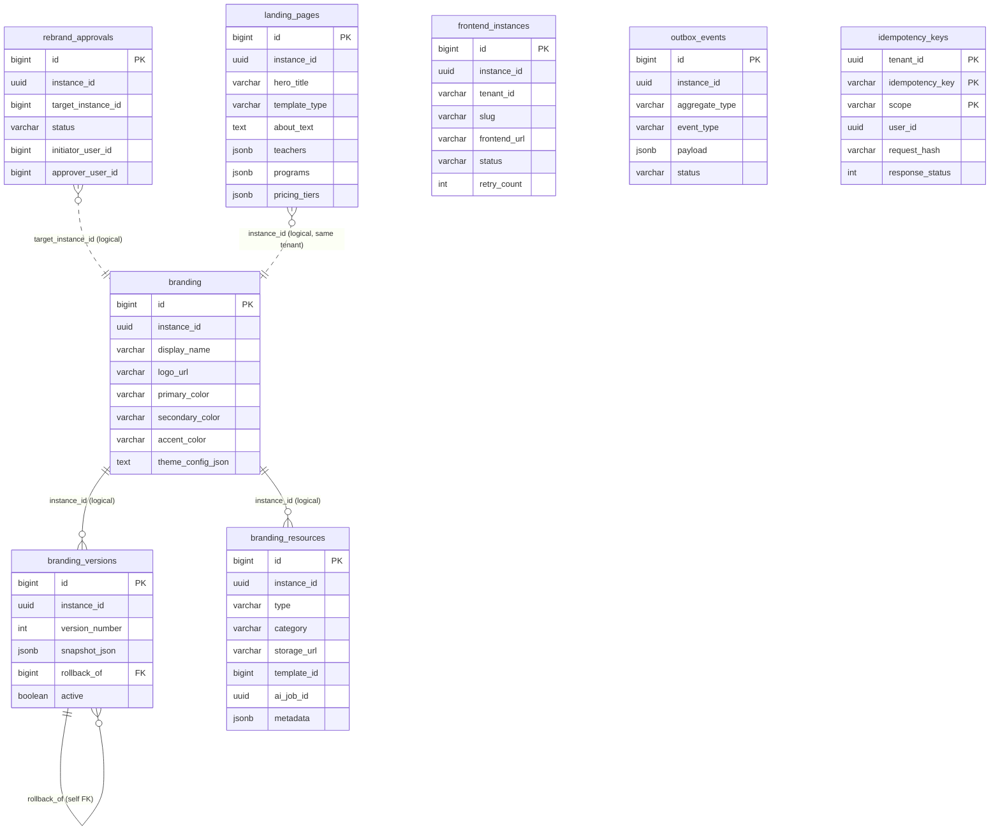

# Cluster Branding / Marketing / Infra (KiteClass)

> **TL;DR** — Cluster này gồm **8 bảng** tạo bởi migration V31..V77 cộng với 1 bảng shared cross-domain:
> - **Branding identity**: `branding` (V40 — display name / color / theme JSON), `branding_resources` (V32 — pipeline asset 3 category STATIC/TEMPLATE/FULL_AI), `branding_versions` (V43 — version snapshot + manual rollback).
> - **Tenant provisioning**: `frontend_instances` (V31 — vòng đời provision FE per tenant: NOT_STARTED→INITIALIZING→GENERATING→DEPLOYED→REGENERATING→FAILED), `rebrand_approvals` (V34 — gate enterprise rebrand approval).
> - **Marketing landing**: `landing_pages` (V75/V76/V77 — per-tenant landing page với hero/about/teachers/programs/pricing/testimonials/faqs/stats + template_type personal|organization).
> - **Infrastructure ngang**: `outbox_events` (V33 — Transactional Outbox cho at-least-once event publish), `idempotency_keys` (V66 — shared cross-domain POST dedupe scope SIGNUP/ENROLLMENT/BETA_REQUEST/PAYMENT).
> - **RLS** (V58 → V59 hardened): bật trên 6/8 bảng (`branding`, `branding_resources`, `branding_versions`, `frontend_instances`, `outbox_events`, `rebrand_approvals`). **CHƯA** bật trên `landing_pages` (V75, post-V58) và `idempotency_keys` (V66, post-V58) — xem [§ anomalies](#-ghi-chú-schema-anomalies).
> - **Đơn vị tiền**: cluster này KHÔNG quản tiền — không có cột amount.
> - **Drift nặng**: entity `Lead` + `ContactMessage` (module marketing) khai báo `@Table("leads")` / `@Table("contact_messages")` nhưng **KHÔNG có migration** nào tạo — query qua entity sẽ lỗi cột-không-tồn-tại. Xem A1.

---

## ERD

> Ghi chú quan hệ: tất cả "quan hệ" trong cluster này đều là **tham chiếu logic qua `instance_id`** — KHÔNG có FK constraint giữa branding ↔ branding_resources ↔ branding_versions ↔ landing_pages (cùng tenant nhưng không bind nhau). FK thật chỉ có 1: `branding_versions.rollback_of → branding_versions(id)` (self-reference). `rebrand_approvals.target_instance_id BIGINT` là logical pointer tới bảng `instances` của KiteHub (cross-service, không khả thi đặt FK constraint trong DB kiteclass).

---

## `branding`

**Mục đích.** Bản ghi nhận diện thương hiệu chính của tenant (1 dòng / tenant): display name, logo, favicon, 3 màu chủ đạo, thông tin liên hệ, link mạng xã hội, tagline, và (V25) JSON theme config AI-generated. Bảng này nguyên thuỷ provision bởi service `kitehub-branding`; V40 thêm `CREATE TABLE IF NOT EXISTS` để fresh-deploy từ DB rỗng cũng có bảng (GAP-065). Map từ entity `Branding` ở `kiteclass-core/module/settings/entity/Branding.java`.

| Cột | Kiểu | Null | Default | Khóa/Index | Ý nghĩa |
|---|---|---|---|---|---|
| `id` | BIGSERIAL | NO | seq | PK | Khóa chính |
| `instance_id` | UUID | NO | — | `idx_branding_instance_id` | Tenant ID (multi-tenant isolation) |
| `logo_url` | VARCHAR(500) | YES | — | — | URL logo trường |
| `favicon_url` | VARCHAR(500) | YES | — | — | URL favicon |
| `display_name` | VARCHAR(200) | NO | — | — | Tên hiển thị (vd "Trường THCS Trần Hưng Đạo") |
| `tagline` | VARCHAR(500) | YES | — | — | Slogan / câu giới thiệu ngắn |
| `primary_color` | VARCHAR(7) | NO | `'#3B82F6'` | — | Màu chủ đạo (hex `#RRGGBB`); default xanh KiteClass |
| `secondary_color` | VARCHAR(7) | NO | `'#8B5CF6'` | — | Màu phụ |
| `accent_color` | VARCHAR(7) | NO | `'#10B981'` | — | Màu nhấn |
| `theme_config_json` | TEXT | YES | — | — | JSON full theme AI-generated `{ colors, typography, spacing, layout }`. Thêm bởi `V25` (idempotent DO-block do `branding` có thể đã tồn tại từ kitehub-branding) |
| `contact_email` | VARCHAR(255) | YES | — | — | Email liên hệ public |
| `contact_phone` | VARCHAR(20) | YES | — | — | SĐT liên hệ public |
| `address` | TEXT | YES | — | — | Địa chỉ vật lý |
| `facebook_url` | VARCHAR(500) | YES | — | — | Link Facebook |
| `zalo_url` | VARCHAR(500) | YES | — | — | Link Zalo OA |
| `website_url` | VARCHAR(500) | YES | — | — | Website chính thức |
| `created_at` | TIMESTAMP | NO | `CURRENT_TIMESTAMP` | — | Audit — tạo. ⚠️ `TIMESTAMP` không TZ |
| `updated_at` | TIMESTAMP | NO | `CURRENT_TIMESTAMP` | — | Audit — cập nhật |
| `created_by` | BIGINT → **UUID** | YES | — | — | Actor tạo. V40 BIGINT; **V73 convert → UUID** |
| `updated_by` | BIGINT → **UUID** | YES | — | — | Actor cập nhật. V40 BIGINT; **V73 convert → UUID** |
| `deleted` | BOOLEAN | NO | `FALSE` | `idx_branding_deleted` | Soft-delete |
| `version` | BIGINT | NO | `0` | — | Optimistic lock — DEFAULT 0 ngay từ V40 |

**Constraints.** Không có UNIQUE riêng (nhưng business expectation = 1 dòng / tenant, enforce ở service level).

**Quan hệ FK.** Out: none. In: none. Logical pair với `branding_versions` (snapshot history) và `landing_pages` (cùng tenant) qua `instance_id`.

**RLS + ghi chú.** Tenant-scoped ✅. RLS V58 + V59 (admin-bypass `app.is_platform_admin` + NULL force-fail). Cross-service note: bảng này tồn tại trong cả KiteHub branding service (provision lifecycle) và kiteclass-core (read-side) — V40 IF NOT EXISTS làm idempotent.

---

## `branding_resources`

**Mục đích.** Pipeline asset branding theo category (`STATIC` = upload trực tiếp / `TEMPLATE` = derive từ template_id / `FULL_AI` = output AI job). Mỗi resource thuộc 1 trong 7 type: `LOGO, FAVICON, BANNER, HERO, COURSE_THUMBNAIL, SOCIAL_COVER, EMAIL_HEADER`. Tạo ở `V32` (GAP-007, ADR-005); composite index hot path thêm ở `V45` (GAP-129 — performance fix cho multi-tenancy leak trong getByInstanceId).

| Cột | Kiểu | Null | Default | Khóa/Index | Ý nghĩa |
|---|---|---|---|---|---|
| `id` | BIGSERIAL | NO | seq | PK | Khóa chính |
| `instance_id` | UUID | NO | — | `idx_branding_resource_type (instance_id, type)`; `idx_branding_resources_instance_deleted (instance_id, deleted)` (V45) | Tenant ID |
| `type` | VARCHAR(30) | NO | — | composite với instance_id; CHECK | Enum `ResourceType`: 7 giá trị (LOGO/FAVICON/BANNER/HERO/COURSE_THUMBNAIL/SOCIAL_COVER/EMAIL_HEADER) |
| `category` | VARCHAR(20) | NO | — | `idx_branding_resource_category`; CHECK | Enum `ResourceCategory`: STATIC/TEMPLATE/FULL_AI |
| `storage_url` | VARCHAR(500) | YES | — | — | URL MinIO/S3 cho asset binary |
| `template_id` | BIGINT | YES | — | — | FK logic tới template registry (không có FK constraint); bắt buộc khi `category=TEMPLATE` (CHECK) |
| `ai_job_id` | UUID | YES | — | — | FK logic tới AI generation job (không FK); bắt buộc khi `category=FULL_AI` (CHECK) |
| `metadata` | JSONB | YES | — | — | Tự do (vd model name, prompt seed, dimensions) |
| `created_at` | TIMESTAMP | NO | `CURRENT_TIMESTAMP` | — | Audit — tạo. ⚠️ `TIMESTAMP` không TZ |
| `updated_at` | TIMESTAMP | NO | `CURRENT_TIMESTAMP` | — | Audit — cập nhật |
| `created_by` | VARCHAR(100) → BIGINT → **UUID** | YES | — | — | Actor. V32 VARCHAR(100); **V46 chuyển BIGINT**; **V73 convert → UUID** |
| `updated_by` | VARCHAR(100) → BIGINT → **UUID** | YES | — | — | Actor. V32 VARCHAR(100); V46 → BIGINT; V73 → UUID |
| `version` | BIGINT | NO | `0` | — | Optimistic lock — DEFAULT 0 ngay từ V32 |
| `deleted` | BOOLEAN | NO | `FALSE` | `idx_branding_resource_deleted`; composite với instance_id (V45) | Soft-delete |

**Constraints.**
- `chk_branding_resource_type` — 7 type enum.
- `chk_branding_resource_category` — 3 category enum.
- `chk_branding_resource_template_fk` — `category=TEMPLATE` ⇒ `template_id NOT NULL`.
- `chk_branding_resource_ai_fk` — `category=FULL_AI` ⇒ `ai_job_id NOT NULL`.
- `chk_branding_resource_static_no_fk` — `category=STATIC` ⇒ cả `template_id` và `ai_job_id` đều NULL (ngăn ô nhiễm asset path).

**Quan hệ FK.** Out: `template_id` / `ai_job_id` là logical (không có FK). In: không.

**RLS + ghi chú.** Tenant-scoped ✅. RLS V58 + V59. Sự kiện perf: trước GAP-129 service `BrandingPackageServiceImpl.getByInstanceId()` gọi `findAll()` rồi filter in-memory → leak cross-tenant + full-table scan; V45 + `findByInstanceIdAndDeletedFalse` đã sửa.

---

## `branding_versions`

**Mục đích.** Lịch sử version snapshot của `branding` (GAP-033p, Wave 4): mỗi lần admin sửa branding → tạo 1 dòng snapshot (`snapshot_json` = full Branding state); cho phép manual rollback bằng cách flip `active=TRUE` của version cũ và lưu `rollback_of` pointer tới version đích. Tạo ở `V43`. Map từ entity `BrandingVersion` ở `kiteclass-core/module/settings/entity/`.

| Cột | Kiểu | Null | Default | Khóa/Index | Ý nghĩa |
|---|---|---|---|---|---|
| `id` | BIGSERIAL | NO | seq | PK | Khóa chính |
| `instance_id` | UUID | NO | — | `idx_branding_versions_instance`; UNIQUE thành phần | Tenant ID |
| `version_number` | INT | NO | — | UNIQUE `(instance_id, version_number)` | Số version monotonic per tenant (1, 2, 3...) |
| `snapshot_json` | JSONB | NO | — | — | Snapshot full Branding tại thời điểm này (logo + colors + contact + social + theme) |
| `rollback_of` | BIGINT | YES | — | FK → `branding_versions(id)` (self-FK) | Self-FK: nếu version này là kết quả rollback, trỏ tới version đã được rollback đến; NULL = forward edit (sửa mới) |
| `active` | BOOLEAN | NO | `FALSE` | partial UNIQUE `idx_branding_versions_active WHERE active = TRUE` | Đánh dấu version đang được apply trên `branding` table; **chính xác 1 version active per tenant** (enforce bằng partial unique) |
| `created_at` | TIMESTAMP | NO | `NOW()` | — | Audit — tạo. ⚠️ TIMESTAMP không TZ |
| `updated_at` | TIMESTAMP | NO | `NOW()` | — | Audit — cập nhật |
| `created_by` | BIGINT → **UUID** | YES | — | — | Actor. V43 BIGINT; V73 → UUID |
| `updated_by` | BIGINT → **UUID** | YES | — | — | Actor. V43 BIGINT; V73 → UUID |
| `deleted` | BOOLEAN | NO | `FALSE` | — | Soft-delete |
| `version` | BIGINT | NO | `0` | — | Optimistic lock — DEFAULT 0 ngay từ V43 |

**Constraints.** `uk_version_per_instance UNIQUE(instance_id, version_number)`. Partial unique index `idx_branding_versions_active WHERE active=TRUE` enforce 1-active-per-tenant invariant.

**Quan hệ FK.** Out: `rollback_of → branding_versions(id)` (self-FK thật, tham chiếu nội bảng). In: không.

**RLS + ghi chú.** Tenant-scoped ✅. RLS V58 + V59. Auto-rollback + A/B testing được defer sang wave sau (V43 chỉ cover manual rollback).

---

## `rebrand_approvals`

**Mục đích.** Workflow approval gate cho tenant enterprise muốn rebrand (đổi display_name / domain / theme lớn) — chống race khi 2 admin cùng request rebrand + audit ai approve (GAP-070, ADR-004 state machine extension, Wave 3 Sub-PR 3.5). Tạo ở `V34`.

| Cột | Kiểu | Null | Default | Khóa/Index | Ý nghĩa |
|---|---|---|---|---|---|
| `id` | BIGSERIAL | NO | seq | PK | Khóa chính |
| `instance_id` | UUID | NO | — | — | Tenant ID (instance của approver) |
| `target_instance_id` | BIGINT | NO | — | `idx_rebrand_approval_target` | ID của tenant target (cross-service ref tới KiteHub `instances.id`). ⚠️ Kiểu BIGINT — KHÔNG khớp pattern UUID hiện hành (xem anomalies) |
| `status` | VARCHAR(16) | NO | `'PENDING'` | `idx_rebrand_approval_status`; CHECK | Enum: `PENDING, APPROVED, REJECTED, EXPIRED` |
| `initiator_user_id` | BIGINT | NO | — | — | User yêu cầu rebrand. ⚠️ Kiểu BIGINT, V73 KHÔNG convert (xem A4) |
| `approver_user_id` | BIGINT | YES | — | — | User approve (NULL nếu chưa quyết). ⚠️ BIGINT, V73 không convert |
| `reason` | VARCHAR(500) | YES | — | — | Lý do yêu cầu rebrand |
| `rejection_reason` | VARCHAR(500) | YES | — | — | Lý do từ chối (khi status=REJECTED) |
| `requested_at` | TIMESTAMP | NO | `CURRENT_TIMESTAMP` | — | Thời điểm submit |
| `approved_at` | TIMESTAMP | YES | — | — | Thời điểm approve |
| `rejected_at` | TIMESTAMP | YES | — | — | Thời điểm reject |
| `expires_at` | TIMESTAMP | NO | — | `idx_rebrand_approval_expires WHERE status='PENDING'` (partial) | Hết hạn auto-expire (background sweeper flip status=EXPIRED) |
| `created_at` | TIMESTAMP | NO | `CURRENT_TIMESTAMP` | — | Audit |
| `updated_at` | TIMESTAMP | NO | `CURRENT_TIMESTAMP` | — | Audit |
| `created_by` | VARCHAR(100) → BIGINT → **UUID** | YES | — | — | Actor. V34 VARCHAR(100); V46 → BIGINT; V73 → UUID |
| `updated_by` | VARCHAR(100) → BIGINT → **UUID** | YES | — | — | Actor. V34 VARCHAR(100); V46 → BIGINT; V73 → UUID |
| `version` | BIGINT | NO | `0` | — | Optimistic lock — DEFAULT 0 ngay từ V34 |
| `deleted` | BOOLEAN | NO | `FALSE` | `idx_rebrand_approval_deleted` | Soft-delete |

**Constraints.** `chk_rebrand_approval_status` — 4 status enum.

**Quan hệ FK.** Out: tất cả `target_instance_id`, `initiator_user_id`, `approver_user_id` là logical pointer (KHÔNG FK — cross-service). In: không.

**RLS + ghi chú.** Tenant-scoped ✅. RLS V58 + V59.

---

## `frontend_instances`

**Mục đích.** Theo dõi vòng đời provision của per-tenant frontend app (deploy Next.js riêng cho mỗi trường) — state machine `NOT_STARTED → INITIALIZING → GENERATING → DEPLOYED → REGENERATING → FAILED` (GAP-009, ADR-004, Wave 3 Sub-PR 3.1). Tạo ở `V31`. Map từ entity `FrontendInstance` ở `kiteclass-core/module/instance/entity/`.

| Cột | Kiểu | Null | Default | Khóa/Index | Ý nghĩa |
|---|---|---|---|---|---|
| `id` | BIGSERIAL | NO | seq | PK | Khóa chính |
| `instance_id` | UUID | NO | — | UNIQUE thành phần | Tenant ID (chính chủ của FE) |
| `tenant_id` | VARCHAR(100) | NO | — | `idx_frontend_instance_tenant` | Tenant slug/string ID (cross-service human-readable, không phải UUID). ⚠️ Đặt tên trùng với cột tenant chuẩn nhưng kiểu khác — confusing (xem A6) |
| `slug` | VARCHAR(80) | NO | — | UNIQUE `idx_frontend_instance_slug ON (instance_id, slug) WHERE deleted=false` | Slug subdomain/path (vd "thcs-tran-hung-dao") |
| `frontend_url` | VARCHAR(300) | YES | — | — | URL FE sau deploy (vd `https://thcs-tran-hung-dao.kiteclass.vn`) |
| `status` | VARCHAR(20) | NO | `'NOT_STARTED'` | `idx_frontend_instance_status`; CHECK | State machine 6 trạng thái |
| `initializing_at` | TIMESTAMP | YES | — | — | Timestamp enter INITIALIZING |
| `generating_at` | TIMESTAMP | YES | — | — | Timestamp enter GENERATING |
| `deployed_at` | TIMESTAMP | YES | — | — | Timestamp enter DEPLOYED |
| `last_regenerate_at` | TIMESTAMP | YES | — | — | Lần regenerate gần nhất |
| `failed_at` | TIMESTAMP | YES | — | — | Timestamp enter FAILED |
| `retry_count` | INT | NO | `0` | CHECK `>=0` | Đếm số lần retry deploy fail |
| `failure_reason` | VARCHAR(1000) | YES | — | — | Tóm tắt lý do fail mới nhất |
| `branding_version` | INT | NO | `0` | CHECK `>=0` | Pointer tới `branding_versions.version_number` mà FE đang deploy (logical, không FK) |
| `created_at` | TIMESTAMP | NO | `CURRENT_TIMESTAMP` | — | Audit |
| `updated_at` | TIMESTAMP | NO | `CURRENT_TIMESTAMP` | — | Audit |
| `created_by` | VARCHAR(100) → BIGINT → **UUID** | YES | — | — | Actor. V31 VARCHAR(100); V46 → BIGINT; V73 → UUID |
| `updated_by` | VARCHAR(100) → BIGINT → **UUID** | YES | — | — | Actor. V31 VARCHAR(100); V46 → BIGINT; V73 → UUID |
| `version` | BIGINT | NO | `0` | — | Optimistic lock — DEFAULT 0 ngay từ V31 |
| `deleted` | BOOLEAN | NO | `FALSE` | `idx_frontend_instance_deleted`; dùng trong partial UNIQUE | Soft-delete |

**Constraints.** `chk_frontend_instance_status` (6 status); `chk_frontend_instance_retry_count CHECK(retry_count>=0)`; `chk_frontend_instance_branding_version CHECK(branding_version>=0)`. Partial UNIQUE `(instance_id, slug) WHERE deleted=false` — 1 slug/tenant active.

**Quan hệ FK.** Out: `branding_version` là logical pointer (không FK). In: không.

**RLS + ghi chú.** Tenant-scoped ✅ qua `instance_id`. RLS V58 + V59. `tenant_id VARCHAR(100)` là cột phụ cross-service (xem A6 anomalies).

---

## `landing_pages`

**Mục đích.** Trang chủ public per-tenant với 7 section data-driven (Hero / About / Teachers / Programs / Pricing / Testimonials / FAQ / Stats). Mỗi tenant có 1 dòng (`getOrCreateDefault` invariant). Tạo ở `V75` (GAP-809 walk fix — entity ship trước migration, walk-trio 2026-05-29 surface HTTP 500 "relation public.landing_pages does not exist"); extend ở `V76` (+7 cột data-driven JSONB) và `V77` (`template_type` personal|organization). Map từ entity `LandingPage` ở `kiteclass-core/module/marketing/entity/`.

| Cột | Kiểu | Null | Default | Khóa/Index | Ý nghĩa |
|---|---|---|---|---|---|
| `id` | BIGSERIAL | NO | seq | PK | Khóa chính |
| `instance_id` | UUID | NO | — | UNIQUE `uk_landing_pages_instance ON (instance_id) WHERE deleted=false` | Tenant ID — 1 active landing / tenant |
| `hero_title` | VARCHAR(200) | NO | `'Welcome to Our Learning Center'` | — | Tiêu đề hero |
| `hero_subtitle` | VARCHAR(500) | YES | — | — | Phụ đề hero |
| `hero_image_url` | VARCHAR(500) | YES | — | — | URL ảnh hero |
| `teacher_bio` | TEXT | YES | — | — | Mô tả GV (cho `template_type=personal`) |
| `logo_url` | VARCHAR(500) | YES | — | — | URL logo (override logo của `branding` nếu set) |
| `tagline` | VARCHAR(200) | YES | — | — | Slogan |
| `primary_color` | VARCHAR(7) | YES | `'#3B82F6'` | — | Màu chủ đạo |
| `secondary_color` | VARCHAR(7) | YES | `'#8B5CF6'` | — | Màu phụ |
| `contact_email` | VARCHAR(255) | YES | — | — | Email liên hệ |
| `contact_phone` | VARCHAR(20) | YES | — | — | SĐT liên hệ |
| `address` | TEXT | YES | — | — | Địa chỉ |
| `facebook_url` | VARCHAR(255) | YES | — | — | Facebook |
| `youtube_url` | VARCHAR(255) | YES | — | — | YouTube |
| `instagram_url` | VARCHAR(255) | YES | — | — | Instagram |
| `about_text` | TEXT | YES | — | — | Section "Về chúng tôi" (V76) |
| `teachers` | JSONB | YES | — | — | Section "Giáo viên" — `List<Map<String,Object>>` qua `@JdbcTypeCode(SqlTypes.JSON)` (V76, GAP-220 pattern) |
| `programs` | JSONB | YES | — | — | Section "Chương trình" (V76) |
| `pricing_tiers` | JSONB | YES | — | — | Section "Bảng giá" (V76) |
| `testimonials` | JSONB | YES | — | — | Section "Phản hồi" (V76) |
| `faqs` | JSONB | YES | — | — | Section "FAQ" (V76) |
| `stats` | JSONB | YES | — | — | Section "Thống kê" (V76) |
| `template_type` | VARCHAR(20) | NO | `'organization'` | — | Enum business: `personal` (GV độc lập — 7 section nhân vật) / `organization` (trung tâm — 7 section nghiệp vụ). Thêm bởi V77 wave-thesis-4 |
| `created_at` | TIMESTAMPTZ | NO | `NOW()` | — | Audit — tạo. ✅ TIMESTAMPTZ |
| `updated_at` | TIMESTAMPTZ | YES | — | — | Audit — cập nhật |
| `created_by` | UUID | YES | — | — | Actor — kiểu UUID ngay từ V75 (post-V73 era) |
| `updated_by` | UUID | YES | — | — | Actor — UUID ngay từ V75 |
| `deleted` | BOOLEAN | NO | `FALSE` | dùng trong partial UNIQUE | Soft-delete |
| `version` | BIGINT | YES | — *(không SET DEFAULT)* | — | Optimistic lock. ⚠️ V75 KHÔNG set DEFAULT 0 (xem A3) |

**Constraints.** Không CHECK. Partial UNIQUE `(instance_id) WHERE deleted=false` — 1 active landing / tenant.

**Quan hệ FK.** Out: none (logical pair với `branding` qua `instance_id`). In: none.

**RLS + ghi chú.**
- Tenant-scoped qua `instance_id` (BaseEntity-style), nhưng **chỉ cô lập ở tầng code** (Hibernate `tenantFilter` + service layer). Bảng tạo ở V75 **sau** V58/V59 ⇒ **RLS DB-level CHƯA apply** (xem A2).
- Cross-tenant access có chủ đích: endpoint `GET /api/v1/tenants/{id}/landing` (public homepage) gọi `LandingPageServiceImpl.getOrCreateDefault(tenantId)` với explicit param — bỏ qua `tenantFilter` để render trang chủ tenant khác (anonymous visitor xem trường khác). Đây là use case **cố tình bypass tenant isolation** — DB RLS sẽ block nếu enable mà không thiết lập admin-bypass cho endpoint này.

---

## `outbox_events`

**Mục đích.** Triển khai Transactional Outbox Pattern cho at-least-once delivery sự kiện sang broker (RabbitMQ). Domain service ghi row nghiệp vụ + row outbox trong cùng transaction; poller background scan `status='PENDING' AND next_attempt_at <= NOW()` rồi publish + cập nhật `status='PUBLISHED'`. Tạo ở `V33` (GAP-009 deferred, ADR-007, Wave 3 Sub-PR 3.1). Map từ entity `OutboxEvent` ở `kiteclass-core/common/outbox/`.

| Cột | Kiểu | Null | Default | Khóa/Index | Ý nghĩa |
|---|---|---|---|---|---|
| `id` | BIGSERIAL | NO | seq | PK | Khóa chính |
| `instance_id` | UUID | NO | — | — | Tenant ID (cô lập sự kiện theo tenant) |
| `aggregate_type` | VARCHAR(100) | NO | — | `idx_outbox_aggregate (aggregate_type, aggregate_id)` | Loại entity gốc (vd `Invoice`, `Enrollment`, `Branding`) |
| `aggregate_id` | VARCHAR(100) | NO | — | composite với aggregate_type | ID entity gốc (string để support cả BIGINT lẫn UUID id) |
| `event_type` | VARCHAR(100) | NO | — | `idx_outbox_event_type` | Tên sự kiện business (vd `InvoiceCreated`, `BrandingUpdated`) |
| `payload` | JSONB | NO | — | — | Body sự kiện đầy đủ (consumer downstream deserialize) |
| `status` | VARCHAR(16) | NO | `'PENDING'` | partial `idx_outbox_pending`; CHECK | Enum: `PENDING, PUBLISHED, FAILED` |
| `retry_count` | INT | NO | `0` | CHECK `>=0` | Đếm retry publish |
| `last_error` | TEXT | YES | — | — | Lỗi publish gần nhất (cho diagnostic) |
| `created_at` | TIMESTAMP | NO | `CURRENT_TIMESTAMP` | — | Thời điểm ghi outbox row |
| `published_at` | TIMESTAMP | YES | — | — | Thời điểm publish thành công (NULL nếu chưa) |
| `next_attempt_at` | TIMESTAMP | NO | `CURRENT_TIMESTAMP` | partial `idx_outbox_pending ON next_attempt_at WHERE status='PENDING'` | Thời điểm poller được phép thử lại (backoff) |
| `updated_at` | TIMESTAMP | NO | `CURRENT_TIMESTAMP` | — | Audit — cập nhật |
| `created_by` | VARCHAR(100) → BIGINT → **UUID** | YES | — | — | Actor. V33 VARCHAR(100); V46 → BIGINT; V73 → UUID |
| `updated_by` | VARCHAR(100) → BIGINT → **UUID** | YES | — | — | Actor. V33 VARCHAR(100); V46 → BIGINT; V73 → UUID |
| `version` | BIGINT | NO | `0` | — | Optimistic lock — DEFAULT 0 ngay từ V33 |
| `deleted` | BOOLEAN | NO | `FALSE` | `idx_outbox_deleted` | Soft-delete (thường giữ row PUBLISHED để audit + GC sau N ngày qua sweeper) |

**Constraints.** `chk_outbox_status` — 3 status enum; `chk_outbox_retry_nonneg`.

**Quan hệ FK.** Out: none. In: none. `aggregate_id` chỉ là string pointer logical.

**RLS + ghi chú.** Tenant-scoped ✅. RLS V58 + V59. Partial index `idx_outbox_pending` quan trọng cho perf — poller scan chỉ `status='PENDING'` thay vì full table.

---

## `idempotency_keys`

**Mục đích.** Bảng shared cross-domain cho POST mutation dedupe (Wave beta-readiness-2 Bucket A, GAP-730). Caller gửi header `Idempotency-Key: <UUID>`; service `IdempotencyService` insert row trên first-write rồi cache `response_status` + `response_body`; replay với cùng key trong cùng scope → trả response cũ thay vì tạo entity mới. Generalize pattern từ `payment_idempotency_keys` (V61, parent payment) thành scope-aware bảng dùng chung cho 4 domain. Tạo ở `V66`.

> **Lưu ý phạm vi:** bảng này phục vụ nhiều cluster (Finance, Beta access, Signup, Enrollment) — không thuộc riêng cluster nào. Mô tả ở đây vì là một trong các "infra bảng ngang" đi cùng `outbox_events`.

| Cột | Kiểu | Null | Default | Khóa/Index | Ý nghĩa |
|---|---|---|---|---|---|
| `tenant_id` | UUID | NO | — | PK composite | Tenant ID (KHÔNG dùng `instance_id` như các bảng khác — đặt tên khác để nhấn mạnh shared scope) |
| `idempotency_key` | VARCHAR(255) | NO | — | PK composite | Giá trị header client gửi (UUID/ksuid/ulid) |
| `scope` | VARCHAR(32) | NO | — | PK composite | Enum: `SIGNUP, ENROLLMENT, BETA_REQUEST, PAYMENT` — cho phép cùng UUID dùng lại an toàn ở 2 scope khác nhau |
| `user_id` | UUID | YES | — | — | Caller identity (NULL cho flow anonymous như SIGNUP). ✅ UUID ngay từ V66 |
| `request_hash` | VARCHAR(64) | NO | — | — | SHA-256 của normalized request body — phát hiện client bug "reused key cho different request" |
| `response_status` | INT | NO | — | — | HTTP status first-write trả về (201 / 200 / 4xx) — replay trả lại nguyên |
| `response_body` | TEXT | YES | — | — | JSON response body cached — replay trả về cùng body |
| `created_at` | TIMESTAMPTZ | NO | `NOW()` | `idx_idempotency_keys_created_at` | Thời điểm ghi (cho sweeper GC sau N ngày). ✅ TIMESTAMPTZ |

**Constraints.** PK composite `(tenant_id, idempotency_key, scope)`. Không CHECK.

**Quan hệ FK.** Out: none (cross-domain shared). In: none.

**RLS + ghi chú.**
- Có cột `tenant_id` (NOT NULL) nhưng tạo ở `V66` **sau** V58/V59 ⇒ **RLS DB-level CHƯA apply**.
- Pattern khác BaseEntity (chỉ `created_at`, không có `updated_at`/`updated_by`/`deleted`/`version`/`created_by`) — không phải entity nghiệp vụ, chỉ là cache TTL.
- Bảng kế nhiệm hẹp song hành: `payment_idempotency_keys` (V61, chỉ parent payment) vẫn tồn tại trong cluster Finance — `payment_records` (V69, GAP-292b) dùng bảng `idempotency_keys` rộng này thay vì bảng V61 (xem cluster Finance §A1).

---

## Ghi chú schema (anomalies)

### A1 — Entity `Lead` + `ContactMessage` không có migration (drift NẶNG)

Entity JPA `Lead` (`@Table("leads")`) và `ContactMessage` (`@Table("contact_messages")`) ở `kiteclass-core/module/marketing/entity/` khai báo đầy đủ cột (`instance_id`, `email`, `name`, `phone`, `source`, `status`, `course_interest_id`, `message`, `registration_date`, `last_contacted_at`, `converted_at`, plus `BaseEntity` audit) + `tenantFilter`. **Không có migration nào trong V1..V77 tạo `leads` hay `contact_messages` table** (verified bằng `grep -E "CREATE TABLE (leads|contact_messages)"` trả về rỗng).

Hệ quả:
- Chạy module marketing trên DB chỉ migration (không `ddl-auto=update`) → query qua `LeadRepository` / `ContactMessageRepository` sẽ lỗi `relation "leads" does not exist` / `relation "contact_messages" does not exist`.
- Pattern tương tự GAP-809 đã sửa cho `landing_pages` (V75 walk fix) — `leads` + `contact_messages` chưa được sửa.
- Tiềm năng impact: lead capture form ở `landing_pages` (FE submit POST `/api/v1/.../leads`) sẽ 500. Cần migration backfill (theo template V75).

### A2 — RLS coverage gap (bảng tạo sau V58/V59)

V58 (enable RLS) + V59 (hardening admin-bypass + NULL force-fail) chạy 1 lần với danh sách bảng tĩnh. 6/8 bảng cluster này có RLS DB-level:

- ✅ Có RLS: `branding`, `branding_resources`, `branding_versions`, `frontend_instances`, `outbox_events`, `rebrand_approvals` (V58 + V59 enumerate).
- ❌ **CHƯA** có RLS DB-level:
  - `landing_pages` (V75, post-V58/V59) — có `instance_id` NOT NULL nhưng KHÔNG có policy `tenant_isolation`. Note đặc biệt: endpoint `GET /api/v1/tenants/{id}/landing` cố tình bypass tenant filter để render public homepage cross-tenant, nên enable RLS cần thiết kế admin-bypass tương đương V59 hoặc rewrite endpoint dùng connection admin-context.
  - `idempotency_keys` (V66, post-V58/V59) — có `tenant_id` NOT NULL nhưng KHÔNG có policy. Cô lập tenant chỉ qua PK composite `(tenant_id, key, scope)` + code-level.

Cần migration RLS bổ sung (DO-block re-run với danh sách mở rộng) — giống pattern hồi cluster Finance (cũng có 2 bảng V61/V69 không RLS).

### A3 — `version` thiếu DEFAULT 0 trên `landing_pages`

V75 tạo `landing_pages.version BIGINT` (nullable, không SET DEFAULT). Khác với 7 bảng còn lại trong cluster đều có `version BIGINT NOT NULL DEFAULT 0` ngay từ migration tạo (V31/V32/V33/V34/V40/V43/V66). V62/V63 (chuẩn hoá DEFAULT 0 cho 19 bảng cũ) KHÔNG chạy bảng V75. Raw INSERT vào `landing_pages` không bind `version` → NULL → JPA `@Version` NPE ở flush. Service hiện dùng `getOrCreateDefault` qua JPA (bind version=0 mặc định entity) nên rủi ro thực tế thấp; nhưng seed fixture / test raw SQL có thể vỡ. Cần migration `ALTER TABLE landing_pages ALTER COLUMN version SET DEFAULT 0` + backfill NULL→0.

### A4 — Actor column kiểu BIGINT bị V73 sweep BỎ SÓT

V73 (GAP-795) dynamic loop chỉ convert `created_by`/`updated_by` (+ vài cột actor cụ thể `classes.teacher_id`, `classes.rescheduled_by_user_id`, `parent_invitations.invited_by_user_id`). Các cột actor user-id còn lại trong cluster vẫn BIGINT (V73 KHÔNG sweep):

- `rebrand_approvals.initiator_user_id` BIGINT NOT NULL.
- `rebrand_approvals.approver_user_id` BIGINT (nullable).
- `rebrand_approvals.target_instance_id` BIGINT NOT NULL (semantically "target tenant instance id" cross-service tới KiteHub).

Vì X-User-Id JWT bây giờ là UUID (per V73 RCA), 2 cột `*_user_id` này KHÔNG nhận được user-id thật (parse fail / cast lỗi). Cùng lớp drift với bug V73 đã fix nhưng chưa quét hết.

### A5 — TIMESTAMP vs TIMESTAMPTZ không nhất quán

- **TIMESTAMPTZ** (timezone-aware): `landing_pages` (created_at/updated_at — V75 mới), `idempotency_keys` (created_at — V66).
- **TIMESTAMP** (timezone-naive): `branding` (V40), `branding_resources` (V32), `branding_versions` (V43), `rebrand_approvals` (V34), `frontend_instances` (V31), `outbox_events` (V33). Tất cả bảng cũ pre-V69 era.

⇒ Trộn 2 kiểu timestamp trong cùng cluster — risky khi compare audit trail qua múi giờ (BE chạy UTC, DB store local without TZ). Cluster Finance cũng có pattern này (đã ghi nhận ở `04-finance.md` §A8).

### A6 — `frontend_instances` có cả `instance_id UUID` lẫn `tenant_id VARCHAR(100)`

V31 tạo 2 cột định danh tenant khác kiểu:

- `instance_id UUID NOT NULL` — primary tenant identifier (khớp BaseEntity convention + RLS policy).
- `tenant_id VARCHAR(100) NOT NULL` — string slug/human-readable ID (cross-service ref tới KiteHub `instances.slug` hoặc deploy alias).

Confusion: 2 cột cùng "tenant" prefix nhưng đại diện 2 thứ khác (UUID vs slug). Code dùng cẩn thận: RLS filter `instance_id`; FE deploy lookup `tenant_id`. Document hoá cần thiết — comment migration không nói rõ. Đề xuất rename `tenant_id` → `tenant_slug` ở migration tương lai để giảm nhầm lẫn.

### A7 — `branding` table provision cross-service (KiteHub vs kiteclass-core)

`branding` originally provision bởi service `kitehub-branding` (KiteHub side). V40 (GAP-065) thêm `CREATE TABLE IF NOT EXISTS` ở kiteclass-core để fresh-deploy DB rỗng cũng có bảng → idempotent với existing env. Hệ quả: cả 2 service đọc/ghi cùng bảng `branding` (cross-service shared) — pattern hiếm trong dự án. Cần wiring cẩn thận về invariant ai own write (race nếu cả 2 ghi). Hiện tại kiteclass-core chỉ read (branding render); KiteHub branding service own write (admin AI generate theme). Nếu thay đổi ownership, cần dock-block hoá rule ở `documents/02-architecture/multi-tenant-architecture.md`.

### A8 — `branding_versions.active` partial UNIQUE — pattern tốt nhưng cần discipline service

`idx_branding_versions_active ON (instance_id) WHERE active=TRUE` enforce 1-active-per-tenant ở DB level. Pattern đúng (DB-side invariant > service-side check), nhưng yêu cầu service:
- Trước khi `INSERT ... active=TRUE` cho version mới → phải `UPDATE ... SET active=FALSE WHERE instance_id=... AND active=TRUE` trong cùng transaction.
- Otherwise UNIQUE violation → rollback transaction → user nhận lỗi 500.

Code `BrandingVersionServiceImpl.rollback()` / `BrandingVersionServiceImpl.applyForward()` phải audit pattern này. Nếu CI mockito test chỉ verify entity save mà không verify pre-update active=FALSE → bug invisible.

### A9 — `outbox_events.deleted` soft-delete vs sweeper hard-delete

V33 outbox row có cột `deleted BOOLEAN DEFAULT FALSE` (BaseEntity audit). Service tổng quát:
- Poller publish → `UPDATE status='PUBLISHED'`, KHÔNG xoá row (audit trail giữ N ngày).
- Sweeper (cron) GC row `status='PUBLISHED' AND published_at < NOW() - INTERVAL '30 days'` — câu hỏi: dùng `UPDATE deleted=TRUE` (soft) hay `DELETE` (hard)?

Không có spec rõ trong V33 comment. Risk: nếu sweeper soft-delete, bảng outbox phình mãi mà partial index `idx_outbox_pending WHERE status='PENDING'` không cover row PUBLISHED+deleted=TRUE → cần migration thêm partial index `... WHERE deleted=FALSE` hoặc switch hard-delete. Audit code `OutboxEventSweeper` để xác nhận.

### A10 — `idempotency_keys` không có `expires_at` / TTL — sweeper-only GC

V66 tạo `idempotency_keys` KHÔNG có cột `expires_at` (khác `payment_idempotency_keys` V61 mặc định 24h INTERVAL). Implication: row tồn tại vô thời hạn ở DB cho tới khi background sweeper xoá manually. Cần xác nhận:
- Sweeper hiện hữu (cron / scheduled service)?
- TTL policy per scope (SIGNUP có thể 7 ngày, PAYMENT có thể 24h theo VietQR partner-bank)?

Nếu sweeper chưa wire → bảng phình theo throughput POST trên cả 4 domain. Theo dõi qua metric `idempotency_keys` row count.

---

## Liên kết

- [README cluster database KiteClass](../README.md)
- [Bản đồ kiến trúc database tổng thể](../../database-architecture-map.md)
- Cluster Finance §A1 / §A10 — cross-reference về 2 bảng idempotency (`payment_idempotency_keys` V61 vs `idempotency_keys` V66).
