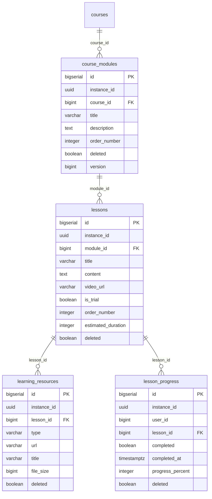

# KiteClass DB Schema — Cụm LMS / Nội dung học tập

> **TL;DR** — Cụm 4 bảng LMS (Learning Management System) của `kiteclass-core` — nội dung học tập có cấu trúc phân cấp **Course > Module > Lesson**, kèm tài nguyên đính kèm và theo dõi tiến độ học sinh. `course_modules` nhóm bài học trong 1 khóa; `lessons` là đơn vị nội dung (text/video) có cờ `is_trial` cho guest preview (BR-LMS-001); `learning_resources` lưu file đính kèm theo bài học; `lesson_progress` theo dõi tiến độ per-(user, lesson). Toàn bộ 4 bảng tạo ở migration **V79** (`V79__entity_schema_sync.sql` dòng ~445-527) — born sau V73 nên `created_by`/`updated_by` đã là UUID ngay từ đầu (không qua sweep BIGINT→UUID như các cụm cũ).
>
> ✅ **RLS (anomaly A):** cả 4 bảng có `instance_id NOT NULL` + **phòng thủ 2 lớp đầy đủ**: (1) Hibernate `@Filter("tenantFilter")` (kế thừa `BaseEntity`) ở tầng ORM + (2) **RLS DB-level ĐÃ bật** — `ENABLE`+`FORCE ROW LEVEL SECURITY` + policy `tenant_isolation` áp qua khối `DO $$` cuối **V79** (dòng 577-613, loop mảng bảng gồm cả 4 bảng cụm này). Policy theo pattern hardened V59 (admin-bypass `app.is_platform_admin` + NULL force-fail `NULLIF(...)`). Xem anomaly A bên dưới. **GAP-1121** = regression-guard IT (test profile dùng `ddl-auto=create-drop` nên RLS của V79 không chạy trong test → bổ sung Testcontainers IT verify isolation).
>
> Backend LMS đầy đủ: 4 entity (`module/lms/entity/*`), 2 controller (`LmsController` + `LessonProgressController`, 15 endpoint), service layer. **Frontend chưa có consumer** (FE LMS headless) — xem **GAP-1113**.

---

## ERD cụm LMS / Nội dung học tập

> **Lưu ý đọc ERD:** ERD vẽ theo **cột vật lý hiện có trong migration V79** (chân lý DB). `user_id` trong `lesson_progress` là BIGINT (KHÔNG phải UUID — chủ ý theo entity design note "tracks userId not enrollmentId for future TRIAL_USER support") và KHÔNG có FK (cross-service tới user ở gateway). `completed_at` là TIMESTAMPTZ ở DB nhưng entity map `LocalDateTime` (anomaly B). FK out cross-cluster: `course_modules.course_id → courses(id)` (cụm 01 Cấu trúc học vụ).

---

## `course_modules`

### Mục đích
Tier 2 trong phân cấp **Course > Module > Lesson** — nhóm logic các bài học trong 1 khóa (`courses`). Mỗi module thuộc đúng 1 course (BR-LMS-003). Đây là bảng config nhỏ (vài chục dòng/khóa).

### Bảng cột đầy đủ

| Cột | Kiểu | Null | Default | Khóa/Index | Ý nghĩa |
|---|---|---|---|---|---|
| `id` | BIGSERIAL | NO | auto | PK | Khóa chính tự tăng |
| `instance_id` | UUID | NO | — | `idx_course_modules_instance_id`, RLS (DB+ORM) | Tenant ID (multi-tenant isolation) |
| `course_id` | BIGINT | NO | — | FK→`courses(id)`, `idx_course_modules_course_id`, UK | Khóa học chứa module này |
| `title` | VARCHAR(200) | NO | — | — | Tiêu đề module (BR-LMS-005 — required, ≤200 ký tự) |
| `description` | TEXT | YES | — | — | Mô tả module (markdown, BR-LMS-005 — optional, ≤5000 ký tự) |
| `order_number` | INTEGER | NO | — | UK | Thứ tự hiển thị trong khóa (BR-LMS-004 — unique trong course, min 1) |
| `created_at` | TIMESTAMPTZ | NO | `CURRENT_TIMESTAMP` | — | Audit tạo |
| `updated_at` | TIMESTAMPTZ | YES | — | — | Audit cập nhật (nullable) |
| `created_by` | UUID | YES | — | — | Actor UUID tạo dòng (born UUID tại V79 — không qua BIGINT→UUID sweep V73) |
| `updated_by` | UUID | YES | — | — | Actor UUID cập nhật |
| `deleted` | BOOLEAN | NO | `FALSE` | — | Cờ soft-delete (kế thừa `BaseEntity`) |
| `version` | BIGINT | YES | `0` | — | Optimistic lock (`@Version`) |

### Quan hệ
- **FK out:** `course_id → courses(id)` (cross-cluster: `courses` thuộc cụm 01 Cấu trúc học vụ).
- **FK in:** `lessons.module_id → course_modules(id)`.
- **Cardinality:** 1 course → N modules; 1 module → N lessons.

### RLS + ghi chú
- **Tenant-scoped:** ✅ `instance_id` UUID NOT NULL + 2 lớp: Hibernate `@Filter("tenantFilter")` (ORM) + **RLS DB-level đã bật** (V79 DO-block 577-613 áp `ENABLE`+`FORCE`+policy `tenant_isolation` hardened V59). Xem anomaly A.
- **Soft-delete:** ✅ `deleted` (kế thừa `BaseEntity`, default FALSE).
- **JSONB:** không.
- **Unique:** `uk_course_modules_course_order UNIQUE (course_id, order_number, instance_id)` — 1 thứ tự duy nhất/khóa/tenant (BR-LMS-004).
- **CHECK:** không (min order_number=1 enforce ở service layer, không CHECK DB).
- **Index hot-path:** `idx_course_modules_course_id`, `idx_course_modules_instance_id`.
- **Service rule:** BR-LMS-006 — chỉ course owner (teacher, `X-Teacher-Id`) CRUD module; BR-LMS-007 — không xóa module còn lessons.

---

## `lessons`

### Mục đích
Tier 3 (đáy) trong phân cấp Course > Module > Lesson — đơn vị nội dung học tập (text/video) trong 1 module. Cờ `is_trial` quyết định guest có xem được không: trial → guest xem free (BR-LMS-001); paid → chỉ học sinh có enrollment active (BR-LMS-002).

### Bảng cột đầy đủ

| Cột | Kiểu | Null | Default | Khóa/Index | Ý nghĩa |
|---|---|---|---|---|---|
| `id` | BIGSERIAL | NO | auto | PK | Khóa chính |
| `instance_id` | UUID | NO | — | `idx_lessons_instance_id`, RLS (DB+ORM) | Tenant ID |
| `module_id` | BIGINT | NO | — | FK→`course_modules(id)`, `idx_lessons_module_id`, UK | Module chứa bài học |
| `title` | VARCHAR(200) | NO | — | — | Tiêu đề bài học (BR-LMS-009 — required, ≤200) |
| `content` | TEXT | YES | — | — | Nội dung text (markdown, BR-LMS-009 — optional, ≤10000) |
| `video_url` | VARCHAR(500) | YES | — | — | URL video (YouTube/Vimeo/S3 — Phase 1: text thuần, chưa tích hợp Media Service) |
| `is_trial` | BOOLEAN | NO | `FALSE` | `idx_lessons_is_trial` | Cờ guest-access (BR-LMS-001 — trial xem free, paid cần enrollment) |
| `order_number` | INTEGER | NO | — | UK | Thứ tự hiển thị trong module (BR-LMS-008 — unique trong module, min 1) |
| `estimated_duration` | INTEGER | YES | — | — | Thời lượng ước tính (phút, min 1) |
| `created_at` | TIMESTAMPTZ | NO | `CURRENT_TIMESTAMP` | — | Audit tạo |
| `updated_at` | TIMESTAMPTZ | YES | — | — | Audit cập nhật |
| `created_by` | UUID | YES | — | — | Actor UUID tạo (born UUID V79) |
| `updated_by` | UUID | YES | — | — | Actor UUID cập nhật |
| `deleted` | BOOLEAN | NO | `FALSE` | — | Cờ soft-delete |
| `version` | BIGINT | YES | `0` | — | Optimistic lock |

### Quan hệ
- **FK out:** `module_id → course_modules(id)`.
- **FK in:** `learning_resources.lesson_id → lessons(id)`, `lesson_progress.lesson_id → lessons(id)`.
- **Cardinality:** 1 module → N lessons; 1 lesson → N learning_resources; 1 lesson → N lesson_progress (per user).

### RLS + ghi chú
- **Tenant-scoped:** ✅ `instance_id` + 2 lớp: Hibernate `@Filter` (ORM) + **RLS DB-level đã bật** (V79 DO-block 577-613, policy hardened V59). Xem anomaly A.
- **Soft-delete:** ✅ `deleted`.
- **JSONB:** không.
- **Unique:** `uk_lessons_module_order UNIQUE (module_id, order_number, instance_id)` (BR-LMS-008).
- **CHECK:** không.
- **Index hot-path:** `idx_lessons_module_id`, `idx_lessons_is_trial` (filter guest-accessible trial lessons nhanh), `idx_lessons_instance_id`.
- **Service rule:** BR-LMS-010 — chỉ course owner CRUD; BR-LMS-011 — update là partial (chỉ field cung cấp được update, null bỏ qua).

---

## `learning_resources`

### Mục đích
Tài nguyên bổ trợ (PDF, slide, code sample, link...) đính kèm theo **bài học**. Phase 1: implementation cơ bản, chưa tích hợp File Storage Module — `url` lưu link ngoài hoặc S3 URL.

### Bảng cột đầy đủ

| Cột | Kiểu | Null | Default | Khóa/Index | Ý nghĩa |
|---|---|---|---|---|---|
| `id` | BIGSERIAL | NO | auto | PK | Khóa chính |
| `instance_id` | UUID | NO | — | `idx_learning_resources_instance_id`, RLS (DB+ORM) | Tenant ID |
| `lesson_id` | BIGINT | NO | — | FK→`lessons(id)`, `idx_learning_resources_lesson_id` | Bài học chứa tài nguyên |
| `type` | VARCHAR(20) | NO | — | `idx_learning_resources_type` | Loại: `VIDEO`/`PDF`/`SLIDE`/`AUDIO`/`LINK`/`CODE`/`OTHER` (enum `ResourceType`, BR-LMS-012). **KHÔNG có CHECK constraint** — enum enforce ở entity `@Enumerated(STRING)`, DB nhận mọi chuỗi ≤20 ký tự (anomaly F) |
| `url` | VARCHAR(500) | NO | — | — | URL tài nguyên (BR-LMS-013/014 — required, ≤500) |
| `title` | VARCHAR(200) | NO | — | — | Tiêu đề tài nguyên (BR-LMS-013/014 — required, ≤200) |
| `file_size` | BIGINT | YES | — | — | Kích thước file (bytes, optional — null cho link ngoài, min 1) |
| `created_at` | TIMESTAMPTZ | NO | `CURRENT_TIMESTAMP` | — | Audit tạo |
| `updated_at` | TIMESTAMPTZ | YES | — | — | Audit cập nhật |
| `created_by` | UUID | YES | — | — | Actor UUID tạo (born UUID V79) |
| `updated_by` | UUID | YES | — | — | Actor UUID cập nhật |
| `deleted` | BOOLEAN | NO | `FALSE` | — | Cờ soft-delete |
| `version` | BIGINT | YES | `0` | — | Optimistic lock |

### Quan hệ
- **FK out:** `lesson_id → lessons(id)`.
- **FK in:** không có.
- **Cardinality:** 1 lesson → N learning_resources.

### RLS + ghi chú
- **Tenant-scoped:** ✅ `instance_id` + 2 lớp: Hibernate `@Filter` (ORM) + **RLS DB-level đã bật** (V79 DO-block 577-613, policy hardened V59). Xem anomaly A.
- **Soft-delete:** ✅ `deleted`.
- **JSONB:** không.
- **Unique:** **KHÔNG có UK** (khác 3 bảng còn lại của cụm) — cho phép nhiều tài nguyên/bài học (chủ ý), nhưng cũng không có dedup guard trên `(lesson_id, url)` → có thể trùng dòng tài nguyên (anomaly D).
- **CHECK:** không (`type` enum chỉ enforce ở entity, không CHECK DB — anomaly F).
- **Index hot-path:** `idx_learning_resources_lesson_id`, `idx_learning_resources_type`, `idx_learning_resources_instance_id`.
- **Service rule:** BR-LMS-015 — chỉ course owner add/delete tài nguyên.

---

## `lesson_progress`

### Mục đích
Theo dõi tiến độ học sinh qua từng bài học. 1 dòng = tiến độ của 1 user trong 1 lesson (BR-LMS-009 1-record-per-user-per-lesson). Hoàn thành bài học là idempotent (BR-LMS-016) và publish `LessonCompletedEvent` cho downstream (gamification, notification — BR-LMS-017).

### Bảng cột đầy đủ

| Cột | Kiểu | Null | Default | Khóa/Index | Ý nghĩa |
|---|---|---|---|---|---|
| `id` | BIGSERIAL | NO | auto | PK | Khóa chính |
| `instance_id` | UUID | NO | — | `idx_lesson_progress_instance_id`, RLS (DB+ORM) | Tenant ID |
| `user_id` | BIGINT | NO | — | `idx_lesson_progress_user_id`, UK | User học sinh — **BIGINT, KHÔNG FK** (cross-service tới user ở gateway). Design note entity: "tracks userId not enrollmentId for future TRIAL_USER support". Lệch kiểu vs `created_by` UUID (anomaly C) |
| `lesson_id` | BIGINT | NO | — | FK→`lessons(id)`, `idx_lesson_progress_lesson_id`, UK | Bài học đang theo dõi |
| `completed` | BOOLEAN | NO | `FALSE` | `idx_lesson_progress_completed` | Cờ hoàn thành |
| `completed_at` | TIMESTAMPTZ | YES | — | — | Thời điểm hoàn thành (null nếu chưa). **Entity map `LocalDateTime`** (naive, không tz) trong khi cột là TIMESTAMPTZ (anomaly B) |
| `progress_percent` | INTEGER | NO | `0` | — | Phần trăm tiến độ (0=chưa bắt đầu, 100=hoàn thành; Phase 1 nhị phân 0/100, future track video watching) |
| `created_at` | TIMESTAMPTZ | NO | `CURRENT_TIMESTAMP` | — | Audit tạo |
| `updated_at` | TIMESTAMPTZ | YES | — | — | Audit cập nhật |
| `created_by` | UUID | YES | — | — | Actor UUID tạo (born UUID V79) |
| `updated_by` | UUID | YES | — | — | Actor UUID cập nhật |
| `deleted` | BOOLEAN | NO | `FALSE` | — | Cờ soft-delete |
| `version` | BIGINT | YES | `0` | — | Optimistic lock |

### Quan hệ
- **FK out:** `lesson_id → lessons(id)`. `user_id` KHÔNG có FK (chỉ index — user thực thể ở gateway, cross-service).
- **FK in:** không có.
- **Cardinality:** 1 lesson → N lesson_progress; 1 user × 1 lesson → 1 dòng (UK).

### RLS + ghi chú
- **Tenant-scoped:** ✅ `instance_id` + 2 lớp: Hibernate `@Filter` (ORM) + **RLS DB-level đã bật** (V79 DO-block 577-613, policy hardened V59). Xem anomaly A.
- **Soft-delete:** ✅ `deleted`.
- **JSONB:** không.
- **Unique:** `uk_lesson_progress_user_lesson UNIQUE (user_id, lesson_id, instance_id)` — 1 dòng tiến độ/user/lesson (BR-LMS-009).
- **CHECK:** không (progress_percent 0-100 không CHECK DB).
- **Index hot-path:** `idx_lesson_progress_user_id`, `idx_lesson_progress_lesson_id`, `idx_lesson_progress_completed`, `idx_lesson_progress_instance_id`.
- **Service rule:** BR-LMS-016 idempotent complete; BR-LMS-018 course progress = `(completedLessons/totalLessons)*100`; BR-LMS-019 paid lesson cần enrollment; BR-LMS-020 `getLessonProgress` trả `null` nếu chưa có record.

---

## Ghi chú schema (anomalies)

> Đây là **danh sách lệch chuẩn** giữa migration V79 (chân lý DB) và entity Java (`module/lms/entity/*.java`). Dev PHẢI nắm để tránh viết query sai hoặc tạo migration mâu thuẫn. Cụm LMS born tại V79 (sau V73 audit-column sweep) nên ít drift hơn các cụm cũ — RLS đầy đủ 2 lớp (anomaly A ✅); chỉ còn vài drift nhỏ về type/UK (anomaly B-E).

### A. ✅ RLS coverage — cả 4 bảng cụm LMS ĐÃ bật RLS DB-level (V79 DO-block 577-613)

V58/V59 dùng danh sách bảng tĩnh; 4 bảng LMS tạo SAU ở V79 nên không trong list đó — NHƯNG V79 **tự áp RLS** qua khối `DO $$` cuối file (dòng 577-613) loop mảng bảng gồm cả `course_modules`/`lessons`/`learning_resources`/`lesson_progress`:

| Bảng | Migration tạo | `instance_id`? | RLS DB-level? | Cô lập tenant |
|---|---|:---:|:---:|---|
| `course_modules` | V79 (RLS @577-613) | ✅ Có | ✅ ENABLE+FORCE+policy | 2 lớp: DB RLS + Hibernate `@Filter` |
| `lessons` | V79 (RLS @577-613) | ✅ Có | ✅ ENABLE+FORCE+policy | 2 lớp DB+ORM |
| `learning_resources` | V79 (RLS @577-613) | ✅ Có | ✅ ENABLE+FORCE+policy | 2 lớp DB+ORM |
| `lesson_progress` | V79 (RLS @577-613) | ✅ Có | ✅ ENABLE+FORCE+policy | 2 lớp DB+ORM |

Policy `tenant_isolation` theo **pattern hardened V59**: `USING/WITH CHECK (COALESCE(current_setting('app.is_platform_admin',true)::boolean,false) OR instance_id = NULLIF(current_setting('app.current_tenant_id',true),'')::uuid)` — admin-bypass + NULL force-fail (NULL tenant → 0 rows). Sweep toàn migration: chỉ V79 chạm 4 bảng, không migration sau gỡ RLS.

→ **Residual gap (GAP-1121):** test profile dùng `ddl-auto=create-drop` (Flyway OFF) nên RLS của V79 KHÔNG chạy trong test → backstop DB chưa được verify. GAP-1121 bổ sung Testcontainers IT (`LmsRlsIsolationIT`) áp policy + assert cross-tenant isolation + NULL force-fail. Mức P2 test-hygiene (không phải security gap — RLS đã hiện diện ở production).

### B. `lesson_progress.completed_at` — entity `LocalDateTime` vs cột `TIMESTAMPTZ`

Migration V79 khai báo `completed_at TIMESTAMPTZ` (timezone-aware) NHƯNG entity `LessonProgress.completedAt` map kiểu `java.time.LocalDateTime` (naive, không timezone). So sánh: `BaseEntity.createdAt`/`updatedAt` dùng `java.time.Instant` (tz-aware, đúng) — nhưng `completedAt` (cột nghiệp vụ) lệch sang `LocalDateTime`.

→ **Risk:** Hibernate bind `LocalDateTime` vào cột TIMESTAMPTZ với timezone của JVM default → off-by-timezone ở boundary nếu JVM TZ ≠ UTC. Nên harmonize entity sang `Instant` (hoặc `OffsetDateTime`) để khớp cột tz-aware. Cùng class (đảo chiều) với cluster 03 anomaly F (timestamp uniformity) — ở đây entity naive trong khi cột tz-aware, ngược với cluster 03 (cột naive cần convert TIMESTAMPTZ).

### C. `lesson_progress.user_id` BIGINT — lệch kiểu actor (BIGINT vs UUID)

`user_id` là BIGINT + KHÔNG có FK (cross-service tới user thực thể ở gateway). Trong khi `created_by`/`updated_by` của cùng bảng là UUID (X-User-Id JWT `sub` claim, GAP-795). Cùng ngữ nghĩa "ai" (user) nhưng `user_id` BIGINT còn `created_by` UUID.

→ **Lưu ý:** đây là chủ ý theo entity design note ("tracks userId not enrollmentId for future TRIAL_USER support") — nhưng gateway forward `X-User-Id` = UUID. Service layer phải map UUID→BIGINT hoặc resolve qua lookup. Cùng class với cluster 03 anomaly E (actor column BIGINT vs UUID) + cluster 01/02 actor sweep deferred. Nếu thống nhất actor=UUID toàn hệ thì `user_id` cũng cần sweep (defer phase 2 actor sweep).

### D. `learning_resources` thiếu unique constraint

3/4 bảng cụm có UK (`course_modules`, `lessons`, `lesson_progress`); riêng `learning_resources` KHÔNG có UK. Cho phép nhiều tài nguyên/bài học (chủ ý — 1 lesson có nhiều file) nhưng cũng không có dedup guard trên `(lesson_id, url, instance_id)` → có thể tạo trùng dòng tài nguyên cùng URL.

→ **Lưu ý:** minor — nếu cần chặn duplicate resource thì thêm partial UK `(lesson_id, url, instance_id) WHERE deleted=FALSE`. Hiện service layer không dedup.

### E. `learning_resources.type` enum chỉ enforce ở entity, không CHECK DB

`type VARCHAR(20)` không có CHECK constraint — 7 giá trị enum (`VIDEO`/`PDF`/`SLIDE`/`AUDIO`/`LINK`/`CODE`/`OTHER`) chỉ enforce qua entity `@Enumerated(EnumType.STRING)`. DB nhận mọi chuỗi ≤20 ký tự.

→ **Lưu ý:** raw INSERT bypass entity có thể ghi `type` không hợp lệ. Cùng pattern với 1 số bảng cluster 03 (enum không CHECK). Thêm `CHECK (type IN ('VIDEO','PDF','SLIDE','AUDIO','LINK','CODE','OTHER'))` nếu cần defense DB-level.

### F. ✅ POSITIVE — actor column born UUID (không cần V73 sweep)

Khác các cụm cũ (cluster 01/02/03 phải sweep `created_by`/`updated_by` BIGINT→UUID qua V73), cụm LMS tạo ở V79 (sau V73) nên `created_by`/`updated_by` **born UUID ngay từ đầu** — không lệch kiểu audit-column. Đây là điểm sạch của cụm (chỉ còn `lesson_progress.user_id` BIGINT là actor-nghiệp-vụ lệch, anomaly C).

---

## Liên kết

- [README cụm database KiteClass](../README.md)
- [Bản đồ kiến trúc database toàn dự án](../../database-architecture-map.md)
- Business rules LMS: [`documents/01-business/kiteclass/lms/rules.md`](../../../01-business/kiteclass/lms/rules.md) (BR-LMS-001..020)
- Cụm liên quan: [`01-academic-structure.md`](01-academic-structure.md) (`courses` — FK target), [`03-attendance-grading.md`](03-attendance-grading.md) (anomaly J RLS class + anomaly E/F actor/timestamp class)
- RLS regression-guard test: **GAP-1121** (Testcontainers IT — RLS đã có sẵn từ V79)
- FE LMS headless (defer): **GAP-1113**
