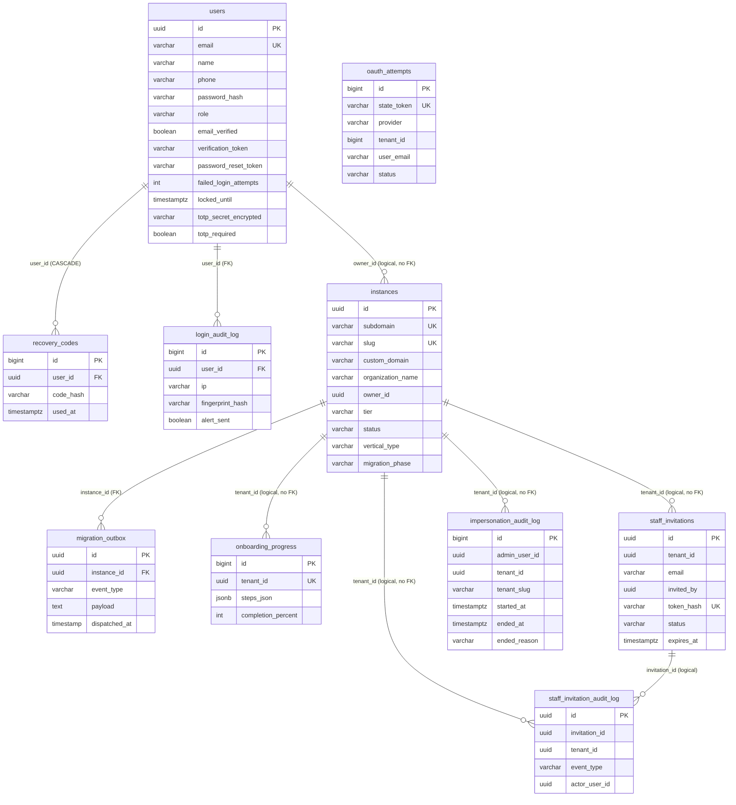

# Cluster Auth / User / Instance (KiteHub)

> **TL;DR** — Cluster này gồm **10 bảng** chia 3 nhóm con:
>
> - **Auth / User** (4): `users` (account control-plane KiteHub, OWNER + PLATFORM_ADMIN), `recovery_codes` (10 mã 1-shot / user cho TOTP 2FA), `oauth_attempts` (state_token idempotency cho Google/Microsoft SSO callback), `login_audit_log` (mỗi lần login thành công + fingerprint mới → email cảnh báo PLATFORM_ADMIN).
> - **Instance** (2): `instances` (1 tenant KiteClass = 1 row, lifecycle TRIAL → ACTIVE → SUSPENDED → DELETED → PURGED; chứa cả `subdomain` legacy V1 + `slug` normalize V40 + custom domain V12 + trial-to-paid migration state machine V19), `migration_outbox` (outbox 7 event type cho trial-to-paid flow).
> - **Onboarding / Staff per-tenant** (4): `onboarding_progress` (JSONB checklist Day-1 / tenant), `staff_invitations` (Owner mời Staff qua email tokenized), `staff_invitation_audit_log` (CREATED/SENT/RESENT/ACCEPTED/REVOKED/EXPIRED), `impersonation_audit_log` (admin "View as tenant" 30 giây).
>
> - **RLS** (V34 → V50 hardened): RLS bật trên 11 bảng tenant-scoped khác của subscription (`subscriptions`, `migration_outbox`, `email_logs`, …) NHƯNG **KHÔNG bật trên `instances`** (kh-subscription không có per-request TenantContext — xem [§ anomalies A6](#a6--rls-coverage-gap)). `staff_invitations`/`onboarding_progress` (V43-V45 tạo SAU V34) chỉ cô lập ở tầng code, RLS DB chưa apply.
> - **Multi-tenant key**: `instances.id` là tenant root (UUID PK). Các bảng "per-tenant" ở cluster này dùng `tenant_id UUID` (`onboarding_progress`, `staff_invitations`, `staff_invitation_audit_log`, `impersonation_audit_log`) — KHÔNG có FK constraint tới `instances(id)` (loose coupling, xem [§ A4](#a4--per-tenant-tables-không-có-fk-tới-instances)).
> - **Kiểu user id không nhất quán**: `users.id UUID` nhưng `oauth_attempts.tenant_id BIGINT` (drift — xem [§ A7](#a7--oauth_attempts-tenant_id-bigint-vs-instances-uuid)).
> - **Timestamp split**: nửa cluster dùng `TIMESTAMP` (không TZ — `users`, `instances` cũ V1, `onboarding_progress` `tenant_id`...), nửa dùng `TIMESTAMPTZ` (V35+ audit columns, `login_audit_log`, `staff_invitations`). Xem [§ A5](#a5--timestamp-vs-timestamptz-không-nhất-quán).

---

## ERD cluster

> Ghi chú quan hệ: chỉ `recovery_codes.user_id → users.id` (CASCADE) và `login_audit_log.user_id → users.id` và `migration_outbox.instance_id → instances.id` là **FK thật trong DB**. Các quan hệ `instances ↔ users(owner_id)`, `instances ↔ (onboarding_progress / staff_invitations / impersonation_audit_log).tenant_id` là **tham chiếu logic** (KHÔNG có FK constraint — chi tiết [§ A4](#a4--per-tenant-tables-không-có-fk-tới-instances)).

---

## `users`

**Mục đích.** Account chính của KiteHub control-plane: OWNER (chủ trung tâm KiteClass — tạo instance riêng) và PLATFORM_ADMIN (admin KiteHub, vận hành). Bảng nằm trong DB `kitehub` (KHÔNG phải DB của từng tenant KiteClass — nhân viên/giáo viên/học sinh nằm trong DB KiteClass). Tạo `V9`, bổ sung dần qua `V10` (email verification), `V35` (account lockout), `V37` (TOTP 2FA), `V46` (CHECK role + RBAC STAFF), `V47` (password reset), `V61` (✅ GAP-893: seed admin `ADMIN`→`PLATFORM_ADMIN` data migration + TOTP sync + CHECK reaffirm). Map từ entity `User` (`kitehub-platform`).

| Cột | Kiểu | Null | Default | Khóa/Index | Ý nghĩa |
|---|---|---|---|---|---|
| `id` | UUID | NO | — | PK | Khóa chính. App-managed (`@PrePersist` gọi `UUID.randomUUID()` nếu null) |
| `email` | VARCHAR(255) | NO | — | UNIQUE; `idx_users_email` | Email login (case-sensitive theo DDL; entity validation chuẩn hóa) |
| `name` | VARCHAR(100) | NO | — | — | Họ tên hiển thị |
| `phone` | VARCHAR(20) | YES | — | — | SĐT (VN format) |
| `password_hash` | VARCHAR(255) | NO | — | — | BCrypt hash (cost 12); seed admin V9 dùng `Admin@KiteHub123` |
| `role` | VARCHAR(20) | NO | `'OWNER'` | `idx_users_role`; ✅ **CHECK** `ck_users_role_v46` | Vai trò. ✅ Resolved (GAP-893, V61) — CHECK `IN ('OWNER','STAFF','PLATFORM_ADMIN','ADMIN')` thực ra đã tồn tại từ V46 (GAP-893 "no CHECK" claim STALE); V61 confirm + làm DATA migration seed `ADMIN`→`PLATFORM_ADMIN` + TOTP sync. Giá trị thực dùng: `OWNER`, `PLATFORM_ADMIN`, `STAFF`, `ADMIN` — xem [§ A2](#a2--role--resolved-check-tồn-tại-từ-v46--data-migration-v61) |
| `email_verified` | BOOLEAN | NO | `FALSE` | — | Đã verify email chưa (V10). DB chỉ provision instance khi `TRUE` |
| `verification_token` | VARCHAR(255) | YES | — | partial `idx_users_verification_token WHERE token IS NOT NULL` | Token email verify; single-use, clear sau confirm |
| `token_expires_at` | TIMESTAMP | YES | — | — | TTL verification_token. ⚠️ `TIMESTAMP` không TZ |
| `password_reset_token` | VARCHAR(255) | YES | — | partial `idx_users_password_reset_token` | Token reset password (V47, GAP-548). 1 giờ TTL mặc định |
| `password_reset_token_expires` | TIMESTAMP | YES | — | — | TTL reset_token. ⚠️ `TIMESTAMP` không TZ |
| `failed_login_attempts` | INTEGER | NO | `0` | — | Đếm lần login sai liên tiếp (V35, GAP-515 OWASP A07). Reset về 0 khi login OK |
| `last_failed_login_at` | TIMESTAMPTZ | YES | — | — | Lần login sai gần nhất |
| `locked_until` | TIMESTAMPTZ | YES | — | partial `idx_users_locked_until WHERE locked_until IS NOT NULL` | Khóa account tới thời điểm này (NULL = không khóa) |
| `lockout_count` | INTEGER | NO | `0` | — | Đếm số lần đạt lockout threshold — exponential backoff: 1st 15min / 2nd 1h / 3rd+ 24h |
| `totp_secret_encrypted` | VARCHAR(256) | YES | — | — | Base32 TOTP secret AES-encrypted (V37, GAP-516). Key: `kitehub.auth.totp.encryption-key` config (Phase 1.5+ KMS) |
| `totp_enrolled_at` | TIMESTAMPTZ | YES | — | — | Thời điểm hoàn thành enroll-confirm |
| `totp_required` | BOOLEAN | NO | `FALSE` | partial `idx_users_totp_pending WHERE totp_required=TRUE AND totp_enrolled_at IS NULL` | Bắt buộc enroll 2FA trước khi cấp access token. V37 seed `TRUE` cho `WHERE role='PLATFORM_ADMIN'` → MISS seed admin (role cũ `'ADMIN'`). ✅ Resolved (GAP-893, V61) — V61 migrate seed `ADMIN`→`PLATFORM_ADMIN` rồi `UPDATE totp_required=TRUE WHERE role='PLATFORM_ADMIN' AND totp_required=FALSE` (idempotent) → seed admin giờ buộc enroll 2FA. |
| `recovery_codes_hashes` | TEXT | YES | — | — | ⚠️ Cột reserved deprecated; recovery codes thực sự lưu ở bảng `recovery_codes` riêng. V37 ghi rõ "kept nullable; not consumed" |
| `created_at` | TIMESTAMP | NO | `NOW()` | — | Audit — tạo. ⚠️ `TIMESTAMP` không TZ |
| `updated_at` | TIMESTAMP | NO | `NOW()` | — | Audit — cập nhật. ⚠️ `TIMESTAMP` không TZ |

**Constraints**: `users_pkey (id)`, `users_email_key UNIQUE(email)`, ✅ `ck_users_role_v46 CHECK(role IN ('OWNER','STAFF','PLATFORM_ADMIN','ADMIN'))` (V46; V61 reaffirm + idempotent guard). Xem [§ A2](#a2--role--resolved-check-tồn-tại-từ-v46--data-migration-v61).

**Quan hệ FK**
- Out: không (root entity)
- In: `recovery_codes.user_id → users.id` (CASCADE), `login_audit_log.user_id → users.id` (FK). `instances.owner_id` trỏ logic tới đây (NO FK — xem [§ A4](#a4--per-tenant-tables-không-có-fk-tới-instances)).

**RLS + ghi chú**
- KHÔNG tenant-scoped (đây là control-plane account table — global). V34 + V50 KHÔNG enable RLS trên `users` (không có `instance_id`).
- Entity `User` KHÔNG extends `BaseEntity` (do `kitehub-platform` `BaseEntity` định nghĩa cho instance/JPA layer khác — User tự khai `@PrePersist` thiết lập `id`/`createdAt`/`updatedAt`).
- Seed V9: `admin@kitehub.com / Admin@KiteHub123` UUID `00000000-0000-0000-0000-000000000099`, role `ADMIN` (giá trị cũ). ✅ Resolved (GAP-893, V61, PARTIAL) — V61 migrate row seed này `ADMIN`→`PLATFORM_ADMIN` (scope strict tới UUID `...0099` để tránh đụng V46/Wave-81 OWNER-canonicalization cho tenant-owner rows) + sync `totp_required=TRUE`. ⏸️ **PARTIAL — tenant-owner rows DEFERRED Wave-81**: V61 KHÔNG touch các row `'ADMIN'`/`'PLATFORM_ADMIN'` khác (giữ nguyên cho quyết định V46/Wave-81 canonicalize sang `OWNER`).

---

## `recovery_codes`

**Mục đích.** 10 mã backup 1-shot / user dùng để bypass TOTP khi mất thiết bị (V37, GAP-516 Wave 72b Bucket A). Mỗi user 10 row khi enroll; consume 1 → set `used_at`. Regenerate → tất cả `used_at = NOW()` + insert 10 row mới trong cùng transaction.

| Cột | Kiểu | Null | Default | Khóa/Index | Ý nghĩa |
|---|---|---|---|---|---|
| `id` | BIGSERIAL | NO | seq | PK | Khóa chính |
| `user_id` | UUID | NO | — | FK → `users(id)` **ON DELETE CASCADE**; `idx_recovery_codes_user (user_id, used_at)` | User sở hữu mã |
| `code_hash` | VARCHAR(72) | NO | — | — | BCrypt hash của mã raw (60 ký tự + prefix `$2a/$2b`). Mã raw chỉ hiển thị 1 lần khi enroll |
| `used_at` | TIMESTAMPTZ | YES | — | dùng trong index | Thời điểm consume. NULL = chưa dùng |
| `created_at` | TIMESTAMPTZ | NO | `NOW()` | — | Audit — tạo |

**Constraints**: `recovery_codes_pkey (id)`, FK `user_id` CASCADE.

**Quan hệ FK**
- Out: `user_id → users(id)` (CASCADE). User xóa → tất cả recovery_codes xóa theo.
- In: không.

**RLS + ghi chú**
- KHÔNG tenant-scoped (đính trực tiếp user). V34/V50 không enable RLS.
- Entity `RecoveryCode` (nếu có) chưa được sample reading đề cập — ưu tiên access qua repo + service.

---

## `oauth_attempts`

**Mục đích.** State machine cho OAuth callback (Google + Microsoft + future Apple/GitHub SSO) — UNIQUE `state_token` chống replay khi identity provider 503 transient (V51, GAP-582 Wave 86 Bucket G). 5 P2 owner concurrent click accept invite qua OAuth → nếu thiếu UNIQUE, backend tạo duplicate user → cross-tenant orphan record. UNIQUE catch tại DB → controller dịch `DataIntegrityViolationException` → HTTP 409.

| Cột | Kiểu | Null | Default | Khóa/Index | Ý nghĩa |
|---|---|---|---|---|---|
| `id` | BIGSERIAL | NO | seq | PK | Khóa chính |
| `state_token` | VARCHAR(255) | NO | — | UNIQUE `uk_oauth_attempts_state_token` | OAuth 2.0 state param (CSRF + replay defense) |
| `provider` | VARCHAR(50) | NO | — | — | `google`, `microsoft`, `apple`, `github` (comment) — **KHÔNG có CHECK** |
| `tenant_id` | **BIGINT** | YES | — | — | ⚠️ Kiểu BIGINT trong khi `instances.id` là UUID — drift (xem [§ A7](#a7--oauth_attempts-tenant_id-bigint-vs-instances-uuid)) |
| `user_email` | VARCHAR(255) | YES | — | — | Email user (populate khi callback success) |
| `initiated_at` | TIMESTAMP | NO | `NOW()` | `idx_oauth_attempts_status_initiated` | Thời điểm initiated. ⚠️ `TIMESTAMP` không TZ |
| `completed_at` | TIMESTAMP | YES | — | — | Thời điểm hoàn tất. ⚠️ `TIMESTAMP` không TZ |
| `status` | VARCHAR(20) | NO | `'PENDING'` | `idx_oauth_attempts_status_initiated` | `PENDING` (initiated) / `SUCCEEDED` (completed_at set) / `FAILED` (error_code set). **KHÔNG có CHECK** |
| `error_code` | VARCHAR(50) | YES | — | — | Mã lỗi nếu FAILED |

**Constraints**: `uk_oauth_attempts_state_token UNIQUE(state_token)`.

**Quan hệ FK**
- Out: `tenant_id` tham chiếu logic tới `instances.id` (KHÔNG FK + drift kiểu BIGINT/UUID).
- In: không.

**RLS + ghi chú**
- Có `tenant_id` nhưng tạo ở V51 (sau V34/V50) ⇒ **RLS DB-level CHƯA apply**. Cô lập phụ thuộc code-level + UNIQUE scope.
- Index `idx_oauth_attempts_status_initiated (status, initiated_at)` phục vụ cleanup job sweep PENDING > 1h.

---

## `login_audit_log`

**Mục đích.** Audit mỗi lần login THÀNH CÔNG (V38, GAP-517 Wave 72b Bucket C, OWASP A07 §2.5). Mỗi row chứa `fingerprint_hash = SHA-256(ip + user_agent)`. Nếu fingerprint MỚI với `PLATFORM_ADMIN` → Spring `ApplicationEvent` trigger email cảnh báo transactional. Cooldown 24h thông qua `alert_sent_at` lookup. Retention 7 năm per `logs-format-standard.md` §4.

| Cột | Kiểu | Null | Default | Khóa/Index | Ý nghĩa |
|---|---|---|---|---|---|
| `id` | BIGSERIAL | NO | seq | PK | Khóa chính |
| `user_id` | UUID | NO | — | FK → `users(id)` (`fk_login_audit_log_user`); `idx_login_audit_user_time (user_id, login_at DESC)` | User đã login |
| `login_at` | TIMESTAMPTZ | NO | `NOW()` | dùng trong index | Thời điểm login thành công |
| `ip` | VARCHAR(45) | YES | — | — | Client IP (IPv4 hoặc IPv6 textual, max 45 ký tự). ⚠️ V38 ban đầu khai `INET`, V52 ALTER xuống VARCHAR(45) sau RCA 2026-05-16 — xem [§ A3](#a3--ip-inet--varchar45--fingerprint_hash-char--varchar64-postgres-binding-rca) |
| `user_agent` | VARCHAR(512) | YES | — | — | UA string từ header |
| `geo_country` | VARCHAR(8) | YES | — | — | Mã quốc gia (ISO 3166) — populate offline qua GeoIP |
| `fingerprint_hash` | VARCHAR(64) | YES | — | `idx_login_audit_user_fingerprint (user_id, fingerprint_hash)` | SHA-256 hex của `(ip + user_agent)`. ⚠️ V38 khai `CHAR(64)`, V42 ALTER xuống `VARCHAR(64)` để khớp entity `@Column(length=64)` |
| `alert_sent` | BOOLEAN | NO | `FALSE` | — | Đã gửi email cảnh báo fingerprint mới chưa |
| `alert_sent_at` | TIMESTAMPTZ | YES | — | — | Thời điểm gửi cảnh báo (cooldown 24h) |

**Constraints**: `fk_login_audit_log_user FK(user_id) → users(id)`.

**Quan hệ FK**
- Out: `user_id → users(id)` (N-1).
- In: không.

**RLS + ghi chú**
- KHÔNG tenant-scoped (đính user, audit trail platform-wide).
- 7 năm retention per `logs-format-standard.md` §4 (security/audit logs).
- Pattern fix V42 + V52 là 2 trường hợp cùng class anti-pattern "entity ↔ DDL type mismatch chỉ hiện trên Postgres không phải H2" — đã đẻ ra rule `.claude/rules/postgres-specific-type-testcontainers.md`.

---

## `instances`

**Mục đích.** Bảng tenant root — 1 row = 1 instance KiteClass = 1 trường/trung tâm. Sở hữu lifecycle TRIAL (14 ngày) → ACTIVE → SUSPENDED → DELETED → PURGED. Tạo ở `V1`, mở rộng qua hàng loạt migration: `V7` contact_email, `V12` custom domain, `V17` purge tracking, `V18` notification preferences, `V19` trial→paid migration state machine, `V24` vertical type CENTER vs K12_SCHOOL, `V40` slug normalize VN diacritics. Map từ entity `Instance extends BaseEntity` (`kitehub-platform`).

| Cột | Kiểu | Null | Default | Khóa/Index | Ý nghĩa |
|---|---|---|---|---|---|
| `id` | UUID | NO | — | PK | Khóa chính (tenant ID). App-managed |
| `subdomain` | VARCHAR(50) | NO | — | UNIQUE; `idx_instances_subdomain` | Subdomain `.kiteclass.com` (legacy V1, regex `^[a-z0-9-]+$` ở entity) |
| `custom_domain` | VARCHAR(255) | YES | — | partial `idx_instances_custom_domain WHERE custom_domain IS NOT NULL AND deleted=false` | Custom domain (PREMIUM/ENTERPRISE only) |
| `organization_name` | VARCHAR(200) | NO | — | — | Tên hiển thị (giữ diacritic + smart quotes nguyên gốc) |
| `owner_id` | UUID | NO | — | `idx_instances_owner` | CENTER_OWNER user UUID. ⚠️ **NO FK** tới `users(id)` (loose coupling cross-product) |
| `tier` | VARCHAR(20) | NO | — | `idx_instances_tier`; **NO CHECK** | Enum `PricingTier`: `FREE / BASIC / PREMIUM / ENTERPRISE` (xem [§ A2](#a2--role--resolved-check-tồn-tại-từ-v46--data-migration-v61) cho enum-vs-CHECK pattern) |
| `status` | VARCHAR(20) | NO | — | `idx_instances_status`, `idx_instances_status_updated_at WHERE status='DELETED'` | Enum `InstanceStatus`: `PENDING / TRIAL / ACTIVE / SUSPENDED / DELETED / PURGED`. **NO CHECK** |
| `database_url` | VARCHAR(500) | NO | — | — | DB connection URL của tenant (mỗi tenant 1 DB riêng) |
| `database_username` | VARCHAR(100) | NO | — | — | DB user của tenant |
| `database_password` | VARCHAR(255) | NO | — | — | Encrypted AES-256-GCM |
| `trial_started_at` | TIMESTAMP | YES | — | — | Bắt đầu trial. ⚠️ `TIMESTAMP` không TZ |
| `trial_expires_at` | TIMESTAMP | YES | — | — | Hết trial (14 ngày từ start) |
| `subscription_id` | UUID | YES | — | — | Tham chiếu logic tới `subscriptions(id)` (cluster 02) — **NO FK** |
| `subscription_expires_at` | TIMESTAMP | YES | — | — | Hết subscription paid |
| `contact_email` | VARCHAR(255) | YES | — | — | Email liên hệ chủ instance (V7) — dùng cho notification |
| `domain_verify_token` | VARCHAR(255) | YES | — | — | Token TXT record verify custom domain (V12), format `kitehub-verify={uuid}` |
| `domain_verified_at` | TIMESTAMP | YES | — | — | Thời điểm verify domain thành công |
| `domain_status` | VARCHAR(50) | YES | `'NONE'` | — | Enum `Instance.DomainStatus`: `NONE / PENDING_VERIFY / CERT_PROVISIONING / VERIFIED / FAILED`. **NO CHECK**. v1.1 thêm `CERT_PROVISIONING` per GAP-812 |
| `purged_at` | TIMESTAMP | YES | — | — | Thời điểm purge thực sự (V17, GAP-094) — pair với status DELETED |
| `email_notifications` | BOOLEAN | NO | `TRUE` | — | User preference (V18, GAP-098) — nhận email về instance activity |
| `trial_reminders` | BOOLEAN | NO | `TRUE` | — | User preference (V18) — nhận trial expiration reminder |
| `migration_phase` | VARCHAR(32) | NO | `'NONE'` | partial `idx_instances_migration_phase WHERE migration_phase <> 'NONE'`; **CHECK** | State machine trial→paid (V19, GAP-192 Phase 4a). 8 trạng thái — CHECK enforce: `NONE, INITIATED, PAYMENT_PENDING, PAYMENT_CAPTURED, MIGRATING, COMPLETED, REVERSED, MIGRATION_FAILED`. Map enum `MigrationPhase`. |
| `migration_started_at` | TIMESTAMP | YES | — | — | Bắt đầu migration |
| `migration_completed_at` | TIMESTAMP | YES | — | — | Hoàn tất migration (anchor 24h reversal window) |
| `migration_failure_reason` | VARCHAR(500) | YES | — | — | Lý do MIGRATION_FAILED hoặc REVERSED |
| `vertical_type` | VARCHAR(20) | NO | `'CENTER'` | `idx_instances_vertical_type`; **CHECK** `IN ('CENTER','K12_SCHOOL')` | Operating-model discriminator (V24, GAP-323 Phase 1A). CENTER = legacy trung tâm tư; K12_SCHOOL = trường công lập TT 22/2021 + TT 32/2018 |
| `slug` | VARCHAR(120) | YES | — | UNIQUE partial `idx_instances_slug_unique WHERE slug IS NOT NULL` | Normalized slug routing (V40, GAP-535 Wave 77 Bucket D). Pipeline: NFC → strip smart quotes (U+2018-U+201D) → stripAccents → lowercase → `-`. Collision recovery service-side qua suffix `-1`/`-2` (cap 10) qua `TenantSlugNormalizer`. Row cũ pre-Wave-77 backfill `slug = subdomain` |
| `created_at` | TIMESTAMP | NO | — | — | Audit — tạo (V1, KHÔNG default DDL — entity `BaseEntity` set). ⚠️ `TIMESTAMP` không TZ |
| `updated_at` | TIMESTAMP | NO | — | — | Audit — cập nhật |
| `created_by` | VARCHAR(100) | YES | — | — | ⚠️ **Kiểu VARCHAR(100)** (V1) trong khi convention KiteClass dùng UUID hoặc BIGINT. Drift cross-product (xem [§ A8](#a8--created_by--updated_by-trong-instances-là-varchar100-không-phải-uuid)) |
| `updated_by` | VARCHAR(100) | YES | — | — | Như trên |
| `deleted` | BOOLEAN | NO | `FALSE` | `idx_instances_deleted WHERE deleted=false` | Soft-delete (V1) |

**Constraints**: `instances_pkey`, `instances_subdomain_key UNIQUE(subdomain)`, `chk_instances_migration_phase`, `chk_instances_vertical_type`. **KHÔNG có CHECK** trên `tier` / `status` / `domain_status` dù entity có `@Enumerated(EnumType.STRING)`.

**Quan hệ FK**
- Out: KHÔNG có FK ra (owner_id + subscription_id đều tham chiếu logic).
- In: `migration_outbox.instance_id → instances(id)` (FK thật). `recovery_codes`/`login_audit_log` thuộc về `users` chứ không trực tiếp tới `instances`. `onboarding_progress` / `staff_invitations` / `staff_invitation_audit_log` / `impersonation_audit_log` dùng `tenant_id` logic (NO FK — xem [§ A4](#a4--per-tenant-tables-không-có-fk-tới-instances)).

**RLS + ghi chú**
- ⚠️ **KHÔNG enable RLS** ở V34 lẫn V50. V34 chỉ enable RLS trên 11 bảng tenant-scoped khác của subscription module (`subscriptions`, `migration_outbox`, `email_logs`, `branding_*`, etc.) — `instances` BỊ LOẠI vì bản thân nó là root identity (truy cập qua admin global). V50 strengthen policy nhưng cũng không thêm `instances`.
- Hệ quả: cô lập `instances` rows phụ thuộc tầng code (`@PreAuthorize` + RBAC) — xem [§ A6](#a6--rls-coverage-gap).
- Entity `Instance extends BaseEntity`; nhưng `BaseEntity` của `kitehub-platform` định nghĩa `created_at/updated_at/created_by/updated_by` — KHÔNG có `deleted` ở `BaseEntity` (Instance khai `deleted` riêng qua DDL V1). KHÔNG có `version` (optimistic lock) — khác hẳn cluster KiteClass.
- `subdomain` (V1, NOT NULL UNIQUE) là legacy slug; `slug` (V40, NULL allowed) là canonical mới. Backfill V40 set `slug = subdomain` cho row cũ. Đây là **2 cột song song không đồng nhất** (xem [§ A9](#a9--subdomain-vs-slug-2-cột-song-song)).

---

## `migration_outbox`

**Mục đích.** Outbox pattern cho domain event trial→paid migration (V19, GAP-192). Ghi cùng transaction với mutation `Instance.migration_phase`. Dispatcher (Phase 4b) reads `WHERE dispatched_at IS NULL`, publish ra RabbitMQ, set `dispatched_at = NOW()`. 7 event type theo `rules.md §5` (MIGRATION_INITIATED, PAYMENT_PENDING, PAYMENT_CAPTURED, MIGRATING_STARTED, MIGRATION_COMPLETED, MIGRATION_FAILED, MIGRATION_REVERSED).

| Cột | Kiểu | Null | Default | Khóa/Index | Ý nghĩa |
|---|---|---|---|---|---|
| `id` | UUID | NO | — | PK | Khóa chính. App-managed |
| `instance_id` | UUID | NO | — | FK → `instances(id)` (`fk_migration_outbox_instance`); `idx_migration_outbox_instance` | Tenant gây event |
| `event_type` | VARCHAR(64) | NO | — | — | Tên event (7 giá trị — không có CHECK) |
| `topic` | VARCHAR(64) | NO | — | — | RabbitMQ topic đích |
| `payload` | TEXT | NO | — | — | JSON serialized event body |
| `created_at` | TIMESTAMP | NO | `CURRENT_TIMESTAMP` | — | Thời điểm ghi outbox. ⚠️ `TIMESTAMP` không TZ |
| `dispatched_at` | TIMESTAMP | YES | — | partial `idx_migration_outbox_undispatched (created_at) WHERE dispatched_at IS NULL` | NULL = chưa publish. Sweep query của dispatcher |

**Constraints**: `migration_outbox_pkey`, `fk_migration_outbox_instance FK → instances(id)`.

**Quan hệ FK**
- Out: `instance_id → instances(id)` (cardinality N-1).
- In: không.

**RLS + ghi chú**
- Tenant-scoped (qua `instance_id`). V34 enable RLS + tenant_isolation policy; V50 strengthen với admin-bypass + NULL force-fail.
- ⚠️ V34 KHÔNG dùng `FORCE ROW LEVEL SECURITY` (kh-subscription HikariCP user = table owner → bypass policy cho app workload bình thường). Chỉ ảnh hưởng future tenant roles. Xem comment header V34 + [§ A6](#a6--rls-coverage-gap).

---

## `onboarding_progress`

**Mục đích.** Day-1 onboarding checklist per tenant (V43, GAP-538 Wave 78 Bucket B). 1 row / tenant. State step lưu JSONB array `[{stepId, completed, completedAt}]` — `stepId` whitelist enum `OnboardingStepId` ở app. Lazy-init: BE auto-tạo row default khi GET đầu tiên (FE không cần POST create). Map entity `OnboardingProgress` (`kitehub-subscription`).

| Cột | Kiểu | Null | Default | Khóa/Index | Ý nghĩa |
|---|---|---|---|---|---|
| `id` | BIGSERIAL | NO | seq | PK | Khóa chính |
| `tenant_id` | UUID | NO | — | UNIQUE `uq_onboarding_progress_tenant`; `idx_onboarding_progress_tenant` | Tenant ID (1 row / tenant). **NO FK** tới `instances(id)` |
| `steps_json` | JSONB | NO | `'[]'::jsonb` | — | Array `[{stepId, completed, completedAt}]`. Entity dùng `@JdbcTypeCode(SqlTypes.JSON)` |
| `completion_percent` | INT | NO | `0` | CHECK `BETWEEN 0 AND 100` | % hoàn tất (`ck_onboarding_completion_pct`) |
| `last_updated_at` | TIMESTAMPTZ | NO | `NOW()` | — | Lần update step gần nhất |
| `created_at` | TIMESTAMPTZ | NO | `NOW()` | — | Audit — tạo |

**Constraints**: `uq_onboarding_progress_tenant UNIQUE(tenant_id)`, `ck_onboarding_completion_pct CHECK(completion_percent BETWEEN 0 AND 100)`.

**Quan hệ FK**
- Out: `tenant_id` tham chiếu logic tới `instances(id)` (NO FK).
- In: không.

**RLS + ghi chú**
- Có `tenant_id` (NOT NULL) nhưng tạo ở V43 (SAU V34) ⇒ **RLS DB-level CHƯA apply**. Cô lập tenant chỉ qua UNIQUE + code (`@PreAuthorize` + service-level filter).
- ⚠️ Bảng dùng `tenant_id` thay vì `instance_id` — khác convention 11 bảng V34 (tất cả dùng `instance_id`). Khớp convention `consent_record` (V25, cũng dùng `tenant_id`).
- Entity KHÔNG extends `BaseEntity`; chỉ có `created_at` + `last_updated_at` (KHÔNG có `created_by`/`updated_by`/`deleted`/`version`).

---

## `staff_invitations`

**Mục đích.** Owner mời nhân viên (Staff/Manager P3) qua email tokenized (V45, GAP-561 Wave 79 Bucket B). `token_hash` lưu SHA-256 của opaque token (raw token chỉ ở email link, KHÔNG persist). TTL 7 ngày mặc định (`BR-ROLE-INVITE-TTL`). Map entity `StaffInvitation`.

| Cột | Kiểu | Null | Default | Khóa/Index | Ý nghĩa |
|---|---|---|---|---|---|
| `id` | UUID | NO | `gen_random_uuid()` | PK | Khóa chính (DB-generated default + entity `@PrePersist` fallback) |
| `tenant_id` | UUID | NO | — | composite `idx_staff_invitations_tenant_status (tenant_id, status)`, `idx_staff_invitations_email_pending (tenant_id, email) WHERE status='PENDING'` | Tenant của lời mời. **NO FK** tới `instances(id)` |
| `email` | VARCHAR(255) | NO | — | dùng trong index | Email người được mời |
| `full_name` | VARCHAR(255) | NO | — | — | Họ tên hiển thị |
| `invited_by` | UUID | NO | — | — | Owner user id phát hành. **NO FK** tới `users(id)` |
| `token_hash` | VARCHAR(255) | NO | — | UNIQUE `uq_staff_invitations_token` | SHA-256 hex của raw token. Raw token chỉ gửi email; verify = re-hash URL token |
| `status` | VARCHAR(32) | NO | `'PENDING'` | composite idx; **CHECK** `IN ('PENDING','ACCEPTED','EXPIRED','REVOKED')` | Lifecycle. Enum `StaffInvitationStatus` map STRING |
| `accepted_at` | TIMESTAMPTZ | YES | — | — | Recipient set password + first login completed |
| `accepted_user_id` | UUID | YES | — | — | User id mới tạo khi accept. **NO FK** |
| `revoked_at` | TIMESTAMPTZ | YES | — | — | Owner cancel |
| `revoked_by` | UUID | YES | — | — | Owner user id cancel. **NO FK** |
| `created_at` | TIMESTAMPTZ | NO | `NOW()` | — | Audit — tạo |
| `expires_at` | TIMESTAMPTZ | NO | — | partial `idx_staff_invitations_expires_at (expires_at) WHERE status='PENDING'` | TTL (7 ngày từ `created_at` per entity `@PrePersist`) |

**Constraints**: `uq_staff_invitations_token UNIQUE(token_hash)`, `ck_staff_invitations_status CHECK(...)`.

**Quan hệ FK**
- Out: `tenant_id` / `invited_by` / `accepted_user_id` / `revoked_by` đều tham chiếu logic (NO FK).
- In: `staff_invitation_audit_log.invitation_id` (logical, NO FK constraint).

**RLS + ghi chú**
- Tạo ở V45 (SAU V34/V50) ⇒ **RLS DB-level CHƯA apply**.
- 3 partial index riêng cho 3 query pattern: per-tenant list, pending lookup theo email, expiration reaper.

---

## `staff_invitation_audit_log`

**Mục đích.** Audit append-only mỗi state transition của `staff_invitations` (V49, GAP-561b Wave 80 Bucket B, OWASP A09). 6 event type: `CREATED / SENT / RESENT / ACCEPTED / REVOKED / EXPIRED`. Mirror pattern `impersonation_audit_log`. Map entity `StaffInvitationAuditEntry`.

| Cột | Kiểu | Null | Default | Khóa/Index | Ý nghĩa |
|---|---|---|---|---|---|
| `id` | UUID | NO | `gen_random_uuid()` | PK | Khóa chính |
| `invitation_id` | UUID | NO | — | composite `idx_staff_invitation_audit_invitation (invitation_id, occurred_at DESC)` | Lời mời được audit. Logical ref tới `staff_invitations.id` (NO FK) |
| `tenant_id` | UUID | NO | — | composite `idx_staff_invitation_audit_tenant (tenant_id, occurred_at DESC)` | Tenant của event. NO FK |
| `email` | VARCHAR(255) | NO | — | — | Denormalize từ invitation (audit-friendly khi invitation bị xóa) |
| `event_type` | VARCHAR(32) | NO | — | **CHECK** `IN ('CREATED','SENT','RESENT','ACCEPTED','REVOKED','EXPIRED')` | Loại event. Enum `EventType` |
| `actor_user_id` | UUID | YES | — | — | Owner trigger action. NULL cho system event (ACCEPTED bởi recipient, EXPIRED bởi reaper) |
| `occurred_at` | TIMESTAMPTZ | NO | `NOW()` | dùng trong 2 index | Thời điểm event |
| `details` | VARCHAR(512) | YES | — | — | Free-form context (vd "Resent because original bounced") |

**Constraints**: `ck_staff_invitation_audit_event_type CHECK(...)`.

**Quan hệ FK**
- Out: `invitation_id` / `tenant_id` / `actor_user_id` — tham chiếu logic (NO FK).
- In: không.

**RLS + ghi chú**
- Tạo ở V49 (SAU V34/V50) ⇒ **RLS DB-level CHƯA apply**.
- Append-only theo design — KHÔNG có `updated_at` (single occurrence).
- Entity entity comment ghi rõ "Persisted via JPA against table … created lazily by Hibernate (see `ddl-auto` dev profile). Production profile relies on a follow-up Flyway migration tracked GAP-561b §Future scope" — drift comment trong khi thực tế V49 ĐÃ tạo (xem [§ A10](#a10--entity-staffinvitationauditentry-javadoc-stale-claim)).

---

## `impersonation_audit_log`

**Mục đích.** Audit phiên admin "View as tenant" 30 giây (V48, GAP-040 Wave 79 Bucket F-bis). Bonus column `tenant_slug` denormalize để log đọc được + chịu được rename tenant. Sister-table của `admin_audit_log` (V36, thuộc cluster 04). Retention 7 năm.

| Cột | Kiểu | Null | Default | Khóa/Index | Ý nghĩa |
|---|---|---|---|---|---|
| `id` | BIGSERIAL | NO | seq | PK | Khóa chính |
| `admin_user_id` | UUID | NO | — | composite `idx_imp_admin_user (admin_user_id, started_at DESC)` | PLATFORM_ADMIN impersonate. Logical ref tới `users.id` (NO FK) |
| `tenant_id` | UUID | NO | — | composite `idx_imp_tenant (tenant_id, started_at DESC)` | Tenant đích. Logical ref tới `instances.id` (NO FK) |
| `tenant_slug` | VARCHAR(100) | NO | — | — | Denormalize cho log readability + tolerance khi tenant rename |
| `started_at` | TIMESTAMPTZ | NO | — | dùng trong index; partial `idx_imp_active (started_at DESC) WHERE ended_at IS NULL` | Thời điểm cấp impersonation JWT |
| `ended_at` | TIMESTAMPTZ | YES | — | dùng trong partial index | Admin click "Thoát ra" HOẶC auto-expire 30 giây. NULL khi đang active |
| `ended_reason` | VARCHAR(32) | YES | — | **CHECK** `NULL OR IN ('MANUAL_EXIT','AUTO_TIMEOUT','NEVER')` | Lý do kết thúc. NULL khi còn active |
| `request_ip` | VARCHAR(45) | YES | — | — | IPv6-safe |
| `user_agent` | VARCHAR(512) | YES | — | — | UA của admin |
| `created_at` | TIMESTAMPTZ | NO | `NOW()` | — | Audit — tạo |

**Constraints**: `ck_imp_ended_reason CHECK(...)`.

**Quan hệ FK**
- Out: `admin_user_id` / `tenant_id` tham chiếu logic (NO FK).
- In: không.

**RLS + ghi chú**
- Tạo ở V48 (SAU V34/V50) ⇒ **RLS DB-level CHƯA apply**.
- Partial index `idx_imp_active` chỉ chứa session đang chạy (`ended_at IS NULL`) — phục vụ quick lookup khi cancel session từ admin UI.

---

## Ghi chú schema (anomalies)

### A1 — `instances`-table triad drift (GAP-823, đã đẻ ra rule `instances-table-triad-discipline.md`)

V40 ship column `slug` + class `TenantSlugNormalizer` ở Wave 77 Bucket D NHƯNG entity `Instance.slug` field + `InstanceRepository.existsBySlugStartingWith()` + `InstanceService.createInstance()` wiring **không có** cho tới Wave local-doable-9 Bucket B (~2 tuần sau). Audit suite + Mockito tests PASS dù wiring thiếu. Surface qua Wave onboarding-polish-2 pre-flight state-check 2026-06-01 → mở GAP-823 META P0 → đẻ rule `instances-table-triad-discipline.md v1.0.0`. Now slug field đã có trong `Instance.java` (line 62-64) + Javadoc tham chiếu GAP-823 + `since Wave local-doable-9 Bucket B`. Hậu quả lâu dài: **rule áp dụng prospectively** — mọi `ALTER TABLE instances` từ Wave local-doable-8 trở đi PHẢI ship triad atomic (entity field + repository method + service wiring + helper-caller-existence) hoặc trailer `INSTANCES_TRIAD_PARTIAL` với follow-up gap.

### A2 — `role` ✅ Resolved (CHECK tồn tại từ V46 + data migration V61)

✅ **Resolved (GAP-893, V61 — Wave 14 C-KH).** `users.role VARCHAR(20) NOT NULL DEFAULT 'OWNER'`. **GAP-893 claim "no CHECK constraint" là STALE** — V46 đã tạo `ck_users_role_v46 CHECK(role IN ('OWNER','STAFF','PLATFORM_ADMIN','ADMIN'))` (backward-compat window). V61 làm phần GAP-893 thực sự còn thiếu: (a) **data migration** seed admin `ADMIN`→`PLATFORM_ADMIN` (scope strict UUID `...0099`); (b) **TOTP sync** `UPDATE totp_required=TRUE WHERE role='PLATFORM_ADMIN' AND totp_required=FALSE` (fix V37 miss); (c) idempotent guard reaffirm CHECK.

**Drift cũ (đã fix):** seed admin V9 dùng `ADMIN` legacy, V37 backfill TOTP `WHERE role='PLATFORM_ADMIN'` → seed admin gốc bị MISS `totp_required=TRUE`. V61 đóng gap này.

⏸️ **PARTIAL — tenant-owner rows DEFERRED Wave-81:** V61 chỉ migrate seed platform-admin row (`...0099`), KHÔNG touch row `'ADMIN'`/`'PLATFORM_ADMIN'` cho tenant-owner — quyết định canonicalize sang `OWNER` thuộc V46/Wave-81 cleanup. ANOMALY/CONFLICT: V46 roadmap muốn legacy alias → `OWNER`; GAP-893 muốn `ADMIN`→`PLATFORM_ADMIN`. V61 resolve bằng cách scope chỉ seed admin (genuinely platform-admin), để nguyên tenant-owner rows.

Pattern enum-vs-CHECK còn lại (chưa fix — ngoài GAP-893 scope):
- `instances.tier / status / domain_status` — entity dùng `@Enumerated(EnumType.STRING)` nhưng DDL không có CHECK. Persist giá trị enum mới (vd thêm `CERT_PROVISIONING` v1.1) không bị reject ở DB, nhưng nếu rollback code mà row đã có giá trị mới → query enum parse fail.
- `oauth_attempts.provider / status` cùng pattern.
- `migration_outbox.event_type` cùng pattern.

So với `instances.migration_phase` (V19) + `instances.vertical_type` (V24) + `staff_invitations.status` (V45) + `staff_invitation_audit_log.event_type` (V49) + `impersonation_audit_log.ended_reason` (V48) — các bảng/cột mới HƠN đều có CHECK đầy đủ. Drift gốc V1/V9/V51.

### A3 — `ip INET` → `VARCHAR(45)` + `fingerprint_hash CHAR` → `VARCHAR(64)` Postgres binding RCA

V38 (Wave 72b Bucket C 2026-05-13) khai 2 cột Postgres-specific:
- `login_audit_log.ip INET` — entity `LoginAuditLog.ip` Java type `String`. Hibernate bind qua `setString` (varchar). Postgres reject SQLState 42804 "column ip is of type inet but expression is of type character varying". H2 in-memory test silently treats `INET` như VARCHAR ⇒ không catch. Bug surface tại CloudWatch prod 2026-05-16 (admin login 500). V52 ALTER TYPE VARCHAR(45) + companion code fix `recordLogin` chuyển `Propagation.REQUIRES_NEW` (audit fail không poison parent transaction). RCA đẻ ra rule `postgres-specific-type-testcontainers.md v1.0.0`.
- `login_audit_log.fingerprint_hash CHAR(64)` — entity dùng `@Column(length=64)` → Hibernate map VARCHAR(64). Schema-validation strict mode boot fail. V42 ALTER VARCHAR(64).

2 ALTER này là CÙNG class anti-pattern "entity ↔ DDL type mismatch chỉ hiện trên Postgres không phải H2". Memory entry tham khảo: `feedback_audit_of_trust_pass.md` + `audit-service-isolation.md` rule + GAP-743 entity-mapper-consistency CI script.

### A4 — Per-tenant tables KHÔNG có FK tới `instances`

Bảng `onboarding_progress` / `staff_invitations` / `staff_invitation_audit_log` / `impersonation_audit_log` đều dùng `tenant_id UUID` trỏ logic tới `instances.id` nhưng **KHÔNG khai báo FK constraint**. Lý do (interpolate từ migration comment): kh-subscription là control-plane, các bảng được thiết kế để chịu được khi `instances` row bị PURGE cứng (per `InstanceStatus.PURGED`) — FK CASCADE sẽ xóa audit trail (vi phạm OWASP A09 retention 7 năm). Hậu quả:
- Audit row có thể trở thành "orphan" sau khi instance PURGED. Cần documented purge policy.
- Khi rename `instances.id` (hiếm) hoặc test cleanup, không có CASCADE bảo vệ → integrity check phải làm thủ công.

`migration_outbox.instance_id` lại CÓ FK thật → khác biệt: outbox row là transient (publish xong xóa), không phải audit trail giữ 7 năm.

### A5 — TIMESTAMP vs TIMESTAMPTZ không nhất quán

Trộn 2 hệ timestamp trong cùng cluster:

| TIMESTAMP (không TZ) | TIMESTAMPTZ |
|---|---|
| `users.*` (V9, created_at, updated_at, token_expires_at, password_reset_token_expires) | `users.last_failed_login_at`, `locked_until` (V35), `totp_enrolled_at` (V37) |
| `instances.*` toàn bộ V1 + V7 + V12 + V17 + V18 + V19 + V24 + V40 (trial_*, subscription_*, migration_*, domain_*, created_at, updated_at) | — |
| `migration_outbox.created_at`, `dispatched_at` (V19) | `login_audit_log.*` (V38), `recovery_codes.*` (V37) |
| `oauth_attempts.initiated_at`, `completed_at` (V51) | `staff_invitations.*` (V45) |
| | `staff_invitation_audit_log.occurred_at` (V49), `impersonation_audit_log.*` (V48) |
| | `onboarding_progress.last_updated_at`, `created_at` (V43) |

Pattern: migration MỚI (V35+) chuẩn hóa sang TIMESTAMPTZ. Migration CŨ (V1-V24) bám TIMESTAMP naive. Rủi ro lệch giờ khi so sánh `trial_expires_at` (TIMESTAMP) với `login_audit_log.login_at` (TIMESTAMPTZ) qua múi giờ — đặc biệt liên quan multi-region future hoặc daylight saving (VN không DST nhưng external tooling có).

### A6 — RLS coverage gap

V34 (enable RLS) + V50 (hardening admin-bypass + NULL force-fail) chạy 1 lần với danh sách bảng tĩnh. Bảng tạo SAU không được enable:

| Bảng | V tạo | RLS DB-level |
|---|---|---|
| `users` | V9 (trước V34) | ❌ KHÔNG (root account table — global, không tenant-scope) |
| `instances` | V1 | ❌ KHÔNG (bản thân là tenant root) |
| `migration_outbox` | V19 | ✅ V34 + V50 (có `instance_id`) |
| `recovery_codes` | V37 | ❌ KHÔNG (đính user, không có `instance_id`/`tenant_id`) |
| `login_audit_log` | V38 | ❌ KHÔNG (đính user, không tenant-scope) |
| `oauth_attempts` | V51 | ❌ Chưa (có `tenant_id` nhưng tạo SAU V34/V50) |
| `onboarding_progress` | V43 | ❌ Chưa (có `tenant_id` nhưng tạo SAU V34/V50) |
| `staff_invitations` | V45 | ❌ Chưa (có `tenant_id` nhưng tạo SAU V34/V50) |
| `staff_invitation_audit_log` | V49 | ❌ Chưa |
| `impersonation_audit_log` | V48 | ❌ Chưa |

**Thêm chú thích**: V34 enable RLS nhưng **KHÔNG dùng `FORCE ROW LEVEL SECURITY`** (kh-subscription HikariCP user = table owner → bypass policy cho app workload). Hệ quả: ngay cả `migration_outbox` (có policy) cũng KHÔNG bị enforce cho luồng app bình thường — chỉ ảnh hưởng future per-tenant analytical roles hoặc cross-service connection. Comment header V34 ghi rõ "policies present and reviewed; force tightened in a follow-up wave once the service gains tenant-aware request context". Follow-up gap chưa được file rõ tại Wave 56 closure.

Cho cluster này: 6 bảng tenant-scoped (`oauth_attempts`, `onboarding_progress`, `staff_invitations`, `staff_invitation_audit_log`, `impersonation_audit_log`, `migration_outbox` partial) phụ thuộc CODE-LEVEL filter — không có defense-in-depth DB-level.

### A7 — `oauth_attempts.tenant_id BIGINT` vs `instances.id UUID`

V51 khai `oauth_attempts.tenant_id BIGINT NULL` nhưng `instances.id` là `UUID`. Drift kiểu rõ ràng. Comment migration đề cập "tenant tracking" nhưng không giải thích tại sao BIGINT. Hai khả năng:
1. Tác giả V51 nhầm với pattern `kiteclass-core` cũ (BIGINT student/teacher id).
2. Cố ý dùng BIGINT vì OAuth callback diễn ra TRƯỚC khi user pick tenant (chỉ user_email biết). Khi đó `tenant_id` không phải UUID instance mà là 1 mã trung gian (BIGINT counter). Code đoán theo Wave 86 comment thì cách 1 nhiều khả năng hơn.

Hiện tại app code chưa publicly wire `tenant_id` cho row OAuth thực (controller chỉ track state_token + provider + email). Tracking issue: chưa có gap file riêng — likely follow-up khi P2 OAuth signup live full Wave 86 Bucket G.

### A8 — `created_by` / `updated_by` trong `instances` là VARCHAR(100), không phải UUID

V1 khai `instances.created_by VARCHAR(100)` + `updated_by VARCHAR(100)`. Convention BaseEntity của `kitehub-platform` thường set `created_by` = email string (legacy) hoặc UUID string. Cluster KiteClass dùng BIGINT (V1 cũ) rồi convert UUID (V73 sweep). KiteHub `instances` không nằm trong V73 sweep (V73 chỉ chạy schema kiteclass), nên `instances.created_by/updated_by` vẫn VARCHAR(100). Hệ quả:
- Có thể chứa email ("admin@kitehub.com") hoặc UUID string ("00000000-...-0099") — không enforce kiểu.
- Cross-DB join khó (phải parse).

### A9 — `subdomain` vs `slug` — 2 cột song song

V1 tạo `subdomain VARCHAR(50) UNIQUE NOT NULL`. V40 (GAP-535 Wave 77 Bucket D) thêm `slug VARCHAR(120) NULL` + UNIQUE partial index + backfill `slug = subdomain`. Lý do migration: tách "legacy short subdomain" khỏi "modern normalized slug hỗ trợ tên tổ chức tiếng Việt + smart quote". Hiện tại:
- Row mới (post Wave 77): `slug = normalize(organization_name)`, `subdomain = slug` (đồng bộ).
- Row cũ (pre Wave 77): `slug` được backfill = `subdomain`. Nếu organization_name có diacritic, subdomain cũ KHÔNG normalize đúng — slug cũng kế thừa subdomain cũ, không re-normalize.
- Code routing nên dùng cột nào? Migration comment ghi "slug là canonical mới" nhưng `subdomain` vẫn NOT NULL + UNIQUE → routing legacy còn dùng `subdomain`. Drift documented chưa resolve hoàn toàn.

Entity `Instance` map cả 2 (`@Column(name="subdomain")` + `@Column(name="slug")`). Service layer (`InstanceService.createInstance()` per `instances-table-triad-discipline.md` rule) phải set CẢ HAI.

### A10 — Entity `StaffInvitationAuditEntry` javadoc stale claim

Entity comment (line ~23-25): "Persisted via JPA against table `staff_invitation_audit_log` created lazily by Hibernate (see `ddl-auto` dev profile). Production profile relies on a follow-up Flyway migration tracked GAP-561b §Future scope". Nhưng V49 ĐÃ tạo bảng này (Wave 80 Bucket B). Javadoc bị stale — chưa update sau khi V49 land. Minor doc drift; chức năng OK.

### A11 — Bảng phụ cận không thuộc cluster nhưng liên quan auth flow

Để tránh nhầm lẫn, các bảng SAU nằm ngoài 10 bảng cluster nhưng liên kết auth/instance flow:
- `beta_access_request` (V28 + V32 + V33 + V39 + V53 + V55 + V57): luồng signup beta — TUY có invite token + email nhưng thuộc cluster 02 (Subscription/Billing) vì gắn pre-subscription lifecycle.
- `admin_audit_log` (V36) + `admin_audit_logs` (V50): audit toàn admin platform — thuộc cluster 04 (Email/Compliance/Admin). `admin_audit_logs` (PLURAL) là sister table cho kc-core V60; có RLS immutable policies (UPDATE/DELETE banned).
- `consent_record` (V25) + `consent_record_immutable` (V56) + `dsar_ticket` (V26): PDPL compliance — thuộc cluster 04.
- `idempotency_keys` (V41) + `migration_idempotency_key` (V20): generic idempotency shared — KHÔNG thuộc cluster nào riêng; phục vụ multi-domain (signup, payment, migration).
- `feedback_submissions` (V44): in-app feedback widget — thuộc cluster 04 (collection layer).

### A12 — Boundary calls

- `migration_outbox` được xếp vào cluster 01 vì nó là **bộ phận state machine trial→paid của instances** (V19 cùng PR thêm `migration_phase` cột vào `instances`). Có thể argue thuộc cluster 03 (Outbox) — quyết định: giữ cluster 01 cho atomic context.
- `impersonation_audit_log` được xếp vào cluster 01 vì gắn với `instances` (admin View as tenant) và `users` (admin_user_id). Có thể argue thuộc cluster 04 (Admin) — quyết định: giữ cluster 01 vì khái niệm "impersonate INSTANCE" gần `instances` hơn "platform admin audit chung".
- `onboarding_progress` được xếp vào cluster 01 vì là per-tenant enablement state — gắn trực tiếp với `instances.id` (logical). Có thể argue thuộc cluster riêng "Tenant lifecycle" — quyết định: giữ cluster 01 vì chỉ 1 row/tenant + đính sát signup flow.

---

## Nguồn đọc

**Migrations (kitehub-subscription):**
- `V1__create_instances_table.sql` (instances baseline)
- `V7__add_instance_contact_email.sql`
- `V9__create_users_table.sql` (users baseline + seed admin)
- `V10__email_verification.sql`
- `V12__add_custom_domain.sql`
- `V17__add_purge_tracking.sql`
- `V18__add_notification_preferences.sql`
- `V19__add_migration_phase_column.sql` (state machine + migration_outbox)
- `V24__add_instance_vertical_type.sql`
- `V34__enable_rls_tenant_scoped_tables.sql`
- `V35__add_account_lockout_columns.sql`
- `V37__add_user_2fa_columns.sql` (+ recovery_codes)
- `V38__create_login_audit_log.sql`
- `V39__invite_token_single_use.sql` (chỉ ALTER beta_access_request — không thuộc cluster, đề cập context)
- `V40__tenant_slug_normalize.sql`
- `V42__login_audit_fingerprint_varchar.sql`
- `V43__create_onboarding_progress_table.sql`
- `V45__create_staff_invitations.sql`
- `V47__add_user_password_reset_columns.sql`
- `V48__create_impersonation_audit_log.sql`
- `V49__create_staff_invitation_audit_log.sql`
- `V50__rls_admin_bypass_null_force_fail_audit_logs.sql`
- `V51__create_oauth_attempts.sql`
- `V52__login_audit_ip_varchar.sql`
- `V61__users_role_check.sql` (✅ GAP-893: seed admin `ADMIN`→`PLATFORM_ADMIN` data migration + TOTP sync fix V37 miss + `ck_users_role_v46` idempotent reaffirm. PARTIAL — tenant-owner rows deferred Wave-81. KHÔNG touch money/timestamp.)

**Entities:**
- `kitehub-platform/.../domain/entity/Instance.java`
- `kitehub-platform/.../domain/entity/User.java`
- `kitehub-platform/.../domain/entity/BaseEntity.java` (parent)
- `kitehub-subscription/.../staff/entity/StaffInvitation.java`
- `kitehub-subscription/.../staff/entity/StaffInvitationStatus.java`
- `kitehub-subscription/.../staff/entity/StaffInvitationAuditEntry.java`
- `kitehub-subscription/.../onboarding/entity/OnboardingProgress.java`

**Enums:**
- `kitehub-platform/.../domain/enums/InstanceStatus.java` (PENDING/TRIAL/ACTIVE/SUSPENDED/DELETED/PURGED)
- `kitehub-platform/.../domain/enums/PricingTier.java` (FREE/BASIC/PREMIUM/ENTERPRISE + limit constants)
- `kitehub-platform/.../domain/enums/VerticalType.java` (CENTER/K12_SCHOOL)
- `kitehub-platform/.../domain/enums/MigrationPhase.java` (8 trạng thái state machine)
- `Instance.DomainStatus` enum nested (NONE/PENDING_VERIFY/CERT_PROVISIONING/VERIFIED/FAILED)
- `StaffInvitationAuditEntry.EventType` (CREATED/SENT/RESENT/ACCEPTED/REVOKED/EXPIRED)

**Rules + gaps tham khảo:**
- `.claude/rules/instances-table-triad-discipline.md` v1.0.0 (GAP-823)
- `.claude/rules/postgres-specific-type-testcontainers.md` v1.0.0 (RCA 2026-05-16)
- `.claude/rules/audit-service-isolation.md` (Propagation.REQUIRES_NEW cho audit/log service)
- `.claude/rules/logs-format-standard.md` §4 (7-year retention security/audit)
- GAP-094 (purge tracking), GAP-098 (notification preferences), GAP-192 (trial→paid migration Phase 4a), GAP-323 (vertical_type Phase 1A), GAP-515 (account lockout OWASP A07), GAP-516 (TOTP 2FA enrollment + recovery codes), GAP-517 (login audit + new-fingerprint alert), GAP-521 (admin action audit log), GAP-534 (invite token single-use), GAP-535 (tenant slug normalize), GAP-538 (onboarding progress), GAP-548 (password reset), GAP-561/561b (staff invitations + audit), GAP-040 (impersonation audit), GAP-582 (OAuth callback idempotency state token), GAP-743 (entity-mapper triad CI), GAP-812 (custom domain CERT_PROVISIONING state)

---

## Liên kết

- [README cluster database KiteHub](README.md)
- [Cluster 02 — Subscription / Billing](02-subscription-billing.md) *(scheduled)*
- [Cluster 03 — Branding / AI job / Outbox](03-branding.md) *(scheduled)*
- [Cluster 04 — Email / Compliance / Admin / Staff](04-email-compliance-admin.md) *(scheduled)*
- [Bản đồ kiến trúc database tổng thể](../../database-architecture-map.md)
- [README database (2-DB overview)](../README.md)
