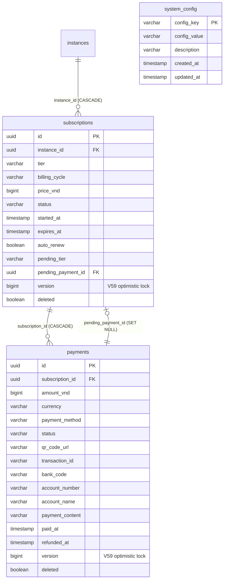

# Cluster Subscription / Billing (KiteHub)

> **TL;DR** — Cluster này gồm **3 bảng**: `subscriptions`, `payments`, `system_config`.
>
> - **Subscription/billing per-tenant** dạng MVP đơn giản: `subscriptions` (1 dòng / instance × billing period) ↔ `payments` (1..N giao dịch / subscription).
> - **Đơn vị tiền**: tất cả VND **đơn vị đồng** lưu `BIGINT` (`price_vnd`, `amount_vnd`) — KHÔNG dùng minor-unit / DECIMAL. Khác hệ KiteClass `04-finance.md` (dùng `DECIMAL(12,2)` / `NUMERIC(19,2)`). ⏸️ Deferred → GAP-912 (KH money BIGINT→NUMERIC + Long→BigDecimal — Wave 14 D-KH defer; chưa đổi, V59 confirm "no money-field changes").
> - **Optimistic lock**: `subscriptions.version` + `payments.version` ✅ Resolved (GAP-895, V59) — `@Version` field-level, KHÔNG ở `BaseEntity`. Xem [§ A9](#a9--optimistic-lock-version--resolved-cho-subscriptionspayments-v59).
> - **PK**: cả hai bảng dùng `UUID` (entity `@GeneratedValue(strategy = UUID)` qua `BaseEntity` — không seq).
> - **Vòng đời**:
>   - `subscriptions.status`: `ACTIVE → SUSPENDED → CANCELLED → EXPIRED` (CHECK constraint).
>   - `payments.status`: `PENDING → COMPLETED | FAILED | CANCELLED → REFUNDED` (CHECK constraint).
> - **Pending tier upgrade/downgrade** (V6): `subscriptions.pending_tier` + `subscriptions.pending_payment_id` (FK → `payments(id) ON DELETE SET NULL`) — cho phép schedule downgrade cuối kỳ + track prorated upgrade payment.
> - **RLS** (V34): bật `ENABLE` (NON-FORCED) chỉ trên `subscriptions` (có cột `instance_id`). `payments` KHÔNG bật RLS (liên kết tenant gián tiếp qua `subscription_id`). `system_config` là global control-plane (không tenant-scoped). Đây là posture có chủ ý vì kh-subscription chưa propagate `TenantContext` per request (xem [§ anomalies](#-ghi-chú-schema-anomalies)).
> - **`system_config`**: flat key/value store seeded bởi V27 (GAP-376 Wave 33 Bucket A) — chứa `default_tier=FREE`, `currency=VND`, `locale=vi`, `platform_tenant_id=0`. Không thuộc luồng billing nghiệp vụ; xếp vào cluster này vì là "platform-level config" mà subscription engine + production seed runner cùng đọc.

---

## ERD

> Ghi chú quan hệ:
> - `subscriptions.instance_id → instances(id) ON DELETE CASCADE` (FK thật, V2 `fk_subscription_instance`).
> - `payments.subscription_id → subscriptions(id) ON DELETE CASCADE` (FK thật, V3 `fk_payment_subscription`).
> - `subscriptions.pending_payment_id → payments(id) ON DELETE SET NULL` (FK thật, V6 `fk_subscription_pending_payment`) — vòng FK self-referencing qua bảng con, đó là cách "lock" 1 payment đang được sử dụng làm prorated upgrade.
> - `system_config` ĐỨNG ĐỘC LẬP — không FK đi/đến.

---

## `subscriptions`

**Mục đích.** 1 dòng = 1 thuê bao của 1 KiteClass instance (tenant) cho 1 chu kỳ billing. Theo dõi tier hiện tại (`FREE/BASIC/PREMIUM/ENTERPRISE`), chu kỳ (`MONTHLY/ANNUALLY`), giá VND, hạn dùng (`expires_at`), auto-renew, và 2 cột "pending" để đặt lịch downgrade/upgrade. Tạo ở `V2`, bổ sung pending fields ở `V6`, bật RLS non-forced ở `V34`. Map từ entity `Subscription extends BaseEntity` (module `kitehub-platform`).

| Cột | Kiểu | Null | Default | Khóa/Index | Ý nghĩa |
|---|---|---|---|---|---|
| `id` | UUID | NO | (entity `@GeneratedValue(UUID)`) | PK | Khóa chính. BaseEntity `@Id`. |
| `instance_id` | UUID | NO | — | FK → `instances(id)` **ON DELETE CASCADE** (`fk_subscription_instance`); `idx_subscriptions_instance` | Tenant ID (KiteClass instance) sở hữu subscription. |
| `tier` | VARCHAR(20) | NO | — | CHECK `chk_subscription_tier` | Enum `PricingTier`: `FREE, BASIC, PREMIUM, ENTERPRISE`. |
| `billing_cycle` | VARCHAR(20) | NO | — | CHECK `chk_subscription_billing_cycle` | Enum `BillingCycle`: `MONTHLY, ANNUALLY`. |
| `price_vnd` | BIGINT | NO | — | CHECK `chk_subscription_price` (>=0) | Giá VND **đơn vị đồng** (BIGINT, không scale). Khớp `PricingTier.priceVND` lock tại thời điểm subscribe. |
| `status` | VARCHAR(20) | NO | — | `idx_subscriptions_status`; CHECK `chk_subscription_status` | Enum `SubscriptionStatus`: `ACTIVE, SUSPENDED, CANCELLED, EXPIRED`. |
| `started_at` | TIMESTAMP | NO | — | — | Thời điểm bắt đầu chu kỳ hiện tại. ⚠️ `TIMESTAMP` không TZ — xem anomalies. |
| `expires_at` | TIMESTAMP | NO | — | `idx_subscriptions_expires` | Hết hạn chu kỳ (target cho cron expire/renew). ⚠️ `TIMESTAMP` không TZ. |
| `auto_renew` | BOOLEAN | NO | `TRUE` | — | Bật tự gia hạn cuối chu kỳ. |
| `pending_tier` | VARCHAR(20) | YES | — | CHECK `chk_subscription_pending_tier` | Tier sẽ áp dụng cuối chu kỳ (cho luồng downgrade — thường giảm tier sau khi billing period kết thúc). Thêm bởi `V6`. |
| `pending_payment_id` | UUID | YES | — | FK → `payments(id)` **ON DELETE SET NULL** (`fk_subscription_pending_payment`) | Payment đang treo cho luồng upgrade prorated (charge phần chênh tier ngay giữa chu kỳ). Thêm bởi `V6`. |
| `version` | BIGINT | NO | `0` | — | ✅ Resolved (GAP-895, V59) — `@Version` optimistic lock (entity field-level, KHÔNG ở `BaseEntity`). Guard race auto-renew cron vs admin manual extend trên `pending_payment_id` / `status`. Thêm bởi `V59` (Wave 14 C-KH). Xem [§ A9](#a9--optimistic-lock-version--resolved-cho-subscriptionspayments-v59). |
| `created_at` | TIMESTAMP | NO | — | — | Audit — tạo. `BaseEntity` `@CreatedDate` (Spring Data Auditing). ⚠️ `TIMESTAMP` không TZ — ⏸️ Deferred → GAP-912 (D-KH). |
| `updated_at` | TIMESTAMP | NO | — | — | Audit — cập nhật. `BaseEntity` `@LastModifiedDate`. ⚠️ `TIMESTAMP` không TZ. |
| `created_by` | VARCHAR(100) | YES | — | — | Actor tạo. `BaseEntity` `@CreatedBy` lưu **String** (KHÔNG phải BIGINT/UUID) — xem anomalies. |
| `updated_by` | VARCHAR(100) | YES | — | — | Actor cập nhật. `BaseEntity` `@LastModifiedBy`. |
| `deleted` | BOOLEAN | NO | `FALSE` | `idx_subscriptions_deleted` partial WHERE `deleted = false` | Soft-delete. |

**Constraints**: `fk_subscription_instance FK(instance_id) → instances(id) CASCADE`; `fk_subscription_pending_payment FK(pending_payment_id) → payments(id) SET NULL`; `chk_subscription_tier CHECK(tier IN ('FREE','BASIC','PREMIUM','ENTERPRISE'))`; `chk_subscription_billing_cycle CHECK(billing_cycle IN ('MONTHLY','ANNUALLY'))`; `chk_subscription_status CHECK(status IN ('ACTIVE','SUSPENDED','CANCELLED','EXPIRED'))`; `chk_subscription_price CHECK(price_vnd >= 0)`; `chk_subscription_pending_tier CHECK(pending_tier IN ('FREE','BASIC','PREMIUM','ENTERPRISE'))`. `version BIGINT NOT NULL DEFAULT 0` (V59 — optimistic lock, không phải constraint nhưng schema-level).

**Index**: `idx_subscriptions_instance(instance_id)`, `idx_subscriptions_status(status)`, `idx_subscriptions_expires(expires_at)`, `idx_subscriptions_deleted(deleted) WHERE deleted = false` (partial — query mặc định filter `deleted=false`).

**Quan hệ FK**
- Out: `instance_id → instances(id) CASCADE` (cross-cluster: cluster 01 Auth/User/Instance). Xóa instance → xóa subscription (vòng đời tenant lock).
- Out: `pending_payment_id → payments(id) SET NULL` (cùng cluster, self-referencing qua child) — vòng FK lưu lock prorated payment.
- In: `payments.subscription_id → subscriptions(id) CASCADE` (xóa subscription → xóa payments của nó).

**RLS + ghi chú**
- Tenant-scoped (có `instance_id`). RLS `ENABLE` non-forced ở `V34` — policy `tenant_isolation` filter `instance_id = current_setting('app.current_tenant_id')::uuid`. Owner role + Spring HikariCP user **bypass** (kh-subscription chưa propagate `TenantContext` per request, theo posture có chủ ý). Mọi role khác (future per-tenant analytical role, cross-service connection) bị policy filter. Xem [§ anomalies A6](#a6--rls-enabled-non-forced-cho-kh-subscription).
- Soft-delete: `deleted BOOLEAN NOT NULL DEFAULT FALSE` (V2). Index partial `idx_subscriptions_deleted` chỉ index `deleted = false` (tối ưu query nghiệp vụ — query xóa hoặc audit không dùng index này).
- `pending_payment_id SET NULL`: hợp lý vì payment có thể bị xóa (refund hard delete) mà không kéo đổ subscription cha; chỉ unset cờ pending.

---

## `payments`

**Mục đích.** 1 dòng = 1 giao dịch thanh toán cho 1 subscription. Hỗ trợ 4 cổng `VIETQR/MOMO/VNPAY/BANK_TRANSFER` cộng `MANUAL` (admin nhập tay). Lưu QR code URL, mã giao dịch ngân hàng, thông tin tài khoản nhận, vòng đời `PENDING → COMPLETED | FAILED | CANCELLED → REFUNDED`. Tạo ở `V3`. ⚠️ **KHÔNG có cột `instance_id` trực tiếp** — tenant context infer qua `subscription_id`. Map từ entity `Payment extends BaseEntity`.

| Cột | Kiểu | Null | Default | Khóa/Index | Ý nghĩa |
|---|---|---|---|---|---|
| `id` | UUID | NO | (entity `@GeneratedValue(UUID)`) | PK | Khóa chính. BaseEntity `@Id`. |
| `subscription_id` | UUID | NO | — | FK → `subscriptions(id)` **ON DELETE CASCADE** (`fk_payment_subscription`); `idx_payments_subscription` | Subscription được trả tiền. CASCADE: xóa subscription → xóa payments của nó. |
| `amount_vnd` | BIGINT | NO | — | CHECK `chk_payment_amount` (>0) | Số tiền VND **đơn vị đồng** (BIGINT). Cùng quy ước với `subscriptions.price_vnd`. |
| `currency` | VARCHAR(3) | NO | `'VND'` | CHECK `chk_payment_currency` IN (`VND`,`USD`) | Mã tiền tệ ISO-4217. CHECK chấp nhận VND+USD nhưng practice Phase 1 chỉ VND (entity default `'VND'`). |
| `payment_method` | VARCHAR(30) | NO | — | CHECK `chk_payment_method` | Enum `PaymentMethod`: `VIETQR, MOMO, VNPAY, BANK_TRANSFER, MANUAL`. ⚠️ CHECK chấp nhận `MANUAL` (V3 ALTER added) nhưng comment cột chỉ liệt kê 4 đầu — xem anomalies. |
| `status` | VARCHAR(20) | NO | — | `idx_payments_status`; CHECK `chk_payment_status` | Enum `PaymentStatus`: `PENDING, COMPLETED, FAILED, REFUNDED, CANCELLED`. Entity default `PENDING`. |
| `qr_code_url` | VARCHAR(500) | YES | — | — | URL ảnh QR code (cho VietQR). |
| `transaction_id` | VARCHAR(100) | YES | — | `idx_payments_transaction` | Mã giao dịch từ ngân hàng / cổng thanh toán (đối soát). |
| `bank_code` | VARCHAR(20) | YES | — | — | Mã ngân hàng (vd `VCB`, `TCB`, `MB`) cho VietQR/BANK_TRANSFER. |
| `account_number` | VARCHAR(50) | YES | — | — | Số tài khoản nhận. |
| `account_name` | VARCHAR(200) | YES | — | — | Tên chủ tài khoản nhận. |
| `payment_content` | VARCHAR(500) | YES | — | — | Nội dung thanh toán hiển thị cho user (vd `KITECLASS {instance_id}`). |
| `paid_at` | TIMESTAMP | YES | — | — | Thời điểm trả tiền thực tế (set khi `complete()`). ⚠️ `TIMESTAMP` không TZ. |
| `refunded_at` | TIMESTAMP | YES | — | — | Thời điểm hoàn tiền (set khi `refund()`). ⚠️ `TIMESTAMP` không TZ. |
| `refund_reason` | VARCHAR(500) | YES | — | — | Lý do hoàn tiền (customer request / lỗi / khác). |
| `version` | BIGINT | NO | `0` | — | ✅ Resolved (GAP-895, V59) — `@Version` optimistic lock (entity field-level). Guard concurrent payment status transition (PENDING → COMPLETED vs admin REFUNDED). Thêm bởi `V59` (Wave 14 C-KH). Xem [§ A9](#a9--optimistic-lock-version--resolved-cho-subscriptionspayments-v59). |
| `created_at` | TIMESTAMP | NO | — | `idx_payments_created` DESC | Audit — tạo. `BaseEntity` `@CreatedDate`. Sort DESC cho dashboard recent payments. ⏸️ Deferred → GAP-912 (TIMESTAMP không TZ, D-KH). |
| `updated_at` | TIMESTAMP | NO | — | — | Audit — cập nhật. `BaseEntity` `@LastModifiedDate`. |
| `created_by` | VARCHAR(100) | YES | — | — | Actor tạo. `BaseEntity` `@CreatedBy` lưu **String**. |
| `updated_by` | VARCHAR(100) | YES | — | — | Actor cập nhật. `BaseEntity` `@LastModifiedBy`. |
| `deleted` | BOOLEAN | NO | `FALSE` | `idx_payments_deleted` partial WHERE `deleted = false` | Soft-delete. |

**Constraints**: `fk_payment_subscription FK(subscription_id) → subscriptions(id) CASCADE`; `chk_payment_method CHECK(payment_method IN ('VIETQR','MOMO','VNPAY','BANK_TRANSFER','MANUAL'))`; `chk_payment_status CHECK(status IN ('PENDING','COMPLETED','FAILED','REFUNDED','CANCELLED'))`; `chk_payment_currency CHECK(currency IN ('VND','USD'))`; `chk_payment_amount CHECK(amount_vnd > 0)`. `version BIGINT NOT NULL DEFAULT 0` (V59 — optimistic lock).

**Index**: `idx_payments_subscription(subscription_id)`, `idx_payments_status(status)`, `idx_payments_transaction(transaction_id)`, `idx_payments_created(created_at DESC)`, `idx_payments_deleted(deleted) WHERE deleted = false`.

**Quan hệ FK**
- Out: `subscription_id → subscriptions(id) CASCADE` (N-1; nhiều payment / 1 subscription).
- In: `subscriptions.pending_payment_id → payments(id) SET NULL` (parent subscription có thể trỏ lock tới 1 payment cụ thể của chính nó cho luồng upgrade prorated).

**RLS + ghi chú**
- **KHÔNG** có cột `instance_id` ⇒ V34 **bỏ qua** (`Skipping table (no instance_id column)`). Cô lập tenant **gián tiếp** qua FK `subscription_id → subscriptions.instance_id`. Mọi query nghiệp vụ phải JOIN qua subscriptions để filter tenant — kh-subscription chưa enforce ràng buộc này tự động, là rủi ro cross-tenant leak nếu repository method query trực tiếp `payments.subscription_id` không kèm tenant guard. Xem [§ anomalies A7](#a7--payments-thiếu-instance_id--rls-bypass-default).
- `paid_at`/`refunded_at` chỉ là cờ trạng thái có entity helper (`complete()`/`refund()`/`fail()`/`cancel()`) — không có cron sweep từ DB layer.

---

## `system_config`

**Mục đích.** Bảng key/value flat cho **platform-level config** (toàn KiteHub, không tenant-scoped) mà `ProductionSeedRunner` (GAP-376) và infrastructure callers đọc. Mục tiêu: cho phép môi trường SQL-only bootstrap (vd read-replica) lấy default mà không cần chạy Spring runner. Tạo ở `V27` cùng với seed 4 dòng baseline. ⚠️ KHÔNG có entity JPA tương ứng — chỉ DAO `SystemConfigSeedDao` (raw JDBC seed) sử dụng trực tiếp.

| Cột | Kiểu | Null | Default | Khóa/Index | Ý nghĩa |
|---|---|---|---|---|---|
| `config_key` | VARCHAR(100) | NO | — | PK; `idx_system_config_key(config_key)` (redundant với PK) | Khóa config (vd `default_tier`, `currency`, `locale`, `platform_tenant_id`). |
| `config_value` | VARCHAR(500) | NO | — | — | Giá trị raw string. Caller tự parse (boolean/int/json) — bảng không type-safe. |
| `description` | VARCHAR(500) | YES | — | — | Mô tả người-đọc cho config key. |
| `created_at` | TIMESTAMP | NO | `NOW()` | — | Audit — tạo. ⚠️ `TIMESTAMP` không TZ. |
| `updated_at` | TIMESTAMP | NO | `NOW()` | — | Audit — cập nhật. ⚠️ `TIMESTAMP` không TZ. KHÔNG có trigger auto-update — caller phải SET tay. |

**Constraints**: chỉ PK `config_key`. Không UNIQUE phụ, không CHECK.

**Index**: `idx_system_config_key(config_key)` — **redundant** với PK (Postgres auto-create unique index trên PK). Xem [§ anomalies A4](#a4--system_config-index-redundant-với-primary-key).

**Seed (V27 `INSERT ... ON CONFLICT DO NOTHING`)**:

| `config_key` | `config_value` | `description` |
|---|---|---|
| `default_tier` | `FREE` | Default pricing tier for new instances |
| `currency` | `VND` | Platform default currency code (ISO-4217) |
| `locale` | `vi` | Platform default locale (BCP-47) |
| `platform_tenant_id` | `0` | Reserved tenant id for platform-level resources |

**Quan hệ FK**
- Out: không.
- In: không.

**RLS + ghi chú**
- Global control-plane table — **không tenant-scoped**. V34 KHÔNG enable RLS (không có `instance_id`/`tenant_id`).
- Idempotency: V27 dùng `CREATE TABLE IF NOT EXISTS` + `INSERT ... ON CONFLICT (config_key) DO NOTHING` — re-run migration trên DB đã có dòng = no-op. Runner `ProductionSeedRunner` cùng upsert qua `SystemConfigSeedDao` với uniqueness contract giống nhau.
- Comment V27 cảnh báo: **platform admin user KHÔNG seed ở đây** — runner phải BCrypt password từ Secrets Manager (GAP-379), tránh plaintext trong migration file.
- ⚠️ `platform_tenant_id='0'` lưu string `'0'` trong VARCHAR — caller parse thành BIGINT/UUID? Inconsistent với convention `instance_id UUID` toàn dự án. Xem anomalies.

---

## Ghi chú schema (anomalies)

### A1 — Đơn vị tiền khác hệ KiteClass (BIGINT đồng vs DECIMAL)

Cluster này dùng `BIGINT` cho `subscriptions.price_vnd` + `payments.amount_vnd` (đơn vị đồng, scale 0). KiteClass `04-finance.md` dùng `DECIMAL(12,2)` / `NUMERIC(19,2)` (scale 2). Hai hệ kế toán dùng quy ước tiền khác nhau:

- KiteHub control-plane (cluster này): "giá tier cố định + payment integer VND" → BIGINT đủ + tránh round (vd `500_000L` đồng cho BASIC monthly per `PricingTier.priceVND`).
- KiteClass per-tenant `04-finance.md`: "tính học phí có thể phần lẻ, hoàn tiền lẻ" → DECIMAL có scale 2.

Drift này là **có chủ ý theo domain** nhưng cần biết khi viết report cross-DB (so sánh MRR control-plane vs revenue per-tenant). KHÔNG có cột tiền minor-unit (xu) — đơn vị nhỏ nhất là đồng.

⏸️ **Deferred → GAP-912** (KH money `price_vnd`/`amount_vnd` BIGINT→NUMERIC + Long→BigDecimal). Wave 14 D-KH explicit defer — V59 comment line 19 ghi rõ "No money-field changes (Long amount_vnd / price_vnd untouched — that is Bucket D-KH)". GAP-878/883 KH money portion đã re-route vào GAP-912. **Trạng thái hiện tại: VẪN BIGINT — chưa đổi.**

### A2 — `pending_tier` lưu cùng VARCHAR(20) nhưng có CHECK riêng vs cột `tier`

`pending_tier` (V6) thêm CHECK constraint `chk_subscription_pending_tier` LIÊN QUAN ĐẾN cột `pending_tier`, có cùng tập giá trị với `chk_subscription_tier` ('FREE','BASIC','PREMIUM','ENTERPRISE'). Nếu mai mốc thêm tier mới (vd `EDU`), PHẢI update đồng thời 2 CHECK — drift risk. Nên consolidate qua 1 DOMAIN type Postgres (vd `CREATE DOMAIN pricing_tier AS VARCHAR(20) CHECK (...)`) hoặc giữ luôn lệ hiện tại + checklist migration. Hiện tại 2 CHECK độc lập.

### A3 — `paid_at`/`refunded_at` đặt qua `LocalDateTime.now()` trong code, không trigger DB

Entity helper `payments.complete(transactionId)` set `this.paidAt = LocalDateTime.now()` (Java side). KHÔNG có DB trigger / GENERATED COLUMN cho `paid_at` khi `status` flip → `COMPLETED`. Nếu admin manually update qua SQL trực tiếp (vd reconcile script) đổi `status='COMPLETED'`, `paid_at` sẽ KHÔNG được set tự động. Quy ước "chỉ qua entity" được lưu trong code, không enforce DB-level. Cùng pattern cho `refunded_at` khi `refund()`.

### A4 — `system_config` index redundant với PRIMARY KEY

`CREATE INDEX IF NOT EXISTS idx_system_config_key ON system_config(config_key)` (V27) — `config_key` đã là PRIMARY KEY, Postgres tự tạo unique B-tree index trên PK. Tạo thêm `idx_system_config_key` cùng cột = **duplicate index** (cùng layout, cùng selectivity). Tốn disk + slow INSERT/UPDATE. Có thể drop trong cleanup migration. Đây là minor anomaly không ảnh hưởng correctness.

### A5 — `BaseEntity.createdBy`/`updatedBy` lưu VARCHAR(100) String — khác KiteClass V73 UUID

`BaseEntity` (`kitehub-platform`) khai báo `createdBy`/`updatedBy` **String** map vào `VARCHAR(100)`. KiteClass core đã có migration **V73** convert `created_by`/`updated_by` sang UUID toàn cluster (GAP-795 sweep — xem `kiteclass/04-finance.md` §A6). KiteHub control-plane **KHÔNG** có sweep tương ứng:

- `subscriptions.created_by` / `updated_by` vẫn VARCHAR(100) — caller `AuditorAware<String>` (Spring Data Auditing) return string (vd email / username / sub claim) không phải UUID.
- `payments.created_by` / `updated_by` cùng kiểu.

Drift cross-DB: 2 database lưu actor identity 2 kiểu khác nhau. Nếu cross-DB analytics ("ai approve subscription / ai record payment"), phải normalize String ↔ UUID — UI/report side phải handle. Quy ước nội tại của kh-subscription chưa được tài liệu hóa rõ về format (email? username? sub claim?).

### A6 — RLS `ENABLE` non-forced cho kh-subscription

V34 explicit comment: kh-subscription **không propagate `TenantContext`** per request (control-plane service, không phải multi-tenant runtime như kc-core). Vì vậy chỉ `ENABLE ROW LEVEL SECURITY` (KHÔNG `FORCE`) trên `subscriptions` (+ 10 bảng khác trong instance_id_tables + 1 tenant_id_tables `consent_record` ở cluster 04). Hệ quả:

- Owner role (Flyway tạo bảng) + Spring HikariCP user **bypass** policy → repository methods + tests chạy bình thường.
- Role khác (future per-tenant analytical role, cross-service connection không own bảng) bị filter `instance_id = current_setting('app.current_tenant_id')::uuid` — nhưng setting có thể NULL → match NULL → default deny? Actually V34 policy dùng `NULLIF(current_setting(...), '')::uuid` ⇒ NULL setting → NULL comparison → **không match** → row bị filter. Hợp lệ.

Follow-up gap đã ghi trong comment V34: "GAP filed by Wave 56 closure PR if/when kh-subscription gains a per-request `TenantContext`". Tới lúc đó upgrade thành `FORCE` per posture hardened V50 cho audit logs.

### A7 — `payments` thiếu `instance_id` → RLS bypass default

`payments` KHÔNG có cột `instance_id` — V34 explicit skip (`RAISE NOTICE 'Skipping table % (no instance_id column)'`). Cô lập tenant **gián tiếp** qua FK `subscription_id → subscriptions.instance_id`. Trade-off:

- ✅ Tránh duplicate cột (instance_id derivable từ join).
- ❌ Repository method query trực tiếp `findBySubscriptionId(uuid)` KHÔNG check tenant ownership — nếu caller pass `subscription_id` của tenant khác (vd qua URL param không validate), trả về payment của tenant đó. Phải tin tưởng tầng controller/service tự enforce.
- ❌ Nếu future kh-subscription gain TenantContext + FORCE RLS, sẽ KHÔNG cover `payments` cho tới khi có migration thêm `instance_id` (denormalized) + backfill từ subscription.

Rủi ro **cross-tenant leak** mức medium — cần audit code path bằng tay. Sister rule: `audit-service-isolation.md` không cover trực tiếp.

### A8 — TIMESTAMP không TZ toàn cluster

100% cột thời gian của cluster là `TIMESTAMP` (không TIMEZONE). So với cluster KiteClass `04-finance.md` mix TIMESTAMPTZ (V1 bảng cũ) + TIMESTAMP (V48/V61 bảng mới). Toàn KiteHub control-plane đã đồng nhất TIMESTAMP — nhưng trộn với TIMESTAMPTZ của KiteClass khi cross-DB query → rủi ro lệch giờ ở boundary múi giờ (DST không quan trọng cho VN nhưng tổng vẫn drift). Cần tài liệu hóa: tất cả TIMESTAMP của KiteHub **giả định UTC** (Spring `spring.jpa.properties.hibernate.jdbc.time_zone=UTC` — verify trong application.yml).

⏸️ **Deferred → GAP-912** (KH timestamp `timestamp without time zone` → TIMESTAMPTZ). Wave 14 D-KH defer — V59-V61 KHÔNG touch timestamp columns. GAP-878 KH timestamp portion re-route vào GAP-912. **Trạng thái hiện tại: VẪN TIMESTAMP (không TZ) — chưa đổi.**

### A9 — Optimistic lock `version` ✅ Resolved cho subscriptions/payments (V59)

✅ **Resolved (GAP-895, V59 — Wave 14 C-KH).** Trước đây `BaseEntity` không khai báo `@Version` → 2 caller race condition trên cùng subscription (vd auto-renew cron vs admin manual extend) ghi đè không có optimistic lock. V59 thêm `version BIGINT NOT NULL DEFAULT 0` vào **cả `subscriptions` lẫn `payments`** (entity field-level `@Version Long version` trên `Subscription` + `Payment`, KHÔNG ở `BaseEntity` — vì `instances` table out-of-scope D-KH bucket; thêm `@Version` vào `BaseEntity` sẽ buộc thêm cột vào `instances` → schema-drift FAIL). Hệ quả:

- Race auto-renew cron vs admin manual extend trên `pending_payment_id` / `status` giờ bị `OptimisticLockingFailureException` catch → retry/reject.
- Race concurrent payment status transition (PENDING → COMPLETED từ webhook vs admin REFUNDED) cũng được guard.

**Còn lại (chưa đồng bộ):** `instances` (cluster 01) + `system_config` vẫn KHÔNG có `version` — `instances` out-of-scope D-KH; `system_config` là flat key/value seed không cần optimistic lock. So sánh KiteClass `BaseEntity` (kiteclass-core) có `@Version` trên toàn cluster — KiteHub control-plane chỉ subscriptions+payments có (minimal-change scope V59).

### A10 — `currency` CHECK chấp nhận USD nhưng entity default VND, không có locale-switching code

`chk_payment_currency CHECK(currency IN ('VND','USD'))` — V3 cho phép USD. Nhưng:

- `Payment` entity default `currency = "VND"`.
- `PricingTier.priceVND` (Java) chỉ lưu VND.
- Không có pricing tier USD nào trong code.
- `system_config.currency = 'VND'` mặc định seed.

USD value là **inert** — chỉ tồn tại trong CHECK constraint, không có code path tạo payment USD. Có thể siết CHECK thành `IN ('VND')` cho tới khi thật sự cần USD, hoặc giữ scaffold cho future. Hiện trạng = inert giá trị không enforce nghiệp vụ.

### A11 — Hai bảng "payments" trong dự án (cross-DB ambiguity)

Trùng tên với KiteClass `payments` (cluster 04-finance) — hai bảng KHÁC NHAU hoàn toàn:

| | KiteHub `payments` (cluster này) | KiteClass `payments` (kc-core `04-finance.md`) |
|---|---|---|
| Database | `kitehub` | `kiteclass` |
| Service sở hữu | `kitehub-subscription` | `kiteclass-core` |
| Mục đích | Trả phí subscription SaaS (B2B — instance trả KiteHub) | Trả học phí (B2C — phụ huynh trả trung tâm) |
| PK | UUID | BIGSERIAL |
| Tiền | BIGINT VND đồng | DECIMAL(12,2) VND |
| Method enum | VIETQR/MOMO/VNPAY/BANK_TRANSFER/MANUAL | cash/bank_transfer/momo/zalopay/qr (lowercase) |
| Liên kết | `subscription_id → subscriptions(id)` | `invoice_id → invoices(id)` |
| Tenant scope | KHÔNG instance_id (qua subscription) | CÓ `instance_id` |

Khi cross-DB query / report / docs, dùng full path `kitehub.public.payments` vs `kiteclass.public.payments` để tránh nhầm. Sister bảng KiteClass cũng có cảnh báo về drift `payments` vs `payment_records` (xem `kiteclass/04-finance.md` §A1).

---

## Nguồn đọc

**Migrations** (Flyway, module `kitehub-subscription`):
- `V2__create_subscriptions_table.sql` — tạo `subscriptions` + 4 CHECK + 4 index.
- `V3__create_payments_table.sql` — tạo `payments` + 4 CHECK + 5 index.
- `V6__add_pending_tier_fields.sql` — thêm `pending_tier` + `pending_payment_id` + FK SET NULL + CHECK pending_tier.
- `V27__seed_admin_system_config.sql` — tạo `system_config` + seed 4 dòng baseline + index redundant.
- `V34__enable_rls_tenant_scoped_tables.sql` — `ENABLE RLS` non-forced trên `subscriptions` (`payments` skip vì no instance_id, `system_config` skip vì không tenant-scoped).
- `V59__optimistic_lock_check_coverage.sql` — ✅ Resolved GAP-895: thêm `version BIGINT NOT NULL DEFAULT 0` vào `subscriptions` + `payments`. (Cũng thêm CHECK `backup_records.status` + `branding_regenerate_usage.tier`/`window_order` — thuộc cluster 03.) Comment line 19 confirm "no money-field changes" (D-KH defer).

**Entities** (`kitehub-platform`):
- `domain/entity/BaseEntity.java` — superclass UUID PK + audit String (createdBy/updatedBy) + soft-delete.
- `domain/entity/Subscription.java` — entity `subscriptions`, business helpers `isActive() / isExpired() / cancel() / expire() / suspend() / renew()`.
- `domain/entity/Payment.java` — entity `payments`, business helpers `complete(txnId) / fail() / refund(reason) / cancel() / isCompleted() / isPending()`.

**Enums** (`kitehub-platform/domain/enums/`):
- `PricingTier.java` — `FREE(10,1,500,0) | BASIC(50,5,2048,500_000) | PREMIUM(200,20,10240,1_500_000) | ENTERPRISE(MAX,MAX,MAX,0)` + `allowsCustomDomain() / getAnnualPrice() (10% discount) / getPrice(cycle)`.
- `BillingCycle.java` — `MONTHLY | ANNUALLY`.
- `SubscriptionStatus.java` — `ACTIVE | CANCELLED | EXPIRED | SUSPENDED`.
- `PaymentMethod.java` — `VIETQR | MOMO | VNPAY | BANK_TRANSFER | MANUAL`.
- `PaymentStatus.java` — `PENDING | COMPLETED | FAILED | REFUNDED | CANCELLED`.

**DAO seed** (`kitehub-subscription`):
- `seed/SystemConfigSeedDao.java` — raw JDBC upsert vào `system_config` (gọi từ `ProductionSeedRunner` per GAP-376 Wave 33).

**Cross-reference**:
- [README cluster database KiteHub](README.md)
- [Schema reference root](../README.md)
- [Cluster KiteClass `04-finance.md`](../kiteclass/04-finance.md) — bảng `payments` đồng tên khác mục đích (A11).
- ADR-021 (per-module outbox pattern) — kh-subscription dùng `migration_outbox` riêng (cluster 03).
- GAP-376 (Production data seed scaffolding, Wave 33 Bucket A) — origin của `system_config`.
- GAP-466 (Postgres RLS Phase 1) — `V34` ship cluster này.
- Wave 56 plan §4 State-Check Evidence — bối cảnh `ENABLE` non-forced cho kh-subscription.
