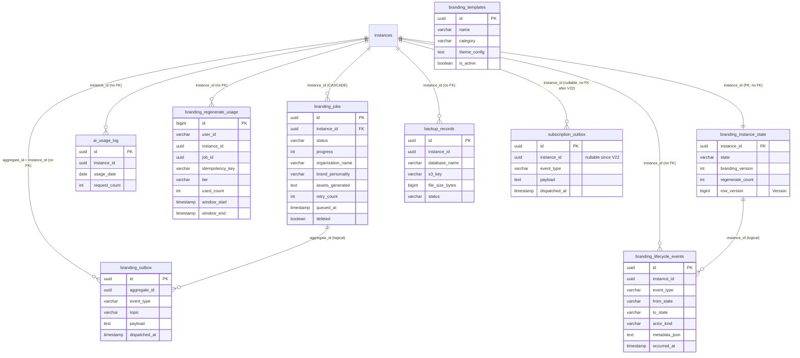

# Cluster Branding / AI job / Outbox (KiteHub)

> **TL;DR** — Cluster này gồm **9 bảng** thuộc database `kitehub` (control-plane), schema migration owned bởi `kitehub-subscription`
> nhưng phần lớn entity JPA + service consumer nằm trong `kitehub-branding`:
> `branding_jobs`, `ai_usage_log`, `branding_templates`, `branding_regenerate_usage`,
> `branding_instance_state`, `branding_lifecycle_events`, `branding_outbox`,
> `backup_records`, `migration_outbox` (đã rename thành `subscription_outbox` từ V22 — cluster overlap với 02-subscription-billing,
> chỉ giải thích role của bảng tại cluster 03 không re-document đầy đủ).
>
> - **AI generation job queue**: `branding_jobs` (V4) — vòng đời `QUEUED → PROCESSING → COMPLETED/FAILED/CANCELLED`, dispatched qua `AIQueueDispatcher` (Exception D §3.5.1 design-patterns).
> - **AI quota / rate-limit**: `ai_usage_log` (V14, daily counter per tenant) + `branding_regenerate_usage` (V29, per-user daily window with idempotency).
> - **Lifecycle state machine + audit**: `branding_instance_state` (V30 — current state per tenant; 1 row / instance, optimistic lock qua `row_version`) + `branding_lifecycle_events` (V30 — append-only audit trail).
> - **Template gallery**: `branding_templates` (V13, V15) — 5 template được seed sẵn, KHÔNG tenant-scoped (system-wide catalog).
> - **Transactional outbox**: `branding_outbox` (V21 — per-module outbox cho branding events theo ADR-021) + `migration_outbox` → `subscription_outbox` (V19→V22, dùng chung cho trial-to-paid + purge + email; cluster overlap).
> - **Backup audit**: `backup_records` (V16) — tracking backup-restore drill (GAP-094) cho S3 archive.
> - **RLS V34 + V50** bật trên 7 / 9 bảng (xem [§ anomalies A6](#a6--rls-coverage-gap)). `branding_templates` system-wide (no `instance_id`) + `subscription_outbox` (renamed sau V34 list được dựng) bị BỎ SÓT.
> - **Đơn vị key tenant**: UUID `instance_id` cho 7 bảng tenant-scoped; `branding_templates` không có; `subscription_outbox` (sau V22) cho phép `instance_id IS NULL` để chứa cross-instance events.

---

## ERD

> Ghi chú quan hệ: chỉ `branding_jobs.instance_id → instances(id)` (V4 `fk_branding_job_instance` ON DELETE CASCADE) và (legacy) `migration_outbox.instance_id → instances(id)` (V19 — bị drop bởi V22 khi rename) là FK thật trong DB. Mọi quan hệ tenant-scope khác (`ai_usage_log`, `branding_regenerate_usage`, `branding_instance_state`, `branding_lifecycle_events`, `backup_records`, `branding_outbox.aggregate_id`) là **liên kết logic** — không có FK constraint (xem [§ anomalies A1](#a1--fk-coverage-mỏng-tenant-link-logic-không-constraint)).

---

## `branding_jobs`

**Mục đích.** Hàng đợi job AI generate logo + asset cho từng tenant (Sub-PR 4.9 “AI Branding Job Queue”). Mỗi row biểu diễn 1 lần tenant request generate; vòng đời chạy `QUEUED → PROCESSING → COMPLETED | FAILED | CANCELLED` qua `AIQueueDispatcher` (Exception D §3.5.1 design-patterns) + Resilience4j `@CircuitBreaker` + retry counter ≤5. Tạo ở `V4`, thêm covering index ở `V31`, bật RLS ở `V34`/`V50`. Map từ entity `BrandingJob`.

| Cột | Kiểu | Null | Default | Khóa/Index | Ý nghĩa |
|---|---|---|---|---|---|
| `id` | UUID | NO | — | PK | Khóa chính (Hibernate `GenerationType.UUID`) |
| `instance_id` | UUID | NO | — | `idx_branding_jobs_instance`; FK CASCADE | Tenant chủ job |
| `status` | VARCHAR(20) | NO | — | `idx_branding_jobs_status` (V31); CHECK | Enum `JobStatus`: `QUEUED, PROCESSING, COMPLETED, FAILED, CANCELLED` |
| `progress` | INTEGER | NO | `0` | CHECK `0..100` | % tiến độ |
| `current_step` | VARCHAR(100) | YES | — | — | Vd `analyzing_logo, generating_variants, creating_banners` |
| `logo_url` | VARCHAR(500) | YES | — | — | URL logo gốc tenant upload (MinIO) |
| `organization_name` | VARCHAR(200) | NO | — | `idx_branding_job_org_name_lower` (V31, functional `LOWER(...)`) | Tên trung tâm → ghi vào prompt + drive slug-availability check `existsByOrganizationNameLowercased` (GAP-392) |
| `brand_personality` | VARCHAR(50) | YES | — | CHECK | Enum DB: `PROFESSIONAL, CREATIVE, PLAYFUL, MODERN, ELEGANT, BOLD` — ⚠️ **KHÔNG có** trong entity `BrandingJob.java` (xem anomalies) |
| `color_scheme` | VARCHAR(50) | YES | — | — | Vd `PRIMARY_BLUE, WARM_ORANGE, NATURE_GREEN` — ⚠️ KHÔNG có trong entity |
| `assets_generated` | TEXT | YES | — | — | JSON `{"logos":[...],"banners":[...],"heroes":[...]}` (comment DB). Entity map String |
| `logo_analysis` | TEXT | YES | — | — | JSON GPT-4 Vision analyze logo. ⚠️ KHÔNG có trong entity |
| `theme_extracted` | VARCHAR(50) | YES | — | — | Theme dominant trích từ logo. ⚠️ KHÔNG có trong entity |
| `error_message` | TEXT | YES | — | — | Lỗi khi job FAILED |
| `retry_count` | INTEGER | NO | `0` | CHECK `0..5` | Số lần retry (max 5 → DLQ) |
| `queued_at` | TIMESTAMP | NO | — | `idx_branding_jobs_queued (queued_at DESC)` | Thời điểm enqueue. Entity gắn `@CreationTimestamp` |
| `started_at` | TIMESTAMP | YES | — | `idx_branding_jobs_processing WHERE status='PROCESSING'` | Bắt đầu xử lý — partial index tìm stale job |
| `completed_at` | TIMESTAMP | YES | — | — | Hoàn tất |
| `created_at` | TIMESTAMP | NO | — | — | Audit — tạo. ⚠️ V4 dùng `TIMESTAMP` (không TZ) |
| `updated_at` | TIMESTAMP | NO | — | — | Audit — cập nhật. ⚠️ `TIMESTAMP` không TZ |
| `created_by` | VARCHAR(100) | YES | — | — | Actor tạo. Kiểu VARCHAR (khác cluster Finance KiteClass dùng BIGINT/UUID). ⚠️ KHÔNG có trong entity |
| `updated_by` | VARCHAR(100) | YES | — | — | Actor cập nhật. ⚠️ KHÔNG có trong entity |
| `deleted` | BOOLEAN | NO | `FALSE` | `idx_branding_jobs_deleted WHERE deleted=false` | Soft-delete. ⚠️ KHÔNG có trong entity |
| `language` | — | — | — | — | ⚠️ Entity `BrandingJob.java` khai báo `@Column(name="language", nullable=false, length=10)` nhưng **migration KHÔNG tạo cột này** (xem anomalies A2) |

**Constraints**: `chk_branding_job_status` (5 giá trị); `chk_branding_job_progress` (0..100); `chk_branding_job_retry` (0..5); `chk_branding_job_personality` (6 giá trị PROFESSIONAL/CREATIVE/PLAYFUL/MODERN/ELEGANT/BOLD); `fk_branding_job_instance FOREIGN KEY (instance_id) REFERENCES instances(id) ON DELETE CASCADE`.

**Quan hệ FK**
- Out: `instance_id → instances(id)` (ON DELETE CASCADE — duy nhất FK thật trong cluster).
- In: `branding_outbox.aggregate_id` mang giá trị `branding_jobs.id` cho events `branding.job.*` (liên kết logic, no FK).

**RLS + ghi chú**
- Tenant-scoped ✅. V34 bật RLS với policy `tenant_isolation` qua `app.current_tenant`. V50 thêm admin-bypass `app.is_platform_admin` + NULL force-fail (đồng bộ với policy cluster auth).
- Soft-delete `deleted` được dùng qua partial index `idx_branding_jobs_deleted` (đảm bảo index nhỏ). Tuy nhiên entity `BrandingJob` chưa map field này → service-layer KHÔNG filter `deleted=false` (drift logic).
- Slug-availability lookup chạy `SELECT (COUNT(j)>0) FROM branding_jobs WHERE LOWER(organization_name) = ?` mỗi key-stroke wizard ⇒ phải dùng functional index `idx_branding_job_org_name_lower` (V31) để O(log n) thay vì full scan (GAP-392).

---

## `ai_usage_log`

**Mục đích.** Đếm số AI request mỗi tenant mỗi ngày để áp rate limit theo tier (FREE/PRO/PREMIUM/ENTERPRISE). Tạo ở `V14` cho rate-limit governance (`ai-branding-guidelines.md` §4.3). Map từ entity `AIUsageLog`.

| Cột | Kiểu | Null | Default | Khóa/Index | Ý nghĩa |
|---|---|---|---|---|---|
| `id` | UUID | NO | `gen_random_uuid()` | PK | Khóa chính |
| `instance_id` | UUID | NO | — | UNIQUE thành phần; `idx_ai_usage_instance_date (instance_id, usage_date)` | Tenant |
| `usage_date` | DATE | NO | `CURRENT_DATE` | UNIQUE thành phần | Ngày tính quota (UTC) |
| `request_count` | INT | NO | `1` | — | Counter tăng dần trong ngày |

**Constraints**: `uq_ai_usage_per_day UNIQUE(instance_id, usage_date)` — đảm bảo 1 row / tenant / ngày, INSERT lần đầu trong ngày + UPDATE counter cho lần sau (upsert/atomic increment).

**Quan hệ FK**
- Out: `instance_id` tham chiếu logic tới `instances(id)` — **KHÔNG có FK constraint** trong V14.
- In: không.

**RLS + ghi chú**
- Tenant-scoped ✅. V34 bật RLS (table có `instance_id`). V50 áp admin-bypass.
- Tier cap (FREE/PRO/PREMIUM/ENTERPRISE) chứa config-key `ai.input.cap.*` (`ai-branding-guidelines.md` §2.5), KHÔNG persist vào bảng này.
- Schema cực gọn (4 cột). Không có audit set (created_at/updated_at) — quota counter là transient, không cần audit timeline.

---

## `branding_templates`

**Mục đích.** Gallery template cho "instant branding" (<1s), tenant chọn template thay vì chờ AI generate (~30s). Tạo ở `V13` (SAAS-8), `theme_config` đổi từ `JSONB → TEXT` ở `V15` (drift fix — entity map String). Seed 5 template (Modern Education / Classic Academy / Playful Learning / Professional Training / Minimal Clean). Map từ entity `BrandingTemplate`.

| Cột | Kiểu | Null | Default | Khóa/Index | Ý nghĩa |
|---|---|---|---|---|---|
| `id` | UUID | NO | `gen_random_uuid()` | PK | Khóa chính |
| `name` | VARCHAR(100) | NO | — | — | Tên template hiển thị |
| `category` | VARCHAR(50) | NO | — | — | Phân loại: `education, business, general` (seed) |
| `thumbnail_url` | VARCHAR(500) | YES | — | — | URL ảnh preview (MinIO) |
| `theme_config` | **TEXT** | NO | — | — | JSON `{colors:{primary,secondary,accent}, fonts:{heading,body}, style}`. V13 ban đầu `JSONB`, V15 đổi `TEXT` (`USING theme_config::text`) để khớp `@Column(columnDefinition="text")` entity — nếu không Hibernate validate sẽ fail |
| `is_active` | BOOLEAN | YES | `TRUE` | — | Hiển thị trên gallery hay ẩn |
| `created_at` | TIMESTAMP | YES | `NOW()` | — | Audit — tạo. ⚠️ `TIMESTAMP` không TZ |

**Constraints**: chỉ PK. KHÔNG UNIQUE trên `name` ⇒ 2 template trùng tên hợp lệ (drift với UX expectation).

**Quan hệ FK**
- Out: không (system-wide catalog).
- In: không (FE/BE chỉ đọc `theme_config` rồi render — không lưu pointer `template_id` trong branding job).

**RLS + ghi chú**
- ❌ **KHÔNG** tenant-scoped (bảng catalog dùng chung cho mọi tenant). KHÔNG có `instance_id` ⇒ V34 bỏ qua (`Skipping table (no instance_id column)`).
- ⚠️ JSON validation **MẤT** từ V15 — Postgres `JSONB` enforce syntax JSON khi INSERT, `TEXT` không. Nếu service ghi `theme_config` không phải JSON hợp lệ, DB chấp nhận; downstream parser sẽ throw runtime. Khuyến nghị: thêm CHECK `theme_config::jsonb IS NOT NULL` hoặc giữ JSONB + dùng Hibernate `@JdbcTypeCode(SqlTypes.JSON)` (cùng class `postgres-specific-type-testcontainers.md` rule).
- Idempotent insert: V13 dùng `CREATE TABLE IF NOT EXISTS` + plain `INSERT INTO ... VALUES (...)` ⇒ chạy lại migration sẽ duplicate seed. Không có ON CONFLICT clause (lỗi không-idempotent của seed) — chỉ chạy 1 lần lúc Flyway baseline.

---

## `branding_regenerate_usage`

**Mục đích.** Đếm số lần regenerate logo / asset cho mỗi user trong window 1 ngày (UTC midnight reset), gắn idempotency-key 10-phút cho POST `/regenerate` (Wave 34 Bucket A, sub-GAP-272d). Tier cap (FREE=3 / PRO=10 / PREMIUM=30 / ENTERPRISE=-1) sống ở config key `kitehub.regenerate.*` — bảng chỉ lưu counter + window. Tạo ở `V29`, RLS ở `V34`. Map từ entity `BrandingRegenerateUsage`.

| Cột | Kiểu | Null | Default | Khóa/Index | Ý nghĩa |
|---|---|---|---|---|---|
| `id` | BIGSERIAL | NO | seq | PK | Khóa chính. ⚠️ Kiểu BIGINT (khác các bảng UUID khác trong cluster) |
| `user_id` | VARCHAR(100) | NO | — | UNIQUE thành phần `(user_id, window_start)` | Caller (JWT `sub`). ⚠️ Kiểu **VARCHAR** không phải UUID — tolerate cả UUID v4 lẫn email/username legacy |
| `instance_id` | UUID | YES | — | (RLS dùng) | Tenant — **nullable** (cho phép pre-auth flow regenerate trong wizard chưa pick instance) |
| `job_id` | UUID | YES | — | — | Branding job được regenerate (tham chiếu logic tới `branding_jobs.id`) |
| `idempotency_key` | VARCHAR(100) | YES | — | `idx_brand_regen_idempotency (user_id, idempotency_key) WHERE idempotency_key IS NOT NULL` | Header `Idempotency-Key` client gửi; replay trong window trả lại cùng `job_id` |
| `tier` | VARCHAR(20) | NO | — | — | `FREE, PRO, PREMIUM, ENTERPRISE` — snapshot tier lúc invocation, không CHECK constraint |
| `used_count` | INTEGER | NO | `0` | — | Số lần regenerate đã dùng trong window |
| `window_start` | TIMESTAMP | NO | — | UNIQUE thành phần; index ngầm | UTC midnight ngày áp counter |
| `window_end` | TIMESTAMP | NO | — | `idx_brand_regen_window_end` | UTC midnight ngày sau (`window_start + 1 day`) |
| `last_regenerate_at` | TIMESTAMP | YES | — | — | Lần gần nhất regenerate (cho UI hiển thị "còn N/M lần") |
| `created_at` | TIMESTAMP | NO | `CURRENT_TIMESTAMP` | — | Audit — tạo. ⚠️ `TIMESTAMP` không TZ |
| `updated_at` | TIMESTAMP | NO | `CURRENT_TIMESTAMP` | — | Audit — cập nhật. ⚠️ `TIMESTAMP` không TZ |

**Constraints**: `uk_brand_regen_user_window UNIQUE (user_id, window_start)` — 1 counter row / user / ngày. Không có CHECK cho `tier`/`used_count`/`window_end > window_start` ⇒ defense-in-depth còn yếu (xem anomalies A3).

**Quan hệ FK**
- Out: `instance_id` + `user_id` + `job_id` đều tham chiếu logic — **KHÔNG có FK constraint** nào trong V29.
- In: không.

**RLS + ghi chú**
- Tenant-scoped ✅ qua `instance_id`. V34 bật RLS — nhưng `instance_id` nullable ⇒ row với `instance_id IS NULL` bị NULL force-fail policy V50 chặn lại (default-deny). Cần verify pre-auth wizard flow có chuyển sang admin-bypass hay không.
- Idempotency mismatch policy: cùng `(user_id, idempotency_key)` trong cùng window trả lại `job_id` cũ; nếu key trùng nhưng request body khác → KHÔNG có 422 conflict (`api-contract.md` 10-phút window mô tả semantic Stripe nhưng V29 chỉ unique pair, không kiểm tra `request_hash` — drift với `idempotency_keys` V41).

---

## `branding_instance_state`

**Mục đích.** Trạng thái lifecycle hiện tại của branding cho mỗi tenant — **1 row / instance**. State machine `NOT_STARTED → INITIALIZING → GENERATING → DEPLOYED ⇄ REGENERATING; FAILED ←` (`ai-branding-guidelines.md` §6). Mutation **ONLY** qua `InstanceLifecycleService` (không cho phép set status trực tiếp từ controller/service khác). Optimistic lock qua `row_version` (V version field). Tạo ở `V30` (GAP-272l, Wave 34 Bucket C), RLS ở `V34`. Map từ entity `BrandingInstanceState`.

| Cột | Kiểu | Null | Default | Khóa/Index | Ý nghĩa |
|---|---|---|---|---|---|
| `instance_id` | UUID | NO | — | **PK** | 1 row / tenant; `instance_id` là PK (không có `id` riêng) |
| `state` | VARCHAR(32) | NO | — | CHECK | Enum `LifecycleState`: `NOT_STARTED, INITIALIZING, GENERATING, DEPLOYED, REGENERATING, FAILED` |
| `branding_version` | INTEGER | NO | `0` | — | Tăng mỗi lần DEPLOY thành công (cho FE cache-bust) |
| `regenerate_count` | INTEGER | NO | `0` | — | Đếm tổng lần regenerate qua mọi window (khác `branding_regenerate_usage.used_count` — đó là per-window) |
| `last_failure_reason` | VARCHAR(1000) | YES | — | — | Lý do gần nhất FAILED (UX hiển thị) |
| `row_version` | BIGINT | NO | `0` | — | `@Version` Hibernate optimistic lock — INCR mỗi UPDATE |
| `created_at` | TIMESTAMP | NO | `CURRENT_TIMESTAMP` | — | Audit (`@CreationTimestamp`). ⚠️ `TIMESTAMP` không TZ |
| `updated_at` | TIMESTAMP | NO | `CURRENT_TIMESTAMP` | — | Audit (`@UpdateTimestamp`). ⚠️ `TIMESTAMP` không TZ |

**Constraints**: `chk_branding_instance_state_state CHECK (state IN (6 giá trị))`. PK là `instance_id` (đảm bảo 1 row / tenant — không cần UNIQUE riêng).

**Quan hệ FK**
- Out: `instance_id` tham chiếu logic tới `instances(id)` — **KHÔNG có FK constraint** trong V30 (dù là 1:1 quan hệ tự nhiên).
- In: `branding_lifecycle_events.instance_id` tham chiếu logic.

**RLS + ghi chú**
- Tenant-scoped ✅ qua `instance_id`. V34 bật RLS + V50 áp admin-bypass + NULL force-fail.
- Optimistic lock: nếu 2 concurrent transition (vd `GENERATING → DEPLOYED` từ worker và `GENERATING → FAILED` từ timeout monitor) chạy parallel → row `row_version` mismatch → `OptimisticLockingFailureException` → service retry hoặc reject. Rất quan trọng cho `InstanceLifecycleService` correctness.
- ⚠️ V30 comment header note: "Bucket C uses V30 (Bucket A is expected to claim V29; coordinator notified in PR body)" — version số được phân bổ thủ công giữa các parallel bucket. Bằng chứng concurrent-wave coordination overhead (xem anomalies A5).

---

## `branding_lifecycle_events`

**Mục đích.** Append-only audit trail của mọi transition lifecycle + marker đặc biệt (regenerate request, quality-score-computed, manual-override). Doubles as audit log cho branding lifecycle ops (option α + γ Bucket C, combined với RabbitMQ `branding.lifecycle.transition` event). Tạo ở `V30`, RLS ở `V34`. Map từ entity `BrandingLifecycleEvent`.

| Cột | Kiểu | Null | Default | Khóa/Index | Ý nghĩa |
|---|---|---|---|---|---|
| `id` | UUID | NO | — | PK | Khóa chính |
| `instance_id` | UUID | NO | — | `idx_branding_lifecycle_events_instance_ts (instance_id, occurred_at DESC)` | Tenant |
| `event_type` | VARCHAR(64) | NO | — | — | Vd `STATE_TRANSITION, REGENERATE_REQUESTED, QUALITY_SCORE_COMPUTED, MANUAL_OVERRIDE` — không CHECK constraint (free-form) |
| `from_state` | VARCHAR(32) | YES | — | CHECK | Trạng thái cũ (NULL khi sự kiện không phải transition, vd quality-score) |
| `to_state` | VARCHAR(32) | YES | — | CHECK | Trạng thái mới (NULL khi không transition) |
| `actor_kind` | VARCHAR(16) | NO | — | CHECK | `user, system, admin` (lowercase — khác convention UPPERCASE của các enum khác trong cluster) |
| `actor_id` | VARCHAR(128) | YES | — | — | Tham chiếu actor (UUID user-id, "system", admin-id) |
| `metadata_json` | TEXT | YES | — | — | Payload JSON tự do (vd `{ "reason":"..." }`) |
| `occurred_at` | TIMESTAMP | NO | `CURRENT_TIMESTAMP` | partial trong composite index | Thời điểm sự kiện. ⚠️ `TIMESTAMP` không TZ |

**Constraints**: `chk_branding_lifecycle_events_actor_kind CHECK (actor_kind IN ('user','system','admin'))`; `chk_branding_lifecycle_events_from_state` (NULL hoặc enum); `chk_branding_lifecycle_events_to_state` (NULL hoặc enum).

**Quan hệ FK**
- Out: `instance_id` tham chiếu logic — không FK.
- In: không.

**RLS + ghi chú**
- Tenant-scoped ✅. V34 bật RLS + V50 áp admin-bypass.
- Append-only by convention (không có column `updated_at` / `deleted`) — nhưng KHÔNG có DB trigger/policy chặn UPDATE/DELETE. Application code phải đảm bảo immutability. Tham chiếu chéo: V56 `consent_record_immutable.sql` (cluster 01) thêm trigger immutable cho consent — mẫu mực mà bảng này CHƯA áp dụng (xem anomalies A4).
- `actor_kind` enum lowercase (3 giá trị) — bất nhất với convention UPPERCASE của `JobStatus`, `LifecycleState`, `BrandPersonality`.

---

## `branding_outbox`

**Mục đích.** Per-module domain outbox cho events của `kitehub-branding` (GAP-222a Phase 2). Theo ADR-021: KiteHub-* dùng per-module domain outbox thay vì shared lib. Pattern Exception A §3.5.1 `design-patterns.md`: ghi row outbox + best-effort fast-path publish qua `BrandingEventEmitter` trong cùng `@Transactional`. Tạo ở `V21` cùng comment "kitehub-branding does not run Flyway itself; this DDL lives here because kitehub-subscription owns the kitehub-schema migration timeline".

| Cột | Kiểu | Null | Default | Khóa/Index | Ý nghĩa |
|---|---|---|---|---|---|
| `id` | UUID | NO | — | PK | Khóa chính |
| `aggregate_id` | UUID | NO | — | `idx_branding_outbox_aggregate` | ID của entity gốc phát sinh event (vd `branding_jobs.id`, `branding_instance_state.instance_id`) — KHÔNG có `instance_id` riêng |
| `event_type` | VARCHAR(64) | NO | — | — | Vd `branding.job.queued, branding.job.completed, branding.lifecycle.transition` |
| `topic` | VARCHAR(64) | NO | — | — | RabbitMQ routing key target |
| `payload` | TEXT | NO | — | — | JSON serialized event body |
| `created_at` | TIMESTAMP | NO | `CURRENT_TIMESTAMP` | — | Tạo. ⚠️ `TIMESTAMP` không TZ |
| `dispatched_at` | TIMESTAMP | YES | — | `idx_branding_outbox_undispatched (created_at) WHERE dispatched_at IS NULL` | Khi dispatcher publish thành công — NULL = undispatched (worker queue tail) |

**Constraints**: chỉ PK. KHÔNG UNIQUE (cùng event có thể dispatch lại nếu retry).

**Quan hệ FK**
- Out: `aggregate_id` tham chiếu logic tới `branding_jobs.id` hoặc `branding_instance_state.instance_id` — **KHÔNG FK** (1 outbox dùng cho nhiều aggregate type, không thể đặt FK đa target).
- In: không.

**RLS + ghi chú**
- ⚠️ **KHÔNG tenant-scoped trực tiếp**: bảng KHÔNG có cột `instance_id` (V21 thiết kế quanh `aggregate_id` thuần). V34 áp RLS bằng cách lookup column `instance_id` ⇒ V34 bỏ qua (`Skipping table (no instance_id column)`). Cô lập tenant xảy ra ở **tầng app** (service luôn ghi outbox-row cùng `@Transactional` với entity tenant-scoped) — không có defense DB-level cho outbox.
- Idempotency dispatcher: partial index `idx_branding_outbox_undispatched (created_at) WHERE dispatched_at IS NULL` cho phép worker poll nhanh các row chưa dispatch (FIFO theo `created_at`).

---

## `backup_records`

**Mục đích.** Audit log cho automated backup job (kitehub-subscription `BackupService` Wave 5 / GAP-094 purge tracking). Mỗi row = 1 lần backup database tenant → S3, track checksum + status. Tạo ở `V16`, RLS ở `V34`.

| Cột | Kiểu | Null | Default | Khóa/Index | Ý nghĩa |
|---|---|---|---|---|---|
| `id` | UUID | NO | `gen_random_uuid()` | PK | Khóa chính |
| `instance_id` | UUID | NO | — | `idx_backup_records_instance_id`; `idx_backup_records_instance_status (instance_id, status)` | Tenant được backup |
| `database_name` | VARCHAR(255) | NO | — | — | Tên DB (vd `kitehub_tenant_abc`) — Phase 1 chỉ dùng `kitehub` shared, để dành cho per-instance DB future |
| `s3_key` | VARCHAR(500) | NO | — | — | S3 object key (vd `backups/tenant-abc/2026-06-03T00.dump`) |
| `file_size_bytes` | BIGINT | YES | — | — | Kích thước file dump |
| `checksum_sha256` | VARCHAR(64) | YES | — | — | SHA-256 hex để verify restore |
| `status` | VARCHAR(20) | NO | `'IN_PROGRESS'` | `idx_backup_records_status` | Vd `IN_PROGRESS, COMPLETED, FAILED, RESTORED`. ⚠️ KHÔNG có CHECK constraint — drift risk |
| `started_at` | TIMESTAMP | NO | `NOW()` | — | Bắt đầu backup. ⚠️ `TIMESTAMP` không TZ |
| `completed_at` | TIMESTAMP | YES | — | — | Hoàn tất |
| `error_message` | TEXT | YES | — | — | Lỗi khi FAILED |
| `created_at` | TIMESTAMP | NO | `NOW()` | — | Audit — tạo. ⚠️ `TIMESTAMP` không TZ |
| `updated_at` | TIMESTAMP | NO | `NOW()` | — | Audit — cập nhật. ⚠️ `TIMESTAMP` không TZ |

**Constraints**: chỉ PK. KHÔNG CHECK trên `status`, KHÔNG UNIQUE trên `s3_key` ⇒ cùng object có thể được persist 2 row (vd retry không idempotent).

**Quan hệ FK**
- Out: `instance_id` tham chiếu logic tới `instances(id)` — **KHÔNG FK constraint** (V16 thiết kế đứng độc lập với instances; cho phép backup record sống sót sau khi instance bị xóa cứng — forensic purpose).
- In: không.

**RLS + ghi chú**
- Tenant-scoped ✅. V34 bật RLS + V50 áp admin-bypass.
- ⚠️ `RESTORED` status chưa có CHECK constraint enforce; restore drill (GAP-257) phụ thuộc service code đúng — nếu code ghi sai status (vd `restored` lowercase) DB chấp nhận → admin UI miss filter. Khuyến nghị thêm CHECK enum.

---

## `migration_outbox` (→ rename `subscription_outbox`)

**Mục đích (legacy V19).** Outbox table cho domain events trial-to-paid migration (GAP-192 Phase 4a, `trial-to-paid-migration/rules.md` §5 — 7 event types). Per-module outbox cho `kitehub-subscription`.

**Mục đích sau V22 (canonical).** Rename `migration_outbox → subscription_outbox`, drop FK `fk_migration_outbox_instance`, drop NOT NULL trên `instance_id`, đổi tên 2 index. Lý do: `InstancePurgeService` + `EmailServiceClient` (Exception A migrations) cùng ship qua outbox này; email events publish KHÔNG bind instance ⇒ `instance_id` cần nullable; purge events cần sống sót sau khi instance bị xóa cứng ⇒ drop FK.

> **Cluster overlap**: bảng này chính thức thuộc **cluster 02 Subscription / Billing** (entity `MigrationOutboxEntity` + repository nằm trong `kitehub-subscription/migration/`). Cluster 03 nêu ở đây vì (a) cùng pattern Outbox với `branding_outbox`, (b) V19 + V22 thường được đọc cùng V21 khi review outbox design. Để giảm trùng lặp, **cluster 02 sẽ document cột đầy đủ**; cluster 03 chỉ nêu role + mối liên hệ.

| Khía cạnh | Trước V22 (`migration_outbox`) | Sau V22 (`subscription_outbox`) |
|---|---|---|
| Tên bảng | `migration_outbox` | `subscription_outbox` |
| `instance_id` | UUID NOT NULL | UUID **NULL allowed** |
| FK tới `instances` | `fk_migration_outbox_instance` (FK thật) | **DROPPED** (purge events survive instance delete) |
| Index undispatched | `idx_migration_outbox_undispatched` | `idx_subscription_outbox_undispatched` (renamed) |
| Index per-instance | `idx_migration_outbox_instance` | `idx_subscription_outbox_instance` (renamed) |
| Use case | trial-to-paid 7 event types | + purge events + email events (cross-domain) |

⚠️ RLS gap quan trọng (xem [§ A6](#a6--rls-coverage-gap)): V34 RLS list (chạy ở migration version 34, **sau** V22) khai báo `'migration_outbox'` trong array → bảng đó đã KHÔNG còn tồn tại (đã rename ở V22). DO-block của V34 `IF NOT EXISTS ... CONTINUE` ⇒ bỏ qua silently. `subscription_outbox` mới KHÔNG nằm trong list → **RLS DB-level CHƯA bao giờ được apply** cho bảng outbox này. Cô lập tenant chỉ ở app-layer (service luôn set `instance_id` đúng khi insert).

---

## Ghi chú schema (anomalies)

### A1 — FK coverage mỏng: tenant link logic, không constraint

| Bảng | `instance_id` → `instances(id)`? | Ghi chú |
|---|---|---|
| `branding_jobs` | ✅ **FK thật** (ON DELETE CASCADE, V4) | Duy nhất trong cluster |
| `ai_usage_log` | ❌ logic | V14 — counter table, có thể được giữ lại cho audit |
| `branding_regenerate_usage` | ❌ logic | V29 — `instance_id` nullable |
| `branding_instance_state` | ❌ logic | V30 — PK là `instance_id` nhưng không FK ⇒ orphan possible |
| `branding_lifecycle_events` | ❌ logic | V30 — audit, có thể survive instance delete (forensic) |
| `backup_records` | ❌ logic | V16 — cố ý không FK để survive instance delete (forensic) |
| `branding_outbox` | ❌ logic (qua `aggregate_id`) | V21 — không có cột `instance_id` nào |
| `subscription_outbox` (sau V22) | ❌ FK **bị DROPPED** | V22 đã drop FK + cho NULL |

⇒ Chỉ 1/9 bảng có FK thật. Lý do hợp lý cho audit/outbox (survive delete), nhưng `branding_instance_state` + `branding_regenerate_usage` + `ai_usage_log` có thể safely add FK CASCADE (như `branding_jobs`) mà không mất tính năng. Drift design intention.

### A2 — Entity `BrandingJob` ↔ bảng `branding_jobs` drift cả 2 chiều

**Cột tồn tại trong DB mà entity KHÔNG khai báo** (V4 + V31 → entity `BrandingJob.java`):
- `brand_personality` VARCHAR(50) + CHECK constraint 6 giá trị
- `color_scheme` VARCHAR(50)
- `logo_analysis` TEXT
- `theme_extracted` VARCHAR(50)
- `created_by` VARCHAR(100), `updated_by` VARCHAR(100)
- `deleted` BOOLEAN NOT NULL DEFAULT FALSE

Đây không phải audit set BaseEntity — bảng này KHÔNG extends `BaseEntity` (kiểu actor là VARCHAR(100), không phải UUID). Service ghi qua entity sẽ để 6 cột trên ở `NULL` hoặc `default` ⇒ feature "brand personality picker" + "soft-delete" coi như mất ở app-layer.

**Cột tồn tại trong entity mà DB KHÔNG có:**
- `language` VARCHAR(10) NOT NULL — entity khai `@Column(name="language", nullable=false, length=10)`. Migration V4 + V31 KHÔNG tạo cột này. Persist entity → Hibernate dialect Postgres sẽ throw "column does not exist" runtime (nếu Hibernate `ddl-auto=validate`) hoặc bỏ qua field (`ddl-auto=none` + manual SQL).

⇒ Đây là **triad drift `design-patterns.md` §3.12** — entity + migration không di chuyển atomically. CI script `scripts/check-entity-mapper-consistency.sh` (WARN mode) đã có nhưng chưa enforce HARD STOP. Cần migration mới: add `language VARCHAR(10) NOT NULL DEFAULT 'vi'` + map vào entity các cột còn thiếu HOẶC drop chúng nếu không dùng.

### A3 — CHECK constraint coverage không nhất quán

| Bảng | Cột enum/status | CHECK trong DB? |
|---|---|---|
| `branding_jobs.status` | JobStatus 5 giá trị | ✅ `chk_branding_job_status` |
| `branding_jobs.brand_personality` | 6 giá trị | ✅ `chk_branding_job_personality` |
| `branding_instance_state.state` | LifecycleState 6 giá trị | ✅ `chk_branding_instance_state_state` |
| `branding_lifecycle_events.from_state/to_state` | nullable LifecycleState | ✅ 2 CHECK riêng |
| `branding_lifecycle_events.actor_kind` | 3 giá trị | ✅ `chk_branding_lifecycle_events_actor_kind` |
| `backup_records.status` | IN_PROGRESS/COMPLETED/FAILED/RESTORED | ❌ KHÔNG có CHECK |
| `branding_regenerate_usage.tier` | FREE/PRO/PREMIUM/ENTERPRISE | ❌ KHÔNG có CHECK |
| `branding_regenerate_usage.window_end > window_start` | semantic constraint | ❌ KHÔNG có CHECK |

⇒ 2-3 cột enum chưa có defense-in-depth CHECK. Drift với policy "DB CHECK enforce enum + app enum giữ trace" áp dụng cho phần đông cluster.

### A4 — Append-only/immutable enforcement chỉ ở app layer

`branding_lifecycle_events` được mô tả là **append-only audit trail** trong comment + entity javadoc, nhưng V30 KHÔNG có:
- Trigger BEFORE UPDATE/DELETE chặn modification (kiểu `consent_record_immutable` V56 ở cluster 01).
- Revoke UPDATE/DELETE GRANT cho role app.

⇒ Application code phải tự discipline `INSERT only`. Một bug ngẫu nhiên ở repository (vd `eventRepository.saveAll(...)` sau khi modify entity in-place) sẽ ghi đè event mà không bị DB từ chối. Khuyến nghị áp pattern V56 (trigger + GRANT revoke) cho mọi audit-trail table.

### A5 — V-version coordination overhead với parallel buckets

V30 header comment chỉ rõ:

> "Bucket C uses V30 (Bucket A is expected to claim V29; coordinator notified in PR body)."

Đây là dấu hiệu của parallel wave development: cluster bucket A (regenerate quota) ship V29 và bucket C (lifecycle state) ship V30 đồng thời, version number được phân bổ thủ công qua PR description. Risk: nếu reviewer merge nhầm thứ tự, Flyway sẽ detect checksum mismatch và refuse start. Mitigation hiện tại = manual coordination, không có lock file / sequencer. Wave-pack-planner skill có thể track V-version allocation thành artifact.

### A6 — RLS coverage gap (3 bảng bỏ sót)

V34 (Wave 56 `kh-subscription` slice của GAP-466) enable RLS bằng DO-block với array `instance_id_tables`. V50 (GAP-466 Phase 2) thêm admin-bypass + NULL force-fail. Cả hai chạy 1 lần với danh sách tĩnh — bảng tạo SAU và bảng đã RENAME trước V34 không được apply.

| Bảng | `instance_id` có sẵn? | RLS DB-level (V34/V50)? | Lý do |
|---|---|---|---|
| `branding_jobs` | ✅ | ✅ | Có trong list |
| `ai_usage_log` | ✅ | ✅ | Có trong list |
| `branding_regenerate_usage` | ✅ nullable | ✅ | Có trong list (nhưng row `instance_id IS NULL` bị NULL force-fail chặn) |
| `branding_instance_state` | ✅ (PK) | ✅ | Có trong list |
| `branding_lifecycle_events` | ✅ | ✅ | Có trong list |
| `backup_records` | ✅ | ✅ | Có trong list |
| `branding_outbox` | ❌ không có | ❌ | V34 lookup `instance_id` → bỏ qua. Thiết kế quanh `aggregate_id` thuần |
| `branding_templates` | ❌ không có | ❌ | Catalog dùng chung — tenant-agnostic là cố ý |
| `subscription_outbox` | ✅ nullable (sau V22) | ❌ | V34 list chỉ có tên cũ `'migration_outbox'`; sau V22 rename, bảng cũ không còn → bỏ qua silently. RLS chưa apply |

⇒ **2 bảng outbox + 1 catalog không có RLS DB-level**. Cô lập tenant cho `branding_outbox` + `subscription_outbox` chỉ ở app-layer (service luôn ghi outbox-row cùng `@Transactional` với entity tenant-scoped). Khuyến nghị: migration mới ENABLE RLS trên `subscription_outbox` (hoặc add column `instance_id` cho `branding_outbox`).

Ghi chú **kh-subscription posture**: V34 cố tình **KHÔNG** issue `FORCE ROW LEVEL SECURITY` (khác kc-core V58). Lý do (V34 header comment): kh-subscription chưa propagate `TenantContext` per-request, force RLS sẽ default-deny mọi query và break repository hiện hành. RLS chỉ filter cho **role khác Flyby+Hikari owner**. Khi tương lai kh-subscription gain tenant-aware request context → enable FORCE trong migration follow-up.

### A7 — TIMESTAMP vs TIMESTAMPTZ không nhất quán (giống cluster Finance KiteClass)

Toàn bộ cột timestamp trong cluster này dùng **TIMESTAMP** (không TZ) — V4, V13, V14, V16, V19, V21, V22, V29, V30 đều `TIMESTAMP` thuần. Ngoại lệ duy nhất: `idempotency_keys` V41 (`TIMESTAMP WITH TIME ZONE`) — nhưng V41 thuộc cluster 01 không cluster 03.

⇒ Trộn rủi ro với client timezone: nếu app server / worker chạy UTC nhưng FE gửi local timezone (vd Asia/Ho_Chi_Minh +07:00), so sánh `window_start` của `branding_regenerate_usage` có thể bị lệch 7 giờ → counter reset sai mốc. Hibernate `LocalDateTime` mapping (entity dùng `LocalDateTime`) sẽ bind raw không TZ-convert. Khuyến nghị: tương lai convert toàn bộ sang `TIMESTAMPTZ` (cùng pattern V73 áp dụng cho audit columns) hoặc enforce UTC strict tại app.

### A8 — Outbox bypass risk + per-module overhead (ADR-021)

Theo ADR-021, mỗi KiteHub-* module quản 1 outbox riêng:
- `subscription_outbox` (V19+V22) cho events trial-to-paid + purge + email
- `branding_outbox` (V21) cho events branding job + lifecycle

Pattern Exception A `design-patterns.md` §3.5.1: outbox-row + best-effort fast-path direct publish, cả hai trong `@Transactional`. Risk: nếu nhà phát triển thêm 1 module mới (vd `kitehub-analytics`) phải copy-paste pattern → 3 outbox table. Reviewer dễ bỏ sót khi audit `design-pattern-audit/SKILL.md` Cat 5. Tradeoff đã được ghi nhận trong ADR; chưa có timeline consolidate (giữ per-module để giảm cross-product coupling).

Worker dispatcher `branding_outbox.dispatched_at IS NULL` poll loop chạy độc lập với `subscription_outbox` poll → có thể 2 worker contention nếu run-time same. Hiện tại chưa có coordinator; mỗi service tự manage.

### A9 — `branding_templates` JSON validation mất sau V15

V13 ban đầu khai báo `theme_config JSONB NOT NULL` → Postgres tự validate JSON syntax khi INSERT. V15 thay đổi sang `TEXT` để khớp entity `@Column(columnDefinition="text")` (Hibernate validate mode fail trên JSONB↔String mismatch).

Tradeoff:
- ✅ Hibernate validate boot pass.
- ❌ JSON syntax không còn được DB enforce. Nếu service ghi `theme_config = "not json"`, INSERT thành công, parser FE/BE throw runtime khi load template.

Giải pháp tốt hơn (chưa apply): giữ `JSONB` + dùng `@JdbcTypeCode(SqlTypes.JSON)` Hibernate 6 + thêm `postgres-specific-type-testcontainers.md` test cho roundtrip. Hiện tại chỉ là TEXT — JSON validation phụ thuộc app-layer.

### A10 — Idempotency 2 hệ song song (overlap với cluster 01/02)

Cluster 03 chạm gián tiếp 3 bảng idempotency:
- `migration_idempotency_key` (V20, cluster 02 — 10-phút TTL cho POST `/instances/{id}/upgrade`)
- `idempotency_keys` (V41, cluster 01 — 24h TTL generic per-endpoint, Stripe semantics)
- `branding_regenerate_usage.idempotency_key` (V29, ngày-window, cho POST `/regenerate`)

`branding_regenerate_usage` dùng pattern thứ 3 (window-scope thay vì TTL) vì nghiệp vụ regenerate quota reset daily, không phải lưu replay response. Drift với `idempotency_keys` (V41) — không có `request_hash` để detect "same key + different body" 422 conflict (Stripe semantics). Nếu future yêu cầu strict Stripe-style cho regenerate, cần migrate hoặc adapter sang `idempotency_keys`.

---

## Liên kết

- [README cluster database KiteHub](README.md)
- [Bản đồ kiến trúc database tổng thể](../README.md)
- ADR-021 (per-module domain outbox vs shared lib) — `documents/02-architecture/adr/ADR-021-*.md`
- `.claude/rules/ai-branding-guidelines.md` — quota cap + lifecycle state machine + tier rate limit
- `.claude/rules/design-patterns.md` §3.5.1 Exception A/D — Outbox bypass policy + AIQueueDispatcher
- `.claude/rules/design-patterns.md` §3.12 — Entity-Migration-Mapper triad drift (anomaly A2)
- `.claude/rules/postgres-specific-type-testcontainers.md` — JSONB/JSON test recommendation (anomaly A9)
