# Cluster Email / Compliance / Admin / Staff (KiteHub)

> **TL;DR** — Cluster này gồm **13 bảng** thuộc control-plane DB `kitehub`, chia 4 nhóm chức năng:
>
> - **Email side (3 bảng)**: `email_logs` (V5 — full lifecycle tracking AWS SES: QUEUED→SENT→DELIVERED→BOUNCED/COMPLAINED, retry, bounce reason), `email_sent_log` (V11 — idempotency 1 email/type/recipient/ngày qua functional unique index), `notification_preferences` (V23 — per-User × NotificationType × Set<Channel>, override các boolean cấp instance ở V18 legacy).
> - **Compliance / PDPL (4 bảng)**: `consent_record` (V25 — visitor pseudonymous, idempotent upsert, 3 categories boolean + revoke + 12-tháng re-prompt + 36-tháng retention), `consent_record_immutable` (V56 — append-only hash-chain SHA-256 + RLS chặn UPDATE/DELETE per PDPL Art 11), `dsar_ticket` (V26 — DSAR public-surface không auth, 6 right types, 20-day SLA Decree 13/2023 Art 19), `feedback_submissions` (V44 — in-app widget public POST, rate-limited gateway).
> - **Admin / Staff / Audit (5 bảng)**: `staff_invitations` (V45 — Owner→Staff invite token-hash SHA-256, TTL 7 ngày, 4 status), `staff_invitation_audit_log` (V49 — append-only 6 event types lifecycle), `impersonation_audit_log` (V48 — "View as tenant" 30s scoped JWT, MANUAL_EXIT/AUTO_TIMEOUT/NEVER), `admin_audit_log` (V36 baseline + V54 enrichment Phase 2 — @Auditable aspect persist OWASP A07, retention 7 năm, JSONB before/after state), `admin_audit_logs` (V50 — **bảng song song** immutable PDPL Art 11 sister kc-core V60, RLS FORCED chặn UPDATE/DELETE).
> - **Idempotency (1 bảng)**: `idempotency_keys` (V41 — generic per-endpoint Stripe-style, scope=endpoint, TTL 24h, sister `migration_idempotency_key` Cluster 3 chuyên trial-to-paid).
>
> **2 cặp drift quan trọng** (xem [§ anomalies](#-ghi-chú-schema-anomalies)):
> 1. `admin_audit_log` (V36, BIGSERIAL, JPA entity `AdminAuditLog`) **vs** `admin_audit_logs` (V50, UUID, immutable RLS, KHÔNG có JPA entity) — 2 bảng tên gần giống, schema khác, mục đích khác (kh-sub generic vs federated PDPL Art 11).
> 2. `email_logs` (V5, full schema 23 cột, tracking SES) **KHÔNG có JPA entity** — chỉ `email_sent_log` (V11, 5 cột idempotency) có entity `EmailSentLog` ở `kitehub-platform`. Bảng `email_logs` truy cập qua SQL trực tiếp / repository khác hoặc thuần infra (cần verify trong kitehub-email).
>
> **RLS posture**: V34 enable RLS (non-forced) cho 11 bảng `instance_id` + 1 bảng `tenant_id`; trong cluster này chỉ `email_logs`, `email_sent_log`, `consent_record` được V34 cover. V50 sister kc-core V59 hardened admin-bypass + NULL force-fail (vẫn non-forced cho kh-sub). `consent_record_immutable` (V56) + `admin_audit_logs` (V50) tự enable RLS+FORCE với immutability policies (UPDATE/DELETE blocked). 6 bảng còn lại (`notification_preferences`, `dsar_ticket`, `feedback_submissions`, `staff_*`, `impersonation_audit_log`, `admin_audit_log`, `idempotency_keys`) **KHÔNG có instance_id/tenant_id** → V34 skip (control-plane / public-surface / global).
>
> **Audit cột**: trộn `TIMESTAMP`/`TIMESTAMPTZ` không nhất quán (xem A6); kiểu actor user-id trộn `UUID` (V36+) và `BIGINT` (V25 legacy) — xem A7.

---

## ERD

```mermaid
erDiagram
    users ||--o{ notification_preferences : "user_id (FK CASCADE)"
    users ||--o{ admin_audit_log : "admin_user_id (FK)"
    users ||--o{ impersonation_audit_log : "admin_user_id (logical)"
    users ||--o{ staff_invitations : "invited_by (logical)"
    users ||--o{ staff_invitations : "accepted_user_id (logical)"
    instances ||--o{ email_logs : "instance_id (FK SET NULL)"
    instances ||--o{ email_sent_log : "instance_id (logical)"
    instances ||--o{ impersonation_audit_log : "tenant_id (logical)"
    instances ||--o{ staff_invitations : "tenant_id (logical)"
    staff_invitations ||--o{ staff_invitation_audit_log : "invitation_id (logical)"

    email_logs {
        uuid id PK
        uuid instance_id "nullable, FK SET NULL"
        varchar recipient_email
        varchar template_name
        varchar status "QUEUED..FAILED"
        varchar message_id "SES Message ID"
        timestamp queued_at
        timestamp sent_at
        int retry_count
    }
    email_sent_log {
        uuid id PK
        uuid instance_id
        varchar email_type
        varchar recipient
        timestamp sent_at
    }
    notification_preferences {
        uuid id PK
        uuid user_id FK
        varchar notification_type
        varchar enabled_channels "csv set"
        timestamp created_at
        timestamp updated_at
    }
    consent_record {
        bigint id PK
        uuid visitor_id "pseudonymous"
        bigint user_id
        uuid tenant_id
        boolean analytics_consented
        boolean marketing_consented
        timestamptz expires_at "+12mo"
        timestamptz revoked_at
    }
    consent_record_immutable {
        bigint id PK
        bigint user_id
        bigint tenant_id
        jsonb granted
        varchar prev_hash "SHA-256"
        varchar current_hash "SHA-256"
        inet ip_address
        timestamptz signed_at
    }
    dsar_ticket {
        bigint id PK
        uuid ticket_uuid UK
        varchar requester_email
        varchar national_id_last4
        varchar right_type "PDPL Art 14"
        varchar status
        timestamptz sla_deadline "+20 days"
    }
    feedback_submissions {
        bigint id PK
        uuid public_id UK
        smallint rating "1..5"
        text comment
        varchar category
        varchar tenant_id
        varchar status
    }
    staff_invitations {
        uuid id PK
        uuid tenant_id
        varchar email
        uuid invited_by
        varchar token_hash "SHA-256"
        varchar status
        timestamptz expires_at "+7 days"
    }
    staff_invitation_audit_log {
        uuid id PK
        uuid invitation_id
        uuid tenant_id
        varchar event_type "CREATED..EXPIRED"
        uuid actor_user_id
        timestamptz occurred_at
    }
    impersonation_audit_log {
        bigint id PK
        uuid admin_user_id
        uuid tenant_id
        varchar tenant_slug
        timestamptz started_at
        timestamptz ended_at
        varchar ended_reason
    }
    admin_audit_log {
        bigint id PK
        uuid admin_user_id FK
        varchar action
        varchar target_entity_type
        varchar target_entity_id
        jsonb payload_json
        jsonb before_state "V54"
        jsonb after_state "V54"
        boolean success
    }
    admin_audit_logs {
        uuid id PK
        uuid admin_id
        varchar admin_email
        varchar action
        uuid target_tenant_id
        jsonb payload_jsonb
        timestamp created_at
    }
    idempotency_keys {
        varchar key PK
        varchar endpoint
        varchar request_hash
        int response_status
        text response_body
        timestamptz expires_at "+24h"
    }
```

> Ghi chú quan hệ: chỉ 2 FK **thật trong DB**: `email_logs.instance_id → instances(id) ON DELETE SET NULL` (V5) và `notification_preferences.user_id → users(id) ON DELETE CASCADE` (V23) và `admin_audit_log.admin_user_id → users(id)` (V36). Còn lại đều là tham chiếu **logic** (no FK constraint) — bảng audit/immutable cố tình bỏ FK để audit trail outlive entity deletion (PDPL retention).

---

## `email_logs`

**Mục đích.** Tracking đầy đủ vòng đời email gửi qua AWS SES: từ QUEUED → SENT (SES nhận) → DELIVERED (SES webhook báo đã giao) → BOUNCED / COMPLAINED (lỗi hoặc spam). Lưu retry count, bounce reason, error message để diagnose. Tạo ở `V5`, RLS V34, harden V50. ⚠️ **KHÔNG có JPA entity** mapping bảng này — xem A2.

| Cột | Kiểu | Null | Default | Khóa/Index | Ý nghĩa |
|---|---|---|---|---|---|
| `id` | UUID | NO | — | PK | Khóa chính |
| `instance_id` | UUID | YES | — | FK → `instances(id)` **ON DELETE SET NULL**; `idx_email_logs_instance` | Tenant; NULL cho platform email (welcome, trial reminders) |
| `recipient_email` | VARCHAR(255) | NO | — | `idx_email_logs_recipient`; CHECK regex email | Email nhận |
| `recipient_name` | VARCHAR(200) | YES | — | — | Tên nhận |
| `subject` | VARCHAR(500) | NO | — | — | Subject email |
| `template_name` | VARCHAR(100) | NO | — | `idx_email_logs_template` | `welcome`, `trial-ending`, `payment-confirmation`... |
| `template_variables` | TEXT | YES | — | — | JSON string các biến template |
| `message_id` | VARCHAR(255) | YES | — | `idx_email_logs_message_id` | AWS SES Message ID — tracking delivery |
| `status` | VARCHAR(20) | NO | — | `idx_email_logs_status`; CHECK | `QUEUED`, `SENT`, `DELIVERED`, `BOUNCED`, `COMPLAINED`, `FAILED` |
| `queued_at` | TIMESTAMP | NO | — | `idx_email_logs_queued (DESC)`; `idx_email_logs_pending (queued_at WHERE status=QUEUED)` | Thời điểm queue |
| `sent_at` | TIMESTAMP | YES | — | — | Thời điểm gửi tới SES |
| `delivered_at` | TIMESTAMP | YES | — | — | Thời điểm delivered (SES webhook) |
| `bounced_at` | TIMESTAMP | YES | — | — | Nếu bounce |
| `complained_at` | TIMESTAMP | YES | — | — | Nếu spam |
| `error_message` | TEXT | YES | — | — | Chi tiết lỗi nếu fail |
| `bounce_type` | VARCHAR(50) | YES | — | CHECK | `TRANSIENT`, `PERMANENT`, `UNDETERMINED` |
| `bounce_reason` | TEXT | YES | — | — | Chi tiết bounce từ SES |
| `retry_count` | INTEGER | NO | `0` | CHECK `0..5` | Số lần retry |
| `created_at` | TIMESTAMP | NO | — | — | Audit — tạo. ⚠️ `TIMESTAMP` không TZ |
| `updated_at` | TIMESTAMP | NO | — | — | Audit — cập nhật. ⚠️ `TIMESTAMP` không TZ |
| `created_by` | VARCHAR(100) | YES | — | — | Actor tạo — **kiểu VARCHAR** (không UUID/BIGINT) |
| `updated_by` | VARCHAR(100) | YES | — | — | Actor cập nhật — VARCHAR |
| `deleted` | BOOLEAN | NO | `FALSE` | `idx_email_logs_deleted WHERE deleted=false` | Soft-delete |

**Constraints**: `fk_email_log_instance`; `chk_email_log_status`; `chk_email_log_bounce_type`; `chk_email_log_retry`; `chk_email_log_recipient_format` (regex email).

**Quan hệ FK**
- Out: `instance_id → instances(id)` (SET NULL — email không bị xoá khi tenant xoá).
- In: không.

**RLS + ghi chú**
- ✅ V34 enable RLS (instance_id non-forced); V50 harden admin-bypass + NULL force-fail. App role bypass do là table owner.
- ⚠️ **Drift entity**: không có JPA entity `EmailLog.java` nào trong codebase. Bảng có thể được truy cập qua native SQL ở `kitehub-email` hoặc unused chờ wave sau (xem A2).

---

## `email_sent_log`

**Mục đích.** Idempotency — ngăn gửi trùng cùng 1 loại email cho cùng 1 recipient trong cùng 1 ngày. Pattern: functional unique index trên `((sent_at)::date)` (vì Postgres không cho expression trong CONSTRAINT UNIQUE — GAP-242 fix). Tạo ở `V11`, RLS V34, harden V50. Map entity `EmailSentLog` (ở module **`kitehub-platform`** chứ không phải `kitehub-subscription` — xem A2).

| Cột | Kiểu | Null | Default | Khóa/Index | Ý nghĩa |
|---|---|---|---|---|---|
| `id` | UUID | NO | `gen_random_uuid()` | PK | Khóa chính |
| `instance_id` | UUID | YES | — | `idx_email_sent_log_instance`; thuộc functional UNIQUE | Tenant (nullable cho platform email) |
| `email_type` | VARCHAR(100) | NO | — | `idx_email_sent_log_type (email_type, sent_at)`; thuộc UNIQUE | Loại email |
| `recipient` | VARCHAR(255) | NO | — | thuộc UNIQUE | Email recipient |
| `sent_at` | TIMESTAMP | NO | `NOW()` | thuộc functional UNIQUE `((sent_at)::date)` | Thời điểm gửi. ⚠️ `TIMESTAMP` không TZ |

**Constraints**: `uq_email_per_day UNIQUE(instance_id, email_type, recipient, ((sent_at)::date))` — functional index thay vì column UNIQUE vì Postgres không cho expression trong CONSTRAINT.

**Quan hệ FK**
- Out: `instance_id` tham chiếu logic tới `instances` (không có FK constraint trong V11).
- In: không.

**RLS + ghi chú**
- ✅ V34 enable RLS instance_id non-forced; V50 harden.
- Boundary: entity `EmailSentLog` ở `kitehub-platform/.../domain/entity/EmailSentLog.java` (5 trường: id, instanceId, emailType, recipient, sentAt — khớp DB). Khác với `email_logs` (V5, full schema, không entity) — cluster có **2 bảng "email" riêng biệt** mục đích khác nhau.

---

## `notification_preferences`

**Mục đích.** Per-User × per-NotificationType × Set<Channel> preference rows (Wave 18a GAP-063 Phase 1). Replaces V18 instance-level booleans (legacy fallback). Channel set lưu CSV `"EMAIL,SMS"` thay vì join table (chỉ 4 channel, vừa VARCHAR(64)). Tạo ở `V23`. KHÔNG có `instance_id` → V34 KHÔNG cover. Map entity `NotificationPreference`.

| Cột | Kiểu | Null | Default | Khóa/Index | Ý nghĩa |
|---|---|---|---|---|---|
| `id` | UUID | NO | — | PK | Khóa chính |
| `user_id` | UUID | NO | — | FK → `users(id)` **ON DELETE CASCADE**; `idx_notification_preferences_user_id`; UNIQUE thành phần | User |
| `notification_type` | VARCHAR(32) | NO | — | UNIQUE thành phần | Enum `NotificationType`: `ABSENCE`, `FEE_REMINDER`, `EXAM_RESULT`, `TRIAL_ENDING`(mandatory), `BILLING_INVOICE`(mandatory), `SECURITY_ALERT`(mandatory), `GENERAL_ANNOUNCEMENT` |
| `enabled_channels` | VARCHAR(64) | NO | `''` | — | CSV `NotificationChannelType`: `EMAIL`, `SMS`, `ZALO`, `PUSH`. Phase 1 chỉ EMAIL wired |
| `created_at` | TIMESTAMP | NO | `NOW()` | — | Audit — tạo. ⚠️ `TIMESTAMP` không TZ |
| `updated_at` | TIMESTAMP | NO | `NOW()` | — | Audit — cập nhật. ⚠️ `TIMESTAMP` không TZ |

**Constraints**: `fk_notification_preferences_user`; `uq_notification_preferences_user_type UNIQUE(user_id, notification_type)`.

**Quan hệ FK**
- Out: `user_id → users(id)` CASCADE — xoá user → xoá preferences.
- In: không.

**RLS + ghi chú**
- ❌ KHÔNG có `instance_id` → V34 skip. Cô lập tenant qua user_id (user thuộc 1 instance qua FK trên `users`).
- Mandatory channel rule: 3 types `TRIAL_ENDING`/`BILLING_INVOICE`/`SECURITY_ALERT` có `mandatory=true` ở enum — UI không cho phép tắt EMAIL channel (BR-NOTIF-008 server-side enforcement chưa thấy ở migration; chỉ enum metadata).

---

## `consent_record`

**Mục đích.** Server-side PDPL consent audit trail (Wave 25 GAP-353b). Pseudonymous `visitor_id` (UUID v4 client-side LocalStorage). Hỗ trợ marketing-surface visitor chưa signup (`user_id`/`tenant_id` nullable, back-fill sau login). `expires_at` = `created_at + 12 months` (BR-PDPL-CONSENT-002 re-prompt cadence). DR-03 cron xoá row >36 tháng (separate retention). Tạo ở `V25`, RLS V34 (qua `tenant_id`), harden V50. Map entity `ConsentRecord`.

| Cột | Kiểu | Null | Default | Khóa/Index | Ý nghĩa |
|---|---|---|---|---|---|
| `id` | BIGSERIAL | NO | seq | PK | Khóa chính |
| `visitor_id` | UUID | NO | — | `idx_consent_record_visitor` | Pseudonymous UUID v4 client-side LocalStorage `kite_visitor_id` |
| `user_id` | BIGINT | YES | — | `idx_consent_record_user WHERE user_id IS NOT NULL` | User sau login. ⚠️ **BIGINT** không UUID (xem A7) |
| `tenant_id` | UUID | YES | — | — | Tenant (nullable cho visitor pre-tenant) — đây là cột RLS V34 dùng |
| `essential_consented` | BOOLEAN | NO | `TRUE` | — | Cookie essential — luôn TRUE (BR-PDPL-CONSENT-001) |
| `analytics_consented` | BOOLEAN | NO | `FALSE` | — | Analytics |
| `marketing_consented` | BOOLEAN | NO | `FALSE` | — | Marketing |
| `consent_version` | INTEGER | NO | `1` | — | Phiên bản consent banner |
| `ip_address` | VARCHAR(45) | YES | — | — | IPv4/IPv6 textual (45 char per RFC 4291) — **VARCHAR** (không INET) để H2-test parity |
| `user_agent` | TEXT | YES | — | — | UA |
| `created_at` | TIMESTAMPTZ | NO | `CURRENT_TIMESTAMP` | — | Audit — tạo |
| `updated_at` | TIMESTAMPTZ | NO | `CURRENT_TIMESTAMP` | — | Audit — cập nhật |
| `expires_at` | TIMESTAMPTZ | NO | `CURRENT_TIMESTAMP + INTERVAL '12 months'` | `idx_consent_record_expires` | Re-prompt deadline 12 tháng |
| `revoked_at` | TIMESTAMPTZ | YES | — | — | Thời điểm withdraw |

**Constraints**: chỉ index, không CHECK đặc biệt.

**Quan hệ FK**
- Out: `user_id`, `tenant_id` đều **tham chiếu logic** — KHÔNG có FK constraint trong V25 (vì cross-DB tới `instances` không khả thi + lifetime consent ≥ user lifetime).
- In: không.

**RLS + ghi chú**
- ✅ V34 enable RLS qua `tenant_id` (non-forced); V50 harden admin-bypass + NULL force-fail.
- Pattern **idempotent upsert**: cùng `visitor_id` → update row hiện tại thay vì insert mới (khác `consent_record_immutable`).
- Withdraw = set `revoked_at`/flip boolean (mutable). Audit trail tamper-evident phải dùng `consent_record_immutable`.

---

## `consent_record_immutable`

**Mục đích.** PDPL Decree 13/2023 Art 11+14 (consent + withdrawal) **append-only** với hash chain SHA-256 cho tamper-evidence. Khác `consent_record` (Wave 25, mutable visitor-based) ở 3 điểm: (1) IMMUTABLE — RLS policies chặn UPDATE/DELETE; (2) HASH CHAIN — `current_hash = SHA-256(prev_hash || canonical_row_json)`; (3) GRANTED JSONB — flexible category evolution. Withdraw = **INSERT row mới** với `granted.analytics=false` (không flip). Tạo ở `V56` (Wave br-4). Map entity `ConsentRecordImmutable` (chỉ `@Getter`, no `@Setter`).

| Cột | Kiểu | Null | Default | Khóa/Index | Ý nghĩa |
|---|---|---|---|---|---|
| `id` | BIGSERIAL | NO | seq | PK | Khóa chính |
| `user_id` | BIGINT | YES | — | `idx_consent_record_immutable_user_id_signed_at` | Soft reference (no FK). Nullable cho marketing visitor. ⚠️ **BIGINT** không UUID |
| `tenant_id` | BIGINT | YES | — | `idx_consent_record_immutable_tenant_id_signed_at WHERE tenant_id IS NOT NULL` | Soft reference (no FK). ⚠️ **BIGINT** không UUID (cluster 1 `instances.id` là UUID — drift) |
| `granted` | JSONB | NO | — | — | `{"essential":true, "analytics":bool, "marketing":bool, ...}`. Schema-flex |
| `prev_hash` | VARCHAR(64) | YES | — | — | SHA-256 hex của row trước cho cùng user_id. NULL = chain head |
| `current_hash` | VARCHAR(64) | NO | — | — | `SHA-256(COALESCE(prev_hash,"") \|\| canonical(row))` |
| `ip_address` | **INET** | NO | — | — | Postgres-native validated. Entity dùng `@JdbcType(PostgreSQLInetJdbcType.class)` + `@Column(columnDefinition = "inet")` — tránh binding mismatch character varying ↔ inet (per `postgres-specific-type-testcontainers.md` mandate sau RCA 2026-05-16) |
| `user_agent` | TEXT | NO | — | — | UA |
| `signed_at` | TIMESTAMPTZ | NO | `NOW()` | — | Thời điểm sign (immutable) |

**Constraints**: chỉ index, KHÔNG có FK (immutability vs entity deletion). RLS policies enforce immutability.

**Quan hệ FK**
- Out: tất cả soft reference (no FK).
- In: không.

**RLS policies** (V56 — đây là pattern hardening **mới nhất** trong KiteHub):
- `ENABLE ROW LEVEL SECURITY` (non-forced — app role bypass).
- `consent_record_immutable_insert` FOR INSERT WITH CHECK (true) — cho phép INSERT.
- `consent_record_immutable_select` FOR SELECT USING (true).
- `consent_record_immutable_no_update` FOR UPDATE USING (false) WITH CHECK (false) — **chặn UPDATE**.
- `consent_record_immutable_no_delete` FOR DELETE USING (false) — **chặn DELETE**.

⇒ Tampering qua app role bị chặn cấp DB. Retention purge PDPL Art 11 (36 tháng) phải qua superuser bypass + paired audit row (out of app scope).

---

## `dsar_ticket`

**Mục đích.** Self-service DSAR (Data Subject Access Request) ticket queue cho PDPL Art 14 (6 rights: ACCESS / RECTIFICATION / ERASURE / PORTABILITY / RESTRICT / OBJECT). Public-surface entity — BOTH POST submit + GET status endpoints **không auth** (DSAR submitter thường là ex-user / never-signed-up). Identity verify out-of-band qua `national_id_last4` + email + DPO callback. SLA 20 ngày (PDPL Art 14 + Decree 13/2023 Art 19). Tạo ở `V26`. Map entity `DsarTicket` (BIGSERIAL — không extends BaseEntity).

| Cột | Kiểu | Null | Default | Khóa/Index | Ý nghĩa |
|---|---|---|---|---|---|
| `id` | BIGSERIAL | NO | seq | PK | Khóa chính nội bộ |
| `ticket_uuid` | UUID | NO | — | UNIQUE; `idx_dsar_ticket_uuid` | Public reference exposed cho requester (tránh expose BIGSERIAL) |
| `requester_email` | VARCHAR(320) | NO | — | — | Email người yêu cầu |
| `requester_name` | VARCHAR(200) | NO | — | — | Tên người yêu cầu |
| `national_id_last4` | VARCHAR(4) | NO | — | — | 4 số cuối CMND/CCCD cho identity verify (data-minimization — full ID không bao giờ collect) |
| `right_type` | VARCHAR(50) | NO | — | — | Enum `DsarRightType`: `ACCESS, RECTIFICATION, ERASURE, PORTABILITY, RESTRICT, OBJECT` |
| `scope` | TEXT | YES | — | — | Phạm vi yêu cầu free-text |
| `reason` | TEXT | YES | — | — | Lý do free-text |
| `status` | VARCHAR(50) | NO | `'PENDING'` | `idx_dsar_ticket_status` | Enum `DsarStatus`: `PENDING → IN_REVIEW → COMPLETED \| REJECTED` |
| `sla_deadline` | TIMESTAMPTZ | NO | — | `idx_dsar_ticket_sla_deadline WHERE status IN ('PENDING','IN_REVIEW')` | `created_at + 20 days` |
| `resolution` | TEXT | YES | — | — | DPO notes sau COMPLETED/REJECTED |
| `created_at` | TIMESTAMPTZ | NO | `CURRENT_TIMESTAMP` | — | Audit |
| `updated_at` | TIMESTAMPTZ | NO | `CURRENT_TIMESTAMP` | — | Audit |
| `resolved_at` | TIMESTAMPTZ | YES | — | — | Thời điểm resolve (set khi COMPLETED/REJECTED) |

**Constraints**: `UNIQUE(ticket_uuid)`; index partial cho overdue tracking.

**Quan hệ FK**
- Out: không có (entity standalone — không cross-cluster).
- In: không.

**RLS + ghi chú**
- ❌ KHÔNG có `instance_id`/`tenant_id` → V34 skip. **By design** — DSAR submitter pre-tenant / cross-tenant / ex-user (public endpoint).
- Retention `resolution` field: 36 tháng theo DR-03 (BR-PDPL-DSAR-004).

---

## `feedback_submissions`

**Mục đích.** In-app feedback widget submissions (Wave 78 GAP-542). Public POST `/api/v1/feedback` (rate-limited 10 req/min/IP tại gateway). Schema mirror `documents/01-business/kitehub/feedback/api-contract.md`. Email-survey scheduler đọc `email`/`created_at` cho day-7/14 reminder digests. Tạo ở `V44`. Map entity `FeedbackSubmission` (BIGSERIAL — không extends BaseEntity).

| Cột | Kiểu | Null | Default | Khóa/Index | Ý nghĩa |
|---|---|---|---|---|---|
| `id` | BIGSERIAL | NO | seq | PK | Khóa chính nội bộ |
| `public_id` | UUID | NO | — | UNIQUE | UUID exposed cho client (`FeedbackSubmissionResponse.id`) |
| `rating` | SMALLINT | NO | — | CHECK `1..5` | 1=very poor, 5=excellent (BR-FEEDBACK-001) |
| `comment` | TEXT | NO | — | CHECK `char_length(trim(comment)) BETWEEN 5 AND 2000` | UTF-8 (Vietnamese welcome) |
| `email` | VARCHAR(320) | YES | — | `idx_feedback_submissions_email_created WHERE email IS NOT NULL` | Optional — cho follow-up survey |
| `page_url` | VARCHAR(2000) | YES | — | — | FE auto-populate `window.location.href` |
| `category` | VARCHAR(50) | NO | `'GENERAL'` | — | Enum `BUG \| USABILITY \| FEATURE_REQUEST \| GENERAL` |
| `tenant_id` | VARCHAR(100) | YES | — | `idx_feedback_submissions_tenant_created WHERE tenant_id IS NOT NULL` | Auto-attach từ JWT (nullable cho public submit). ⚠️ **VARCHAR(100)** — không UUID (drift kiểu vs các bảng khác trong DB — xem A7) |
| `user_id` | VARCHAR(100) | YES | — | — | Auto-attach từ JWT. ⚠️ **VARCHAR(100)** không UUID |
| `client_ip` | VARCHAR(45) | YES | — | — | IPv6-safe cho rate-limit forensic |
| `status` | VARCHAR(50) | NO | `'RECEIVED'` | `idx_feedback_submissions_status_created (DESC)` | `RECEIVED → REVIEWED \| ARCHIVED` |
| `created_at` | TIMESTAMPTZ | NO | `NOW()` | — | Audit |
| `updated_at` | TIMESTAMPTZ | NO | `NOW()` | — | Audit |

**Constraints**: `UNIQUE(public_id)`; CHECK rating + comment length.

**Quan hệ FK**
- Out: không (`tenant_id`/`user_id` là VARCHAR text từ JWT — không FK).
- In: không.

**RLS + ghi chú**
- ❌ KHÔNG có `instance_id` (`tenant_id` là VARCHAR không UUID) → V34 skip. Public endpoint by design.
- Drift status: status/category dùng VARCHAR free-form (không CHECK constraint) — enum chỉ ở app layer.

---

## `staff_invitations`

**Mục đích.** Owner → Staff invitation flow (Wave 79 GAP-561). Owner gửi email → recipient click tokenized link → set password → first login → dashboard scoped bởi STAFF role. Token: `token_hash = SHA-256(opaque token)` — raw token KHÔNG persist; accept-time re-hash URL token để compare. Single-use enforced bởi status transition. TTL 7 ngày (`BR-ROLE-INVITE-TTL`). Tạo ở `V45`. Map entity `StaffInvitation`.

| Cột | Kiểu | Null | Default | Khóa/Index | Ý nghĩa |
|---|---|---|---|---|---|
| `id` | UUID | NO | `gen_random_uuid()` | PK | Khóa chính |
| `tenant_id` | UUID | NO | — | `idx_staff_invitations_tenant_status` | Tenant ⚠️ **KHÔNG có RLS** (V34/V50 không cover) |
| `email` | VARCHAR(255) | NO | — | `idx_staff_invitations_email_pending WHERE status='PENDING'` | Email người được mời |
| `full_name` | VARCHAR(255) | NO | — | — | Tên |
| `invited_by` | UUID | NO | — | — | Owner user id (logical, no FK) |
| `token_hash` | VARCHAR(255) | NO | — | UNIQUE | SHA-256 hex của raw token |
| `status` | VARCHAR(32) | NO | `'PENDING'` | thuộc index; CHECK | Enum `StaffInvitationStatus`: `PENDING, ACCEPTED, EXPIRED, REVOKED` |
| `accepted_at` | TIMESTAMPTZ | YES | — | — | Thời điểm accept |
| `accepted_user_id` | UUID | YES | — | — | User id mới tạo sau accept |
| `revoked_at` | TIMESTAMPTZ | YES | — | — | Thời điểm Owner cancel |
| `revoked_by` | UUID | YES | — | — | Owner cancel |
| `created_at` | TIMESTAMPTZ | NO | `NOW()` | — | Audit |
| `expires_at` | TIMESTAMPTZ | NO | — | `idx_staff_invitations_expires_at WHERE status='PENDING'` | `created_at + 7 days` |

**Constraints**: `uq_staff_invitations_token UNIQUE(token_hash)`; `ck_staff_invitations_status CHECK(status IN ('PENDING','ACCEPTED','EXPIRED','REVOKED'))`.

**Quan hệ FK**
- Out: `tenant_id`/`invited_by`/`accepted_user_id`/`revoked_by` đều logic (no FK). Cross-cluster.
- In: `staff_invitation_audit_log.invitation_id` (logical).

**RLS + ghi chú**
- ❌ Tạo `V45` **sau** V34 → KHÔNG có RLS DB-level (mặc dù có `tenant_id`). Cô lập tenant chỉ qua code-level.
- Migration ordering: V45 PHẢI chạy TRƯỚC V46 (`rbac_roles`) per `concurrent-production-mutation-ops.md`.

---

## `staff_invitation_audit_log`

**Mục đích.** Append-only audit trail cho mọi state transition của `staff_invitations` (Wave 80 GAP-561b). OWASP A09 (Security Logging) compliance per `pre-launch-auth-hardening-checklist.md` §2.7. 6 event types: `CREATED, SENT, RESENT, ACCEPTED, REVOKED, EXPIRED`. Tạo ở `V49`. Map entity `StaffInvitationAuditEntry`.

| Cột | Kiểu | Null | Default | Khóa/Index | Ý nghĩa |
|---|---|---|---|---|---|
| `id` | UUID | NO | `gen_random_uuid()` | PK | Khóa chính |
| `invitation_id` | UUID | NO | — | `idx_staff_invitation_audit_invitation (DESC)` | FK logical tới `staff_invitations(id)` |
| `tenant_id` | UUID | NO | — | `idx_staff_invitation_audit_tenant (DESC)` | Denormalized cho per-tenant query |
| `email` | VARCHAR(255) | NO | — | — | Denormalized email cho readability |
| `event_type` | VARCHAR(32) | NO | — | CHECK | `CREATED, SENT, RESENT, ACCEPTED, REVOKED, EXPIRED` |
| `actor_user_id` | UUID | YES | — | — | Owner trigger action. NULL cho system events (ACCEPTED by recipient, EXPIRED by reaper) |
| `occurred_at` | TIMESTAMPTZ | NO | `NOW()` | — | Thời điểm event |
| `details` | VARCHAR(512) | YES | — | — | Free-text |

**Constraints**: `ck_staff_invitation_audit_event_type CHECK(event_type IN (...))`. Append-only enforced ở app layer (entity `@Setter` private effectively — không có UPDATE flow). ⚠️ **KHÔNG** có RLS UPDATE/DELETE blocking như `consent_record_immutable` / `admin_audit_logs` — chỉ convention.

**Quan hệ FK**
- Out: tất cả logical.
- In: không.

**RLS + ghi chú**
- ❌ Tạo `V49` sau V34/V50 → KHÔNG có RLS.
- Pattern khác `consent_record_immutable`/`admin_audit_logs` (immutability via RLS) — chỉ convention "append-only" ở app code.

---

## `impersonation_audit_log`

**Mục đích.** Admin "View as tenant" 30-second-bounded support workflows (Wave 79 F-bis GAP-040). Admin POST `/api/v1/admin/impersonate/{tenantSlug}` → row created với `started_at`, `ended_at=NULL`. Hoặc admin POST `/end` (MANUAL_EXIT) hoặc 30s timeout (AUTO_TIMEOUT) → row update với `ended_at` + `ended_reason`. Tạo ở `V48`. Map entity `ImpersonationAuditEntry`.

| Cột | Kiểu | Null | Default | Khóa/Index | Ý nghĩa |
|---|---|---|---|---|---|
| `id` | BIGSERIAL | NO | seq | PK | Khóa chính |
| `admin_user_id` | UUID | NO | — | `idx_imp_admin_user (started_at DESC)` | Admin impersonating |
| `tenant_id` | UUID | NO | — | `idx_imp_tenant (started_at DESC)` | Target tenant |
| `tenant_slug` | VARCHAR(100) | NO | — | — | Denormalized cho log readability + tenant rename safety |
| `started_at` | TIMESTAMPTZ | NO | — | `idx_imp_active (started_at DESC) WHERE ended_at IS NULL` | Khi JWT issued |
| `ended_at` | TIMESTAMPTZ | YES | — | — | NULL khi session active |
| `ended_reason` | VARCHAR(32) | YES | — | CHECK | Enum `EndedReason`: `MANUAL_EXIT \| AUTO_TIMEOUT \| NEVER`. NULL khi active |
| `request_ip` | VARCHAR(45) | YES | — | — | IPv6-safe |
| `user_agent` | VARCHAR(512) | YES | — | — | UA |
| `created_at` | TIMESTAMPTZ | NO | `NOW()` | — | Audit |

**Constraints**: `ck_imp_ended_reason CHECK(ended_reason IS NULL OR ended_reason IN ('MANUAL_EXIT','AUTO_TIMEOUT','NEVER'))`.

**Quan hệ FK**
- Out: `admin_user_id`/`tenant_id` logical (no FK).
- In: không.

**RLS + ghi chú**
- ❌ Tạo `V48` sau V34/V50 → KHÔNG có RLS.
- Retention: 7 năm per `logs-format-standard.md` §4 (security/audit).
- `EndedReason.NEVER` là enum value reserved future (chưa emit ở v1) — drift between code semantics + DB enum.

---

## `admin_audit_log` (kh-sub generic — V36)

**Mục đích.** Generic admin action audit log persisted bởi `AdminAuditAspect` quanh mọi method annotated `@Auditable`. Captures: admin user, action, target entity, request provenance (IP + UA), JSON snapshot args. Tạo ở `V36`, enrich `V54` (Phase 2: request_id + before/after_state). OWASP A07 + PDPL audit trail. Retention 7 năm. Map entity `AdminAuditLog`. ⚠️ **Tên gần giống** `admin_audit_logs` (V50) nhưng schema + mục đích khác — xem A1.

| Cột | Kiểu | Null | Default | Khóa/Index | Ý nghĩa |
|---|---|---|---|---|---|
| `id` | BIGSERIAL | NO | seq | PK | Khóa chính |
| `admin_user_id` | UUID | NO | — | FK → `users(id)` (`fk_admin_audit_log_user`); `idx_admin_audit_log_user_time (DESC)` | Admin actor |
| `action` | VARCHAR(64) | NO | — | `idx_admin_audit_log_action_time (DESC)` | Action name (vd "APPROVE_BETA_REQUEST") |
| `target_entity_type` | VARCHAR(64) | YES | — | `idx_admin_audit_log_target` | JPA entity type |
| `target_entity_id` | VARCHAR(128) | YES | — | thuộc index | Entity PK as string |
| `request_ip` | VARCHAR(64) | YES | — | — | IP (cho phép proxy chain) |
| `user_agent` | VARCHAR(512) | YES | — | — | UA |
| `payload_json` | JSONB | YES | — | — | Redacted JSON method args. Entity `@JdbcTypeCode(SqlTypes.JSON)` + default "null" string (Hibernate 6 adapter constraint — V104.5 GAP-715 fix) |
| `success` | BOOLEAN | NO | `TRUE` | — | Action thành công? |
| `error_message` | VARCHAR(1024) | YES | — | — | Nếu fail |
| `created_at` | TIMESTAMPTZ | NO | `NOW()` | — | Audit |
| `request_id` | VARCHAR(64) | YES | — | `idx_admin_audit_log_resource` (V54) | **V54 enrichment** — Correlation X-Request-Id / OTel trace_id |
| `target_resource_type` | VARCHAR(64) | YES | — | thuộc `idx_admin_audit_log_resource` | **V54** — Semantic resource type (vd "config_key") tách biệt JPA entity name |
| `target_resource_id` | VARCHAR(256) | YES | — | thuộc index | **V54** — FQN (vd "tenant/UUID", "config/kite.foo.bar") |
| `before_state` | JSONB | YES | — | — | **V54** — Snapshot TRƯỚC action (NULL cho CREATE). Entity default "null" |
| `after_state` | JSONB | YES | — | — | **V54** — Snapshot SAU action (NULL cho DELETE). Entity default "null" |

**Constraints**: `fk_admin_audit_log_user FK(admin_user_id) → users(id)`.

**Quan hệ FK**
- Out: `admin_user_id → users(id)` (FK thật — duy nhất trong cluster audit này).
- In: không.

**RLS + ghi chú**
- ❌ Tạo `V36` sau V34 → KHÔNG có RLS (cũng KHÔNG có `instance_id` — chỉ admin actor scoping).
- ⚠️ **Mutability**: schema cho phép UPDATE/DELETE (không có RLS block). Append-only chỉ là convention app-layer. Khác hẳn `admin_audit_logs` (V50) immutable RLS-forced.

---

## `admin_audit_logs` (immutable PDPL — V50)

**Mục đích.** Sister-table cho kc-core `V60__create_admin_audit_logs.sql` (Wave 85 Bucket B). PDPL Art 11 — **immutable** platform admin action audit log. Append-only enforce qua RLS policies. Federated read: `AdminAuditLogService.findAll()` merge từ kh-sub + kc-core. Tạo ở `V50`. ⚠️ **KHÔNG có JPA entity riêng** trong codebase cluster này (federated read pattern dùng query trực tiếp / DTO).

| Cột | Kiểu | Null | Default | Khóa/Index | Ý nghĩa |
|---|---|---|---|---|---|
| `id` | UUID | NO | — | PK | Khóa chính |
| `admin_id` | UUID | NO | — | `idx_admin_audit_logs_admin` | Admin actor |
| `admin_email` | VARCHAR(255) | NO | — | — | Denormalized email cho readability |
| `action` | VARCHAR(64) | NO | — | `idx_admin_audit_logs_action` | Action |
| `target_tenant_id` | UUID | YES | — | `idx_admin_audit_logs_target_tenant` | Target tenant (nullable) |
| `target_resource` | VARCHAR(512) | YES | — | — | Resource ref (free-form) |
| `payload_jsonb` | JSONB | YES | — | — | Payload |
| `client_ip` | VARCHAR(64) | YES | — | — | IP |
| `user_agent` | TEXT | YES | — | — | UA |
| `created_at` | TIMESTAMP | NO | `NOW()` | `idx_admin_audit_logs_created_at (DESC)` | Audit. ⚠️ `TIMESTAMP` không TZ — drift với V36 `admin_audit_log` (TIMESTAMPTZ) |

**Constraints**: chỉ index.

**RLS policies** (V50 — immutability via RLS, đây là pattern **PDPL Art 11 hardened**):
- `ENABLE ROW LEVEL SECURITY` + `FORCE ROW LEVEL SECURITY` (khác V34/V50 V56 patterns — đây là forced).
- `admin_audit_select` FOR SELECT USING (true).
- `admin_audit_insert` FOR INSERT WITH CHECK (true).
- `admin_audit_no_update` FOR UPDATE USING (false) WITH CHECK (false).
- `admin_audit_no_delete` FOR DELETE USING (false).

⇒ Tampering bị chặn cấp DB **kể cả** với app role (FORCE). Đây là bảng duy nhất trong cluster KiteHub có `FORCE ROW LEVEL SECURITY`.

**Quan hệ FK**
- Out: tất cả logical (no FK).
- In: không.

**RLS + ghi chú**
- ✅ FORCE RLS — strict.
- Sister kc-core V60 `admin_audit_logs` — federated query phải hit cả 2 DB rồi merge ở app layer.
- ⚠️ Cùng tên `admin_audit_logs` ở **cả 2 DB** (kitehub + kiteclass) — khi join cross-DB phải qualify schema (xem A1).

---

## `idempotency_keys`

**Mục đích.** Generic per-endpoint idempotency cache (Wave 77 GAP-536). Stripe-style: same key + same body → replay cached response; same key + different body → 422 conflict; key not seen → handler runs, write row. TTL 24h, purged by `IdempotencyCleanupJob`. Tạo ở `V41`. ⚠️ **Khác hai bảng idempotency khác**: `migration_idempotency_key` (V20, trial-to-paid upgrade 10-min TTL, Cluster 3) và `payment_idempotency_keys` (kc-core V61, parent payment). Map entity `IdempotencyKey`.

| Cột | Kiểu | Null | Default | Khóa/Index | Ý nghĩa |
|---|---|---|---|---|---|
| `key` | VARCHAR(128) | NO | — | **PK** | Client-supplied `Idempotency-Key` header (UUID v4 36 chars expected, VARCHAR(128) tolerates other formats) |
| `endpoint` | VARCHAR(64) | NO | — | `idx_idempotency_keys_endpoint_created` | Logical endpoint ID (vd "POST_instances") — partial cleanup + per-endpoint replay scoping |
| `request_hash` | VARCHAR(64) | NO | — | — | SHA-256 hex (64 chars) request body. Mismatch → 422 conflict |
| `response_status` | INT | NO | — | — | HTTP status code (201, 200...) |
| `response_body` | TEXT | NO | — | — | Serialized JSON response — replayed verbatim |
| `created_at` | TIMESTAMPTZ | NO | `CURRENT_TIMESTAMP` | — | Audit |
| `expires_at` | TIMESTAMPTZ | NO | — | `idx_idempotency_keys_expires_at` | `created_at + 24h` — janitor delete WHERE expires_at < NOW() |

**Constraints**: PK trên `key` (single-column, không có instance_id scope).

**Quan hệ FK**
- Out: không.
- In: không.

**RLS + ghi chú**
- ❌ KHÔNG có `instance_id`/`tenant_id` → V34 skip. **By design** — generic cross-endpoint cache, không tenant-scoped (key uniqueness toàn cục).
- ⚠️ **Single-column PK** — collision cross-tenant về lý thuyết khả thi (cùng key + cùng request_hash từ 2 tenant → replay nhầm). Stripe pattern giả định client gen UUID v4 → collision xác suất gần 0. Khác `payment_idempotency_keys` (kc-core V61) UNIQUE (instance_id, idempotency_key) — multi-tenant safe.
- Cluster có **3 bảng idempotency**: `idempotency_keys` (V41 generic, cluster 4), `migration_idempotency_key` (V20 migration, cluster 3), `payment_idempotency_keys` (kc-core V61 parent payment). Mỗi cái phục vụ scope khác.

---

## Ghi chú schema (anomalies)

### A1 — `admin_audit_log` (V36, BIGSERIAL) vs `admin_audit_logs` (V50, UUID) — 2 bảng tên gần giống

⏸️ **Deferred → GAP-902** (consolidate/rename `admin_audit_log` vs `admin_audit_logs` V36/V50 ambiguity). Wave 14 KHÔNG đụng — V59-V61 không touch cluster 04. Trạng thái hiện tại: 2 bảng song song giữ nguyên.

Đây là điểm dễ nhầm nhất của cluster.

| Khía cạnh | `admin_audit_log` (V36) | `admin_audit_logs` (V50) |
|---|---|---|
| Trường hợp dùng | Generic admin action log via `@Auditable` aspect (kh-sub local) | PDPL Art 11 federated immutable log (sister kc-core V60) |
| PK | BIGSERIAL | UUID |
| Actor column | `admin_user_id` UUID + FK tới `users(id)` | `admin_id` UUID (no FK) + `admin_email` denormalized |
| Payload | `payload_json` JSONB + `before_state`/`after_state` (V54 enrichment) | `payload_jsonb` JSONB (single) |
| Mutability | App-layer convention (no RLS block) | **RLS FORCE** + UPDATE/DELETE blocked |
| RLS coverage | ❌ Không có RLS | ✅ FORCE — strictest trong KiteHub |
| Timestamps | `created_at` TIMESTAMPTZ | `created_at` TIMESTAMP (không TZ — drift) |
| Entity JPA | `AdminAuditLog.java` | ❌ Không có entity riêng — federated read via query |
| Wave | 72a Bucket B (V36) + 92 Bucket A (V54 enrichment) | 85 Bucket B (sister kc-core V59/V60) |

**Cái nào canonical?** Cả hai đều canonical, **mục đích khác nhau**:
- `admin_audit_log` (V36): hot-path generic local logging, performance > immutability.
- `admin_audit_logs` (V50): tamper-proof PDPL Art 11 — append-only, FORCE RLS, federated read merge với kc-core.

App layer phải nhận thức cả hai. Khi query "tất cả admin actions" phải union cả 2 bảng (+ kc-core admin_audit_logs).

### A2 — `email_logs` (V5) drift — không có JPA entity, full schema chỉ có raw SQL

⏸️ **Deferred → GAP-903** (`email_logs` no JPA entity — verify owner trong `kitehub-email` hoặc dead-code). Wave 14 KHÔNG đụng — V59-V61 không touch cluster 04. Trạng thái hiện tại: drift giữ nguyên, chờ verify wave sau.

V5 tạo bảng `email_logs` với 23 cột đầy đủ (tracking AWS SES vòng đời, retry, bounce). Migration tồn tại, RLS V34+V50 cover. Tuy nhiên **không có file `EmailLog.java`** trong codebase (grep `email_logs` ở module java prod = 0 hit). Chỉ `email_sent_log` (V11, 5 cột idempotency) có entity `EmailSentLog` ở module **`kitehub-platform`** (không phải `kitehub-subscription` — drift cross-module ownership).

Khả năng:
1. Bảng được truy cập qua native SQL trong `kitehub-email` (separate service không scan vào kết quả grep tổng) — chưa verify.
2. Bảng dead-code shipped trước, planned nhưng chưa wire.
3. Email service hiện dùng `EmailSentLog` (V11) cho cả tracking — và `email_logs` deprecated.

⇒ Cluster có 2 bảng email với mục đích chồng lấn nhưng schema rất khác. Cần verify owner trong wave sau.

### A3 — RLS coverage gap nặng (8/13 bảng KHÔNG có RLS)

V34 + V50 chỉ cover các bảng có `instance_id`/`tenant_id` **tại thời điểm 2 migration đó chạy**. Trong cluster này:

✅ Có RLS (V34 + V50 hardened):
- `email_logs`, `email_sent_log`, `consent_record` — 3 bảng

✅ Có RLS riêng (immutable pattern, tự enable):
- `consent_record_immutable` (V56 — non-forced + immutability UPDATE/DELETE blocked)
- `admin_audit_logs` (V50 — **FORCE** + immutability)

❌ **KHÔNG có RLS** (tạo sau V34, hoặc không có instance_id):
- `notification_preferences` (V23 — không có instance_id, cô lập qua user_id FK)
- `dsar_ticket` (V26 — by design public)
- `feedback_submissions` (V44 — by design public)
- `staff_invitations` (V45 — có tenant_id nhưng tạo sau V34/V50, **cần backfill**)
- `staff_invitation_audit_log` (V49 — có tenant_id nhưng sau V34/V50)
- `impersonation_audit_log` (V48 — có tenant_id nhưng sau V34/V50)
- `admin_audit_log` (V36 — không có instance_id, admin global)
- `idempotency_keys` (V41 — không có instance_id by design)

⇒ 3 bảng có `tenant_id`/`instance_id` nhưng RLS chưa enable (`staff_invitations`, `staff_invitation_audit_log`, `impersonation_audit_log`) — cần follow-up migration extend V34/V50 DO-block hoặc dedicated migration.

⏸️ **Deferred → GAP-885** (KH RLS extension cho tables post V34/V50). Wave 14 KHÔNG đụng — V59-V61 không extend RLS cluster 04. Trạng thái hiện tại: RLS gap giữ nguyên.

### A4 — Hai cách enforce immutability (RLS chặn UPDATE/DELETE vs app convention)

Cluster có 2 audit log có thiết kế append-only nhưng enforce khác:

| Bảng | Cách enforce | Strength |
|---|---|---|
| `consent_record_immutable` (V56) | RLS policies UPDATE/DELETE = false (non-forced) | Strong — app role bị chặn ở DB; superuser bypass khi retention purge |
| `admin_audit_logs` (V50) | RLS policies + **FORCE** | Strongest — kể cả app role bị chặn |
| `staff_invitation_audit_log` (V49) | Chỉ convention app-layer (entity flow không có UPDATE) | Weak — DB-level không chặn |
| `impersonation_audit_log` (V48) | Có cột `ended_at` được UPDATE — **không phải append-only** | N/A — mutable by design |
| `admin_audit_log` (V36) | Convention app-layer | Weak |

⇒ 3 bảng audit (`staff_invitation_audit_log`, `admin_audit_log`, `impersonation_audit_log` — partial) chưa có DB-level enforcement cho append-only. Nếu app code có bug UPDATE/DELETE nhầm → tampering không bị catch.

### A5 — Kiểu actor user-id không nhất quán (UUID vs BIGINT vs VARCHAR)

V73 (kc-core) đã sweep BaseEntity `created_by`/`updated_by` BIGINT → UUID, nhưng cluster KiteHub này KHÔNG được V73 cover. Drift:

| Cột actor | Bảng | Kiểu | Đúng kiểu? |
|---|---|---|---|
| `admin_user_id` (V36) | `admin_audit_log` | UUID + FK | ✅ |
| `admin_user_id` (V48) | `impersonation_audit_log` | UUID | ✅ |
| `admin_id` (V50) | `admin_audit_logs` | UUID | ✅ |
| `invited_by`, `accepted_user_id`, `revoked_by` (V45) | `staff_invitations` | UUID | ✅ |
| `actor_user_id` (V49) | `staff_invitation_audit_log` | UUID | ✅ |
| `user_id` (V23) | `notification_preferences` | UUID + FK | ✅ |
| `user_id` (V25) | `consent_record` | **BIGINT** | ❌ — drift |
| `user_id`, `tenant_id` (V56) | `consent_record_immutable` | **BIGINT** | ❌ — drift kép (tenant_id BIGINT mâu thuẫn `instances.id` UUID) |
| `user_id`, `tenant_id` (V44) | `feedback_submissions` | **VARCHAR(100)** | ❌ — drift kiểu thứ 3 |
| `created_by`/`updated_by` (V5) | `email_logs` | **VARCHAR(100)** | ❌ — VARCHAR |

⇒ Cluster có **4 kiểu khác nhau** cho actor user-id (UUID / BIGINT / VARCHAR(100) / không có cột). 3 bảng PDPL/feedback dùng BIGINT/VARCHAR không match `users.id` UUID — cần migration normalize hoặc accept "user_id ở 3 bảng này là soft reference khác semantic".

⏸️ **Deferred → GAP-886** (RBAC `user_id` BIGINT→UUID normalize). Wave 14 KHÔNG đụng — V59-V61 không touch user-id types cluster 04. Trạng thái hiện tại: 4 kiểu actor user-id giữ nguyên.

### A6 — TIMESTAMP vs TIMESTAMPTZ trộn lẫn

| Kiểu | Bảng/cột |
|---|---|
| TIMESTAMPTZ ✅ | `consent_record` (created/updated/expires/revoked), `dsar_ticket` (created/updated/sla/resolved), `feedback_submissions` (created/updated), `staff_invitations` (created/expires/accepted/revoked), `staff_invitation_audit_log` (occurred_at), `impersonation_audit_log` (started/ended/created), `admin_audit_log` (created_at), `consent_record_immutable` (signed_at), `idempotency_keys` (created/expires) |
| TIMESTAMP (không TZ) ⚠️ | `email_logs` (created/updated/queued/sent/delivered/bounced/complained — tất cả TIMESTAMP), `email_sent_log` (sent_at), `notification_preferences` (created/updated), `admin_audit_logs` V50 (created_at) |

⇒ Trộn timezone-aware (bảng PDPL/audit) và timezone-naive (bảng email/notification/V50). Rủi ro:
- `email_logs.queued_at` so sánh với `now()` ở Postgres trên server múi giờ khác → off-by-N hours.
- `admin_audit_logs.created_at` V50 (TIMESTAMP) drift với V36 `admin_audit_log.created_at` (TIMESTAMPTZ) — federated query phải normalize.

### A7 — Idempotency key uniqueness chỉ trên `key` (không scope tenant)

`idempotency_keys` (V41) PK chỉ `key VARCHAR(128)` (single column). Không có `(tenant_id, key)` UNIQUE scope. So với `payment_idempotency_keys` (kc-core V61) dùng `UNIQUE(instance_id, idempotency_key)`.

⇒ Cùng `Idempotency-Key: abc123` từ 2 tenant khác nhau → cùng row → tenant B replay response của tenant A.

**Mitigation hiện tại**: Stripe pattern giả định client gen UUID v4 (122 bit entropy) → xác suất collision gần 0 ở practical scale. Comment V41 cũng ghi `Expected UUID v4 (36 chars) but VARCHAR(128) tolerates other formats`. Nếu client KHÔNG gen UUID (bug / malicious) → cross-tenant leak khả thi.

⇒ Cần document policy: cảnh báo hard về client compliance, hoặc thêm `instance_id` cột + composite PK trong migration sau.

### A8 — Audit cột pattern không thống nhất

3 audit cột "ai tạo, khi nào, ai sửa" được implement khác nhau:

| Bảng | created_at | updated_at | created_by | updated_by | version | deleted |
|---|---|---|---|---|---|---|
| `email_logs` | ✅ TIMESTAMP | ✅ TIMESTAMP | ✅ VARCHAR | ✅ VARCHAR | ❌ | ✅ |
| `email_sent_log` | — (chỉ `sent_at`) | ❌ | ❌ | ❌ | ❌ | ❌ |
| `notification_preferences` | ✅ TIMESTAMP | ✅ TIMESTAMP | ❌ | ❌ | ❌ | ❌ |
| `consent_record` | ✅ TIMESTAMPTZ | ✅ TIMESTAMPTZ | ❌ | ❌ | ❌ | ❌ (dùng revoked_at) |
| `consent_record_immutable` | — (chỉ `signed_at`) | ❌ (by design) | ❌ | ❌ | ❌ | ❌ |
| `dsar_ticket` | ✅ TIMESTAMPTZ | ✅ TIMESTAMPTZ | ❌ | ❌ | ❌ | ❌ |
| `feedback_submissions` | ✅ TIMESTAMPTZ | ✅ TIMESTAMPTZ | ❌ | ❌ | ❌ | ❌ |
| `staff_invitations` | ✅ TIMESTAMPTZ | ❌ | (invited_by) | (revoked_by) | ❌ | ❌ |
| `staff_invitation_audit_log` | — (chỉ `occurred_at`) | ❌ | (actor_user_id) | ❌ | ❌ | ❌ |
| `impersonation_audit_log` | ✅ TIMESTAMPTZ | ❌ | (admin_user_id) | ❌ | ❌ | ❌ |
| `admin_audit_log` | ✅ TIMESTAMPTZ | ❌ | (admin_user_id) | ❌ | ❌ | ❌ |
| `admin_audit_logs` | ✅ TIMESTAMP | ❌ | (admin_id) | ❌ | ❌ | ❌ |
| `idempotency_keys` | ✅ TIMESTAMPTZ | ❌ | ❌ | ❌ | ❌ | ❌ (dùng expires_at TTL) |

⇒ Không có BaseEntity audit standard cho cluster control-plane này — mỗi bảng ad-hoc theo nhu cầu. Khác kc-core entities thường extends `BaseEntity` (id/instance_id/created_at/updated_at/created_by/updated_by/deleted/version).

### A9 — `feedback_submissions.tenant_id` kiểu VARCHAR(100) thay vì UUID

Cluster KiteHub mặc định `tenant_id` là UUID (matching `instances.id`). Nhưng `feedback_submissions` (V44) dùng `VARCHAR(100)` cho cả `tenant_id` và `user_id`. Lý do (đoán từ comment): "auto-attached from JWT" và JWT có thể chứa raw claim string thay vì validated UUID.

⇒ Khi join `feedback_submissions JOIN instances ON tenant_id::uuid = instances.id` cần explicit cast. Rủi ro: claim malformed → cast fail → query crash.

### A10 — 3 bảng "idempotency-like" — naming overlap

Cluster KiteHub có **3 bảng idempotency** với mục đích khác nhau (xem `idempotency_keys` ghi chú):

1. `idempotency_keys` (V41, cluster này) — generic per-endpoint cache, TTL 24h, key VARCHAR(128) PK đơn.
2. `migration_idempotency_key` (V20, **cluster 3 Branding/Outbox**) — chuyên trial-to-paid upgrade, TTL 10 phút.
3. `payment_idempotency_keys` (**kc-core V61**, không thuộc KiteHub) — chuyên parent payment, UNIQUE (instance_id, idempotency_key).

⇒ Tên gần giống nhau dễ nhầm. App code phải pick đúng cái cho luồng tương ứng.

---

## Liên kết

- [README cluster database KiteHub](README.md)
- [Bản đồ kiến trúc database tổng thể](../../database-architecture-map.md)
- [Cluster 1 Auth/User/Instance](01-auth-user-instance.md) — `users` (FK target cho `admin_audit_log.admin_user_id` + `notification_preferences.user_id`), `instances` (FK target cho `email_logs.instance_id`)
- [Cluster 2 Subscription/Billing](02-subscription-billing.md)
- [Cluster 3 Branding/AI/Outbox](03-branding.md) — chứa `migration_idempotency_key` (V20), sister của `idempotency_keys` (V41)
- [Cluster KiteClass 07 Compliance/Audit](../kiteclass/07-compliance-audit.md) — chứa kc-core sister tables `admin_audit_logs` (V60) federated với V50 ở đây + kc-core consent/PDPL
