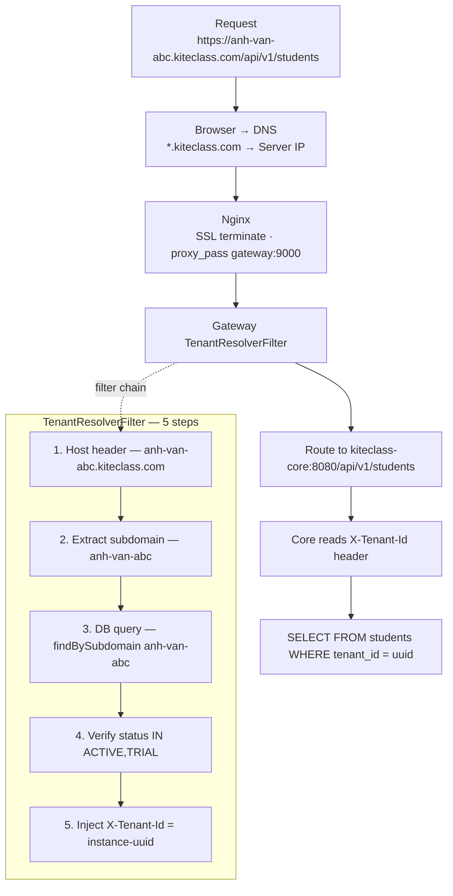

# KiteHub Domain Management — Business & Technical Guide

**Ngày tạo:** 2026-03-23
**Domain chính:** kitehub.vn (SaaS platform), kiteclass.com (tenant instances)

---

## 1. Domain Architecture

```
kitehub.vn                    ← SaaS Platform (đăng ký, quản lý, billing)
├── kitehub.vn/pricing
├── kitehub.vn/blog
└── kitehub.vn/dashboard/*

kiteclass.com                 ← Tenant Landing Pages
├── {subdomain}.kiteclass.com ← Instance URL (auto, free)
│   Ví dụ: anh-van-abc.kiteclass.com
│          stem-center.kiteclass.com
│
└── Custom domain             ← Premium/Enterprise only
    Ví dụ: school.example.com → maps to instance
```

### Tại sao 2 domain?

| Domain | Mục đích | SEO |
|--------|----------|-----|
| **kitehub.vn** | Marketing, đăng ký, admin dashboard | SEO cho "phần mềm quản lý giáo dục" |
| **kiteclass.com** | Tenant instances (trường/trung tâm) | SEO cho từng trường riêng |

**Lý do tách biệt:**
- kitehub.vn là B2B (bán cho chủ trung tâm)
- kiteclass.com là B2C (học viên, giáo viên truy cập)
- Wildcard SSL chỉ cần cho `*.kiteclass.com`
- CORS tách biệt rõ ràng

---

## 2. Subdomain — Tự động khi đăng ký

### Flow đăng ký

```
1. Chủ trung tâm vào kitehub.vn/register
2. Nhập: tên trung tâm, email, mật khẩu
3. Chọn subdomain: "anh-van-abc"
   └── Validate: ^[a-z0-9-]+$, 3-50 ký tự, unique
4. Tạo instance → status: PENDING
5. Gửi email xác nhận
6. Xác nhận → status: TRIAL (14 ngày)
7. Instance URL: https://anh-van-abc.kiteclass.com
```

### Validation rules

| Rule | Giá trị |
|------|---------|
| Pattern | `^[a-z0-9-]+$` (chữ thường, số, gạch ngang) |
| Độ dài | 3-50 ký tự |
| Unique | Không trùng (kể cả đã deleted) |
| Reserved | admin, api, www, mail, ftp, test, staging, dev |

### Subdomain reserved list (cần implement)

```
RESERVED_SUBDOMAINS = [
  "admin", "api", "www", "mail", "ftp", "smtp",
  "test", "staging", "dev", "demo", "app",
  "billing", "support", "help", "docs",
  "status", "cdn", "assets", "static",
  "ns1", "ns2", "mx", "pop", "imap"
]
```

---

## 3. Custom Domain — Premium/Enterprise

### Ai được dùng?

| Tier | Subdomain | Custom Domain |
|------|-----------|---------------|
| FREE | ✅ `xxx.kiteclass.com` | ❌ |
| BASIC | ✅ `xxx.kiteclass.com` | ❌ |
| PREMIUM | ✅ `xxx.kiteclass.com` | ✅ 1 domain |
| ENTERPRISE | ✅ `xxx.kiteclass.com` | ✅ unlimited |

### Quy trình setup Custom Domain

```
Bước 1: Chủ trung tâm (Premium+)
  └── Dashboard → Settings → Custom Domain
  └── Nhập: school.example.com

Bước 2: Hệ thống kiểm tra
  ├── Tier phải là PREMIUM hoặc ENTERPRISE
  ├── Domain format hợp lệ
  └── Domain chưa được dùng bởi instance khác

Bước 3: Hướng dẫn cấu hình DNS
  └── Hiển thị: "Thêm CNAME record:"
      school.example.com CNAME kiteclass.com
      HOẶC
      school.example.com A {server-ip}

Bước 4: Verify DNS (tự động hoặc nút "Verify")
  ├── Resolve school.example.com
  ├── Check trỏ đúng IP/CNAME
  └── Status: PENDING → VERIFIED → ACTIVE

Bước 5: SSL Certificate
  ├── Auto: Let's Encrypt (certbot --webroot)
  ├── Hoặc: Customer upload certificate
  └── Nginx reload sau khi có cert

Bước 6: Done
  └── https://school.example.com → instance hoạt động
```

### DNS Verification Flow (cần implement)

```java
// CustomDomainService.java
public DomainVerification verifyDomain(UUID instanceId, String domain) {
    // 1. Check DNS resolution
    InetAddress[] addresses = InetAddress.getAllByName(domain);

    // 2. Check trỏ đúng server IP hoặc CNAME
    boolean pointsToUs = checkDNSTarget(addresses, OUR_IP);

    // 3. Check HTTP challenge (optional)
    // PUT /.well-known/acme-challenge/{token} vào instance

    return DomainVerification.builder()
        .domain(domain)
        .status(pointsToUs ? VERIFIED : PENDING)
        .message(pointsToUs ? "DNS verified" : "DNS chưa trỏ đúng")
        .build();
}
```

---

## 4. DNS Configuration — Production

### DNS Records cần thiết

```
# kitehub.vn (SaaS platform)
kitehub.vn            A       {Oracle LB IP}
www.kitehub.vn        CNAME   kitehub.vn

# kiteclass.com (Tenant instances)
kiteclass.com         A       {Oracle LB IP}
*.kiteclass.com       A       {Oracle LB IP}      ← Wildcard cho tất cả subdomain
api.kiteclass.com     A       {Oracle LB IP}
cdn.kiteclass.com     CNAME   {S3/CloudFront}     ← Assets CDN

# MX Records (email)
kitehub.vn            MX 10   mail.kitehub.vn
```

### DNS Provider recommend

| Provider | Wildcard | Free | Recommend |
|----------|----------|------|-----------|
| Cloudflare | ✅ | ✅ (free tier) | ✅ **Best choice** |
| Route53 (AWS) | ✅ | ❌ ($0.50/zone) | Nếu dùng AWS |
| Oracle DNS | ✅ | ✅ (free tier) | Nếu dùng OCI |

**Recommend: Cloudflare** — free, wildcard SSL, DDoS protection, CDN.

---

## 5. SSL/TLS Certificates

### Chiến lược SSL

```
LAYER 1: Cloudflare Proxy (recommend)
├── *.kiteclass.com    → Cloudflare Universal SSL (free, auto)
├── kitehub.vn         → Cloudflare Universal SSL (free, auto)
└── Custom domains     → Cloudflare for SaaS (Advanced Certificate)

LAYER 2: Origin Certificate (server)
├── Let's Encrypt wildcard: *.kiteclass.com
├── Let's Encrypt: kitehub.vn
└── Custom domains: certbot per domain

HOẶC (đơn giản hơn):

Cloudflare Full (Strict) mode:
├── Cloudflare handles ALL SSL termination
├── Origin cert: Cloudflare Origin CA (15 year, free)
└── Không cần Let's Encrypt trên server
```

### Custom Domain SSL

```
Option A: Cloudflare for SaaS (recommend)
├── Cloudflare tự cấp SSL cho custom domain
├── Customer chỉ cần CNAME → kiteclass.com
├── Giá: Free (100 custom hostnames) hoặc $0.10/hostname/month
└── Setup: 1 lần cho platform, auto cho mỗi customer

Option B: Let's Encrypt per domain
├── certbot certonly --webroot -d school.example.com
├── Auto-renew via cron
├── Nginx reload sau khi renew
└── Nhược điểm: phải quản lý cert cho mỗi customer
```

---

## 6. Nginx Configuration — Production

```nginx
# ============================================
# kitehub.vn — SaaS Platform
# ============================================
server {
    listen 443 ssl http2;
    server_name kitehub.vn www.kitehub.vn;

    ssl_certificate     /etc/nginx/ssl/kitehub.vn/fullchain.pem;
    ssl_certificate_key /etc/nginx/ssl/kitehub.vn/privkey.pem;

    location / {
        proxy_pass http://127.0.0.1:3001;  # kitehub-frontend
        proxy_set_header Host $host;
        proxy_set_header X-Real-IP $remote_addr;
        proxy_set_header X-Forwarded-Proto $scheme;
    }

    location /api/ {
        proxy_pass http://10.0.1.10:9000;  # kitehub-gateway (VM1)
        proxy_set_header Host $host;
        proxy_set_header X-Real-IP $remote_addr;
        proxy_set_header X-Forwarded-Proto $scheme;
    }
}

# ============================================
# *.kiteclass.com — Tenant Instances
# ============================================
server {
    listen 443 ssl http2;
    server_name *.kiteclass.com;

    ssl_certificate     /etc/nginx/ssl/kiteclass.com/fullchain.pem;
    ssl_certificate_key /etc/nginx/ssl/kiteclass.com/privkey.pem;

    # Tenant frontend
    location / {
        proxy_pass http://127.0.0.1:3000;  # kiteclass-frontend
        proxy_set_header Host $host;
        proxy_set_header X-Real-IP $remote_addr;
        proxy_set_header X-Forwarded-Proto $scheme;
    }

    # Tenant API (qua gateway với TenantResolver)
    location /api/ {
        proxy_pass http://10.0.1.10:9000;  # kitehub-gateway
        proxy_set_header Host $host;        # QUAN TRỌNG: giữ Host header
        proxy_set_header X-Real-IP $remote_addr;
        proxy_set_header X-Forwarded-Proto $scheme;
    }
}

# ============================================
# Custom Domains — Dynamic (include từ file)
# ============================================
include /etc/nginx/conf.d/custom-domains/*.conf;
# Mỗi file: server { server_name school.example.com; ... }

# ============================================
# HTTP → HTTPS Redirect
# ============================================
server {
    listen 80;
    server_name kitehub.vn www.kitehub.vn *.kiteclass.com;
    return 301 https://$host$request_uri;
}

# ============================================
# api.kiteclass.com — Direct API Access
# ============================================
server {
    listen 443 ssl http2;
    server_name api.kiteclass.com;

    ssl_certificate     /etc/nginx/ssl/kiteclass.com/fullchain.pem;
    ssl_certificate_key /etc/nginx/ssl/kiteclass.com/privkey.pem;

    location / {
        proxy_pass http://10.0.1.10:9000;
        proxy_set_header Host $host;
        proxy_set_header X-Real-IP $remote_addr;
        proxy_set_header X-Forwarded-Proto $scheme;
    }
}
```

---

## 7. Tenant Resolution — Technical Flow



---

## 8. Hiện trạng vs Cần làm

### ✅ Đã implement

| Feature | Status | File |
|---------|--------|------|
| Subdomain validation (regex) | ✅ | CreateInstanceRequest.java |
| Subdomain uniqueness check | ✅ | InstanceRepository |
| TenantResolver filter | ✅ | TenantResolverGatewayFilterFactory.java |
| Custom domain DB field | ✅ | Instance.java |
| Custom domain lookup | ✅ | Gateway InstanceRepository |
| Tier-based custom domain | ✅ | PricingTier.allowsCustomDomain() |
| Frontend URL generation | ✅ | tenant-url.ts |
| Nginx production config | ✅ | kitehub/nginx/nginx.conf |

### ❌ Chưa implement / Gaps

| Feature | Priority | Effort |
|---------|----------|--------|
| Reserved subdomain list | 🔴 P0 | 1 hr |
| DNS verification service | 🟠 P1 | 0.5 day |
| Custom domain SSL automation | 🟠 P1 | 1 day |
| Custom domain UI (dashboard) | 🟠 P1 | 0.5 day |
| Nginx dynamic config reload | 🟡 P2 | 0.5 day |
| Cloudflare for SaaS integration | 🟡 P2 | 1 day |
| Domain health monitoring | 🟡 P2 | 0.5 day |
| BASE_DOMAIN configurable (hardcoded .kiteclass.com) | 🔴 P0 | 1 hr |

---

## 9. Hướng dẫn cho Customer (tiếng Việt)

### Subdomain (tất cả các gói)

```
✅ Khi bạn đăng ký, hệ thống tự động tạo:
   https://{tên-bạn-chọn}.kiteclass.com

   Ví dụ: Bạn chọn "anh-van-abc"
   → URL: https://anh-van-abc.kiteclass.com

   Quy tắc đặt tên:
   - Chỉ dùng chữ thường (a-z), số (0-9), gạch ngang (-)
   - Tối thiểu 3, tối đa 50 ký tự
   - Không được trùng với tên đã có
   - Ví dụ hợp lệ: trung-tam-abc, stem-center-2026
   - Ví dụ KHÔNG hợp lệ: Trung_Tam (viết hoa, gạch dưới)
```

### Custom Domain (Premium/Enterprise)

```
🌐 Sử dụng tên miền riêng (ví dụ: school.example.com)

Bước 1: Vào Dashboard → Cài đặt → Tên miền tùy chỉnh
Bước 2: Nhập tên miền: school.example.com
Bước 3: Cấu hình DNS tại nhà cung cấp domain của bạn:
         Thêm record: CNAME  school  kiteclass.com
         (Hoặc: A record  school  {IP được cung cấp})
Bước 4: Chờ DNS cập nhật (5 phút - 48 giờ)
Bước 5: Nhấn "Xác nhận" → Hệ thống kiểm tra DNS
Bước 6: SSL certificate tự động cấp
Bước 7: ✅ Truy cập: https://school.example.com
```

---

## 10. PRs cần thêm vào SaaS Implementation Plan

| PR | Scope | Priority | Effort |
|----|-------|----------|--------|
| PR-SAAS-14: Reserved subdomain list | Validate against reserved names | 🔴 P0 | 1 hr |
| PR-SAAS-15: Configurable BASE_DOMAIN | Remove hardcoded `.kiteclass.com` | 🔴 P0 | 1 hr |
| PR-SAAS-16: Custom domain UI + DNS verify | Dashboard settings page + verification | 🟠 P1 | 1 day |
| PR-SAAS-17: SSL automation (Cloudflare/certbot) | Auto SSL for custom domains | 🟡 P2 | 1 day |
