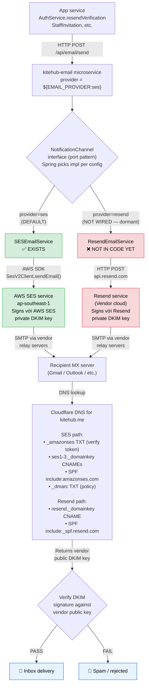

# Email Architecture — SES + Resend dual-vendor

**Created:** 2026-05-18
**Last Updated:** 2026-05-18
**Audience:** dev
**Scope:** `kitehub-email` microservice email delivery path + vendor identity verification rationale

---

## TL;DR

KiteHub có **2 email vendor independent**: AWS SES (production primary) + Resend (provisioned dormant backup). Code hiện chỉ dùng SES qua `SESEmailService.java`. Resend mới chỉ có API key trong AWS Secrets Manager, **chưa wired** vào `NotificationChannel`.

**Mỗi vendor cần domain identity verification ĐỘC LẬP** (DKIM keys của AWS ≠ DKIM keys của Resend) — verify Resend không thay thế cần verify SES.

---

## 1. Why dual-vendor?

| Aspect | AWS SES | Resend |
|---|---|---|
| **Loại** | Cloud-native (AWS) | Vendor SaaS (3rd-party) |
| **Cost (Phase 1 BETA scale)** | 62k email/mo FREE từ EC2 | Free tier 3k/mo, paid $20/mo cho 50k |
| **DX (Developer Experience)** | Verbose AWS SDK | Simple HTTP API |
| **Deliverability** | High (AWS reputation) | High (focused email vendor) |
| **VN region** | ap-southeast-1 native (PDPL win) | US/EU regions (data localization concern) |
| **Production approval** | Sandbox → request approval 24-72h | Sometimes immediate verify |
| **Identity verification scope** | Per AWS account + region | Per Resend workspace |

### Tại sao project có cả 2

1. **SES = primary** vì:
   - VN data residency (ap-southeast-1)
   - Cheaper at scale
   - AWS-native (cùng infrastructure stack)

2. **Resend = backup provisioned** vì:
   - SES sandbox approval lag (need approval to send to non-verified emails)
   - Fallback nếu SES outage hoặc quota exhausted
   - Easier DX khi cần ship nhanh (Wave 81 originally bootstrap khi SES approval pending)

3. **Identity verification ĐỘC LẬP** vì:
   - DKIM signature dùng vendor's private key (AWS SES có key của AWS; Resend có key của Resend)
   - Recipient verify DKIM bằng public key trong DNS — DNS records phải khớp vendor
   - Domain `kitehub.me` có thể có DNS records cho CẢ HAI vendor cùng lúc (không xung đột)

---

## 2. Current code wiring (verified 2026-05-18)

| Component | Status |
|---|---|
| `email.provider` config default | `ses` (per `kitehub/kitehub-email/src/main/resources/application-production.yml`) |
| `SESEmailService.java` | ✅ Implements `NotificationChannel` interface |
| `ResendEmailService.java` | ❌ **KHÔNG tồn tại trong code** |
| `RESEND_API_KEY` secret in AWS Secrets Manager | ✅ Provisioned Wave 81 (per GAP-525) |
| Resend domain DKIM/SPF in Cloudflare DNS | ⚠️ Per `documents/05-guides/deploy/resend-provisioning-runbook.md` (status chưa verify wired end-to-end) |
| SES domain DKIM/SPF | ⚠️ Per old account; **cần re-verify với new account** (GAP-612 recovery) |
| `email.provider=resend` override | Hỗ trợ qua env var nhưng provider impl chưa có code → runtime fail |

**Net:** Resend = provisioned nhưng dormant. Tất cả email production hiện đi qua SES.

---

## 3. Email send flow diagram

Diagram dưới đây dùng Mermaid `flowchart` per `.claude/rules/diagram-format-selection.md` v1.0.0 §2.2 row "Architecture (box + arrow)" — GitHub render trực tiếp; sender → vendor → recipient MX → DNS verify chain hiển thị rõ.

**Caption:** Mỗi vendor (SES + Resend) độc lập về DKIM key. Recipient MX verify signature bằng public key tại DNS path vendor đặc thù. Vendor identity verification độc lập = vì sao verify Resend KHÔNG transfer sang SES (và ngược lại).

---

## 4. Identity verification rationale

### Vì sao không thể "share" identity giữa 2 vendor?

DKIM signature mechanism:

1. **Email vendor sign** email với **private DKIM key** vendor đó tự generate (vendor-owned, không tiết lộ)
2. **Vendor publish public key** vào DNS của domain (vd `ses1._domainkey.kitehub.me`)
3. **Recipient MX server** (Gmail, Outlook) khi nhận email:
   - Đọc `DKIM-Signature` header → biết signer là vendor X
   - Look up public key tại DNS path vendor X chỉ định
   - Verify signature → confirm email genuinely sent by vendor X authorized to send for domain

Vì:
- **AWS SES private key ≠ Resend private key** (different vendors, different infrastructure)
- **DNS records cho SES ≠ DNS records cho Resend** (different DKIM selector names)
- **Recipient không trust kitehub.me intrinsically** — họ trust signed signature từ specific vendor

→ Verify SES không transfer sang Resend (và ngược lại). Mỗi vendor independent identity.

### Khi nào cần verify

| Scenario | Vendor verify needed |
|---|---|
| Setup new AWS account → email từ SES | ✅ SES domain verify + DKIM CNAMEs + SPF include + production approval |
| Setup Resend lần đầu | ✅ Resend domain verify + DKIM + SPF include (one-time) |
| Switch primary SES → Resend | ❌ Nếu Resend đã verify trước đó; CÓ nếu chưa |
| New AWS account khi Resend đã verify | ✅ SES re-verify required (independent); Resend unaffected |
| Change email provider runtime (env var) | ❌ Không cần re-verify nếu cả 2 đã verified trước |

---

## 5. Apply to GAP-612 AWS account re-setup

Khi setup AWS account mới:

| What | Required? | Reason |
|---|---|---|
| Re-verify **SES** domain identity với new account | ✅ MANDATORY | SES identity bound to specific AWS account; new account = fresh SES sandbox |
| Re-add SES DKIM CNAMEs (3 records) vào Cloudflare DNS | ✅ MANDATORY | AWS generate new DKIM keys cho new account |
| Re-submit SES production approval request | ✅ MANDATORY | Approval tied to AWS account, không transfer |
| Re-add SPF include `amazonses.com` (already in SPF likely) | ⚠️ Verify | SPF record can have multiple includes |
| Re-verify **Resend** domain identity | ❌ NOT needed | Resend workspace independent of AWS |
| Re-add Resend DKIM/SPF DNS records | ❌ NOT needed | Domain DNS records cho Resend unchanged |

**Net DNS work:** ~15 min DNS update (Cloudflare) + 24-72h async wait cho SES production approval.

---

## 6. Future migration: Resend → primary

Nếu muốn pivot Resend làm primary thay vì SES:

1. **Code change**: implement `ResendEmailService implements NotificationChannel` (~2-4h)
2. **Config flip**: `EMAIL_PROVIDER=resend` env var
3. **DNS**: Resend DKIM/SPF đã có (per Wave 81 provisioning runbook) — không cần thêm
4. **No AWS dependency** cho email path → SES có thể disable hoặc giữ làm backup

Tracked gaps:
- GAP-533 Resend deliverability warmup-dkim-dmarc-spf (P1 OPEN)
- GAP-572 Resend secret schema-mismatch + leak rotate (DONE Wave 81)
- GAP-608 EC2 IAM ses:SendEmail (Agent 1 flagged possibly obsolete if Resend pivot)

---

## 7. Anti-patterns + common confusions

| ❌ Confusion | ✅ Reality |
|---|---|
| "Resend đã setup rồi sao phải verify SES nữa?" | Resend dormant; SES = production. Vendor identity independent. |
| "Domain kitehub.me verify 1 lần là xong" | Each vendor có DKIM selector riêng; verify per-vendor per-account |
| "DNS đầy SES + Resend records" | OK — coexist, không xung đột (different selector names) |
| "Email failed nên Resend giúp được" | Chỉ giúp nếu code wire qua ResendEmailService — chưa có |
| "Switch provider qua env var là xong" | Code phải có impl cho provider đó; SES có, Resend chưa |

---

## 8. Related artifacts

- Code: `kitehub/kitehub-email/src/main/java/com/kitehub/email/service/SESEmailService.java`
- Code: `kitehub/kitehub-email/src/main/java/com/kitehub/email/api/NotificationChannel.java` (interface)
- Config: `kitehub/kitehub-email/src/main/resources/application-production.yml`
- Runbook: `documents/05-guides/deploy/email-ses-setup-runbook.md`
- Runbook: `documents/05-guides/deploy/resend-provisioning-runbook.md`
- Runbook: `documents/05-guides/deploy/email-deliverability-runbook.md`
- Audit estimate: `documents/04-quality/audits/aws-verification/2026-05-18-aws-account-recreation-estimate.md` §5 (SES re-verify steps)
- ADR: `documents/02-architecture/adr/` (search for email/SES decision)
- Gap: GAP-370 (Email transactional infrastructure) — parent
- Gap: GAP-533 (Resend deliverability) — secondary vendor scope
- Gap: GAP-608 (EC2 SES IAM perm) — primary vendor scope
