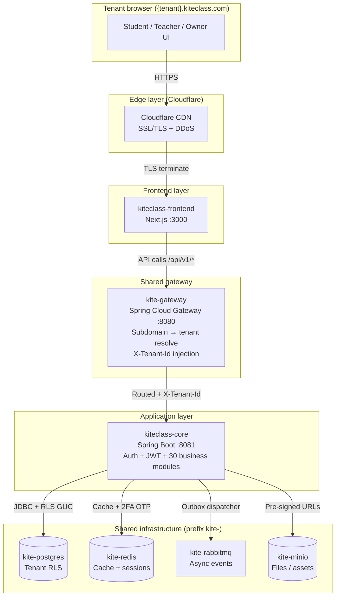
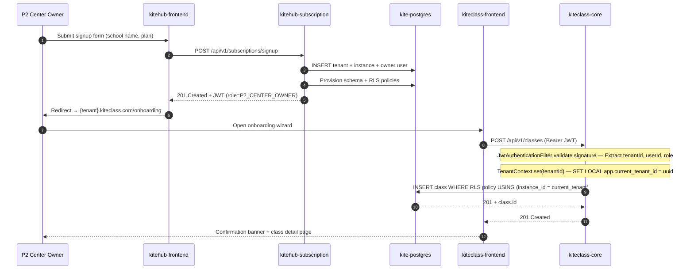
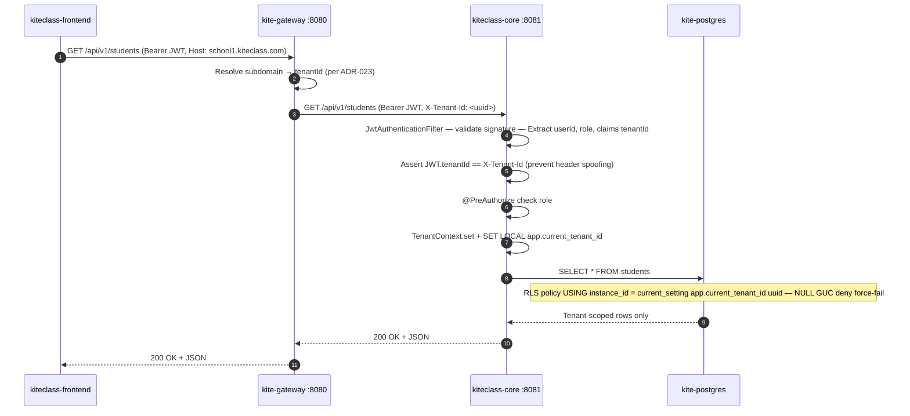
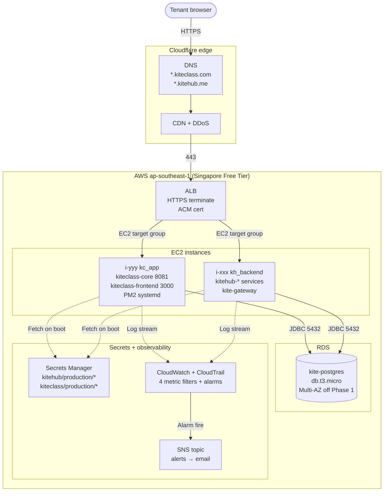

# KiteClass Architecture

> **TL;DR** — KiteClass là multi-tenant education platform; 1 tenant = 1 trường/trung tâm. Lifecycle (trial / subscription / billing / domain) do KiteHub quản lý; KiteClass xử lý nghiệp vụ giáo dục (course, class, attendance, grade, payment, gamification, LMS). Phase 1 BETA share AWS EC2 stack + shared `kite-postgres` + shared `kite-gateway` với KiteHub. Phase 2+ migrate EKS. Phase 3 mở K-12 (parent portal, child protection, MOET integrations) sau khi counsel review.

Sister document: [`kitehub-architecture.md`](./kitehub-architecture.md).

---

## 1. Overview

KiteClass là sản phẩm thứ hai trong Kite Platform — đối tác của KiteHub:

| Vai trò | KiteHub | KiteClass |
|---|---|---|
| Phạm vi | SaaS provider | Education business platform |
| Đối tượng | Center owners / school admins (B2B buyers) | Teachers / students / parents (end users) |
| Lifecycle | Trial, subscription, billing, domain provisioning | Course, class, attendance, grade, payment, gamification |
| Tenant model | 1 tenant = 1 customer organization | 1 tenant per school/center — multi-tenant single deployment |

Tenant truy cập platform qua subdomain `{tenant}.kiteclass.com`. Shared `kite-gateway` (per [ADR-023](./adr/ADR-023-gateway-key-resolver-strategy.md)) resolve subdomain → tenant ID → forward request với header `X-Tenant-Id` tới `kiteclass-core`.

### 1.1 High-level architecture



**Note (Wave 96, [ADR-032](./adr/ADR-032-kiteclass-gateway-removal.md)):** `kiteclass-gateway` đã được removed. Auth/JWT/migrations/user-management chuyển vào `kiteclass-core`; routing upstream do shared `kite-gateway` đảm nhiệm.

---

## 2. Services

| Service | Tech Stack | Port | Responsibility |
|---|---|---|---|
| **kiteclass-core** | Spring Boot 3.x / Java 17 | 8081 | JWT issuance + validation, Flyway DB migrations, user management, 30 business modules (xem §5) |
| **kiteclass-frontend** | Next.js 14 / TypeScript | 3000 | Student / teacher / owner / admin UI; SSR + ISR |
| ~~kiteclass-gateway~~ | — | — | **REMOVED Wave 96 per ADR-032.** Routing → shared `kite-gateway`; auth → `kiteclass-core`. |

Routing upstream (subdomain → tenant resolve → forward) do shared `kite-gateway` (a.k.a. `kitehub-gateway`) đảm nhiệm — xem [ADR-023](./adr/ADR-023-gateway-key-resolver-strategy.md).

---

## 3. Authentication & Authorization (post-ADR-032)

### 3.1 Authn — JWT-based tenant authn

| Component | Vai trò | Notes |
|---|---|---|
| **Tenant JWT publisher** | `kitehub-subscription` (KiteHub side) phát hành JWT khi tenant signup / login từ KiteHub portal | JWT chứa `tenantId`, `userId`, `role`, `instanceId` |
| **Direct user JWT publisher** | `kiteclass-core` (auth module) phát hành JWT khi end-user (teacher / student) login qua `{tenant}.kiteclass.com/login` | Same JWT shape — single signature key (KMS-rotated) |
| **JWT validator** | `kiteclass-core` validate JWT signature + check expiry trên mọi authenticated endpoint | Spring Security `JwtAuthenticationFilter` |
| **Token rotation** | Refresh token rotation; blacklist on refresh reuse | Per `pre-launch-auth-hardening-checklist.md` §2.8 |

### 3.2 Authz — Spring Security `@PreAuthorize` annotations

Roles defined ([ADR-003 Role Hierarchy](./adr/ADR-003-role-hierarchy.md)):

| Role | Scope | Phase |
|---|---|---|
| `P2_CENTER_OWNER` | Toàn quyền trong tenant (chủ trung tâm) | Phase 1 BETA |
| `P3_CENTER_MANAGER` | Quản lý vận hành (không billing) | Phase 1 BETA |
| `P1_SOLO_TEACHER` | Cá nhân giáo viên (no center) | Phase 1 BETA |
| `TEACHER` | Giáo viên thuộc 1 tenant | Phase 1 BETA |
| `STUDENT` | Học viên / phụ huynh thuộc 1 tenant | Phase 1 BETA |
| `PARENT` | Phụ huynh K-12 (parent portal scope) | Phase 3 K-12 LEGAL-gated |

Controllers áp `@PreAuthorize("hasRole('P2_CENTER_OWNER')")` hoặc `@PreAuthorize("hasAnyRole('TEACHER', 'P3_CENTER_MANAGER')")` per endpoint. Áp dụng `audit-service-isolation.md` cho admin scope (paired aspect + immutable log multi-layer defense).

### 3.3 Tenant signup → first class create (sequence)



### 3.4 Authenticated request flow (every API call)



---

## 4. Multi-tenant isolation (layered defense)

KiteClass áp dụng "Pool" multi-tenant model per AWS Well-Architected SaaS Lens — shared DB + per-row tenant isolation với defense ở 2 layer:

```mermaid
flowchart TD
    Request[HTTP Request<br/>Bearer JWT]
    JWT{JWT valid?}
    JWTCheck[JwtAuthenticationFilter<br/>Extract tenantId from JWT claim]
    HeaderCheck{JWT.tenantId<br/>== X-Tenant-Id?}
    TenantCtx[TenantContext.set tenantId<br/>thread-local]

    DSIntercept[TenantAwareDataSourceInterceptor<br/>@Transactional boundary]
    GUC[SET LOCAL<br/>app.current_tenant_id = uuid]

    L1[Layer 1 — Hibernate filter<br/>tenantFilter @FilterDef<br/>WHERE instance_id = :tenantId]
    L2[Layer 2 — Postgres RLS<br/>FORCE ROW LEVEL SECURITY<br/>USING instance_id = GUC]

    Query[SELECT / INSERT / UPDATE / DELETE]
    Rows[Tenant-scoped rows only]

    Request --> JWT
    JWT -->|No| Reject1[401 Unauthorized]
    JWT -->|Yes| JWTCheck
    JWTCheck --> HeaderCheck
    HeaderCheck -->|Mismatch| Reject2[403 Forbidden<br/>Tenant header spoof]
    HeaderCheck -->|Match| TenantCtx
    TenantCtx --> DSIntercept
    DSIntercept --> GUC
    GUC --> L1
    L1 --> L2
    L2 --> Query
    Query --> Rows

    Empty[TenantContext empty<br/>e.g. background job miss setup] -.->|GUC stays NULL| L2
    L2 -.->|NULL force-fail<br/>default deny| EmptyResult[0 rows]
```

### 4.1 Layer 1 — Code (Hibernate filter)

- Mọi entity extend `BaseEntity` declare `@Column("instance_id")` + `tenantFilter` Hibernate `@FilterDef`.
- `TenantFilterInterceptor` enable filter per HTTP request từ `X-Tenant-Id` header.
- **Bypassable** bởi custom JPQL / native SQL / projection DTO quên filter — đây là lý do cần Layer 2.

### 4.2 Layer 2 — Database (RLS policy)

- Mọi tenant-scoped table có `ENABLE ROW LEVEL SECURITY` + `FORCE ROW LEVEL SECURITY` + `tenant_isolation` policy `USING (instance_id = current_setting('app.current_tenant_id', true)::uuid)`.
- `TenantAwareDataSourceInterceptor` issue `SET LOCAL app.current_tenant_id = <uuid>` tại mọi `@Transactional` boundary.
- **NULL GUC force-fail** (per Wave 85 Bucket B security hardening) — nếu `TenantContext` empty, GUC stay NULL → policy default deny → 0 rows (eliminate silent cross-tenant leak).
- `HikariCP` reset GUC khi return connection vào pool (prevent leak across requests).

### 4.3 Break-glass

Documented in [`documents/05-guides/operations/runbooks/rls-policy-violation.md`](../05-guides/operations/runbooks/rls-policy-violation.md). DB superuser only; mọi invocation log audit trail (immutable `admin_audit_logs` table per V60 migration).

---

## 5. Business modules (kiteclass-core)

Tất cả 30 module dưới `kiteclass/kiteclass-core/src/main/java/com/kiteclass/core/module/`. Mỗi module follow Spring Boot package convention (`controller/`, `service/`, `repository/`, `entity/`, `dto/`).

### 5.1 Phase 1 BETA scope (P1 + P2 personas)

| Module | Mô tả ngắn |
|---|---|
| `student` | Hồ sơ học viên + quản lý cơ bản |
| `teacher` | Hồ sơ giáo viên + phân công |
| `course` | Catalog khóa học + config |
| `clazz` | Lớp học (instance của course) + lịch học |
| `enrollment` | Đăng ký học viên vào lớp |
| `attendance` | Điểm danh + báo cáo có mặt |
| `grade` | Điểm số + thang điểm + xếp loại |
| `assignment` | Bài tập + nộp bài + chấm |
| `payment` | Xử lý thanh toán (QR / chuyển khoản) |
| `invoice` | Hóa đơn + công nợ học phí |
| `gamification` | Điểm thưởng + huy hiệu (student engagement) |
| `lms` | Modules học liệu + lessons + tracking progress |
| `marketing` | Contact messages + leads + landing page |
| `settings` | Branding tenant + user preferences + tenant config |
| `storage` | Upload/download file qua MinIO + pre-signed URL |
| `branding` | AI-generated assets per tenant (override default) |
| `role` | Role assignment + permission catalog |
| `instance` | Tenant lifecycle metadata (subscription tier, expiry) |

### 5.2 Phase 2+ extended scope

| Module | Mô tả ngắn | Phase trigger |
|---|---|---|
| `payroll` | Lương giáo viên + commission | Phase 2 medium-center P3 |
| `reportcard` | Học bạ tổng hợp (formal) | Phase 2 |
| `academicyear` | Năm học + học kỳ ([ADR-002](./adr/ADR-002-academic-year-structure.md)) | Phase 2 |
| `quality` | KPI lớp / giáo viên / trung tâm | Phase 2 |
| `document` | Sinh tài liệu (Word/PDF) per [ADR-019](./adr/ADR-019-document-generation-architecture.md) | Phase 2 |
| `provisioning` | Auto-provisioning resource theo plan | Phase 2 |
| `retention` | Data retention policy (per [ADR-013](./adr/ADR-013-data-retention-classification.md)) | Phase 2 |
| `ai` | AI-orchestrated features (per [ADR-006](./adr/ADR-006-ai-agent-orchestration.md)) | Phase 2 |
| `legal` | Trademark / DMCA workflow (per [ADR-012](./adr/ADR-012-dmca-trademark-workflow.md)) | Phase 2 |

### 5.3 Phase 3 K-12 LEGAL-gated scope

| Module | Mô tả ngắn | Phase trigger |
|---|---|---|
| `k12` | K-12 specific data model ([ADR-001](./adr/ADR-001-k12-data-model.md)) | Phase 3 — counsel review required |
| `parent` | Phụ huynh portal (P3 K-12) | Phase 3 |
| `childprotection` | Child safety workflow + reporting | Phase 3 (PDPL Art 11 + MPS) |
| `moderation` | Content moderation policy ([ADR-010](./adr/ADR-010-content-moderation-policy.md)) | Phase 3 |

### 5.4 Shared infrastructure modules (`common/`)

| Path | Vai trò |
|---|---|
| `common/security/` | CSRF token provider, SVG sanitizer, URL allowlist validator |
| `common/context/` | TenantContext (thread-local), UserContext |
| `common/datasource/` | TenantAwareDataSourceInterceptor (RLS GUC setup) |
| `common/audit/` | `admin_audit_logs` writer (immutable, append-only) |
| `common/outbox/` | Outbox pattern dispatcher ([ADR-007](./adr/ADR-007-outbox-pattern-for-events.md), [ADR-021](./adr/ADR-021-per-module-outbox-vs-shared-lib.md)) |
| `common/exception/` | RFC 7807 problem-detail handlers |
| `common/entity/` | `BaseEntity` (auto inject `instance_id`, audit timestamps) |

---

## 6. Shared infrastructure (reuse from KiteHub)

KiteClass dùng chung mọi shared infra component với KiteHub — prefix `kite-`:

| Component | Container | Cách KiteClass dùng |
|---|---|---|
| **PostgreSQL** | `kite-postgres` | Shared DB; `kiteclass-core` own Flyway migrations folder `db/migration/`; tenant isolation qua `instance_id` column + RLS policy |
| **Redis** | `kite-redis` | Cache (DB key prefix `kiteclass:`), 2FA OTP, session data |
| **RabbitMQ** | `kite-rabbitmq` | Async events giữa modules (payment → invoice, enrollment → LMS, assignment → gamification) qua outbox dispatcher |
| **MinIO** | `kite-minio` | Files: assignments, profile images, branding assets, generated documents. Bucket per-tenant via prefix |
| **Gateway** | `kite-gateway` (a.k.a. `kitehub-gateway`) | Single gateway boundary cho cả KiteHub + KiteClass; routing rules: `/api/v1/subscriptions/*` → kitehub-subscription, `/api/v1/courses/*` + `/api/v1/classes/*` + `/api/v1/students/*` + 27 paths khác → kiteclass-core |

Canonical docker-compose: [`kitehub/docker-compose.kitehub.yml`](../../kitehub/docker-compose.kitehub.yml) (integrated mode — KiteClass services chạy cạnh KiteHub stack).

### 6.1 Async event flow (RabbitMQ + outbox)

| Event publisher | Event consumer | Trigger |
|---|---|---|
| `payment.completed` | `invoice` module | Khi tenant thanh toán → tạo hóa đơn VAT |
| `enrollment.created` | `lms` module | Khi đăng ký học → enable LMS access cho student |
| `assignment.graded` | `gamification` module | Khi chấm bài → cộng điểm engagement |
| `attendance.recorded` | `parent` module (Phase 3) | Khi điểm danh → notify phụ huynh |

Outbox pattern guarantee at-least-once delivery; consumer idempotent qua `event_id` dedup ([ADR-007](./adr/ADR-007-outbox-pattern-for-events.md)).

---

## 7. Deployment topology

### 7.1 Phase 1 BETA (AWS Singapore Free Tier)

Per [ADR-025](./adr/ADR-025-aws-only-deploy-phase-1-free-tier.md): shared AWS EC2 stack với KiteHub. KiteClass services chạy cùng EC2 instance `kc-app` (Spring Boot core + Next.js FE qua PM2 systemd).



### 7.2 Phase 2+ migration (EKS)

Tracked GAP-415 + GAP-479. Khi tenant volume vượt single-EC2 capacity, migrate sang EKS (per [ADR-028](./adr/ADR-028-ecs-fargate-vs-eks-phase-1-beta.md) — defer EKS đến Phase 2). Helm charts trong `infrastructure/helm/`; manifests trong `infrastructure/k8s/`.

### 7.3 Development environment

- `kiteclass/docker-compose.dev.yml` — standalone sandbox cho KiteClass services (post-ADR-032: không còn `kiteclass-gateway`).
- Scripts: `kiteclass/scripts/` — đừng chạy docker commands trực tiếp.
- Canonical compose for integrated stack: `kitehub/docker-compose.kitehub.yml` (xem CLAUDE.md §Docker Naming Convention).

---

## 8. K-12 LEGAL scope (Phase 3 gated)

Phase 3 trigger per [`release-1-plan-2026.md`](../03-planning/roadmap/release-1-plan-2026.md) §Phase 3: counsel engaged + 4 sub-conditions (DPO + DPIA + MPS A05 + child-protection workflow). Áp dụng `business-logic-review.md` + counsel sign-off trước khi enable.

| Scope | Tracking gaps |
|---|---|
| Parent portal trilogy | GAP-321 family |
| Child protection workflow | GAP-322 family |
| MOET (Bộ Giáo dục) integrations | GAP-326..341 |
| Legal docs counsel review | GAP-182 + GAP-184 |
| K-12 data model | [ADR-001](./adr/ADR-001-k12-data-model.md) (kept on file pending Phase 3 trigger) |

Phase 3 K-12 modules (`k12/`, `parent/`, `childprotection/`, `moderation/`) đã được scaffold trong codebase nhưng disabled qua feature flag cho tới khi counsel approve.

---

## 9. Related ADRs + rules

### 9.1 Architecture Decision Records

| ADR | Scope |
|---|---|
| [ADR-001](./adr/ADR-001-k12-data-model.md) | K-12 data model |
| [ADR-002](./adr/ADR-002-academic-year-structure.md) | Academic year structure |
| [ADR-003](./adr/ADR-003-role-hierarchy.md) | Role hierarchy (P1/P2/P3, TEACHER/STUDENT/PARENT) |
| [ADR-004](./adr/ADR-004-instance-lifecycle.md) | Tenant instance lifecycle |
| [ADR-006](./adr/ADR-006-ai-agent-orchestration.md) | AI agent orchestration |
| [ADR-007](./adr/ADR-007-outbox-pattern-for-events.md) | Outbox pattern cho events |
| [ADR-013](./adr/ADR-013-data-retention-classification.md) | Data retention classification |
| [ADR-019](./adr/ADR-019-document-generation-architecture.md) | Document generation (Word/PDF) |
| [ADR-021](./adr/ADR-021-per-module-outbox-vs-shared-lib.md) | Per-module outbox vs shared library |
| [ADR-023](./adr/ADR-023-gateway-key-resolver-strategy.md) | Gateway key resolver strategy (subdomain → tenant) |
| [ADR-025](./adr/ADR-025-aws-only-deploy-phase-1-free-tier.md) | AWS-only deploy Phase 1 |
| [ADR-029](./adr/ADR-029-jvm-container-memory-budget.md) | JVM container memory budget |
| [ADR-031](./adr/ADR-031-fe-self-host-aws-ec2.md) | FE self-host AWS EC2 |
| [ADR-032](./adr/ADR-032-kiteclass-gateway-removal.md) | **kiteclass-gateway removal (Wave 96)** |

### 9.2 Rules

| Rule | Áp dụng |
|---|---|
| [`audit-service-isolation.md`](../../.claude/rules/audit-service-isolation.md) | Admin endpoint @PreAuthorize + paired aspect |
| [`postgres-specific-type-testcontainers.md`](../../.claude/rules/postgres-specific-type-testcontainers.md) | RLS + JSONB test trên Postgres Testcontainers (không H2) |
| [`pre-launch-auth-hardening-checklist.md`](../../.claude/rules/pre-launch-auth-hardening-checklist.md) | JWT rotation, refresh blacklist, TOTP KMS |
| [`design-patterns.md`](../../.claude/rules/design-patterns.md) | Project-wide design patterns |

### 9.3 Sister documents

- [`kitehub-architecture.md`](./kitehub-architecture.md) — KiteHub product architecture (SaaS lifecycle side)
- [`deployment-strategy.md`](./deployment-strategy.md) — 5 nguyên tắc + env matrix
- [`backup-strategy.md`](./backup-strategy.md) — DB/MinIO backup + retention
- [`data-retention-policy.md`](./data-retention-policy.md) — Data retention per classification
- [`domain-management.md`](./domain-management.md) — DNS + subdomain provisioning
- [`email-architecture.md`](./email-architecture.md) — Transactional email (SES + Resend fallback)
- [`ssl-automation.md`](./ssl-automation.md) — TLS cert lifecycle

---

## 10. Open questions / future scope

- **Tenant-specific schema vs shared schema** — hiện tại shared schema + `instance_id` column. Khi tenant volume > 1000, evaluate per-tenant schema (Bridge model) hoặc per-tenant DB (Silo model).
- **Cache layer per-tenant** — Redis key prefix `kiteclass:{tenantId}:*`; evaluate tenant-isolated Redis cluster ở Phase 2.
- **Read replica scaling** — Phase 2: thêm read replica cho heavy-read endpoint (student list, grade lookup).
- **Multi-region** — Phase 3 (post-K-12): evaluate ap-southeast-1 + ap-northeast-1 cho VN data localization (Luật An ninh mạng 2018 + Decree 53/2022) — defer pending counsel review.

---

**Document status:** Living document — update khi services hoặc topology thay đổi (per CLAUDE.md §Living Documents).

**Last major refactor:** Wave 96 (2026-05-18) — `kiteclass-gateway` removal per ADR-032; auth/JWT/migrations chuyển sang `kiteclass-core`; routing upstream → shared `kite-gateway`.
