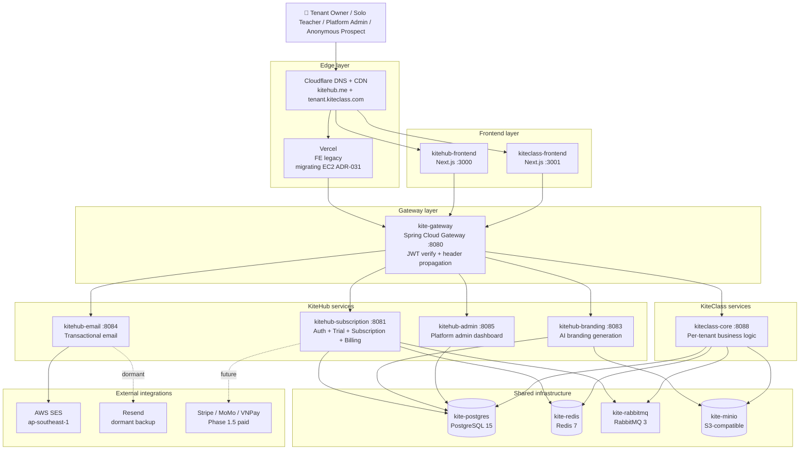
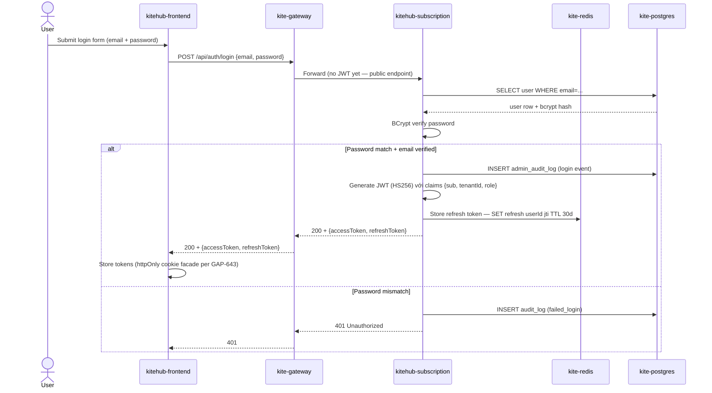
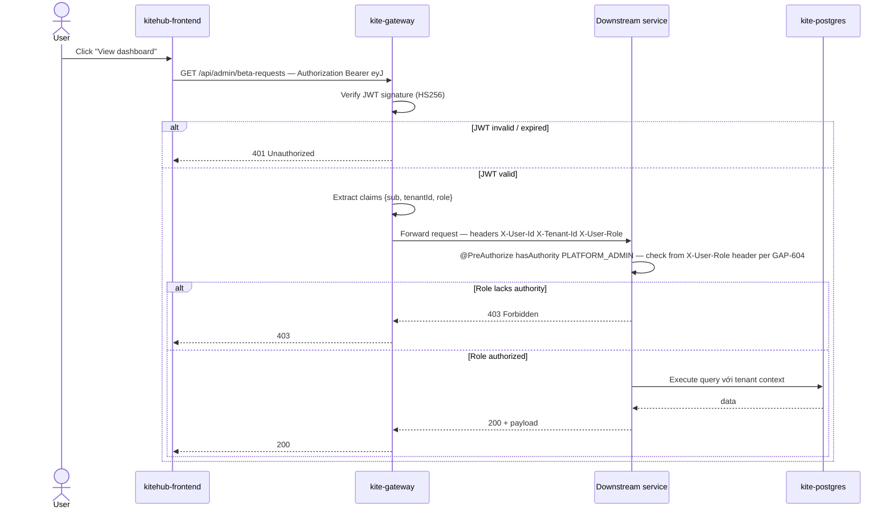
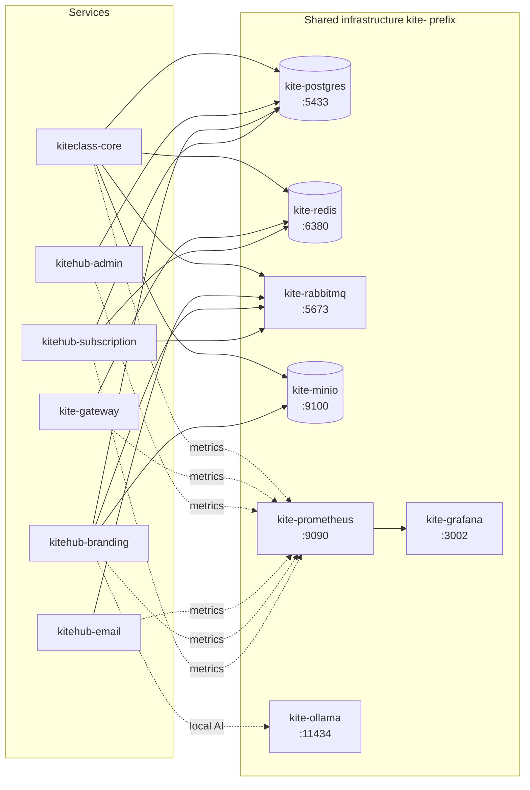
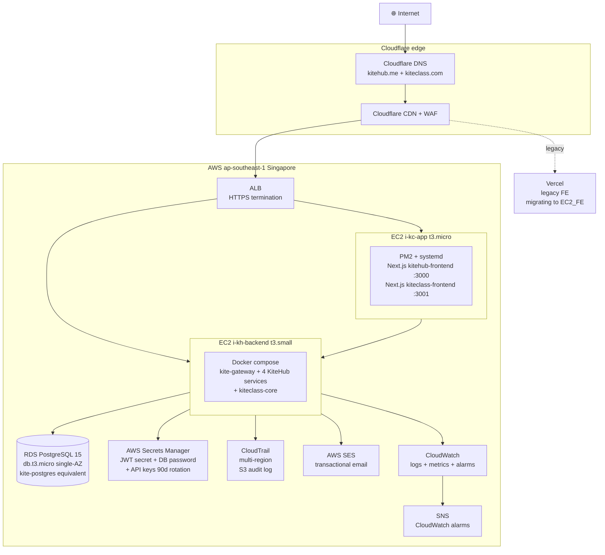

# KiteHub Architecture

**Last Updated:** 2026-05-18
**Phase:** 1 BETA (Release Lần 1)
**Sister doc:** [`kiteclass-architecture.md`](kiteclass-architecture.md)

Báo cáo kiến trúc đầy đủ cho **KiteHub** — SaaS platform quản lý education instances (sister product với **KiteClass** multi-tenant education platform). Tài liệu này tổng hợp service topology, authn/authz flow, shared infrastructure, external integration, deployment topology và các ADR/rules có thẩm quyền.

---

## 1. Overview

**KiteHub** = SaaS quản lý lifecycle education tenant (trial → subscription → billing → domain → off-boarding). Mỗi tenant đăng ký từ KiteHub sẽ được provision một KiteClass instance riêng (subdomain `{tenant}.kiteclass.com`) để vận hành nghiệp vụ giáo dục thực tế.

**Tách concern chính:**
- **KiteHub** xử lý: tenant signup, trial management, subscription billing, AI branding generation, transactional email, platform admin dashboard, **authn JWT issuance** (centralized cho toàn platform).
- **KiteClass** xử lý: student/course/class/attendance/grade/payment per-tenant business logic (xem `kiteclass-architecture.md`).

**Shared infrastructure** dùng prefix `kite-` (xem §4): PostgreSQL, Redis, RabbitMQ, MinIO, Gateway, MailHog (dev), Prometheus, Grafana.

### 1.1 High-level architecture



---

## 2. Services

KiteHub gồm **4 backend services deployable** + **1 shared library** + **1 gateway** + **1 frontend**. Source-of-truth: `kitehub/docker-compose.kitehub.yml` + `kitehub/*/pom.xml`.

### 2.1 Per-service breakdown

| Service | Port (host:container) | Role | DB schema / scope | Key dependencies |
|---|---|---|---|---|
| **kite-gateway** | `8080:8080` | Spring Cloud Gateway — JWT verify, subdomain resolve, header propagation (`X-User-Id`, `X-Tenant-Id`, `X-User-Role`) | Stateless | All downstream services; Redis cho rate limit |
| **kitehub-subscription** | `8081:8080` | **Auth (JWT issuance) + Trial + Subscription lifecycle + Billing + Onboarding + Beta access + DSAR + Audit log + Outbox + Payment webhook + Feedback + Impersonation** | `kitehub` schema (users, tenants, subscriptions, audit_log) | PostgreSQL, Redis, RabbitMQ, kitehub-email |
| **kitehub-branding** | `8083:8080` | AI branding generation (logo, banner, hero image) — strategy pattern (Ollama local + MiniMax cloud per ADR-019) | `kitehub` schema (branding_assets) | PostgreSQL, MinIO, RabbitMQ, Ollama / MiniMax API |
| **kitehub-email** | `8084:8080` | Transactional email (verification, password reset, beta invite, payment receipt) — NotificationChannel strategy (SES primary, Resend dormant per `email-architecture.md`) | Stateless (idempotency key trong RabbitMQ) | AWS SES, RabbitMQ, kitehub-subscription (idempotency) |
| **kitehub-admin** | `8085:8080` | Platform admin dashboard — beta request triage, tenant management, impersonation, feature flag, system health | `kitehub` schema (read-mostly + impersonation_log) | PostgreSQL, kitehub-subscription (admin API) |
| **kitehub-platform** | N/A (library) | **KHÔNG deployable** — shared library Spring Boot starter (auth filter, tenant context, OpenTelemetry config, common DTO, common error handler) | N/A | Embedded vào mỗi service jar |
| **kitehub-base** | N/A (image) | Base Docker image — JDK 21 + Maven + common entrypoint script | N/A | Build-time only |
| **kitehub-frontend** | `3000:3000` | Next.js 15 — tenant signup, dashboard, branding studio, billing, beta-access wizard, platform admin UI (per ADR-031: migrating Vercel → AWS EC2 self-host) | N/A | kite-gateway API; Vercel CDN trong giai đoạn migration |

### 2.2 kitehub-subscription internal modules

`kitehub-subscription` là service lớn nhất, gồm các module sau (sub-package level):

| Module | Responsibility |
|---|---|
| `auth` | Login, register, JWT issuance/refresh, email verification, password reset, TOTP 2FA |
| `tenant` | Tenant CRUD, lifecycle state machine (TRIAL → ACTIVE → SUSPENDED → OFFBOARDED) |
| `beta` | Beta-access request, approval flow, capacity gate |
| `betastatus` | Public beta-status page data feed |
| `subscription` (controller package) | Subscription plan, trial-to-paid conversion |
| `domain` | Custom domain attach, DNS validation |
| `onboarding` | Wizard state, persona-specific setup steps |
| `audit` | Admin audit log (immutable per V60 migration, PDPL Art 11 compliance) |
| `dsar` | Data Subject Access Request (PDPL Art 18-22) — export + delete |
| `consent` | Consent management (PDPL Art 9) |
| `outbox` | Transactional outbox pattern cho async messaging (RabbitMQ) |
| `webhook` | Payment webhook handler (Stripe/MoMo/VNPay future Phase 1.5) |
| `feedback` | Beta feedback collection |
| `impersonation` | Platform admin impersonation (with audit trail per `audit-service-isolation.md`) |
| `staff` / `support` | Internal support ticket flow |
| `consumer` | RabbitMQ message consumers (cross-module event handling) |
| `scheduler` | Cron jobs (TOTP cleanup, trial expiry, idempotency reaper) |
| `seed` | Database seed data (PLATFORM_ADMIN, demo tenant) |

---

## 3. Authn / Authz architecture

Post-ADR-032 (Wave 96 — `kiteclass-gateway` removed), authentication trở thành **centralized tại `kitehub-subscription`** cho toàn KiteHub platform. `kiteclass-core` tự issue JWT cho KiteClass tenant scope theo pattern riêng (xem `kiteclass-architecture.md`). Báo cáo này tập trung KiteHub authn flow.

### 3.1 Authentication (Authn)

`kitehub-subscription` owns login flow tại module `auth`:

| Endpoint | Verb | Purpose |
|---|---|---|
| `/api/auth/register` | POST | Tenant signup (creates user + tenant + JWT issuance) |
| `/api/auth/login` | POST | Login bằng email + password → JWT (access + refresh) |
| `/api/auth/refresh` | POST | Rotate refresh token → new access token |
| `/api/auth/verify-email` | POST | Verify email via token từ verification email |
| `/api/auth/password-reset-request` | POST | Request password reset email |
| `/api/auth/password-reset-confirm` | POST | Confirm password reset với token |
| `/api/auth/2fa/totp/setup` | POST | TOTP 2FA enrollment (per GAP-516) |
| `/api/auth/2fa/totp/verify` | POST | TOTP 2FA challenge verify (per GAP-553) |

**JWT spec:**
- Algorithm: **HMAC-SHA256** (HS256)
- Claims: `sub` (userId), `tenantId`, `role` (PLATFORM_ADMIN | P2_CENTER_OWNER | P3_CENTER_MANAGER | P1_SOLO_TEACHER), `iat`, `exp`
- Access token TTL: 15 phút
- Refresh token TTL: 30 ngày (rotation per `pre-launch-auth-hardening-checklist.md` §2.8)
- Refresh blacklist: Redis-backed (reuse detection → force-logout all sessions)

### 3.2 JWT propagation flow

Gateway boundary là zero-trust enforcement point per `audit-service-isolation.md`:



### 3.3 Authenticated request flow

Mọi request sau login đi qua gateway → JWT verify → header propagate → downstream authz check:



### 3.4 Authorization (Authz)

Mỗi service tự enforce authz tại controller-method level dùng Spring Security annotations:

```java
@RestController
@RequestMapping("/api/admin/beta-requests")
public class BetaAccessController {

    @PreAuthorize("hasAuthority('PLATFORM_ADMIN')")
    @GetMapping
    public ResponseEntity<Page<BetaRequest>> list(...) { ... }

    @PreAuthorize("hasAuthority('PLATFORM_ADMIN')")
    @PostMapping("/{id}/approve")
    public ResponseEntity<Void> approve(...) { ... }
}
```

**Role taxonomy:**

| Role | Scope | Granted by |
|---|---|---|
| `PLATFORM_ADMIN` | Toàn KiteHub platform (impersonation, beta triage, system health, billing override) | Seed data + manual provision |
| `P2_CENTER_OWNER` | Tenant owner — full access trong tenant scope | Tenant signup (default cho first user) |
| `P3_CENTER_MANAGER` | Tenant manager — limited admin (no billing, no offboard) | Invite từ P2 |
| `P1_SOLO_TEACHER` | Solo teacher — chỉ scope cá nhân + own classes | Tenant signup hoặc invite |

Per `audit-service-isolation.md` rule (sister Wave 96 ship same PR): **mỗi service tự verify role từ `X-User-Role` header** thay vì trust JWT claim directly — gateway boundary là single point of JWT verification, downstream services treat headers as authoritative (zero-trust intra-cluster).

Reference: `documents/01-business/auth/rules.md` + `documents/01-business/auth/api-contract.md` cho business rule + endpoint contract chi tiết.

---

## 4. Shared infrastructure

Mọi infrastructure components dùng prefix `kite-` (không phải `kitehub-`) vì shared giữa KiteHub + KiteClass.

### 4.1 Component matrix

| Component | Container name | Host port | Role |
|---|---|---|---|
| **PostgreSQL 15** | `kite-postgres` | `5433:5432` | Primary database — schema `kitehub` cho KiteHub services, schema `kiteclass` + Row-Level Security cho KiteClass tenant isolation |
| **Redis 7** | `kite-redis` | `6380:6379` | Caching, rate limit (gateway), refresh-token blacklist, session data |
| **RabbitMQ 3** | `kite-rabbitmq` | `5673:5672` (AMQP) + `15673:15672` (mgmt UI) | Async event messaging — outbox pattern, email queue, AI branding job queue |
| **MinIO** | `kite-minio` | `9100:9000` (API) + `9191:9091` (console) | S3-compatible object storage — branding assets, file uploads, backup |
| **MailHog (dev only)** | `kite-mailhog` | `1025:1025` (SMTP) + `8025:8025` (web UI) | Local email testing — production dùng AWS SES |
| **Prometheus** | `kite-prometheus` | `9090:9090` | Metrics scrape từ Spring Boot Actuator |
| **Grafana** | `kite-grafana` | `3002:3002` | Metrics visualization + alerting |
| **Ollama (local AI)** | `kite-ollama` | `11434:11434` | Local LLM cho AI branding generation strategy (per ADR-019 — MiniMax cloud adopted production) |

### 4.2 Service → infrastructure dependency



### 4.3 Multi-tenant isolation strategy

- **KiteHub services** (subscription/branding/email/admin): single-tenant scope per row (`tenant_id` column trong các bảng tenant-scoped). Không cần RLS vì KiteHub là SaaS control plane, dữ liệu không phải per-tenant business data.
- **KiteClass** (kiteclass-core): **layered defense** — code-level Hibernate filter + Postgres Row-Level Security (RLS). Xem `kiteclass-architecture.md` §Multi-Tenant Isolation cho chi tiết.

---

## 5. External integrations

### 5.1 Email (AWS SES + Resend dormant)

Per `email-architecture.md`:
- **AWS SES (ap-southeast-1)** = primary email provider — production sending, DKIM signed với `ses1-3._domainkey.kitehub.me`
- **Resend** = dormant backup, NotificationChannel strategy implemented but `provider=resend` not wired (TODO per `email-architecture.md`)
- **MailHog** = local dev only

### 5.2 DNS + CDN (Cloudflare)

- DNS zone `kitehub.me` + `kiteclass.com` quản lý tại Cloudflare
- Cloudflare CDN proxy cho cả Vercel (legacy FE) + AWS EC2 (FE migration target per ADR-031)
- Cloudflare Email Routing cho catch-all + alias forwarding
- DDoS protection + WAF baseline

### 5.3 Frontend hosting

- **Vercel** = current FE deployment (kitehub-frontend.vercel.app subdomain proxied qua Cloudflare)
- **AWS EC2 self-host** = target migration per **ADR-031** — chuyển sang PM2 + systemd trên cùng EC2 instance backend (cost optimization Phase 1 BETA)

### 5.4 Payment (Phase 1.5+ deferred)

Per Wave 93 retro + `outside-in-coverage-trigger.md` v1.1.0:
- **Stripe** / **MoMo** / **VNPay** = future integrations Phase 1.5+ paid scope
- Phase 1 BETA: **free trial only**, không có payment processor integration live
- Architecture-decision keywords trigger fires khi gap file đề xuất payment scope — outside-in audit yêu cầu trước khi lock approach (self-build vs PSP partnership)

### 5.5 AWS infrastructure (production)

Per **ADR-025** (AWS Singapore Free Tier Phase 1 BETA):
- Region: `ap-southeast-1` (Singapore — gần VN tenant nhất, low latency)
- EC2 instances: `kh-backend` (backend services) + `kc-app` (FE + worker)
- RDS PostgreSQL 15 single-AZ Free Tier
- S3 cho CloudTrail audit logs (per `aws-observability-first.md`)
- Secrets Manager cho production secrets (rotation 90-day cadence per GAP-379)
- CloudTrail multi-region audit baseline (per `aws-observability-first.md` rule)

---

## 6. Deployment

### 6.1 Phase 1 BETA deployment topology

Per **ADR-025** (Architecture B — AWS Singapore Free Tier):



**Đặc điểm Phase 1 BETA:**
- **Single multi-tenant deployment** — KHÔNG phải per-tenant Kubernetes namespace (cost prohibitive cho solo-dev)
- **Free Tier compliance** — t3.micro + t3.small EC2, db.t3.micro RDS, single-AZ, không Load Balancer redundancy
- **Docker compose** trên EC2 backend thay vì K8s
- **PM2 + systemd** quản lý Node.js process trên EC2 FE
- **No autoscaling** trong Phase 1 — manual scale khi tenant approve

### 6.2 Phase 2+ migration

Tracked tại **GAP-415** (EKS migration) + **GAP-479** (multi-AZ HA):
- EKS migration sau khi tenant count ≥10 paid (Phase 1.5+)
- Helm charts đã có sẵn tại `infrastructure/helm/` cho 7 services
- K8s manifests tại `infrastructure/k8s/` (pre-migration validation)

### 6.3 Local development

```bash
# KiteHub dev stack (toàn bộ services local)
cd kitehub && ./scripts/up.sh

# Stop stack
./scripts/down.sh

# View logs
./scripts/logs.sh

# Status check
./scripts/status.sh
```

Per CLAUDE.md "Docker Scripts Required" rule: **KHÔNG** chạy `docker-compose` trực tiếp; phải dùng `scripts/`.

### 6.4 Production deploy execution

Per `release-deploy-standard.md` §9 + `agent-aws-access.md`:
- **Human-triggered `workflow_dispatch`** + confirm input `APPLY` + narrow OIDC role (cognitive checkpoint)
- **Banned**: agent autonomous `terraform apply` / `kubectl apply` trên production
- **Allowed**: agent preparation (runbooks, scripts, plans) + post-deploy verification (Tier 1 read-only)

---

## 7. Related ADRs + rules

### 7.1 Architecture Decision Records

| ADR | Title | Liên quan |
|---|---|---|
| **ADR-001** | K-12 data model | Persona taxonomy + role hierarchy foundation |
| **ADR-023** | Gateway key resolver strategy | `kite-gateway` subdomain → tenant resolve |
| **ADR-025** | AWS-only deploy Phase 1 Free Tier | Phase 1 BETA = AWS Singapore (§6 deployment) |
| **ADR-031** | FE self-host AWS EC2 | Vercel → EC2 migration cho FE (§5.3 + §6.1) |
| **ADR-032** | kiteclass-gateway removal | Wave 96 — KiteClass auth chuyển vào `kiteclass-core`; KiteHub auth giữ tại `kitehub-subscription` |

### 7.2 Rules (governance)

| Rule | Áp dụng |
|---|---|
| `agent-aws-access.md` | Tier 1 read-only commands cho production AWS introspection |
| `release-deploy-standard.md` §9 | Human-triggered deploy execution (banned agent autonomy) |
| `aws-observability-first.md` | CloudTrail baseline trước Phase 2.3 production apply |
| `concurrent-production-mutation-ops.md` | Serialize terraform apply + deploy — không parallel |
| `pre-mutation-state-check.md` | Pre-mutation audit artifact mandatory |
| `audit-service-isolation.md` | Mỗi service tự verify role từ header, không trust JWT claim trực tiếp |
| `admin-merge-discipline.md` | `gh pr merge --admin` chỉ sau local verify trên rebased HEAD |
| `email-architecture.md` (doc) | NotificationChannel strategy + SES primary + Resend dormant |
| `diagram-format-selection.md` | Mermaid là default cho diagrams (rule áp dụng cho file này) |
| `dev-readable-doc-language.md` | Vietnamese narrative + English technical tokens |

### 7.3 Sister docs

- `kiteclass-architecture.md` — KiteClass product architecture (per-tenant business logic)
- `email-architecture.md` — chi tiết NotificationChannel + DKIM strategy
- `deployment-strategy.md` — 5 nguyên tắc + env matrix (GAP-103 DONE)
- `domain-management.md` — custom domain attach flow

---

## 8. References

- **Source-of-truth files:** `kitehub/docker-compose.kitehub.yml`, `kitehub/*/pom.xml`, `kitehub/kitehub-subscription/src/main/java/com/kitehub/subscription/`
- **CLAUDE.md** project instructions — Docker naming convention, scripts mandatory, Wave Branch Strategy
- **ROADMAP.md** — current Phase 1 BETA status snapshot
- **`documents/01-business/auth/`** — auth business rules + use cases + API contract (3-layer)
- **`documents/04-quality/audits/`** — Wave 92/94/95 quality + security + API audits cited

---

*Audience: dev. Diagram format: Mermaid per `diagram-format-selection.md` §2.2. Narrative language: Vietnamese per `dev-readable-doc-language.md`.*
