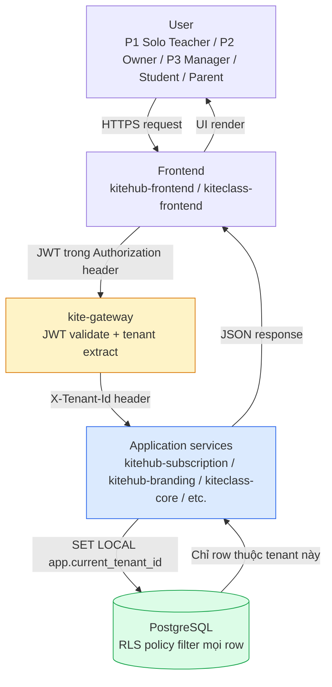
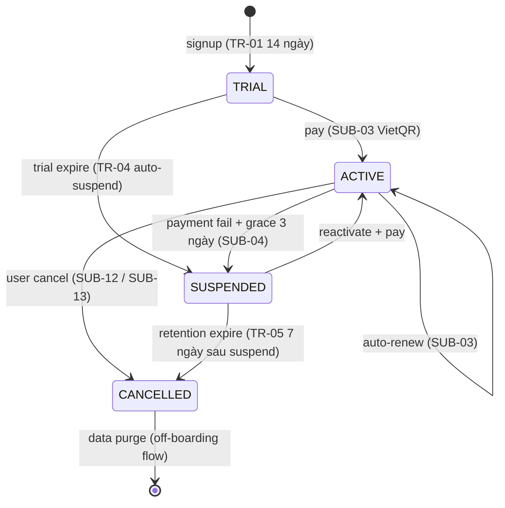
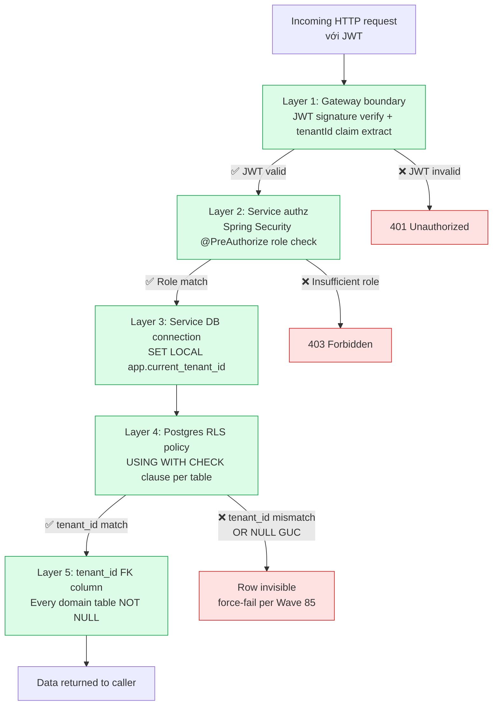
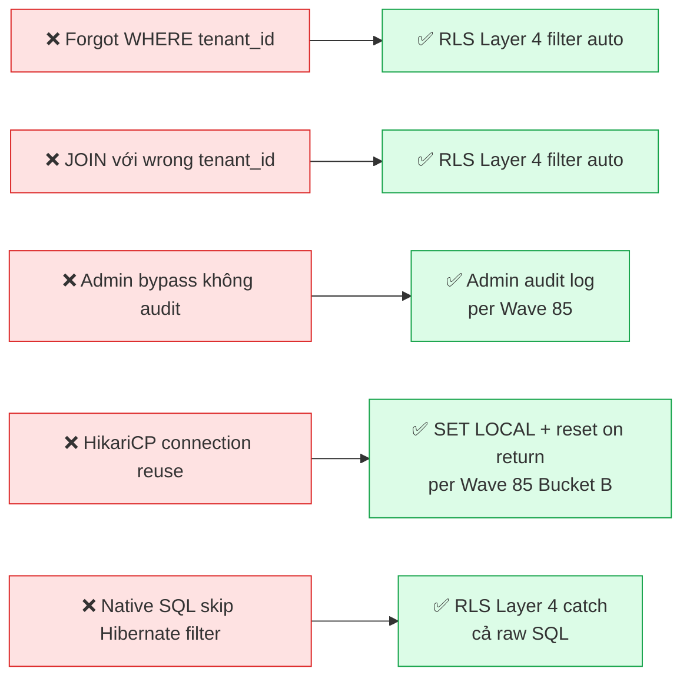

# Multi-Tenant Isolation Architecture

**Phạm vi:** Mô hình isolation tenant trong KiteHub Platform (Phase 1 BETA + 1.5). Tài liệu này là sister-doc của `kitehub-architecture.md` + `kiteclass-architecture.md`, tập trung riêng vào **cách dữ liệu của mỗi tenant được cách ly** xuyên suốt request flow → service authz → DB connection → Postgres RLS policy → tenant_id FK column.

**Audience:** Dev backend (Spring Boot), DBA (Postgres / Flyway), DevOps (HikariCP / monitoring), security reviewer (audit pipeline).

---

## TL;DR

KiteHub Platform dùng **một mô hình duy nhất**: shared database + `tenant_id` UUID column trên mọi domain table + **Postgres Row-Level Security (RLS)** policy. Tenant context propagate từ JWT → gateway header → service → `SET LOCAL app.current_tenant_id` → RLS policy filter row. **Defense-in-depth 5 layers** đảm bảo lỡ quên `WHERE tenant_id = ?` trong code vẫn KHÔNG bị cross-tenant leak.

Quyết định kiến trúc neo tại: [ADR-023 Gateway key resolver](adr/ADR-023-gateway-key-resolver-strategy.md), GAP-466 (RLS implementation), GAP-469 (RLS performance baseline), GAP-604 (JWT-to-headers propagation), rule [`audit-service-isolation.md`](../../.claude/rules/audit-service-isolation.md), rule [`postgres-specific-type-testcontainers.md`](../../.claude/rules/postgres-specific-type-testcontainers.md).

---

## Section 1 — Overview

### 1.1 Tenant scope trong project

KiteHub Platform là 2 sản phẩm chia chung infrastructure (per [`kitehub-architecture.md`](kitehub-architecture.md) + [`kiteclass-architecture.md`](kiteclass-architecture.md)). Khái niệm "tenant" có ý nghĩa hơi khác giữa 2 sản phẩm:

| Sản phẩm | Định nghĩa tenant | Service quản lý lifecycle | Cardinality |
|---|---|---|---|
| **KiteHub** | 1 organization (trường học / trung tâm Anh ngữ / solo teacher) đăng ký dùng platform | `kitehub-subscription` (state machine + billing + provisioning) | 1-N tenant per platform |
| **KiteClass** | 1 instance trường học (mỗi tenant KiteHub spawn 1 KiteClass tenant) | `kiteclass-core` (uses same `tenant_id` propagated từ KiteHub) | 1:1 với KiteHub tenant |

Cùng một `tenant_id` UUID được dùng xuyên suốt cả 2 sản phẩm — KiteHub tạo tenant → cấp UUID → KiteClass khởi tạo data với cùng UUID đó. Trong code KiteClass cũ, column này có alias `instance_id` (per [`kiteclass-architecture.md`](kiteclass-architecture.md) §Multi-Tenant Isolation) nhưng giá trị semantic identical.

### 1.2 Mô hình isolation đã chọn

> **Shared database + tenant_id UUID column + Postgres RLS** — pattern AWS Well-Architected SaaS Lens gọi là "Pool" model.

Lý do chọn mô hình này (so với per-tenant DB / per-tenant schema) — xem chi tiết §7 Isolation patterns considered.

### 1.3 High-level overview diagram



**Đọc diagram:** mỗi request từ user đi qua 5 trạm. Tại mỗi trạm, tenant context được verify hoặc enforce. DB là trạm cuối cùng và mạnh nhất — RLS policy filter rows ngay tại boundary Postgres, **trước khi** rows được trả về JDBC connection.

---

## Section 2 — Tenant lifecycle

Tenant state machine do `kitehub-subscription` quản lý. Reference business rules: [`documents/01-business/kitehub/trial-lifecycle/rules.md`](../01-business/kitehub/trial-lifecycle/rules.md) + [`documents/01-business/kitehub/subscription-billing/rules.md`](../01-business/kitehub/subscription-billing/rules.md).



**Đọc diagram:**

- **TRIAL → ACTIVE:** sau khi user thanh toán thành công qua VietQR (SUB-11 default payment method)
- **ACTIVE → SUSPENDED:** khi auto-renew fail; có grace period 3 ngày (SUB-04) trước khi suspend hẳn
- **SUSPENDED → CANCELLED:** sau 7 ngày giữ data (TR-05), data sẽ bị purge theo off-boarding flow
- **CANCELLED:** terminal state — data đã xóa, tenant_id không còn tồn tại trong domain tables (nhưng audit log retain theo `data-retention-policy.md` + PDPL Art 11)

Trong mọi state, **tenant_id vẫn tồn tại** trong DB (cho audit log + recovery) cho tới khi terminal CANCELLED + retention window expire. RLS policy filter rows dựa trên `tenant_id`, KHÔNG dựa trên `state` — service layer enforce state-based authz riêng (vd: SUSPENDED tenant không được login, kitehub-frontend hiển thị "Tài khoản bị tạm khóa, vui lòng liên hệ support").

---

## Section 3 — Tenant ID propagation chain (CRITICAL)

Đây là chain quan trọng nhất của isolation. Sai một bước = potential cross-tenant leak. Per GAP-604 JWT-to-headers propagation:

```mermaid
sequenceDiagram
    autonumber
    participant User
    participant FE as Frontend<br/>(Next.js)
    participant Gateway as kite-gateway
    participant Service as kitehub-subscription<br/>(hoặc service khác)
    participant DB as PostgreSQL<br/>(RLS enabled)

    User->>FE: Submit login form (email + password)
    FE->>Gateway: POST /api/auth/login
    Gateway->>Service: Forward request (no X-Tenant-Id yet)
    Service->>DB: SELECT * FROM users WHERE email = ?
    Note over Service,DB: Login flow chưa có tenant context;<br/>users table có RLS bypass cho lookup theo email
    DB-->>Service: User row (chứa tenant_id)
    Service->>Service: Verify password + generate JWT<br/>claims = {sub, tenantId, role, exp}
    Service-->>FE: JWT trong response body
    FE->>FE: Lưu JWT (httpOnly cookie hoặc sessionStorage facade per Wave 85)

    Note over User,DB: Request tiếp theo (có tenant context)

    User->>FE: Click "Xem danh sách lớp"
    FE->>Gateway: GET /api/classes<br/>Authorization: Bearer <JWT>
    Gateway->>Gateway: Verify JWT signature<br/>Extract claim "tenantId"
    Gateway->>Service: GET /api/classes<br/>X-Tenant-Id: <tenant-uuid><br/>X-User-Id: <user-uuid>
    Service->>Service: @PreAuthorize check role
    Service->>DB: BEGIN TRANSACTION<br/>SET LOCAL app.current_tenant_id = '<tenant-uuid>'
    Service->>DB: SELECT * FROM classes
    Note over DB: RLS policy filter:<br/>WHERE tenant_id = current_setting('app.current_tenant_id')
    DB-->>Service: Chỉ classes thuộc tenant này
    Service-->>Gateway: 200 OK + JSON
    Gateway-->>FE: 200 OK + JSON
    FE-->>User: Render danh sách lớp
```

**Đọc diagram:**

1. **Login flow (steps 1-9):** chưa có tenant context. Service lookup user theo email (cross-tenant lookup được phép cho login path — users table có policy exemption cho login). JWT issued chứa claim `tenantId`.
2. **JWT storage (step 10):** FE lưu JWT trong httpOnly cookie (production) hoặc sessionStorage facade (per Wave 85 Bucket E security hardening — giảm XSS attack surface so với localStorage).
3. **Authenticated request (steps 11-20):** mỗi request sau login có JWT. Gateway verify signature + extract `tenantId` claim → set `X-Tenant-Id` header (per GAP-604). Service đọc header, set `app.current_tenant_id` PostgreSQL session GUC, RLS policy tự động filter row.

**Banned shortcuts:** service KHÔNG được phép tự đọc `tenantId` từ JWT body. Lý do: gateway là single trust boundary cho JWT validation. Service trust header `X-Tenant-Id` (do gateway-managed). Nếu service tự parse JWT, mỗi service phải maintain JWT public key + duplicate validation logic → security risk + maintenance burden.

---

## Section 4 — Postgres RLS implementation

### 4.1 Defense-in-depth: 5 layers



Mỗi layer là một fail-safe độc lập. Bug ở Layer 2 (vd code quên `@PreAuthorize`) vẫn được Layer 4 (RLS) catch. Đây là điểm khác biệt then chốt của "shared DB + RLS" so với "shared DB + tenant_id column only" — không có RLS thì bug code = data leak.

### 4.2 Per-table RLS policy template

Mọi table thuộc domain tenant-scoped PHẢI áp dụng pattern sau (per GAP-466):

```sql
-- Step 1: Add column tenant_id
ALTER TABLE classes
  ADD COLUMN tenant_id UUID NOT NULL REFERENCES tenants(id);

-- Step 2: Enable RLS
ALTER TABLE classes ENABLE ROW LEVEL SECURITY;

-- Step 3: Force RLS (cả superuser cũng bị filter — trừ khi explicit BYPASSRLS role)
ALTER TABLE classes FORCE ROW LEVEL SECURITY;

-- Step 4: Create tenant_isolation policy
CREATE POLICY tenant_isolation_classes ON classes
  USING (tenant_id = current_setting('app.current_tenant_id', true)::uuid)
  WITH CHECK (tenant_id = current_setting('app.current_tenant_id', true)::uuid);

-- Step 5: Index tenant_id (per GAP-469 performance baseline)
CREATE INDEX idx_classes_tenant_id ON classes(tenant_id);
```

**Giải thích key fields:**

- `current_setting('app.current_tenant_id', true)::uuid` — đọc session GUC do service set qua `SET LOCAL`. Argument `true` (missing_ok) → nếu GUC chưa set, return NULL thay vì raise error.
- `USING` clause — apply cho `SELECT` / `UPDATE` / `DELETE` (filter rows visible)
- `WITH CHECK` clause — apply cho `INSERT` / `UPDATE` (block ghi row sai tenant)
- `FORCE ROW LEVEL SECURITY` — đảm bảo cả table owner cũng bị filter (security hardening; chỉ role với `BYPASSRLS` attribute mới skip — dành cho admin tooling + Flyway migration role)

### 4.3 NULL `tenant_id` behavior (Wave 85 Bucket B hardening)

**Trước Wave 85:** nếu `app.current_tenant_id` chưa set (NULL GUC), policy evaluate `tenant_id = NULL::uuid` = NULL trong SQL ternary logic → **không filter rows** → silent cross-tenant leak nếu service quên `SET LOCAL`.

**Sau Wave 85 Bucket B (RLS NULL force-fail):** policy được rewrite để **explicit reject** khi GUC NULL:

```sql
CREATE POLICY tenant_isolation_classes ON classes
  USING (
    tenant_id = current_setting('app.current_tenant_id', true)::uuid
    AND current_setting('app.current_tenant_id', true) IS NOT NULL
  )
  WITH CHECK (
    tenant_id = current_setting('app.current_tenant_id', true)::uuid
    AND current_setting('app.current_tenant_id', true) IS NOT NULL
  );
```

Effect: nếu service quên `SET LOCAL` → **0 rows returned** thay vì all rows. Bug surfaces immediately trong test thay vì silent leak production. Per Wave 85 Bucket B Security audit score: +1 Cat 3 A01 broken access control eliminate.

### 4.4 HikariCP GUC reset (Wave 85 Bucket B)

Vấn đề: HikariCP connection pool reuse connection across transactions. Nếu transaction A set `app.current_tenant_id = 'tenant-A-uuid'` rồi return connection về pool, transaction B (cho tenant khác) reuse connection đó → GUC vẫn còn giá trị cũ → potential leak nếu transaction B quên set lại.

**Wave 85 fix:** Spring's `TenantAwareDataSourceInterceptor` luôn `SET LOCAL` ở mỗi `@Transactional` boundary. `SET LOCAL` (vs `SET`) auto-reset khi transaction commit/rollback. HikariCP `connectionInitSql` cũng được config để `RESET app.current_tenant_id` mỗi khi connection return về pool — defense in depth.

---

## Section 5 — Cross-tenant leak prevention

### 5.1 Failure modes thường gặp + mitigation



**Đọc diagram:** mỗi failure mode bên trái có mitigation bên phải đảm bảo bug không thành cross-tenant leak production. Layer 4 (RLS) cover 3/5 failure modes — đó là lý do RLS là load-bearing layer, không phải nice-to-have.

### 5.2 Chi tiết per failure mode

| # | Failure mode | Tại sao xảy ra | Mitigation |
|---|---|---|---|
| 1 | **Forgot WHERE clause** | Dev viết `SELECT * FROM classes` quên filter tenant_id | RLS policy filter auto tại Postgres boundary; query trả về 0 rows nếu thiếu GUC (per §4.3 force-fail) |
| 2 | **JOIN với wrong tenant_id** | `classes c JOIN enrollments e ON ...` không có `AND c.tenant_id = e.tenant_id` | RLS policy filter mỗi table độc lập; JOIN result chỉ chứa rows visible cả 2 phía |
| 3 | **Admin bypass không audit** | Admin tool dùng `BYPASSRLS` role để query cross-tenant | `@AdminBypass` annotation + admin_audit_log table (Wave 85 V60 immutable) ghi mọi access; PDPL Art 11 tamper-proof |
| 4 | **HikariCP connection reuse** | Connection pool reuse connection với stale GUC | `SET LOCAL` (transaction-scoped) + connection return reset (Wave 85 Bucket B) |
| 5 | **Native SQL skip Hibernate filter** | `entityManager.createNativeQuery(...)` bypass `@FilterDef` ở Hibernate level | RLS layer 4 (Postgres-level) catch cả native query — không thể bypass tại layer code |

### 5.3 Flyway migration exception

Flyway role có `BYPASSRLS` attribute vì:

- DDL operations (`CREATE TABLE`, `ALTER TABLE`) không thuộc tenant scope
- Data migration scripts (vd backfill) cần ghi/đọc cross-tenant

**Constraint:** Flyway scripts KHÔNG được ghi domain data (chỉ schema + reference data như enum lookup). Domain data backfill phải qua admin tool có audit log.

### 5.4 Break-glass procedure

Khi cần read cross-tenant tại production (vd: incident investigation, customer support escalation):

1. Use `kite-admin` role với `BYPASSRLS` attribute
2. Mọi query log vào `admin_audit_log` (Wave 85 V60 immutable INSERT-only)
3. Per [`documents/05-guides/operations/runbooks/rls-policy-violation.md`](../05-guides/operations/runbooks/rls-policy-violation.md)
4. Post-incident: audit_log entries reviewed weekly per ops cadence

---

## Section 6 — Per-tenant features (customization scope)

Tenant có thể customize những gì? Mỗi feature dưới đây có per-tenant config storage + UI:

| Feature | Storage | Service owner | Reference |
|---|---|---|---|
| **Branding** (logo, color, hero image) | `tenant_branding` table + MinIO assets | `kitehub-branding` | [AI Branding v2 redesign](ai-branding-v2-redesign.md) |
| **Custom subdomain** (`trung-tam-sky.kitehub.me`) | `tenant_domains` table + Cloudflare DNS | `kitehub-subscription` | [domain-management.md](domain-management.md) |
| **Email sender domain** (DKIM-verified per tenant) | `tenant_email_config` table | `kitehub-email` | [email-architecture.md](email-architecture.md) |
| **Per-tenant feature flags** (PRO tier features) | `tenant_features` table + Spring profile | `kitehub-subscription` | Tied to tier (FREE/STARTER/PRO/PRO_PLUS) |
| **Tier-based quota** (storage, AI generations, user count) | `tenant_quota` table + Redis counter | Multiple services consume | Per SUB-* rules trong subscription-billing |

Tất cả tables trên đều có `tenant_id` column + RLS policy theo §4.2 pattern.

---

## Section 7 — Isolation patterns considered (ADR-style)

Trước khi chọn shared DB + RLS, project đã xem xét 4 patterns. Bảng so sánh:

| Pattern | Isolation strength | Ops cost | Cross-tenant query | Phase 1 BETA fit | Quyết định |
|---|---|---|---|---|---|
| **Per-tenant database** (1 DB instance per tenant) | 🟢 Strong (physical isolation) | 🔴 N× linear scaling (N RDS instances) | 🔴 Impossible without ETL | 🔴 Solo-dev không khả thi ops | ❌ Rejected |
| **Per-tenant schema** (1 schema per tenant, shared DB) | 🟡 Medium (logical isolation, shared connection pool) | 🟡 Medium (N schemas, migration runs N lần) | 🟡 Possible với schema switching overhead | 🟡 Phase 2 EKS scope, không Phase 1 | ❌ Rejected (defer Phase 2 nếu cần) |
| **Shared DB + tenant_id column ONLY** (no RLS) | 🔴 Weak (bug code = leak) | 🟢 Low | 🟢 Easy | 🟢 Simple nhưng risky | ❌ Rejected (security) |
| **Shared DB + tenant_id + RLS** (current) | 🟢 Strong (DB-level enforcement + code defense) | 🟢 Low (1 DB, 1 migration run) | 🟢 Easy (admin bypass) | 🟢 Phase 1 BETA scope | ✅ **ADOPTED** |
| **Hybrid** (shared by default + per-tenant DB cho high-value tenant) | 🟢 Strong (selective) | 🟡 Medium (routing layer + 2 storage backends) | 🔴 Complex | 🔴 Quá phức tạp cho solo-dev | 🟡 Deferred Phase 3 K-12 nếu enterprise yêu cầu |

**Quyết định canonical:** shared DB + RLS chọn vì balance giữa isolation strength (mạnh sau Wave 85 hardening) + ops cost (1 DB) + flexibility (cross-tenant query qua admin bypass + audit).

**Re-evaluate trigger:** chuyển sang hybrid (per-tenant DB cho enterprise tenant) khi có khách hàng K-12 enterprise (Phase 3 gated per [`documents/03-planning/roadmap/release-1-plan-2026.md`](../03-planning/roadmap/release-1-plan-2026.md)) yêu cầu strong physical isolation + SLA dedicated.

---

## Section 8 — K-12 specific isolation (Phase 3 gated)

Phase 3 (K-12 trường công lập) thêm requirements isolation đặc thù. Brief mention — chi tiết defer Phase 3:

| Requirement | Pattern | Gap reference |
|---|---|---|
| **Parent portal cross-tenant audit** | Parent có thể xem nhiều con ở khác trường → cross-tenant read; mỗi access log riêng | GAP-321 trilogy (parent portal audit log) |
| **Child data WORM retention 10 năm** | PDPL Art 11 + Luật Trẻ em — audit log immutable 10y | GAP-319 (WORM retention) |
| **MOET inter-school transfer** | Học sinh chuyển trường → tenant_id thay đổi nhưng student record cross-tenant link cho audit | GAP-340 (MOET transfer flow) |
| **DPIA + DPO sign-off** | Data Protection Impact Assessment trước Phase 3 launch | Per `business-logic-review.md` + counsel review |

Phase 3 isolation sẽ extend current pattern bằng cross-tenant access audit table riêng + retention policy stricter, KHÔNG thay đổi base RLS architecture.

---

## Section 9 — Common dev tasks

### 9.1 Thêm domain table mới với tenant scope

Checklist cho dev:

1. **Migration script** (Flyway `V{N}__add_<table>.sql`):

   ```sql
   CREATE TABLE classes (
     id UUID PRIMARY KEY DEFAULT gen_random_uuid(),
     tenant_id UUID NOT NULL REFERENCES tenants(id),
     name VARCHAR(200) NOT NULL,
     -- domain columns...
     created_at TIMESTAMPTZ NOT NULL DEFAULT NOW(),
     updated_at TIMESTAMPTZ NOT NULL DEFAULT NOW()
   );

   ALTER TABLE classes ENABLE ROW LEVEL SECURITY;
   ALTER TABLE classes FORCE ROW LEVEL SECURITY;

   CREATE POLICY tenant_isolation_classes ON classes
     USING (
       tenant_id = current_setting('app.current_tenant_id', true)::uuid
       AND current_setting('app.current_tenant_id', true) IS NOT NULL
     )
     WITH CHECK (
       tenant_id = current_setting('app.current_tenant_id', true)::uuid
       AND current_setting('app.current_tenant_id', true) IS NOT NULL
     );

   CREATE INDEX idx_classes_tenant_id ON classes(tenant_id);
   ```

2. **Entity class** (extends `BaseEntity` để inherit `tenant_id` column):

   ```java
   @Entity
   @Table(name = "classes")
   public class ClassEntity extends BaseEntity {
       @Column(nullable = false)
       private String name;
       // ...
   }
   ```

3. **Controller** với `@PreAuthorize`:

   ```java
   @GetMapping("/api/classes")
   @PreAuthorize("hasAnyRole('OWNER', 'ADMIN', 'TEACHER')")
   public List<ClassDto> list() {
       return classService.findAll();
   }
   ```

4. **Integration test** với Testcontainers (per [`postgres-specific-type-testcontainers.md`](../../.claude/rules/postgres-specific-type-testcontainers.md)):

   ```java
   @SpringBootTest
   @Testcontainers
   class ClassServiceIT {
       @Container
       static PostgreSQLContainer<?> postgres = new PostgreSQLContainer<>("postgres:16");

       @Test
       void cross_tenant_leak_blocked() {
           // Setup: 2 tenants, mỗi tenant 1 class
           // Act: login as tenant A, query classes
           // Assert: chỉ thấy class của tenant A, KHÔNG thấy tenant B
       }
   }
   ```

   **Lý do bắt buộc Testcontainers (không H2):** H2 không support Postgres-specific features (RLS, INET type, JSONB). Tests phải chạy trên real Postgres để verify RLS policy fire — H2 sẽ pass test giả tạo mặc dù production sẽ fail.

### 9.2 Admin bypass RLS

Chỉ dùng trong admin tool / debug tooling:

```java
@Service
public class AdminQueryService {
    @AdminBypass  // Annotation tự audit qua AdminAuditAspect
    @Transactional
    public List<TenantStats> queryAllTenants() {
        // SET LOCAL role kite-admin (có BYPASSRLS)
        return jdbcTemplate.query("SELECT tenant_id, COUNT(*) FROM classes GROUP BY tenant_id", ...);
    }
}
```

`@AdminBypass` aspect tự động:

1. Switch session role sang `kite-admin` (BYPASSRLS attribute)
2. Log entry vào `admin_audit_log` table (Wave 85 V60 immutable INSERT-only)
3. Revert role khi transaction kết thúc

### 9.3 Test cross-tenant leak (mandatory cho mọi controller mới)

```java
@Test
void tenantA_cannot_see_tenantB_data() {
    // Setup
    UUID tenantA = UUID.randomUUID();
    UUID tenantB = UUID.randomUUID();
    createClassAs(tenantA, "Lớp A1");
    createClassAs(tenantB, "Lớp B1");

    // Act: query as tenant A
    setCurrentTenant(tenantA);
    List<ClassEntity> result = classRepository.findAll();

    // Assert: chỉ thấy 1 row (của tenant A)
    assertThat(result).hasSize(1);
    assertThat(result.get(0).getName()).isEqualTo("Lớp A1");
    assertThat(result.get(0).getTenantId()).isEqualTo(tenantA);
}
```

Pattern này áp dụng cho mọi domain test, không chỉ Class entity.

### 9.4 Debug "tại sao query trả về 0 rows?"

Trình tự debug:

1. **Check session GUC:** `SELECT current_setting('app.current_tenant_id', true);` → nếu NULL → service quên `SET LOCAL`
2. **Check tenant_id của row:** disable RLS tạm thời (admin role) → query trực tiếp → so sánh tenant_id với JWT claim
3. **Check RLS policy:** `\d+ <table>` trong psql để xem policy USING/WITH CHECK clause
4. **Check Hibernate filter:** nếu dùng JPA, verify `@Filter` annotation được enable trong `TenantFilterInterceptor`

Per Wave 85 Bucket B force-fail behavior — query return 0 rows khi GUC NULL là EXPECTED, không phải bug. Bug nằm ở service quên `SET LOCAL`.

---

## Section 10 — Related ADRs + rules + gaps

### Architecture Decision Records (ADR)

- [**ADR-023** Gateway key resolver strategy](adr/ADR-023-gateway-key-resolver-strategy.md) — subdomain → tenant resolve + X-Tenant-Id forward
- [**ADR-011** Defense-in-depth security](adr/ADR-011-defense-in-depth-security.md) — multi-layer pattern rationale
- [**ADR-013** Data retention classification](adr/ADR-013-data-retention-classification.md) — tenant data lifecycle + purge
- [**ADR-025** AWS Singapore Free Tier Phase 1 BETA](adr/ADR-025-aws-only-deploy-phase-1-free-tier.md) — single-region DB constraint

### Project rules

- [**`audit-service-isolation.md`**](../../.claude/rules/audit-service-isolation.md) — `Propagation.REQUIRES_NEW` cho audit/log services
- [**`postgres-specific-type-testcontainers.md`**](../../.claude/rules/postgres-specific-type-testcontainers.md) — Postgres-only types (INET, JSONB, RLS) phải test trên Testcontainers, không H2
- [**`pre-launch-auth-hardening-checklist.md`**](../../.claude/rules/pre-launch-auth-hardening-checklist.md) — JWT/2FA/session hardening trước launch
- [**`design-patterns.md`**](../../.claude/rules/design-patterns.md) §3.11 — RLS test pattern + anti-patterns

### Gap files

- **GAP-466** RLS defense-in-depth implementation (Wave 56 — closed)
- **GAP-469** RLS performance baseline (Wave 56 — closed)
- **GAP-604** Gateway JWT-to-headers propagation
- **GAP-578** P2 owner 2FA mandatory
- Wave 85 Bucket B — RLS NULL force-fail + HikariCP GUC reset (Cat 3 A01 security +1)
- Wave 85 Bucket E — sessionStorage facade (XSS hardening)

### Latest audits

- [**Security audit 2026-05-18**](../04-quality/audits/security/) Wave 92 — 93/100 A; Cat 3 A01 broken access control PASS
- [**Performance audit 2026-05-15**](../04-quality/audits/performance/) Wave 85 — 86/100 B+; RLS overhead measured + tenant_id index baseline

---

## Section 11 — Open questions + future work

| # | Question | Status | Owner |
|---|---|---|---|
| 1 | RLS performance overhead at >100 tenant scale? | Wave 56 baseline measured ≤5% query latency overhead; re-measure khi 50+ beta tenant active | Performance audit cadence quarterly |
| 2 | Cross-tenant analytics (vd platform-wide ARR query) | Current = admin bypass + audit; future = read replica + materialized view aggregate | Phase 1.5 nếu cần dashboard |
| 3 | Multi-region tenant residency (VN PDPL data localization) | Phase 1 BETA = single region ap-southeast-1 (Singapore); future = multi-region routing | Phase 2 EKS scope per ADR-025 |
| 4 | Hybrid per-tenant DB cho enterprise K-12 | Deferred Phase 3 K-12 nếu MOET yêu cầu strong isolation | Counsel review trigger |

---

**Last updated:** 2026-05-18 (Wave 96 PR1 — multi-tenant architecture report).
**Maintainer:** @nguyenvankiet (solo-dev).
**Cadence:** Refresh sau mỗi major RLS hardening wave hoặc khi pattern thay đổi.
