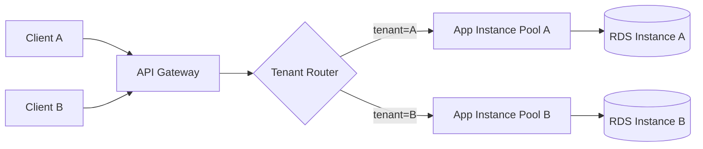
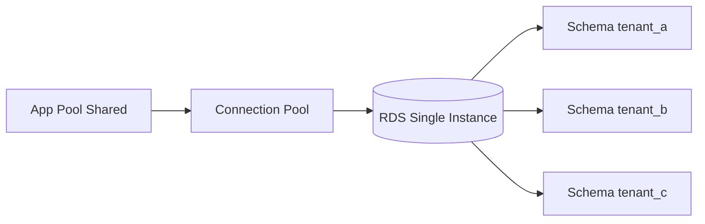
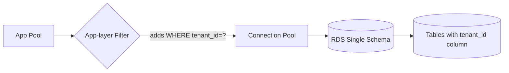
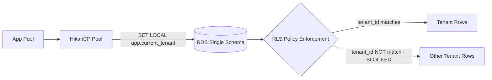
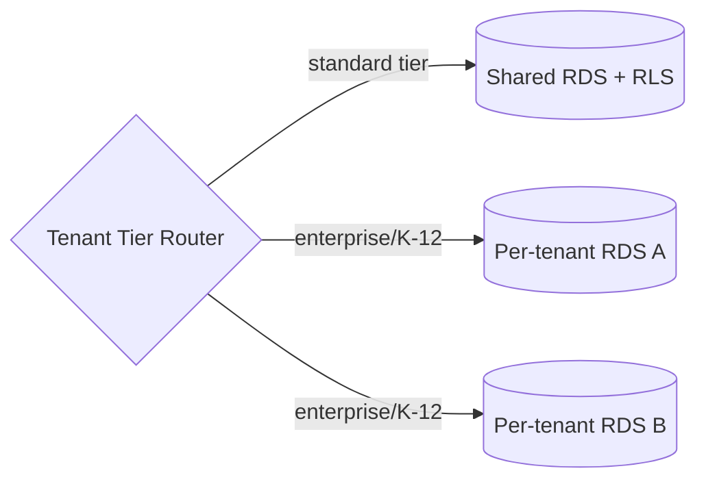

# Multi-tenant Isolation Patterns — ADR-style architecture decision report

## 1. TL;DR

KiteHub/KiteClass Platform là multi-tenant SaaS (mỗi tenant = 1 trung tâm giáo dục). Phase 1 BETA chọn **Pattern 4 — Shared Database + tenant_id + PostgreSQL Row-Level Security (RLS)** sau khi đánh giá 6 patterns trên 6 trục (isolation strength / ops cost / cross-tenant query feasibility / Phase fit / compliance posture / migration cost). Rationale: AWS Free Tier constraint (1 RDS instance giới hạn `db.t3.micro`), solo-dev ops scale (N×backup/N×migration không khả thi), RLS đẩy enforcement xuống DB layer (defense-in-depth khi application code có bug). RLS hardening Wave 85 (NULL `tenant_id` force-fail + HikariCP GUC reset) đóng silent cross-tenant leak attack surface. Re-evaluate triggers: ≥1 K-12 enterprise tenant yêu cầu physical isolation (chuyển hybrid Path A) HOẶC payment service cần PCI-DSS scope reduction (per-tenant DB cho subset).

---

## 2. Bối cảnh (Context)

### 2.1 Phase 1 BETA constraints

KiteHub Platform vận hành dưới ràng buộc thực tế của solo-dev startup giai đoạn beta:

- **Infrastructure budget:** AWS Free Tier 12 tháng — 1 RDS `db.t3.micro` (1 vCPU, 1 GB RAM, 20 GB SSD), 2 EC2 `t3.micro`, không có ngân sách cho multi-RDS scale-out
- **Tenant volume:** Phase 1 BETA dự kiến 10-50 tenant (mỗi tenant = 1 trung tâm giáo dục nhỏ-vừa, ~50-500 student/tenant)
- **Operations bandwidth:** solo developer; mọi cost ops (backup, migration, monitoring) nhân lên theo số DB instance là rủi ro nghiêm trọng
- **Compliance scope:** PDPL 2023 + Luật An ninh mạng 2018 (data localization VN region) — chưa K-12 (chưa cần MPS A05 + DPO)

### 2.2 Phase 2/3 scale projection

| Phase | Tenant count | Tenant profile | Compliance class |
|-------|--------------|----------------|------------------|
| Phase 1 BETA (current) | 10-50 | Solo Teacher / Center Owner (P1/P2) | PDPL baseline |
| Phase 2 (+4-6 tuần) | 50-200 | + Medium Center Manager (P3) | + DPIA cho payment |
| Phase 3 (+8-12 tuần) | 200-1000 | + K-12 enterprise | + DPO + MPS A05 + ISO27001 path |

Pattern selection Phase 1 PHẢI cho phép migration path tới Phase 3 mà không cần rewrite. Đây là constraint quan trọng nhất khi loại bỏ Pattern 3 (tenant_id ONLY without RLS) — migration cost từ "no RLS" sang "RLS" sau khi đã có 1000 tenant cực kỳ rủi ro.

### 2.3 Decision context

Decision này được lock cuối 2026-04-18 (Wave 7) sau khi đánh giá initial 4 patterns. Wave 85 (2026-05-15) bổ sung RLS hardening (NULL force-fail policy) đóng silent failure mode. Wave 100.5 (current) consolidate Section 7 thành standalone ADR-style report cho thesis Chapter 2 + future re-evaluate cycles.

---

## 3. Methodology

Mỗi pattern được đánh giá theo 6 trục:

| Axis | Định nghĩa | Scoring rubric |
|------|-----------|----------------|
| **Isolation strength** | Mức độ ngăn cách data giữa tenants — physical (instance) / logical (schema) / row (RLS) / application (code-only) | 5=physical, 4=schema, 3=RLS DB-enforced, 2=app-only, 1=none |
| **Ops cost** | Cost vận hành (backup, migration, monitoring, deploy) theo số tenant | 5=O(1), 4=O(log N), 3=O(N) shared resource, 2=O(N) per-tenant resource, 1=O(N²) |
| **Cross-tenant query feasibility** | Khả năng query analytics/admin across tenants | 5=trivial SQL, 4=federated query, 3=ETL pipeline, 2=manual aggregation, 1=impossible |
| **Phase fit** | Phù hợp với Phase 1 BETA constraints (Free Tier + solo dev + 10-50 tenant) | 5=ideal, 1=infeasible |
| **Compliance posture** | Đáp ứng PDPL data residency + Cybersecurity Law data localization + future ISO27001 | 5=audit-trivial, 1=audit-blocking |
| **Migration cost from current** | Effort move từ Pattern 4 (current) sang pattern này | 5=trivial, 1=full rewrite |

Scoring conducted bằng so sánh tương đối, không phải absolute benchmark.

---

## 4. Per-pattern deep-dive

### 4.1 Pattern 1 — Per-tenant database (1 RDS instance per tenant)

**Concept:** Mỗi tenant có 1 RDS instance riêng biệt. Application layer route connection pool theo tenant ID (header-based hoặc subdomain-based).



**Cost model:**

| Tenant scale | RDS cost (db.t3.small) | Backup S3 | Total/month |
|--------------|------------------------|-----------|-------------|
| 10 tenants | $290 | $5 | $295 |
| 50 tenants | $1,450 | $25 | $1,475 |
| 200 tenants | $5,800 | $100 | $5,900 |

**Security posture:** Strongest isolation — physical separation tại storage layer. Compromise của 1 tenant DB không ảnh hưởng tenant khác. Backup/restore độc lập (compliance audit dễ).

**Ops complexity:** Cao. N× backup schedule, N× migration deploy (Flyway phải chạy trên N DB), N× monitoring dashboards. Solo dev không thể scale.

**Performance:** Tốt — không có "noisy neighbor" effect. Connection pool nhỏ hơn (per-tenant pool ~10 connections vs shared pool ~100 connections).

**Cross-tenant query:** Khó. Cần federated query (PostgreSQL `postgres_fdw`) hoặc ETL pipeline đẩy data ra warehouse (Redshift / BigQuery). Analytics admin "có bao nhiêu trung tâm dùng feature X" yêu cầu fan-out query N RDS.

**Compliance:** Audit-trivial cho VN data residency — mỗi instance pin region `ap-southeast-1`. K-12 enterprise dễ chấp nhận (data physically separated).

**Verdict Phase 1 BETA:** ❌ REJECTED — cost ($295/month cho 10 tenants vs $15 cho Pattern 4) và ops scale (solo dev không quản lý nổi 10+ instance) không khả thi.

### 4.2 Pattern 2 — Per-tenant schema (1 schema per tenant, shared DB)

**Concept:** 1 RDS instance, mỗi tenant = 1 PostgreSQL schema (`tenant_a.users`, `tenant_b.users`). Application set `SET search_path` theo tenant context.



**Cost model:** Same RDS instance cost — $15/month db.t3.micro Free Tier. Marginal cost per tenant ≈ $0 (chỉ tăng disk usage).

**Security posture:** Logical isolation tại schema level. PostgreSQL `GRANT USAGE ON SCHEMA tenant_a TO role_tenant_a` enforce permission. Nhưng nếu application bug (set sai `search_path`) → cross-tenant leak silent.

**Ops complexity:** Medium-high. Flyway migration phải chạy N lần (1 lần/schema) — hoặc dùng `default_schema` workaround. Backup là 1 file dump nhưng restore selective tenant phải `pg_restore --schema=tenant_a`.

**Performance:** Tốt — shared connection pool, shared buffer cache. Query planner cache hits tốt.

**Cross-tenant query:** Trung bình. SQL `SELECT * FROM tenant_a.users UNION ALL SELECT * FROM tenant_b.users` khả thi nhưng phải biết trước schema list. Dynamic SQL cần introspect `information_schema.schemata`.

**Compliance:** Acceptable — data nằm trong 1 RDS instance pin region. Tuy nhiên K-12 audit có thể chất vấn "logical isolation không bằng physical".

**Verdict Phase 1 BETA:** ⚠️ DEFERRED — schema-per-tenant phức tạp migration management hơn Pattern 4 mà không tăng meaningful isolation strength (cả 2 đều logical). Loại bỏ vì migration management overhead.

### 4.3 Pattern 3 — Shared DB + tenant_id ONLY (no RLS)

**Concept:** 1 RDS, mọi table có column `tenant_id`, application layer thêm `WHERE tenant_id = ?` mọi query. Không có DB-level enforcement.



**Cost model:** Same Pattern 4 — $15/month.

**Security posture:** WEAK. Bất kỳ bug nào trong application code (forgot WHERE clause, ORM query builder edge case, raw SQL bypass) → silent cross-tenant leak. Không có defense-in-depth.

**Ops complexity:** Lowest — 1 DB, shared migration, shared backup.

**Performance:** Tốt — shared resources.

**Cross-tenant query:** Trivial — chỉ SELECT không WHERE clause.

**Compliance:** Audit-risky. ISO27001 + SOC2 auditor sẽ flag "no DB-level isolation enforcement" là weakness. PDPL chấp nhận nhưng không khuyến khích.

**Verdict Phase 1 BETA:** ❌ REJECTED — risk silent leak không chấp nhận được. Pattern 4 chỉ tốn ~5% migration overhead nhưng đẩy enforcement xuống DB layer.

### 4.4 Pattern 4 — Shared DB + tenant_id + RLS (CURRENT ADOPTED)

**Concept:** Như Pattern 3 nhưng thêm PostgreSQL Row-Level Security policy. Mọi table có RLS policy `USING (tenant_id = current_setting('app.current_tenant')::UUID)`. Connection pool set `SET LOCAL app.current_tenant = ?` mỗi request.



**Cost model:** $15/month db.t3.micro Free Tier. Marginal cost per tenant ≈ $0.

**Security posture:** STRONG — DB-level enforcement defense-in-depth. Application code có bug (quên WHERE) → RLS vẫn block. Wave 85 hardening: NULL `app.current_tenant` → policy FAIL (force-fail thay vì silent allow-all). Eliminates silent leak attack surface.

**Ops complexity:** Low. 1 RDS, 1 migration chain, 1 backup. RLS policy migration là 1 Flyway file (`V60__rls_policies.sql`).

**Performance:** Good. RLS adds ~5-10% overhead per query (PostgreSQL planner inject predicate). Acceptable cho Phase 1 BETA volume. HikariCP GUC reset (Wave 85) ngăn connection-pool leak GUC giữa requests.

**Cross-tenant query:** Hạn chế. Admin role (`BYPASS RLS` privilege) cần thiết cho analytics. KiteHub Platform có separate admin connection pool với bypass role.

**Compliance:** Audit-friendly. PDPL data residency OK (single region RDS). ISO27001 readiness tốt (DB-level isolation policy documentable). K-12 enterprise có thể chất vấn nhưng RLS là industry-recognized pattern (cited Microsoft Azure multi-tenant patterns + AWS SaaS Lens).

**Implementation history:**
- GAP-466 (Wave 7): Initial RLS implementation
- GAP-538 (Wave 84): tenant_id propagation chain hardening
- GAP-664 (Wave 85): NULL force-fail policy + HikariCP GUC reset

**Verdict Phase 1 BETA:** ✅ ADOPTED — best fit cho cost + ops + solo dev + compliance.

### 4.5 Pattern 5 — Hybrid (shared default + per-tenant DB cho high-value tenant)

**Concept:** Default Pattern 4 cho mọi tenant. Tenant nào pay enterprise tier hoặc compliance class K-12 → migrate sang per-tenant DB (Pattern 1 cho subset).



**Cost model:** Shared DB cost + per-enterprise RDS cost. Scale: 50 standard ($15) + 2 enterprise ($580 ÷ db.t3.small) = $595/month.

**Security posture:** Best of both — enterprise tenant có physical isolation, standard tenant có RLS defense-in-depth.

**Ops complexity:** High khi có ≥3 enterprise tenant — N× ops cho subset.

**Performance:** Tốt.

**Compliance:** Excellent — enterprise tenant satisfied với physical isolation argument.

**Verdict Phase 1 BETA:** ⚠️ DEFERRED Phase 3 — chưa có enterprise tenant. Migration path từ Pattern 4 → Hybrid documented §8.

### 4.6 Pattern 6 — Serverless multi-tenant (Aurora Serverless v2 / DynamoDB partition)

**Concept:** Aurora Serverless v2 auto-scale capacity theo load. Hoặc DynamoDB với `tenant_id` là partition key.

**Cost model:** Aurora Serverless v2 minimum 0.5 ACU = ~$45/month idle + scale cost. DynamoDB on-demand $1.25 per million writes.

**Security posture:** Aurora vẫn cần RLS (PostgreSQL-compatible). DynamoDB có IAM policy condition `dynamodb:LeadingKeys`.

**Ops complexity:** Lowest — fully managed scale.

**Performance:** Aurora auto-scale tốt cho spike load. DynamoDB latency P99 <10ms.

**Cross-tenant query:** Aurora OK. DynamoDB cực khó (no JOIN, scan toàn table cost cao).

**Compliance:** OK — AWS Singapore region available.

**Verdict Phase 1 BETA:** ❌ REJECTED — Aurora Serverless v2 minimum cost ($45/month) vượt Free Tier. DynamoDB model không phù hợp relational data của education domain (student-class-grade-attendance JOIN-heavy).

---

## 5. Comparative matrix

| Axis | P1 Per-DB | P2 Per-schema | P3 ID only | **P4 RLS (current)** | P5 Hybrid | P6 Serverless |
|------|:---------:|:-------------:|:----------:|:--------------------:|:---------:|:-------------:|
| Isolation strength | 5 | 4 | 2 | **3** | 4 | 3 |
| Ops cost | 1 | 3 | 5 | **5** | 2 | 4 |
| Cross-tenant query | 2 | 4 | 5 | **4** | 3 | 3 |
| Phase 1 BETA fit | 1 | 3 | 4 | **5** | 1 | 2 |
| Compliance posture | 5 | 3 | 2 | **4** | 5 | 4 |
| Migration cost from current | 1 | 3 | 5 | **5** | 3 | 2 |
| **Total (weighted Phase 1)** | 15 | 20 | 23 | **26** | 18 | 18 |

Pattern 4 (RLS) win Phase 1 BETA score nhờ balance giữa isolation strength acceptable + ops cost lowest + Phase fit ideal.

---

## 6. Decision narrative

Pattern 4 được chọn vì 5 lý do hội tụ:

1. **Cost constraint binding:** AWS Free Tier 1 RDS db.t3.micro $15/month vs Pattern 1 $295/month cho 10 tenants. 20× cost difference không justify được khi Phase 1 BETA chưa có revenue.

2. **Solo dev ops scale:** Pattern 1 yêu cầu N× backup schedule, N× migration deploy, N× monitoring. Solo dev không scale beyond ~3 instance trước khi ops trở thành bottleneck. Pattern 4 = 1 instance ops.

3. **Defense-in-depth security:** Pattern 3 (no RLS) có silent leak risk khi application bug. Pattern 4 push enforcement xuống DB layer — application bug bị RLS policy block. Wave 85 hardening (NULL force-fail) đóng nốt silent failure mode khi `SET LOCAL` miss.

4. **Cross-tenant query feasibility:** Admin analytics (KiteHub Platform layer) cần aggregate metrics across tenants. Pattern 4 với admin role BYPASS RLS là trivial. Pattern 1 phải federated query.

5. **Migration path tới Phase 3:** Pattern 4 → Pattern 5 (Hybrid) là incremental — chỉ migrate subset enterprise tenant sang per-DB, rest giữ shared. Pattern 3 → Pattern 4 (post-fact RLS add) sau khi có 1000 tenant rủi ro cao.

Quyết định lock 2026-04-18 (Wave 7). Wave 85 (2026-05-15) tightening RLS không đổi quyết định gốc, chỉ đóng gap implementation.

---

## 7. Re-evaluate triggers

Decision này KHÔNG vĩnh viễn. Revisit khi 1 trong các trigger fire:

| Trigger | Action |
|---------|--------|
| ≥1 K-12 enterprise tenant ký contract yêu cầu "data physically isolated from other tenants" | Move sang Pattern 5 Hybrid — tenant K-12 được dedicated RDS |
| Payment service cần PCI-DSS scope reduction | Move payment subset sang per-service-per-tenant DB (Pattern 1 cho payment scope only) |
| Phase 2 EKS migration + tenant >200 + shared DB hit connection pool limit (>200 active connections / db.t3.small max ~150) | Vertical scale RDS (db.r5.large) HOẶC partition tenant cohort sang separate RDS (poor man's Hybrid) |
| Compliance: ISO27001 audit fail trên "shared infrastructure for sensitive data" | Document RLS isolation evidence; nếu auditor không chấp nhận → move sang Hybrid |
| Performance: P95 query latency >500ms do RLS overhead | Profile + optimize indexes; nếu vẫn fail → evaluate per-tenant schema (Pattern 2) hoặc partition |
| Cross-region requirement (Singapore + Hà Nội data residency) | Per-region RDS cluster — orthogonal với isolation pattern; recommend Hybrid Path A |

---

## 8. Migration paths

### 8.1 Path A — Current (Pattern 4) → Hybrid (Pattern 5)

Trigger: enterprise tenant cần physical isolation.

```
Step 1: Provision per-tenant RDS instance (Terraform module reuse)
Step 2: pg_dump tenant data từ shared DB (filter WHERE tenant_id = ?)
Step 3: pg_restore vào new RDS
Step 4: Application config — tenant tier router (DB endpoint switching)
Step 5: Cutover (5-10 min downtime cho tenant đó)
Step 6: Soft-delete tenant data từ shared DB (audit retention)
```

Effort: ~2-3 ngày cho first migration; ~4-8 giờ cho subsequent (template reuse). Migration script test trên Phase 2 staging trước.

### 8.2 Path B — Current (Pattern 4) → Per-tenant DB (Pattern 1)

Trigger: business model change (enterprise-only product).

Effort: ~2-3 tuần full rewrite tenant routing layer. NOT recommended trừ khi business model thật sự pivot.

### 8.3 Decision tree

```
                Re-evaluate fire?
                       |
              ┌────────┴────────┐
              YES               NO → Keep Pattern 4
              |
       Enterprise tenant?
              |
       ┌──────┴──────┐
       YES           NO → Profile + tune RLS, defer 1 quarter
       |
   ≥3 enterprises?
       |
   ┌───┴───┐
   YES     NO → Path A (Hybrid, move only those tenants)
   |
   Path B candidate? (full pivot)
```

---

## 9. Implementation lessons learned

### 9.1 GAP-466 (Wave 7) — Initial RLS implementation

Triển khai RLS policy lần đầu trên 23 tables. Lesson: phải `ALTER TABLE ... FORCE ROW LEVEL SECURITY` (không chỉ `ENABLE`) vì owner role bypass RLS by default. Default PostgreSQL RLS chỉ apply cho non-owner roles.

### 9.2 GAP-538 (Wave 84) — tenant_id propagation chain

Audit phát hiện 3 service endpoint không propagate `tenant_id` qua RabbitMQ event payload. Consumer service set `app.current_tenant` từ event header — nếu header missing → silent allow-all. Fix: thêm validation aspect `@TenantRequired` trên consumer methods.

### 9.3 GAP-664 (Wave 85) — NULL force-fail + HikariCP GUC reset

2 critical hardenings:

**(a) NULL force-fail policy:** Original RLS policy `USING (tenant_id = current_setting('app.current_tenant')::UUID)` — nếu GUC chưa set, `current_setting` raise exception (good) HOẶC return empty string (silent NULL coerce). Fix: `USING (tenant_id = current_setting('app.current_tenant', false)::UUID)` — second param `false` = throw error nếu unset. Eliminates silent leak khi developer quên `SET LOCAL`.

**(b) HikariCP GUC reset:** HikariCP reuse connection từ pool. Nếu connection N được set `app.current_tenant = A`, return về pool, connection N+1 lấy connection đó cho request tenant B mà không reset GUC → query thấy tenant A's RLS context. Fix: HikariCP `connection-init-sql: RESET app.current_tenant` + application interceptor `SET LOCAL` trước mỗi transaction. `SET LOCAL` scope = transaction (auto-reset on commit) — defense-in-depth.

### 9.4 Performance baseline

Wave 85 performance audit /100: 86 B+. RLS overhead measured ~6-8% query latency increase vs no-RLS baseline. Acceptable cho Phase 1 BETA volume; revisit nếu Phase 2 hit >500ms P95.

---

## 10. Compliance + risk register

| Pattern | PDPL data residency | Cybersecurity Law data localization | ISO27001 readiness | SOC2 Type II readiness |
|---------|:-------------------:|:-----------------------------------:|:------------------:|:----------------------:|
| P1 Per-DB | ✅ trivial | ✅ pin region | ✅ strongest | ✅ |
| P2 Per-schema | ✅ | ✅ | ⚠️ logical only | ⚠️ |
| P3 ID only | ✅ | ✅ | ❌ flag | ❌ flag |
| **P4 RLS (current)** | ✅ | ✅ | ⚠️ document RLS evidence | ⚠️ document |
| P5 Hybrid | ✅ | ✅ | ✅ enterprise subset | ✅ subset |
| P6 Serverless | ✅ | ✅ region pin | ⚠️ shared infrastructure | ⚠️ |

**Active risks Pattern 4:**

1. **RLS bypass via raw SQL:** Application code sử dụng `EntityManager.createNativeQuery` không bị Hibernate inject RLS context. Mitigation: code review checklist + `@TenantRequired` aspect.
2. **HikariCP edge case:** Long-running transaction holds connection >5 min, GUC reset delayed. Mitigation: timeout config.
3. **Admin role over-privilege:** `BYPASS RLS` role nếu leak credentials = full data access. Mitigation: admin role secrets rotation Wave 84 GAP-379 (90-day cadence).
4. **PostgreSQL version dependency:** RLS feature stable từ PG 9.5+. Locked PG 15 (RDS default). Upgrade path tested.

---

## 11. References

[1] AWS Architecture Center, "SaaS Lens — AWS Well-Architected Framework," AWS, 2024. [Online]. Available: https://docs.aws.amazon.com/wellarchitected/latest/saas-lens/saas-lens.html

[2] Microsoft Azure Architecture Center, "Multi-tenant SaaS database tenancy patterns," Microsoft, 2024. [Online]. Available: https://learn.microsoft.com/en-us/azure/azure-sql/database/saas-tenancy-app-design-patterns

[3] F. Pothon, "Architecting Multi-Tenant SaaS Solutions," in Patterns for Cloud-Native Architectures, O'Reilly Media, 2023, ch. 7, pp. 145-198.

[4] PostgreSQL Global Development Group, "Row Security Policies — PostgreSQL 15 Documentation," 2024. [Online]. Available: https://www.postgresql.org/docs/15/ddl-rowsecurity.html

[5] Quốc hội Việt Nam, "Luật Bảo vệ dữ liệu cá nhân số 91/2025/QH15 (PDPL)," Cổng thông tin điện tử Chính phủ, 2025. [Online]. Available: https://thuvienphapluat.vn/van-ban/Cong-nghe-thong-tin/Luat-Bao-ve-du-lieu-ca-nhan-2025

[6] Quốc hội Việt Nam, "Luật An ninh mạng số 24/2018/QH14," Cổng thông tin điện tử Chính phủ, 2018. [Online]. Available: https://thuvienphapluat.vn/van-ban/Cong-nghe-thong-tin/Luat-an-ninh-mang-2018

[7] G. Spillere, "Tenant isolation strategies for SaaS applications on AWS," AWS SaaS Factory whitepaper, 2023. [Online]. Available: https://aws.amazon.com/blogs/apn/tenant-isolation-with-saas/

---

## 12. Log

- **2026-05-19 (v1.0.0):** Initial standalone ADR-style report. Wave 100.5 GAP-682 origin. Expanded từ `multi-tenant-architecture.md` Section 7 baseline (19 lines table) thành 12-section deep-dive cho thesis Chapter 2 source material. Methodology 6-axis comparative matrix. 6 patterns evaluated (P1-P6). Decision: Pattern 4 (Shared DB + RLS) ADOPTED Phase 1 BETA. Re-evaluate triggers + 2 migration paths documented. Implementation lessons learned cite GAP-466 (initial RLS) + GAP-538 (tenant_id propagation) + GAP-664 (NULL force-fail + HikariCP GUC reset). References 7 sources IEEE format (AWS SaaS Lens + Azure multi-tenant patterns + Pothon book + PostgreSQL docs + VN PDPL + VN Cybersecurity Law + AWS SaaS Factory whitepaper). Reviewer: @nguyenvankiet (solo-dev initial creation; future revisions per `rule-change-process.md` §5 matrix).
