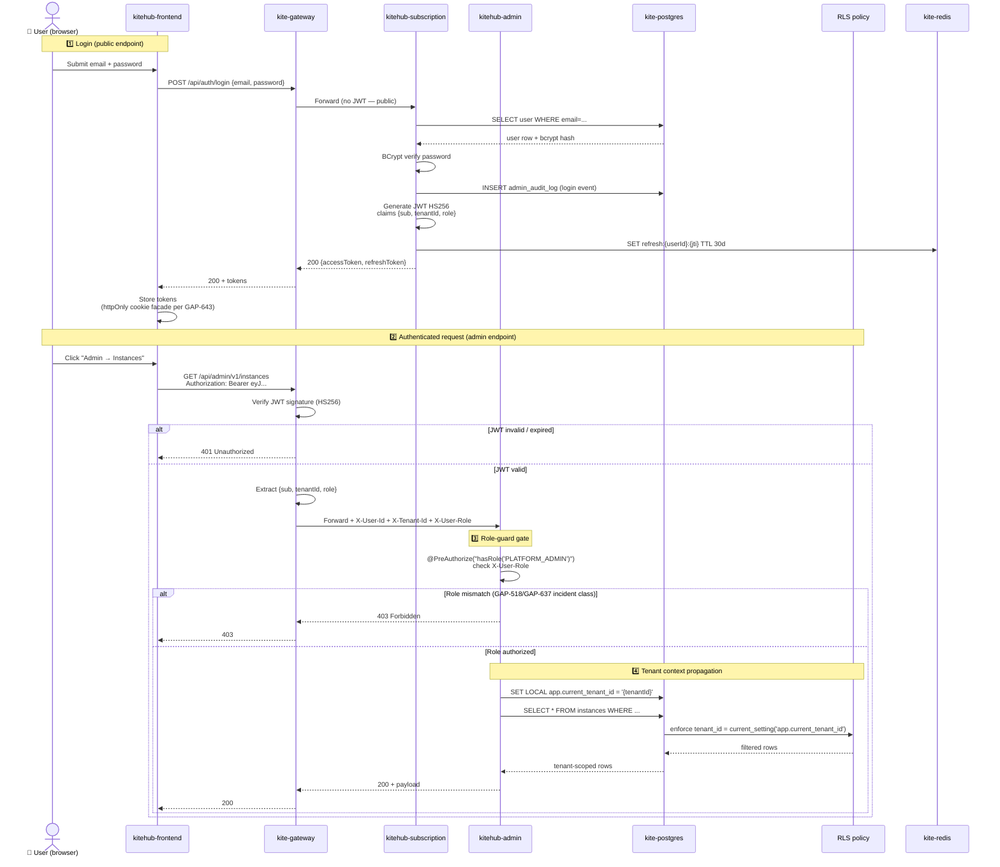

# Service Catalog + Dependency Graph + Auth Flow

**Wave:** 99B Bucket B1 (GAP-670)
**Phase:** 1 BETA (Release Lần 1)
**Sister docs:** [`kitehub-architecture.md`](kitehub-architecture.md) · [`kiteclass-architecture.md`](kiteclass-architecture.md) · [`multi-tenant-architecture.md`](multi-tenant-architecture.md) · [`adr/ADR-011-tenant-isolation-strategy.md`](adr/ADR-011-tenant-isolation-strategy.md) · [`adr/ADR-032-kiteclass-gateway-removal.md`](adr/ADR-032-kiteclass-gateway-removal.md)

Báo cáo phục vụ 3 nhu cầu cao tần suất:
1. **Onboarding dev mới** (Persona 1) — tra cứu service nào ở đâu, port nào, dependency nào.
2. **SRE on-call** (Persona 3) — định vị health endpoint, runbook, dependency graph để triage.
3. **Tech lead review** (Persona 4) — kiểm tra auth flow + role-guard matrix khi review PR có endpoint mới.

Source-of-truth (verified 2026-05-19 worktree): `kitehub/docker-compose.kitehub.yml`, `kitehub/*/src/main/resources/application.yml`, `kiteclass/kiteclass-core/src/main/resources/application.yml`, `kitehub/*/pom.xml`.

---

## 1. Service Catalog (Backstage pattern)

Mỗi service = một row. Cột bao gồm: name + repo path + port (host:container) + responsibility + owner + health endpoint + runbook + on-call. Phase 1 BETA solo-dev → owner + on-call = `@nguyenvankiet` cho mọi row.

### 1.1 Backend services (Spring Boot)

| Service | Repo path | Port (host:container) | Responsibility | Owner | Health endpoint | Runbook | On-call |
|---|---|---|---|---|---|---|---|
| **kite-gateway** | `kitehub/kitehub-gateway/` | `9000:9000` | Spring Cloud Gateway — JWT verify, subdomain → tenant resolve, X-User-Id/X-Tenant-Id/X-User-Role propagation, Redis-backed rate limit per tenant (per GAP-604) | `@nguyenvankiet` | `GET /actuator/health` | [`05-guides/operations/audit-chain-break-runbook.md`](../05-guides/operations/audit-chain-break-runbook.md) | N/A solo-dev |
| **kitehub-subscription** | `kitehub/kitehub-subscription/` | `8081:8081` (container `SERVER_PORT:8081`) | Auth (JWT issuance) + Trial + Subscription + Billing + Onboarding + Beta access + DSAR + Audit log + Outbox + Payment webhook + Feedback + Impersonation | `@nguyenvankiet` | `GET /actuator/health` | [`05-guides/operations/incident-response-runbook.md`](../05-guides/operations/incident-response-runbook.md) | N/A solo-dev |
| **kitehub-admin** | `kitehub/kitehub-admin/` | `8083:8083` (container `SERVER_PORT:8083`) | Platform admin v1 — instances CRUD + payments + revenue dashboard (per GAP-637 @PreAuthorize hardening) | `@nguyenvankiet` | `GET /actuator/health` | [`05-guides/operations/incident-response-runbook.md`](../05-guides/operations/incident-response-runbook.md) | N/A solo-dev |
| **kitehub-branding** | `kitehub/kitehub-branding/` | `8083:8083` host collision với admin — production deploy via Docker network alias, dev compose dùng different host port; verify pre-deploy | `@nguyenvankiet` | `GET /actuator/health` | [`05-guides/branding/`](../05-guides/branding/) | N/A solo-dev |
| **kitehub-email** | `kitehub/kitehub-email/` | `8084:8084` | Transactional email — NotificationChannel strategy (SES primary + Resend dormant per `email-architecture.md`) | `@nguyenvankiet` | `GET /actuator/health` | [`05-guides/operations/incident-response-runbook.md`](../05-guides/operations/incident-response-runbook.md) | N/A solo-dev |
| **kitehub-platform** | `kitehub/kitehub-platform/` | N/A (library JAR) | Shared starter — auth filter + tenant context + OpenTelemetry config + common DTO + common error handler. KHÔNG deployable. | `@nguyenvankiet` | N/A | N/A | N/A solo-dev |
| **kitehub-base** | `kitehub/kitehub-base/` | N/A (Docker base image) | JDK 21 + Maven + common entrypoint. Build-time only. | `@nguyenvankiet` | N/A | N/A | N/A solo-dev |
| **kiteclass-core** | `kiteclass/kiteclass-core/` | `8088:8081` (compose maps host 8088 → container 8081) | KiteClass per-tenant business logic (student/course/class/attendance/grade/payment) + tenant-scoped auth post-ADR-032 (gateway removed). RLS-backed multi-tenant isolation. | `@nguyenvankiet` | `GET /actuator/health` | [`kiteclass-architecture.md §Multi-Tenant`](kiteclass-architecture.md) | N/A solo-dev |

> **Port collision note:** `kitehub-admin` và `kitehub-branding` cùng dùng container port `8083`. Trong dev compose, một trong hai expose qua host port khác (verify trong `kitehub/docker-compose.kitehub.yml` trước khi `./scripts/up.sh`). Production EC2 self-host dùng Docker network alias → không xung đột. Tracked cho follow-up cleanup wave.

### 1.2 Frontend services (Next.js 15)

| Service | Repo path | Port (host:container) | Responsibility | Owner | Health endpoint | Runbook |
|---|---|---|---|---|---|---|
| **kitehub-frontend** | `kitehub/kitehub-frontend/` | `3000:3000` | Next.js 15 — tenant signup + dashboard + branding studio + billing + beta-access wizard + platform admin UI | `@nguyenvankiet` | `GET /api/health` (Next.js) | [`05-guides/deploy/`](../05-guides/deploy/) |
| **kiteclass-frontend** | `kiteclass/kiteclass-frontend/` | `3001:3001` | Next.js 15 — KiteClass tenant-facing UI (student/teacher/parent portals) | `@nguyenvankiet` | `GET /api/health` (Next.js) | [`05-guides/deploy/`](../05-guides/deploy/) |

### 1.3 Shared infrastructure (`kite-` prefix)

| Component | Container | Host port | Role |
|---|---|---|---|
| PostgreSQL 15 | `kite-postgres` | `5433:5432` | Schema `kitehub` (KiteHub services) + schema `kiteclass` với Row-Level Security (KiteClass tenant isolation) |
| Redis 7 | `kite-redis` | `6380:6379` | Cache + rate-limit (gateway) + refresh-token blacklist + session |
| RabbitMQ 3 | `kite-rabbitmq` | `5673:5672` AMQP + `15673:15672` mgmt UI | Outbox dispatch + email queue + AI branding queue + instance purge fanout |
| MinIO | `kite-minio` | `9100:9000` API + `9191:9091` console | S3-compatible — branding assets + file uploads + backup |
| MailHog (dev) | `kite-mailhog` | `1025:1025` SMTP + `8025:8025` UI | Local email testing (prod = AWS SES) |
| Prometheus | `kite-prometheus` | `9090:9090` | Metrics scrape từ Spring Boot Actuator |
| Grafana | `kite-grafana` | `3002:3002` | Metrics visualization + alerting |
| Ollama | `kite-ollama` | `11434:11434` | Local LLM cho AI branding strategy (production dùng MiniMax per ADR-019) |

**Total inventory:** 7 backend services (6 deployable + 1 library) + 1 build-time base image + 2 frontends + 8 infrastructure containers = **18 services + infra components**.

---

## 2. Dependency Graph (Mermaid flowchart)

Inter-service HTTP + RabbitMQ + DB + S3 dependencies. Grep-verified từ `@FeignClient` / `RestTemplate` / `WebClient` / `@RabbitListener` / `rabbitTemplate.convertAndSend` usage trong source.

```mermaid
flowchart TB
    User[👤 User<br/>Browser]

    subgraph Edge[Edge layer]
        CF[Cloudflare DNS + CDN]
    end

    subgraph FE[Frontend layer]
        KH_FE[kitehub-frontend<br/>:3000]
        KC_FE[kiteclass-frontend<br/>:3001]
    end

    subgraph GW[Gateway layer]
        Gateway[kite-gateway<br/>:9000<br/>JWT verify + tenant resolve]
    end

    subgraph KH[KiteHub services]
        Sub[kitehub-subscription<br/>:8081]
        Brand[kitehub-branding<br/>:8083]
        Email[kitehub-email<br/>:8084]
        Admin[kitehub-admin<br/>:8083]
    end

    subgraph KC[KiteClass services]
        Core[kiteclass-core<br/>:8088]
    end

    subgraph Infra[Shared infrastructure]
        PG[(kite-postgres<br/>:5433)]
        Redis[(kite-redis<br/>:6380)]
        MQ[kite-rabbitmq<br/>:5673]
        MinIO[(kite-minio<br/>:9100)]
    end

    subgraph External[External]
        SES[AWS SES<br/>ap-southeast-1]
        VietQR[VietQR API]
        Ollama[kite-ollama<br/>:11434]
        MiniMax[MiniMax cloud]
        Captcha[Cloudflare Turnstile]
    end

    User --> CF
    CF --> KH_FE
    CF --> KC_FE
    KH_FE -->|REST /api/v1/*| Gateway
    KC_FE -->|REST /api/v1/*| Gateway

    Gateway -->|JWT + X-User-Id/Tenant-Id/Role| Sub
    Gateway -->|JWT + headers| Brand
    Gateway -->|JWT + headers| Email
    Gateway -->|JWT + headers| Admin
    Gateway -->|JWT + headers| Core
    Gateway -->|rate-limit per tenant| Redis

    Sub -->|JDBC| PG
    Sub -->|JWT refresh blacklist + cache| Redis
    Sub -->|RestTemplate POST /api/email/send| Email
    Sub -->|publish email.exchange| MQ
    Sub -->|publish instance.purge.exchange fanout| MQ
    Sub -->|RestTemplate VietQR API| VietQR
    Sub -->|RestTemplate verify| Captcha

    Brand -->|JDBC| PG
    Brand -->|S3 SDK| MinIO
    Brand -->|WebClient /api/chat| Ollama
    Brand -->|WebClient /chat/completions| MiniMax
    Brand -.publish branding.deploy.* future.-> MQ

    Email -->|@RabbitListener email.queue| MQ
    Email -->|AWS SDK SesV2Client| SES
    Email -->|WebClient /api/v1/branding/{instanceId}/package| Brand

    Admin -->|JDBC| PG
    Admin -.invoke subscription admin API.-> Sub

    Core -->|JDBC + RLS| PG
    Core -->|cache + session| Redis
    Core -->|publish branding.events| MQ
    Core -->|S3 SDK| MinIO
```

**Edge count:** 8 frontend→gateway/CF + 5 gateway→service (forward) + 1 gateway→redis (rate-limit) + 12 service→infra (PG/Redis/MQ/MinIO) + 6 service→external (SES/VietQR/Ollama/MiniMax/Captcha) + 5 inter-service (sub→email REST + email→branding WebClient + email→MQ + sub→MQ exchanges + admin→sub) = **~37 edges across 18 nodes**.

> **Auto-gen flag:** Backstage Service Catalog convention recommends auto-gen từ `@FeignClient` parser + Maven POM scanner. Phase 1 BETA hand-maintain; tracked cho Wave 100+ follow-up gap nếu inventory grows >25 services.

---

## 3. Auth Flow (Mermaid sequenceDiagram)

JWT → gateway → X-Tenant-Id header → service `@PreAuthorize` → SET LOCAL `app.current_tenant_id` → RLS policy enforce. Defense-in-depth per ADR-011 + multi-tenant-architecture.md §3.



**Step count:** 4 phases (login → request → role-guard → tenant-context+RLS) × ~6 messages each = **~24 sequence steps**.

Reference chain:
- **JWT spec** — HS256, claims `{sub, tenantId, role}`, access 15min / refresh 30d rotation per `pre-launch-auth-hardening-checklist.md` §2.8
- **Header propagation** — `X-User-Id` / `X-Tenant-Id` / `X-User-Role` set bởi gateway per GAP-604 (Wave 89)
- **Service-side role verify** — mỗi service trust headers (zero-trust intra-cluster) per `audit-service-isolation.md`
- **RLS policy** — `SET LOCAL app.current_tenant_id` per request → Postgres RLS enforce per `multi-tenant-architecture.md` §3

---

## 4. Role-Guard Matrix

Mapping `@PreAuthorize` annotations → controller paths → permitted roles. Verified 2026-05-19 grep trong `kitehub-admin/src/main/java` + `kitehub-subscription/src/main/java`.

| Controller | Path prefix | Method | `@PreAuthorize` | Permitted role(s) | Reference incident |
|---|---|---|---|---|---|
| `AdminInstancesController` | `/api/admin/v1/instances` | GET / POST / PATCH / DELETE | `hasRole('PLATFORM_ADMIN')` | PLATFORM_ADMIN | GAP-637 (Wave 92 @PreAuthorize hardening) |
| `AdminPaymentsController` | `/api/admin/v1/payments` | GET / POST | `hasRole('PLATFORM_ADMIN')` | PLATFORM_ADMIN | GAP-637 |
| `AdminRevenueController` | `/api/admin/v1/revenue` | GET | `hasRole('PLATFORM_ADMIN')` | PLATFORM_ADMIN | GAP-637 |
| `ImpersonationController` | `/api/impersonate/*` | POST start/stop/list | `hasRole('PLATFORM_ADMIN')` | PLATFORM_ADMIN | `audit-service-isolation.md` |
| `StaffInvitationController` | `/api/staff/invitations/*` | POST / GET / DELETE | `OWNER_AUTHZ` constant | P2_CENTER_OWNER (+ legacy aliases) | Staff onboarding scope |
| `SubscriptionController` | `/api/subscription/*` | GET listing | `OWNER_OR_STAFF_AUTHZ` constant | P2_CENTER_OWNER + P3_CENTER_MANAGER | Subscription read access |
| `SubscriptionController` | `/api/subscription/*` | POST / PATCH billing | `OWNER_AUTHZ` constant | P2_CENTER_OWNER only | Billing isolation |
| `PaymentController` | `/api/payments/*` | POST initiate | `OWNER_AUTHZ` constant | P2_CENTER_OWNER | Phase 1.5+ payment scope |
| `BetaAccessController` | `/api/v1/auth/beta-signup/*` | POST exchange | (public — no `@PreAuthorize`) | Anonymous | Beta access flow |
| `AuthController` | `/api/auth/login`, `/register`, `/refresh`, `/verify-email` | POST | (public — no `@PreAuthorize`) | Anonymous | Auth bootstrap |

### 4.1 Role taxonomy (canonical)

| Role | Scope | Granted by | Reference |
|---|---|---|---|
| `PLATFORM_ADMIN` | Toàn KiteHub platform | Seed data + manual provision | GAP-518 (role naming reconciliation BE/FE) |
| `P2_CENTER_OWNER` | Tenant owner — full access trong tenant | Tenant signup (first user) | `documents/01-business/auth/rules.md` |
| `P3_CENTER_MANAGER` | Tenant manager — limited admin (no billing, no offboard) | Invite từ P2 | `documents/01-business/auth/rules.md` |
| `P1_SOLO_TEACHER` | Solo teacher — chỉ scope cá nhân + own classes | Tenant signup hoặc invite | `documents/01-business/auth/rules.md` |

### 4.2 Recent incident references

- **GAP-518 (Wave 71b)** — BE seed role name mismatch với FE role-guard literal → 403 redirect loop. Fix: reconciled `PLATFORM_ADMIN` literal cả BE seed + FE `RoleGuard.tsx` + JWT claim. Closed via `pre-handoff-self-test-completeness.md` §2.4 admin-flow checklist.
- **GAP-604 (Wave 89)** — Gateway JWT → headers propagation missing cho admin v1 routes → service-side `@PreAuthorize` không có role để verify → 403. Fix: gateway extract `role` claim + set `X-User-Role` header.
- **GAP-637 (Wave 92)** — Admin v1 controllers missing `@PreAuthorize` (OWASP A01 broken access control). Fix: all 3 admin v1 controllers (Instances + Payments + Revenue) got `hasRole('PLATFORM_ADMIN')` annotation + MockMvc IT.
- **GAP-638 (Wave 92)** — 6 admin v1 endpoints undocumented trong `api-contract.md`. Phase 1 BETA gate prerequisite.

---

## 5. References

- **Source-of-truth files:** `kitehub/docker-compose.kitehub.yml` + `kitehub/*/pom.xml` + `kitehub/*/src/main/resources/application.yml` + `kiteclass/kiteclass-core/src/main/resources/application.yml`
- **Sister docs:** [`kitehub-architecture.md`](kitehub-architecture.md), [`kiteclass-architecture.md`](kiteclass-architecture.md), [`multi-tenant-architecture.md`](multi-tenant-architecture.md)
- **ADRs:** ADR-011 (tenant isolation defense-in-depth), ADR-023 (gateway key resolver), ADR-031 (FE self-host AWS EC2), ADR-032 (kiteclass-gateway removal)
- **Rules:** `audit-service-isolation.md` (zero-trust intra-cluster), `pre-launch-auth-hardening-checklist.md` (refresh rotation), `diagram-format-selection.md` (Mermaid mandate)
- **Business docs:** [`01-business/auth/`](../01-business/auth/) (3-layer rules + use-cases + api-contract)
- **Recent gaps:** GAP-518 / GAP-604 / GAP-637 / GAP-638 / GAP-643

---

*Audience: dev. Diagram format: Mermaid per `diagram-format-selection.md` §2.2. Narrative language: Vietnamese per `dev-readable-doc-language.md`.*
