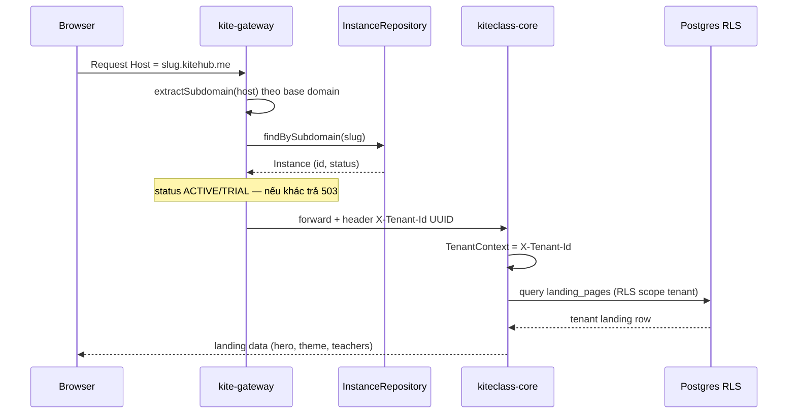
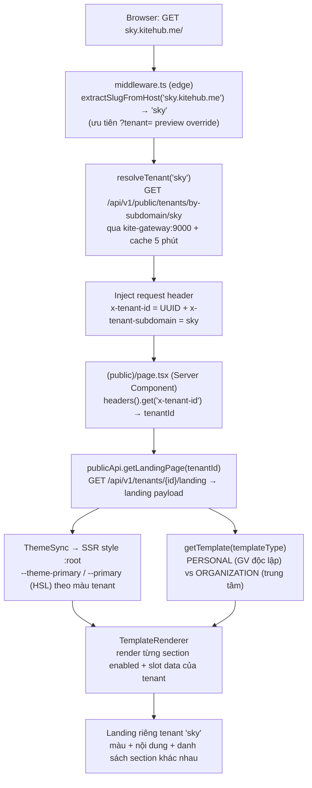

# Tenant → Domain → Landing — kiến trúc end-to-end

> **TL;DR:** Mỗi tenant (trung tâm) có 1 landing page public riêng, truy cập qua **subdomain** `{slug}.kitehub.me` (free) hoặc **custom domain** (`skyedu.vn`, tier PREMIUM/ENTERPRISE). Cùng 1 codebase FE + 1 shared-DB (RLS) — nội dung + theme riêng theo tenant, resolve theo Host. Doc này map chuỗi đầy đủ + đánh dấu chỗ đã implement vs gap (GAP-812/814 còn lại). **Vì sao FE render được landing theo tenant (chuỗi FE-render: tenant resolution → fetch landing data → inject theme CSS vars → TemplateRenderer): xem §7.**

Nguồn: verified trên code 2026-05-29 (3 research agent + 3 outside-in agent). Cross-ref: [`multi-tenant-architecture.md`](./multi-tenant-architecture.md), [`ssl-automation.md`](./ssl-automation.md) (canonical cho SSL/verify), [`domain-management.md`](./domain-management.md), [ADR-023](./adr/ADR-023-gateway-key-resolver-strategy.md).

---

## 1. Chuỗi tổng thể

**Hai đường request:**
- `/api/**` → gateway resolve Host → tenant → core (data scoped RLS).
- `/` (FE root, trang landing) → FE Next.js render; FE tự fetch landing data qua gateway.

---

## 2. Phân tầng + trạng thái implement

| Tầng | Cơ chế (verified) | Trạng thái |
|---|---|---|
| **DNS** | Cloudflare: `*.kitehub.me` wildcard (subdomain) + per-custom-domain record | ✅ subdomain; ⚠️ custom domain chờ GAP-812 |
| **Gateway** (`kitehub-gateway` `TenantResolverGatewayFilterFactory`) | Host → tenant 4 bước: header dev → subdomain suffix-match `${kitehub.domain.base}` → `findByCustomDomain(host)` → JWT claim fallback. Inject `X-Tenant-Id` (UUID). Gate status ACTIVE/TRIAL. | ✅ cho `/api/**`. Landing route `/api/v1/tenants/*/landing` **skip filter** (tenantId từ path). ⚠️ thiếu strip client `X-Tenant-Id` → **GAP-814 (P0 security)** |
| **Instance domain model** (`kitehub-platform` `Instance`) | `subdomain` (unique, regex, indexed) + `customDomain` + `domainVerifyToken` (TXT) + `domainStatus` (NONE→PENDING_VERIFY→VERIFIED/FAILED) | ✅ subdomain; ⚠️ custom domain entity có, DNS verify + SSL chưa wire → **GAP-812** |
| **Data isolation** | shared-DB + RLS (ADR-023); `TenantContext` từ `X-Tenant-Id`; mỗi tenant 1 `landing_pages` row (BR-MKT-001) | ✅ RLS; ⚠️ phụ thuộc `X-Tenant-Id` đáng tin → **GAP-814** |
| **FE landing render** (`kiteclass-frontend`) | `src/middleware.ts` (edge) resolve Host subdomain → slug → gọi public resolve endpoint → inject header `x-tenant-id` cho Server Components; `(public)/page.tsx` + `(public)/layout.tsx` đọc header → fetch landing per tenant; `ThemeSync` inject CSS vars; `TemplateRenderer` chọn config personal/organization. **Chuỗi chi tiết §7.** | ✅ **1-FE-many-tenant by Host** — middleware shipped (GAP-811 port qua GAP-1077); `?tenant=` (preview) + `NEXT_PUBLIC_TENANT_ID` (1-tenant-per-deploy) vẫn là fallback |

---

## 3. Domain resolution flow (sequence)

Custom domain: thay `findBySubdomain(slug)` bằng `findByCustomDomain(host)` (cùng `routeToInstance`). Apex domain cần A-record (CNAME bất hợp lệ trên root) — xem GAP-812.

---

## 4. Subdomain vs custom domain

| | Subdomain `{slug}.kitehub.me` | Custom domain `skyedu.vn` |
|---|---|---|
| Cấp cho | Mọi tenant (free) | Tier PREMIUM/ENTERPRISE |
| DNS | Wildcard `*.kitehub.me` (provision sẵn) | Tenant tự trỏ CNAME (subdomain) / A (apex) |
| SSL | Wildcard cert sẵn | Cloudflare for SaaS auto-issue (DCV qua CNAME) — xem `ssl-automation.md` |
| Verify ownership | Không cần | TXT/Delegated-DCV (tách khỏi routing record) |
| Trạng thái | ✅ Hoạt động | ⚠️ Scaffold — GAP-812 (DNS verify stub + SSL chưa wire) |

---

## 5. Gaps liên quan (initiative fix triệt để)

| Gap | P | Scope |
|---|---|---|
| [GAP-814](../04-quality/gaps/phase-1-beta/GAP-814-tenant-header-spoofing-gateway-strip.md) | P0 | Gateway strip client `X-Tenant-Id` (cross-tenant IDOR) — ưu tiên cao nhất |
| [GAP-813](../04-quality/gaps/phase-1-beta/GAP-813-base-domain-consistency-slug-resolution.md) | P1 | Reconcile base domain (1 env) + public `by-subdomain/{slug}→tenantId` endpoint — ✅ endpoint shipped (`resolveTenant.ts` gọi `GET /api/v1/public/tenants/by-subdomain/{slug}`, backing controller `PublicTenantController`) |
| [GAP-811](../04-quality/gaps/phase-1-beta/GAP-811-fe-middleware-host-tenant-resolution.md) | P1 | FE `middleware.ts` host→tenant (1-FE-many-tenant) — ✅ middleware shipped (`kiteclass-frontend/src/middleware.ts` port qua GAP-1077); xem §7 |
| [GAP-812](../04-quality/gaps/phase-1-beta/GAP-812-custom-domain-dns-ssl-completion.md) | P2 | Custom domain DNS verify + SSL provisioning hoàn thiện |

Thứ tự implement đề xuất: GAP-814 → GAP-813 → GAP-811 → GAP-812.

---

## 6. Điểm cần lưu ý (verified findings)

- **`@Cacheable("landingPages")` backed bằng Redis** — update landing_pages KHÔNG phản ánh tới khi `redis-cli DEL landingPages::{tenantId}` (restart core không clear). Ops note quan trọng.
- **FE multi-tenant by Host đã wire** — `kiteclass-frontend/src/middleware.ts` (GAP-811 port qua GAP-1077) resolve Host subdomain → inject header `x-tenant-id` cho Server Components; `?tenant=` (preview override) + `NEXT_PUBLIC_TENANT_ID` (1-tenant-per-deploy) vẫn còn làm fallback. Chuỗi FE-render chi tiết: §7.
- **Custom domain entity sẵn nhưng verify trả `false` cứng + chưa SSL** — `ssl-automation.md` mô tả đúng target (Cloudflare for SaaS + CNAME DCV); code cần theo doc (GAP-812).

---

## 7. Vì sao FE render được landing theo tenant — chuỗi FE-render (chi tiết)

> **TL;DR §7:** Cùng MỘT codebase `kiteclass-frontend` phục vụ mọi tenant. Với mỗi request, FE đi qua 4 bước: (1) **resolve tenant** — `middleware.ts` đọc Host subdomain → slug → gọi public endpoint lấy `tenantId` → inject header `x-tenant-id`; (2) **fetch landing data** riêng của tenant qua gateway; (3) **inject theme** (CSS variables) màu của tenant vào `:root`; (4) **chọn template config** (personal/organization) + `TemplateRenderer` render từng section theo data tenant. Cùng code nhưng `data + theme + template` khác nhau per tenant → mỗi tenant ra một landing khác. Đây là cơ chế "1-FE-many-tenant by Host" (GAP-811 port qua GAP-1077), bổ sung cho chuỗi gateway-side ở §3.

*Caption: Với tenant `sky`, FE resolve Host → `tenantId` (middleware), fetch landing data + màu riêng (gateway), inject CSS vars (ThemeSync), chọn template config + render sections theo data. Tenant `quangminh` đi đúng cùng code path nhưng nhận data + màu + template khác → landing khác hẳn. Custom domain (`skyedu.vn`) đi nhánh tương tự, chỉ khác middleware match theo custom domain thay vì subdomain.*

### 7.1 Bước 1 — Tenant resolution (Host → slug → tenantId)

- **Edge middleware** `kiteclass-frontend/src/middleware.ts` chặn mọi request public-page (matcher loại trừ `/api`, `/_next`, asset — dòng 47-49). `extractSlugFromHost()` (dòng 79-91) tách subdomain slug từ `Host` header: `sky.kitehub.me` → `sky`; apex 2-part / IP / `localhost` → `null`; reserved subdomain (`www/api/admin/staging/beta/preview`) → `null`.
- **Thứ tự ưu tiên** (dòng 101-105): `?tenant=<slug>` preview query (cho chủ trung tâm xem trước go-live) > Host subdomain.
- **Resolve qua BE** `src/lib/tenant/resolveTenant.ts` gọi `GET /api/v1/public/tenants/by-subdomain/{slug}` (dòng 115) qua gateway. SSR ưu tiên `INTERNAL_API_URL` (`kite-gateway:9000` docker-network) → fallback `NEXT_PUBLIC_API_URL` (dòng 106-113, convention GAP-809). Backing controller `PublicTenantController` (kitehub-subscription, GAP-813). Cache 5 phút qua `tenantCache.ts` (dòng 101-102). Mã trả: `200`→`{ id (UUID), subdomain, name, status: ACTIVE }`; `404`→`null` (cache negative); `410`→`TenantSuspendedError`; `5xx/network`→`TenantResolveNetworkError`.
- **Inject header** (dòng 124-130): khi resolve thành công, middleware set `x-tenant-id` (UUID) + `x-tenant-subdomain` vào downstream request → Server Components đọc được qua `next/headers#headers()`. Tenant `SUSPENDED`/`ARCHIVED` → 307 redirect `/suspended` (dòng 132-138). BE down → graceful pass-through + header cảnh báo `x-tenant-resolve-error` (dòng 141-157) để landing degrade về fallback branding, KHÔNG crash.

### 7.2 Bước 2 — Fetch landing data per tenant

- **Server Component** `(public)/page.tsx` `getLandingPageData()` (dòng 22-54) resolve `tenantId` theo thứ tự: `?tenant=` override > `x-tenant-id` header (middleware inject) > `NEXT_PUBLIC_TENANT_ID` env (1-tenant-per-deploy fallback) > default UUID cứng (dòng 29-33).
- **Gọi gateway**: `publicApi.getLandingPage(tenantId)` → `GET /api/v1/tenants/{tenantId}/landing` (`src/lib/api/public.ts` dòng 63-67). SSR dùng `INTERNAL_API_URL` (`kite-gateway:9000`), browser dùng `NEXT_PUBLIC_API_URL` (dòng 22-23) — tránh ECONNREFUSED khi SSR. Payload trả về data riêng tenant: `heroTitle/heroSubtitle/tagline`, `primaryColor/secondaryColor/accentColor`, `templateType`, mảng `teachers/programs/pricingTiers/testimonials/faqs/stats/problemSolution/howItWorks/trustStrip`, `contactEmail/contactPhone/zaloUrl`...
- **Layout cũng đọc tenant**: `(public)/layout.tsx` `getTenantIdentity()` (dòng 30-56) đọc cùng header `x-tenant-id` → fetch landing để lấy `centerName + logoUrl + contact` cho nav/footer (anti-fabrication GAP-958: chỉ hiện contact khi tenant thật sự cấu hình, không placeholder `1900 xxxx`).
- BE down → degrade fallback (anti-fabrication: KHÔNG fake contact, để `null` ẩn surface — dòng 39-53).

### 7.3 Bước 3 — Inject theme (CSS variables) per tenant

Có 2 đường inject CSS var, cùng nguyên lý "ghi biến vào `:root`, Tailwind/Shadcn component đọc biến → tự đổi màu":

- **Landing page** dùng `<ThemeSync primaryColor secondaryColor accentColor>` (`page.tsx` dòng 249-253). `ThemeSync` (`src/components/theme/ThemeSync.tsx`) là **Server Component** emit khối `<style>` SSR-inline ghi `:root { --theme-primary/secondary/accent ... + --primary/--secondary/--accent (HSL Shadcn) }` qua `buildThemeStyleCss` (contrast-guard WCAG AA). Vì SSR-inline, màu tenant có mặt ngay first paint → KHÔNG FOUC (không nháy màu mặc định rồi mới đổi). Component nav/footer trong layout dùng class `text-theme-primary` / `bg-theme-primary` đọc đúng các biến này.
- **Auth pages** (login/register/reset) dùng `BrandingProvider` (`src/providers/BrandingProvider.tsx`) — client provider: `useTenantFromUrl()` → `usePublicBranding(tenantId)` → `GET /api/v1/branding/public?tenantId=` (React Query stale 5 phút, `use-public-branding.ts` dòng 22-29) → `applyBrandColorVars()` (dòng 106-124) set `--brand-primary/secondary/accent` (hex thô) + `--primary/--accent` (HSL Shadcn, convert qua `hexToHslString` dòng 54-80) vào `document.documentElement`. Graceful default `DEFAULT_PUBLIC_BRANDING` (#3B82F6...) khi chưa có tenant / BE lỗi.
- Thiết kế composite branding package (theme + assets + ETag) mô tả ở [ADR-009](./adr/ADR-009-branding-package-api.md) (`GET /api/v1/branding/{instanceId}/package`) — đích để gộp nhiều round-trip thành 1 + cache; auth path hiện dùng endpoint `branding/public` rút gọn.

### 7.4 Bước 4 — Chọn template config + render sections per tenant data

- **Chọn config** `getTemplate(params.template ?? tenantTemplateType)` (`page.tsx` dòng 116-117). Hai preset trong `src/lib/template/configs.ts`: `PERSONAL_TEMPLATE` (GV độc lập / trung tâm nhỏ — `courses` disabled, ít section hơn, dòng 12-33) vs `ORGANIZATION_TEMPLATE` (trung tâm đầy đủ — bật `teachers`/`enrollment`, nhiều section hơn, dòng 35-57). Bind per-tenant qua `landing_pages.template_type`; `?template=` override cho preview; mặc định `organization` (dòng 67-69).
- **Dựng slot data** (`page.tsx` dòng 131-236): từ payload, build `SectionSlotMap` cho từng section (`teachers/programs/pricingTiers/testimonials/faqs/stats/problemSolution/howItWorks/trustStrip/hero`). Chỉ emit slot khi backend trả data non-empty (`nonEmptyArray`) → field null/rỗng giữ nguyên default tiếng Việt của section (backward-compat, không fabricate).
- **Render** `TemplateRenderer` (`src/components/sections/TemplateRenderer.tsx` dòng 116-141): `getEnabledSections(template)` lấy các section bật theo thứ tự → `renderSection()` (dòng 73-114) dispatch tới component đúng (`HeroSection/TeachersSection/EnrollmentSection/PricingSection/...`) kèm slot data. Nền zebra xen kẽ (dòng 119-134) + `FloatingCTA` overlay (phone/Zalo) một lần ngoài flow (dòng 136-138). `EnrollmentSection` ở đây là **section landing tuyển sinh** (không phải admin enroll).

### 7.5 Vì sao cùng codebase nhưng landing khác nhau

1 codebase `kiteclass-frontend` + 1 shared-DB (RLS) — KHÔNG deploy riêng per tenant. Mỗi request, biến thiên đến từ 3 nguồn dữ liệu (đều resolve từ `tenantId` của bước 1):
- **Data** khác nhau (`GET /api/v1/tenants/{id}/landing` trả nội dung riêng) → hero/teachers/pricing/... khác.
- **Theme** khác nhau (màu tenant inject vào CSS vars) → bảng màu khác.
- **Template** khác nhau (`templateType` personal vs organization) → bộ section + thứ tự khác.

→ Cùng component tree, ba trục data + theme + template thay đổi theo `tenantId` ⇒ landing mỗi tenant nhìn khác hẳn. Đây chính là multi-tenant by Host ở tầng FE (bổ sung tầng gateway/RLS ở §3).
