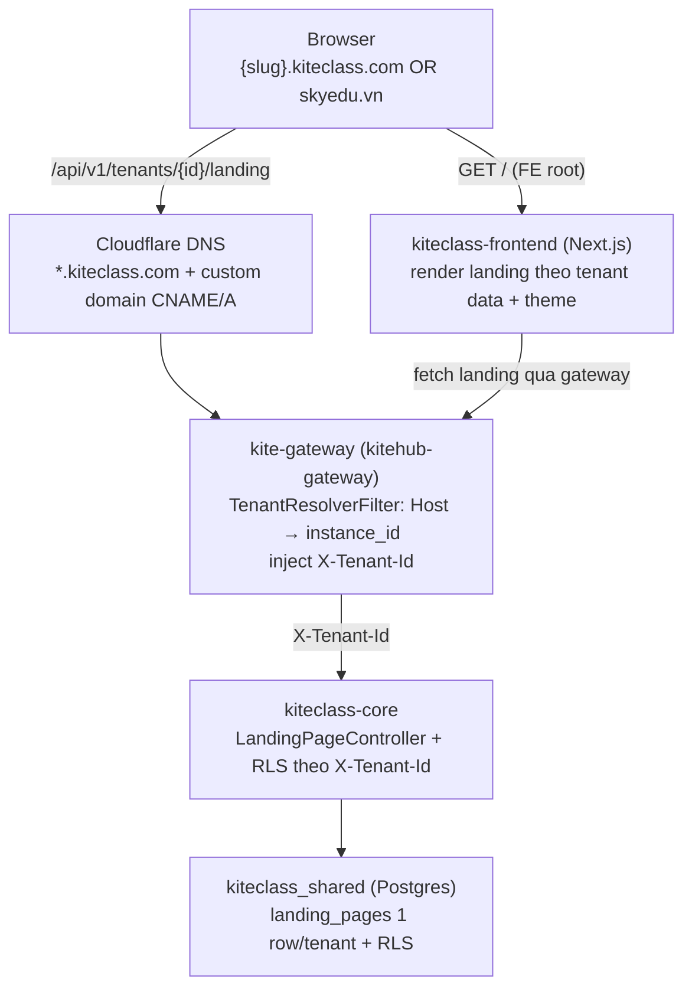
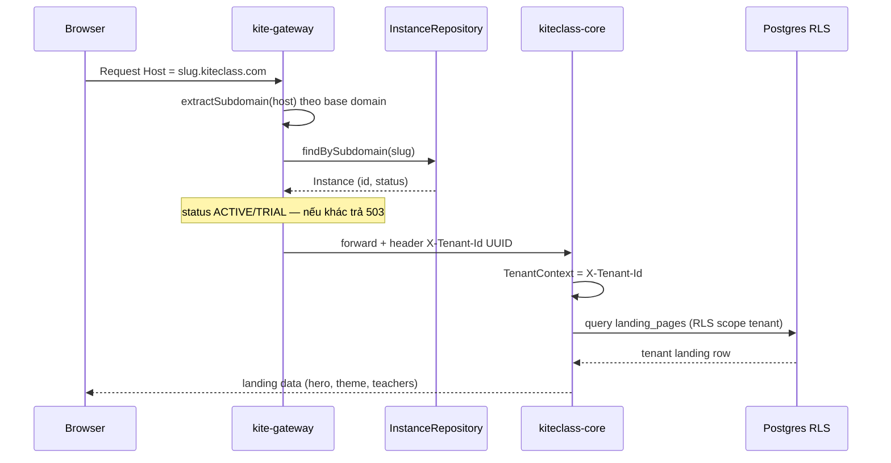

# Tenant → Domain → Landing — kiến trúc end-to-end

> **TL;DR:** Mỗi tenant (trung tâm) có 1 landing page public riêng, truy cập qua **subdomain** `{slug}.kiteclass.com` (free) hoặc **custom domain** (`skyedu.vn`, tier PREMIUM/ENTERPRISE). Cùng 1 codebase FE + 1 shared-DB (RLS) — nội dung + theme riêng theo tenant, resolve theo Host. Doc này map chuỗi đầy đủ + đánh dấu chỗ đã implement vs gap (GAP-811/812/813/814).

Nguồn: verified trên code 2026-05-29 (3 research agent + 3 outside-in agent). Cross-ref: [`multi-tenant-architecture.md`](./multi-tenant-architecture.md), [`ssl-automation.md`](./ssl-automation.md) (canonical cho SSL/verify), [`domain-management.md`](./domain-management.md), [ADR-023](./adr/ADR-023-gateway-key-resolver-strategy.md).

---

## 1. Chuỗi tổng thể

**Hai đường request:**
- `/api/**` → gateway resolve Host → tenant → core (data scoped RLS).
- `/` (FE root, trang landing) → FE Next.js render; FE tự fetch landing data qua gateway.

---

## 2. Phân tầng + trạng thái implement

| Tầng | Cơ chế (verified) | Trạng thái |
|---|---|---|
| **DNS** | Cloudflare: `*.kiteclass.com` wildcard (subdomain) + per-custom-domain record | ✅ subdomain; ⚠️ custom domain chờ GAP-812 |
| **Gateway** (`kitehub-gateway` `TenantResolverGatewayFilterFactory`) | Host → tenant 4 bước: header dev → subdomain suffix-match `${kitehub.domain.base}` → `findByCustomDomain(host)` → JWT claim fallback. Inject `X-Tenant-Id` (UUID). Gate status ACTIVE/TRIAL. | ✅ cho `/api/**`. Landing route `/api/v1/tenants/*/landing` **skip filter** (tenantId từ path). ⚠️ thiếu strip client `X-Tenant-Id` → **GAP-814 (P0 security)** |
| **Instance domain model** (`kitehub-platform` `Instance`) | `subdomain` (unique, regex, indexed) + `customDomain` + `domainVerifyToken` (TXT) + `domainStatus` (NONE→PENDING_VERIFY→VERIFIED/FAILED) | ✅ subdomain; ⚠️ custom domain entity có, DNS verify + SSL chưa wire → **GAP-812** |
| **Data isolation** | shared-DB + RLS (ADR-023); `TenantContext` từ `X-Tenant-Id`; mỗi tenant 1 `landing_pages` row (BR-MKT-001) | ✅ RLS; ⚠️ phụ thuộc `X-Tenant-Id` đáng tin → **GAP-814** |
| **FE landing render** (`kiteclass-frontend`) | Landing SSR đọc `NEXT_PUBLIC_TENANT_ID` (env cố định/deploy) + `?tenant=` dev. **Không có middleware** đọc Host. | ⚠️ **1-tenant-per-deploy** — chưa 1-FE-many-tenant by Host → **GAP-811** |

---

## 3. Domain resolution flow (sequence)

Custom domain: thay `findBySubdomain(slug)` bằng `findByCustomDomain(host)` (cùng `routeToInstance`). Apex domain cần A-record (CNAME bất hợp lệ trên root) — xem GAP-812.

---

## 4. Subdomain vs custom domain

| | Subdomain `{slug}.kiteclass.com` | Custom domain `skyedu.vn` |
|---|---|---|
| Cấp cho | Mọi tenant (free) | Tier PREMIUM/ENTERPRISE |
| DNS | Wildcard `*.kiteclass.com` (provision sẵn) | Tenant tự trỏ CNAME (subdomain) / A (apex) |
| SSL | Wildcard cert sẵn | Cloudflare for SaaS auto-issue (DCV qua CNAME) — xem `ssl-automation.md` |
| Verify ownership | Không cần | TXT/Delegated-DCV (tách khỏi routing record) |
| Trạng thái | ✅ Hoạt động | ⚠️ Scaffold — GAP-812 (DNS verify stub + SSL chưa wire) |

---

## 5. Gaps liên quan (initiative fix triệt để)

| Gap | P | Scope |
|---|---|---|
| [GAP-814](../04-quality/gaps/phase-1-beta/GAP-814-tenant-header-spoofing-gateway-strip.md) | P0 | Gateway strip client `X-Tenant-Id` (cross-tenant IDOR) — ưu tiên cao nhất |
| [GAP-813](../04-quality/gaps/phase-1-beta/GAP-813-base-domain-consistency-slug-resolution.md) | P1 | Reconcile base domain (1 env) + public `by-subdomain/{slug}→tenantId` endpoint |
| [GAP-811](../04-quality/gaps/phase-1-beta/GAP-811-fe-middleware-host-tenant-resolution.md) | P1 | FE `middleware.ts` host→tenant (1-FE-many-tenant) |
| [GAP-812](../04-quality/gaps/phase-1-beta/GAP-812-custom-domain-dns-ssl-completion.md) | P2 | Custom domain DNS verify + SSL provisioning hoàn thiện |

Thứ tự implement đề xuất: GAP-814 → GAP-813 → GAP-811 → GAP-812.

---

## 6. Điểm cần lưu ý (verified findings)

- **`@Cacheable("landingPages")` backed bằng Redis** — update landing_pages KHÔNG phản ánh tới khi `redis-cli DEL landingPages::{tenantId}` (restart core không clear). Ops note quan trọng.
- **FE hiện 1-tenant-per-deploy** — demo dùng `?tenant=` (dev-path); production-host multi-tenant chưa wire (GAP-811).
- **Custom domain entity sẵn nhưng verify trả `false` cứng + chưa SSL** — `ssl-automation.md` mô tả đúng target (Cloudflare for SaaS + CNAME DCV); code cần theo doc (GAP-812).
