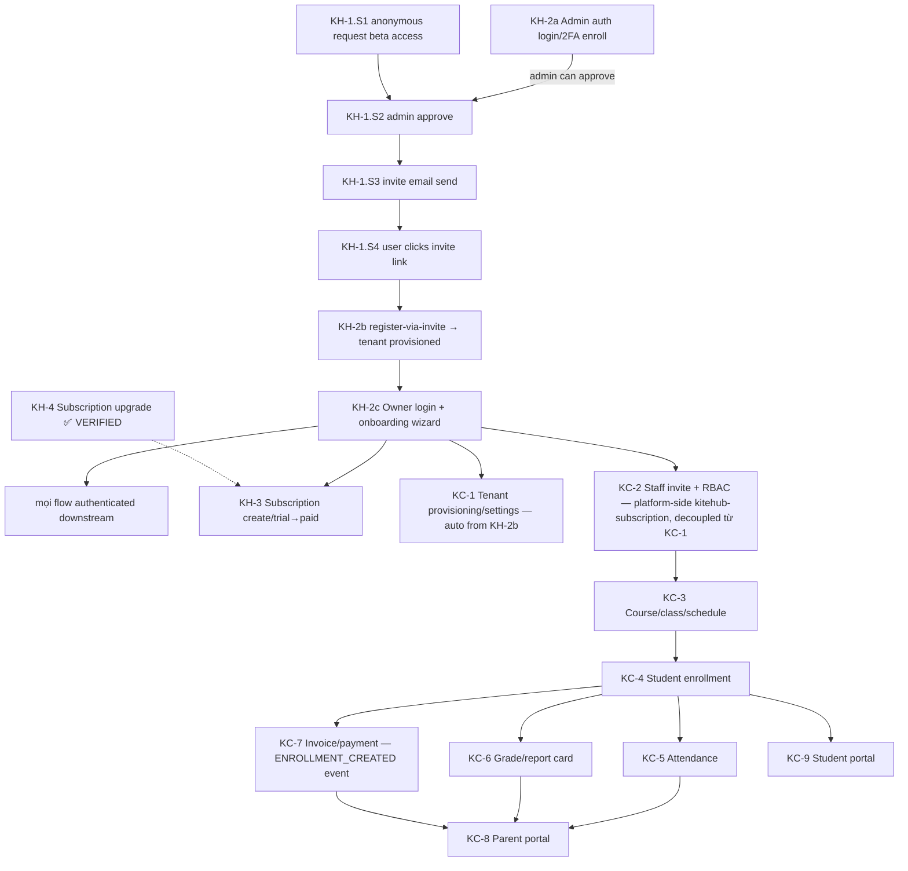

# Flow Verification Campaign

**Mục tiêu:** Thông (verify chạy end-to-end) toàn bộ ~22 user-facing flow của KiteHub + KiteClass cho Phase 1 BETA. Sau khi 22 flow ✅ mới quay lại quy trình fix-gap-theo-wave cho backlog cosmetic.

**MODE hiện tại (override default session priority):** KHÔNG pick P0 gap từ triage để fix. Thay vào đó: chọn flow chưa thông kế tiếp (theo §3 dependency order) → loop qua wave plan của flow đó → chỉ fix **blocker do walk lòi ra**. Gap KHÔNG chặn flow nhưng **NHỎ** (≤30 phút, in-scope, low-risk, verify-now-able per `small-gap-inline-fix.md` §1) → **fix inline + flip DONE cùng session** (tránh backlog tồn đọng khi bắt bug G2); chỉ defer sang wave-fix phase sau campaign các gap **LỚN / architecture / cross-cutting cần sweep+design**.

---

## 1. Định nghĩa "1 flow THÔNG" — 3 gate (tất cả phải PASS)

| Gate | Ai | Tiêu chí |
|---|---|---|
| **G1 — Agent runtime walk** | Claude | Walk end-to-end trên stack thật (Postgres + services), happy + ≥1 sad path PASS; fix mọi blocker lòi ra; evidence (HTTP + DB row + side effect). **Flow CÓ FE PHẢI gồm ≥1 browser-real walk qua FE `:3000`** (để FE tự inject auth token + tenant header + route), không chỉ curl `:9000` gắn header tay — per `g1-browser-walk-before-flip.md` §1 (bắt FE↔gateway contract / tenant-resolution / routing drift mà curl-with-manual-header che mất, vd KC-1 G2 GAP-1067/1068/1069) |
| **G2 — Human real local test** | Dev (user) | Con người tự test flow trên local stack thành công (UI/API), xác nhận trải nghiệm thật đúng — KHÔNG chỉ tin agent walk |
| **G3 — Production-parity guarantee** | Claude + Dev | Local PASS phải **đảm bảo 100% chạy production**: walk trên production-equivalent (cùng Docker image tag, Postgres+Flyway+RLS thật KHÔNG H2, gateway JWT→header auth, prod-profile config, env-var đủ). Per `local-fix-production-parity-check.md` + bài học H2-giấu-bug (GAP-914). Nếu local≠prod ở điểm nào → note + đảm bảo trước khi flip thông |

Flow chỉ `✅ THÔNG` khi G1 + G2 + G3 đều PASS. G1 đạt → `🔄 walk-pass-pending-human` chờ G2.

> **Sequencing (chốt 2026-06-06):** hoàn thành **G1 cho TẤT CẢ flow trước** (gồm ~9 secondary KH-5..10 / KC-10..12 chưa G1), **rồi dev mới mở 1 đợt G2 tập trung** (human local walk). KHÔNG interleave G2 per-flow giữa chừng — gom G1 xong toàn bộ tránh dev context-switch + tránh G2 vấp bug G1 đáng lẽ bắt được. Memory: `project_flow_campaign_g1_first_then_g2`.

---

## 2. Loop protocol mỗi flow (per `feature-ship-runtime-walk-mandate` §3.4)

```
1. Tạo wave plan cho flow (lazy — khi bắt đầu loop)
2. Stack up production-equivalent + persona credential
3. Walk → CATALOG mọi blocker đến hết walk (không rebuild giữa chừng)
4. Batch-fix P0/P1 blocker (DB drift / wiring / entity) → single rebuild
5. Re-walk full flow
6. Lặp 3-5 đến khi mọi path G1 PASS
7. Hand cho human (G2) + xác nhận parity (G3)
8. Flip flow ✅ + evidence vào wave plan + campaign table
```

Gap chặn flow lòi ra → fix tại chỗ + file gap inline (per `discovery-to-gap-inline-filing`). Gap không chặn → ghi defer, không fix trong campaign.

---

## 3. Dependency graph (re-state-checked 2026-06-04, user-facing FE production-path) — quyết định priority

**Topology revision 2026-06-04 (Wave flow-kh2 G2 handoff discovery, [GAP-919](../../04-quality/gaps/phase-1-beta/GAP-919-kh2-register-fe-gated-by-beta-funnel.md)):** Initial graph 2026-06-04 (`KH-2 → KH-1`) reflected CODE dependency (KH-1 admin approve gọi KH-2 admin auth). USER-FACING FE flow ngược lại — KH-1 anonymous request KHỞI ĐẦU user journey, KH-2 register-via-invite là CONSEQUENCE của KH-1.S5 (invite consume). Empirical verified: `/register` 307 → `/request-beta-access`; `POST /api/auth/register` BE direct CHỈ Phase 2 self-service.

**Split KH-2 vai trò:**
- **KH-2a** Admin auth (admin login + 2FA enroll) — prerequisite cho KH-1.S2 admin approve
- **KH-2b** Register-via-invite (`AuthService.registerFromBetaInvite`, `/beta-signup/code/<token>`) — actually KH-1.S5 sub-step
- **KH-2c** Owner login (post-register) + onboarding wizard — persistent user flow



**Thứ tự loop chuẩn hóa (topological — revised 2026-06-04):**
1. **KH-2a** Admin auth (prerequisite cho KH-1.S2) ✅ G1 evidence in [wave-flow-kh2](../waves/wave-2026-06-03-flow-kh2-auth-onboarding.md) S4
2. **KH-1** Beta funnel full chain (S1 anonymous → S2 admin approve → S3 email → S4 invite click → S5 register-via-invite = KH-2b)
3. **KH-2c** Owner login + onboarding wizard ✅ G1 evidence in wave-flow-kh2 S3+S5 (BE+gateway PASS)
4. Từ KH-2c (Owner exists) song song: KH-3 + KC-1 (auto from KH-2b) + **KC-2** (staff invite — platform-side, độc lập KC-1 settings). KC-3 → KC-4 → {KC-5, KC-6, KC-7 song song} → {KC-8, KC-9}. (KC-2 không block trên KC-1 G2/G3.)
5. Secondary (độc lập, sau core): KH-5/6/7/8/9/10, KC-10/11/12

---

## 4. Flow inventory + status (22 flow)

| # | Flow | Priority | Status | Wave plan | Blocker đã biết |
|---|---|---|---|---|---|
| KH-2a | Admin auth (login + 2FA enroll) — prerequisite cho KH-1.S2 | 1 | ✅ G1 PASS (BE direct verified wave-flow-kh2 S4) | [wave-2026-06-03-flow-kh2](../waves/wave-2026-06-03-flow-kh2-auth-onboarding.md) | — |
| KH-1 | Beta funnel: anonymous request → admin approve → invite email → register-via-invite (= KH-2b) → tenant provisioned | 2 | ✅ THÔNG (G1+G2+G3) — 2026-06-04 | [wave-2026-06-04-flow-kh1](../waves/wave-2026-06-04-flow-kh1-beta-funnel.md) | residual GAP-918 P2 + new GAP-920 P2 (api-contract drift) |
| KH-2c | Owner login (post-register) + onboarding wizard | 3 | ✅ THÔNG (G1+G2+G3) — 2026-06-04 | wave-flow-kh2 (S3+S5) + wave-flow-kh1 (chain) | ✅ GAP-916 DONE; residual GAP-917 P2 + GAP-918 P2 |
| KH-3 | Subscription create + trial→paid migration | 3 | 🔄 walk-pass-pending-human | [wave-2026-06-04-flow-kh3](../waves/wave-2026-06-04-flow-kh3-subscription-trial-paid.md) + [G2 recipe](../../05-guides/operations/2026-06-09-g2-recipe-kh3-subscription.md) | ✅ GAP-942 DONE (2026-06-07, Wave p0-prov-1 — POST /subscriptions BASIC LIVE PASS 201); GAP-974 (email P1 polish) |
| KH-4 | **Subscription upgrade manual VietQR + admin confirm** | — | ✅ THÔNG (G1) | — | (GAP-914 fixed) |
| KC-1 | Tenant provisioning + lifecycle + settings | 4 | 🔄 walk-pass-pending-human (provisioning-1 closure walk 2026-06-07: saga LIVE + 3/7 sub-gaps DONE — GAP-947 settings + GAP-953 admin-retry + GAP-954 PDPL purge; 3 bugs fixed live; remaining PARTIAL GAP-945/946/948/952) — 2026-06-07 | [wave-2026-06-04-flow-kc1](../waves/wave-2026-06-04-flow-kc1-tenant-provisioning-settings.md) | GAP-947/953/954 DONE; ✅ GAP-945/946/948/949 DONE (2026-06-07, Wave p0-prov-1; GAP-946 real-impl → GAP-1055 Phase 1.5); GAP-952 (CloudWatch AWS-deferred) PARTIAL |
| KC-2 | Staff invitation → accept → RBAC role | 5 | 🔄 walk-pass-pending-human (G1 PASS + FM-1 fix) + **G3 ✅ 2026-06-07** (staff-invite tenant-scoped 200 via :9000) — 2026-06-05 | [wave-2026-06-05-flow-kc2](../waves/wave-2026-06-05-flow-kc2-staff-invitation-rbac.md) | ✅ GAP-784 DONE + GAP-981 DONE (STAFF tenant fix); GAP-886 fold GAP-877; GAP-893 self-corrected |
| KC-3 | Academic: year→course→class→schedule | 6 | 🔄 walk-pass-pending-human (G1 PASS course→class→schedule + isolation fixed GAP-983) + **G3 ✅ 2026-06-07** (course/class cross-tenant 404 + list scoping A=1/B=6 + happy 200 via :9000) — 2026-06-05 | [wave-2026-06-05-flow-kc3](../waves/wave-2026-06-05-flow-kc3-academic-year-course-class-schedule.md) + [G2 recipe](../../05-guides/operations/2026-06-05-g2-recipe-kc3-academic-course-class-schedule.md) | ✅ GAP-983 P0 leak FIXED (Wave security-1) + isolation re-walk PASS; GAP-982 P1 (academic-year orphan — no controller, year API missing); GAP-909 P2 (course drift) + GAP-984 P2 (per-tenant DB unused) |
| KC-4 | Student enrollment + bulk import | 7 | 🔄 walk-pass-pending-human (G1 PASS enroll + bulk-import) + **G3 ✅ 2026-06-07** (student cross-tenant 404 via :9000) — 2026-06-05 | [wave-2026-06-05-flow-kc4](../waves/wave-2026-06-05-flow-kc4-student-enrollment-bulk-import.md) + [G2 recipe](../../05-guides/operations/2026-06-05-g2-recipe-kc4-enrollment-bulk-import.md) | ✅ GAP-988 + GAP-989 DONE (fixed pre-walk); pre-walk persona sim 12 FMs; GAP-990 P3 (K12 homeroom guard defer Phase 3) |
| KC-5 | Attendance: mark → period | 8 | 🔄 walk-pass-pending-human (G1 PASS mark single+bulk+stats; 6 bugs fixed incl P0 schema drift) + **G3 ✅ 2026-06-07** (attendance cross-tenant 404 + happy 200 via :9000) — 2026-06-05 | [wave-2026-06-05-flow-kc5](../waves/wave-2026-06-05-flow-kc5-attendance.md) + [G2 recipe](../../05-guides/operations/2026-06-05-g2-recipe-kc5-attendance.md) | ✅ GAP-991..996 DONE (authz/session-guard/EXCUSED-note/rate/enum-doc/**P0 schema drift V87**); GAP-997 P3 (no-tenant defense-in-depth defer); period K12 defer G2/Phase 3 |
| KC-6 | Grade → report card → gradebook | 8 | 🔄 walk-pass-pending-human (G1 PASS initialize→components→calculate→finalize→transcript; 88/B+/3.3) + **G3 ✅ 2026-06-07** (grade custom hasAccessToGrade + isolation adminA→B 404/adminB→own 200 via :9000) — 2026-06-05 | [wave-2026-06-05-flow-kc6](../waves/wave-2026-06-05-flow-kc6-grade.md) + [G2 recipe](../../05-guides/operations/2026-06-05-g2-recipe-kc6-grade.md) | ✅ GAP-998 (P0 grading_scales seed+drift V88, supersedes GAP-875 scaffold-close) + GAP-999 (grade authz OWASP A01) DONE; OPEN GAP-1000/1001/1002 (finalize teacherId / transcript / NULL-default provisioning) |
| KC-7 | Invoice → payment record → reconcile | 8 | 🔄 walk-pass-pending-human (G1 PASS record-payment → reconcile SENT→PARTIAL→PAID; **G3 production-parity PASS** — full gateway JWT→header→authority chain 201 via :9000; chờ G2 human) — 2026-06-05 | [pre-walk + G3](../../04-quality/audits/persona-review/2026-06-05-pre-walk-kc7-invoice-payment.md) + [G2 recipe](../../05-guides/operations/2026-06-05-g2-recipe-kc7-invoice-payment.md) | ✅ GAP-1003 P0 DONE (gateway X-User-Roles→Spring authority bridge missing — 24 endpoints dead-deny, mirror subscription XUserRolesHeaderFilter); OPEN GAP-1004 (over-payment+idempotency) + GAP-1005 (InvoiceController authz); schema-drift NEGATIVE (V79/V86/V88 resolved) — khác KC-5/KC-6 |
| KC-8 | Parent portal (child grade/attendance/fees/conduct facets) | 9 | 🔄 walk-pass-pending-human (G1 PASS BE facets — /me/children + transcript/attendance/fees/conduct + consent gate + IDOR cross-parent + 2 @PreAuthorize fix) — 2026-06-05 | [wave-2026-06-05-flow-kc8](../waves/wave-2026-06-05-flow-kc8-parent-portal.md) + [G2 recipe](../../05-guides/operations/2026-06-05-g2-recipe-kc8-parent-portal.md) | ✅ GAP-1006 P1 DONE (fees MultipleBagFetch 500 → @BatchSize); OPEN GAP-1007 P2 (role-collision IDOR defense-in-depth) + GAP-1008 P3 (payment consent asymmetry); FE wiring attendance/fees/billing mock (defer Phase 1.5); notifications stub GAP-063b. **G3 gateway-parity VERIFIED end-to-end 2026-06-06** (Wave auth-1 pull-forward Option B): parent **provisioning** (invite→redeem creates parent+link+credential) + KC-native login `/api/v1/tenant-auth/login` → gateway HS512 validate + inject X-User-Reference-Id → parent facet 200 + IDOR 403 + anti-spoof PASS via :9000. Real-provisioned parent walk (no seed) PASS. **GAP-725 parent path + GAP-798b parent reference_id producer = DONE.** Remaining (other roles): teacher/student provisioning + KC-9 build + production parity (kiteclass-core prod JWT_SECRET) |
| KC-9 | Student portal (today/grades/notif) | 9 | ⛔ **DEFERRED Phase 2** (2026-06-05) | — | Surface map: contract-first stub (BE `StudentPortalServiceImpl` empty + FE mock, GAP-269b). Defer Phase 2 gộp auth path — student LOGIN = GAP-725 Hướng C (invite+OTP); production access cùng gate Phase 2 như KC-8 G3 + GAP-798b reference_id producer. Build (BE joins + FE wiring) fold vào Phase 2 auth wave. User decision 2026-06-05. |
| KH-5 | Subscription downgrade/cancel/renew | sec | 🔄 walk-pass-pending-human (G1 PASS — 3 endpoint reachable + happy/sad path; 2 bug fix inline FM-2 NPE→400 + FM-5 downgrade corruption→400 + re-walk verify) + **G3 ✅ 2026-06-07** (GAP-1015 IDOR 403 + control 200 via :9000) — 2026-06-06 | [wave-2026-06-06-flow-kh5](../waves/wave-2026-06-06-flow-kh5-subscription-lifecycle.md) + [G2 recipe](../../05-guides/operations/2026-06-06-g2-recipe-kh5-subscription-lifecycle.md) | 🔴 GAP-1015 P0 IDOR cross-tenant + GAP-1016 P1 free-renew + GAP-1017 P1 cancel-no-suspend + GAP-1018 P2 renewal-hardening |
| KH-6 | AI Branding wizard generate→apply→approval | sec | 🔄 walk-pass-pending-human (G1 PASS — generate+job(async)+assets+apply; 2 walk-blocker fix inline Bug A outbox instance_id V58 drift + Bug B filter async/error 401) + **G3 ✅ 2026-06-07** (GAP-1019 X-Instance-Id spoof 403 via :9000) — 2026-06-06 | [wave-2026-06-06-flow-kh6](../waves/wave-2026-06-06-flow-kh6-ai-branding-wizard.md) + [G2 recipe](../../05-guides/operations/2026-06-06-g2-recipe-kh6-ai-branding-wizard.md) | 🔴 GAP-1019 P0 IDOR + GAP-1020 P1 RLS/tier + GAP-1021 P1 job-apply/SSE + GAP-1022 P2 outbox-relay |
| KH-7 | Custom domain / domain management | sec | 🔄 walk-pass-pending-human (G1 PASS — add→verify→status→delete; ceiling PENDING_VERIFY do local DNS; 3 fix inline FM-1 @PreAuthorize + FM-2 regex VN-domain + FM-5 reserved denylist) + **G3 ✅ 2026-06-07** (GAP-1023 domain IDOR 403 via :9000) — 2026-06-06 | [wave-2026-06-06-flow-kh7](../waves/wave-2026-06-06-flow-kh7-domain-management.md) + [G2 recipe](../../05-guides/operations/2026-06-06-g2-recipe-kh7-domain-management.md) | 🔴 GAP-1023 P0 PARTIAL cross-tenant IDOR (recurrence #3 w/ GAP-1015/1019) + GAP-1024 P1 verification state machine |
| KH-8 | Off-boarding + data retention (PDPL) + consent | sec | 🔄 walk-pass-pending-human (G1 PASS — consent v1/v2 + DSAR + off-boarding all reachable; no walk-blocker; FM-1/FM-3 refuted; consent v2 SECURE) + **G3 ✅ 2026-06-07** (GAP-1025 purge 403 + list-all admin-only 403 via :9000) — 2026-06-06 | [wave-2026-06-06-flow-kh8](../waves/wave-2026-06-06-flow-kh8-offboarding-pdpl-consent.md) + [G2 recipe](../../05-guides/operations/2026-06-06-g2-recipe-kh8-offboarding-pdpl-consent.md) | 🔴 GAP-1025 P0 InstanceController any-user-purge-any-instance + GAP-1026 P1 purge-409/retention-warning + GAP-1027 P2 consent-v1-IDOR |
| KH-9 | Admin console: instance/audit/beta-request mgmt | sec | 🔄 walk-pass-pending-human (G1 PASS — dashboard + instance suspend/activate + beta-requests; PLATFORM_ADMIN gate verified (inverse-authz 403); audit sub-leg bugs → gaps) + **G3 ✅ 2026-06-07** (PLATFORM_ADMIN gate owner 403/admin 200 via :9000) — 2026-06-06 | [wave-2026-06-06-flow-kh9](../waves/wave-2026-06-06-flow-kh9-admin-console.md) + [G2 recipe](../../05-guides/operations/2026-06-06-g2-recipe-kh9-admin-console.md) | 🔴 GAP-1028 P1 audit-log-500 + GAP-1029 P1 audit-completeness/table-drift + GAP-1030 P2 suspend-state-guard |
| KH-10 | Notification/email/feedback/support | sec | 🔄 walk-pass-pending-human (G1 PASS — feedback anon+owner 201 + notif-prefs defaults/mandatory-guard/bad-type + admin-email console history/stats/config/trigger + support FE links resolve; security: owner→admin 403, FM-4 header-spoof IDOR defended; no inline fix) + **G3 ✅ 2026-06-07** (GAP-1031 internal email route removed → 404 unauth via :9000) — 2026-06-06 | [wave-2026-06-06-flow-kh10](../waves/wave-2026-06-06-flow-kh10-notification-email-feedback-support.md) + [G2 recipe](../../05-guides/operations/2026-06-06-g2-recipe-kh10-notification-email-feedback-support.md) | 🔴 GAP-1031 P0 arbitrary unauthenticated email send (gateway pass-through × email zero-security) + GAP-1032 P2 failedToday-semantics + GAP-1033 P3 trigger-409-resend |
| KC-10 | Per-tenant branding wizard → approval | sec | 🔄 walk-pass-pending-human (G1 PASS — BrandingController via gateway PUT/GET/theme 200; shadowed controllers backend-verified direct :8080; IDOR cross-tenant 400 DEFENDED) + **G3 ✅ 2026-06-07** (GAP-1034 routing carve-out + GAP-1035 STAFF 403/OWNER 200 via :9000) — 2026-06-06 | [wave-2026-06-06-flow-kc10](../waves/wave-2026-06-06-flow-kc10-per-tenant-branding-wizard.md) + [G2 recipe](../../05-guides/operations/2026-06-06-g2-recipe-kc10-per-tenant-branding-wizard.md) | 🔴 GAP-1034 P0 gateway routing collision (shadows 3/5 controllers) + GAP-1035 P1 BrandingController authz A01 (STAFF mutate) + GAP-1036 P1 logo-upload 500 bucket-missing + GAP-1037 P2 SVG-XSS latent + GAP-1038 P3 approval-workflow orphan |
| KC-11 | Notification (Zalo OA+email) + document gen PDF | sec | 🔄 walk-pass-pending-human (G1 PASS — document gen pdf/xlsx/docx 200 + format-injection 400 + reports ADMIN 200/TEACHER 403; no routing collision, no doc-data IDOR; Zalo stub graceful) + **G3 ✅ 2026-06-07** (GAP-1039 reports scoped 2M not 3.5M + GAP-1040 SSRF logoUrl stripped via :9000; 2 P1 fixed) — 2026-06-06 | [wave-2026-06-06-flow-kc11](../waves/wave-2026-06-06-flow-kc11-notification-document-gen.md) + [G2 recipe](../../05-guides/operations/2026-06-06-g2-recipe-kc11-notification-document-gen.md) | ✅ GAP-1039 DONE (reports leak — instance_id predicate + fail-closed) + ✅ GAP-1040 DONE (SSRF — server-branding-wins + host allowlist); GAP-721 Zalo stub (Wave 106 reconcile, non-blocking) |
| KC-12 | Reschedule / payroll / gamification / analytics | sec | 🔄 walk-pass-pending-human (G1 PASS — reschedule happy 200 + outbox + IDOR DEFENDED + state-machine guard; payroll backend OK; gamification/analytics no walkable surface) + **G3 ✅ 2026-06-07** (payroll GAP-1041 routing → kiteclass-core /configs 200 via :9000) — 2026-06-06 | [wave-2026-06-06-flow-kc12](../waves/wave-2026-06-06-flow-kc12-reschedule-payroll-gamification.md) + [G2 recipe](../../05-guides/operations/2026-06-06-g2-recipe-kc12-reschedule-payroll.md) | 🔴 GAP-1041 P0 payroll routing collision (recurrence #3) + GAP-1042 P1 META gateway route-predicate audit + GAP-1043 P2 reschedule past-date validation |

Status: ⬜ chưa walk · 🔄 G1 pass chờ human (G2) · ✅ THÔNG (G1+G2+G3).

---

## 4.5 Khi G2 (hoặc bất kỳ walk) bắt bug — feedback loop

Quy trình chuẩn khi 1 walk (G2 human, hoặc G1 re-walk) lòi bug. Mục tiêu: fix đúng + **quyết định re-run scope theo blast radius** (không re-run thừa) + **front-load** để giảm bug walk sau bắt.

### Bước xử lý (6 bước)

```
1. File gap INLINE ngay (per discovery-to-gap-inline-filing) — gap file + CSV row cùng session
2. CLASSIFY blast radius (bảng dưới): cross-cutting-infra / cross-flow-class / single-flow
3. FIX theo class (global fix vs per-flow fix)
4. Quyết định RE-RUN SCOPE (bảng dưới)
5. SWEEP sister flow (per cross-flow-bug-class-sweep) — bug class có ở flow khác không?
6. RE-WALK CONFIRM scope bị ảnh hưởng (per pre-handoff-self-test-completeness §3) TRƯỚC khi đánh FIXED/DONE
```

> **⚠️ Bước 6 — re-walk confirm cho bug visual/layout/UX PHẢI là browser thật** (user F5 HOẶC headless), **KHÔNG `curl`** (per `g1-browser-walk-before-flip`). `curl 200` không nhìn thấy header/sidebar/footer/console/layout — đánh "FIXED" bằng curl = anti-pattern (chính miss KC-1 GAP-1071 2026-06-08: deploy fix layout rồi claim FIXED bằng `curl 200`, chưa có browser evidence). **Chưa có browser re-walk evidence → giữ trạng thái "deployed, pending confirm", KHÔNG flip DONE** (per `gap-done-discipline` §1).

### Blast-radius → re-run matrix

| Blast radius | Định nghĩa | Fix | Re-run G1/G3 scope |
|---|---|---|---|
| **Cross-cutting infra/env** | Chặn mọi flow: core không boot, docker-proxy stale, FE config (CSP/manifest/icon), cơ chế auth/tenant đồng nhất | Global 1 lần | ❌ KHÔNG re-run per-flow. Chỉ re-verify flow đang walk. Global fix benefit mọi walk sau |
| **Cross-flow class** | Cùng 1 bug-class lặp ở N flow: FE↔BE contract drift, header-injection sai, authz literal, schema drift pattern | Fix site #1 + sweep sister | ✅ Re-verify CÁC flow share class (qua sweep), không phải toàn bộ 22 |
| **Single-flow** | Chỉ flow này: 1 endpoint sai, 1 page render lỗi, 1 validation thiếu | Fix tại chỗ | ✅ Re-walk CHỈ flow đó |

### Giảm thiểu bug walk sau bắt (front-load)

- **Trước G1 flip:** `g1-browser-walk-before-flip` — browser-real walk bắt FE↔gateway/tenant/contract class TRƯỚC G2 human.
- **Trước mỗi walk:** `pre-walk-persona-simulation-mandate` — spawn Opus agent return ≥5 failure mode → batch-fix trước.
- **Static pre-CI:** detector FE→BE contract method-level (GAP-1070, đang thiếu) sẽ bắt contract-drift class trước cả walk.

### Worked example — KC-1 G2 2026-06-08

| Bug | Blast radius | Re-run |
|---|---|---|
| GAP-1066 V87 crash / GAP-1067 docker-proxy / FE console (CSP/icon/footer) / GAP-1068 tenant-mechanism | Cross-cutting | Global fix; 0 per-flow re-run; benefit mọi G2 sau |
| GAP-1069 classes/invoices 404 (FE↔BE drift) | Cross-flow class | Sweep tất cả flow (GAP-1070 detector); KC-3 + KC-7 trực tiếp |

→ Kết luận: 18 FE flow G1/G3 curl-only KHÔNG cần re-run G1 riêng — **G2 campaign chính LÀ lớp browser-verify**, đi flow-by-flow. Global fix hôm nay làm G2 sau không vấp lại.

---

## 5. Per-flow wave plan convention

Mỗi flow → 1 wave plan tag `flow` tạo **lazy** (khi bắt đầu loop), per `wave-tag-numbering-convention`:
`documents/03-planning/waves/wave-{YYYY-MM-DD}-flow-{kh2|kc4|...}-{slug}.md`. Plan chứa loop §2 + 3-gate §1 + parity §1-G3. Campaign table cột "Wave plan" link tới khi tạo.

---

## 6. Khi campaign xong (22 ✅)

Quay lại wave-based gap-fix cho backlog cosmetic còn lại (31 anomaly gap Wave 13 đa số P2/P3 + các gap non-flow-blocking). Per `meta-gap-priority` + audit-to-gap-pipeline.

## 7. Log

- **2026-06-04**: Campaign tạo. Dependency graph state-checked (auth=root, enrollment gate cho attendance/grade/invoice). 3-gate "thông" định nghĩa (agent walk + human local test + production-parity). KH-4 đã ✅ G1 (phiên billing verify, GAP-914 fixed). Order chuẩn hóa topo. Wave plan lazy per flow.
- **2026-06-03**: Loop bắt đầu KH-2 (root — initial assumption). Wave plan ship: [wave-2026-06-03-flow-kh2-auth-onboarding.md](../waves/wave-2026-06-03-flow-kh2-auth-onboarding.md). Build images + stack up + walk 5 sub-step catalog-then-batch per loop §2. 3 gaps filed (916 P0 + 917 P2 + 918 P2). **GAP-916 fix shipped** (filter Order=LOWEST_PRECEDENCE-2 để header inject sau default-filter strip). Re-walk via gateway PASS: GET+PUT `/api/v1/onboarding-progress` HTTP 200 + body OK + state update.
- **2026-06-04 (G2 handoff)**: User-flagged "Đăng ký" CTA không tồn tại trên landing. Empirical state-check: KiteHub CTA "Dùng thử miễn phí 14 ngày" → `/register` HTTP 307 → `/request-beta-access` (KH-1 beta funnel). Phase 1 BETA gate self-service register; user PHẢI qua KH-1 invite chain. **Topology revision §3** (Mermaid graph + thứ tự loop): KH-1 root user-facing, KH-2 split thành KH-2a (admin auth — prerequisite cho KH-1.S2) + KH-2b (register-via-invite — actually KH-1.S5 sub-step) + KH-2c (owner login + wizard — post-register persistent). Wave flow-kh2 G1 evidence valid cho KH-2a + KH-2c (BE+gateway PASS). KH-2b register-via-invite defer KH-1 wave next loop. GAP-919 filed for re-topology trace. KH-2 row trong §4 split thành 3 rows. Next loop = **KH-1 full funnel** (sẽ cover KH-2b register-via-invite).
- **2026-06-04 (KH-1 walk + G1 PASS)**: Wave plan ship: [wave-2026-06-04-flow-kh1-beta-funnel.md](../waves/wave-2026-06-04-flow-kh1-beta-funnel.md). Walk full chain S1-S5 + KH-2c chain trên stack (tiếp Wave flow-kh2 — không rebuild). **G1 ✅ PASS**: S1 anonymous request → S2 admin approve via gateway (GAP-916 fix verified) → S3 MailHog email "Mã truy cập Beta KiteHub" + 6-digit code 169628 → S4a exchange-claim-code → S4b validate token → S5 complete signup (BE+DB success, gateway 503 cosmetic) → owner + tenant provisioned → KH-2c login + wizard via gateway HTTP 200. 1 new gap filed [GAP-920](../../04-quality/gaps/phase-1-beta/GAP-920-api-contract-beta-signup-shape-drift.md) P2 (api-contract.md drift docs vs code). 5 blocker catalogued với workarounds. KH-1 + KH-2c rows → 🔄 walk-pass-pending-human. Next loop = **KH-3 Subscription create + trial→paid migration** (depends on Owner exists).
