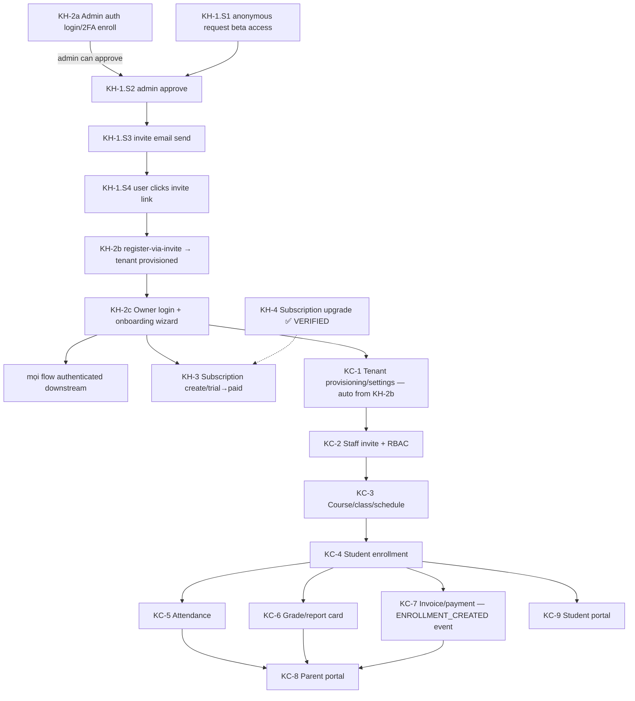

# Flow Verification Campaign

**Mục tiêu:** Thông (verify chạy end-to-end) toàn bộ ~22 user-facing flow của KiteHub + KiteClass cho Phase 1 BETA. Sau khi 22 flow ✅ mới quay lại quy trình fix-gap-theo-wave cho backlog cosmetic.

**MODE hiện tại (override default session priority):** KHÔNG pick P0 gap từ triage để fix. Thay vào đó: chọn flow chưa thông kế tiếp (theo §3 dependency order) → loop qua wave plan của flow đó → chỉ fix **blocker do walk lòi ra**. Gap KHÔNG chặn flow (cosmetic P2/P3) defer sang wave-fix phase sau campaign.

---

## 1. Định nghĩa "1 flow THÔNG" — 3 gate (tất cả phải PASS)

| Gate | Ai | Tiêu chí |
|---|---|---|
| **G1 — Agent runtime walk** | Claude | Walk end-to-end trên stack thật (Postgres + services), happy + ≥1 sad path PASS; fix mọi blocker lòi ra; evidence (HTTP + DB row + side effect) |
| **G2 — Human real local test** | Dev (user) | Con người tự test flow trên local stack thành công (UI/API), xác nhận trải nghiệm thật đúng — KHÔNG chỉ tin agent walk |
| **G3 — Production-parity guarantee** | Claude + Dev | Local PASS phải **đảm bảo 100% chạy production**: walk trên production-equivalent (cùng Docker image tag, Postgres+Flyway+RLS thật KHÔNG H2, gateway JWT→header auth, prod-profile config, env-var đủ). Per `local-fix-production-parity-check.md` + bài học H2-giấu-bug (GAP-914). Nếu local≠prod ở điểm nào → note + đảm bảo trước khi flip thông |

Flow chỉ `✅ THÔNG` khi G1 + G2 + G3 đều PASS. G1 đạt → `🔄 walk-pass-pending-human` chờ G2.

---

## 2. Loop protocol mỗi flow (per `feature-ship-runtime-walk-mandate` §3.4)

```
1. Tạo wave plan cho flow (lazy — khi bắt đầu loop)
2. Stack up production-equivalent + persona credential
3. Walk → CATALOG mọi blocker đến hết walk (không rebuild giữa chừng)
4. Batch-fix P0/P1 blocker (DB drift / wiring / entity) → single rebuild
5. Re-walk full flow
6. Lặp 3-5 đến khi mọi path G1 PASS
7. Hand cho human (G2) + xác nhận parity (G3)
8. Flip flow ✅ + evidence vào wave plan + campaign table
```

Gap chặn flow lòi ra → fix tại chỗ + file gap inline (per `discovery-to-gap-inline-filing`). Gap không chặn → ghi defer, không fix trong campaign.

---

## 3. Dependency graph (re-state-checked 2026-06-04, user-facing FE production-path) — quyết định priority

**Topology revision 2026-06-04 (Wave flow-kh2 G2 handoff discovery, [GAP-919](../../04-quality/gaps/phase-1-beta/GAP-919-kh2-register-fe-gated-by-beta-funnel.md)):** Initial graph 2026-06-04 (`KH-2 → KH-1`) reflected CODE dependency (KH-1 admin approve gọi KH-2 admin auth). USER-FACING FE flow ngược lại — KH-1 anonymous request KHỞI ĐẦU user journey, KH-2 register-via-invite là CONSEQUENCE của KH-1.S5 (invite consume). Empirical verified: `/register` 307 → `/request-beta-access`; `POST /api/auth/register` BE direct CHỈ Phase 2 self-service.

**Split KH-2 vai trò:**
- **KH-2a** Admin auth (admin login + 2FA enroll) — prerequisite cho KH-1.S2 admin approve
- **KH-2b** Register-via-invite (`AuthService.registerFromBetaInvite`, `/beta-signup/code/<token>`) — actually KH-1.S5 sub-step
- **KH-2c** Owner login (post-register) + onboarding wizard — persistent user flow



**Thứ tự loop chuẩn hóa (topological — revised 2026-06-04):**
1. **KH-2a** Admin auth (prerequisite cho KH-1.S2) ✅ G1 evidence in [wave-flow-kh2](../waves/wave-2026-06-03-flow-kh2-auth-onboarding.md) S4
2. **KH-1** Beta funnel full chain (S1 anonymous → S2 admin approve → S3 email → S4 invite click → S5 register-via-invite = KH-2b)
3. **KH-2c** Owner login + onboarding wizard ✅ G1 evidence in wave-flow-kh2 S3+S5 (BE+gateway PASS)
4. KH-3 → KC-1 (auto from KH-2b) → KC-2 → KC-3 → KC-4 → {KC-5, KC-6, KC-7 song song} → {KC-8, KC-9}
5. Secondary (độc lập, sau core): KH-5/6/7/8/9/10, KC-10/11/12

---

## 4. Flow inventory + status (22 flow)

| # | Flow | Priority | Status | Wave plan | Blocker đã biết |
|---|---|---|---|---|---|
| KH-2a | Admin auth (login + 2FA enroll) — prerequisite cho KH-1.S2 | 1 | ✅ G1 PASS (BE direct verified wave-flow-kh2 S4) | [wave-2026-06-03-flow-kh2](../waves/wave-2026-06-03-flow-kh2-auth-onboarding.md) | — |
| KH-1 | Beta funnel: anonymous request → admin approve → invite email → register-via-invite (= KH-2b) → tenant provisioned | 2 | 🔄 walk-pass-pending-human (G1 ✅) | [wave-2026-06-04-flow-kh1](../waves/wave-2026-06-04-flow-kh1-beta-funnel.md) | residual GAP-918 P2 + new GAP-920 P2 (api-contract drift) |
| KH-2c | Owner login (post-register) + onboarding wizard | 3 | 🔄 walk-pass-pending-human (G1 ✅ chain với KH-1 verified) | wave-flow-kh2 (S3+S5) + wave-flow-kh1 (chain) | ✅ GAP-916 DONE; residual GAP-917 P2 + GAP-918 P2 |
| KH-3 | Subscription create + trial→paid migration | 3 | ⬜ | — | — |
| KH-4 | **Subscription upgrade manual VietQR + admin confirm** | — | ✅ THÔNG (G1) | — | (GAP-914 fixed) |
| KC-1 | Tenant provisioning + lifecycle + settings | 4 | ⬜ | — | — |
| KC-2 | Staff invitation → accept → RBAC role | 5 | ⬜ | — | GAP-886/893 (role) |
| KC-3 | Academic: year→course→class→schedule | 6 | ⬜ | — | GAP-909 (course drift) |
| KC-4 | Student enrollment + bulk import | 7 | ⬜ | — | — |
| KC-5 | Attendance: mark → period | 8 | ⬜ | — | GAP-874 (attendance drift) |
| KC-6 | Grade → report card → gradebook | 8 | ⬜ | — | GAP-875 (grading drift) |
| KC-7 | Invoice → payment record → reconcile | 8 | ⬜ | — | 🔴 GAP-882 (CHECK) + GAP-879 |
| KC-8 | Parent portal (child grade/attendance/payment) | 9 | ⬜ | — | — |
| KC-9 | Student portal (today/grades/notif) | 9 | ⬜ | — | — |
| KH-5 | Subscription downgrade/cancel/renew | sec | ⬜ | — | — |
| KH-6 | AI Branding wizard generate→apply→approval | sec | ⬜ | — | — |
| KH-7 | Custom domain / domain management | sec | ⬜ | — | — |
| KH-8 | Off-boarding + data retention (PDPL) + consent | sec | ⬜ | — | — |
| KH-9 | Admin console: instance/audit/beta-request mgmt | sec | ⬜ | — | (1 phần qua KH-4) |
| KH-10 | Notification/email/feedback/support | sec | ⬜ | — | — |
| KC-10 | Per-tenant branding wizard → approval | sec | ⬜ | — | — |
| KC-11 | Notification (Zalo OA+email) + document gen PDF | sec | ⬜ | — | GAP-721 (Zalo stub) |
| KC-12 | Reschedule / payroll / gamification / analytics | sec | ⬜ | — | — |

Status: ⬜ chưa walk · 🔄 G1 pass chờ human (G2) · ✅ THÔNG (G1+G2+G3).

---

## 5. Per-flow wave plan convention

Mỗi flow → 1 wave plan tag `flow` tạo **lazy** (khi bắt đầu loop), per `wave-tag-numbering-convention`:
`documents/03-planning/waves/wave-{YYYY-MM-DD}-flow-{kh2|kc4|...}-{slug}.md`. Plan chứa loop §2 + 3-gate §1 + parity §1-G3. Campaign table cột "Wave plan" link tới khi tạo.

---

## 6. Khi campaign xong (22 ✅)

Quay lại wave-based gap-fix cho backlog cosmetic còn lại (31 anomaly gap Wave 13 đa số P2/P3 + các gap non-flow-blocking). Per `meta-gap-priority` + audit-to-gap-pipeline.

## 7. Log

- **2026-06-04**: Campaign tạo. Dependency graph state-checked (auth=root, enrollment gate cho attendance/grade/invoice). 3-gate "thông" định nghĩa (agent walk + human local test + production-parity). KH-4 đã ✅ G1 (phiên billing verify, GAP-914 fixed). Order chuẩn hóa topo. Wave plan lazy per flow.
- **2026-06-03**: Loop bắt đầu KH-2 (root — initial assumption). Wave plan ship: [wave-2026-06-03-flow-kh2-auth-onboarding.md](../waves/wave-2026-06-03-flow-kh2-auth-onboarding.md). Build images + stack up + walk 5 sub-step catalog-then-batch per loop §2. 3 gaps filed (916 P0 + 917 P2 + 918 P2). **GAP-916 fix shipped** (filter Order=LOWEST_PRECEDENCE-2 để header inject sau default-filter strip). Re-walk via gateway PASS: GET+PUT `/api/v1/onboarding-progress` HTTP 200 + body OK + state update.
- **2026-06-04 (G2 handoff)**: User-flagged "Đăng ký" CTA không tồn tại trên landing. Empirical state-check: KiteHub CTA "Dùng thử miễn phí 14 ngày" → `/register` HTTP 307 → `/request-beta-access` (KH-1 beta funnel). Phase 1 BETA gate self-service register; user PHẢI qua KH-1 invite chain. **Topology revision §3** (Mermaid graph + thứ tự loop): KH-1 root user-facing, KH-2 split thành KH-2a (admin auth — prerequisite cho KH-1.S2) + KH-2b (register-via-invite — actually KH-1.S5 sub-step) + KH-2c (owner login + wizard — post-register persistent). Wave flow-kh2 G1 evidence valid cho KH-2a + KH-2c (BE+gateway PASS). KH-2b register-via-invite defer KH-1 wave next loop. GAP-919 filed for re-topology trace. KH-2 row trong §4 split thành 3 rows. Next loop = **KH-1 full funnel** (sẽ cover KH-2b register-via-invite).
- **2026-06-04 (KH-1 walk + G1 PASS)**: Wave plan ship: [wave-2026-06-04-flow-kh1-beta-funnel.md](../waves/wave-2026-06-04-flow-kh1-beta-funnel.md). Walk full chain S1-S5 + KH-2c chain trên stack (tiếp Wave flow-kh2 — không rebuild). **G1 ✅ PASS**: S1 anonymous request → S2 admin approve via gateway (GAP-916 fix verified) → S3 MailHog email "Mã truy cập Beta KiteHub" + 6-digit code 169628 → S4a exchange-claim-code → S4b validate token → S5 complete signup (BE+DB success, gateway 503 cosmetic) → owner + tenant provisioned → KH-2c login + wizard via gateway HTTP 200. 1 new gap filed [GAP-920](../../04-quality/gaps/phase-1-beta/GAP-920-api-contract-beta-signup-shape-drift.md) P2 (api-contract.md drift docs vs code). 5 blocker catalogued với workarounds. KH-1 + KH-2c rows → 🔄 walk-pass-pending-human. Next loop = **KH-3 Subscription create + trial→paid migration** (depends on Owner exists).
