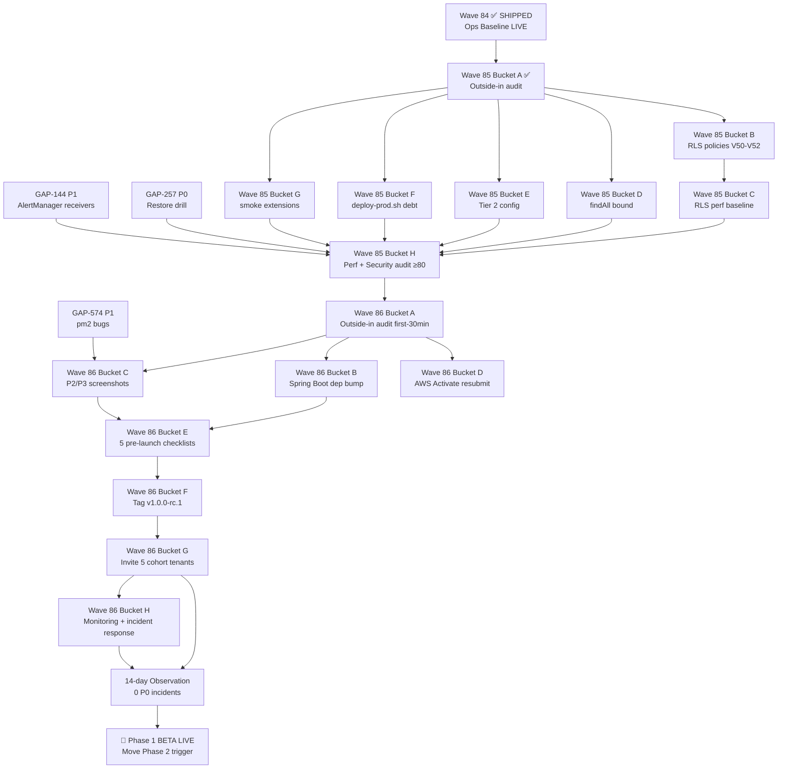

# Phase 1 BETA Launch Readiness Runbook (2026-05-15)

> **Mục đích:** Consolidate single executable checklist từ điểm hiện tại tới Phase 1 BETA gate (quality ≥80 + 5 beta tenants live + 0 P0 trong 2 tuần). Aggregates Wave 85 + Wave 86 + carry-forward P0 + outside-in audit findings + tenant onboarding track.
>
> **Scope:** READ-ONLY consolidation; không file gap mới, không sửa wave plan. Update ROADMAP §🚀 với pointer.
>
> **Status:** Wave 84 SHIPPED (ops baseline LIVE). Wave 85 + Wave 86 = remaining critical path. Estimated realistic ETA tới BETA-LIVE = ~5-7 tuần (12-16h Wave 85 + 14-20h Wave 86 + tenant onboard + 2-week observation window).

---

## 1. Gate Criteria (canonical per CLAUDE.md §CURRENT PHASE)

Phase 1 BETA → Phase 2 trigger yêu cầu **đồng thời** 3 conditions:

| # | Condition | Current Status | Verdict |
|---|---|---|---|
| 1 | **Quality audit /100 ≥ 80** | Wave 53 last refresh = **87/100 / 80 tech-only** B+ (PR #1107, 2026-05-11). Wave 83 partial refresh: Security 90/100 A-, API 82/100 B, Performance 81/100 B, Business 71/100 C, UI 112/128 A+. Ops 78/100 C+ Wave 84 post-apply. | ⚠️ **At threshold** — Tech-only đã đạt; Ops 78 (<80) chặn aggregate. Cần Wave 85 Bucket H refresh để confirm post-RLS + perf bounded baseline ≥80 mọi cat. |
| 2 | **5 beta tenants live** | 0 tenants invited. GAP-372 beta-invite mechanism DONE (Wave 45). Resend production DKIM verified Wave 83. Pending: tenant candidate identify + Wave 86 Bucket G invite execution. | ❌ **Not started** — chặn bởi Wave 86 Bucket G (depends on Wave 85 + Wave 86 Buckets A-F). |
| 3 | **0 P0 incidents trong 2 tuần observation** | Clock chưa start. 21 P0 PARTIAL gaps remaining (xem §2). 1 P0 carry-forward GAP-257 (restore drill) chặn Phase 1 BETA gate per Wave 84 ops audit. | ❌ **Clock chưa start** — observation window bắt đầu sau Wave 86 Bucket G (5 tenants invited). |

**Verdict tổng:** ⚠️/❌ — Tech-only quality đạt, nhưng 2/3 conditions chặn bởi Wave 85 + Wave 86 + observation window 2 tuần.

---

## 2. Remaining Tech Work — Priority-Ordered List

Sắp xếp theo **critical path → BETA-LIVE**. Wave 85 buckets (8 items) → Wave 86 buckets (8 items) → carry-forward blockers (3 items) → P0 PARTIAL gap closure (21 items grouped).

### 2.1 Wave 85 — Multi-tenant Security + Performance (12-16h)

> **Trigger:** Wave 84 ops baseline CLOSED ✅. Ready to start.

| # | Item | Owner | Effort | Dependencies | Status |
|---|---|---|---|---|:---:|
| 1 | **Wave 85 Bucket A — Outside-in audit** (persona-based-business-review + simulation-3axis) | parallel agents | 1h | None | ✅ DONE (artifacts shipped 2026-05-15) — 3 P0 NEW + 5 P1/P2 NEW gaps surfaced |
| 2 | **Wave 85 Bucket B — GAP-466 RLS policies V50-V52** (Postgres Row-Level Security) | coordinator | 4-5h | Bucket A AC additions (admin-bypass mechanism) | 🆕 to-be-started |
| 3 | **Wave 85 Bucket C — GAP-469 RLS performance baseline** (EXPLAIN ANALYZE ≤10% overhead) | coordinator | 1-2h | After Bucket B | 🆕 to-be-started |
| 4 | **Wave 85 Bucket D — GAP-432 bound 3 findAll()** (Analytics + Payment + Instance pagination) | coordinator | 2-3h | Parallel Bucket B | 🆕 to-be-started |
| 5 | **Wave 85 Bucket E — GAP-503 Tier 2 config** (JVM ergonomics + Tomcat threads + HikariCP + healthcheck) | coordinator | 2h | Parallel | 🆕 to-be-started |
| 6 | **Wave 85 Bucket F — GAP-506 deploy-prod.sh tech debt** (bootstrap path separation) | coordinator | 1h | Parallel | 🆕 to-be-started |
| 7 | **Wave 85 Bucket G — GAP-475 smoke test extensions** (6 scenarios: login + email + MFA + P95 + migration + rollback) | coordinator | 2-3h | Parallel | 🆕 to-be-started |
| 8 | **Wave 85 Bucket H — Performance /100 + Security /100 v2 audit refresh** (target ≥80) | auditor | 1-2h | After all Wave 85 buckets | 🆕 to-be-started |

**Wave 85 sub-total: 13-18h sequential coordinator effort (parallelism reduces to ~12-16h wall-clock).**

### 2.2 Wave 86 — RC1 Tag Preflight + Beta Cohort Invite (14-20h)

> **Trigger:** Wave 85 CLOSED.

| # | Item | Owner | Effort | Dependencies | Status |
|---|---|---|---|---|:---:|
| 9 | **Wave 86 Bucket A — Outside-in audit** (persona + benchmark + simulation focus first-30-min UX) | parallel agents | 1h | Wave 85 closed | 🆕 to-be-started |
| 10 | **Wave 86 Bucket B — GAP-440 Spring Boot dep bump + smoke** | coordinator | 2-3h | After Bucket A | 🆕 to-be-started |
| 11 | **Wave 86 Bucket C — GAP-537c P2 Owner + P3 Manager screenshots** (14 screens + Tier 2 annotation + PDF) | coordinator + Playwright | 2-3h | Parallel Bucket B | 🆕 to-be-started |
| 12 | **Wave 86 Bucket D — GAP-412 AWS Activate $1k credit resubmit** | user-action AWS Console | 30min | Parallel | 🆕 to-be-started (3rd attempt) |
| 13 | **Wave 86 Bucket E — 5 pre-launch hardening checklist verification** (auth + secrets + OWASP REST + infra + dep) | coordinator | 3-4h | After Bucket A-D | 🆕 to-be-started |
| 14 | **Wave 86 Bucket F — Tag v1.0.0-rc.1 + automated release CI** | user-action + coordinator | 1h | After Bucket E | 🆕 to-be-started |
| 15 | **Wave 86 Bucket G — Invite 5 beta cohort tenants** (2 P1 Solo + 3 P2 Owner via Resend production) | user-action + coordinator | 1-2h | After Bucket F + DNS warm | 🆕 to-be-started |
| 16 | **Wave 86 Bucket H — Post-cohort monitoring + first-incident response plan** | coordinator | 2h | After Bucket G | 🆕 to-be-started |

**Wave 86 sub-total: 12-15h coordinator effort (~14-20h wall-clock với user-action gaps).**

### 2.3 Carry-Forward P0 Blockers (chặn Phase 1 BETA gate aggregate ≥80)

| # | Item | Reference | Owner | Effort | Dependencies | Status |
|---|---|---|---|---|---|:---:|
| 17 | **Restore drill chưa execute** | GAP-257 (P0 carry, Wave 84 Ops Audit flagged) | coordinator + user (RDS console) | 2-3h | RDS snapshot daily đã có baseline | ❌ chặn ops aggregate ≥80 |
| 18 | **AlertManager receivers chưa wire** | GAP-144 (P1 carry, Wave 84 Ops Audit flagged) | coordinator | 1-2h | Wave 84 SNS topics đã có | ❌ ops 78→cần +2 |
| 19 | **pm2-ecosystem.config.js 3 bugs** | GAP-574 (P1 from Wave 82 closure) | coordinator | 30min-1h | Affects mọi future FE deploy | ❌ chặn FE redeploys |

### 2.4 Outside-in audit Wave 85 — 3 P0 NEW + 5 P1/P2 NEW (priority defer Wave 86 cohort consideration)

Persona audit surface 3 P0 chặn GA Phase 2 (not Phase 1 BETA strict). Recommend integrate vào Wave 86 Bucket A AC enhancement OR defer Phase 2:

| # | Item | Severity | Recommendation |
|---|---|:---:|---|
| 20 | **Platform Admin hardening** (MFA + IP allowlist + 30min session + immutable admin audit) | P0 (4.3 + 4.1/4.5) | **Recommend defer GA Phase 2** — Phase 1 BETA scope = 5 trusted tenants + 1 platform admin (chính dev); risk acceptable với access control runbook |
| 21 | **P2 Owner mandatory 2FA + new-device email alert** | P0 (2.3) | **Recommend Wave 86 Bucket C AC enhancement** — paired với invite-staff flow; 2FA opt-in v1 + mandatory Phase 2 |
| 22 | **RLS admin-bypass mechanism + bypass audit log** | P0 (4.1 / 4.5) | **MUST add Wave 85 Bucket B AC** — paired same-migration V52 với `kitehub_admin` role BYPASSRLS + `admin_audit_logs` immutability |
| 23 | **Soft-delete + 7-day restore window** | P1 (1.4) | Defer GA Phase 2 — Phase 1 BETA acceptable manual admin restore via support |
| 24 | **P2 Owner audit-log FE dashboard** | P1 (2.5) | Defer Wave 87+ (post-BETA polish) |

### 2.5 P0 PARTIAL gap closure (21 items — Phase 1 BETA scope)

Pre-existing P0 PARTIAL gaps grouped by completion %:

- **≥90% (10 items, mostly cosmetic/audit closure):** GAP-370 (95%), GAP-502 (90%), GAP-514 (90%), GAP-518 (90%), GAP-533 (80%), GAP-539 (90%), GAP-562 (90%), GAP-562b (85%) — close trong Wave 85/86 sweep.
- **60-85% (8 items):** GAP-534 (80%), GAP-540 (80%), GAP-541 (60%), GAP-542 (80%), GAP-538 (85%), GAP-535 (70%), GAP-536 (65%), GAP-566 (60%) — close trong Wave 86 Bucket E pre-launch verification.
- **<60% (3 items high-risk):** GAP-543 (40% email content audit) + GAP-530 (10% email E2E verify) + GAP-567 (50% Certbot DNS-01) — chặn cohort invite, MUST close Wave 86 Bucket B-E.
- **75% META:** GAP-508 (production env config registry meta-gap) — track 6 systemic P0 bugs class.

**Closure effort estimate:** ~8-12h sweep paralellizable trong Wave 85/86 buckets.

### Grand Total Effort

| Bucket | Effort |
|---|---|
| Wave 85 (8 buckets, 1 done) | 13-18h |
| Wave 86 (8 buckets) | 12-15h |
| Carry-forward P0/P1 (3 items) | 4-7h |
| P0 PARTIAL sweep (21 gaps) | 8-12h (parallelized với Wave 85/86) |
| **Total tech work** | **~37-52h coordinator effort** |
| **Wall-clock (parallelism, user-action gaps)** | **~30-40h spread 3-4 weeks** |

---

## 3. Tenant Onboarding Track

### 3.1 Tenant candidate identification

GAP-372 beta-invite mechanism **DONE Wave 45** (request form + manual approval + claim-code flow). Resend production DKIM verified Wave 83. **Cohort list chưa lock.**

**Recommendation 5 beta tenants** (cần user xác nhận từ invite waitlist):
- **2 P1 Solo Teacher** (English center freelance, ~10-30 students mỗi người)
  - Tiêu chí: VN edu trainer độc lập, tech-savvy, sẵn sàng feedback
  - Source: Invite waitlist filtered by `persona=P1_SOLO_TEACHER`
- **3 P2 Center Owner** (small center 50-100 students, chủ thực sự own data)
  - Tiêu chí: Trung tâm Anh ngữ / Toán / Văn hoá nhỏ, 1 chi nhánh, có nhân viên ≤5
  - Source: Invite waitlist filtered by `persona=P2_CENTER_OWNER`

**Action item:** User cần curate 5 candidates từ waitlist trước Wave 86 Bucket G (~1-2 tuần lead time).

### 3.2 Invite mechanism status

| Component | Status | Reference |
|---|:---:|---|
| Request beta access form | ✅ DONE | GAP-372 Wave 45 |
| Manual approval workflow | ✅ DONE | InvitationController + admin dashboard Wave 80 |
| Claim-code flow + HMAC token TTL 7d | ✅ DONE | GAP-561 Wave 80 |
| Resend production DKIM/DMARC/SPF | ✅ DONE (95%) | GAP-533 Wave 83 |
| Welcome email template | ⚠️ PARTIAL | GAP-543 email content audit (40%) + GAP-541 i18n Vietnamese (60%) |
| Day-1 onboarding checklist + sample data seed | ⚠️ PARTIAL | GAP-538 (85%) |
| Beta disclaimer banner + /beta-status page | ⚠️ PARTIAL | GAP-539 (90%) |
| Feedback channel (in-app widget + day-7/14 email survey) | ⚠️ PARTIAL | GAP-542 (80%) |

**Tenant prep runbook:** `documents/05-guides/operations/beta-onboarding-runbook.md` (cần verify exists hoặc create Wave 86 Bucket G).

### 3.3 ETA per tenant cohort

- **T-7 days trước Wave 86 Bucket F (rc1 tag):** User lock cohort list từ waitlist + dry-run invite email render.
- **T-0 Bucket G:** Send 5 invites via Resend production (~30min batch).
- **T+1h:** Monitor Resend dashboard delivery + click rate.
- **T+24h:** Verify ≥3/5 tenants signup completed.
- **T+7 days:** Day-7 feedback email survey auto-send.

---

## 4. Observation Window (2-week 0-P0)

### 4.1 Clock start

**Clock start = Wave 86 Bucket G complete (5 tenants invited + signup completed ≥3/5).** Per CLAUDE.md `5 beta tenants live` requires actual usage, không phải invite-only.

### 4.2 P0 definition trong observation window

P0 incident (chặn move Phase 2) = ANY of:
- Production data loss (tenant data corrupted/deleted không thể restore <4h TTR)
- Cross-tenant data leak (RLS bypass surfaced)
- Auth bypass (anonymous user access protected resource)
- Payment data leak (PII billing exposed)
- Production down >30min không có rollback
- PDPL Art compliance violation (consent/audit missing)

### 4.3 Escalation runbook

Reference: `documents/05-guides/operations/incident-response-runbook.md` §8 (Wave 84 Bucket A added).

**SLA targets (per Wave 86 Bucket H):**
- MTTD (mean time to detect): <30 min (Grafana alarms + SNS topics Wave 84)
- MTTR (mean time to recover): <2h (rollback.yml Wave 63 + smoke-rollback-cycle.sh)

**Rollback path:** `gh workflow run rollback.yml -f target_sha=<sha> -f confirm=APPLY -f dry_run=false` per `release-deploy-standard.md` §4.4.

### 4.4 Reset condition

Nếu P0 incident xảy ra trong 14-day window:
1. Root-cause + fix + post-mortem audit shipped
2. Reset 14-day clock từ post-mortem closure date
3. File reset trong ROADMAP §🎯 Snapshot

---

## 5. Dependency Graph

**Critical path:** W84 → W85A → W85B → W85C → W85H → W86A → W86E → W86F → W86G → 14d OBS → BETA-LIVE.

---

## 6. Critical Path + ETA

### 6.1 Optimistic (no blockers, parallel execution clean)

| Phase | Wall-clock | Cumulative |
|---|---|---|
| Wave 85 (Bucket B-H) | 12h | T+1.5 days |
| Wave 86 (Bucket A-F) | 10h | T+3 days |
| Wave 86 Bucket G invite + signup | 1 day | T+4 days |
| 14-day observation | 14 days | **T+18 days (~2.5 weeks)** |

### 6.2 Realistic (solo-dev, user-action gaps, normal blockers)

| Phase | Wall-clock | Cumulative |
|---|---|---|
| Wave 85 closure | 5-7 days (paralellizable) | T+1 week |
| Wave 86 closure | 7-10 days | T+2-2.5 weeks |
| Cohort identify + invite + signup | 3-5 days | T+3 weeks |
| 14-day observation | 14 days | **T+5 weeks** |

### 6.3 Pessimistic (P0 incident reset, AWS Activate 3rd denial, RLS regression)

| Phase | Wall-clock | Cumulative |
|---|---|---|
| Wave 85 với RLS perf regression fix | 2 weeks | T+2 weeks |
| Wave 86 với Spring Boot dep regression | 1.5 weeks | T+3.5 weeks |
| 1 P0 incident reset observation | +14 days | T+5.5 weeks |
| 14-day observation final | 14 days | **T+7.5 weeks** |

**Recommendation: communicate realistic ETA = 5-7 tuần** (mid-June 2026).

---

## 7. Top 5 Risks

| # | Risk | Severity | Mitigation |
|---|---|:---:|---|
| 1 | **3 P0 NEW outside-in audit findings** (admin hardening + P2 2FA + RLS admin-bypass) — Wave 86 vs Phase 2 defer decision | 🔴 P0 | RLS admin-bypass (4.1/4.5) MUST add Wave 85 Bucket B AC; P2 2FA Wave 86 Bucket C enhancement; Admin hardening Phase 2 acceptable với access runbook |
| 2 | **GAP-257 restore drill chưa execute** (P0 carry, Wave 84 audit) — chặn ops aggregate ≥80 | 🔴 P0 | Schedule trong Wave 85 Bucket H window (RDS snapshot test + runbook validation, 2-3h) |
| 3 | **GAP-144 AlertManager receivers chưa wire** (P1 carry) — chặn ops 78→80+ | 🟠 P1 | Wave 85 Bucket H paired-fix (1-2h, SNS topics đã sẵn từ Wave 84) |
| 4 | **GAP-574 pm2 bugs** — chặn mọi future FE deploys | 🟠 P1 | Fix trước Wave 86 Bucket C screenshot capture (30min); P2 Owner FE rebuild cần PM2 working |
| 5 | **14-day observation reset risk** — P0 incident any time = +14 days delay | 🟡 P2 | Wave 86 Bucket H monitoring + rollback runbook tested + cohort = 5 trusted tenants giảm exposure |

---

## 8. Recommended Next Action (User Execute Ngay)

### Action 1: Start Wave 85 — Bucket B RLS migrations V50-V52 (4-5h coordinator)

Wave 85 Bucket A outside-in audit ✅ COMPLETE. Bucket B là critical path entry. Pre-requisite: ensure outside-in 3 P0 findings integrated:
- Bucket B AC: thêm `kitehub_admin` Postgres role BYPASSRLS + `admin_audit_logs` table immutability (V52)
- Bucket B AC: thêm automated cross-tenant pentest script (ship trong Bucket G smoke)

**Trigger:** `bash scripts/start-wave.sh 85` hoặc spawn coordinator agent với Wave 85 plan reference.

### Action 2: Schedule GAP-257 restore drill (2-3h, RDS snapshot test)

Carry-forward P0 chặn ops aggregate ≥80. Execute parallel với Wave 85 Bucket B (independent dependency). Reference: `documents/05-guides/operations/secrets-rotation-runbook.md` + RDS snapshot daily baseline đã có.

**Trigger:** User schedule maintenance window (~1h evening) + run drill script.

### Action 3: Curate 5 beta cohort candidates từ invite waitlist (~30min user-action)

Tenant onboarding track không chặn Wave 85/86 tech work, nhưng cần lead time ~1-2 tuần. User review waitlist + filter 2 P1 Solo + 3 P2 Owner candidates. Khi Wave 86 Bucket F ships tag v1.0.0-rc.1, list ready cho Bucket G invite.

**Trigger:** Mở admin dashboard `/admin/beta-requests` → filter persona + curate top 5.

---

## 9. Cross-link

- Wave 85 plan: `documents/03-planning/waves/wave-2026-05-15-85-multi-tenant-security-perf.md`
- Wave 86 plan: `documents/03-planning/waves/wave-2026-05-15-86-rc1-tag-preflight.md`
- Outside-in audit Wave 85: `documents/04-quality/audits/persona-review/2026-05-15-pre-wave-85-persona-outside-in.md`
- Release Lần 1 plan: `documents/03-planning/roadmap/release-1-plan-2026.md`
- CLAUDE.md §CURRENT PHASE — Phase 1 BETA trigger criteria
- ROADMAP §🚀 Next Action — Wave 82 follow-ups + Wave 85/86 staging
- `release-deploy-standard.md` §3.4 + §4.4 (MAJOR + first PROD + rollback)
- `post-wave-audit-mandate.md` §2.4 (domain-milestone audit cadence)

---

## 10. Log

- **2026-05-15:** Runbook created in response to user request "consolidate Phase 1 BETA launch readiness checklist — single executable runbook prioritized + ETAs + dependency graph". Aggregates Wave 85 (8 buckets, 12-16h) + Wave 86 (8 buckets, 14-20h) + 3 carry-forward P0/P1 + 21 P0 PARTIAL closure + outside-in audit 3 P0 NEW findings + tenant onboarding track. Realistic ETA tới BETA-LIVE = 5-7 tuần (mid-June 2026 ~). Top 3 blockers: outside-in audit 3 P0 (admin/2FA/RLS-bypass) + GAP-257 restore drill + GAP-574 pm2 bugs. Next 3 actions: start Wave 85 Bucket B → schedule GAP-257 drill → curate 5 cohort candidates.
